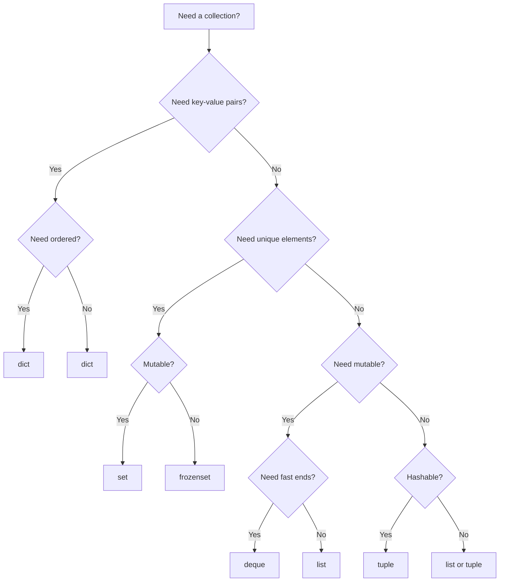
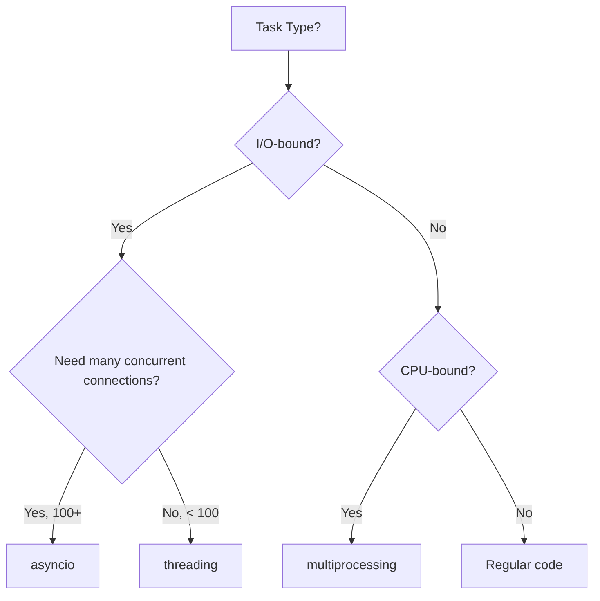
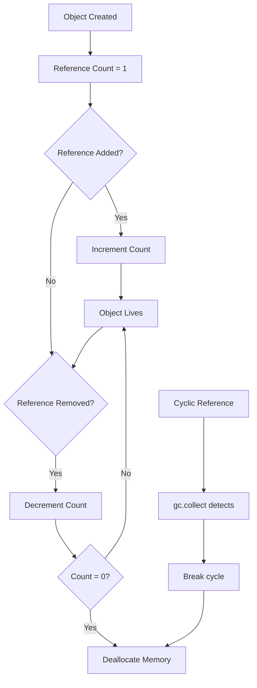

## 1. Introduction

Python is one of the most popular languages for technical interviews due to its clean syntax, rich standard library, and readability. It's the primary language for data science, machine learning, and scripting, and is widely accepted in coding interviews at FAANG companies.

Python's conciseness allows you to focus on algorithmic thinking rather than language boilerplate. However, Python has unique behaviors that interviewers love to test — variable scoping, mutable default arguments, the GIL, and Pythonic idioms that distinguish experienced Python developers.

This module covers Python data structures, OOP, advanced features (generators, decorators, context managers), the collections module, concurrency, and common Python interview questions. Master these concepts to write clean, Pythonic code in interviews.

---

## 2. Learning Roadmap

### Phase 1: Fundamentals (Week 1-2)
- [ ] Master Python data structures (list, dict, set, tuple)
- [ ] Understand list comprehensions and generator expressions
- [ ] Learn string manipulation and formatting
- [ ] Practice file handling and context managers
- [ ] Solve 20 basic Python interview questions

### Phase 2: OOP and Advanced Features (Week 3-4)
- [ ] Master Python OOP (classes, inheritance, magic methods)
- [ ] Learn decorators (function and class-based)
- [ ] Understand generators and iterators
- [ ] Practice with collections module (Counter, defaultdict, deque, namedtuple)
- [ ] Solve 20 intermediate Python interview questions

### Phase 3: Concurrency and Internals (Week 5-6)
- [ ] Learn threading vs multiprocessing in Python
- [ ] Understand the GIL and its implications
- [ ] Master asyncio basics
- [ ] Learn memory management and garbage collection
- [ ] Study common Python gotchas and edge cases

### Phase 4: Interview Mastery (Week 7-8)
- [ ] Solve 30+ Python-specific interview questions
- [ ] Practice writing Pythonic code under time pressure
- [ ] Study Python optimization techniques
- [ ] Mock interviews with Python-focused questions
- [ ] Review Python internals and CPython implementation details

---

## 3. Theory Notes

### 3.1 Python Data Structures

| Structure | Mutable | Ordered | Duplicates | Lookup | Insert | Delete |
|-----------|---------|---------|------------|--------|--------|--------|
| list | Yes | Yes | Yes | O(n) | O(1) amortized | O(n) |
| dict | Yes | Yes* | No keys | O(1) | O(1) | O(1) |
| set | Yes | No | No | O(1) | O(1) | O(1) |
| tuple | No | Yes | Yes | O(n) | N/A | N/A |
| frozenset | No | No | No | O(1) | N/A | N/A |

*Python 3.7+ guarantees dict insertion order

### 3.2 List vs Tuple vs Set vs Dict

**Use list when:** You need an ordered, mutable sequence with duplicates.
**Use tuple when:** You need an ordered, immutable sequence (hashable, can be dict key).
**Use set when:** You need unique elements with fast membership testing.
**Use dict when:** You need key-value mapping with fast lookup.

### 3.3 Python Scope (LEGB Rule)

```
L — Local: Inside current function
E — Enclosing: In enclosing function (closures)
G — Global: Module level
B — Built-in: Python built-in names
```

### 3.4 Mutable Default Arguments

A classic Python gotcha:

```python
# BUG: Default list is shared across calls
def append_to(item, lst=[]):
    lst.append(item)
    return lst

# CORRECT: Use None as default
def append_to(item, lst=None):
    if lst is None:
        lst = []
    lst.append(item)
    return lst
```

---

## 4. Key Concepts

### 4.1 List Comprehensions

```python
# Basic
squares = [x**2 for x in range(10)]

# With condition
evens = [x for x in range(20) if x % 2 == 0]

# Nested
matrix = [[i*j for j in range(5)] for i in range(5)]

# Flatten
nested = [[1, 2], [3, 4], [5, 6]]
flat = [x for sublist in nested for x in sublist]

# Dict comprehension
word_lengths = {word: len(word) for word in ["hello", "world"]}

# Set comprehension
unique_lengths = {len(word) for word in ["hello", "world", "hi"]}
```

### 4.2 Generators and Iterators

```python
# Generator function (lazy evaluation)
def fibonacci():
    a, b = 0, 1
    while True:
        yield a
        a, b = b, a + b

# Generator expression (memory efficient)
sum_of_squares = sum(x**2 for x in range(1000000))

# Generator pipeline
def read_large_file(path):
    with open(path, 'r') as f:
        for line in f:
            yield line.strip()

def filter_comments(lines):
    for line in lines:
        if not line.startswith('#'):
            yield line

# Usage
lines = read_large_file('huge_file.txt')
code_lines = filter_comments(lines)
```

### 4.3 Decorators

```python
# Function decorator
import functools
import time

def timer(func):
    @functools.wraps(func)
    def wrapper(*args, **kwargs):
        start = time.time()
        result = func(*args, **kwargs)
        print(f"{func.__name__} took {time.time() - start:.4f}s")
        return result
    return wrapper

# Parameterized decorator
def retry(max_attempts=3):
    def decorator(func):
        @functools.wraps(func)
        def wrapper(*args, **kwargs):
            for attempt in range(max_attempts):
                try:
                    return func(*args, **kwargs)
                except Exception as e:
                    if attempt == max_attempts - 1:
                        raise
                    print(f"Attempt {attempt + 1} failed: {e}")
        return wrapper
    return decorator

@timer
def slow_function():
    time.sleep(1)

@retry(max_attempts=5)
def unreliable_function():
    import random
    if random.random() < 0.5:
        raise ValueError("Random failure")
```

### 4.4 Context Managers

```python
# Class-based context manager
class FileManager:
    def __init__(self, filename, mode):
        self.filename = filename
        self.mode = mode
        self.file = None
    
    def __enter__(self):
        self.file = open(self.filename, self.mode)
        return self.file
    
    def __exit__(self, exc_type, exc_val, exc_tb):
        if self.file:
            self.file.close()

# Function-based context manager
from contextlib import contextmanager

@contextmanager
def timer(label):
    start = time.time()
    yield
    print(f"{label}: {time.time() - start:.4f}s")

# Usage
with timer("Loop"):
    total = sum(range(1000000))
```

### 4.5 Collections Module

```python
from collections import Counter, defaultdict, deque, namedtuple, OrderedDict

# Counter
words = ["apple", "banana", "apple", "cherry"]
word_count = Counter(words)  # Counter({'apple': 2, 'banana': 1, 'cherry': 1})
word_count.most_common(2)     # [('apple', 2), ('banana', 1)]

# defaultdict
graph = defaultdict(list)
graph['A'].append('B')  # No KeyError

# deque (O(1) append/pop from both ends)
queue = deque([1, 2, 3])
queue.appendleft(0)  # [0, 1, 2, 3]
queue.pop()           # [0, 1, 2]
queue.popleft()       # [1, 2]

# namedtuple
Point = namedtuple('Point', ['x', 'y'])
p = Point(3, 4)
print(p.x, p.y)  # 3 4
```

### 4.6 Threading vs Multiprocessing

```python
# Threading — good for I/O-bound tasks
import threading
import requests

def fetch_url(url):
    return requests.get(url).text

urls = ["https://example.com"] * 10
with ThreadPoolExecutor(max_workers=5) as executor:
    results = list(executor.map(fetch_url, urls))

# Multiprocessing — good for CPU-bound tasks
from multiprocessing import Pool

def compute(n):
    return sum(i**2 for i in range(n))

with Pool(4) as p:
    results = p.map(compute, [10**6] * 4)
```

### 4.7 Python Gotchas

```python
# Gotcha 1: Mutable default arguments
def add_item(item, lst=[]):
    lst.append(item)
    return lst
# lst is shared across all calls!

# Gotcha 2: Late binding closures
funcs = [lambda x: x + i for i in range(5)]
# All functions return x + 4 due to late binding

# Fix:
funcs = [lambda x, i=i: x + i for i in range(5)]

# Gotcha 3: Float precision
0.1 + 0.2 == 0.3  # False!
# Fix: Use decimal or round appropriately

# Gotcha 4: Mutable attributes in class
class MyClass:
    items = []  # Shared across all instances!
    
    def __init__(self):
        self.items = []  # Correct: instance attribute

# Gotcha 5: for-else
for item in items:
    if item == target:
        break
else:
    print("Not found")  # Executes if loop completes without break
```

---

## 5. FAQ (20+ Q&A)

**Q1: What is the difference between a list and a tuple?**
Lists are mutable (can be modified after creation) and use square brackets. Tuples are immutable and use parentheses. Tuples are faster, use less memory, and can be used as dictionary keys. Lists are better for collections that need to change.

**Q2: What are Python decorators?**
Functions that modify the behavior of other functions. They wrap a function and extend its functionality without modifying the original code. Common uses: logging, timing, authentication, caching, retry logic.

**Q3: What is the GIL and why does it matter?**
The Global Interpreter Lock (GIL) is a mutex that allows only one thread to execute Python bytecode at a time. It limits CPU-bound parallelism in threading but doesn't affect multiprocessing. For CPU-bound tasks, use multiprocessing. For I/O-bound tasks, threading works fine.

**Q4: What is the difference between `is` and `==`?**
`==` checks value equality (calls `__eq__`). `is` checks identity (whether two references point to the same object). Always use `is None` or `is not None` instead of `== None`.

**Q5: What are list comprehensions vs generator expressions?**
List comprehensions create lists in memory: `[x for x in range(10)]`. Generator expressions yield items lazily: `(x for x in range(10))`. Use generators for large datasets to save memory.

**Q6: What is the difference between `deepcopy` and `copy`?**
`copy` creates a shallow copy (new object but references to same inner objects). `deepcopy` creates a deep copy (recursively copies all nested objects). Use deepcopy when modifying nested mutable objects.

**Q7: What are *args and **kwargs?**
`*args` collects positional arguments into a tuple. `**kwargs` collects keyword arguments into a dictionary. They allow functions to accept arbitrary arguments.

**Q8: What is monkey patching?**
Dynamically modifying classes or modules at runtime. While possible in Python, it's generally discouraged as it can lead to hard-to-debug issues and violates the principle of least surprise.

**Q9: What is the difference between `__str__` and `__repr__`?**
`__str__` returns a human-readable string (for print/end users). `__repr__` returns an unambiguous string (for developers/debugging). Always implement `__repr__`; `__str__` is optional.

**Q10: What is the purpose of `__init__`?**
It's the constructor method called when an object is created. It initializes the object's attributes. It's not the actual constructor — `__new__` creates the instance, `__init__` initializes it.

**Q11: What is the difference between `@staticmethod` and `@classmethod`?**
`@staticmethod` doesn't receive the class or instance as an argument. `@classmethod` receives the class as the first argument (conventionally `cls`). Use classmethod for factory methods.

**Q12: What is a metaclass?**
A class whose instances are classes. The default metaclass is `type`. Metaclasses allow you to customize class creation. Used in ORMs (Django models), ABCs, and advanced frameworks.

**Q13: What are Python magic/dunder methods?**
Special methods with double underscores (`__init__`, `__len__`, `__getitem__`, etc.) that define how objects behave with built-in operations. They enable operator overloading and custom behavior.

**Q14: What is the difference between `yield` and `return`?**
`return` exits the function and returns a value. `yield` produces a value and pauses execution, allowing the function to resume where it left off. Functions with yield are generators.

**Q15: What are context managers used for?**
Resource management — ensuring setup and cleanup code runs. Common uses: file handling, database connections, locks, network connections. The `with` statement guarantees cleanup even if exceptions occur.

**Q16: What is the `collections` module?**
Provides specialized containers beyond dict, list, set, and tuple: Counter (counting), defaultdict (default values), deque (double-ended queue), namedtuple (tuple subclass with named fields), OrderedDict (insertion-ordered dict).

**Q17: What is the difference between `map`, `filter`, and `reduce`?**
`map` applies a function to each element. `filter` selects elements matching a condition. `reduce` cumulatively applies a function to reduce to a single value. List comprehensions are often preferred over map/filter for readability.

**Q18: What is Python's garbage collection?**
Python uses reference counting (primary) and a cyclic garbage collector (secondary) to manage memory. Objects are deallocated when their reference count reaches zero. The gc module handles reference cycles.

**Q19: What is the difference between `async/await` and threading?**
async/await uses cooperative multitasking within a single thread — tasks yield control at explicit await points. Threading uses preemptive multitasking managed by the OS. async is more efficient for high-concurrency I/O-bound tasks.

**Q20: What is the difference between `pip install` and `conda install`?**
pip installs Python packages from PyPI. conda installs packages from Anaconda's repositories (can include non-Python dependencies). conda manages environments and dependencies more comprehensively.

**Q21: What is type hinting in Python?**
Optional type annotations (PEP 484) that document expected types: `def add(a: int, b: int) -> int:`. Doesn't enforce types at runtime but enables IDE support and static type checking with mypy.

**Q22: What is the difference between `__slots__` and regular attributes?**
`__slots__` restricts instance attributes to a defined set, reducing memory usage and improving attribute access speed. Instances can't have arbitrary attributes. Useful for large numbers of instances.

---

## 6. Hands-on Practice

### Exercise 1: LRU Cache Implementation
```python
from collections import OrderedDict

class LRUCache:
    def __init__(self, capacity):
        self.cache = OrderedDict()
        self.capacity = capacity
    
    def get(self, key):
        if key not in self.cache:
            return -1
        self.cache.move_to_end(key)
        return self.cache[key]
    
    def put(self, key, value):
        if key in self.cache:
            self.cache.move_to_end(key)
        self.cache[key] = value
        if len(self.cache) > self.capacity:
            self.cache.popitem(last=False)
```

### Exercise 2: Flatten Nested Dictionary
```python
def flatten_dict(d, parent_key='', sep='.'):
    items = []
    for k, v in d.items():
        new_key = f"{parent_key}{sep}{k}" if parent_key else k
        if isinstance(v, dict):
            items.extend(flatten_dict(v, new_key, sep).items())
        else:
            items.append((new_key, v))
    return dict(items)

# flatten_dict({'a': 1, 'b': {'c': 2, 'd': {'e': 3}}})
# {'a': 1, 'b.c': 2, 'b.d.e': 3}
```

### Exercise 3: Thread-Safe Singleton
```python
import threading

class Singleton:
    _instance = None
    _lock = threading.Lock()
    
    def __new__(cls):
        if cls._instance is None:
            with cls._lock:
                if cls._instance is None:
                    cls._instance = super().__new__(cls)
        return cls._instance
```

### Exercise 4: Custom Iterator
```python
class FibonacciIterator:
    def __init__(self, max_count):
        self.max_count = max_count
        self.count = 0
        self.a, self.b = 0, 1
    
    def __iter__(self):
        return self
    
    def __next__(self):
        if self.count >= self.max_count:
            raise StopIteration
        self.count += 1
        self.a, self.b = self.b, self.a + self.b
        return self.a

# Usage
for num in FibonacciIterator(10):
    print(num, end=' ')
# 1 1 2 3 5 8 13 21 34 55
```

### Exercise 5: Memoization Decorator
```python
import functools

def memoize(func):
    cache = {}
    @functools.wraps(func)
    def wrapper(*args):
        if args not in cache:
            cache[args] = func(*args)
        return cache[args]
    return wrapper

@memoize
def fibonacci(n):
    if n < 2:
        return n
    return fibonacci(n-1) + fibonacci(n-2)
```

---

## 7. FAANG Questions

### Google
1. **"Implement an LRU Cache in Python."**
   - Use OrderedDict or doubly-linked list + hash map. O(1) for get/put.

2. **"Write a Python decorator that caches results with a TTL."**
   - Combine memoization with timestamp checking for expiration.

### Amazon
3. **"Flatten a deeply nested list in Python."**
   - Recursive approach or iterative with stack.

4. **"Implement a thread-safe producer-consumer queue."**
   - Use `queue.Queue` which is already thread-safe.

### Meta
5. **"Explain Python's GIL and how to work around it."**
   - GIL prevents true parallelism in threading. Use multiprocessing for CPU-bound, asyncio for I/O-bound.

6. **"Implement a context manager for database connections."**
   - Use `contextlib.contextmanager` or class with `__enter__`/`__exit__`.

### Apple
7. **"What is the difference between `__new__` and `__init__`?"**
   - `__new__` creates the instance (static method). `__init__` initializes it.

### Netflix
8. **"Write a Pythonic solution to find all anagrams in a list of words."**
   - Use sorted characters as keys in a defaultdict(list).

---

## 8. Common Mistakes

### Mistake 1: Mutable Default Arguments
```python
# WRONG
def append(item, lst=[]):
    lst.append(item)
    return lst

# RIGHT
def append(item, lst=None):
    if lst is None:
        lst = []
    lst.append(item)
    return lst
```

### Mistake 2: Late Binding Closures
```python
# WRONG — all functions use final value of i
funcs = [lambda x: x * i for i in range(5)]

# RIGHT — capture i at definition time
funcs = [lambda x, i=i: x * i for i in range(5)]
```

### Mistake 3: Using `==` Instead of `is` for None
```python
# WRONG
if x == None:

# RIGHT
if x is None:
```

### Mistake 4: Modifying a List While Iterating
```python
# WRONG
for item in lst:
    if condition(item):
        lst.remove(item)

# RIGHT
lst = [item for item in lst if not condition(item)]
# or
for item in reversed(lst):
    if condition(item):
        lst.remove(item)
```

### Mistake 5: Forgetting `self` Parameter
```python
class MyClass:
    def method():  # WRONG: missing self
        pass
    
    def method(self):  # RIGHT
        pass
```

### Mistake 6: Using Mutable Class Attributes
```python
# WRONG — shared across all instances
class MyClass:
    items = []

# RIGHT — instance attribute
class MyClass:
    def __init__(self):
        self.items = []
```

### Mistake 7: Not Using `with` for File Operations
```python
# WRONG
f = open('file.txt', 'r')
data = f.read()
f.close()  # May not execute if exception occurs

# RIGHT
with open('file.txt', 'r') as f:
    data = f.read()
```

### Mistake 8: Confusing `deepcopy` and `copy`
```python
import copy

original = [[1, 2], [3, 4]]
shallow = copy.copy(original)
deep = copy.deepcopy(original)

original[0][0] = 99
# shallow[0][0] is also 99 (shared reference)
# deep[0][0] is still 1 (independent copy)
```

---

## 9. Best Practices

### Pythonic Code
1. Use list/dict/set comprehensions over map/filter when readable
2. Use `enumerate()` instead of manual index tracking
3. Use `zip()` to iterate over multiple sequences
4. Use `collections` module (Counter, defaultdict, deque)
5. Use f-strings for string formatting
6. Use context managers (`with` statement) for resource management
7. Use `itertools` for efficient iteration patterns

### Performance
1. Use generators for large datasets (lazy evaluation)
2. Use `set` for O(1) membership testing instead of `list`
3. Use `collections.deque` for queue operations instead of `list`
4. Use `join()` for string concatenation instead of `+`
5. Use built-in functions (`sum`, `max`, `min`, `sorted`) — they're implemented in C
6. Profile before optimizing (`cProfile`, `timeit`)

### Interview Style
1. Write clean, readable code with meaningful variable names
2. Handle edge cases (empty input, single element, None)
3. State time/space complexity after solving
4. Use type hints in function signatures when clarity helps
5. Test your solution with examples and edge cases

---

## 10. Cheat Sheet

```
PYTHON INTERVIEW QUICK REFERENCE
==================================

DATA STRUCTURES:
  list     — Mutable, ordered, O(n) lookup
  tuple    — Immutable, ordered, hashable
  dict     — Key-value, O(1) lookup, Python 3.7+ ordered
  set      — Unique elements, O(1) lookup
  deque    — O(1) append/pop from both ends
  Counter  — Count hashable objects
  defaultdict — Dict with default factory

COMPREHENSIONS:
  [x for x in range(10)]                    — List
  {x: x**2 for x in range(10)}              — Dict
  {x for x in range(10)}                     — Set
  (x for x in range(10))                     — Generator

常用 ITERTOOLS:
  chain(iter1, iter2)       — Concatenate iterables
  product(A, B)             — Cartesian product
  permutations(r)           — All permutations
  combinations(r)           — All combinations
  groupby()                 — Group consecutive elements
  islice(iter, stop)        — Slice an iterator
  zip_longest()             — Zip with fill value

STRING METHODS:
  s.split(',')              — Split string
  ','.join(list)            — Join list
  s.strip()                 — Remove whitespace
  s.replace('a', 'b')       — Replace substring
  s.startswith('prefix')     — Check prefix
  f"{var:.2f}"              — Format float

COMMON PATTERNS:
  Two pointers:     i, j = 0, len(arr)-1
  Sliding window:   window = arr[i:i+k]
  BFS:              deque, visited set
  DFS:              recursive or stack
  Binary search:    lo, hi = 0, len(arr)-1
  Fast/slow:        slow = fast = head

PYTHON GOTCHAS:
  0.1 + 0.2 != 0.3          — Use decimal
  lst = [] in default arg   — Shared across calls
  lambda x: x + i           — Late binding
  x == None → use x is None — Identity vs equality
  for i in range(len(lst))  — Use enumerate(lst)
```

---

## 11. Flash Cards

**Card 1:** What is the difference between a list and a tuple?
**Answer:** Lists are mutable (changeable), tuples are immutable (fixed). Tuples can be dictionary keys; lists cannot.

**Card 2:** What is the GIL?
**Answer:** Global Interpreter Lock — allows only one thread to execute Python bytecode at a time, limiting CPU-bound parallelism.

**Card 3:** What is a decorator?
**Answer:** A function that takes a function and returns a modified version, adding behavior without modifying the original code.

**Card 4:** What is the difference between `is` and `==`?
**Answer:** `is` checks identity (same object), `==` checks value equality.

**Card 5:** What is a generator?
**Answer:** A function using `yield` that produces values lazily, one at a time, without storing them all in memory.

**Card 6:** What is `*args` and `**kwargs`?
**Answer:** `*args` collects positional arguments into a tuple. `**kwargs` collects keyword arguments into a dictionary.

**Card 7:** What is LEGB scope?
**Answer:** Local → Enclosing → Global → Built-in — Python's variable resolution order.

**Card 8:** What is the mutable default argument trap?
**Answer:** Default mutable arguments (like `[]`) are shared across function calls. Use `None` as default instead.

**Card 9:** What is `contextlib.contextmanager`?
**Answer:** A decorator that creates context managers from generator functions using yield.

**Card 10:** What is the difference between `deepcopy` and `copy`?
**Answer:** `copy` is shallow (references shared inner objects). `deepcopy` recursively copies everything.

**Card 11:** What are Python magic methods?
**Answer:** Special methods with double underscores (`__init__`, `__len__`, etc.) that define object behavior with built-in operations.

**Card 12:** What is `collections.defaultdict`?
**Answer:** A dictionary subclass that provides a default value for missing keys via a factory function.

**Card 13:** What is the difference between `@staticmethod` and `@classmethod`?
**Answer:** `@staticmethod` has no implicit first argument. `@classmethod` receives the class as the first argument.

**Card 14:** What is `__slots__`?
**Answer:** A class attribute that restricts instance attributes to a defined set, saving memory and improving access speed.

**Card 15:** What is the difference between threading and multiprocessing?
**Answer:** Threading shares memory (good for I/O-bound). Multiprocessing has separate memory (good for CPU-bound).

**Card 16:** What is a context manager?
**Answer:** An object implementing `__enter__` and `__exit__` methods, used with `with` statement for resource management.

**Card 17:** What is the difference between `__new__` and `__init__`?
**Answer:** `__new__` creates the instance. `__init__` initializes it after creation.

**Card 18:** What is `enumerate()` used for?
**Answer:** Getting both index and value while iterating: `for i, val in enumerate(lst)`.

**Card 19:** What is the purpose of `functools.wraps`?
**Answer:** Preserves the original function's metadata (name, docstring) when writing decorators.

**Card 20:** What is the difference between a set and a frozenset?
**Answer:** Sets are mutable. Frozensets are immutable (hashable, can be used as dict keys or set elements).

---

## 12. Mind Map

```
                         PYTHON
                            |
        ┌───────────────────┼───────────────────┐
        |                   |                   |
    DATA STRUCTURES     FEATURES            CONCEPTS
        |                   |                   |
  ┌─────┼─────┐     ┌──────┼──────┐     ┌──────┼──────┐
  |     |     |     |      |      |     |      |      |
 list  dict  set  Compr- Decor- Gener- Scope  Memory  GIL
  |     |     |   ehens- ators ators LEGB  Mgmt
 tuple deque  |   ions    |      |     |     Garbage
 Counter      |     |    Class  yield  Dunder  Collection
 namedtuple  String  Func  |     Methods
              Format  |  contextlib
```

---

## 13. Mermaid Diagrams

### Python Data Structure Selection



### Threading vs Multiprocessing Decision



### Python Memory Management



---

## 14. Code Examples

### Example 1: Binary Search (Pythonic)
```python
def binary_search(arr, target):
    lo, hi = 0, len(arr) - 1
    while lo <= hi:
        mid = lo + (hi - lo) // 2  # Avoid overflow
        if arr[mid] == target:
            return mid
        elif arr[mid] < target:
            lo = mid + 1
        else:
            hi = mid - 1
    return -1
```

### Example 2: Topological Sort
```python
from collections import defaultdict, deque

def topological_sort(num_courses, prerequisites):
    graph = defaultdict(list)
    in_degree = [0] * num_courses
    
    for dest, src in prerequisites:
        graph[src].append(dest)
        in_degree[dest] += 1
    
    queue = deque([i for i in range(num_courses) if in_degree[i] == 0])
    order = []
    
    while queue:
        node = queue.popleft()
        order.append(node)
        for neighbor in graph[node]:
            in_degree[neighbor] -= 1
            if in_degree[neighbor] == 0:
                queue.append(neighbor)
    
    return order if len(order) == num_courses else []
```

### Example 3: Trie Implementation
```python
class TrieNode:
    def __init__(self):
        self.children = {}
        self.is_end = False

class Trie:
    def __init__(self):
        self.root = TrieNode()
    
    def insert(self, word):
        node = self.root
        for char in word:
            if char not in node.children:
                node.children[char] = TrieNode()
            node = node.children[char]
        node.is_end = True
    
    def search(self, word):
        node = self.root
        for char in word:
            if char not in node.children:
                return False
            node = node.children[char]
        return node.is_end
    
    def starts_with(self, prefix):
        node = self.root
        for char in prefix:
            if char not in node.children:
                return False
            node = node.children[char]
        return True
```

### Example 4: Thread Pool Example
```python
from concurrent.futures import ThreadPoolExecutor
import requests

def fetch_url(url):
    response = requests.get(url, timeout=10)
    return url, response.status_code, len(response.content)

urls = [f"https://httpbin.org/get?id={i}" for i in range(20)]

with ThreadPoolExecutor(max_workers=5) as executor:
    futures = {executor.submit(fetch_url, url): url for url in urls}
    
    for future in futures:
        url, status, size = future.result()
        print(f"{url}: status={status}, size={size}")
```

### Example 5: Dynamic Programming (Pythonic)
```python
def longest_increasing_subsequence(nums):
    from bisect import bisect_left
    
    tails = []
    for num in nums:
        pos = bisect_left(tails, num)
        if pos == len(tails):
            tails.append(num)
        else:
            tails[pos] = num
    return len(tails)

# O(n log n) solution
```

---

## 15. Projects

### Project 1: Python Quiz Application
Build a CLI quiz app that:
- Reads questions from a JSON file
- Tracks score and time
- Supports multiple question types (multiple choice, true/false, code output)
- Provides detailed feedback

### Project 2: Web Scraper
Create a web scraper that:
- Uses asyncio for concurrent requests
- Parses HTML with BeautifulSoup
- Stores results in CSV/JSON
- Respects robots.txt and rate limits

### Project 3: Task Scheduler
Implement a task scheduler that:
- Supports cron-like scheduling
- Uses threading for concurrent execution
- Provides logging and monitoring
- Handles task failures with retry logic

---

## 16. Resources

### Books
- "Fluent Python" by Luciano Ramalho
- "Python Cookbook" by David Beazley
- "Effective Python" by Brett Slatkin
- "Python for Data Analysis" by Wes McKinney

### Online Resources
- [Real Python](https://realpython.com/) — Python tutorials
- [Python Official Documentation](https://docs.python.org/3/)
- [LeetCode Python Solutions](https://leetcode.com/)
- [HackerRank Python Track](https://www.hackerrank.com/domains/python)

### Practice
- [Exercism Python Track](https://exercism.org/tracks/python)
- [Project Euler](https://projecteuler.net/) — Mathematical programming problems
- [Python Challenges](https://www.codewars.com/)

---

## 17. Checklist

### Fundamentals
- [ ] List, dict, set, tuple operations
- [ ] List comprehensions and generators
- [ ] String formatting (f-strings)
- [ ] File handling with context managers
- [ ] Exception handling

### OOP
- [ ] Classes and objects
- [ ] Inheritance and MRO
- [ ] Magic methods (__init__, __str__, __repr__, __len__, __getitem__)
- [ ] @property, @staticmethod, @classmethod

### Advanced
- [ ] Decorators (function and class-based)
- [ ] Generators and iterators
- [ ] Context managers
- [ ] collections module
- [ ] Threading vs multiprocessing
- [ ] asyncio basics

### Interview Ready
- [ ] Can implement LRU cache
- [ ] Can explain GIL and workarounds
- [ ] Can write Pythonic code
- [ ] Can handle edge cases
- [ ] Can state time/space complexity

---

## 18. Revision Plans

### Week 1: Fundamentals
- Master data structures and comprehensions
- Solve 10 basic Python interview questions
- Practice string manipulation

### Week 2: OOP
- Implement 3 classes with magic methods
- Practice decorators and context managers
- Solve 10 OOP interview questions

### Week 3: Advanced Features
- Master generators and itertools
- Practice threading and multiprocessing
- Solve 10 advanced Python questions

### Week 4: Interview Practice
- Solve 20 LeetCode problems in Python
- Practice explaining Python concepts aloud
- Mock interviews

---

## 19. Mock Interviews

### Mock Interview 1: LRU Cache
**Interviewer:** Implement an LRU Cache with O(1) get and put operations.

### Mock Interview 2: Decorator
**Interviewer:** Write a Python decorator that retries a function up to N times on failure.

### Mock Interview 3: Generator
**Interviewer:** Write a generator that yields all permutations of a list.

```python
def permutations(lst):
    if len(lst) <= 1:
        yield lst
    else:
        for i, elem in enumerate(lst):
            for perm in permutations(lst[:i] + lst[i+1:]):
                yield [elem] + perm
```

---

## 20. Difficulty Rating

| Topic | Difficulty | Time to Master |
|-------|-----------|---------------|
| Basic Data Structures | ⭐ (1/5) | 2 days |
| List Comprehensions | ⭐ (1/5) | 1 day |
| String Operations | ⭐ (1/5) | 1 day |
| File Handling | ⭐ (1/5) | 1 day |
| OOP in Python | ⭐⭐ (2/5) | 1 week |
| Decorators | ⭐⭐⭐ (3/5) | 1-2 weeks |
| Generators | ⭐⭐ (2/5) | 1 week |
| Context Managers | ⭐⭐ (2/5) | 1 week |
| Threading/Multiprocessing | ⭐⭐⭐ (3/5) | 2 weeks |
| asyncio | ⭐⭐⭐⭐ (4/5) | 3-4 weeks |
| Python Internals | ⭐⭐⭐⭐⭐ (5/5) | Ongoing |

---

## 21. Summary

Python is an excellent interview language due to its clarity and expressiveness. Key principles:

1. **Be Pythonic** — Use comprehensions, generators, and built-in functions. Write code that looks natural in Python.
2. **Understand mutability** — Know which data structures are mutable/immutable and the implications for default arguments and shared state.
3. **Master the collections module** — Counter, defaultdict, deque, and namedtuple solve many interview problems elegantly.
4. **Know the gotchas** — Mutable defaults, late binding closures, GIL, and float precision are frequently tested.
5. **Practice speed** — Python's conciseness means you can solve problems quickly, but you need to know the syntax cold.

For interviews, focus on clean, readable code, proper edge case handling, and the ability to explain your approach clearly. Python's simplicity lets you focus on the algorithm rather than the language.

