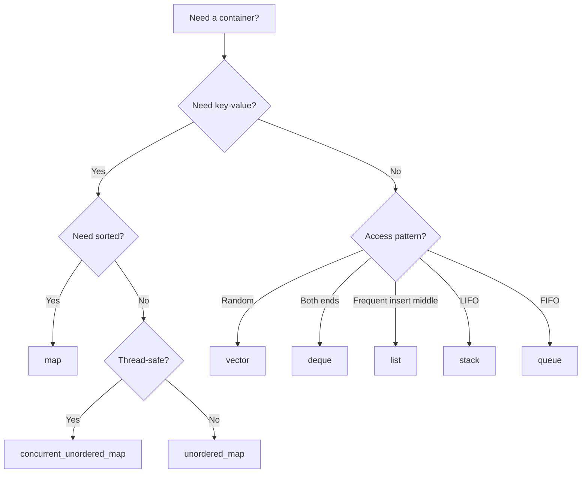
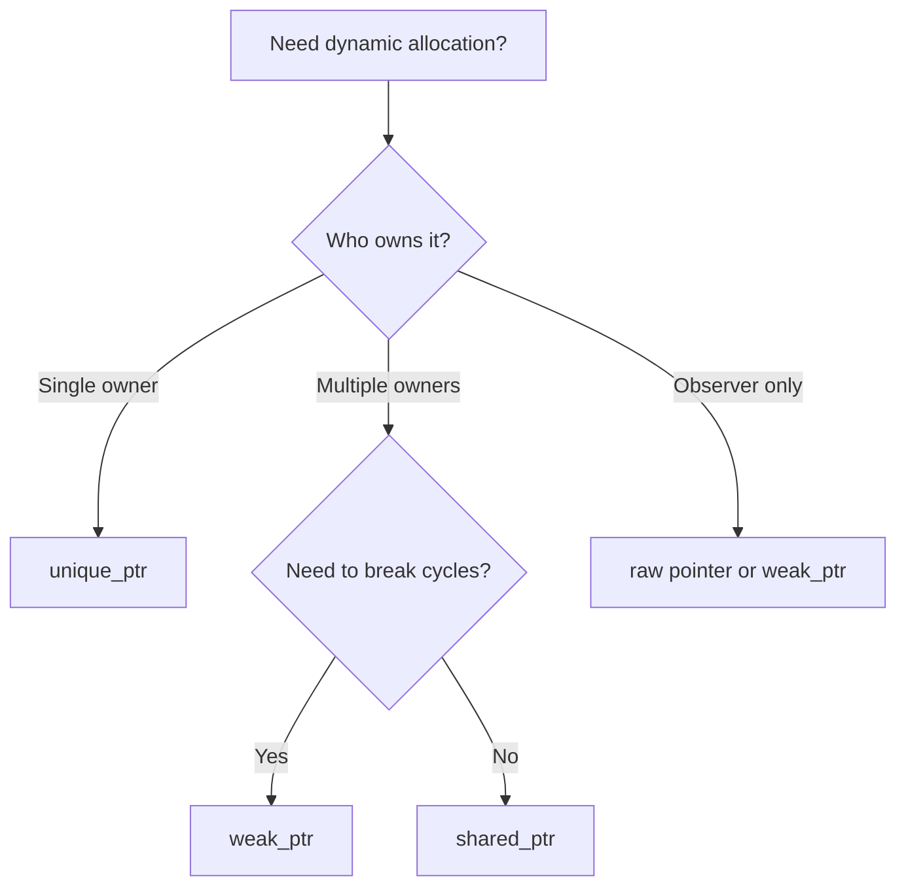
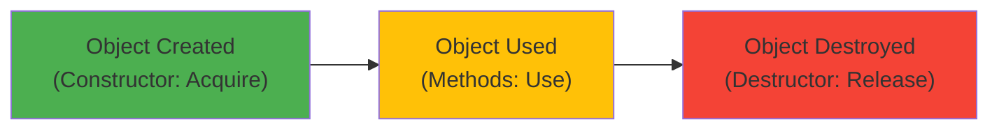

## 1. Introduction

C++ is a powerful systems programming language widely used in competitive programming, game development, high-performance computing, and interview coding. Its combination of low-level control and high-level abstractions makes it a favorite for companies that need maximum performance — including Google, Meta, Amazon, and many others.

C++ interviews test your understanding of memory management, pointers, the Standard Template Library (STL), object-oriented design, templates, and modern C++ features (C++11/14/17/20). The language's complexity means interviewers can probe deep understanding through questions about move semantics, RAII, smart pointers, and template metaprogramming.

This module covers STL containers, pointers/references, memory management, OOP in C++, templates, smart pointers, move semantics, RAII, and common C++ interview questions. Mastering these concepts will help you write efficient, correct C++ code in interviews and production.

---

## 2. Learning Roadmap

### Phase 1: Fundamentals (Week 1-2)
- [ ] Master C++ syntax and basic data types
- [ ] Learn pointers and references
- [ ] Understand arrays, C-strings, and std::string
- [ ] Practice with iostream and basic I/O
- [ ] Solve 20 basic C++ interview questions

### Phase 2: OOP and STL (Week 3-4)
- [ ] Master classes, inheritance, and virtual functions
- [ ] Learn all STL containers (vector, map, set, deque, etc.)
- [ ] Understand iterators and algorithms
- [ ] Practice with function objects and lambdas
- [ ] Solve 20 intermediate C++ interview questions

### Phase 3: Advanced Features (Week 5-6)
- [ ] Study smart pointers (unique_ptr, shared_ptr, weak_ptr)
- [ ] Learn move semantics and rvalue references
- [ ] Understand templates and template specialization
- [ ] Master RAII and exception safety
- [ ] Study memory management (new/delete, placement new)

### Phase 4: Interview Mastery (Week 7-8)
- [ ] Solve 30+ C++-specific interview questions
- [ ] Practice whiteboard coding in C++
- [ ] Study C++11/14/17/20 features
- [ ] Mock interviews with C++-focused questions
- [ ] Review C++ best practices and anti-patterns

---

## 3. Theory Notes

### 3.1 C++ Memory Model

```
Stack        — Local variables, function parameters, return addresses
             Fast, automatic allocation/deallocation, limited size

Heap         — Dynamic allocation with new/delete
             Slow, manual management, large size

Data/Static  — Global and static variables, constants
             Lifetime: entire program execution

Code/Text    — Compiled machine instructions
             Read-only
```

### 3.2 Value Categories

| Category | Description | Examples |
|----------|-------------|---------|
| Lvalue | Has identity, can take address | Variables, dereferenced pointers |
| Rvalue | Temporary, no identity | Literals, temporaries, return values |
| Prvalue | Pure rvalue (C++17+) | `42`, `std::string("hello")`, `x + y` |
| Xvalue | "Expiring" lvalue | `std::move(x)`, `static_cast<T&&>(x)` |

### 3.3 Rule of Five (and Three)

If you define any of these, you should define all five:
1. **Destructor** — Release resources
2. **Copy constructor** — Deep copy
3. **Copy assignment operator** — Deep copy + release old
4. **Move constructor** — Transfer ownership (C++11)
5. **Move assignment operator** — Transfer ownership + release old

### 3.4 OOP in C++

```
Class
├── Data members (fields)
├── Member functions (methods)
├── Constructors
│   ├── Default
│   ├── Parameterized
│   ├── Copy
│   └── Move (C++11)
├── Destructor
├── Operator overloading
├── Access specifiers (public, protected, private)
└── Inheritance
    ├── Public
    ├── Protected
    ├── Private
    └── Virtual functions (polymorphism)
```

---

## 4. Key Concepts

### 4.1 STL Containers

| Container | Access | Insert/Delete | Underlying | Use When |
|-----------|--------|---------------|------------|----------|
| vector | O(1) | O(1)*/O(n) | Dynamic array | Random access, most cases |
| deque | O(1) | O(1) ends | Segmented array | Frequent insert at both ends |
| list | O(n) | O(1) | Doubly linked list | Frequent insert/delete anywhere |
| forward_list | O(n) | O(1) | Singly linked list | Memory-efficient list |
| map | O(log n) | O(log n) | Red-black tree | Sorted key-value |
| set | O(log n) | O(log n) | Red-black tree | Sorted unique elements |
| unordered_map | O(1) avg | O(1) avg | Hash table | Fast key-value lookup |
| unordered_set | O(1) avg | O(1) avg | Hash table | Fast membership test |
| stack | Top only | O(1) | deque/vector | LIFO |
| queue | Front/back | O(1) | deque | FIFO |
| priority_queue | Top only | O(log n) | Heap | Min/max extraction |

*amortized for push_back

### 4.2 Smart Pointers

```cpp
#include <memory>

// unique_ptr: Exclusive ownership (preferred)
auto p1 = std::make_unique<MyClass>(args);
auto p2 = std::move(p1);  // Transfer ownership, p1 is now null

// shared_ptr: Shared ownership (reference counted)
auto p3 = std::make_shared<MyClass>(args);
auto p4 = p3;  // Reference count = 2
// Both destroyed when last reference goes away

// weak_ptr: Non-owning reference (breaks cycles)
std::weak_ptr<MyClass> wp = p3;
if (auto sp = wp.lock()) {
    // Use sp (shared_ptr) if object still exists
}
```

### 4.3 Move Semantics

```cpp
class Buffer {
    int* data;
    size_t size;
public:
    // Move constructor
    Buffer(Buffer&& other) noexcept
        : data(other.data), size(other.size) {
        other.data = nullptr;
        other.size = 0;
    }
    
    // Move assignment
    Buffer& operator=(Buffer&& other) noexcept {
        if (this != &other) {
            delete[] data;
            data = other.data;
            size = other.size;
            other.data = nullptr;
            other.size = 0;
        }
        return *this;
    }
};

// std::move casts to rvalue reference, enabling move operations
Buffer b1(1024);
Buffer b2 = std::move(b1);  // b1 is now in moved-from state
```

### 4.4 Templates

```cpp
// Function template
template <typename T>
T max_val(T a, T b) {
    return (a > b) ? a : b;
}

// Class template
template <typename T, size_t N>
class Array {
    T data[N];
public:
    T& operator[](size_t i) { return data[i]; }
    constexpr size_t size() const { return N; }
};

// Template specialization
template <>
class Array<bool, 8> {
    // Specialized implementation for bool
};

// Variadic templates (C++11)
template <typename... Args>
void print(Args... args) {
    (std::cout << ... << args) << "\n";  // C++17 fold expression
}
```

### 4.5 RAII (Resource Acquisition Is Initialization)

```cpp
// RAII: Resources are tied to object lifetimes
{
    std::ifstream file("data.txt");  // Acquire resource
    std::string line;
    std::getline(file, line);
}   // Destructor automatically releases resource

// Mutex lock RAII
{
    std::lock_guard<std::mutex> lock(mtx);
    // Critical section
}   // Lock automatically released

// Custom RAII class
class FileHandle {
    FILE* f;
public:
    FileHandle(const char* name, const char* mode) : f(fopen(name, mode)) {
        if (!f) throw std::runtime_error("Failed to open file");
    }
    ~FileHandle() { if (f) fclose(f); }
    
    // Disable copy, enable move
    FileHandle(const FileHandle&) = delete;
    FileHandle& operator=(const FileHandle&) = delete;
    FileHandle(FileHandle&& other) noexcept : f(other.f) { other.f = nullptr; }
    FileHandle& operator=(FileHandle&& other) noexcept {
        if (this != &other) { if (f) fclose(f); f = other.f; other.f = nullptr; }
        return *this;
    }
};
```

### 4.6 Lambda Expressions

```cpp
// Basic lambda
auto add = [](int a, int b) { return a + b; };

// With capture
int factor = 10;
auto multiply = [factor](int x) { return x * factor; };  // Capture by value
auto increment = [&factor](int x) { factor++; return x + factor; };  // Capture by reference

// Generic lambda (C++14)
auto generic_add = [](auto a, auto b) { return a + b; };

// Mutable lambda (can modify captured values)
int count = 0;
auto counter = [count]() mutable { return ++count; };

// Used with STL algorithms
std::vector<int> v = {5, 3, 1, 4, 2};
std::sort(v.begin(), v.end(), [](int a, int b) { return a > b; });
```

---

## 5. FAQ (20+ Q&A)

**Q1: What is the difference between a pointer and a reference?**
A pointer is a variable that holds a memory address and can be null, reassigned, or pointer-arithmetic'd. A reference is an alias for an existing variable that cannot be null, cannot be reseated, and doesn't use `*` or `&` syntax.

**Q2: What is RAII?**
Resource Acquisition Is Initialization — a C++ idiom where resource management (memory, files, locks) is tied to object lifetimes via constructors/destructors. Guarantees cleanup via stack unwinding.

**Q3: What is the difference between `new`/`delete` and smart pointers?**
`new`/`delete` require manual memory management, risking leaks and double-frees. Smart pointers automate this: `unique_ptr` for exclusive ownership, `shared_ptr` for shared ownership. Always prefer smart pointers.

**Q4: What is move semantics?**
Allows transferring resources from one object to another instead of copying. Move constructor/assignment take rvalue references (`&&`), enabling efficient transfers. `std::move` casts to rvalue reference.

**Q5: What is the Rule of Five?**
If you define any of: destructor, copy constructor, copy assignment, move constructor, move assignment — define all five to properly manage resources.

**Q6: What is the difference between `vector` and `array`?**
`std::array` is a fixed-size container (size known at compile time). `std::vector` is dynamic-size (can grow/shrink). `array` is stack-allocated; `vector` uses heap.

**Q7: What is the difference between `map` and `unordered_map`?**
`map` uses a red-black tree (sorted, O(log n)). `unordered_map` uses a hash table (unsorted, O(1) avg). Use `map` when you need sorted order; `unordered_map` for faster lookup.

**Q8: What is a virtual function?**
A member function declared `virtual` in a base class that can be overridden in derived classes. Enables polymorphism — calling the correct derived version through a base pointer/reference.

**Q9: What is the difference between `struct` and `class`?**
Only the default access: `struct` members are public by default; `class` members are private by default. Everything else is identical.

**Q10: What is template metaprogramming?**
Using C++ templates as a compile-time computation mechanism. Enables type-based dispatch, compile-time calculations, and policy-based design. Example: `std::enable_if`, `std::conditional`.

**Q11: What is `const` correctness?**
Using `const` to indicate that a variable, pointer, or function doesn't modify state. `const int*` = pointer to const int. `int* const` = const pointer to int. `const int* const` = both const.

**Q12: What is the difference between `push_back` and `emplace_back`?**
`push_back` takes an object and copies/moves it into the vector. `emplace_back` constructs the object in-place, avoiding extra copies. Prefer `emplace_back` for efficiency.

**Q13: What is exception safety?**
The guarantee that exceptions don't leak resources or leave objects in invalid states. Levels: basic guarantee (no leak), strong guarantee (commit or rollback), no-throw guarantee.

**Q14: What is the difference between `unique_ptr` and `shared_ptr`?**
`unique_ptr` has exclusive ownership (lightweight, no overhead). `shared_ptr` has shared ownership with reference counting (slightly more overhead). Prefer `unique_ptr` unless sharing is needed.

**Q15: What is placement new?**
Constructing an object in pre-allocated memory: `new (ptr) T(args)`. Used in memory pools and allocators. Must call destructor explicitly: `ptr->~T()`.

**Q16: What is the difference between `static_cast` and `dynamic_cast`?**
`static_cast` does compile-time type conversions (no runtime check). `dynamic_cast` does runtime type checking for polymorphic types (returns nullptr on failure for pointers).

**Q17: What is the `auto` keyword?**
Type inference — the compiler deduces the type from the initializer. Use for complex types (iterators, lambda types) and when the type is obvious.

**Q18: What is `constexpr`?**
Indicates that a function/variable can be evaluated at compile time. Enables compile-time computation and guarantees constant evaluation when used with literals.

**Q19: What is the difference between `std::list` and `std::forward_list`?**
`list` is doubly-linked (O(1) bidirectional traversal). `forward_list` is singly-linked (O(1) forward traversal only, less memory). Use `forward_list` when you only need forward iteration.

**Q20: What is `std::variant` and `std::optional` (C++17)?**
`std::variant` is a type-safe union (holds one of several types). `std::optional` represents a value that might not exist (like nullable). Both avoid raw pointers for optional/union semantics.

---

## 6. Hands-on Practice

### Exercise 1: Implement a Dynamic Array
```cpp
template <typename T>
class DynamicArray {
    T* data_;
    size_t size_;
    size_t capacity_;
    
    void resize(size_t new_capacity) {
        T* new_data = new T[new_capacity];
        for (size_t i = 0; i < size_; i++) {
            new_data[i] = std::move(data_[i]);
        }
        delete[] data_;
        data_ = new_data;
        capacity_ = new_capacity;
    }
    
public:
    DynamicArray() : data_(nullptr), size_(0), capacity_(0) {}
    
    ~DynamicArray() { delete[] data_; }
    
    void push_back(const T& value) {
        if (size_ == capacity_) {
            resize(capacity_ == 0 ? 1 : capacity_ * 2);
        }
        data_[size_++] = value;
    }
    
    void push_back(T&& value) {
        if (size_ == capacity_) {
            resize(capacity_ == 0 ? 1 : capacity_ * 2);
        }
        data_[size_++] = std::move(value);
    }
    
    T& operator[](size_t i) { return data_[i]; }
    size_t size() const { return size_; }
    size_t capacity() const { return capacity_; }
};
```

### Exercise 2: LRU Cache
```cpp
#include <unordered_map>
#include <list>

template <typename K, typename V>
class LRUCache {
    size_t capacity_;
    std::list<std::pair<K, V>> items_;
    std::unordered_map<K, typename std::list<std::pair<K, V>>::iterator> cache_;
    
public:
    LRUCache(size_t capacity) : capacity_(capacity) {}
    
    V get(const K& key) {
        auto it = cache_.find(key);
        if (it == cache_.end()) {
            throw std::runtime_error("Key not found");
        }
        items_.splice(items_.begin(), items_, it->second);
        return it->second->second;
    }
    
    void put(const K& key, const V& value) {
        auto it = cache_.find(key);
        if (it != cache_.end()) {
            it->second->second = value;
            items_.splice(items_.begin(), items_, it->second);
            return;
        }
        
        if (cache_.size() >= capacity_) {
            cache_.erase(items_.back().first);
            items_.pop_back();
        }
        
        items_.emplace_front(key, value);
        cache_[key] = items_.begin();
    }
};
```

### Exercise 3: Thread-Safe Queue
```cpp
#include <queue>
#include <mutex>
#include <condition_variable>

template <typename T>
class ThreadSafeQueue {
    std::queue<T> queue_;
    mutable std::mutex mutex_;
    std::condition_variable cond_;
    
public:
    void push(T value) {
        {
            std::lock_guard<std::mutex> lock(mutex_);
            queue_.push(std::move(value));
        }
        cond_.notify_one();
    }
    
    bool try_pop(T& value) {
        std::lock_guard<std::mutex> lock(mutex_);
        if (queue_.empty()) return false;
        value = std::move(queue_.front());
        queue_.pop();
        return true;
    }
    
    void wait_and_pop(T& value) {
        std::unique_lock<std::mutex> lock(mutex_);
        cond_.wait(lock, [this] { return !queue_.empty(); });
        value = std::move(queue_.front());
        queue_.pop();
    }
};
```

### Exercise 4: Binary Search (STL Style)
```cpp
#include <vector>
#include <algorithm>

int binary_search(const std::vector<int>& nums, int target) {
    auto it = std::lower_bound(nums.begin(), nums.end(), target);
    if (it != nums.end() && *it == target) {
        return std::distance(nums.begin(), it);
    }
    return -1;
}
```

### Exercise 5: Custom Hash Function for Unordered Map
```cpp
struct Point {
    int x, y;
    bool operator==(const Point& other) const {
        return x == other.x && y == other.y;
    }
};

struct PointHash {
    size_t operator()(const Point& p) const {
        size_t h1 = std::hash<int>{}(p.x);
        size_t h2 = std::hash<int>{}(p.y);
        return h1 ^ (h2 * 0x9e3779b97f4a7c15 + 0x9e3779b9 + (h1 << 6) + (h1 >> 2));
    }
};

std::unordered_set<Point, PointHash> points;
```

---

## 7. FAANG Questions

### Google
1. **"Implement a memory pool allocator."**
   - Pre-allocate large blocks, manage free lists, use placement new.

2. **"Explain move semantics and when to use std::move."**
   - Casts to rvalue reference, enabling move constructor/assignment. Use when transferring ownership of resources.

### Amazon
3. **"What is the difference between deep copy and shallow copy in C++?"**
   - Shallow copies pointers (double free risk). Deep copies pointed-to data. Implement deep copy in copy constructor/assignment.

4. **"Implement a thread-safe singleton in C++."**
   - Use `std::call_once` or Meyer's singleton (local static).

### Meta
5. **"When would you use a virtual destructor?"**
   - When deleting derived objects through base pointers. Without it, derived destructors aren't called (undefined behavior).

6. **"Explain the difference between std::unique_ptr and std::shared_ptr."**
   - unique_ptr: exclusive ownership, zero overhead. shared_ptr: shared ownership, reference counted.

### Apple
7. **"What is RAII and why is it important?"**
   - Resource Acquisition Is Initialization. Ties resource management to object lifetimes, ensuring cleanup via destructors.

### Netflix
8. **"Implement a lock-free stack."**
   - Use atomic compare-and-swap (CAS) operations.

---

## 8. Common Mistakes

### Mistake 1: Forgetting Virtual Destructor
```cpp
// WRONG
class Base {
    ~Base() {}  // Non-virtual!
};
class Derived : public Base { ~Derived() {} };

Base* p = new Derived();
delete p;  // Undefined behavior! Derived destructor not called

// RIGHT
class Base {
    virtual ~Base() {}  // Virtual!
};
```

### Mistake 2: Dangling References/Pointers
```cpp
// WRONG
int& get_ref() {
    int local = 42;
    return local;  // Reference to local variable!
}

// RIGHT
int get_value() {
    int local = 42;
    return local;  // Return by value
}
```

### Mistake 3: Not Using Move Semantics
```cpp
// WRONG: Always copies
std::vector<std::string> create_strings() {
    std::vector<std::string> result;
    result.push_back(std::string("hello"));  // Unnecessary copy
    return result;
}

// RIGHT: Move when possible
std::vector<std::string> create_strings() {
    std::vector<std::string> result;
    result.push_back("hello");  // String literal, still creates temporary
    return result;  // RVO or move
}
```

### Mistake 4: Using Raw new/delete
```cpp
// WRONG
void process() {
    int* p = new int[100];
    if (error) return;  // Memory leak!
    delete[] p;
}

// RIGHT
void process() {
    auto p = std::make_unique<int[]>(100);
    if (error) return;  // Auto-cleanup
}
```

### Mistake 5: Integer Overflow in Size Calculations
```cpp
// WRONG
size_t total = width * height * depth;  // Can overflow!

// RIGHT
size_t total = static_cast<size_t>(width) * height * depth;
```

### Mistake 6: Not Reserving Vector Capacity
```cpp
// WRONG: Multiple reallocations
std::vector<int> v;
for (int i = 0; i < 10000; i++) {
    v.push_back(i);  // May reallocate many times
}

// RIGHT: Reserve capacity
std::vector<int> v;
v.reserve(10000);
for (int i = 0; i < 10000; i++) {
    v.push_back(i);  // No reallocation
}
```

### Mistake 7: Using std::endl Instead of '\n'
```cpp
// WRONG: Forces buffer flush
std::cout << "Hello" << std::endl;

// RIGHT: Use '\n' unless flush needed
std::cout << "Hello\n";
```

---

## 9. Best Practices

### Modern C++ (C++11+)
1. Use `auto` when type is obvious or complex
2. Use range-based for loops: `for (const auto& x : container)`
3. Use lambdas for short callbacks and algorithms
4. Use `std::make_unique` and `std::make_shared`
5. Use `constexpr` for compile-time computation
6. Use `enum class` instead of plain enums

### Performance
1. Pass by const reference for large objects
2. Use `std::move` for transferring ownership
3. Reserve vector capacity when size is known
4. Use `emplace_back` instead of `push_back`
5. Prefer `std::array` over C arrays
6. Use `std::string_view` for read-only strings

### Memory Safety
1. Prefer smart pointers over raw pointers
2. Use RAII for all resource management
3. Mark single-ownership transfer as `= delete` for copy
4. Use `nullptr` instead of `NULL` or `0`
5. Initialize all variables

---

## 10. Cheat Sheet

```
C++ INTERVIEW QUICK REFERENCE
================================

STL CONTAINERS:
  vector      — Dynamic array, O(1) access
  deque       — Double-ended, O(1) both ends
  list        — Doubly-linked, O(1) insert
  map         — Sorted tree, O(log n)
  set         — Sorted unique, O(log n)
  unordered_map — Hash table, O(1) avg
  unordered_set — Hash set, O(1) avg
  stack       — LIFO adapter
  queue       — FIFO adapter
  priority_queue — Max-heap

SMART POINTERS:
  unique_ptr  — Exclusive ownership, zero overhead
  shared_ptr  — Shared ownership, reference counted
  weak_ptr    — Non-owning, breaks cycles

MEMORY:
  Stack:  Fast, automatic, limited
  Heap:   Slow, manual, large
  new/delete → make_unique/make_shared

KEYWORD MEANINGS:
  const      — Can't modify
  constexpr  — Compile-time evaluable
  static     — Static storage duration / class member
  volatile   — Don't optimize reads/writes
  explicit   — Disable implicit conversions
  noexcept   — Won't throw exceptions
  override   — Overriding virtual function
  final      — Can't override/inherit

COMMON PATTERNS:
  RAII       — Tie resources to object lifetime
  Rule of 5  — Define all 5 special members
  CRTP       — Curiously Recurring Template Pattern
  PImpl      — Pointer to Implementation (ABI stability)
```

---

## 11. Flash Cards

**Card 1:** What is RAII?
**Answer:** Resource Acquisition Is Initialization — tying resource management to object lifetimes via constructors/destructors, ensuring automatic cleanup.

**Card 2:** What is the difference between unique_ptr and shared_ptr?
**Answer:** unique_ptr has exclusive ownership (lightweight). shared_ptr has shared ownership with reference counting (slightly more overhead).

**Card 3:** What is move semantics?
**Answer:** Transferring resources from one object to another instead of copying, enabled by move constructors/assignments taking rvalue references (&&).

**Card 4:** What is the Rule of Five?
**Answer:** If you define any of: destructor, copy ctor, copy assignment, move ctor, move assignment — define all five.

**Card 5:** What is a virtual function?
**Answer:** A member function declared virtual that can be overridden in derived classes, enabling polymorphism through base pointers/references.

**Card 6:** What is the difference between vector and deque?
**Answer:** vector is a contiguous dynamic array (fast random access). deque is segmented (fast insert at both ends, slightly slower random access).

**Card 7:** What is std::move?
**Answer:** A cast to an rvalue reference, enabling move semantics. The object is in a valid but unspecified state afterward.

**Card 8:** What is a template?
**Answer:** A compile-time mechanism for writing generic code. The compiler generates specific versions for each type used.

**Card 9:** What is const correctness?
**Answer:** Using const to indicate immutability of variables, pointers, and member functions, catching bugs at compile time.

**Card 10:** What is the difference between struct and class?
**Answer:** Only default access: struct is public by default, class is private by default. Everything else is identical.

**Card 11:** What is placement new?
**Answer:** Constructing an object in pre-allocated memory: `new (ptr) T(args)`. Must call destructor manually.

**Card 12:** What is the difference between static_cast and dynamic_cast?
**Answer:** static_cast: compile-time conversion (no runtime check). dynamic_cast: runtime type checking for polymorphic types.

**Card 13:** What is the difference between empty and nullptr?
**Answer:** NULL/0 are implementation-defined. nullptr is a null pointer constant (C++11), type-safe and preferred.

**Card 14:** What is RVO/NRVO?
**Answer:** Return Value Optimization / Named RVO — compiler optimizations that eliminate copies when returning objects by value.

**Card 15:** What is std::optional?
**Answer:** A C++17 type that may or may not hold a value, avoiding raw pointers for optional semantics.

**Card 16:** What is the time complexity of unordered_map operations?
**Answer:** O(1) average, O(n) worst case (many collisions). Amortized O(1) for insert, find, erase.

**Card 17:** What is a lambda expression?
**Answer:** An anonymous function object, optionally capturing variables. Syntax: `[captures](params) -> ret { body }`.

**Card 18:** What is std::string_view?
**Answer:** A C++17 non-owning view over a string, avoiding copies for read-only string operations.

**Card 19:** What is exception safety?
**Answer:** Guarantees that exceptions don't leak resources or leave objects in invalid states (basic, strong, no-throw).

**Card 20:** What is the difference between new/delete and make_unique/make_shared?
**Answer:** make_unique/make_shared are safer (exception-safe, no raw pointers), more efficient (single allocation for shared_ptr), and preferred in modern C++.

---

## 12. Mind Map

```
                         C++
                          |
      ┌───────────────────┼───────────────────┐
      |                   |                   |
  STL/CONTAINERS       FEATURES            MEMORY
      |                   |                   |
┌─────┼─────┐     ┌──────┼──────┐     ┌──────┼──────┐
|     |     |     |      |      |     |      |      |
vector map  set  Smart  Move   Temp- Stack Heap  RAII
deque  |    |    Ptrs   Seman- lates |     |     |
list   |    |    |      tics  |     auto  new/ Smart
queue  |    |   unique shared |     |     delete Ptrs
stack  |    |   _ptr    _ptr  lambdas     |
       |    |    |            constexpr
       |    |   weak_ptr     enum class
       |    |
      OOP  Algorithms
       |      |
    virtual  sort, find,
    inherit  binary_search
```

---

## 13. Mermaid Diagrams

### STL Container Selection



### Smart Pointer Decision



### RAII Principle



---

## 14. Code Examples

### Example 1: Implement Merge Sort
```cpp
#include <vector>

void merge(std::vector<int>& arr, int left, int mid, int right) {
    std::vector<int> temp(right - left + 1);
    int i = left, j = mid + 1, k = 0;
    
    while (i <= mid && j <= right) {
        if (arr[i] <= arr[j]) {
            temp[k++] = arr[i++];
        } else {
            temp[k++] = arr[j++];
        }
    }
    
    while (i <= mid) temp[k++] = arr[i++];
    while (j <= right) temp[k++] = arr[j++];
    
    std::copy(temp.begin(), temp.end(), arr.begin() + left);
}

void merge_sort(std::vector<int>& arr, int left, int right) {
    if (left < right) {
        int mid = left + (right - left) / 2;
        merge_sort(arr, left, mid);
        merge_sort(arr, mid + 1, right);
        merge(arr, left, mid, right);
    }
}
```

### Example 2: Custom Iterator
```cpp
template <typename T>
class Range {
    T start_, end_, step_;
public:
    class Iterator {
        T current_, step_;
    public:
        using iterator_category = std::input_iterator_tag;
        using value_type = T;
        using difference_type = std::ptrdiff_t;
        using pointer = const T*;
        using reference = const T&;
        
        Iterator(T current, T step) : current_(current), step_(step) {}
        const T& operator*() const { return current_; }
        Iterator& operator++() { current_ += step_; return *this; }
        bool operator!=(const Iterator& other) const { return current_ < other.current_; }
    };
    
    Range(T end) : start_(0), end_(end), step_(1) {}
    Range(T start, T end, T step = 1) : start_(start), end_(end), step_(step) {}
    
    Iterator begin() const { return Iterator(start_, step_); }
    Iterator end() const { return Iterator(end_, step_); }
};

// Usage: for (auto i : Range(10)) { ... }
// Usage: for (auto i : Range(0, 100, 5)) { ... }
```

### Example 3: Observer Pattern
```cpp
#include <functional>
#include <vector>
#include <string>

class EventEmitter {
    std::unordered_map<std::string, std::vector<std::function<void()>>> listeners_;
public:
    void on(const std::string& event, std::function<void()> callback) {
        listeners_[event].push_back(std::move(callback));
    }
    
    void emit(const std::string& event) {
        if (auto it = listeners_.find(event); it != listeners_.end()) {
            for (auto& callback : it->second) {
                callback();
            }
        }
    }
};
```

### Example 4: Template Binary Search Tree
```cpp
template <typename T>
class BST {
    struct Node {
        T data;
        std::unique_ptr<Node> left, right;
        Node(T val) : data(val) {}
    };
    
    std::unique_ptr<Node> root_;
    
    std::unique_ptr<Node> insert(std::unique_ptr<Node> node, T val) {
        if (!node) return std::make_unique<Node>(val);
        if (val < node->data) {
            node->left = insert(std::move(node->left), val);
        } else if (val > node->data) {
            node->right = insert(std::move(node->right), val);
        }
        return node;
    }
    
    bool search(const Node* node, T val) const {
        if (!node) return false;
        if (val == node->data) return true;
        return val < node->data ? search(node->left.get(), val)
                                : search(node->right.get(), val);
    }
    
public:
    void insert(T val) { root_ = insert(std::move(root_), val); }
    bool search(T val) const { return search(root_.get(), val); }
};
```

---

## 15. Projects

### Project 1: Memory Pool Allocator
Build a custom memory pool that:
- Pre-allocates large memory blocks
- Manages free lists for fast allocation
- Supports alignment requirements
- Tracks allocation statistics

### Project 2: Thread Pool
Implement a thread pool that:
- Accepts callable tasks
- Supports configurable number of workers
- Returns futures for task results
- Handles graceful shutdown

### Project 3: JSON Parser
Create a simple JSON parser that:
- Parses JSON strings into a DOM tree
- Supports nested objects and arrays
- Handles strings, numbers, booleans, null
- Provides accessor methods

---

## 16. Resources

### Books
- "Effective Modern C++" by Scott Meyers
- "C++ Primer" by Stanley Lippman
- "The C++ Programming Language" by Bjarne Stroustrup
- "C++ Concurrency in Action" by Anthony Williams

### Online Resources
- [cppreference.com](https://cppreference.com/) — Definitive C++ reference
- [learncpp.com](https://www.learncpp.com/) — Comprehensive tutorials
- [C++ Core Guidelines](https://isocpp.github.io/CppCoreGuidelines/) — Best practices
- [Compiler Explorer](https://godbolt.org/) — Online C++ compiler

---

## 17. Checklist

### Fundamentals
- [ ] Pointers and references
- [ ] Dynamic memory (new/delete, smart pointers)
- [ ] String handling (std::string, string_view)
- [ ] I/O streams

### OOP
- [ ] Classes and constructors
- [ ] Inheritance and virtual functions
- [ ] Operator overloading
- [ ] Rule of Five

### STL
- [ ] All major containers
- [ ] Iterators
- [ ] Algorithms (sort, find, binary_search)
- [ ] Function objects and lambdas

### Advanced
- [ ] Templates
- [ ] Move semantics
- [ ] RAII
- [ ] Smart pointers
- [ ] C++11/14/17 features

---

## 18. Revision Plans

### Week 1: Fundamentals
- Master pointers, references, and memory management
- Solve 10 basic C++ problems
- Practice with STL containers

### Week 2: OOP and STL
- Implement classes with Rule of Five
- Practice STL algorithms
- Solve 10 intermediate problems

### Week 3: Advanced Features
- Master smart pointers and move semantics
- Practice templates
- Solve 10 advanced problems

### Week 4: Interview Practice
- Solve 20 C++ interview questions
- Practice whiteboard coding
- Mock interviews

---

## 19. Mock Interviews

### Mock Interview 1: Implement String Class
**Interviewer:** Implement a simplified std::string class with copy constructor, move constructor, and destructor.

### Mock Interview 2: LRU Cache
**Interviewer:** Implement an LRU Cache using STL containers.

### Mock Interview 3: Thread-Safe Queue
**Interviewer:** Implement a thread-safe bounded blocking queue using mutexes and condition variables.

---

## 20. Difficulty Rating

| Topic | Difficulty | Time to Master |
|-------|-----------|---------------|
| Basic Syntax | ⭐ (1/5) | 3 days |
| Pointers/References | ⭐⭐ (2/5) | 1 week |
| OOP in C++ | ⭐⭐ (2/5) | 1 week |
| STL Containers | ⭐⭐ (2/5) | 1-2 weeks |
| Smart Pointers | ⭐⭐⭐ (3/5) | 2 weeks |
| Move Semantics | ⭐⭐⭐⭐ (4/5) | 2-3 weeks |
| Templates | ⭐⭐⭐⭐ (4/5) | 3-4 weeks |
| RAII | ⭐⭐⭐ (3/5) | 2 weeks |
| Concurrency | ⭐⭐⭐⭐⭐ (5/5) | 4-6 weeks |

---

## 21. Summary

C++ is a powerful language that rewards deep understanding. Key principles:

1. **Prefer modern C++** — Use smart pointers, auto, lambdas, and RAII over raw C-style code.
2. **Understand memory** — Know stack vs heap, when copies happen, and how move semantics help.
3. **Master the STL** — Containers and algorithms are your building blocks. Know their complexities.
4. **Practice RAII** — Resource management through object lifetimes is the C++ way.
5. **Know the Rule of Five** — If you manage resources, define all special member functions.

For interviews, focus on writing clean, efficient code with proper memory management. C++ interviews often test deeper language knowledge than other languages, so be prepared to explain move semantics, template instantiation, and vtable layout.

