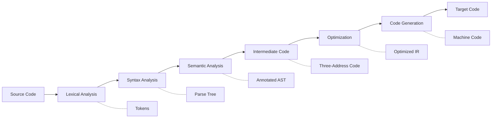
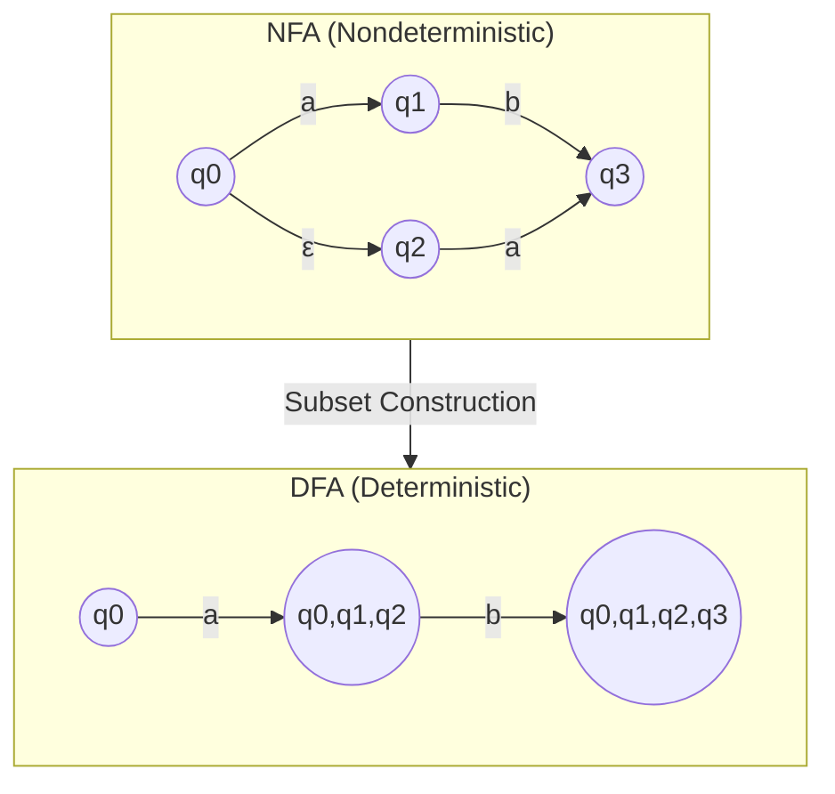
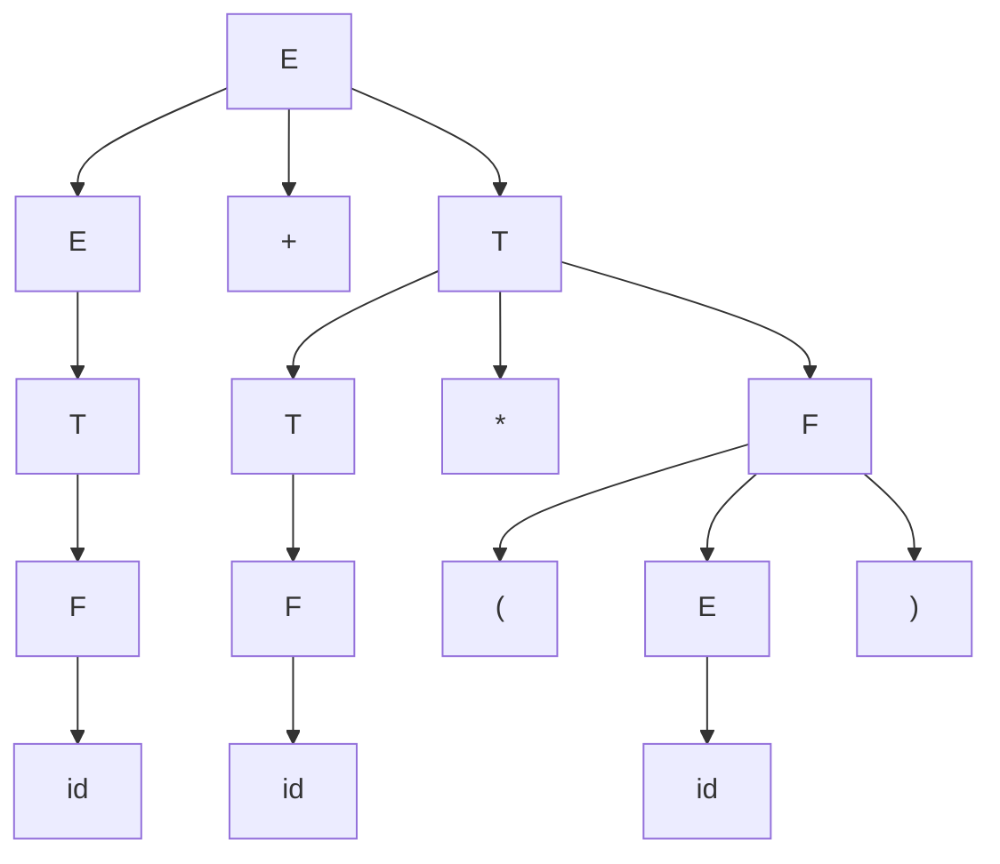
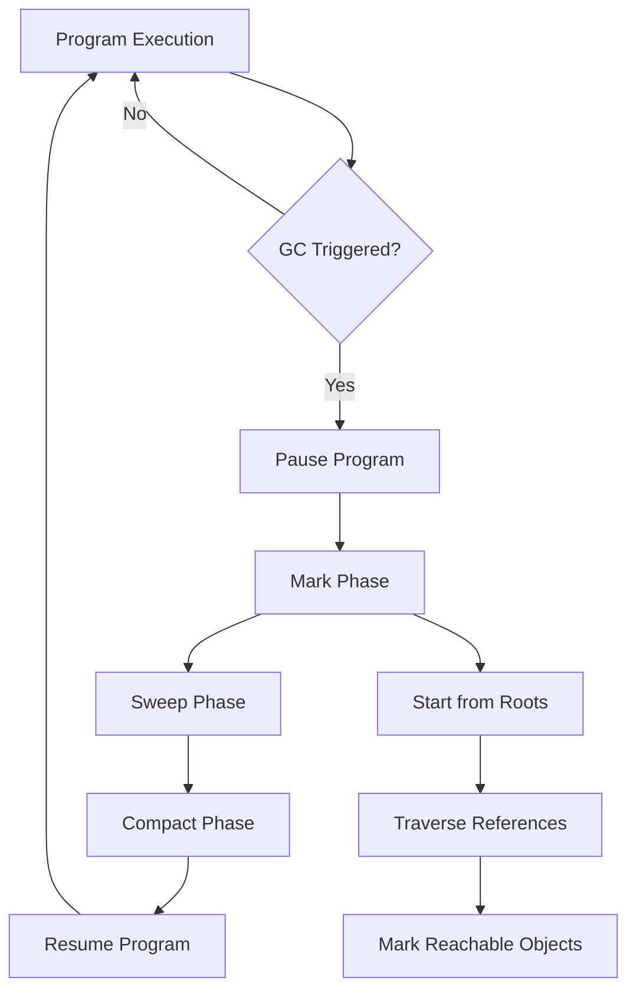

---

## Table of Contents

1. [Introduction](#1-introduction)
2. [Learning Roadmap](#2-learning-roadmap)
3. [Theory Notes](#3-theory-notes)
4. [Key Concepts](#4-key-concepts)
5. [Interview Questions & Answers](#5-interview-questions--answers)
6. [Hands-on Practice](#6-hands-on-practice)
7. [FAANG Interview Questions](#7-faang-interview-questions)
8. [Common Mistakes to Avoid](#8-common-mistakes-to-avoid)
9. [Best Practices](#9-best-practices)
10. [Cheat Sheet](#10-cheat-sheet)
11. [Flash Cards](#11-flash-cards)
12. [Mind Map](#12-mind-map)
13. [Mermaid Diagrams](#13-mermaid-diagrams)
14. [Code Examples](#14-code-examples)
15. [Projects & Ideas](#15-projects--ideas)
16. [Resources](#16-resources)
17. [Interview Preparation Checklist](#17-interview-preparation-checklist)
18. [Revision Notes](#18-revision-notes)
19. [Mock Interview Questions](#19-mock-interview-questions)
20. [Difficulty Rating](#20-difficulty-rating)
21. [Summary](#21-summary)

---

## 1. Introduction

Compiler Design is the theory and practice of translating source code from high-level programming languages into machine-executable instructions. It covers lexical analysis, parsing, semantic analysis, optimization, and code generation. Understanding compilers deepens your knowledge of how programming languages work and improves your ability to write efficient code.

### Why Compiler Design Matters

- **Language understanding** — Know what happens when code runs
- **Optimization skills** — Write performance-conscious code
- **Tool building** — Create linters, formatters, and transpilers
- **Debugging insight** — Understand error messages and stack traces
- **Interview advantage** — Demonstrates deep CS fundamentals

### Core Compiler Phases

| Phase | Input | Output | Purpose |
|-------|-------|--------|---------|
| Lexical Analysis | Source code | Tokens | Break code into meaningful units |
| Syntax Analysis | Tokens | Parse tree | Check grammatical structure |
| Semantic Analysis | Parse tree | Annotated tree | Check meaning and types |
| Intermediate Code | Annotated tree | IR (3-address code) | Platform-independent representation |
| Optimization | IR | Optimized IR | Improve performance |
| Code Generation | Optimized IR | Machine code | Generate target instructions |

---

## 2. Learning Roadmap

### Phase 1: Foundations (Weeks 1-2)
- Study regular expressions and finite automata
- Understand context-free grammars
- Learn about lexical analyzers
- Practice tokenization by hand

### Phase 2: Parsing (Weeks 3-4)
- Master LL(1) parsing
- Learn LR(0), SLR(1), LALR(1), and CLR(1) parsing
- Understand parser generators (Yacc/Bison)
- Practice building parse trees

### Phase 3: Semantic Analysis (Weeks 5-6)
- Study symbol tables
- Learn type checking algorithms
- Understand scope resolution
- Practice semantic error detection

### Phase 4: Code Generation & Optimization (Weeks 7-8)
- Learn intermediate representations (3-address code)
- Study basic block and flow graph construction
- Understand common optimizations
- Practice code generation algorithms

### Phase 5: Advanced Topics (Weeks 9-10)
- Study register allocation
- Learn about garbage collection
- Understand JIT compilation
- Explore modern compiler infrastructure (LLVM)

---

## 3. Theory Notes

### 3.1 Lexical Analysis

The lexical analyzer (lexer) reads source code character by character and groups them into meaningful units called tokens.

**Regular Expressions:**
- `a|b` — a or b
- `ab` — a followed by b
- `a*` — zero or more a's
- `a+` — one or more a's
- `a?` — zero or one a
- `[a-z]` — any lowercase letter
- `[^0-9]` — any non-digit
- `(ab)*` — zero or more "ab"

**Finite Automata:**
- **DFA (Deterministic FA)** — Exactly one transition per symbol per state
- **NFA (Nondeterministic FA)** — Multiple transitions possible, ε-moves
- Every NFA can be converted to an equivalent DFA (subset construction)
- DFA is faster for implementation (no backtracking)

**Token Types:**
- Keywords: `if`, `else`, `while`, `return`
- Identifiers: variable/function names
- Literals: numbers, strings, booleans
- Operators: `+`, `-`, `*`, `/`, `==`
- Delimiters: `(`, `)`, `{`, `}`, `;`

### 3.2 Parsing

Parsing checks if the token stream conforms to the language's grammar and builds a parse tree.

**Grammar Types (Chomsky Hierarchy):**
- **Type 0** — Unrestricted grammars
- **Type 1** — Context-sensitive grammars
- **Type 2** — Context-free grammars (CFGs) — used in programming languages
- **Type 3** — Regular grammars

**CFG Components:**
- **Terminal symbols** — Tokens (the actual characters/words)
- **Non-terminal symbols** — Grammar variables (intermediate structures)
- **Production rules** — Define how non-terminals expand
- **Start symbol** — The root non-terminal

**Example CFG for Expressions:**
```
E → E + T | T
T → T * F | F
F → ( E ) | id
```

**Parse Tree Types:**
- **Concrete Syntax Tree (CST)** — Includes all grammar details
- **Abstract Syntax Tree (AST)** — Simplified, semantic meaning preserved

### 3.3 Top-Down vs. Bottom-Up Parsing

**Top-Down Parsing:**
- Starts from start symbol, expands to derive input
- Examples: Recursive Descent, LL(1)
- Advantages: Easy to understand and implement
- Limitations: Left recursion must be eliminated

**Bottom-Up Parsing:**
- Starts from input, reduces to start symbol
- Examples: Shift-Reduce, LR(0), SLR(1), LALR(1), CLR(1)
- Advantages: More powerful, handles more grammars
- Limitations: More complex to implement

### 3.4 Semantic Analysis

**Symbol Table:**
A data structure that stores information about identifiers (variables, functions, types) including name, type, scope, and memory location.

**Type Checking:**
Verifying that operations are applied to compatible types. Static type checking happens at compile time; dynamic at runtime.

**Scope Rules:**
- **Static scope** — Scope determined by program text (lexical scoping)
- **Dynamic scope** — Scope determined by program execution (rare in modern languages)

### 3.5 Code Optimization

**Local Optimizations:**
- Constant folding: `3 + 4` → `7`
- Constant propagation: `x = 5; y = x + 1` → `y = 6`
- Dead code elimination: Remove unreachable code
- Common subexpression elimination: `a*b + a*b` → `t = a*b; t + t`

**Loop Optimizations:**
- Loop invariant code motion: Move不变 computations outside loop
- Loop unrolling: Reduce loop overhead
- Strength reduction: Replace expensive operations with cheaper ones

**Global Optimizations:**
- Copy propagation: Replace `x = y` with `y` where possible
- Tail call optimization: Convert tail recursion to iteration
- Inline expansion: Replace function call with function body

---

## 4. Key Concepts

### 4.1 Grammar Concepts

**Left Recursion:**
A production rule where the leftmost symbol of the right side is the same as the left side.
`A → Aα | β` (left recursive)
Must be eliminated for LL(1) parsers.

**Left Factoring:**
Transforming grammar to handle common prefixes.
`A → αβ | αγ` becomes `A → αA'` and `A' → β | γ`

**Ambiguous Grammar:**
A grammar that can generate more than one parse tree for the same input.
Example: `E → E + E | E * E | (E) | id` is ambiguous.

**FIRST and FOLLOW Sets:**
- **FIRST(X)** — Set of terminals that can begin strings derived from X
- **FOLLOW(X)** — Set of terminals that can appear immediately after X in some sentential form

### 4.2 Parsing Table Construction

**LL(1) Parsing:**
- Build parsing table using FIRST and FOLLOW sets
- For each production `A → α`:
  - Add to table[A, a] if a ∈ FIRST(α)
  - Add to table[A, a] if ε ∈ FIRST(α) and a ∈ FOLLOW(A)

**LR Parsing:**
- Build item sets (closure and goto operations)
- Construct action/goto tables
- Action table: shift, reduce, accept, error
- Goto table: state transitions for non-terminals

### 4.3 Intermediate Representations

**Three-Address Code:**
Each instruction has at most three operands (two sources, one destination).
```
x = y op z
x = op y
x = y
goto L
if x goto L
```

**Quadruples:**
Four fields: operator, arg1, arg2, result

**Triples:**
Three fields: operator, arg1, arg2 (result implied by position)

**Static Single Assignment (SSA):**
Each variable is assigned exactly once, making data flow analysis easier.

### 4.4 Runtime Environment

**Storage Allocation:**
- **Static allocation** — Compile-time fixed locations
- **Stack allocation** — Dynamic activation records on stack
- **Heap allocation** — Dynamic memory from heap

**Activation Records:**
- Local variables
- Parameters
- Return address
- Saved registers
- Dynamic link (previous frame)
- Access link (for non-local variables)

**Calling Conventions:**
- Who pushes arguments (caller vs. callee)
- Who cleans up the stack
- How return values are passed
- Register save/restore rules

---

## 5. Interview Questions & Answers

### Lexical Analysis

**Q1: What is the difference between a DFA and an NFA?**
**A:** A DFA (Deterministic Finite Automaton) has exactly one transition per symbol per state and no ε-transitions. An NFA (Nondeterministic Finite Automaton) can have multiple transitions for the same symbol, including ε-transitions (empty string moves). DFAs are faster to execute (O(n) time, no backtracking) but may have more states. NFAs are easier to construct from regular expressions. Every NFA can be converted to an equivalent DFA using subset construction, potentially causing an exponential blowup in states.

**Q2: Why do compilers use regular expressions for lexical analysis?**
**A:** Regular expressions are sufficient for describing token patterns because tokens are simple, flat structures without nested hierarchy. Keywords, identifiers, numbers, and operators can all be described by regular languages. Regular expressions are efficient to match (linear time with DFA/NFA) and can be automatically compiled into efficient recognizers. The lexer's job is just to group characters into tokens — the complex grammar analysis is left to the parser.

**Q3: What is tokenization and why is it important?**
**A:** Tokenization (lexical analysis) is the process of converting a stream of characters into a stream of tokens — the smallest meaningful units of a language. For example, `int x = 42;` becomes tokens: `INT_KEYWORD`, `IDENTIFIER(x)`, `ASSIGN`, `NUMBER(42)`, `SEMICOLON`. It's important because: (1) It simplifies parsing by reducing input complexity, (2) It separates concerns — character-level handling from grammar, (3) It enables efficient storage — keywords can be stored once, (4) It allows error detection at the character level early.

**Q4: How does a lexer handle whitespace and comments?**
**A:** The lexer typically ignores whitespace (spaces, tabs, newlines) and comments by matching them with regex patterns and discarding the matched text without producing tokens. For example: `WS → [ \t\n]+` matches whitespace and the action is to continue scanning. Comments are handled similarly: `LINE_COMMENT → //[^\n]*` and `BLOCK_COMMENT → /\*[\s\S]*?\*/`. The lexer advances the position but generates no token, effectively skipping these elements.

### Parsing

**Q5: What is the difference between LL(1) and LR(1) parsing?**
**A:** LL(1) is top-down, leftmost derivation, one lookahead token. It builds the parse tree from root to leaves. LR(1) is bottom-up, rightmost derivation in reverse, one lookahead. It builds from leaves to root using shift-reduce operations. LL(1) is simpler to implement by hand but handles fewer grammars (no left recursion, limited lookahead). LR(1) handles a broader class of grammars (all deterministic CFGs) and is more powerful, but is typically generated by parser generators like Yacc/Bison. LALR(1) is a practical compromise between the two.

**Q6: How do you eliminate left recursion?**
**A:** Given left-recursive rule `A → Aα | β`, transform to:
```
A → βA'
A' → αA' | ε
```
This eliminates left recursion while preserving the language. For indirect left recursion (A derives B which derives A), compute the dependency graph and order non-terminals to eliminate recursion. Example: `E → E + T | T` becomes `E → TE'` and `E' → +TE' | ε`.

**Q7: What is an AST and how does it differ from a CST?**
**A:** A CST (Concrete Syntax Tree) preserves all grammatical details including every token and production rule applied. An AST (Abstract Syntax Tree) is a simplified representation that captures only the semantic meaning. For example, a CST for `a + b` might include nodes for expression, term, and factor, while the AST just has `+(a, b)`. ASTs are preferred for semantic analysis and code generation because they're simpler, smaller, and focus on meaning rather than syntax.

**Q8: What is the FIRST set and how is it computed?**
**A:** FIRST(X) is the set of terminal symbols that can appear as the first character of any string derived from X. Computation rules:
- If X is a terminal: FIRST(X) = {X}
- If X → ε: Add ε to FIRST(X)
- If X → Y₁Y₂...Yₙ: Add FIRST(Y₁)\{ε} to FIRST(X); if ε ∈ FIRST(Y₁), add FIRST(Y₂)\{ε}, and so on
- If all Yᵢ can derive ε: Add ε to FIRST(X)

**Q9: Explain the shift-reduce parsing conflict.**
**A:** Shift-reduce conflicts occur when the parser can't decide between shifting the next token onto the stack or reducing a rule on the stack. Example: `if E then S else S` — when parsing `if E then if E then S` and encountering `else`, should it shift (matching the inner if) or reduce (completing the outer if)? This is an ambiguity in the grammar. Resolution: use precedence rules, modify the grammar, or use parser generator directives like `%prec`.

**Q10: What is error recovery in parsing?**
**A:** Error recovery strategies include: (1) **Panic mode** — Skip tokens until a sync token (like `;` or `}`) is found, (2) **Phrase level** — Insert missing tokens or delete extra tokens to complete a phrase, (3) **Error productions** — Add grammar rules that handle common errors, (4) **Global correction** — Find minimum edit distance to a valid program (expensive, rarely used). Most practical parsers use panic mode with synchronization tokens for simplicity.

### Semantic Analysis

**Q11: What information does a symbol table store?**
**A:** A symbol table stores: (1) **Name** — Identifier string, (2) **Type** — Data type (int, float, struct, function), (3) **Scope** — Where the identifier is visible (global, local, block), (4) **Kind** — What it represents (variable, function, parameter, type), (5) **Memory location** — Offset or address, (6) **Size** — Bytes required, (7) **Parameters** — For functions: parameter types and return type, (8) **Access modifier** — Public, private, protected, (9) **Line numbers** — For error reporting, (10) **Additional attributes** — Arrays: dimensions; structs: fields.

**Q12: What is type checking and what are its approaches?**
**A:** Type checking verifies that operations use compatible types. Approaches: (1) **Static type checking** — Done at compile time; catches errors early; used by C, Java, Go, (2) **Dynamic type checking** — Done at runtime; more flexible; used by Python, JavaScript, (3) **Gradual type checking** — Mix of both; TypeScript, mypy for Python, (4) **Strong typing** — No implicit type conversions; (5) **Weak typing** — Implicit conversions allowed. Type compatibility rules define when types are compatible (e.g., int→float is usually compatible, float→int is not).

**Q13: What is type inference?**
**A:** Type inference automatically determines the type of an expression without explicit type annotations. Algorithms: (1) **Hindley-Milner** — Used in ML, Haskell; principal type inference, (2) **Constraint-based** — Generate type constraints and solve with unification, (3) **Bidirectional** — Combine type checking and inference. Example: In `let x = 5 + 3.2`, the compiler infers `x: float` because `5` is coerced to float for addition. Languages: Haskell, ML, Rust (partial), TypeScript, Kotlin (with `val`).

### Code Generation

**Q14: What is register allocation and why is it important?**
**A:** Register allocation assigns CPU registers to variables during code generation. It's crucial because: registers are the fastest storage, but limited in number (typically 16-32). The problem is NP-complete (graph coloring approach). Algorithms: (1) **Chaitin's algorithm** — Build interference graph, color with k colors (registers), (2) **Linear scan** — Faster, used in JIT compilers, less optimal, (3) **Graph coloring** — Model as graph coloring problem, spill to stack when needed. Spilling occurs when more variables exist than registers — some must be stored in memory.

**Q15: What is garbage collection and what are the main approaches?**
**A:** Garbage collection automatically reclaims memory no longer reachable by the program. Main approaches: (1) **Reference counting** — Count references to each object; free when count reaches zero; can't handle cycles, (2) **Mark-and-sweep** — Mark reachable objects, sweep unmarked; pauses, (3) **Copying** — Copy live objects to new space; compact; halves available memory, (4) **Generational** — Divide objects by age; collect young generation frequently, old rarely, (5) **Concurrent** — Collect while program runs; reduces pauses, (6) **Incremental** — Collect in small increments; predictable pauses.

---

## 6. Hands-on Practice

### Practice 1: Write a Lexer

```python
import re
from enum import Enum, auto
from dataclasses import dataclass
from typing import List


class TokenType(Enum):
    # Keywords
    IF = auto()
    ELSE = auto()
    WHILE = auto()
    RETURN = auto()
    INT = auto()
    FLOAT = auto()
    VOID = auto()

    # Identifiers and literals
    IDENTIFIER = auto()
    INT_LITERAL = auto()
    FLOAT_LITERAL = auto()

    # Operators
    PLUS = auto()
    MINUS = auto()
    MULTIPLY = auto()
    DIVIDE = auto()
    ASSIGN = auto()
    EQUAL = auto()
    NOT_EQUAL = auto()
    LESS = auto()
    GREATER = auto()
    LESS_EQUAL = auto()
    GREATER_EQUAL = auto()

    # Delimiters
    LPAREN = auto()
    RPAREN = auto()
    LBRACE = auto()
    RBRACE = auto()
    SEMICOLON = auto()
    COMMA = auto()

    # Special
    EOF = auto()
    NEWLINE = auto()


@dataclass
class Token:
    type: TokenType
    value: str
    line: int
    column: int


class Lexer:
    KEYWORDS = {
        'if': TokenType.IF,
        'else': TokenType.ELSE,
        'while': TokenType.WHILE,
        'return': TokenType.RETURN,
        'int': TokenType.INT,
        'float': TokenType.FLOAT,
        'void': TokenType.VOID,
    }

    PATTERNS = [
        (r'[ \t]+', None),                    # Whitespace (ignore)
        (r'//.*', None),                       # Line comment (ignore)
        (r'/\*[\s\S]*?\*/', None),             # Block comment (ignore)
        (r'\n', TokenType.NEWLINE),
        (r'[a-zA-Z_][a-zA-Z0-9_]*', None),    # Identifiers/keywords
        (r'[0-9]+\.[0-9]+', TokenType.FLOAT_LITERAL),
        (r'[0-9]+', TokenType.INT_LITERAL),
        (r'\+', TokenType.PLUS),
        (r'-', TokenType.MINUS),
        (r'\*', TokenType.MULTIPLY),
        (r'/', TokenType.DIVIDE),
        (r'=', TokenType.ASSIGN),
        (r'==', TokenType.EQUAL),
        (r'!=', TokenType.NOT_EQUAL),
        (r'<', TokenType.LESS),
        (r'>', TokenType.GREATER),
        (r'<=', TokenType.LESS_EQUAL),
        (r'>=', TokenType.GREATER_EQUAL),
        (r'\(', TokenType.LPAREN),
        (r'\)', TokenType.RPAREN),
        (r'\{', TokenType.LBRACE),
        (r'\}', TokenType.RBRACE),
        (r';', TokenType.SEMICOLON),
        (r',', TokenType.COMMA),
    ]

    def __init__(self, source: str):
        self.source = source
        self.tokens: List[Token] = []
        self.line = 1
        self.column = 1
        self.pos = 0

    def tokenize(self) -> List[Token]:
        while self.pos < len(self.source):
            matched = False
            for pattern, token_type in self.PATTERNS:
                regex = re.compile(pattern)
                match = regex.match(self.source, self.pos)
                if match:
                    text = match.group()
                    if token_type is not None:
                        if token_type == TokenType.IDENTIFIER:
                            token_type = self.KEYWORDS.get(text, TokenType.IDENTIFIER)
                        self.tokens.append(Token(token_type, text, self.line, self.column))
                    if '\n' in text:
                        self.line += text.count('\n')
                        self.column = len(text) - text.rfind('\n')
                    else:
                        self.column += len(text)
                    self.pos += len(text)
                    matched = True
                    break
            if not matched:
                raise SyntaxError(
                    f"Unexpected character '{self.source[self.pos]}' "
                    f"at line {self.line}, column {self.column}"
                )

        self.tokens.append(Token(TokenType.EOF, "", self.line, self.column))
        return self.tokens


# Test
source = """
int factorial(int n) {
    if (n <= 1) {
        return 1;
    }
    return n * factorial(n - 1);
}
"""

lexer = Lexer(source)
tokens = lexer.tokenize()
for token in tokens:
    print(f"{token.type.name:20s} {token.value!r:20s} (L{token.line}:C{token.column})")
```

### Practice 2: Recursive Descent Parser

```python
from dataclasses import dataclass
from typing import Optional, List
from enum import Enum, auto


class NodeType(Enum):
    PROGRAM = auto()
    FUNCTION = auto()
    BLOCK = auto()
    DECLARATION = auto()
    ASSIGNMENT = auto()
    RETURN = auto()
    IF = auto()
    WHILE = auto()
    BINARY_OP = auto()
    UNARY_OP = auto()
    FUNCTION_CALL = auto()
    INTEGER = auto()
    FLOAT = auto()
    IDENTIFIER = auto()


@dataclass
class ASTNode:
    type: NodeType
    value: any = None
    children: List['ASTNode'] = None
    line: int = 0

    def __post_init__(self):
        if self.children is None:
            self.children = []


class Parser:
    def __init__(self, tokens):
        self.tokens = tokens
        self.pos = 0

    def peek(self) -> dict:
        return self.tokens[self.pos] if self.pos < len(self.tokens) else None

    def consume(self) -> dict:
        token = self.tokens[self.pos]
        self.pos += 1
        return token

    def expect(self, token_type: str) -> dict:
        token = self.peek()
        if token is None or token['type'] != token_type:
            raise SyntaxError(
                f"Expected {token_type}, got {token}"
            )
        return self.consume()

    def parse(self) -> ASTNode:
        """Parse program: one or more function definitions."""
        program = ASTNode(NodeType.PROGRAM)
        while self.peek() and self.peek()['type'] != 'EOF':
            program.children.append(self.parse_function())
        return program

    def parse_function(self) -> ASTNode:
        """Parse: type identifier ( params ) { body }"""
        return_type = self.consume()['value']
        name = self.expect('IDENTIFIER')['value']
        self.expect('LPAREN')
        params = self.parse_params()
        self.expect('RPAREN')
        body = self.parse_block()
        return ASTNode(NodeType.FUNCTION, value=name,
                      children=[body], line=self.tokens[self.pos - 1].get('line', 0))

    def parse_params(self) -> list:
        """Parse parameter list."""
        params = []
        if self.peek()['type'] != 'RPAREN':
            params.append(self.parse_param())
            while self.peek()['type'] == 'COMMA':
                self.consume()
                params.append(self.parse_param())
        return params

    def parse_param(self) -> dict:
        """Parse single parameter: type identifier."""
        param_type = self.consume()['value']
        param_name = self.expect('IDENTIFIER')['value']
        return {'type': param_type, 'name': param_name}

    def parse_block(self) -> ASTNode:
        """Parse: { statements }"""
        self.expect('LBRACE')
        block = ASTNode(NodeType.BLOCK)
        while self.peek()['type'] != 'RBRACE':
            block.children.append(self.parse_statement())
        self.expect('RBRACE')
        return block

    def parse_statement(self) -> ASTNode:
        """Parse a single statement."""
        token = self.peek()

        if token['type'] == 'INT' or token['type'] == 'FLOAT':
            return self.parse_declaration()
        elif token['type'] == 'RETURN':
            return self.parse_return()
        elif token['type'] == 'IF':
            return self.parse_if()
        elif token['type'] == 'WHILE':
            return self.parse_while()
        elif token['type'] == 'IDENTIFIER':
            next_token = self.tokens[self.pos + 1] if self.pos + 1 < len(self.tokens) else None
            if next_token and next_token['type'] == 'ASSIGN':
                return self.parse_assignment()
            else:
                stmt = ASTNode(NodeType.EXPRESSION,
                              children=[self.parse_expression()])
                self.expect('SEMICOLON')
                return stmt
        else:
            raise SyntaxError(f"Unexpected token: {token}")

    def parse_declaration(self) -> ASTNode:
        """Parse: type identifier = expression;"""
        var_type = self.consume()['value']
        name = self.expect('IDENTIFIER')['value']
        self.expect('ASSIGN')
        expr = self.parse_expression()
        self.expect('SEMICOLON')
        return ASTNode(NodeType.DECLARATION, value={'type': var_type, 'name': name},
                      children=[expr])

    def parse_expression(self) -> ASTNode:
        """Parse expression with precedence climbing."""
        return self.parse_comparison()

    def parse_comparison(self) -> ASTNode:
        left = self.parse_addition()
        while self.peek()['type'] in ('EQUAL', 'NOT_EQUAL', 'LESS', 'GREATER',
                                       'LESS_EQUAL', 'GREATER_EQUAL'):
            op = self.consume()['value']
            right = self.parse_addition()
            left = ASTNode(NodeType.BINARY_OP, value=op, children=[left, right])
        return left

    def parse_addition(self) -> ASTNode:
        left = self.parse_multiplication()
        while self.peek()['type'] in ('PLUS', 'MINUS'):
            op = self.consume()['value']
            right = self.parse_multiplication()
            left = ASTNode(NodeType.BINARY_OP, value=op, children=[left, right])
        return left

    def parse_multiplication(self) -> ASTNode:
        left = self.parse_unary()
        while self.peek()['type'] in ('MULTIPLY', 'DIVIDE'):
            op = self.consume()['value']
            right = self.parse_unary()
            left = ASTNode(NodeType.BINARY_OP, value=op, children=[left, right])
        return left

    def parse_unary(self) -> ASTNode:
        if self.peek()['type'] == 'MINUS':
            self.consume()
            expr = self.parse_primary()
            return ASTNode(NodeType.UNARY_OP, value='-', children=[expr])
        return self.parse_primary()

    def parse_primary(self) -> ASTNode:
        token = self.peek()

        if token['type'] == 'INT_LITERAL':
            self.consume()
            return ASTNode(NodeType.INTEGER, value=int(token['value']))
        elif token['type'] == 'FLOAT_LITERAL':
            self.consume()
            return ASTNode(NodeType.FLOAT, value=float(token['value']))
        elif token['type'] == 'IDENTIFIER':
            self.consume()
            if self.peek()['type'] == 'LPAREN':
                return self.parse_function_call(token['value'])
            return ASTNode(NodeType.IDENTIFIER, value=token['value'])
        elif token['type'] == 'LPAREN':
            self.consume()
            expr = self.parse_expression()
            self.expect('RPAREN')
            return expr
        else:
            raise SyntaxError(f"Unexpected token: {token}")

    def parse_function_call(self, name: str) -> ASTNode:
        """Parse: identifier(args)"""
        self.expect('LPAREN')
        args = []
        if self.peek()['type'] != 'RPAREN':
            args.append(self.parse_expression())
            while self.peek()['type'] == 'COMMA':
                self.consume()
                args.append(self.parse_expression())
        self.expect('RPAREN')
        return ASTNode(NodeType.FUNCTION_CALL, value=name, children=args)

    def parse_return(self) -> ASTNode:
        self.consume()  # 'return'
        expr = self.parse_expression()
        self.expect('SEMICOLON')
        return ASTNode(NodeType.RETURN, children=[expr])

    def parse_if(self) -> ASTNode:
        self.consume()  # 'if'
        self.expect('LPAREN')
        condition = self.parse_expression()
        self.expect('RPAREN')
        then_block = self.parse_block()
        else_block = None
        if self.peek()['type'] == 'ELSE':
            self.consume()
            else_block = self.parse_block()
        node = ASTNode(NodeType.IF, children=[condition, then_block])
        if else_block:
            node.children.append(else_block)
        return node

    def parse_while(self) -> ASTNode:
        self.consume()  # 'while'
        self.expect('LPAREN')
        condition = self.parse_expression()
        self.expect('RPAREN')
        body = self.parse_block()
        return ASTNode(NodeType.WHILE, children=[condition, body])

    def parse_assignment(self) -> ASTNode:
        name = self.expect('IDENTIFIER')['value']
        self.expect('ASSIGN')
        expr = self.parse_expression()
        self.expect('SEMICOLON')
        return ASTNode(NodeType.ASSIGNMENT, value=name, children=[expr])
```

---

## 7. FAANG Interview Questions

### Google

**Q: Design a lexer and parser for a simple expression language.**
**A:** I'd build a two-phase system: (1) **Lexer** — Use regular expressions to tokenize: numbers, operators (+, -, *, /), parentheses, and identifiers. Build a DFA for efficient scanning. Handle whitespace and comments by discarding them. (2) **Parser** — Use recursive descent with precedence climbing for expressions. Grammar: `Expr → Term ((+|-) Term)*`, `Term → Factor ((*|/) Factor)*`, `Factor → (Expr) | number | identifier`. The precedence climbing naturally handles operator precedence. For error recovery, synchronize at `;` or `)`. Generate AST nodes for each production.

### Amazon

**Q: How would you implement type checking for a simple programming language?**
**A:** I'd use constraint-based type inference: (1) **Type environment** — Map identifiers to types, supporting nested scopes, (2) **Traversal** — Walk the AST, generating type constraints for each node, (3) **Unification** — Solve constraints using unification algorithm (like Hindley-Milner), (4) **Built-in types** — Define type compatibility rules (int→float implicit, others require explicit), (5) **Function types** — Store function signatures, check argument types match parameters, (6) **Error reporting** — Report type mismatches with expected vs. actual types, (7) **Type inference** — Use `let` polymorphism for variables without explicit types.

### Meta

**Q: Explain how garbage collection works and compare different algorithms.**
**A:** GC reclaims unreachable memory: (1) **Reference counting** — Simple, immediate reclamation, but can't handle cycles (use weak references), (2) **Mark-and-sweep** — Traces from roots, marks reachable, sweeps unmarked; causes stop-the-world pauses, (3) **Copying (Cheney's)** — Copy survivors to new space; compact; uses half the heap, (4) **Generational** — Based on "most objects die young"; young gen collected frequently, old gen rarely; minimal pauses, (5) **Concurrent (CMS, G1, ZGC)** — Collect while mutator runs; reduces pauses but adds complexity, (6) **Reference processing** — Phantom, soft, weak references for different retention policies.

### Apple

**Q: How do modern compilers optimize code? Give specific examples.**
**A:** Optimization happens at multiple levels: (1) **Peephole** — Local pattern matching: `x * 2` → `x << 1`, (2) **Constant folding** — `3 + 4` → `7` at compile time, (3) **Dead code elimination** — Remove code that can never execute, (4) **Loop optimizations** — Unrolling (reduce branch overhead), invariant code motion (move calculations out), fusion (combine loops), (5) **Inlining** — Replace function call with body (reduces call overhead, enables further optimization), (6) **Vectorization** — Auto-parallelize loops using SIMD, (7) **Interprocedural** — Whole-program analysis: devirtualization, escape analysis, (8) **PGO** — Profile-guided optimization uses runtime data.

### Netflix

**Q: How would you design a compiler for a domain-specific language (DSL)?**
**A:** For a DSL (e.g., a query language or configuration language): (1) **Grammar design** — Keep it simple; favor readability over generality; use ANTLR or PEG for grammar definition, (2) **Lexer** — Simple tokenization; DSLs often have fewer keywords, (3) **Parser** — LL(1) or PEG parser sufficient for most DSLs; use parser generator, (4) **AST** — Design AST to match domain concepts, not generic constructs, (5) **Semantic analysis** — Domain-specific validation (e.g., checking field names exist in schema), (6) **Code generation** — Target the most natural output (SQL, JavaScript, bytecode), (7) **Interpreter option** — For simple DSLs, direct interpretation may suffice, (8) **Error messages** — Domain-specific, helpful messages are crucial for DSL usability.

---

## 8. Common Mistakes to Avoid

### Grammar Design Mistakes

| Mistake | Problem | Solution |
|---------|---------|----------|
| Ambiguous grammars | Multiple parse trees for same input | Rewrite using precedence/associativity |
| Left recursion in LL grammars | Infinite recursion in top-down parsers | Eliminate using transformation |
| Not handling operator precedence | Incorrect expression parsing | Use precedence climbing or layered grammar |
| Overly complex productions | Hard to parse and maintain | Factor and simplify grammar rules |

### Lexer Mistakes

| Mistake | Problem | Solution |
|---------|---------|----------|
| Matching keywords as identifiers | Keywords not recognized | Check keyword table before identifier |
| Greedy matching on strings | Consumes too much input | Use proper delimiter matching |
| Not handling errors | Silent failures | Report line/column of bad characters |
| Ignoring whitespace inconsistently | Unexpected tokens | Standardize whitespace handling |

### Parser Mistakes

| Mistake | Problem | Solution |
|---------|---------|----------|
| Confusing syntax and semantics | Type errors in parser | Keep semantic analysis separate |
| Not building proper AST | Hard to use for later phases | Design AST to match language semantics |
| Poor error recovery | Cascading error messages | Implement panic mode with sync tokens |
| Ignoring associativity | Incorrect evaluation order | Use left/right recursive rules appropriately |

### Code Generation Mistakes

| Mistake | Problem | Solution |
|---------|---------|----------|
| Not preserving evaluation order | Undefined behavior | Follow language specification |
| Incorrect register usage | Clobbered values | Proper register allocation |
| Missing calling conventions | Crashes on function calls | Follow target ABI strictly |
| Not handling short-circuit evaluation | Incorrect boolean logic | Generate conditional jumps |

---

## 9. Best Practices

### Compiler Design Best Practices

1. **Modular design** — Separate phases into distinct modules
2. **Use visitor pattern** — For AST traversal
3. **Error recovery** — Don't stop at first error; report multiple
4. **Symbol table abstraction** — Support nested scopes
5. **Intermediate representation** — Use IR for machine-independent optimization
6. **Test incrementally** — Test each phase independently
7. **Use established algorithms** — Don't reinvent parsing
8. **Document grammar** — Use EBNF notation for clarity

### Lexer Best Practices

1. **Use scanner generators** — Flex, ANTLR for complex lexers
2. **Longest match rule** — Always match the longest possible token
3. **Keyword lookup table** — Hash table for O(1) keyword checking
4. **Handle errors gracefully** — Report position and continue if possible
5. **Token positions** — Track line and column for error reporting

### Parser Best Practices

1. **Choose the right parser** — LL for simple grammars, LR for complex
2. **Left-factor grammar** — Reduce parser table size
3. **Eliminate left recursion** — Required for top-down parsers
4. **Build clean AST** — Simplify downstream phases
5. **Separate concerns** — Parsing shouldn't do semantic checking

---

## 10. Cheat Sheet

```
COMPILER DESIGN CHEAT SHEET
════════════════════════════

COMPILER PHASES
───────────────
Source → [Lexer] → Tokens → [Parser] → AST
  AST → [Semantic] → Annotated AST → [IR Gen] → 3-Address Code
  IR → [Optimizer] → Optimized IR → [CodeGen] → Machine Code

REGULAR EXPRESSIONS
───────────────────
a|b    → a or b
ab     → a then b
a*     → zero or more a
a+     → one or more a
a?     → zero or one a
[abc]  → a, b, or c
[^abc] → not a, b, or c
.      → any character

GRAMMAR TYPES (CHOMSKY HIERARCHY)
─────────────────────────────────
Type 0: Unrestricted
Type 1: Context-sensitive
Type 2: Context-free (programming languages)
Type 3: Regular (tokens)

FIRST/FOLLOW COMPUTATION
────────────────────────
FIRST(X):
  X terminal → {X}
  X → ε → add ε
  X → Y₁Y₂...Yₙ → add FIRST(Y₁)\{ε}, if ε∈FIRST(Y₁) add FIRST(Y₂)\{ε}...

FOLLOW(X):
  Start symbol → add $
  A → αXβ → add FIRST(β)\{ε}
  A → αX or A → αXβ where ε∈FIRST(β) → add FOLLOW(A)

PARSING TABLE CONSTRUCTION (LL(1))
─────────────────────────────────
For each A → α:
  For each a ∈ FIRST(α): table[A,a] = A → α
  If ε ∈ FIRST(α):
    For each a ∈ FOLLOW(A): table[A,a] = A → α

THREE-ADDRESS CODE FORMS
─────────────────────────
x = y op z    (binary operation)
x = op y      (unary operation)
x = y         (assignment)
goto L        (unconditional jump)
if x goto L   (conditional jump)
if x rop y goto L (relational jump)
```

---

## 11. Flash Cards

**Card 1:** What is a regular expression?
→ A formal language for describing sets of strings, using operators like concatenation, alternation, and Kleene star.

**Card 2:** What is the difference between DFA and NFA?
→ DFA has one transition per symbol per state (deterministic); NFA allows multiple transitions and ε-moves (nondeterministic).

**Card 3:** What is left recursion?
→ A production where the leftmost symbol on the right side equals the left side: A → Aα. Must be eliminated for LL parsers.

**Card 4:** What is an AST?
→ Abstract Syntax Tree — a simplified parse tree capturing semantic meaning, used for analysis and code generation.

**Card 5:** What is FIRST set?
→ The set of terminals that can begin any string derived from a grammar symbol.

**Card 6:** What is three-address code?
→ An intermediate representation where each instruction has at most three operands (two sources, one destination).

**Card 7:** What is register allocation?
→ Assigning CPU registers to variables during code generation to minimize memory access.

**Card 8:** What is garbage collection?
→ Automatic memory management that reclaims unreachable objects without explicit deallocation.

**Card 9:** What is constant folding?
→ An optimization that evaluates constant expressions at compile time: 3 + 4 → 7.

**Card 10:** What is the Chomsky hierarchy?
→ Classification of grammars: Type 0 (unrestricted) → Type 1 (context-sensitive) → Type 2 (context-free) → Type 3 (regular).

---

## 12. Mind Map

```
Compiler Design
│
├─── Front End (Analysis)
│    ├─── Lexical Analysis
│    │    ├─── Regular Expressions
│    │    ├─── Finite Automata (DFA/NFA)
│    │    ├─── Tokenization
│    │    └─── Error Detection
│    ├─── Syntax Analysis
│    │    ├─── Context-Free Grammars
│    │    ├─── Top-Down (LL, Recursive Descent)
│    │    ├─── Bottom-Up (LR, SLR, LALR, CLR)
│    │    └─── Parse Tree / AST
│    └─── Semantic Analysis
│         ├─── Type Checking
│         ├─── Symbol Tables
│         ├─── Scope Resolution
│         └─── Type Inference
│
├─── Middle End (Optimization)
│    ├─── Intermediate Representation
│    │    ├─── Three-Address Code
│    │    ├─── SSA Form
│    │    └─── Quadruples / Triples
│    ├─── Data Flow Analysis
│    │    ├─── Reaching Definitions
│    │    ├─── Live Variables
│    │    └─── Available Expressions
│    └─── Optimizations
│         ├─── Constant Folding/Propagation
│         ├─── Dead Code Elimination
│         ├─── Loop Optimizations
│         └─── Inlining
│
├─── Back End (Synthesis)
│    ├─── Code Generation
│    │    ├─── Instruction Selection
│    │    ├─── Register Allocation
│    │    └─── Instruction Scheduling
│    └─── Runtime System
│         ├─── Memory Management
│         ├─── Garbage Collection
│         └─── Calling Conventions
│
└─── Tools
     ├─── Flex (Lexer Generator)
     ├─── Yacc/Bison (Parser Generator)
     ├─── ANTLR (Parser Generator)
     └─── LLVM (Compiler Infrastructure)
```

---

## 13. Mermaid Diagrams

### Compiler Phases



### NFA to DFA Conversion



### Parse Tree Example



### Garbage Collection Flow



---

## 14. Code Examples

See Hands-on Practice section for full implementations of:
1. **Lexer** — Complete token scanner with regex patterns
2. **Recursive Descent Parser** — Full expression parser with AST generation

---

## 15. Projects & Ideas

| # | Project | Description | Difficulty | Tools |
|---|---------|-------------|------------|-------|
| 1 | Calculator Language | Lexer + parser for math expressions | ⭐⭐⭐ | Python, PLY |
| 2 | JSON Parser | Parse and validate JSON format | ⭐⭐⭐ | C++, or any language |
| 3 | Markdown to HTML | Convert markdown to HTML | ⭐⭐⭐⭐ | Python, regex |
| 4 | Mini C Compiler | Subset of C to x86 assembly | ⭐⭐⭐⭐⭐ | C, Lex, Yacc |
| 5 | SQL Parser | Parse SQL SELECT statements | ⭐⭐⭐⭐ | ANTLR, Java |
| 6 | Regex Engine | Implement basic regex matching | ⭐⭐⭐⭐⭐ | Python, automata |
| 7 | Programming Language | Design and implement a new language | ⭐⭐⭐⭐⭐ | LLVM, Rust |
| 8 | Config File Parser | Parse YAML/TOML-like format | ⭐⭐⭐ | Python, PEG |
| 9 | Template Engine | Jinja2-like template language | ⭐⭐⭐⭐ | Python, AST |
| 10 | Bytecode Interpreter | Simple VM with bytecode | ⭐⭐⭐⭐ | Python, bytecode |

---

## 16. Resources

### Books
- **"Compilers: Principles, Techniques, and Tools"** (Dragon Book) — Aho, Sethi, Ullman
- **"Modern Compiler Implementation in Java/ML/C"** — Andrew Appel
- **"Engineering a Compiler"** — Cooper & Torczon
- **"Types and Programming Languages"** — Benjamin Pierce

### Online Courses
- **Coursera:** Compilers — Stanford (Alex Aiken)
- **edX:** Introduction to Compiler Design
- **MIT OCW:** 6.035 Computer Language Engineering

### Tools
- **ANTLR** — Parser generator (Java, Python, C#)
- **Flex/Bison** — Lex/Yacc for C/C++
- **LLVM** — Compiler infrastructure
- **ANTLR4** — Modern parser generator

---

## 17. Interview Preparation Checklist

### Core Knowledge
- [ ] Understand all compiler phases
- [ ] Know regular expressions and finite automata
- [ ] Master context-free grammars
- [ ] Understand FIRST and FOLLOW sets
- [ ] Know LL(1) and LR parsing algorithms

### Practical Skills
- [ ] Implement a basic lexer from scratch
- [ ] Write a recursive descent parser
- [ ] Build an AST for expressions
- [ ] Implement simple type checking
- [ ] Understand code generation basics

### Advanced Topics
- [ ] Study SSA form
- [ ] Learn about register allocation
- [ ] Understand garbage collection algorithms
- [ ] Study compiler optimization techniques
- [ ] Explore LLVM or similar infrastructure

---

## 18. Revision Notes

### Key Algorithms

**Subset Construction (NFA→DFA):**
1. Start with ε-closure of start state as DFA start state
2. For each unmarked DFA state and each input symbol:
   - Compute ε-closure of move(state, symbol)
   - If new, add to DFA states
   - Add transition
3. Mark states containing NFA accept states as DFA accept states

**LL(1) Parsing Table:**
1. Compute FIRST and FOLLOW for all non-terminals
2. For each production A → α:
   - For each terminal a in FIRST(α): add A → α to table[A, a]
   - If ε in FIRST(α): for each b in FOLLOW(A): add A → α to table[A, b]

**Chaitin's Register Allocation:**
1. Build interference graph (variables that are live simultaneously)
2. Try to color with k colors (k = number of registers)
3. If can't color, spill a variable to memory
4. Repeat until graph is colorable

---

## 19. Mock Interview Questions

**Q1:** Explain the difference between syntax-directed translation and attribute grammars.

**Q2:** How would you add string concatenation to a simple expression language?

**Q3:** What is the difference between static and dynamic scoping? Give examples.

**Q4:** How do you handle operator precedence in a recursive descent parser?

**Q5:** Explain how tail call optimization works and why it matters.

**Q6:** Design a type system for a simple language with integers, booleans, and functions.

**Q7:** What challenges arise when compiling for a multi-core processor?

**Q8:** How would you implement constant propagation across function boundaries?

---

## 20. Difficulty Rating

| Topic | Difficulty | Time to Master | Priority |
|-------|-----------|----------------|----------|
| Regular Expressions | ⭐⭐ | 1 week | High |
| Lexical Analysis | ⭐⭐⭐ | 2 weeks | High |
| LL(1) Parsing | ⭐⭐⭐ | 2 weeks | High |
| LR Parsing | ⭐⭐⭐⭐ | 3-4 weeks | High |
| Semantic Analysis | ⭐⭐⭐⭐ | 3 weeks | Medium |
| Code Generation | ⭐⭐⭐⭐⭐ | 4-6 weeks | Medium |
| Optimization | ⭐⭐⭐⭐⭐ | 4-6 weeks | Low |
| Garbage Collection | ⭐⭐⭐⭐ | 3 weeks | Medium |

**Overall Interview Difficulty:** ⭐⭐⭐⭐⭐ (High)

---

## 21. Summary

Compiler Design is a fundamental CS topic that demonstrates deep understanding of how programming languages work. Key areas include lexical analysis (regular expressions, finite automata), syntax analysis (grammars, parsing algorithms), semantic analysis (type checking, symbol tables), and code generation (intermediate representations, optimization). Mastering these concepts improves your ability to build tools like linters, transpilers, and interpreters.

### Key Takeaways

1. **Phases are sequential** — Each phase transforms the representation
2. **Lexical analysis uses regular expressions** — Tokens are regular languages
3. **Parsing uses context-free grammars** — Structure is hierarchical
4. **AST is the key data structure** — Simplified, semantic representation
5. **Type checking prevents errors** — Static analysis catches bugs early
6. **Optimization is phase-independent** — Many optimizations work on IR
7. **Error recovery matters** — Good compilers report multiple errors
8. **Tools exist for a reason** — Use parser generators for complex grammars

### Next Steps

- Implement a calculator lexer and parser
- Study the Dragon Book chapters on parsing
- Practice building ASTs for expression languages
- Explore ANTLR or LLVM for practical compiler construction

---

> **Pro Tip:** Compiler design interview questions test your understanding of formal languages and automata theory. Be able to draw parse trees, compute FIRST/FOLLOW sets, and explain algorithms step by step. Practical implementation experience (building a parser) is invaluable.
