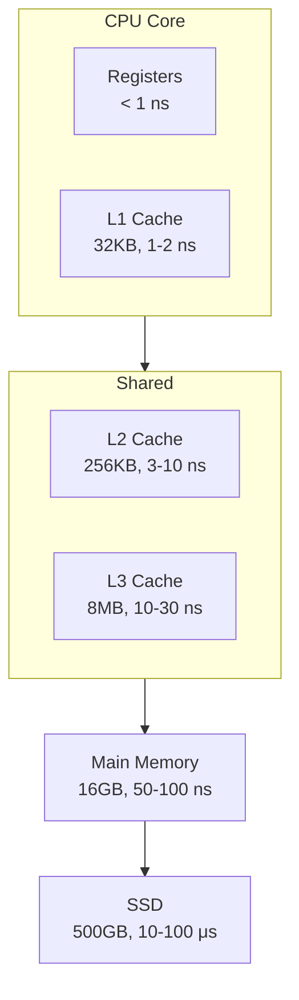

---

## Table of Contents

1. [Introduction](#1-introduction)
2. [Learning Roadmap](#2-learning-roadmap)
3. [Theory Notes](#3-theory-notes)
4. [Key Concepts](#4-key-concepts)
5. [Interview Questions & Answers](#5-interview-questions--answers)
6. [Hands-on Practice](#6-hands-on-practice)
7. [FAANG Interview Questions](#7-faang-interview-questions)
8. [Common Mistakes to Avoid](#8-common-mistakes-to-avoid)
9. [Best Practices](#9-best-practices)
10. [Cheat Sheet](#10-cheat-sheet)
11. [Flash Cards](#11-flash-cards)
12. [Mind Map](#12-mind-map)
13. [Mermaid Diagrams](#13-mermaid-diagrams)
14. [Code Examples](#14-code-examples)
15. [Projects & Ideas](#15-projects--ideas)
16. [Resources](#16-resources)
17. [Interview Preparation Checklist](#17-interview-preparation-checklist)
18. [Revision Notes](#18-revision-notes)
19. [Mock Interview Questions](#19-mock-interview-questions)
20. [Difficulty Rating](#20-difficulty-rating)
21. [Summary](#21-summary)

---

## 1. Introduction

Computer Architecture defines the structure and behavior of computer systems, covering processor design, memory hierarchy, instruction sets, and system organization. It bridges hardware and software, explaining how software instructions translate into hardware operations. Understanding architecture is crucial for performance optimization, system design, and technical interviews.

### Why Computer Architecture Matters

- **Performance optimization** — Write code that leverages hardware efficiently
- **System design** — Make informed decisions about hardware/software trade-offs
- **Debugging** — Understand low-level behavior and edge cases
- **Interview relevance** — Core CS knowledge for systems roles
- **Hardware awareness** — Make better decisions about resource usage

### Core Topics

| Area | Focus | Interview Weight |
|------|-------|-----------------|
| Instruction Set Architecture | ISA types, addressing modes | High |
| Processor Design | Pipelining, hazards, caching | High |
| Memory Hierarchy | Cache, virtual memory, TLB | High |
| I/O Systems | Interrupts, DMA, bus architecture | Medium |
| Parallelism | Multi-core, SIMD, thread-level | High |
| Performance Metrics | CPI, MIPS, throughput | Medium |

---

## 2. Learning Roadmap

### Phase 1: Foundations (Weeks 1-2)
- Study number systems and representations
- Understand instruction set architecture (ISA)
- Learn about CPU components (ALU, control unit, registers)
- Study pipelining fundamentals

### Phase 2: Memory System (Weeks 3-4)
- Master cache organization and mapping
- Understand virtual memory and paging
- Learn about TLB and page tables
- Study memory hierarchy trade-offs

### Phase 3: Processor Design (Weeks 5-6)
- Study data path and control unit design
- Understand pipelining hazards (data, control, structural)
- Learn hazard resolution techniques
- Study branch prediction

### Phase 4: Advanced Topics (Weeks 7-8)
- Learn about multi-core processors
- Study parallel computing models
- Understand I/O systems and interrupts
- Review performance optimization techniques

---

## 3. Theory Notes

### 3.1 Instruction Set Architecture (ISA)

**ISA Components:**
- **Instruction set** — Operations the CPU can perform
- **Data types** — Supported data representations
- **Registers** — programmer-visible storage
- **Addressing modes** — How memory operands are specified
- **Memory architecture** — Byte/word addressing, endianness

**ISA Types:**
| Type | Description | Examples |
|------|-------------|----------|
| CISC | Complex instructions, variable length | x86, VAX |
| RISC | Simple instructions, fixed length | ARM, MIPS, RISC-V |
| VLIW | Very long instruction word | Itanium |

**RISC vs. CISC:**
| Feature | RISC | CISC |
|---------|------|------|
| Instruction length | Fixed (32-bit) | Variable |
| Instruction count | More instructions | Fewer instructions |
| Cycles per instruction | 1 (ideally) | 1-15+ |
| Pipelining | Easier | Harder |
| Compiler complexity | Higher | Lower |
| Hardware complexity | Lower | Higher |

### 3.2 Addressing Modes

| Mode | Effective Address | Use Case |
|------|------------------|----------|
| Immediate | Operand in instruction | Constants |
| Register | Register contents | Fastest access |
| Direct | Address in instruction | Global variables |
| Indirect | Register holds address | Pointers |
| Base+Offset | Base + displacement | Array access, struct fields |
| PC-relative | PC + offset | Branches, position-independent code |
| Indexed | Base + Index × Scale | Array indexing |

### 3.3 Pipelining

**Classic 5-Stage Pipeline:**
1. **IF** — Instruction Fetch
2. **ID** — Instruction Decode / Register Read
3. **EX** — Execute / Address Calculation
4. **MEM** — Memory Access
5. **WB** — Write Back

**Pipeline Hazards:**
- **Data Hazard** — Instruction depends on result of previous instruction
- **Control Hazard** — Branch instruction affects next instruction fetch
- **Structural Hazard** — Hardware resource conflict

**Resolution Techniques:**
| Hazard | Solutions |
|--------|-----------|
| Data (RAW) | Forwarding, stalling, compiler scheduling |
| Data (WAR) | Register renaming |
| Data (WAW) | Out-of-order execution, register renaming |
| Control | Branch prediction, delayed branching, branch target buffer |
| Structural | Resource duplication, scheduling |

### 3.4 Memory Hierarchy

```
Registers     → ~0.5 KB   → <1 ns
L1 Cache      → 32-64 KB  → 1-2 ns
L2 Cache      → 256 KB-1 MB → 3-10 ns
L3 Cache      → 2-32 MB   → 10-30 ns
Main Memory   → 8-128 GB  → 50-100 ns
SSD Storage   → 256 GB-4 TB → 10-100 μs
HDD Storage   → 1-20 TB   → 5-10 ms
```

### 3.5 Cache Organization

**Mapping Strategies:**
- **Direct Mapped** — Each block maps to exactly one cache line
- **Fully Associative** — Any block can go in any line
- **Set Associative** — Compromise: n-way means n lines per set

**Cache Policies:**
- **Write-through** — Write to both cache and memory
- **Write-back** — Write only to cache; write to memory when evicted
- **Write-allocate** — On miss, load block into cache then write
- **No-write-allocate** — On miss, write directly to memory

**Replacement Policies:**
- **LRU** — Least Recently Used
- **FIFO** — First In First Out
- **Random** — Random replacement
- **LFU** — Least Frequently Used

### 3.6 Virtual Memory

**Concept:** Gives each process its own address space, mapped to physical memory.

**Components:**
- **Page Table** — Maps virtual pages to physical frames
- **TLB** — Translation Lookaside Buffer (page table cache)
- **Page Fault** — Access to page not in physical memory

**Page Table Entry (PTE):**
- Valid bit — Is page in physical memory?
- Physical frame number — Where is it?
- Dirty bit — Has page been modified?
- Access bits — Read/Write/Execute permissions
- Referenced bit — Has page been accessed?

**Page Replacement Algorithms:**
- **Optimal** — Replace page that won't be used longest (theoretical)
- **LRU** — Replace least recently used page
- **FIFO** — Replace oldest page
- **Clock (Second Chance)** — Approximation of LRU

---

## 4. Key Concepts

### 4.1 Performance Metrics

**CPU Time = Instruction Count × CPI × Clock Cycle Time**

**CPI (Cycles Per Instruction):** Average cycles taken per instruction.

**MIPS (Millions of Instructions Per Second):** Clock rate / (CPI × 10⁶)

**MFLOPS:** Million floating-point operations per second.

**Amdahl's Law:**
Speedup = 1 / ((1 - f) + f/s)
where f = fraction improved, s = speedup of improved fraction

### 4.2 Branch Prediction

**Static Prediction:**
- Always predict not-taken
- Always predict taken
- Backward taken, forward not-taken

**Dynamic Prediction:**
- **1-bit** — Remember last outcome
- **2-bit saturating counter** — Need two mispredictions to change
- **Correlating** — Use recent branch history
- **Tournament** — Combine multiple predictors

**Branch Target Buffer (BTB):**
Caches the target address of recently taken branches.

### 4.3 Parallelism Types

**Instruction-Level Parallelism (ILP):**
- Pipelining
- Superscalar execution
- VLIW
- Out-of-order execution

**Data-Level Parallelism (DLP):**
- SIMD (Single Instruction, Multiple Data)
- Vector processors
- GPU computing

**Thread-Level Parallelism (TLP):**
- Multi-core processors
- Simultaneous multithreading (SMT/Hyper-threading)
- Multiprocessor systems

### 4.4 I/O Systems

**Interrupt-Driven I/O:**
Device signals CPU when ready; CPU handles interrupt, transfers data.

**DMA (Direct Memory Access):**
Device transfers data directly to/from memory without CPU involvement.

**I/O Methods:**
- Programmed I/O — CPU polls device status
- Interrupt-Driven I/O — CPU handles device interrupts
- DMA — Device handles data transfer directly

---

## 5. Interview Questions & Answers

### Pipelining

**Q1: What is the speedup from pipelining with k stages?**
**A:** Ideally, k× speedup (k-stage pipeline completes one instruction per cycle vs. k cycles without). However, real speedup is less due to: (1) Pipeline overhead (latch delays), (2) Unbalanced stage delays, (3) Pipeline hazards causing stalls, (4) Branch penalties. Effective speedup = Ideal / (1 + stall cycles per instruction). A 5-stage pipeline typically achieves 3-4× speedup.

**Q2: Explain data hazards and how to resolve them.**
**A:** Data hazards occur when an instruction depends on the result of a previous instruction that hasn't completed. Types: (1) **RAW (Read After Write)** — True dependency; instruction reads what previous wrote, (2) **WAR (Write After Read)** — Anti-dependency; instruction writes before previous reads, (3) **WAW (Write After Write)** — Output dependency; both write same location. Resolutions: (1) **Forwarding** — Route result directly to dependent instruction's ALU input, (2) **Stalling** — Insert bubble (nop) until data is ready, (3) **Compiler scheduling** — Reorder instructions to avoid hazards, (4) **Register renaming** — Eliminate false dependencies.

**Q3: What is branch prediction and why is it important?**
**A:** Branch prediction speculatively determines the outcome of a branch before it's resolved. Important because: without prediction, pipeline must stall at every branch (3-5 cycles penalty). With prediction, instructions are fetched speculatively. Accuracy matters: modern predictors achieve 95-99% accuracy. A 5% misprediction rate on a 20-stage pipeline means significant performance loss. Types include 1-bit, 2-bit saturating counters, correlated predictors, and tournament predictors.

**Q4: How does out-of-order execution work?**
**A:** OoO execution allows instructions to execute in an order different from program order, as long as data dependencies are preserved. Components: (1) **Instruction queue** — Buffer decoded instructions, (2) **Reservation stations** — Track when operands are ready, (3) **Reorder buffer** — Maintain program order for commit, (4) **Register renaming** — Map architectural to physical registers to eliminate false dependencies, (5) **Scoreboard** — Track instruction status. Instructions execute as soon as their operands are available, regardless of program order. Results are committed in order to maintain precise exceptions.

### Memory

**Q5: Explain the difference between cache mapping techniques.**
**A:**
- **Direct Mapped** — Each memory block maps to exactly one cache line: line = (block address) mod (number of lines). Simple hardware, but high conflict miss rate.
- **Fully Associative** — Any block can go in any line. Lowest miss rate, but requires searching all lines (expensive hardware).
- **Set Associative** — Compromise: cache divided into sets, each set has n lines (n-way). Block maps to set: set = (block address) mod (number of sets). Within set, any line can hold the block. 2-way or 4-way is common. Balances miss rate and hardware cost.

**Q6: What is the difference between virtual and physical memory?**
**A:** Physical memory is the actual RAM hardware with fixed addresses. Virtual memory gives each process an illusion of private, contiguous address space. The MMU (Memory Management Unit) translates virtual addresses to physical addresses using page tables. Benefits: (1) Each process gets isolated address space, (2) Programs can be larger than physical memory, (3) Memory protection between processes, (4) Simplifies memory allocation. Cost: TLB misses and page faults add latency.

**Q7: How does a TLB work and what happens on a TLB miss?**
**A:** TLB (Translation Lookaside Buffer) caches recent virtual-to-physical page translations. On address translation: (1) Check TLB for virtual page number, (2) If hit: use cached physical frame number (fast), (3) If miss: walk the page table in memory to find translation, (4) Load translation into TLB (may evict old entry), (5) Retry instruction with new TLB entry. TLB miss penalty: ~10-100 cycles (page table walk). Multi-level TLBs and huge pages reduce miss rate.

**Q8: What is cache coherence and why is it important?**
**A:** Cache coherence ensures all processors see a consistent view of memory. In multi-core systems, each core has its own cache; without coherence, core A might see stale data when core B modifies a shared variable. Protocols: (1) **MSI** — Modified, Shared, Invalid states; (2) **MESI** — Adds Exclusive state; (3) **MOESI** — Adds Owned state. Snooping-based (broadcast invalidations) or directory-based (centralized tracking). Critical for correct parallel program execution.

**Q9: What are the three C's of cache misses?**
**A:**
- **Compulsory (Cold) miss** — First access to a block; cache is empty. Unavoidable.
- **Capacity miss** — Cache is too small to hold all needed blocks. Reduced by larger cache.
- **Conflict miss** — Multiple blocks map to same cache set (direct-mapped/set-associative). Reduced by higher associativity.
- **Coherence miss** (sometimes 4th C) — Invalidations due to cache coherence protocol.

Each type has different optimization strategies. Compulsory: prefetching. Capacity: larger cache. Conflict: higher associativity.

**Q10: Explain write-back vs. write-through cache.**
**A:** **Write-through:** On write, update both cache and main memory simultaneously. Simple, consistent, but slow (memory write on every store). **Write-back:** On write, update only cache; mark cache line as dirty. Write to memory only when dirty line is evicted. Faster (fewer memory writes), but more complex (must track dirty bits). Write-back is dominant in modern processors because memory writes are expensive and many writes are to the same location (absorbed by cache).

### Performance

**Q11: State and explain Amdahl's Law.**
**A:** Amdahl's Law: Speedup = 1 / ((1 - f) + f/s), where f is the fraction of execution time improved, s is the speedup of that fraction. Example: if 60% of time is parallelizable (f=0.6) and parallel speedup is 10× (s=10): Speedup = 1 / (0.4 + 0.6/10) = 1/0.46 = 2.17×. Key insight: the serial portion (1-f) limits maximum speedup. Even with infinite parallelism for 60%, overall speedup is capped at 2.5× (1/0.4). This explains why parallel scaling has diminishing returns.

**Q12: What is the difference between throughput and latency?**
**A:** **Latency** — Time for one operation to complete (e.g., 100ns per memory access). **Throughput** — Number of operations completed per unit time (e.g., 10 billion operations/second). A pipeline doesn't reduce individual instruction latency (may even increase it slightly due to latch overhead), but it increases throughput (one instruction completes per cycle). High throughput with moderate latency is often preferable for server workloads.

**Q13: How do you calculate CPI?**
**A:** CPI = Total clock cycles / Total instructions. Or: CPI = Σ (Instruction count_i × Cycles_i) / Total instructions. Example: If 50% of instructions take 1 cycle, 30% take 2 cycles, 20% take 3 cycles: CPI = 0.5×1 + 0.3×2 + 0.2×3 = 0.5 + 0.6 + 0.6 = 1.7. Lower CPI is better. CPI is affected by cache misses (add 10-100 cycles), pipeline stalls, and branch mispredictions.

---

## 6. Hands-on Practice

### Practice 1: Pipeline Diagram

**Instructions:**
```
I1: R1 = A + B
I2: R2 = R1 * C
I3: R3 = R2 + D
```

**Pipeline without forwarding:**
```
Cycle:  1   2   3   4   5   6   7   8   9   10
I1:    IF  ID  EX  MEM WB
I2:        IF  ID  stall stall EX  MEM WB
I3:            IF  stall stall ID  stall stall EX  MEM WB
```

**With forwarding (EX→EX):**
```
Cycle:  1   2   3   4   5   6   7   8
I1:    IF  ID  EX  MEM WB
I2:        IF  ID  EX  MEM WB
I3:            IF  ID  EX  MEM WB
```

### Practice 2: Cache Access Simulation

```python
def simulate_cache_access(cache_size, block_size, access_sequence):
    """Simulate direct-mapped cache and calculate hit rate."""
    num_lines = cache_size // block_size
    cache = {}
    hits = 0
    misses = 0

    for addr in access_sequence:
        block = addr // block_size
        line = block % num_lines

        if line in cache and cache[line] == block:
            hits += 1
        else:
            misses += 1
            cache[line] = block

    total = hits + misses
    return {
        'hits': hits,
        'misses': misses,
        'hit_rate': hits / total if total > 0 else 0,
        'miss_rate': misses / total if total > 0 else 0
    }

# Example: 64B cache, 8B blocks, access pattern
accesses = [0, 8, 16, 24, 0, 8, 32, 40, 0, 8]
result = simulate_cache_access(64, 8, accesses)
print(f"Hit Rate: {result['hit_rate']:.2%}")
print(f"Miss Rate: {result['miss_rate']:.2%}")
```

### Practice 3: Branch Prediction Simulator

```python
class BranchPredictor:
    def __init__(self, strategy="2bit"):
        self.strategy = strategy
        self.history = []
        self.counters = {}  # For 2-bit predictor
        self.global_history = 0
        self.pattern_table = {}  # For correlating predictor

    def predict(self, pc):
        if self.strategy == "always_taken":
            return True
        elif self.strategy == "always_not_taken":
            return False
        elif self.strategy == "1bit":
            return self.counters.get(pc, False)
        elif self.strategy == "2bit":
            state = self.counters.get(pc, 2)  # Start at weakly taken
            return state >= 2
        elif self.strategy == "correlating":
            key = (pc, self.global_history)
            return self.pattern_table.get(key, False)

    def update(self, pc, actually_taken):
        if self.strategy == "1bit":
            self.counters[pc] = actually_taken
        elif self.strategy == "2bit":
            state = self.counters.get(pc, 2)
            if actually_taken:
                self.counters[pc] = min(3, state + 1)
            else:
                self.counters[pc] = max(0, state - 1)
        elif self.strategy == "correlating":
            key = (pc, self.global_history)
            self.pattern_table[key] = actually_taken
            self.global_history = ((self.global_history << 1) | int(actually_taken)) & 0xF

        self.history.append((pc, actually_taken))


# Simulate branch outcomes (1=taken, 0=not taken)
outcomes = [1,1,0,1,1,1,0,0,1,1,0,1,1,1,1,0,0,0,1,1]

for strategy in ["always_taken", "1bit", "2bit", "correlating"]:
    predictor = BranchPredictor(strategy)
    correct = 0
    for i, outcome in enumerate(outcomes):
        prediction = predictor.predict(i % 5)  # Simulate different PCs
        if prediction == bool(outcome):
            correct += 1
        predictor.update(i % 5, bool(outcome))
    print(f"{strategy:20s}: {correct}/{len(outcomes)} ({correct/len(outcomes):.1%})")
```

---

## 7. FAANG Interview Questions

### Google

**Q: How would you design a cache for a web crawler that stores URLs and their content?**
**A:** Key considerations: (1) **Size** — URLs and content vary widely; use variable-size blocks or key-value store, (2) **Replacement policy** — LRU with frequency boost for popular URLs, (3) **Consistency** — Eventually consistent is fine for crawler; no strict coherence needed, (4) **Distribution** — Sharded cache (consistent hashing) across multiple nodes, (5) **Eviction** — TTL-based expiration for freshness; content changes over time, (6) **Serialization** — Use compact formats (Protocol Buffers) for storage efficiency, (7) **Write policy** — Write-behind for new content, write-through for updates, (8) **Prefetching** — Crawl linked pages speculatively.

### Amazon

**Q: How does virtual memory help in a multi-tenant cloud environment?**
**A:** Virtual memory enables: (1) **Isolation** — Each tenant gets private address space; can't access others' data, (2) **Overcommitment** — Physical memory shared across tenants; each gets virtual space exceeding physical allocation, (3) **Security** — Page table permissions prevent unauthorized access, (4) **Efficiency** — Demand paging loads only used pages; shared libraries mapped once, (5) **Migration** — VMs can move between physical hosts transparently, (6) **Swap** — Idle pages swapped to disk under memory pressure, (7) **NUMA awareness** — Optimize for Non-Uniform Memory Access architectures. Key metrics: page fault rate, TLB hit rate, swap utilization.

### Meta

**Q: Explain how SIMD instructions improve performance.**
**A:** SIMD (Single Instruction, Multiple Data) processes multiple data elements with one instruction. Example: AVX-512 can process 16× 32-bit floats simultaneously. Benefits: (1) **Throughput** — 4-16× more data per instruction, (2) **Energy efficiency** — One instruction decode for multiple operations, (3) **Loop optimization** — Vectorize inner loops automatically or manually, (4) **Applications** — Image processing, scientific computing, ML inference, multimedia. Example: Adding two 1000-element arrays: scalar = 1000 additions; SIMD = 63 additions (16-wide vectors). Compilers auto-vectorize; intrinsics provide manual control.

### Apple

**Q: How would you design a memory system for a real-time embedded system?**
**A:** Real-time systems require predictable timing: (1) **Deterministic memory** — No virtual memory (no page faults), use physical addressing, (2) **Scratchpad memory** — Software-managed fast SRAM for critical data, (3) **Cache locking** — Lock critical code/data in cache to prevent eviction, (4) **Memory protection** — MPU (Memory Protection Unit) instead of full MMU for simpler overhead, (5) **WCET analysis** — Worst-Case Execution Time analysis for all memory accesses, (6) **No dynamic allocation** — Pre-allocate all memory at startup, (7) **DMA for bulk transfers** — Offload data movement from CPU, (8) **Memory-mapped I/O** — Direct access to peripherals via memory addresses.

---

## 8. Common Mistakes to Avoid

| Mistake | Problem | Solution |
|---------|---------|----------|
| Ignoring cache effects | Misleading performance measurements | Use cache-flushing techniques |
| Assuming CPI = 1 | Overestimating performance | Measure actual CPI with profiling |
| Neglecting branch prediction | Underestimating branch cost | Profile branch behavior |
| Confusing virtual/physical | Incorrect memory calculations | Always clarify which you're discussing |
| Ignoring memory alignment | Performance penalties | Align data to cache line boundaries |
| Over-optimizing serial code | Amdahl's Law limits speedup | Profile to find actual bottlenecks |

---

## 9. Best Practices

1. **Profile before optimizing** — Know where time is actually spent
2. **Understand your hardware** — Know cache sizes, associativity, TLB
3. **Write cache-friendly code** — Sequential access, spatial locality
4. **Minimize branch mispredictions** — Use branchless code when possible
5. **Align data structures** — Match cache line boundaries
6. **Use appropriate data sizes** — Don't waste cache with unused fields
7. **Consider NUMA** — Memory access time varies by processor
8. **Measure, don't guess** — Use hardware performance counters

---

## 10. Cheat Sheet

```
COMPUTER ARCHITECTURE CHEAT SHEET
═════════════════════════════════

CPU TIME EQUATION
─────────────────
CPU Time = Instructions × CPI × Cycle Time
        = Instructions × CPI / Clock Rate

AMDAHL'S LAW
────────────
Speedup = 1 / ((1 - f) + f/s)
f = fraction parallelizable
s = speedup of parallel fraction

CACHE MAPPING
─────────────
Direct: line = BlockAddr % NumLines
Set-Assoc: set = BlockAddr % NumSets
Fully Assoc: Any line in any set

CACHE MISS TYPES
────────────────
Compulsory: First access (cold)
Capacity: Cache too small
Conflict: Multiple blocks same set
Coherence: Invalidation from other cores

PIPELINE STAGES (Classic RISC)
──────────────────────────────
IF → ID → EX → MEM → WB

HAZARD RESOLUTION
─────────────────
Data: Forwarding, Stalling, Scheduling
Control: Branch prediction, Delayed branch
Structural: Resource duplication

VIRTUAL MEMORY
──────────────
Virtual Addr → TLB → Page Table → Physical Addr
Page Fault → OS handler → Load from disk

MEMORY HIERARCHY (Typical)
──────────────────────────
Reg: <1ns | L1: 1-2ns | L2: 3-10ns
L3: 10-30ns | RAM: 50-100ns
SSD: 10-100μs | HDD: 5-10ms
```

---

## 11. Flash Cards

**Card 1:** What is pipelining?
→ Overlapping execution of multiple instructions to increase throughput.

**Card 2:** What is a data hazard?
→ An instruction depends on the result of a previous instruction still in the pipeline.

**Card 3:** What is cache associativity?
→ How many cache lines a memory block can be placed in (direct, set-associative, fully associative).

**Card 4:** What is virtual memory?
→ Each process gets its own address space, translated to physical memory by the MMU.

**Card 5:** What is Amdahl's Law?
→ Speedup = 1/((1-f) + f/s); the serial fraction limits maximum speedup.

**Card 6:** What is branch prediction?
→ Speculatively determining branch outcome to keep pipeline full.

**Card 7:** What is cache coherence?
→ Ensuring all processors see a consistent view of shared memory.

**Card 8:** What is TLB?
→ Translation Lookaside Buffer; caches virtual-to-physical page translations.

**Card 9:** What is write-back cache?
→ Only writes to cache on store; writes to memory when cache line is evicted.

**Card 10:** What is SIMD?
→ Single Instruction, Multiple Data; processes multiple data elements in parallel.

---

## 12. Mind Map

```
Computer Architecture
│
├─── Instruction Set Architecture
│    ├─── RISC vs CISC
│    ├─── Addressing Modes
│    ├─── Instruction Formats
│    └─── Registers
│
├─── Processor Design
│    ├─── Single Cycle
│    ├─── Multi Cycle
│    ├─── Pipelining
│    │    ├─── Data Hazards
│    │    ├─── Control Hazards
│    │    └─── Structural Hazards
│    ├─── Out-of-Order Execution
│    └─── Branch Prediction
│
├─── Memory System
│    ├─── Cache
│    │    ├─── Mapping (Direct, Assoc)
│    │    ├─── Replacement (LRU, FIFO)
│    │    ├─── Write Policy
│    │    └─── Coherence
│    ├─── Virtual Memory
│    │    ├─── Paging
│    │    ├─── TLB
│    │    └─── Page Faults
│    └─── Memory Hierarchy
│
├─── Parallelism
│    ├─── ILP (Pipeline, Superscalar)
│    ├─── DLP (SIMD, Vector)
│    └─── TLP (Multi-core, SMT)
│
├─── I/O Systems
│    ├─── Interrupts
│    ├─── DMA
│    └─── Buses
│
└─── Performance
     ├─── Metrics (CPI, MIPS)
     ├─── Amdahl's Law
     └─── Profiling
```

---

## 13. Mermaid Diagrams

### 5-Stage Pipeline


### Cache Hierarchy



### Memory Hierarchy Performance

```mermaid
gantt
    title Memory Access Latency Comparison
    dateFormat X
    axisFormat %s ns
    section Latencies
    L1 Cache : 0, 2
    L2 Cache : 0, 10
    L3 Cache : 0, 30
    Main Memory : 0, 100
    SSD : 0, 50000
```



---

## 14. Code Examples

See Hands-on Practice section for implementations of:
1. Cache simulator
2. Branch predictor
3. Pipeline timing analysis

---

## 15. Projects & Ideas

| # | Project | Description | Difficulty | Tools |
|---|---------|-------------|------------|-------|
| 1 | Cache Simulator | Simulate direct/set-associative cache | ⭐⭐⭐ | Python, C |
| 2 | Pipeline Simulator | Visualize pipeline stages and hazards | ⭐⭐⭐⭐ | Python, React |
| 3 | Simple CPU | Build 8-bit CPU in hardware simulator | ⭐⭐⭐⭐⭐ | Logisim, Verilog |
| 4 | Branch Predictor | Implement various prediction strategies | ⭐⭐⭐ | C++, Python |
| 5 | Memory Allocator | Implement malloc/free | ⭐⭐⭐⭐ | C |
| 6 | Virtual Memory | Simulate page table and TLB | ⭐⭐⭐⭐ | Python, C |
| 7 | MIPS Disassembler | Decode MIPS instructions | ⭐⭐⭐ | Python |
| 8 | Performance Profiler | Analyze code with perf counters | ⭐⭐⭐ | Linux, C |

---

## 16. Resources

### Books
- **"Computer Organization and Design"** — Patterson & Hennessy
- **"Computer Architecture: A Quantitative Approach"** — Hennessy & Patterson
- **"Computer Systems: A Programmer's Perspective"** — Bryant & O'Hallaron
- **"Digital Design and Computer Architecture"** — Harris & Harris

### Online Courses
- **Coursera:** Computer Architecture — Princeton
- **edX:** Computer Architecture — RIT
- **MIT OCW:** 6.004 Computation Structures

---

## 17. Interview Preparation Checklist

### Core Knowledge
- [ ] Understand ISA types (RISC vs CISC)
- [ ] Master pipelining and hazards
- [ ] Know cache organization and policies
- [ ] Understand virtual memory and TLB
- [ ] Learn branch prediction techniques

### Performance
- [ ] Calculate CPI and speedup
- [ ] Apply Amdahl's Law
- [ ] Understand memory hierarchy trade-offs
- [ ] Profile code with hardware counters

### Advanced
- [ ] Study cache coherence protocols
- [ ] Learn out-of-order execution
- [ ] Understand SIMD and parallelism
- [ ] Study I/O systems and DMA

---

## 18. Revision Notes

### Key Equations

**CPU Time:** IC × CPI × Cycle Time

**Speedup (Amdahl):** 1 / ((1-f) + f/s)

**Cache Hit Time:** Base + (Index × SetSize) + (Tag × Assoc)

**TLB Access:** 1 cycle if hit; page walk if miss

**CPI Base:** Without stalls/misses

### Performance Counters

- Instructions retired
- Cycles
- Cache misses (L1, L2, L3)
- Branch mispredictions
- TLB misses

---

## 19. Mock Interview Questions

**Q1:** What happens when you access an array with poor spatial locality vs. good locality?

**Q2:** Design a cache replacement policy that considers both recency and frequency.

**Q3:** How would you measure the impact of a TLB miss on a database workload?

**Q4:** Explain how out-of-order execution improves IPC.

**Q5:** What are the trade-offs between shared and private caches?

**Q6:** How does hardware transactional memory work?

**Q7:** Design a simple branch predictor for a loop that iterates 100 times.

**Q8:** What is the impact of false sharing in multi-threaded programs?

---

## 20. Difficulty Rating

| Topic | Difficulty | Time to Master | Priority |
|-------|-----------|----------------|----------|
| ISA Basics | ⭐⭐ | 1 week | High |
| Pipelining | ⭐⭐⭐⭐ | 3 weeks | High |
| Cache Organization | ⭐⭐⭐⭐ | 3 weeks | High |
| Virtual Memory | ⭐⭐⭐⭐ | 2 weeks | High |
| Branch Prediction | ⭐⭐⭐ | 2 weeks | Medium |
| Out-of-Order Execution | ⭐⭐⭐⭐⭐ | 4 weeks | Medium |
| Cache Coherence | ⭐⭐⭐⭐ | 3 weeks | Medium |
| Performance Analysis | ⭐⭐⭐ | 2 weeks | High |

**Overall Interview Difficulty:** ⭐⭐⭐⭐ (Moderate-High)

---

## 21 Summary

Computer Architecture explains how hardware executes software, covering processor design, memory hierarchy, and parallelism. Key areas include pipelining for throughput, cache for reducing memory latency, virtual memory for process isolation, and branch prediction for maintaining pipeline efficiency. Understanding these concepts enables writing performance-aware code and making informed system design decisions.

### Key Takeaways

1. **Pipeline increases throughput** — Not latency, but instructions per cycle
2. **Cache exploits locality** — Spatial and temporal locality are key
3. **Virtual memory enables isolation** — Each process gets private address space
4. **Branch prediction keeps pipeline full** — Modern predictors are 95%+ accurate
5. **Amdahl's Law limits parallel speedup** — Serial fraction is the bottleneck
6. **Cache coherence is essential** — Multi-core requires consistent memory view
7. **Memory hierarchy trades latency for capacity** — Faster = smaller = more expensive
8. **Measure performance** — Use hardware counters, not assumptions

### Next Steps

- Study pipelining with timing diagrams
- Simulate cache behavior for different access patterns
- Profile a program with perf/stat to see real hardware events
- Read Patterson & Hennessy chapters on pipelining and memory

---

> **Pro Tip:** Architecture questions test your understanding of how hardware affects software performance. Be able to trace through pipeline diagrams, calculate cache hit rates, and explain Amdahl's Law with concrete numbers.
