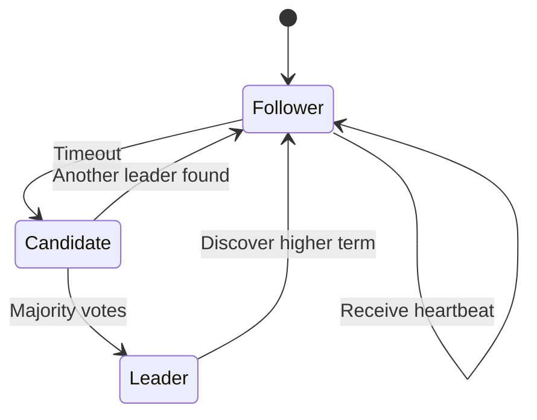
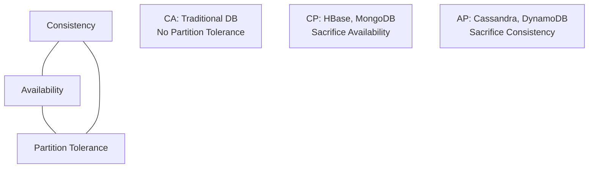

---

## Table of Contents

1. [Introduction](#1-introduction)
2. [Learning Roadmap](#2-learning-roadmap)
3. [Theory Notes](#3-theory-notes)
4. [Key Concepts](#4-key-concepts)
5. [Interview Questions & Answers](#5-interview-questions--answers)
6. [Hands-on Practice](#6-hands-on-practice)
7. [FAANG Interview Questions](#7-faang-interview-questions)
8. [Common Mistakes to Avoid](#8-common-mistakes-to-avoid)
9. [Best Practices](#9-best-practices)
10. [Cheat Sheet](#10-cheat-sheet)
11. [Flash Cards](#11-flash-cards)
12. [Mind Map](#12-mind-map)
13. [Mermaid Diagrams](#13-mermaid-diagrams)
14. [Code Examples](#14-code-examples)
15. [Projects & Ideas](#15-projects--ideas)
16. [Resources](#16-resources)
17. [Interview Preparation Checklist](#17-interview-preparation-checklist)
18. [Revision Notes](#18-revision-notes)
19. [Mock Interview Questions](#19-mock-interview-questions)
20. [Difficulty Rating](#20-difficulty-rating)
21. [Summary](#21-summary)

---

## 1. Introduction

Distributed Systems are collections of independent computers that appear as a single coherent system to users. They enable scalability, reliability, and fault tolerance by distributing computation and data across multiple nodes. Understanding distributed systems is essential for system design interviews and building large-scale applications.

### Why Distributed Systems Matter

- **Scalability** — Handle growing load by adding machines
- **Reliability** — Continue operating despite failures
- **Performance** — Process data closer to users
- **Availability** — Maintain service uptime
- **Interview relevance** — Core topic for system design

### Key Challenges

| Challenge | Description |
|-----------|-------------|
| Partial Failure | Some nodes fail while others continue |
| Concurrency | Multiple nodes access shared resources |
| Network Unreliability | Messages can be lost, delayed, or duplicated |
| Consistency | Keeping data consistent across nodes |
| Ordering | Maintaining consistent order of events |

---

## 2. Learning Roadmap

### Phase 1: Foundations (Weeks 1-2)
- Understand distributed system characteristics
- Learn about network models and failures
- Study consistency and availability trade-offs
- Master CAP theorem

### Phase 2: Consensus & Coordination (Weeks 3-4)
- Study Paxos and Raft consensus algorithms
- Understand distributed locks
- Learn about leader election
- Study distributed transactions (2PC, 3PC)

### Phase 3: Data Distribution (Weeks 5-6)
- Learn replication strategies
- Understand partitioning/sharding
- Study consistency models
- Learn about CRDTs

### Phase 4: Practical Systems (Weeks 7-8)
- Study distributed databases (Cassandra, DynamoDB)
- Learn about message queues (Kafka, RabbitMQ)
- Understand caching strategies (Redis, Memcached)
- Study load balancing algorithms

---

## 3. Theory Notes

### 3.1 CAP Theorem

In a distributed system, you can only guarantee two of three properties:

- **Consistency (C)** — Every read receives the most recent write
- **Availability (A)** — Every request receives a response
- **Partition Tolerance (P)** — System continues despite network partitions

**In practice:** Network partitions are inevitable, so you must choose between CP and AP:
- **CP systems** — Sacrifice availability for consistency (e.g., HBase, MongoDB)
- **AP systems** — Sacrifice consistency for availability (e.g., Cassandra, DynamoDB)

### 3.2 Consistency Models

| Model | Description | Use Case |
|-------|-------------|----------|
| Strong | All nodes see same data at same time | Banking |
| Sequential | Operations appear in some sequential order | Most applications |
| Causal | Causally related operations seen in order | Collaborative editing |
| Eventual | All nodes converge to same state eventually | Social media |

### 3.3 Consensus Algorithms

**Paxos:**
- Nodes propose values
- Majority must agree
- Ensures safety (agreement) and liveness (progress)
- Complex but proven correct

**Raft:**
- Leader-based consensus
- Easier to understand than Paxos
- Leader handles all client requests
- Log replication to followers
- Used in etcd, CockroachDB

### 3.4 Replication Strategies

**Synchronous:**
- Write confirmed after all replicas confirm
- Strong consistency
- Higher latency
- Used where consistency is critical

**Asynchronous:**
- Write confirmed immediately
- eventual consistency
- Lower latency
- Risk of data loss on failure

**Semi-Synchronous:**
- Write confirmed after some replicas
- Balance of consistency and latency

### 3.5 Partitioning/Sharding

**Strategies:**
- **Hash-based** — Hash(key) % num_shards
- **Range-based** — Divide key space into ranges
- **Directory-based** — Lookup service maps keys to shards

**Challenges:**
- Hotspots (uneven distribution)
- Rebalancing when adding/removing nodes
- Cross-shard queries

### 3.6 Distributed Transactions

**Two-Phase Commit (2PC):**
1. Coordinator asks all participants to prepare
2. Participants vote yes/no
3. If all yes: coordinator sends commit; else: abort

**Problems:** Blocking (coordinator failure blocks everyone), single point of failure.

**Three-Phase Commit (3PC):**
Adds pre-commit phase to reduce blocking. Still doesn't guarantee progress with all failures.

**Saga Pattern:**
Series of local transactions with compensating actions for rollback.

---

## 4. Key Concepts

### 4.1 Fault Tolerance

**Fail-Stop:** Node halts and is detected by others.
**Crash Recovery:** Node fails and recovers; must handle state recovery.
**Byzantine:** Node can behave arbitrarily (malicious or buggy).

**Redundancy Types:**
- **Replication** — Multiple copies of data
- **Redundant hardware** — Backup servers
- **Geographic distribution** — Data centers in multiple regions

### 4.2 Load Balancing

**Algorithms:**
- **Round Robin** — Distribute sequentially
- **Least Connections** — Send to server with fewest connections
- **Weighted** — Distribute based on server capacity
- **IP Hash** — Hash client IP to determine server
- **Least Response Time** — Send to fastest responding server

### 4.3 Service Discovery

**Problem:** How do services find each other in a dynamic environment?

**Solutions:**
- **DNS-based** — DNS records point to service instances
- **Service registry** — Central registry (Consul, etcd)
- **Peer-to-peer** — Nodes discover each other directly

### 4.4 Circuit Breaker Pattern

Prevents cascade failures by stopping calls to a failing service.

**States:**
1. **Closed** — Normal operation; requests pass through
2. **Open** — Failure detected; requests fail immediately
3. **Half-Open** — Test if service recovered; limited requests pass

---

## 5. Interview Questions & Answers

**Q1: Explain the CAP theorem with real-world examples.**
**A:** CP example: Banking system — must ensure consistency (account balance is correct) even if some nodes are unavailable. AP example: Social media feed — must remain available even if some nodes have slightly stale data (friend's post might not appear immediately). In practice: Most systems are AP with tunable consistency (Cassandra, DynamoDB). Netflix uses AP for availability; financial systems use CP for consistency.

**Q2: What is eventual consistency and when is it acceptable?**
**A:** Eventual consistency means all nodes will converge to the same value if no new updates are made. Acceptable when: (1) Brief inconsistencies are tolerable (social media feeds), (2) High availability is more important than immediate consistency (DNS), (3) Users can tolerate delays (email delivery). Not acceptable when: (1) Financial transactions require immediate consistency, (2) Safety-critical systems (airline reservations), (3) Users would be confused by stale data.

**Q3: How does Raft consensus work?**
**A:** Raft elects a leader to coordinate. (1) **Leader election** — Nodes start as followers; if no heartbeat, candidate requests votes; majority wins election, (2) **Log replication** — Leader receives client requests, appends to log, replicates to followers, (3) **Commitment** — Once majority acknowledge, entry is committed, (4) **Safety** — Committed entries are never lost; leader replacement preserves log. Key properties: at most one leader per term; log entries from leader are append-only; committed entries are eventually applied by all.

**Q4: Design a distributed cache.**
**A:** (1) **Consistent hashing** — Distribute keys across nodes; when node added/removed, only adjacent keys move, (2) **Replication** — Each key stored on N nodes for fault tolerance, (3) **Eviction** — LRU or LFU per node, (4) **Consistency** — Configurable: strong (read from primary), eventual (read from any), (5) **Write-through/write-back** — Options for database synchronization, (6) **Hotspot handling** — Replicate hot keys, (7) **Monitoring** — Hit rate, memory usage, eviction rate per node, (8) **Failure handling** — When node fails, requests go to next node in hash ring.

**Q5: What is the difference between 2PC and Sagas?**
**A:** 2PC: Coordinator ensures all participants commit or all abort atomically. Blocking protocol — coordinator failure blocks everyone. Used in traditional databases. Sagas: Series of local transactions, each with a compensating action. Non-blocking but eventually consistent. If step 3 fails, steps 1 and 2 are compensated (not rolled back). More scalable but requires careful compensation logic. Sagas are preferred in microservices; 2PC in single databases.

---

## 6. Hands-on Practice

### Practice 1: Consistent Hashing Implementation

```python
import hashlib
from bisect import bisect_right
from typing import Any, Optional


class ConsistentHashRing:
    """Consistent hash ring for distributed caching."""

    def __init__(self, virtual_nodes: int = 150):
        self.virtual_nodes = virtual_nodes
        self.ring = {}
        self.sorted_keys = []
        self.nodes = set()

    def _hash(self, key: str) -> int:
        return int(hashlib.md5(key.encode()).hexdigest(), 16)

    def add_node(self, node: str):
        """Add a node to the ring."""
        self.nodes.add(node)
        for i in range(self.virtual_nodes):
            virtual_key = f"{node}:v{i}"
            hash_val = self._hash(virtual_key)
            self.ring[hash_val] = node
            self.sorted_keys.append(hash_val)
        self.sorted_keys.sort()

    def remove_node(self, node: str):
        """Remove a node from the ring."""
        self.nodes.discard(node)
        for i in range(self.virtual_nodes):
            virtual_key = f"{node}:v{i}"
            hash_val = self._hash(virtual_key)
            if hash_val in self.ring:
                del self.ring[hash_val]
                self.sorted_keys.remove(hash_val)

    def get_node(self, key: str) -> Optional[str]:
        """Get the node responsible for the given key."""
        if not self.ring:
            return None
        hash_val = self._hash(key)
        idx = bisect_right(self.sorted_keys, hash_val) % len(self.sorted_keys)
        return self.ring[self.sorted_keys[idx]]

    def get_distribution(self) -> dict:
        """Get the distribution of keys across nodes."""
        dist = {node: 0 for node in self.nodes}
        for key in range(10000):
            node = self.get_node(f"key_{key}")
            if node:
                dist[node] += 1
        return dist


# Demo
ring = ConsistentHashRing(virtual_nodes=100)
ring.add_node("node_1")
ring.add_node("node_2")
ring.add_node("node_3")

print("Initial distribution:")
dist = ring.get_distribution()
for node, count in sorted(dist.items()):
    print(f"  {node}: {count/100:.1f}%")

# Add new node
ring.add_node("node_4")
print("\nAfter adding node_4:")
dist = ring.get_distribution()
for node, count in sorted(dist.items()):
    print(f"  {node}: {count/100:.1f}%")
```

### Practice 2: Simple Leader Election

```python
import random
import time
from enum import Enum
from dataclasses import dataclass
from typing import List, Optional


class NodeState(Enum):
    FOLLOWER = "follower"
    CANDIDATE = "candidate"
    LEADER = "leader"


@dataclass
class Node:
    id: int
    state: NodeState = NodeState.FOLLOWER
    current_term: int = 0
    voted_for: Optional[int] = None
    log: list = None

    def __post_init__(self):
        if self.log is None:
            self.log = []

    def start_election(self, peers: List['Node']) -> bool:
        """Attempt to become leader."""
        self.current_term += 1
        self.state = NodeState.CANDIDATE
        self.voted_for = self.id

        votes = 1  # Vote for self
        for peer in peers:
            if peer.current_term < self.current_term:
                peer.current_term = self.current_term
                peer.voted_for = self.id
                votes += 1

        majority = (len(peers) + 1) // 2 + 1
        if votes >= majority:
            self.state = NodeState.LEADER
            print(f"Node {self.id} elected leader (term {self.current_term})")
            return True
        else:
            self.state = NodeState.FOLLOWER
            return False


def simulate_election():
    """Simulate leader election with 5 nodes."""
    nodes = [Node(id=i) for i in range(5)]

    # Random node starts election
    candidate = random.choice(nodes)
    peers = [n for n in nodes if n.id != candidate.id]

    print(f"Node {candidate.id} starting election...")
    elected = candidate.start_election(peers)

    if elected:
        print(f"Node {candidate.id} is now the leader!")
    else:
        print("Election failed, trying again...")

    return candidate


simulate_election()
```

---

## 7. FAANG Interview Questions

### Google

**Q: Design a globally distributed key-value store.**
**A:** (1) **Data model** — Key-value with versioning (vector clocks), (2) **Partitioning** — Consistent hashing across nodes; virtual nodes for balance, (3) **Replication** — Replicate to N nodes in preference list; quorum for read/write (W+R>N for consistency), (4) **Consistency** — Tunable: strong (read from primary), eventual (read from any), (5) **Conflict resolution** — Last-write-wins or vector clocks for causality, (6) **Failure detection** — Gossip protocol; heartbeat, (7) **Anti-entropy** — Merkle trees for replica synchronization, (8) **Client API** — get(key), put(key, value), delete(key), (9) **Membership** — Consistent hashing ring with failure handling, (10) **Read repair** — On read, detect and fix inconsistent replicas.

### Amazon

**Q: How would you design a message queue for billions of daily messages?**
**A:** (1) **Architecture** — Partitioned log-based (Kafka-style), (2) **Partitioning** — Topic partitions distributed across brokers; hash-based assignment, (3) **Replication** — ISR (In-Sync Replicas) for fault tolerance, (4) **Ordering** — Guarantee ordering within partition, not across partitions, (5) **Retention** — Time-based and size-based retention; compacted topics for latest value, (6) **Consumer groups** — Parallel consumption within group; each partition consumed by one consumer, (7) **Delivery** — At-least-once by default; exactly-once with idempotent producers, (8) **Performance** — Sequential I/O, zero-copy, batching, compression, (9) **Monitoring** — Consumer lag, throughput, broker health, (10) **Scaling** — Add brokers and rebalance partitions.

---

## 8. Common Mistakes to Avoid

| Mistake | Problem | Solution |
|---------|---------|----------|
| Ignoring network failures | Assumes perfect network | Handle timeouts, retries, circuit breakers |
| Assuming synchronous calls | Creates cascading failures | Use async messaging, timeouts |
| Single point of failure | Entire system fails | Redundancy at every level |
| Ignoring clock skew | Distributed timestamps unreliable | Use logical clocks, not wall time |
| Not handling partial failures | System in inconsistent state | Design for failure at every step |

---

## 9. Best Practices

1. **Assume everything will fail** — Design for failure, not just success
2. **Use idempotent operations** — Safe to retry
3. **Implement circuit breakers** — Prevent cascade failures
4. **Monitor everything** — Distributed tracing, metrics, logs
5. **Use timeouts** — Don't wait forever
6. **Design for observability** — You can't fix what you can't see
7. **Test failure scenarios** — Chaos engineering
8. **Keep it simple** — Distributed systems are hard; minimize complexity

---

## 10. Cheat Sheet

```
DISTRIBUTED SYSTEMS CHEAT SHEET
═══════════════════════════════

CAP THEOREM
───────────
C = Consistency (all nodes see same data)
A = Availability (every request gets response)
P = Partition Tolerance (works despite network failures)
Choose 2 of 3; in practice, always P, choose C or A

CONSENSUS (Raft)
────────────────
Leader election → Log replication → Commitment
Majority quorum required for decisions

REPLICATION
───────────
Synchronous: Strong consistency, higher latency
Asynchronous: Eventual consistency, lower latency
Quorum: W + R > N for consistency

PARTITIONING
────────────
Hash-based: hash(key) % num_shards
Range-based: divide key space into ranges
Directory-based: lookup service

FAULT TOLERANCE
───────────────
Redundancy: Multiple copies
Replication: Data on multiple nodes
Failover: Automatic switch to backup

PATTERNS
────────
Circuit Breaker: Stop calling failing service
Saga: Compensating transactions for distributed TX
CQRS: Separate read/write models
Event Sourcing: Store events, not state
```

---

## 11. Flash Cards

**Card 1:** What is the CAP theorem?
→ Distributed systems can only guarantee two of: Consistency, Availability, Partition tolerance.

**Card 2:** What is eventual consistency?
→ All nodes converge to same state eventually if no new updates; temporary inconsistency allowed.

**Card 3:** How does Raft consensus work?
→ Leader election, log replication, majority quorum for committing entries.

**Card 4:** What is consistent hashing?
→ Hash ring distributes keys; only K/N keys move when node added/removed.

**Card 5:** What is a quorum?
→ Minimum number of nodes that must agree for an operation to succeed (W+R>N).

**Card 6:** What is 2PC?
→ Two-Phase Commit: prepare phase then commit phase for distributed transactions.

**Card 7:** What is the circuit breaker pattern?
→ Stop calling a failing service; transition through closed/open/half-open states.

**Card 8:** What is a vector clock?
→ Vector of timestamps tracking causal relationships between events across nodes.

**Card 9:** What is Gossip protocol?
→ Protocol where nodes exchange state information with random peers periodically.

**Card 10:** What is the difference between strong and eventual consistency?
→ Strong: all nodes see same data immediately. Eventual: nodes converge eventually.

---

## 12. Mind Map

```
Distributed Systems
│
├─── Fundamentals
│    ├─── CAP Theorem
│    ├─── Consistency Models
│    ├─── Failure Modes
│    └─── Network Models
│
├─── Consensus
│    ├─── Paxos
│    ├─── Raft
│    ├─── ZAB
│    └─── PBFT
│
├─── Data Management
│    ├─── Replication
│    ├─── Partitioning/Sharding
│    ├─── Consistency (Strong/Eventual)
│    └─── Transactions (2PC, Saga)
│
├─── Coordination
│    ├─── Leader Election
│    ├─── Distributed Locks
│    ├─── Service Discovery
│    └─── Clock Sync
│
├─── Patterns
│    ├─── Circuit Breaker
│    ├─── Saga
│    ├─── CQRS
│    ├─── Event Sourcing
│    └─── Bulkhead
│
├─── Infrastructure
│    ├─── Load Balancing
│    ├─── Caching
│    ├─── Message Queues
│    └─── Service Mesh
│
└─── Observability
     ├─── Distributed Tracing
     ├─── Metrics
     ├─── Logging
     └─── Alerting
```

---

## 13. Mermaid Diagrams

### Raft Consensus Flow



### CAP Theorem Triangle



---

## 14. Code Examples

See Hands-on Practice section for consistent hashing and leader election implementations.

---

## 15. Projects & Ideas

| # | Project | Description | Difficulty | Tools |
|---|---------|-------------|------------|-------|
| 1 | Distributed Cache | Consistent hashing cache | ⭐⭐⭐ | Python, Redis |
| 2 | Key-Value Store | Simple distributed KV store | ⭐⭐⭐⭐⭐ | Go, gRPC |
| 3 | Message Queue | Basic pub/sub messaging | ⭐⭐⭐⭐ | Go, TCP |
| 4 | Leader Election | Raft consensus implementation | ⭐⭐⭐⭐⭐ | Go, etcd |
| 5 | Load Balancer | L4/L7 load balancer | ⭐⭐⭐⭐ | Go, Nginx |
| 6 | Service Discovery | Consul-like service registry | ⭐⭐⭐⭐ | Go, gRPC |
| 7 | Distributed Lock | Redis-based distributed lock | ⭐⭐⭐ | Redis, Python |
| 8 | Circuit Breaker | Fault tolerance library | ⭐⭐ | Any language |

---

## 16. Resources

### Books
- **"Designing Data-Intensive Applications"** by Martin Kleppmann
- **"Distributed Systems"** by Tanenbaum & Van Steen
- **"Understanding Distributed Systems"** by Roberto Vitillo

### Papers
- **"Time, Clocks, and the Ordering of Events"** — Lamport
- **"The Part-Time Parliament (Paxos)"** — Lamport
- **"In Search of an Understandable Consensus Algorithm (Raft)"** — Ongaro & Ousterhout

---

## 17. Interview Preparation Checklist

### Fundamentals
- [ ] Understand CAP theorem and its implications
- [ ] Know different consistency models
- [ ] Understand common failure modes
- [ ] Learn about network partitions

### Algorithms
- [ ] Study Raft consensus algorithm
- [ ] Understand Paxos basics
- [ ] Learn about leader election
- [ ] Study 2PC and Sagas

### Data Distribution
- [ ] Understand replication strategies
- [ ] Learn partitioning/sharding approaches
- [ ] Study quorum-based consistency
- [ ] Learn about CRDTs

### Practical Knowledge
- [ ] Know distributed caching strategies
- [ ] Understand message queue architectures
- [ ] Learn circuit breaker pattern
- [ ] Study distributed tracing

---

## 18. Revision Notes

### Key Formulas

**Quorum:** W + R > N (W=write replicas, R=read replicas, N=total replicas)

**Availability (AP):** System available even if some nodes fail

**Consistency (CP):** All nodes return same value

**Consistent Hashing:** Node for key = hash(key) ring position

---

## 19. Mock Interview Questions

**Q1:** Design a distributed counter that can handle millions of operations per second.

**Q2:** How would you handle data consistency in a microservices architecture?

**Q3:** Explain the difference between synchronous and asynchronous replication.

**Q4:** Design a distributed lock with timeout and automatic release.

**Q5:** How would you detect and handle network partitions?

**Q6:** What is the difference between at-least-once, at-most-once, and exactly-once delivery?

**Q7:** How do you handle hotspots in a distributed cache?

**Q8:** Design a globally distributed notification system.

---

## 20. Difficulty Rating

| Topic | Difficulty | Time to Master | Priority |
|-------|-----------|----------------|----------|
| CAP Theorem | ⭐⭐⭐ | 1-2 weeks | High |
| Consistency Models | ⭐⭐⭐ | 2 weeks | High |
| Raft/Paxos | ⭐⭐⭐⭐⭐ | 4+ weeks | High |
| Replication | ⭐⭐⭐ | 2 weeks | High |
| Sharding | ⭐⭐⭐ | 2 weeks | High |
| Distributed Transactions | ⭐⭐⭐⭐ | 3 weeks | Medium |
| Load Balancing | ⭐⭐ | 1 week | High |
| Circuit Breaker | ⭐⭐ | 1 week | Medium |

**Overall Interview Difficulty:** ⭐⭐⭐⭐⭐ (High)

---

## 21. Summary

Distributed systems enable building scalable, reliable applications by distributing computation across multiple machines. Key concepts include CAP theorem, consensus algorithms (Raft/Paxos), replication strategies, partitioning, and fault tolerance patterns. Understanding these concepts is essential for system design interviews and building production-grade distributed applications.

### Key Takeaways

1. **CAP theorem limits choices** — Choose between consistency and availability
2. **Network is unreliable** — Design for partitions and failures
3. **Consensus is hard** — Use proven algorithms (Raft, Paxos)
4. **Eventual consistency is practical** — For most applications
5. **Idempotency is essential** — Safe retries in distributed systems
6. **Circuit breakers prevent cascades** — Stop calling failing services
7. **Observability is critical** — Distributed tracing, metrics, logging
8. **Test failure scenarios** — Chaos engineering reveals weaknesses

---

> **Pro Tip:** Distributed systems interviews test your understanding of trade-offs. Always discuss the trade-offs between consistency and availability, latency and throughput, simplicity and fault tolerance. Show that you understand why distributed systems are hard.
