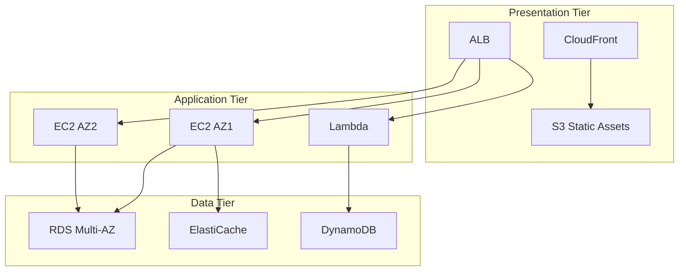

---

## Table of Contents

1. [Introduction](#1-introduction)
2. [Learning Roadmap](#2-learning-roadmap)
3. [Theory Notes](#3-theory-notes)
4. [Key Concepts](#4-key-concepts)
5. [Interview Questions & Answers](#5-interview-questions--answers)
6. [Hands-on Practice](#6-hands-on-practice)
7. [FAANG Interview Questions](#7-faang-interview-questions)
8. [Common Mistakes to Avoid](#8-common-mistakes-to-avoid)
9. [Best Practices](#9-best-practices)
10. [Cheat Sheet](#10-cheat-sheet)
11. [Flash Cards](#11-flash-cards)
12. [Mind Map](#12-mind-map)
13. [Mermaid Diagrams](#13-mermaid-diagrams)
14. [Code Examples](#14-code-examples)
15. [Projects & Ideas](#15-projects--ideas)
16. [Resources](#16-resources)
17. [Interview Preparation Checklist](#17-interview-preparation-checklist)
18. [Revision Notes](#18-revision-notes)
19. [Mock Interview Questions](#19-mock-interview-questions)
20. [Difficulty Rating](#20-difficulty-rating)
21. [Summary](#21-summary)

---

## 1. Introduction

Amazon Web Services (AWS) is the world's most comprehensive cloud platform, offering over 200 services from compute and storage to AI/ML and IoT. AWS knowledge is essential for backend developers, DevOps engineers, and architects, as it's the most widely used cloud provider.

### Why AWS Matters

- **Market leader** — 32% cloud market share
- **Breadth of services** — 200+ fully featured services
- **Enterprise adoption** — Used by Fortune 500 companies
- **Career opportunities** — Most in-demand cloud skills
- **Interview relevance** — Common platform for system design

### AWS Global Infrastructure

| Concept | Description |
|---------|-------------|
| Region | Geographic area (us-east-1, eu-west-1) |
| AZ | Data center within a region (2-6 per region) |
| Edge Location | CDN/POP points (200+ locations) |
| Local Zone | Extended AZ closer to end users |

---

## 2. Learning Roadmap

### Phase 1: Core Services (Weeks 1-2)
- EC2 (compute), S3 (storage), RDS (database)
- VPC (networking), IAM (security)
- AWS CLI basics

### Phase 2: Essential Services (Weeks 3-4)
- Lambda (serverless), API Gateway
- DynamoDB (NoSQL), ElastiCache
- SQS/SNS (messaging), CloudFront (CDN)

### Phase 3: Architecture (Weeks 5-6)
- Well-Architected Framework
- High availability patterns
- Disaster recovery strategies
- Cost optimization

### Phase 4: Advanced (Weeks 7-8)
- ECS/EKS (containers)
- CloudFormation (IaC)
- CloudWatch (monitoring)
- Security best practices

---

## 3. Theory Notes

### 3.1 Compute Services

**EC2 Instance Types:**
| Family | Purpose | Example |
|--------|---------|---------|
| General Purpose | Balanced | t3, m5 |
| Compute Optimized | CPU-heavy | c5, c6g |
| Memory Optimized | RAM-heavy | r5, x1 |
| Storage Optimized | I/O-heavy | i3, d2 |
| Accelerated | GPU/ML | p3, g4 |

**EC2 Pricing:**
- **On-Demand** — Pay per hour/second
- **Reserved** — 1 or 3 year commitment (30-60% savings)
- **Spot** — Unused capacity (60-90% savings, can be interrupted)
- **Dedicated** — Physical server for compliance

### 3.2 Storage Services

**S3 Storage Classes:**
| Class | Use Case | Cost |
|-------|----------|------|
| Standard | Frequently accessed | $$$ |
| Intelligent-Tiering | Unknown access patterns | $$ |
| Standard-IA | Infrequent access | $$ |
| One Zone-IA | Infrequent, non-critical | $ |
| Glacier Instant | Archive, millisecond retrieval | $ |
| Glacier Flexible | Archive, minutes-hours | ¢ |
| Glacier Deep | Archive, 12+ hours | ¢¢ |

### 3.3 Database Services

**RDS Engines:** MySQL, PostgreSQL, MariaDB, Oracle, SQL Server, Aurora

**DynamoDB:**
- Key-value and document database
- Single-digit millisecond performance
- Auto-scaling
- Eventual or strong consistency

### 3.3 Networking

**VPC Components:**
- Subnets (public/private)
- Route tables
- Internet Gateway (public access)
- NAT Gateway (private outbound)
- Security Groups (stateful firewall)
- Network ACLs (stateless firewall)

### 3.4 Security

**IAM Best Practices:**
- Least privilege principle
- Use roles, not access keys
- Enable MFA
- Rotate credentials
- Use AWS Organizations for multi-account

### 3.5 Well-Architected Framework

**Six Pillars:**

| Pillar | Key Principles |
|--------|---------------|
| **Operational Excellence** | Automate operations, observe, iterate, IaC |
| **Security** | Defense in depth, traceability, automate security best practices |
| **Reliability** | Auto-recover from failures, meet demand, mitigate disruptions |
| **Performance Efficiency** | Use resources efficiently, maintain efficiency as demand changes |
| **Cost Optimization** | Avoid unnecessary costs, understand spending patterns |
| **Sustainability** | Minimize environmental impact of running cloud workloads |

### 3.6 Disaster Recovery Options

| Strategy | Description | RPO | RTO | Cost |
|----------|-------------|-----|-----|------|
| **Backup & Restore** | Restore from backups to new infrastructure | Hours | Hours | Low |
| **Pilot Light** | Minimal always-on infrastructure, scale up on failover | Minutes | Minutes | Medium |
| **Warm Standby** | Scaled-down but running full stack, scale up on failover | Seconds | Minutes | Medium-High |
| **Multi-Site Active-Active** | Full capacity running in multiple regions simultaneously | Near zero | Near zero | High |

### 3.7 Advanced Networking

**VPC Flow Logs:** Capture IP traffic metadata for troubleshooting and security analysis
**VPC Endpoints:** Private connectivity to AWS services without internet (Gateway or Interface endpoints)
**Transit Gateway:** Hub for connecting VPCs and on-premises networks
**Direct Connect:** Dedicated network connection from on-premises to AWS
**PrivateLink:** Private connectivity between VPCs, AWS services, and on-premises

---

## 4. Key Concepts

### 4.1 Serverless Services

| Service | Purpose |
|---------|---------|
| Lambda | Compute (functions) |
| API Gateway | HTTP endpoints |
| DynamoDB | Database |
| S3 | Object storage |
| SQS/SNS | Messaging |
| Step Functions | Workflow orchestration |
| EventBridge | Event bus |

### 4.2 Container Services

| Service | Description |
|---------|-------------|
| ECS | Managed container orchestration |
| EKS | Managed Kubernetes |
| Fargate | Serverless containers |
| ECR | Container registry |

### 4.3 Monitoring & Logging

| Service | Purpose |
|---------|---------|
| CloudWatch | Metrics, logs, alarms |
| CloudTrail | API audit logging |
| X-Ray | Distributed tracing |
| GuardDuty | Threat detection |

### 4.4 Infrastructure as Code

| Service | Description |
|---------|-------------|
| CloudFormation | AWS-native IaC |
| CDK | Programmatic IaC |
| Terraform | Multi-cloud IaC |

---

## 5. Interview Questions & Answers

**Q1: Design a three-tier architecture on AWS.**
**A:** (1) **Presentation tier** — S3 + CloudFront for static assets; ALB for dynamic, (2) **Application tier** — EC2 in Auto Scaling Group across 2+ AZs; or Lambda + API Gateway for serverless, (3) **Data tier** — RDS Multi-AZ for relational data; ElastiCache for caching; S3 for object storage, (4) **Networking** — VPC with public/private subnets; NAT Gateway for private outbound, (5) **Security** — Security groups per tier; WAF for web attacks; IAM roles for services.

**Q2: When would you use DynamoDB vs. RDS?**
**A:** DynamoDB: Simple key-value access, single-digit ms latency at any scale, auto-scaling, serverless. RDS: Complex queries, JOINs, ACID transactions, relational data, SQL expertise. Use DynamoDB for: session storage, user profiles, gaming leaderboards, IoT data. Use RDS for: e-commerce (orders/products), financial systems, any data requiring relationships.

**Q3: How do you optimize S3 costs?**
**A:** (1) **Lifecycle policies** — Auto-transition to cheaper tiers, (2) **Intelligent-Tiering** — Auto-optimize for unknown access, (3) **Delete old versions** — Enable versioning but clean up, (4) **Compress** — Store compressed objects, (5) **Multipart upload** — For large files, (6) **Inventory** — Find and delete unused objects, (7) **S3 Batch Operations** — Bulk changes to millions of objects, (8) **Select** — Query data in S3 without downloading.

**Q4: Explain the difference between Security Groups and Network ACLs.**
**A:** Security Groups: Instance-level, stateful (return traffic auto-allowed), allow rules only, evaluated as a whole. Network ACLs: Subnet-level, stateless (must allow both inbound and outbound), allow and deny rules, evaluated in order. Use Security Groups for most cases (simpler); use NACLs for additional subnet-level control (e.g., blocking specific IPs).

**Q5: How do you handle a sudden traffic spike on AWS?**
**A:** (1) **Auto Scaling** — Ensure ASG can scale to maximum capacity, (2) **ELB** — Distribute traffic across instances, (3) **CloudFront** — Cache static content at edge, (4) **Read replicas** — Scale database reads, (5) **ElastiCache** — Cache frequent queries, (6) **Reserved headroom** — Maintain warm capacity for spikes, (7) **Predictive scaling** — ML-based pre-scaling, (8) **DynamoDB on-demand** — For NoSQL workloads.

---

## 6. Hands-on Practice

### Practice 1: Deploy a Static Website to S3

```bash
# Create bucket
aws s3 mb s3://my-website-bucket --region us-east-1

# Enable static website hosting
aws s3 website s3://my-website-bucket \
  --index-document index.html \
  --error-document error.html

# Set bucket policy for public access
aws s3api put-bucket-policy --bucket my-website-bucket --policy file://policy.json

# Sync files
aws s3 sync ./website s3://my-website-bucket

# Create CloudFront distribution
aws cloudfront create-distribution \
  --origin-domain-name my-website-bucket.s3.amazonaws.com \
  --default-root-object index.html
```

### Practice 2: Serverless API with Lambda

```python
# lambda_function.py
import json
import boto3

dynamodb = boto3.resource('dynamodb')
table = dynamodb.Table('Users')

def lambda_handler(event, context):
    http_method = event['httpMethod']
    path = event['path']
    
    if http_method == 'GET' and '/users' in path:
        user_id = event['pathParameters']['id']
        response = table.get_item(Key={'user_id': user_id})
        return {
            'statusCode': 200,
            'headers': {'Content-Type': 'application/json'},
            'body': json.dumps(response.get('Item', {}))
        }
    
    elif http_method == 'POST' and '/users' in path:
        body = json.loads(event['body'])
        table.put_item(Item=body)
        return {
            'statusCode': 201,
            'body': json.dumps({'message': 'User created'})
        }
    
    return {
        'statusCode': 404,
        'body': json.dumps({'error': 'Not found'})
    }
```

---

## 7. FAANG Interview Questions

### Amazon

**Q: Design a scalable order processing system on AWS.**
**A:** (1) **API Layer** — ALB → ECS Fargate (or Lambda + API Gateway), (2) **Queue** — SQS for order processing (decouple API from processing), (3) **Processing** — Lambda or ECS consumers process orders from queue, (4) **Database** — DynamoDB for orders (auto-scaling), (5) **Payments** — Integration with payment gateway via Lambda, (6) **Notifications** — SNS for order confirmations, (7) **Storage** — S3 for order documents/invoices, (8) **Monitoring** — CloudWatch alarms for queue depth, error rates, (9) **Security** — IAM roles per service, VPC for network isolation, (10) **Scaling** — SQS + Lambda auto-scale with queue depth.

### Google

**Q: How would you implement a real-time analytics pipeline on AWS?**
**A:** (1) **Ingestion** — Kinesis Data Streams for real-time events, (2) **Processing** — Kinesis Data Firehose for batch transformation, (3) **Storage** — S3 for raw data (data lake), (4) **Analytics** — Athena for SQL queries on S3, (5) **Visualization** — QuickSight for dashboards, (6) **Real-time** — Kinesis Data Analytics for streaming SQL, (7) **Archive** — S3 Glacier for long-term retention, (8) **Security** — KMS for encryption, IAM for access, (9) **Monitoring** — CloudWatch for pipeline health, (10) **Cost** — S3 lifecycle policies; Firehose auto-scaling.

---

## 8. Common Mistakes to Avoid

| Mistake | Problem | Solution |
|---------|---------|----------|
| Using root account | Security risk | Create IAM users with least privilege |
| Not enabling MFA | Account vulnerable | Enable MFA on all accounts |
| Hardcoded credentials | Security risk | Use IAM roles and roles anywhere |
| Single-AZ deployment | No failover | Deploy across multiple AZs |
| Ignoring costs | Unexpected bills | Set billing alarms and budgets |
| No backups | Data loss risk | Enable automated backups |

---

## 9. Best Practices

1. **Use IAM roles** — Not access keys for services
2. **Enable MFA** — On all users, especially root
3. **Tag resources** — For cost allocation and management
4. **Use managed services** — Let AWS handle infrastructure
5. **Design for failure** — Multi-AZ, auto scaling
6. **Automate with IaC** — CloudFormation or Terraform
7. **Monitor everything** — CloudWatch alarms
8. **Review costs regularly** — Cost Explorer, budgets
9. **Encrypt data** — At rest (KMS) and in transit (TLS)
10. **Use VPC endpoints** — Avoid public internet for AWS service access

---

## 10. Cheat Sheet

```
AWS CHEAT SHEET
═══════════════

COMPUTE
───────
EC2: Virtual machines
Lambda: Serverless functions
ECS/EKS: Containers
Fargate: Serverless containers

STORAGE
───────
S3: Object storage
EBS: Block storage (EC2)
EFS: File storage (NFS)
Glacier: Archive storage

DATABASE
────────
RDS: Managed relational
DynamoDB: NoSQL key-value
ElastiCache: In-memory cache
Redshift: Data warehouse

NETWORKING
──────────
VPC: Virtual private cloud
ALB/NLB: Load balancing
CloudFront: CDN
Route 53: DNS

SECURITY
────────
IAM: Identity & access
KMS: Key management
WAF: Web application firewall
Shield: DDoS protection

MONITORING
──────────
CloudWatch: Metrics/logs
CloudTrail: API audit
X-Ray: Distributed tracing
GuardDuty: Threat detection
```

---

## 11. Flash Cards

**Card 1:** What is the difference between S3 and EBS?
→ S3: object storage, accessed via API; EBS: block storage, attached to EC2.

**Card 2:** What is the difference between SQS and SNS?
→ SQS: message queue (one consumer); SNS: pub/sub (many subscribers).

**Card 3:** What is Lambda's maximum execution time?
→ 15 minutes.

**Card 4:** What is the difference between Security Groups and NACLs?
→ Security Groups: instance-level, stateful; NACLs: subnet-level, stateless.

**Card 5:** What is the S3 consistency model?
→ Strongly consistent for all operations (as of December 2020).

**Card 6:** What is DynamoDB?
→ Managed NoSQL database; single-digit ms latency at any scale.

**Card 7:** What is ECS Fargate?
→ Serverless container runtime; run Docker without managing servers.

**Card 8:** What is CloudFront?
→ CDN; caches content at edge locations globally.

**Card 9:** What is the Well-Architected Framework?
→ AWS best practices across 6 pillars: operational excellence, security, reliability, performance, cost, sustainability.

**Card 10:** What is the difference between On-Demand, Reserved, and Spot?
→ On-Demand: pay per hour; Reserved: commit 1-3 years (savings); Spot: unused capacity (cheapest, interruptible).

---

## 12. Mind Map

```
AWS
│
├─── Compute
│    ├─── EC2 (instances, AMIs, groups)
│    ├─── Lambda (functions)
│    ├─── ECS/EKS (containers)
│    └─── Lightsail (simple VPS)
│
├─── Storage
│    ├─── S3 (objects)
│    ├─── EBS (blocks)
│    ├─── EFS (files)
│    └─── Storage Gateway
│
├─── Database
│    ├─── RDS (relational)
│    ├─── DynamoDB (NoSQL)
│    ├─── ElastiCache (cache)
│    ├─── Neptune (graph)
│    └─── Redshift (analytics)
│
├─── Networking
│    ├─── VPC
│    ├─── Route 53
│    ├─── CloudFront
│    ├─── Direct Connect
│    └─── Transit Gateway
│
├─── Security
│    ├─── IAM
│    ├─── KMS
│    ├─── WAF
│    └─── Shield
│
├─── Developer Tools
│    ├─── CodeCommit
│    ├─── CodeBuild
│    ├─── CodeDeploy
│    └─── CodePipeline
│
└─── Management
     ├─── CloudWatch
     ├─── CloudTrail
     ├─── Config
     └─── Systems Manager
```

---

## 13. Mermaid Diagrams

### Three-Tier Architecture



---

## 14. Code Examples

### 14.1 Lambda with DynamoDB (Python)

```python
# lambda_function.py
import json
import boto3

dynamodb = boto3.resource('dynamodb')
table = dynamodb.Table('Users')

def lambda_handler(event, context):
    http_method = event['httpMethod']
    path = event['path']

    if http_method == 'GET' and '/users' in path:
        user_id = event['pathParameters']['id']
        response = table.get_item(Key={'user_id': user_id})
        return {
            'statusCode': 200,
            'headers': {'Content-Type': 'application/json'},
            'body': json.dumps(response.get('Item', {}))
        }

    elif http_method == 'POST' and '/users' in path:
        body = json.loads(event['body'])
        table.put_item(Item=body)
        return {
            'statusCode': 201,
            'body': json.dumps({'message': 'User created'})
        }

    return {
        'statusCode': 404,
        'body': json.dumps({'error': 'Not found'})
    }
```

### 14.2 S3 Bucket with Lifecycle Policy (CloudFormation)

```yaml
AWSTemplateFormatVersion: '2010-09-09'
Description: S3 bucket with lifecycle policy

Resources:
  DataBucket:
    Type: AWS::S3::Bucket
    Properties:
      BucketName: my-data-bucket-${AWS::AccountId}
      VersioningConfiguration:
        Status: Enabled
      LifecycleConfiguration:
        Rules:
          - Id: MoveToIA
            Status: Enabled
            Transitions:
              - TransitionInDays: 30
                StorageClass: STANDARD_IA
              - TransitionInDays: 90
                StorageClass: GLACIER
            NoncurrentVersionExpiration:
              NoncurrentDays: 30

  BucketPolicy:
    Type: AWS::S3::BucketPolicy
    Properties:
      Bucket: !Ref DataBucket
      PolicyDocument:
        Statement:
          - Effect: Deny
            Principal: '*'
            Action: 's3:*'
            Resource:
              - !GetAtt DataBucket.Arn
              - !Sub '${DataBucket.Arn}/*'
            Condition:
              Bool:
                aws:SecureTransport: false
```

### 14.3 ECS Fargate Service (Terraform)

```hcl
resource "aws_ecs_cluster" "main" {
  name = "interview-cluster"

  setting {
    name  = "containerInsights"
    value = "enabled"
  }
}

resource "aws_ecs_task_definition" "app" {
  family                   = "interview-task"
  requires_compatibilities = ["FARGATE"]
  network_mode             = "awsvpc"
  cpu                      = 256
  memory                   = 512

  container_definitions = jsonencode([{
    name  = "app"
    image = "nginx:latest"
    portMappings = [{
      containerPort = 80
      hostPort      = 80
    }]
    logConfiguration = {
      logDriver = "awslogs"
      options = {
        "awslogs-group"         = "/ecs/interview"
        "awslogs-region"        = "us-east-1"
        "awslogs-stream-prefix" = "ecs"
      }
    }
  }])
}

resource "aws_ecs_service" "main" {
  name            = "interview-service"
  cluster         = aws_ecs_cluster.main.id
  task_definition = aws_ecs_task_definition.app.arn
  desired_count   = 2
  launch_type     = "FARGATE"

  network_configuration {
    subnets          = var.private_subnet_ids
    security_groups  = [aws_security_group.ecs.id]
    assign_public_ip = false
  }

  load_balancer {
    target_group_arn = aws_lb_target_group.app.arn
    container_name   = "app"
    container_port   = 80
  }
}
```

### 14.4 CI/CD Pipeline with CodePipeline

```yaml
# buildspec.yml for CodeBuild
version: 0.2

phases:
  install:
    runtime-versions:
      nodejs: 16
    commands:
      - npm install
  pre_build:
    commands:
      - npm run lint
      - npm test
  build:
    commands:
      - npm run build
  post_build:
    commands:
      - echo Build completed on `date`

artifacts:
  files:
    - '**/*'
  base-pipeline-artifacts: /
```

---

## 15. Projects & Ideas

| # | Project | Description | Difficulty | Tools |
|---|---------|-------------|------------|-------|
| 1 | Static Website | S3 + CloudFront hosting | ⭐ | S3, CloudFront |
| 2 | REST API | API Gateway + Lambda + DynamoDB | ⭐⭐ | Lambda, API Gateway |
| 3 | Chat App | WebSocket API + DynamoDB | ⭐⭐⭐ | API Gateway, Lambda |
| 4 | Data Lake | S3 + Athena + Glue | ⭐⭐⭐ | S3, Athena |
| 5 | CI/CD Pipeline | CodePipeline + CodeBuild | ⭐⭐⭐ | CodePipeline |
| 6 | Microservices | ECS Fargate + ALB | ⭐⭐⭐⭐ | ECS, ALB |
| 7 | ML Pipeline | SageMaker + Lambda | ⭐⭐⭐⭐ | SageMaker |
| 8 | Multi-Region | Global DynamoDB + Route 53 | ⭐⭐⭐⭐⭐ | DynamoDB, Route 53 |

---

## 16. Resources

### Certifications
- **AWS Cloud Practitioner** — Entry level
- **AWS Solutions Architect Associate** — Most popular
- **AWS Developer Associate** — For developers
- **AWS SysOps Associate** — For operations

### Training
- **AWS Skill Builder** — Free digital training
- **AWS Well-Architected Labs** — Hands-on workshops
- **A Cloud Guru** — Certification prep
- **Stephane Maarek** — Udemy courses

---

## 17. Interview Preparation Checklist

### Core Services
- [ ] EC2, Lambda, ECS
- [ ] S3, EBS, EFS
- [ ] RDS, DynamoDB, ElastiCache
- [ ] VPC, ALB, Route 53
- [ ] IAM, KMS, CloudWatch

### Architecture
- [ ] Well-Architected Framework
- [ ] High availability design
- [ ] Disaster recovery strategies
- [ ] Cost optimization

### Hands-on
- [ ] Deploy a serverless API
- [ ] Configure VPC with subnets
- [ ] Set up auto scaling
- [ ] Use CloudFormation

---

## 18. Revision Notes

### Key Formulas

**S3 Storage:** Standard > IA > Glacier (cost decreases, retrieval time increases)

**Lambda Pricing:** $0.20 per 1M requests + $0.0000166667 per GB-second

**EC2 Pricing:** On-Demand > Reserved > Spot (cost decreases, flexibility decreases)

### Common Patterns

**Serverless API:** API Gateway → Lambda → DynamoDB
**Web App:** ALB → EC2/ECS → RDS + ElastiCache
**Data Pipeline:** Kinesis → Lambda → S3 → Athena

---

## 19. Mock Interview Questions

**Q1:** Design a photo sharing application on AWS.

**Q2:** How would you migrate an on-premises database to AWS?

**Q3:** What are the best practices for securing an AWS account?

**Q4:** Design a real-time notification system.

**Q5:** How do you handle disaster recovery on AWS?

**Q6:** Explain the difference between SQS Standard and FIFO queues.

**Q7:** Design a CI/CD pipeline for a microservices application.

**Q8:** How do you optimize a slow Lambda function?

---

## 20. Difficulty Rating

| Topic | Difficulty | Time to Master | Priority |
|-------|-----------|----------------|----------|
| Core Services | ⭐⭐ | 2 weeks | Critical |
| VPC/Networking | ⭐⭐⭐ | 2-3 weeks | High |
| IAM/Security | ⭐⭐⭐ | 2 weeks | High |
| Serverless | ⭐⭐⭐ | 2-3 weeks | High |
| Containers (ECS) | ⭐⭐⭐⭐ | 3 weeks | Medium |
| Architecture | ⭐⭐⭐⭐ | 3-4 weeks | High |
| Cost Optimization | ⭐⭐⭐ | 2 weeks | Medium |
| CI/CD Pipelines | ⭐⭐⭐ | 2 weeks | Medium |
| Monitoring/Observability | ⭐⭐⭐ | 2 weeks | High |
| Disaster Recovery | ⭐⭐⭐⭐ | 3 weeks | Medium |
| Advanced Networking | ⭐⭐⭐⭐ | 3 weeks | Medium |

**Overall Interview Difficulty:** ⭐⭐⭐⭐ (Moderate-High)

---

## 21. Summary

AWS provides a comprehensive cloud platform for building scalable, reliable applications. Key services include EC2/Lambda for compute, S3 for storage, RDS/DynamoDB for databases, and VPC for networking. Understanding AWS architecture patterns, security best practices, and cost optimization is essential for modern cloud-native development.

### Key Takeaways

1. **Know core services** — EC2, S3, RDS, Lambda, VPC, IAM
2. **Design for failure** — Multi-AZ, auto scaling, load balancing
3. **Security is shared** — You configure; AWS manages infrastructure
4. **Cost matters** — Reserved, spot, right-sizing
5. **Serverless first** — Lambda for event-driven workloads
6. **Use managed services** — Let AWS handle patching/scaling
7. **Tag everything** — For cost allocation and organization
8. **Automate with IaC** — CloudFormation or Terraform

---

> **Pro Tip:** AWS interviews test practical knowledge. Be able to draw architecture diagrams, explain why you chose specific services, and discuss trade-offs between cost, performance, and reliability.
