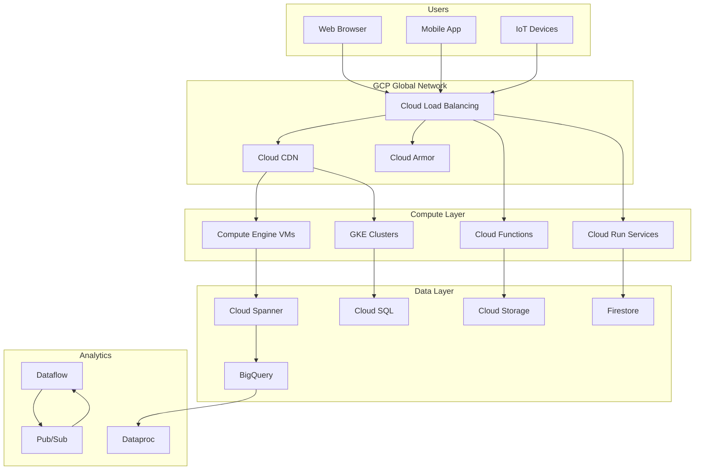
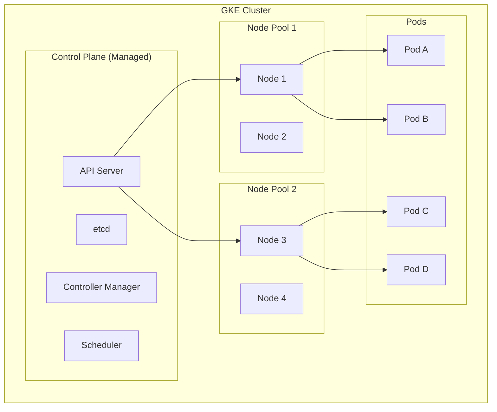
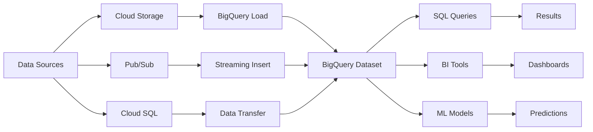

## Introduction

Google Cloud Platform (GCP) is a suite of cloud computing services providing infrastructure, platform, and serverless computing environments. Built on Google's infrastructure that powers products like Search, Gmail, and YouTube, GCP offers cutting-edge technologies in AI/ML, data analytics, and container orchestration.

GCP's strengths include industry-leading Kubernetes support (GKE), powerful data analytics (BigQuery), global network infrastructure, and innovative AI/ML services (Vertex AI, TPUs). Understanding GCP is essential for roles involving cloud architecture, data engineering, and machine learning.

This guide covers GCP fundamentals through advanced concepts, preparing you for GCP Cloud Engineer, Architect, and Data Engineer roles.

---

## Learning Roadmap

### Week 1: GCP Fundamentals
- GCP projects, billing, and IAM basics
- gcloud CLI and Cloud Console navigation
- Regions, zones, and resource hierarchy
- GCP networking fundamentals

### Week 2: Compute Services
- Compute Engine (VMs and instance groups)
- App Engine (standard and flexible environments)
- Cloud Functions (1st and 2nd gen)
- Cloud Run (serverless containers)
- Google Kubernetes Engine (GKE)

### Week 3: Storage and Databases
- Cloud Storage (object storage)
- Cloud SQL (managed MySQL/PostgreSQL)
- Cloud Spanner (globally distributed relational)
- Firestore (NoSQL document database)
- Memorystore (Redis/Memcached)

### Week 4: Data Analytics and AI
- BigQuery (serverless data warehouse)
- Dataflow (stream/batch processing)
- Pub/Sub (messaging service)
- Vertex AI (ML platform)
- Looker (business intelligence)

### Week 5: Networking and Security
- VPC (Virtual Private Cloud)
- Cloud Load Balancing (HTTP(S), TCP/UDP)
- Cloud CDN and Cloud Armor
- Cloud IAM and organization policies
- Secret Manager and Cloud KMS

### Week 6: DevOps and Advanced Topics
- Cloud Build (CI/CD)
- Terraform on GCP
- Cloud Monitoring and Logging
- GCP Well-Architected Framework
- Certification preparation (Associate Cloud Engineer, Professional Cloud Architect)

---

## Theory Notes

### GCP Resource Hierarchy
- **Organization**: Top-level resource, maps to Google Workspace domain
- **Folders**: Group projects for organization and policy inheritance
- **Projects**: Basic organizational unit, all resources belong to a project
- **Resources**: Actual GCP services (VMs, databases, etc.)

### GCP Compute Options
| Service | Use Case | Scaling | Management |
|---------|----------|---------|------------|
| Compute Engine | Full OS control | MIG auto-healing | IaaS |
| App Engine | Web applications | Auto-scale | PaaS |
| Cloud Functions | Event-driven code | Per-invocation | Serverless |
| Cloud Run | Containers | Auto-scale to zero | Serverless |
| GKE | Container orchestration | Cluster autoscaler | Managed K8s |

### GCP Storage Classes
| Class | Access Pattern | Min Duration | Retrieval |
|-------|---------------|--------------|-----------|
| Standard | Frequently accessed | 0 days | Immediate |
| Nearline | Accessed monthly | 30 days | Immediate |
| Coldline | Accessed quarterly | 90 days | Immediate |
| Archive | Accessed annually | 365 days | Immediate |

### GCP Networking Concepts
- **VPC**: Global logical network for GCP resources
- **Subnet**: Regional subdivision of a VPC
- **Cloud Router**: BGP routing for hybrid connectivity
- **Cloud NAT**: Managed NAT for private instances
- **Private Google Access**: Access Google APIs from private IPs
- **VPC Peering**: Connect two VPCs privately

### BigQuery Architecture
- Serverless, highly scalable data warehouse
- Uses Dremel query engine for SQL queries
- Supports standard SQL and legacy SQL
- Storage: Columnar storage (Capacitor format)
- Compute: Dremel query execution engine
- Pricing: On-demand (per TB scanned) or flat-rate (reserved slots)

---

## Key Concepts

### GCP Compute
1. **Compute Engine**: IaaS VMs with custom machine types and sustained use discounts
2. **Managed Instance Groups (MIGs)**: Identical VMs with auto-healing and auto-scaling
3. **App Engine**: PaaS with Standard (sandboxed) and Flexible (Docker-based) environments
4. **Cloud Functions**: Serverless functions triggered by events (HTTP, Pub/Sub, Storage)
5. **Cloud Run**: Deploy containers with automatic scaling, including scale to zero
6. **GKE**: Managed Kubernetes with Autopilot and Standard modes

### GCP Storage
1. **Cloud Storage**: Object storage with 4 storage classes and lifecycle management
2. **Cloud SQL**: Managed MySQL, PostgreSQL, SQL Server
3. **Cloud Spanner**: Horizontally scalable, globally distributed relational database
4. **Firestore**: Serverless NoSQL document database with real-time sync
5. **Bigtable**: Wide-column NoSQL database for large analytical/operational workloads
6. **Memorystore**: Managed Redis and Memcached

### GCP Networking
1. **VPC**: Global virtual network across all regions
2. **Cloud Load Balancing**: Global and regional load balancing (HTTP(S), TCP/UDP, Internal)
3. **Cloud CDN**: Edge caching for low-latency content delivery
4. **Cloud Armor**: DDoS protection and WAF for applications
5. **Cloud Interconnect**: Dedicated or partner connectivity to on-premises
6. **Cloud VPN**: Encrypted tunnels between networks

### GCP Security
1. **Cloud IAM**: Identity and access management with predefined and custom roles
2. **Organization Policies**: Constraints on resource creation and configuration
3. **Service Accounts**: Non-human identities for applications
4. **Secret Manager**: Secure storage for secrets, API keys, passwords
5. **Cloud KMS**: Managed cryptographic key management
6. **Security Command Center**: Threat detection and security analytics

### GCP Data Analytics
1. **BigQuery**: Serverless data warehouse for petabyte-scale analytics
2. **Dataflow**: Unified stream and batch data processing (Apache Beam)
3. **Pub/Sub**: Real-time messaging for event-driven architectures
4. **Dataproc**: Managed Apache Spark and Hadoop
5. **Data Catalog**: Metadata management and data discovery
6. **Looker**: Business intelligence and data visualization

---

## FAQ (20+ Q&A)

### Q1: What is the difference between Compute Engine and GKE?
**A:** Compute Engine provides individual VMs where you manage the OS and infrastructure. GKE is managed Kubernetes that orchestrates containerized workloads across multiple VMs with auto-scaling, self-healing, and rolling updates.

### Q2: Explain the difference between Cloud Functions 1st gen and 2nd gen.
**A:** 2nd gen functions run on Cloud Run infrastructure, supporting longer timeouts (up to 60 minutes), larger instances, traffic splitting, and container-based deployment. 1st gen functions have 9-minute timeout and simpler deployment model.

### Q3: What is the difference between Firestore and Cloud Datastore?
**A:** Firestore is the next generation of Datastore with improved performance, real-time listeners, and offline support. Datastore is in maintenance mode. New projects should use Firestore in Native mode.

### Q4: How does BigQuery handle pricing?
**A:** BigQuery charges for: (1) Storage (per GB per month), (2) Queries (on-demand: per TB scanned, or flat-rate: reserved slots per hour), (3) Streaming inserts, and (4) Data transfers. Free tier: 1 TB queries and 10 GB storage per month.

### Q5: What is GKE Autopilot vs Standard mode?
**A:** Autopilot manages the entire cluster including node provisioning, scaling, and security. You only define pods. Standard mode gives you control over nodes, node pools, and cluster configuration. Autopilot is simpler but less configurable.

### Q6: Explain VPC peering vs Shared VPC.
**A:** VPC peering connects two VPCs privately (non-transitive). Shared VPC allows an organization to share a VPC network across projects with subnetwork-level resource sharing. Shared VPC is better for multi-project architectures within an organization.

### Q7: What are GCP Instance Templates and Managed Instance Groups?
**A:** Instance Templates define VM configuration (machine type, image, metadata). Managed Instance Groups (MIGs) use templates to create identical VMs with auto-healing (replaces failed instances), auto-scaling, and rolling update support.

### Q8: How does Cloud Spanner achieve consistency?
**A:** Cloud Spanner uses TrueTime (atomic clocks and GPS receivers) to provide globally consistent reads with external consistency. It uses Paxos for replication across zones/regions and supports strong consistency and stale reads.

### Q9: What is the difference between Cloud Load Balancer types?
**A:** HTTP(S) LB: Global, Layer 7, for web traffic. TCP/UDP LB: Global or regional, Layer 4. Internal LB: Regional, for internal traffic. Network LB: Regional, high-performance Layer 4.

### Q10: Explain Cloud IAM roles and permissions.
**A:** IAM roles contain permissions. Primitive roles: Owner, Editor, Viewer. Predefined roles: Service-specific (e.g., Storage Admin). Custom roles: User-defined collection of permissions. Permissions follow the format: service.resource.verb.

### Q11: What is Cloud Run and how does it differ from App Engine?
**A:** Cloud Run deploys containers with automatic scaling (including to zero) and supports any language/runtime. App Engine Standard uses a sandboxed environment with language-specific runtimes. App Engine Flexible uses Docker. Cloud Run is more flexible and cost-effective for containerized apps.

### Q12: How do you optimize costs in GCP?
**A:** Strategies: Use committed use discounts (CUDs) for predictable workloads, sustained use discounts for long-running VMs, preemptible/spot VMs for fault-tolerant workloads, right-size resources, use appropriate storage classes, and set budget alerts.

### Q13: What is Cloud Armor?
**A:** Cloud Armor provides DDoS protection and WAF capabilities for applications behind Google Load Balancers. It offers preconfigured WAF rules, IP-based access control, rate limiting, and adaptive protection using ML.

### Q14: Explain Pub/Sub messaging model.
**A:** Pub/Sub is a global, real-time messaging service. Publishers send messages to topics. Subscribers receive messages from subscriptions. Features: At-least-once delivery, message ordering (with ordering keys), dead-letter topics, and exactly-once delivery (with enable_message_ordering).

### Q15: What is Dataflow and how does it differ from Dataproc?
**A:** Dataflow is a serverless, fully managed stream/batch processing service based on Apache Beam. Dataproc is a managed Apache Spark/Hadoop service for big data processing. Dataflow is better for real-time; Dataproc for existing Spark/Hadoop workloads.

### Q16: How do you secure GKE clusters?
**A:** Security measures: Use Autopilot mode, enable Workload Identity, use Binary Authorization, implement network policies, enable Shielded GKE Nodes, use private clusters, scan images with Container Analysis, and implement RBAC.

### Q17: What is the difference between Cloud SQL and Cloud Spanner?
**A:** Cloud SQL is a managed MySQL/PostgreSQL with single-region availability and vertical scaling. Cloud Spanner is a globally distributed, horizontally scalable relational database with strong consistency. Spanner is for global, mission-critical applications; Cloud SQL for regional workloads.

### Q18: Explain GCP regions and zones.
**A:** Regions are geographic locations containing zones (datacenters). Zones are isolated locations within a region. GCP has 40+ regions and 120+ zones. Resources can be deployed in specific zones for low latency or across zones for high availability.

### Q19: What is Cloud Functions triggers?
**A:** Cloud Functions can be triggered by: HTTP requests, Cloud Storage events (create/delete), Pub/Sub messages, Firestore events, Firebase Auth events, Firebase Remote Config updates, and scheduled cron jobs.

### Q20: How does GCP handle disaster recovery?
**A:** GCP DR options: Multi-region deployments, Cloud Spanner for global replication, Cloud SQL read replicas, Cloud Storage multi-region buckets, and multi-cluster GKE deployments. RPO/RTO requirements determine architecture.

### Q21: What is Vertex AI?
**A:** Vertex AI is Google's unified ML platform for building, deploying, and scaling ML models. It provides AutoML for no-code model training, custom training for code-first approach, Model Garden for pre-trained models, and pipelines for ML workflow orchestration.

### Q22: Explain Cloud Build CI/CD.
**A:** Cloud Build is Google's CI/CD platform. It executes builds defined in cloudbuild.yaml, supports parallel steps, integrates with Container Registry/Artifact Registry, and can deploy to GKE, Cloud Run, App Engine, and other services. It's fully managed and serverless.

---

## Hands-on Practice

### Lab 1: Create a Compute Engine VM
```bash
# Set project
gcloud config set project my-project-id

# Create VM
gcloud compute instances create my-vm \
  --zone=us-central1-a \
  --machine-type=e2-medium \
  --image-family=ubuntu-2204-lts \
  --image-project=ubuntu-os-cloud \
  --tags=web-server

# SSH into VM
gcloud compute ssh my-vm --zone=us-central1-a
```

### Lab 2: Deploy Cloud Storage Bucket
```bash
# Create bucket
gsutil mb -l us-central1 gs://my-bucket-name-123

# Upload file
gsutil cp myfile.txt gs://my-bucket-name-123/

# Set lifecycle rule
cat > lifecycle.json << EOF
{
  "lifecycle": {
    "rule": [
      {
        "action": {"type": "SetStorageClass", "storageClass": "NEARLINE"},
        "condition": {"age": 30}
      }
    ]
  }
}
EOF

gsutil lifecycle set lifecycle.json gs://my-bucket-name-123

# Make bucket public
gsutil iam ch allUsers:objectViewer gs://my-bucket-name-123
```

### Lab 3: Deploy Cloud Function
```bash
# Create function directory
mkdir my-function && cd my-function

# Create main.py
cat > main.py << 'EOF'
def hello_world(request):
    request_json = request.get_json()
    if request.args and 'name' in request.args:
        name = request.args.get('name')
    elif request_json and 'name' in request_json:
        name = request_json['name']
    else:
        name = 'World'
    return f'Hello {name}!'
EOF

cat > requirements.txt << 'EOF'
functions-framework==3.*
EOF

# Deploy function
gcloud functions deploy hello-world \
  --gen2 \
  --runtime=python311 \
  --region=us-central1 \
  --trigger-http \
  --allow-unauthenticated
```

### Lab 4: Create BigQuery Dataset and Table
```bash
# Create dataset
bq mk --dataset my-project:my_dataset

# Create table
bq mk --table \
  my-project:my_dataset.users \
  name:STRING,age:INTEGER,email:STRING

# Query data
bq query --use_legacy_sql=false \
  'SELECT name, age FROM `my-project.my_dataset.users` WHERE age > 25'
```

### Lab 5: Deploy GKE Cluster
```bash
# Create cluster
gcloud container clusters create my-cluster \
  --zone us-central1-a \
  --num-nodes 3 \
  --enable-autoscaling --min-nodes 1 --max-nodes 5

# Get credentials
gcloud container clusters get-credentials my-cluster \
  --zone us-central1-a

# Deploy application
kubectl create deployment hello-server \
  --image=gcr.io/google-samples/hello-app:1.0

kubectl expose deployment hello-server \
  --type=LoadBalancer --port=80

kubectl get services
```

### Lab 6: Pub/Sub Message Publishing
```bash
# Create topic
gcloud pubsub topics create my-topic

# Create subscription
gcloud pubsub subscriptions create my-subscription \
  --topic=my-topic

# Publish message
gcloud pubsub topics publish my-topic --message="Hello World"

# Pull messages
gcloud pubsub subscriptions pull my-subscription --auto-ack
```

---

## FAANG Questions

### Amazon/Facebook Level
1. **Design a real-time analytics pipeline processing 1 million events per second on GCP.**
   - Cloud Pub/Sub for ingestion
   - Dataflow for stream processing
   - BigQuery for analytics storage
   - Looker for visualization
   - Consider: Exactly-once processing, late-arriving data, schema evolution

2. **How would you design a globally distributed, strongly consistent database?**
   - Cloud Spanner with multi-region configuration
   - Understand TrueTime and consistency model
   - Trade-off: Latency vs consistency
   - Consider: Interleaved tables, split.merge behavior

3. **Design a microservices architecture on GKE handling 50K requests/second.**
   - GKE Autopilot for managed Kubernetes
   - Cloud Load Balancing for global traffic
   - Cloud Memorystore for caching
   - Service mesh (Istio) for observability
   - Consider: Circuit breaking, retries, timeout budgets

### Google/Microsoft Level
4. **Explain how you would implement zero-downtime deployment on GKE.**
   - Rolling updates with maxSurge and maxUnavailable
   - Blue-green deployments with GKE traffic management
   - Canary deployments using Istio
   - Consider: Readiness probes, PodDisruptionBudgets

5. **How would you optimize BigQuery query performance?**
   - Partitioning tables by date/timestamp
   - Clustering columns for data organization
   - Using materialized views for frequent queries
   - Avoiding SELECT *, using approximate functions
   - Consider: Slot management, query plan analysis

### Netflix/Apple Level
6. **Design a disaster recovery architecture across GCP regions.**
   - Multi-region Cloud Spanner for global consistency
   - Cloud Load Balancing for regional failover
   - Cloud Storage multi-region buckets for static assets
   - Regular DR testing with automated failover
   - Consider: RPO/RTO, data consistency, cost implications

---

## Common Mistakes

1. **Not using IAM least privilege** - Granting editor/owner roles instead of predefined or custom roles with minimal permissions.

2. **Ignoring VPC firewall rules** - Using default allow-all rules instead of implementing deny-by-default with specific allow rules.

3. **Not setting budget alerts** - Failing to configure billing alerts and budgets to prevent unexpected costs.

4. **Over-provisioning Compute Engine** - Choosing large machine types without monitoring actual usage patterns.

5. **Using default service accounts** - Using default Compute Engine service accounts instead of creating dedicated service accounts with minimal permissions.

6. **Not enabling VPC Flow Logs** - Missing network monitoring for security and troubleshooting.

7. **Hard-coding credentials** - Storing API keys in code instead of using Secret Manager.

8. **Ignoring Cloud SQL maintenance windows** - Not configuring maintenance windows and notifications for database updates.

9. **Not implementing resource labels** - Missing labels for cost allocation and resource organization.

10. **Overlooking Cloud Storage lifecycle rules** - Not automating storage class transitions for cost optimization.

---

## Best Practices

### Security
- Use IAM custom roles with least privilege
- Enable Organization Policies for constraints
- Implement VPC Service Controls for sensitive workloads
- Use Cloud Armor for DDoS and WAF protection
- Enable Audit Logs for all services

### Performance
- Use committed use discounts for predictable workloads
- Leverage preemptible VMs for fault-tolerant workloads
- Implement Cloud CDN for global content delivery
- Use BigQuery partitioning and clustering

### Cost Optimization
- Right-size VMs based on actual usage
- Use sustained use discounts (automatic 20-30% discount)
- Implement storage lifecycle policies
- Set up budget alerts and quotas
- Review recommendations in Cost Optimization hub

### Reliability
- Deploy across multiple zones and regions
- Use health checks for load balancing
- Implement circuit breakers in applications
- Use Cloud Monitoring for proactive alerting
- Regular disaster recovery testing

---

## Cheat Sheet

### gcloud CLI Commands
```bash
# Configuration
gcloud config set project PROJECT_ID
gcloud config set compute/zone ZONE

# Compute Engine
gcloud compute instances create NAME
gcloud compute instances list
gcloud compute ssh NAME --zone=ZONE

# Kubernetes Engine
gcloud container clusters create CLUSTER_NAME
gcloud container clusters get-credentials CLUSTER_NAME

# Cloud Storage
gsutil mb -l LOCATION gs://BUCKET
gsutil cp FILE gs://BUCKET/
gsutil rsync -r LOCAL_DIR gs://BUCKET/

# BigQuery
bq mk DATASET
bq query 'SQL_QUERY'

# Cloud Functions
gcloud functions deploy NAME --trigger-http

# IAM
gcloud projects add-iam-policy-binding PROJECT_ID \
  --member="user:EMAIL" --role="roles/ROLE"
```

### GCP Pricing Quick Reference
| Service | Pricing Model |
|---------|--------------|
| Compute Engine | Per-second billing, sustained use discounts |
| Cloud Storage | Per GB per month + operations |
| BigQuery | Per TB scanned (on-demand) or slots (flat-rate) |
| Cloud SQL | Per instance hour + storage + network |
| GKE | Per cluster hour + node costs |

### Default Limits
| Resource | Default Limit |
|----------|--------------|
| CPUs per region | 24 |
| IPs per VPC | 15,000 |
| Buckets per project | Unlimited |
| BigQuery datasets per project | Unlimited |

---

## Flash Cards (20)

**Card 1**: What is GCP Compute Engine?
IaaS service providing VMs with custom machine types, sustained use discounts, and preemptible options.

**Card 2**: What is the difference between Cloud Functions and Cloud Run?
Cloud Functions is function-as-a-service; Cloud Run is container-as-a-service with scale-to-zero.

**Card 3**: What is GKE Autopilot?
Fully managed Kubernetes mode where Google manages node infrastructure; you only define pods.

**Card 4**: What is BigQuery?
Serverless, highly scalable data warehouse for petabyte-scale analytics with SQL interface.

**Card 5**: What is Cloud Spanner?
Globally distributed, strongly consistent relational database with horizontal scaling.

**Card 6**: What is the difference between Firestore Native and Datastore modes?
Native mode offers real-time sync and offline support; Datastore mode is for existing Datastore apps.

**Card 7**: What is Cloud Load Balancing?
Google's global load balancing infrastructure supporting HTTP(S), TCP/UDP, and internal traffic.

**Card 8**: What is Cloud Armor?
DDoS protection and WAF service for applications behind Google Load Balancers.

**Card 9**: What is Cloud IAM?
Identity and access management controlling who has access to GCP resources and what they can do.

**Card 10**: What is the difference between VPC peering and Shared VPC?
VPC peering connects two VPCs (non-transitive). Shared VPC shares a VPC across projects.

**Card 11**: What is Dataflow?
Serverless, fully managed service for unified stream and batch data processing using Apache Beam.

**Card 12**: What is Pub/Sub?
Global, real-time messaging service for event-driven architectures with at-least-once delivery.

**Card 13**: What is Cloud SQL?
Managed relational database service supporting MySQL, PostgreSQL, and SQL Server.

**Card 14**: What is Memorystore?
Managed in-memory data store service for Redis and Memcached.

**Card 15**: What is Cloud KMS?
Cloud-hosted key management service for creating and managing cryptographic keys.

**Card 16**: What is Secret Manager?
Service for storing API keys, passwords, certificates, and other sensitive data.

**Card 17**: What is Cloud Build?
Fully managed CI/CD platform for building, testing, and deploying software.

**Card 18**: What is Vertex AI?
Unified ML platform for building, deploying, and scaling machine learning models.

**Card 19**: What is Cloud CDN?
Content delivery network that caches content at Google's global edge locations.

**Card 20**: What is GKE?
Managed Kubernetes service for deploying, managing, and scaling containerized applications.

---

## Mind Map

```
Google Cloud Platform
├── Compute
│   ├── Compute Engine (VMs)
│   ├── Managed Instance Groups
│   ├── App Engine (PaaS)
│   ├── Cloud Functions (FaaS)
│   ├── Cloud Run (Containers)
│   └── GKE (Kubernetes)
├── Storage
│   ├── Cloud Storage (Objects)
│   ├── Cloud SQL (Relational)
│   ├── Cloud Spanner (Global Relational)
│   ├── Firestore (NoSQL)
│   ├── Bigtable (Wide-column)
│   └── Memorystore (Cache)
├── Data Analytics
│   ├── BigQuery
│   ├── Dataflow
│   ├── Pub/Sub
│   ├── Dataproc
│   └── Looker
├── Networking
│   ├── VPC
│   ├── Cloud Load Balancing
│   ├── Cloud CDN
│   ├── Cloud Armor
│   ├── Cloud Interconnect
│   └── Cloud VPN
├── Security
│   ├── Cloud IAM
│   ├── Secret Manager
│   ├── Cloud KMS
│   ├── Security Command Center
│   └── VPC Service Controls
└── DevOps
    ├── Cloud Build
    ├── Artifact Registry
    ├── Cloud Deploy
    ├── Terraform
    └── Cloud Monitoring
```

---

## Mermaid Diagrams

### GCP Architecture Overview


### GKE Cluster Architecture


### BigQuery Data Flow


---

## Code Examples

### Terraform - GCP VNet and Compute Engine
```hcl
provider "google" {
  project = "my-project-id"
  region  = "us-central1"
}

resource "google_compute_network" "main" {
  name                    = "main-network"
  auto_create_subnetworks = false
}

resource "google_compute_subnetwork" "web" {
  name          = "web-subnet"
  ip_cidr_range = "10.0.1.0/24"
  region        = "us-central1"
  network       = google_compute_network.main.id
}

resource "google_compute_firewall" "allow_http" {
  name    = "allow-http"
  network = google_compute_network.main.name

  allow {
    protocol = "tcp"
    ports    = ["80", "443"]
  }

  source_ranges = ["0.0.0.0/0"]
  target_tags   = ["web-server"]
}

resource "google_compute_instance" "web" {
  name         = "web-server"
  machine_type = "e2-medium"
  zone         = "us-central1-a"
  tags         = ["web-server"]

  boot_disk {
    initialize_params {
      image = "debian-cloud/debian-11"
    }
  }

  network_interface {
    subnetwork = google_compute_subnetwork.web.id
    access_config {}
  }

  metadata_startup_script = <<-EOF
    #!/bin/bash
    apt-get update
    apt-get install -y nginx
    systemctl start nginx
  EOF
}
```

### Python - BigQuery Client
```python
from google.cloud import bigquery

def query_bigquery():
    client = bigquery.Client(project="my-project-id")
    
    query = """
        SELECT name, COUNT(*) as count
        FROM `bigquery-public-data.usa_names.usa_1910_2013`
        WHERE state = 'TX'
        GROUP BY name
        ORDER BY count DESC
        LIMIT 10
    """
    
    results = client.query(query)
    
    for row in results:
        print(f"{row.name}: {row.count}")

def load_csv_to_bigquery():
    client = bigquery.Client()
    
    dataset_id = "my_dataset"
    table_id = "my_table"
    
    dataset_ref = client.dataset(dataset_id)
    table_ref = dataset_ref.table(table_id)
    
    job_config = bigquery.LoadJobConfig(
        source_format=bigquery.SourceFormat.CSV,
        skip_leading_rows=1,
        autodetect=True,
    )
    
    with open("data.csv", "rb") as source_file:
        job = client.load_table_from_file(
            source_file, table_ref, job_config=job_config
        )
    
    job.result()
    print(f"Loaded {job.output_rows} rows to {dataset_id}.{table_id}")
```

### gcloud CLI Scripts
```bash
#!/bin/bash

# Create GKE cluster with Autopilot
gcloud container clusters create-auto my-cluster \
  --region=us-central1 \
  --project=my-project-id

# Get credentials
gcloud container clusters get-credentials my-cluster \
  --region=us-central1

# Deploy application
kubectl create deployment nginx \
  --image=nginx:latest \
  --replicas=3

# Expose deployment
kubectl expose deployment nginx \
  --type=LoadBalancer \
  --port=80

# Create Cloud SQL instance
gcloud sql instances create my-db \
  --database-version=POSTGRES_14 \
  --tier=db-f1-micro \
  --region=us-central1

# Create database
gcloud sql databases create mydb --instance=my-db

# Create Pub/Sub topic
gcloud pubsub topics create my-topic

# Create Cloud Storage bucket with lifecycle
gsutil mb -l us-central1 gs://my-bucket-$(date +%s)
gsutil lifecycle set lifecycle.json gs://my-bucket-$(date +%s)
```

---

## Projects

### Project 1: Data Pipeline with BigQuery
Build a complete data analytics pipeline:
- **Ingestion**: Cloud Storage for batch, Pub/Sub for streaming
- **Processing**: Dataflow for ETL
- **Storage**: BigQuery for analytics
- **Visualization**: Looker or Data Studio dashboards
- **Monitoring**: Cloud Monitoring for pipeline health

### Project 2: Microservices on GKE
Deploy a microservices application:
- **Frontend**: Cloud Run for static serving
- **API Gateway**: Cloud Endpoints
- **Backend Services**: GKE with multiple deployments
- **Database**: Cloud Spanner for global consistency
- **CI/CD**: Cloud Build pipelines
- **Observability**: Cloud Trace, Logging, Monitoring

### Project 3: Serverless ML Platform
Build an ML serving platform:
- **Training**: Vertex AI custom training jobs
- **Model Registry**: Vertex AI Model Registry
- **Serving**: Cloud Run for model serving
- **Feature Store**: Vertex AI Feature Store
- **Monitoring**: Model monitoring and drift detection
- **CI/CD**: MLOps pipeline with Cloud Build

---

## Resources

### Official Documentation
- [Google Cloud Documentation](https://cloud.google.com/docs)
- [Google Cloud Architecture Center](https://cloud.google.com/architecture)
- [Google Cloud Training](https://cloud.google.com/training)
- [Google Cloud Next](https://cloud.google.com/next)

### Certification Paths
- **Associate Cloud Engineer**: Core GCP services and deployment
- **Professional Cloud Architect**: Architecture design and optimization
- **Professional Data Engineer**: Data processing and analytics
- **Professional ML Engineer**: ML model development and deployment
- **Professional DevOps Engineer**: CI/CD and SRE practices

### Learning Platforms
- Google Cloud Skills Boost (formerly Qwiklabs)
- Coursera Google Cloud Specializations
- A Cloud Guru GCP courses
- Linux Academy GCP content

### Practice Labs
- Google Cloud Free Tier ($300 credit for 90 days)
- Qwiklabs free labs
- Google Cloud Samples and Codelabs

### Community
- Google Cloud Community
- r/googlecloud subreddit
- Google Cloud Blog
- Google Cloud YouTube channel

---

## Checklist

- [ ] Create GCP account and explore Cloud Console
- [ ] Install and configure gcloud CLI
- [ ] Complete Associate Cloud Engineer learning path
- [ ] Deploy Compute Engine VMs with startup scripts
- [ ] Configure VPC with subnets and firewall rules
- [ ] Create Cloud Storage buckets with lifecycle policies
- [ ] Deploy Cloud SQL instance
- [ ] Implement Cloud IAM with custom roles
- [ ] Deploy Cloud Functions (1st and 2nd gen)
- [ ] Create GKE cluster and deploy applications
- [ ] Use BigQuery for data analytics
- [ ] Implement Pub/Sub messaging
- [ ] Set up Cloud Build CI/CD pipeline
- [ ] Configure Cloud Monitoring and alerting
- [ ] Implement disaster recovery strategy
- [ ] Complete practice exams for certification
- [ ] Build a complete architecture project
- [ ] Optimize costs using recommendations
- [ ] Document architecture decisions
- [ ] Prepare for certification exam

---

## Revision Plans

### 1-Week Revision Plan
| Day | Topic | Activities |
|-----|-------|------------|
| 1 | Fundamentals | gcloud CLI, resource hierarchy, billing |
| 2 | Compute | Compute Engine, MIGs, App Engine |
| 3 | Storage | Cloud Storage, SQL, Spanner, Firestore |
| 4 | Networking | VPC, Load Balancing, CDN, Armor |
| 5 | Security | IAM, Secret Manager, KMS |
| 6 | Data Analytics | BigQuery, Dataflow, Pub/Sub |
| 7 | Practice | Full architecture deployment, review |

### 2-Week Revision Plan
- Week 1: Theory and hands-on labs for each service
- Week 2: Practice exams, architecture design, mock interviews

### 1-Month Certification Prep
- Week 1-2: Complete learning path and hands-on labs
- Week 3: Practice exams and weak area focus
- Week 4: Final review, exam simulation, and certification exam

---

## Mock Interviews

### Scenario 1: GCP Solutions Architect
**Interviewer**: "Design a real-time fraud detection system for a payment processor on GCP."

**Key Points to Cover**:
- Pub/Sub for transaction ingestion
- Dataflow for real-time stream processing
- Vertex AI for ML model serving
- Cloud Spanner for transaction storage
- BigQuery for historical analysis
- Cloud Memorystore for caching
- Consider: Latency requirements, throughput, model retraining

### Scenario 2: GCP Cloud Engineer
**Interviewer**: "How would you migrate an on-premises Oracle database to GCP?"

**Key Points to Cover**:
- Assessment: Schema complexity, data volume, dependencies
- Migration options: Cloud SQL for PostgreSQL, Cloud Spanner, Bare Metal Solution for Oracle
- Tools: Database Migration Service, Datastream
- Cutover strategy: Parallel run, validation, rollback plan
- Consider: Performance testing, application changes

### Scenario 3: GCP Data Engineer
**Interviewer**: "Design a data lake architecture on GCP for petabyte-scale analytics."

**Key Points to Cover**:
- Cloud Storage as data lake foundation
- Organized by data zones (raw, curated, consumed)
- BigQuery for analytics warehouse
- Dataflow for ETL/ELT pipelines
- Dataproc for Spark/Hadoop workloads
- Data Catalog for metadata management
- Consider: Data governance, security, cost optimization

---

## Difficulty Rating

| Topic | Difficulty | Time to Learn |
|-------|------------|---------------|
| GCP Fundamentals | ⭐ | 1-2 weeks |
| Compute Engine | ⭐⭐ | 1-2 weeks |
| VPC Networking | ⭐⭐⭐ | 2-3 weeks |
| Cloud Storage | ⭐⭐ | 1-2 weeks |
| Cloud SQL | ⭐⭐⭐ | 2-3 weeks |
| Cloud Spanner | ⭐⭐⭐⭐ | 3-4 weeks |
| BigQuery | ⭐⭐⭐ | 2-3 weeks |
| GKE | ⭐⭐⭐⭐ | 3-4 weeks |
| Cloud IAM | ⭐⭐⭐ | 2-3 weeks |
| Dataflow | ⭐⭐⭐⭐ | 3-4 weeks |
| Cloud Functions | ⭐⭐ | 1-2 weeks |
| Vertex AI | ⭐⭐⭐⭐⭐ | 4-6 weeks |
| Architecture Design | ⭐⭐⭐⭐⭐ | 4-6 weeks |

---

## Summary

Google Cloud Platform offers a comprehensive suite of cloud services. Key areas for interviews include:

1. **Compute**: Understanding Compute Engine vs GKE vs Cloud Run vs Cloud Functions
2. **Storage**: Cloud Storage classes, Cloud SQL vs Spanner vs Firestore
3. **Data Analytics**: BigQuery for warehousing, Dataflow for processing, Pub/Sub for messaging
4. **Networking**: VPC design, load balancing options, hybrid connectivity
5. **Security**: IAM roles, organization policies, VPC Service Controls
6. **Container Orchestration**: GKE Autopilot vs Standard, workloads management
7. **Cost Optimization**: CUDs, sustained use discounts, preemptible VMs
8. **Machine Learning**: Vertex AI platform, model training and serving

Mastering these concepts prepares you for GCP-focused roles from cloud engineer to solutions architect.

