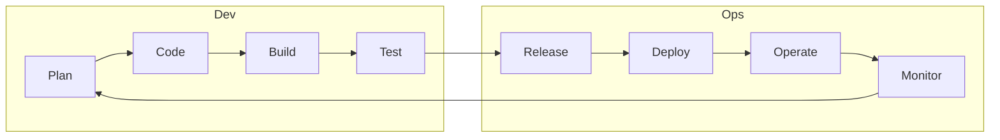
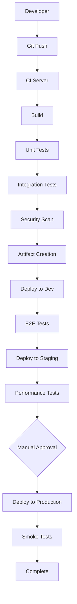
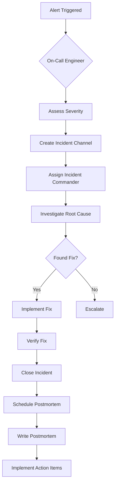
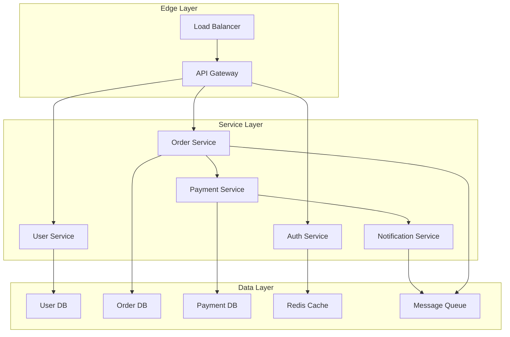

## Introduction

DevOps is a set of practices, tools, and cultural philosophies that automate and integrate processes between software development (Dev) and IT operations (Ops). It aims to shorten the software development lifecycle while delivering features, fixes, and updates frequently and reliably.

DevOps encompasses continuous integration, continuous delivery, infrastructure as code, configuration management, containerization, monitoring, and collaboration. Organizations adopting DevOps achieve faster time-to-market, fewer failure rates, and quicker recovery times.

Understanding DevOps is essential for modern software engineers, as it represents how software is built, tested, and deployed in leading technology companies.

---

## Learning Roadmap

### Week 1: DevOps Fundamentals
- DevOps culture and principles (CALMS)
- The DevOps lifecycle and feedback loops
- Version control with Git
- Introduction to CI/CD concepts
- Agile and Scrum basics

### Week 2: Infrastructure as Code
- IaC concepts and benefits
- Terraform fundamentals
- Ansible for configuration management
- CloudFormation or ARM templates
- Immutable vs mutable infrastructure

### Week 3: CI/CD Pipelines
- Jenkins, GitHub Actions, GitLab CI/CD
- Build automation and artifact management
- Automated testing strategies
- Deployment strategies (blue-green, canary, rolling)
- Release management

### Week 4: Containerization and Orchestration
- Docker fundamentals and best practices
- Kubernetes architecture and concepts
- Container registries
- Service mesh basics
- Microservices deployment

### Week 5: Monitoring and Observability
- Three pillars: metrics, logs, traces
- Prometheus and Grafana
- ELK Stack (Elasticsearch, Logstash, Kibana)
- Alerting strategies and on-call practices
- Incident management and postmortems

### Week 6: Advanced Topics
- Site Reliability Engineering (SRE)
- GitOps practices
- Security in DevOps (DevSecOps)
- Chaos engineering
- DORA metrics and continuous improvement

---

## Theory Notes

### CALMS Framework
DevOps adoption is measured against five pillars:
- **C**ulture: Collaboration, shared responsibility, blameless postmortems
- **A**utomation: Automate everything from testing to deployment
- **L**ean: Eliminate waste, limit work in progress, continuous improvement
- **M**easurement: Track metrics to drive decisions (DORA metrics)
- **S**haring: Knowledge sharing, cross-functional teams, feedback loops

### The Three Ways (DevOps Principles)
1. **Flow**: Optimize left-to-right flow from development to operations to customer
2. **Feedback**: Create fast, frequent feedback loops from operations to development
3. **Continuous Learning**: Foster culture of experimentation, risk-taking, and learning from failure

### DevOps Lifecycle
```
Plan → Code → Build → Test → Release → Deploy → Operate → Monitor
  ↑                                                           ↓
  ←←←←←←←←←←←←← Feedback Loop ←←←←←←←←←←←←←←←←←←←←←←←←←←←
```

### Infrastructure as Code Approaches
- **Declarative**: Define desired state (Terraform, CloudFormation, Kubernetes YAML)
- **Imperative**: Define step-by-step instructions (scripts, Ansible playbooks)
- **Immutable**: Replace infrastructure rather than modify (containers, golden images)
- **Mutable**: Modify existing infrastructure in place (traditional config management)

### CI/CD Pipeline Stages
1. **Source**: Version control, code review, branch policies
2. **Build**: Compile code, resolve dependencies, create artifacts
3. **Test**: Unit tests, integration tests, security scans, performance tests
4. **Release**: Versioning, changelog generation, approval gates
5. **Deploy**: Infrastructure provisioning, application deployment, configuration
6. **Monitor**: Health checks, alerting, logging, tracing

### DORA Metrics
- **Deployment Frequency**: How often code is deployed to production
- **Lead Time for Changes**: Time from commit to production deployment
- **Mean Time to Recovery (MTTR)**: Time to restore service after failure
- **Change Failure Rate**: Percentage of deployments causing failures

| Metric | Low Performers | High Performers |
|--------|---------------|-----------------|
| Deployment Frequency | Once per month | Multiple times per day |
| Lead Time for Changes | One month to six months | Less than one hour |
| MTTR | One week to one month | Less than one hour |
| Change Failure Rate | 15-30% | 0-15% |

---

## Key Concepts

### Version Control
1. **Git**: Distributed version control system
2. **Branching Strategies**: Git Flow, GitHub Flow, Trunk-based development
3. **Code Review**: Pull requests, merge requests, approvals
4. **Branch Protection**: Required reviews, status checks, signed commits

### CI/CD
1. **Continuous Integration**: Frequently merge code changes to shared repository
2. **Continuous Delivery**: Automatically prepare releases for deployment
3. **Continuous Deployment**: Automatically deploy every change to production
4. **Pipeline as Code**: Define pipelines in version-controlled files

### Infrastructure as Code
1. **Terraform**: Multi-cloud infrastructure provisioning
2. **Ansible**: Configuration management and application deployment
3. **CloudFormation**: AWS-specific infrastructure as code
4. **Pulumi**: Programmatic infrastructure using general-purpose languages

### Containerization
1. **Docker**: Container runtime and image building
2. **Kubernetes**: Container orchestration platform
3. **Container Registry**: Store and distribute container images
4. **Service Mesh**: Manage service-to-service communication

### Monitoring and Observability
1. **Metrics**: Numerical measurements (CPU, memory, request count)
2. **Logs**: Event records for debugging and auditing
3. **Traces**: Request flow through distributed systems
4. **Alerting**: Automated notifications based on conditions

### Site Reliability Engineering
1. **Error Budgets**: Allowable unreliability based on SLOs
2. **Toil Reduction**: Automate repetitive operational tasks
3. **Incident Management**: Detection, response, resolution, postmortem
4. **Capacity Planning**: Ensure systems can handle expected load

---

## FAQ (20+ Q&A)

### Q1: What is the difference between DevOps and SRE?
**A:** DevOps is a cultural philosophy and set of practices. SRE is a specific implementation of DevOps with emphasis on reliability, error budgets, and automation of operations tasks. SRE provides measurable ways to implement DevOps principles.

### Q2: What is Infrastructure as Code and why is it important?
**A:** IaC manages infrastructure through machine-readable configuration files rather than manual processes. Benefits: version control, reproducibility, automation, documentation, and consistency across environments.

### Q3: Explain the difference between continuous delivery and continuous deployment.
**A:** Continuous Delivery: Code is always in a deployable state; releases require manual approval. Continuous Deployment: Every change that passes tests is automatically deployed to production without manual intervention.

### Q4: What is a CI/CD pipeline?
**A:** An automated pipeline that takes code from version control through build, test, and deployment stages. It ensures code quality, catches issues early, and automates the release process.

### Q5: What is blue-green deployment?
**A:** Deployment strategy maintaining two identical environments (blue and green). Traffic switches from blue (current) to green (new) after deployment verification. Enables instant rollback by switching back.

### Q6: What is canary deployment?
**A:** Deployment strategy that gradually rolls out changes to a small subset of users before full deployment. Allows monitoring for issues before affecting all users. Named after canaries in coal mines.

### Q7: What is GitOps?
**A:** Operational framework where Git repositories are the single source of truth for declarative infrastructure and applications. Changes are made via pull requests, and automated agents reconcile desired state.

### Q8: What is the difference between Ansible, Puppet, and Chef?
**A:** Ansible: Agentless, uses YAML, push-based. Puppet: Agent-based, uses its own language, pull-based. Chef: Agent-based, uses Ruby, pull-based. Ansible is simplest to start with; Puppet/Chef are more mature for large enterprises.

### Q9: What is Kubernetes and why is it important?
**A:** Kubernetes (K8s) is a container orchestration platform that automates deployment, scaling, and management of containerized applications. It provides self-healing, service discovery, load balancing, and rolling updates.

### Q10: What are the three pillars of observability?
**A:** Metrics (numerical measurements over time), Logs (discrete event records), and Traces (distributed request flow). Together they provide complete visibility into system behavior.

### Q11: What is a service mesh?
**A:** Infrastructure layer managing service-to-service communication. Features include traffic management, observability, security (mTLS), and resilience (retries, circuit breaking). Examples: Istio, Linkerd, Consul Connect.

### Q12: What is chaos engineering?
**A:** Practice of intentionally introducing failures into systems to test resilience and identify weaknesses before they cause outages. Netflix's Chaos Monkey pioneered this approach.

### Q13: What is toil in SRE?
**A:** Toil is manual, repetitive, automatable work that provides no long-term value. SRE focuses on reducing toil through automation, allowing engineers to focus on engineering work.

### Q14: What is an error budget?
**A:** The acceptable level of unreliability based on SLOs. If SLO is 99.9%, error budget is 0.1%. Teams can spend error budget on faster releases; once exhausted, reliability becomes priority.

### Q15: What is shift-left testing?
**A:** Moving testing earlier in the development lifecycle. Instead of testing before release, tests run throughout development, catching issues sooner and reducing cost of fixing bugs.

### Q16: What is the difference between monitoring and observability?
**A:** Monitoring tells you what's broken; observability tells you why. Monitoring uses predefined metrics and alerts; observability enables ad-hoc exploration of system state through logs, metrics, and traces.

### Q17: What is feature flagging?
**A:** Technique to enable or disable features without deploying code. Allows gradual rollouts, A/B testing, and instant feature disabling. Tools: LaunchDarkly, Flagsmith, Unleash.

### Q18: What is immutable infrastructure?
**A:** Infrastructure that is never modified after deployment. Instead of patching, new instances are deployed and old ones replaced. Ensures consistency and simplifies rollback.

### Q19: What is a postmortem/incident review?
**A:** Blameless analysis after an incident to understand root cause, contributing factors, and prevention strategies. Focus on systemic improvements, not individual blame.

### Q20: What are the 12-factor app principles?
**A:** Methodology for building modern, scalable applications: Codebase, dependencies, config, backing services, build/release/run, processes, port binding, concurrency, disposability, dev/prod parity, logs, admin processes.

### Q21: What is progressive delivery?
**A:** Extension of continuous delivery with fine-grained control over deployment. Combines canary deployments, feature flags, and automated rollbacks for safer releases.

### Q22: What is platform engineering?
**A:** Practice of building internal developer platforms that provide self-service capabilities for infrastructure and deployment. Reduces cognitive load on development teams.

---

## Hands-on Practice

### Lab 1: CI/CD Pipeline with Jenkins
```groovy
pipeline {
    agent any
    
    environment {
        DOCKER_IMAGE = 'my-app'
        REGISTRY = 'docker.io/myrepo'
    }
    
    stages {
        stage('Checkout') {
            steps {
                checkout scm
            }
        }
        
        stage('Build') {
            steps {
                sh 'mvn clean package'
            }
        }
        
        stage('Unit Test') {
            steps {
                sh 'mvn test'
            }
        }
        
        stage('Code Analysis') {
            steps {
                sh 'mvn sonar:sonar'
            }
        }
        
        stage('Build Docker Image') {
            steps {
                script {
                    docker.build("${REGISTRY}/${DOCKER_IMAGE}:${BUILD_NUMBER}")
                }
            }
        }
        
        stage('Push to Registry') {
            steps {
                script {
                    docker.withRegistry('', 'docker-hub-credentials') {
                        docker.image("${REGISTRY}/${DOCKER_IMAGE}:${BUILD_NUMBER}").push()
                        docker.image("${REGISTRY}/${DOCKER_IMAGE}:${BUILD_NUMBER}").push('latest')
                    }
                }
            }
        }
        
        stage('Deploy to Staging') {
            steps {
                sh "kubectl set image deployment/my-app my-app=${REGISTRY}/${DOCKER_IMAGE}:${BUILD_NUMBER}"
            }
        }
        
        stage('Integration Tests') {
            steps {
                sh 'mvn verify -Pintegration-tests'
            }
        }
        
        stage('Deploy to Production') {
            input {
                message "Deploy to production?"
                ok "Yes, deploy it!"
            }
            steps {
                sh "kubectl set image deployment/my-app my-app=${REGISTRY}/${DOCKER_IMAGE}:${BUILD_NUMBER} -n production"
            }
        }
    }
    
    post {
        always {
            cleanWs()
        }
        failure {
            mail to: 'team@example.com',
                 subject: "Build Failed: ${currentBuild.fullDisplayName}",
                 body: "Check: ${env.BUILD_URL}"
        }
    }
}
```

### Lab 2: Terraform Infrastructure
```hcl
# main.tf
terraform {
  required_providers {
    aws = {
      source  = "hashicorp/aws"
      version = "~> 5.0"
    }
  }
  
  backend "s3" {
    bucket = "my-terraform-state"
    key    = "prod/terraform.tfstate"
    region = "us-east-1"
  }
}

provider "aws" {
  region = var.region
}

variable "region" {
  default = "us-east-1"
}

variable "environment" {
  default = "production"
}

# VPC
resource "aws_vpc" "main" {
  cidr_block = "10.0.0.0/16"
  
  tags = {
    Name        = "${var.environment}-vpc"
    Environment = var.environment
  }
}

# Subnets
resource "aws_subnet" "public" {
  count             = 3
  vpc_id            = aws_vpc.main.id
  cidr_block        = "10.0.${count.index + 1}.0/24"
  availability_zone = "${var.region}${["a", "b", "c"][count.index]}"
  
  map_public_ip_on_launch = true
  
  tags = {
    Name = "${var.environment}-public-${count.index + 1}"
  }
}

# Security Group
resource "aws_security_group" "web" {
  name        = "${var.environment}-web-sg"
  description = "Security group for web servers"
  vpc_id      = aws_vpc.main.id
  
  ingress {
    from_port   = 80
    to_port     = 80
    protocol    = "tcp"
    cidr_blocks = ["0.0.0.0/0"]
  }
  
  ingress {
    from_port   = 443
    to_port     = 443
    protocol    = "tcp"
    cidr_blocks = ["0.0.0.0/0"]
  }
  
  egress {
    from_port   = 0
    to_port     = 0
    protocol    = "-1"
    cidr_blocks = ["0.0.0.0/0"]
  }
}

# EC2 Instance
resource "aws_instance" "web" {
  count         = 2
  ami           = "ami-0c55b159cbfafe1f0"
  instance_type = "t3.micro"
  subnet_id     = aws_subnet.public[count.index].id
  
  vpc_security_group_ids = [aws_security_group.web.id]
  
  tags = {
    Name = "${var.environment}-web-${count.index + 1}"
  }
}

# Outputs
output "instance_ips" {
  value = aws_instance.web[*].public_ip
}
```

### Lab 3: Ansible Playbook
```yaml
# playbook.yml
---
- name: Deploy Web Application
  hosts: web_servers
  become: yes
  vars:
    app_name: my-web-app
    app_version: "1.0.0"
    app_port: 8080
  
  tasks:
    - name: Update apt cache
      apt:
        update_cache: yes
        cache_valid_time: 3600
    
    - name: Install Docker
      apt:
        name:
          - docker.io
          - docker-compose
        state: present
    
    - name: Start Docker service
      systemd:
        name: docker
        state: started
        enabled: yes
    
    - name: Pull application image
      docker_image:
        name: "registry.example.com/{{ app_name }}:{{ app_version }}"
        source: pull
    
    - name: Stop existing container
      docker_container:
        name: "{{ app_name }}"
        state: absent
    
    - name: Start application container
      docker_container:
        name: "{{ app_name }}"
        image: "registry.example.com/{{ app_name }}:{{ app_version }}"
        state: started
        restart_policy: unless-stopped
        ports:
          - "{{ app_port }}:{{ app_port }}"
        env:
          DATABASE_URL: "postgresql://user:pass@db:5432/mydb"
    
    - name: Configure Nginx reverse proxy
      template:
        src: nginx.conf.j2
        dest: /etc/nginx/sites-available/default
      notify: Reload Nginx
  
  handlers:
    - name: Reload Nginx
      systemd:
        name: nginx
        state: reloaded
```

### Lab 4: Docker Compose for Development
```yaml
# docker-compose.yml
version: '3.8'

services:
  web:
    build: .
    ports:
      - "3000:3000"
    environment:
      - NODE_ENV=development
      - DATABASE_URL=postgres://postgres:password@db:5432/myapp
      - REDIS_URL=redis://redis:6379
    volumes:
      - .:/app
      - /app/node_modules
    depends_on:
      - db
      - redis
    command: npm run dev
  
  db:
    image: postgres:15
    environment:
      POSTGRES_DB: myapp
      POSTGRES_USER: postgres
      POSTGRES_PASSWORD: password
    volumes:
      - postgres_data:/var/lib/postgresql/data
    ports:
      - "5432:5432"
  
  redis:
    image: redis:7-alpine
    ports:
      - "6379:6379"
  
  elasticsearch:
    image: docker.elastic.co/elasticsearch/elasticsearch:8.10.0
    environment:
      - discovery.type=single-node
      - xpack.security.enabled=false
    ports:
      - "9200:9200"
    volumes:
      - es_data:/usr/share/elasticsearch/data

volumes:
  postgres_data:
  es_data:
```

### Lab 5: Kubernetes Deployment
```yaml
# deployment.yaml
apiVersion: apps/v1
kind: Deployment
metadata:
  name: my-app
  namespace: production
spec:
  replicas: 3
  selector:
    matchLabels:
      app: my-app
  template:
    metadata:
      labels:
        app: my-app
    spec:
      containers:
        - name: my-app
          image: registry.example.com/my-app:1.0.0
          ports:
            - containerPort: 8080
          resources:
            requests:
              memory: "256Mi"
              cpu: "250m"
            limits:
              memory: "512Mi"
              cpu: "500m"
          livenessProbe:
            httpGet:
              path: /health
              port: 8080
            initialDelaySeconds: 30
            periodSeconds: 10
          readinessProbe:
            httpGet:
              path: /ready
              port: 8080
            initialDelaySeconds: 5
            periodSeconds: 5
          env:
            - name: DATABASE_URL
              valueFrom:
                secretKeyRef:
                  name: app-secrets
                  key: database-url
---
apiVersion: v1
kind: Service
metadata:
  name: my-app-service
  namespace: production
spec:
  selector:
    app: my-app
  ports:
    - protocol: TCP
      port: 80
      targetPort: 8080
  type: ClusterIP
---
apiVersion: autoscaling/v2
kind: HorizontalPodAutoscaler
metadata:
  name: my-app-hpa
  namespace: production
spec:
  scaleTargetRef:
    apiVersion: apps/v1
    kind: Deployment
    name: my-app
  minReplicas: 3
  maxReplicas: 10
  metrics:
    - type: Resource
      resource:
        name: cpu
        target:
          type: Utilization
          averageUtilization: 70
```

---

## FAANG Questions

### Amazon/Facebook Level
1. **Design a CI/CD pipeline for a microservices application with 50 services.**
   - Monorepo vs polyrepo considerations
   - Pipeline templates for consistency
   - Parallel builds and test execution
   - Artifact versioning strategy
   - Environment promotion (dev → staging → prod)

2. **How would you implement zero-downtime deployments for a critical service?**
   - Rolling updates with health checks
   - Blue-green deployment with database migration strategy
   - Canary deployment with automated rollback
   - Feature flags for decoupling deployment from release

3. **Describe your approach to incident management for a high-traffic service.**
   - Detection: Monitoring, alerting, anomaly detection
   - Response: Runbooks, escalation, communication
   - Resolution: Root cause analysis, fixes, verification
   - Postmortem: Blameless review, action items, prevention

### Google/Microsoft Level
4. **How would you reduce MTTR from hours to minutes?**
   - Improve monitoring coverage and reduce noise
   - Create comprehensive runbooks
   - Implement automated remediation for common issues
   - Practice incident response through game days
   - Use distributed tracing for faster root cause analysis

5. **Design a GitOps workflow for Kubernetes deployments.**
   - Git repository as single source of truth
   - ArgoCD or Flux for reconciliation
   - Environment branches or directories
   - Automated image updates
   - Secret management with sealed secrets or Vault

### Netflix/Apple Level
6. **How would you implement chaos engineering in production?**
   - Start with game days in staging
   - Use Chaos Monkey for random instance termination
   - Implement circuit breakers and bulkheads
   - Monitor blast radius during experiments
   - Establish steady state hypothesis before experiments

---

## Common Mistakes

1. **Manual deployments** - Performing deployments manually instead of automating through CI/CD pipelines.

2. **Skipping automated tests** - Not implementing comprehensive automated testing in pipelines.

3. **Ignoring infrastructure as code** - Managing infrastructure through console clicks instead of version-controlled code.

4. **No monitoring or alerting** - Deploying without observability, leading to blind spots.

5. **Blame culture** - Focusing on individual blame during incidents instead of systemic improvements.

6. **Ignoring security** - Treating security as an afterthought instead of integrating it throughout the pipeline (DevSecOps).

7. **Too many manual approvals** - Creating bottlenecks with excessive approval gates.

8. **Not implementing rollback strategies** - Deploying without ability to quickly rollback changes.

9. **Ignoring technical debt** - Not allocating time for refactoring and paying down technical debt.

10. **Silos between teams** - Maintaining separate Dev and Ops teams without shared responsibility.

---

## Best Practices

### CI/CD
- Keep pipelines fast (under 10 minutes ideal)
- Run tests in parallel
- Cache dependencies and build artifacts
- Use meaningful commit messages and PR titles
- Implement branch protection rules

### Infrastructure as Code
- Store state files securely (remote state)
- Use modules for reusable components
- Implement drift detection
- Plan before apply
- Tag all resources consistently

### Container Orchestration
- Use resource requests and limits
- Implement health checks (liveness, readiness)
- Use namespaces for environment separation
- Implement network policies
- Regularly update base images

### Monitoring
- Implement the four golden signals (latency, traffic, errors, saturation)
- Create actionable alerts (not noisy)
- Use structured logging
- Implement distributed tracing
- Regular review of dashboards and alerts

### Incident Management
- Establish clear on-call rotations
- Create and maintain runbooks
- Conduct blameless postmortems
- Track and trend incident metrics
- Practice incident response regularly

---

## Cheat Sheet

### Git Commands
```bash
git init                    # Initialize repo
git add .                   # Stage all changes
git commit -m "message"     # Commit changes
git push origin main        # Push to remote
git pull origin main        # Pull from remote
git branch feature-xyz      # Create branch
git checkout feature-xyz    # Switch branch
git merge feature-xyz       # Merge branch
git stash                   # Stash changes
git log --oneline           # View history
```

### Docker Commands
```bash
docker build -t myapp:1.0 .    # Build image
docker run -p 8080:80 myapp    # Run container
docker ps                       # List containers
docker stop $(docker ps -q)     # Stop all containers
docker system prune -a          # Clean up
docker-compose up -d            # Start services
docker-compose down             # Stop services
```

### Kubernetes Commands
```bash
kubectl get pods               # List pods
kubectl describe pod POD_NAME  # Pod details
kubectl logs POD_NAME          # View logs
kubectl exec -it POD_NAME sh   # Shell into pod
kubectl apply -f file.yaml     # Apply manifest
kubectl delete -f file.yaml    # Delete resources
kubectl scale deployment NAME --replicas=3  # Scale
kubectl rollout status deployment NAME      # Check rollout
```

### Terraform Commands
```bash
terraform init          # Initialize
terraform plan          # Preview changes
terraform apply         # Apply changes
terraform destroy       # Destroy infrastructure
terraform state list    # List resources
terraform import        # Import existing resources
terraform output        # View outputs
```

---

## Flash Cards (20)

**Card 1**: What is DevOps?
DevOps is a set of practices combining software development and IT operations to shorten development lifecycle and deliver features reliably.

**Card 2**: What is the CALMS framework?
Culture, Automation, Lean, Measurement, Sharing - the five pillars of DevOps adoption.

**Card 3**: What is Infrastructure as Code?
Managing infrastructure through machine-readable configuration files instead of manual processes.

**Card 4**: What is the difference between CI and CD?
CI: Frequently merge code changes. CD: Either automatically prepare releases (delivery) or deploy every change (deployment).

**Card 5**: What is blue-green deployment?
Maintaining two identical environments and switching traffic after deployment verification.

**Card 6**: What is canary deployment?
Gradually rolling out changes to a small subset of users before full deployment.

**Card 7**: What is GitOps?
Operational framework using Git as single source of truth for declarative infrastructure and applications.

**Card 8**: What are DORA metrics?
Deployment Frequency, Lead Time for Changes, Mean Time to Recovery, Change Failure Rate.

**Card 9**: What is SRE?
Site Reliability Engineering - a specific implementation of DevOps focused on reliability and automation.

**Card 10**: What is an error budget?
The acceptable level of unreliability based on SLOs, determining how much risk teams can take.

**Card 11**: What are the three pillars of observability?
Metrics, Logs, and Traces - providing complete visibility into system behavior.

**Card 12**: What is toil?
Manual, repetitive, automatable work that provides no long-term value.

**Card 13**: What is chaos engineering?
Intentionally introducing failures into systems to test resilience and identify weaknesses.

**Card 14**: What is shift-left testing?
Moving testing earlier in the development lifecycle to catch issues sooner.

**Card 15**: What is immutable infrastructure?
Infrastructure that is never modified after deployment; replaced instead of patched.

**Card 16**: What is a service mesh?
Infrastructure layer managing service-to-service communication with security and observability.

**Card 17**: What are the 12-factor app principles?
Methodology for building modern, scalable applications with clear separation of concerns.

**Card 18**: What is feature flagging?
Enabling or disabling features without deploying code, allowing gradual rollouts and A/B testing.

**Card 19**: What is a postmortem?
Blameless analysis after an incident focusing on root cause and prevention strategies.

**Card 20**: What is progressive delivery?
Extension of continuous delivery with fine-grained control over deployment through canary and flags.

---

## Mind Map

```
DevOps
├── Culture
│   ├── Collaboration
│   ├── Shared Responsibility
│   ├── Blameless Postmortems
│   └── Continuous Learning
├── Version Control
│   ├── Git
│   ├── Branching Strategies
│   ├── Code Review
│   └── Branch Protection
├── CI/CD
│   ├── Continuous Integration
│   ├── Continuous Delivery
│   ├── Continuous Deployment
│   └── Pipeline as Code
├── Infrastructure as Code
│   ├── Terraform
│   ├── Ansible
│   ├── CloudFormation
│   └── Immutable Infrastructure
├── Containerization
│   ├── Docker
│   ├── Kubernetes
│   ├── Container Registry
│   └── Service Mesh
├── Monitoring
│   ├── Metrics (Prometheus)
│   ├── Logs (ELK Stack)
│   ├── Traces (Jaeger)
│   └── Alerting
├── SRE
│   ├── Error Budgets
│   ├── Toil Reduction
│   ├── Incident Management
│   └── Capacity Planning
└── Security
    ├── DevSecOps
    ├── Secret Management
    ├── SAST/DAST
    └── Container Security
```

---

## Mermaid Diagrams

### DevOps Lifecycle


### CI/CD Pipeline


### Incident Response Flow


### Microservices Architecture


---

## Code Examples

### Jenkinsfile - Declarative Pipeline
```groovy
pipeline {
    agent {
        docker {
            image 'maven:3.8-openjdk-11'
            args '-v $HOME/.m2:/root/.m2'
        }
    }
    
    environment {
        APP_NAME = 'my-application'
        DOCKER_REGISTRY = 'registry.example.com'
        SONAR_HOST = 'http://sonar.example.com'
    }
    
    options {
        timeout(time: 30, unit: 'MINUTES')
        disableConcurrentBuilds()
        buildDiscarder(logRotator(numToKeepStr: '10'))
    }
    
    stages {
        stage('Checkout') {
            steps {
                checkout scm
                script {
                    env.GIT_COMMIT_MSG = sh(
                        script: 'git log -1 --pretty=%B',
                        returnStdout: true
                    ).trim()
                }
            }
        }
        
        stage('Build') {
            steps {
                sh 'mvn clean compile -DskipTests'
            }
        }
        
        stage('Unit Tests') {
            steps {
                sh 'mvn test'
            }
            post {
                always {
                    junit '**/target/surefire-reports/*.xml'
                    jacoco(execPattern: '**/target/jacoco.exec')
                }
            }
        }
        
        stage('Code Quality') {
            steps {
                withSonarQubeEnv('SonarQube') {
                    sh 'mvn sonar:sonar'
                }
            }
        }
        
        stage('Quality Gate') {
            steps {
                timeout(time: 5, unit: 'MINUTES') {
                    waitForQualityGate abortPipeline: true
                }
            }
        }
        
        stage('Package') {
            steps {
                sh 'mvn package -DskipTests'
                stash name: 'artifact', includes: 'target/*.jar'
            }
        }
        
        stage('Build Docker Image') {
            steps {
                unstash 'artifact'
                script {
                    docker.build("${DOCKER_REGISTRY}/${APP_NAME}:${env.BUILD_NUMBER}")
                }
            }
        }
        
        stage('Security Scan') {
            steps {
                sh "trivy image --severity HIGH,CRITICAL ${DOCKER_REGISTRY}/${APP_NAME}:${env.BUILD_NUMBER}"
            }
        }
        
        stage('Push Image') {
            steps {
                script {
                    docker.withRegistry("https://${DOCKER_REGISTRY}", 'docker-credentials') {
                        docker.image("${DOCKER_REGISTRY}/${APP_NAME}:${env.BUILD_NUMBER}").push()
                    }
                }
            }
        }
        
        stage('Deploy to Staging') {
            steps {
                sh """
                    kubectl set image deployment/${APP_NAME} \
                        ${APP_NAME}=${DOCKER_REGISTRY}/${APP_NAME}:${env.BUILD_NUMBER} \
                        --namespace=staging
                """
            }
        }
        
        stage('Integration Tests') {
            steps {
                sh 'mvn verify -Pintegration-tests'
            }
        }
        
        stage('Deploy to Production') {
            when {
                branch 'main'
            }
            input {
                message 'Deploy to production?'
                ok 'Deploy'
            }
            steps {
                sh """
                    kubectl set image deployment/${APP_NAME} \
                        ${APP_NAME}=${DOCKER_REGISTRY}/${APP_NAME}:${env.BUILD_NUMBER} \
                        --namespace=production
                """
            }
        }
    }
    
    post {
        always {
            cleanWs()
            script {
                if (currentBuild.result == 'FAILURE') {
                    emailext (
                        subject: "FAILED: ${env.JOB_NAME} #${env.BUILD_NUMBER}",
                        body: "Build failed. Check: ${env.BUILD_URL}",
                        to: 'team@example.com'
                    )
                }
            }
        }
    }
}
```

### Ansible Role - Web Server
```yaml
# roles/webserver/tasks/main.yml
---
- name: Install nginx
  apt:
    name: nginx
    state: present
    update_cache: yes
  tags: nginx

- name: Ensure nginx is started and enabled
  systemd:
    name: nginx
    state: started
    enabled: yes
  tags: nginx

- name: Remove default nginx config
  file:
    path: /etc/nginx/sites-enabled/default
    state: absent
  notify: Reload nginx

- name: Create nginx config
  template:
    src: nginx.conf.j2
    dest: /etc/nginx/sites-available/{{ app_name }}
  notify: Reload nginx

- name: Enable nginx config
  file:
    src: /etc/nginx/sites-available/{{ app_name }}
    dest: /etc/nginx/sites-enabled/{{ app_name }}
    state: link
  notify: Reload nginx

- name: Create app directory
  file:
    path: /opt/{{ app_name }}
    state: directory
    owner: www-data
    group: www-data

- name: Deploy application
  copy:
    src: files/app.jar
    dest: /opt/{{ app_name }}/app.jar
    owner: www-data
    group: www-data
  notify: Restart app
```

### Prometheus Alert Rules
```yaml
# alerts.yml
groups:
  - name: application
    rules:
      - alert: HighErrorRate
        expr: |
          sum(rate(http_requests_total{status=~"5.."}[5m])) by (service)
          /
          sum(rate(http_requests_total[5m])) by (service)
          > 0.05
        for: 5m
        labels:
          severity: critical
        annotations:
          summary: "High error rate detected"
          description: "Error rate for {{ $labels.service }} is {{ $value | humanizePercentage }}"
      
      - alert: HighLatency
        expr: |
          histogram_quantile(0.99, 
            sum(rate(http_request_duration_seconds_bucket[5m])) by (le, service)
          ) > 1
        for: 5m
        labels:
          severity: warning
        annotations:
          summary: "High latency detected"
          description: "99th percentile latency for {{ $labels.service }} is {{ $value }}s"
      
      - alert: HighMemoryUsage
        expr: |
          process_resident_memory_bytes / process_virtual_memory_max_bytes > 0.9
        for: 5m
        labels:
          severity: warning
        annotations:
          summary: "High memory usage"
          description: "Memory usage is above 90%"
```

---

## Projects

### Project 1: Complete CI/CD Pipeline
Build a production-ready CI/CD pipeline:
- **Source Control**: Git with branch protection and code review
- **Build**: Automated build with dependency caching
- **Testing**: Unit, integration, and E2E tests
- **Security**: SAST, DAST, dependency scanning
- **Deployment**: Blue-green or canary deployment
- **Monitoring**: Health checks, alerts, dashboards

### Project 2: Infrastructure as Code Platform
Deploy infrastructure using IaC:
- **Terraform**: VPC, subnets, security groups, instances
- **Ansible**: Configuration management for servers
- **CI/CD**: Automated infrastructure deployment
- **State Management**: Remote state with locking
- **Documentation**: Architecture decision records

### Project 3: Observability Stack
Implement comprehensive monitoring:
- **Metrics**: Prometheus for collection, Grafana for visualization
- **Logs**: ELK Stack for log aggregation
- **Traces**: Jaeger for distributed tracing
- **Alerting**: Alertmanager with escalation policies
- **Dashboards**: Service-level and business metrics

---

## Resources

### Books
- "The Phoenix Project" by Gene Kim
- "The DevOps Handbook" by Gene Kim
- "Site Reliability Engineering" by Google
- "Accelerate" by Nicole Forsgren
- "Continuous Delivery" by Jez Humble

### Online Resources
- [DevOps Roadmap](https://roadmap.sh/devops)
- [SRE Book by Google](https://sre.google/sre-book/table-of-contents/)
- [DORA Research](https://dora.dev)
- [Martin Fowler - DevOps](https://martinfowler.com/articles/)

### Tools
- **CI/CD**: Jenkins, GitHub Actions, GitLab CI/CD, CircleCI
- **IaC**: Terraform, Ansible, Pulumi, CloudFormation
- **Containers**: Docker, Kubernetes, Podman
- **Monitoring**: Prometheus, Grafana, Datadog, New Relic
- **Logging**: ELK Stack, Fluentd, Loki

### Certifications
- **AWS**: DevOps Engineer Professional
- **Azure**: DevOps Engineer Expert (AZ-400)
- **GCP**: Professional DevOps Engineer
- **Kubernetes**: CKA, CKAD
- **Docker**: Docker Certified Associate

---

## Checklist

- [ ] Understand CALMS framework and three ways
- [ ] Master Git and branching strategies
- [ ] Set up CI/CD pipeline with Jenkins or GitHub Actions
- [ ] Learn Terraform for infrastructure as code
- [ ] Learn Ansible for configuration management
- [ ] Understand Docker containerization
- [ ] Learn Kubernetes orchestration basics
- [ ] Implement monitoring with Prometheus and Grafana
- [ ] Set up logging with ELK Stack
- [ ] Understand SRE principles and error budgets
- [ ] Practice incident response and postmortems
- [ ] Learn about chaos engineering
- [ ] Implement GitOps workflow
- [ ] Understand DORA metrics
- [ ] Complete a full DevOps project
- [ ] Practice DevOps interview questions

---

## Revision Plans

### 1-Week Revision Plan
| Day | Topic | Activities |
|-----|-------|------------|
| 1 | Fundamentals | CALMS, Three Ways, DevOps lifecycle |
| 2 | Git & CI/CD | Branching strategies, pipeline setup |
| 3 | IaC | Terraform, Ansible, CloudFormation |
| 4 | Containers | Docker, Kubernetes basics |
| 5 | Monitoring | Prometheus, Grafana, ELK |
| 6 | SRE | Error budgets, toil, incidents |
| 7 | Practice | Mock interviews, project work |

### 2-Week Revision Plan
- Week 1: Theory and hands-on labs for each concept
- Week 2: Complete project, practice interviews, certification prep

---

## Mock Interviews

### Scenario 1: DevOps Engineer
**Interviewer**: "How would you implement CI/CD for a monolithic application being migrated to microservices?"

**Key Points to Cover**:
- Strangler fig pattern for gradual migration
- Separate pipelines for each microservice
- Shared pipeline templates for consistency
- Feature flags for gradual rollout
- Database migration strategy
- Monitoring and observability for both monolith and services

### Scenario 2: SRE
**Interviewer**: "A service is experiencing intermittent 503 errors. How do you investigate?"

**Key Points to Cover**:
- Check monitoring dashboards for patterns
- Review application logs for errors
- Check dependency health (databases, external services)
- Review recent deployments or changes
- Check infrastructure metrics (CPU, memory, network)
- Use distributed tracing to identify bottlenecks

### Scenario 3: Platform Engineer
**Interviewer**: "Design a developer self-service platform for deploying applications."

**Key Points to Cover**:
- GitOps workflow with ArgoCD
- Standardized Helm charts for common patterns
- Automated testing and security scanning
- Environment provisioning automation
- Monitoring and observability built-in
- Documentation and onboarding guides

---

## Difficulty Rating

| Topic | Difficulty | Time to Learn |
|-------|------------|---------------|
| DevOps Fundamentals | ⭐ | 1 week |
| Git Version Control | ⭐⭐ | 1-2 weeks |
| CI/CD Pipelines | ⭐⭐⭐ | 2-3 weeks |
| Terraform | ⭐⭐⭐ | 2-3 weeks |
| Ansible | ⭐⭐⭐ | 2-3 weeks |
| Docker | ⭐⭐ | 1-2 weeks |
| Kubernetes | ⭐⭐⭐⭐ | 3-4 weeks |
| Monitoring & Observability | ⭐⭐⭐ | 2-3 weeks |
| SRE Principles | ⭐⭐⭐ | 2-3 weeks |
| GitOps | ⭐⭐⭐ | 2-3 weeks |
| Chaos Engineering | ⭐⭐⭐⭐ | 3-4 weeks |
| DevSecOps | ⭐⭐⭐ | 2-3 weeks |
| Platform Engineering | ⭐⭐⭐⭐ | 4-6 weeks |

---

## Summary

DevOps is a transformative approach to software development and operations. Key areas for interviews include:

1. **Culture**: Understanding CALMS, three ways, and blameless postmortems
2. **CI/CD**: Designing and implementing automated pipelines
3. **Infrastructure as Code**: Terraform, Ansible, and immutable infrastructure
4. **Containers**: Docker and Kubernetes for modern deployment
5. **Monitoring**: Metrics, logs, traces, and alerting strategies
6. **SRE**: Error budgets, toil reduction, and incident management
7. **GitOps**: Using Git as single source of truth for operations
8. **Metrics**: DORA metrics for measuring DevOps success

Mastering DevOps practices prepares you for roles focused on reliability, automation, and developer productivity.

