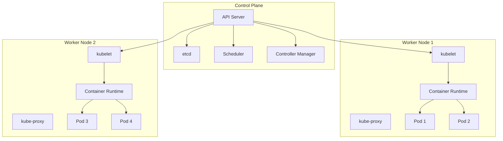
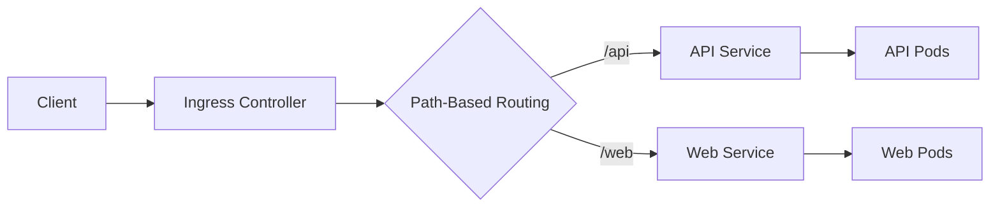
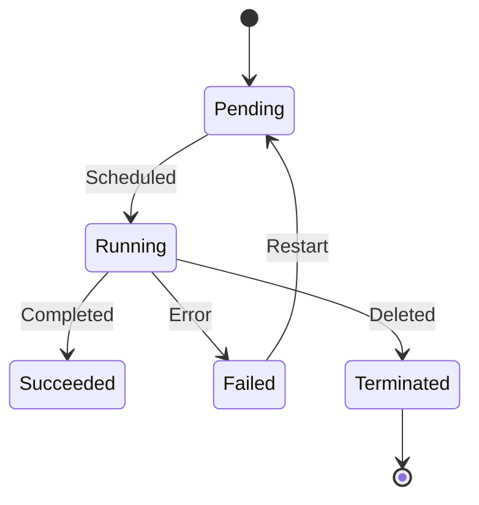

## Introduction

Kubernetes (K8s) is an open-source container orchestration platform that automates the deployment, scaling, and management of containerized applications. Originally developed by Google and now maintained by the Cloud Native Computing Foundation (CNCF), Kubernetes has become the industry standard for container orchestration.

Kubernetes provides self-healing, horizontal scaling, service discovery, load balancing, automated rollouts and rollbacks, secret and configuration management, and storage orchestration. Understanding Kubernetes is essential for modern cloud-native development and DevOps practices.

This guide covers Kubernetes fundamentals through advanced concepts, preparing you for roles from Kubernetes administrator to platform engineer.

---

## Learning Roadmap

### Week 1: Kubernetes Fundamentals
- Kubernetes architecture (control plane, nodes)
- Pods, ReplicaSets, and Deployments
- Services and networking basics
- kubectl commands and YAML manifests

### Week 2: Core Resources
- ConfigMaps and Secrets
- PersistentVolumes and PersistentVolumeClaims
- Namespaces and resource quotas
- Jobs and CronJobs

### Week 3: Networking and Services
- Service types (ClusterIP, NodePort, LoadBalancer)
- Ingress controllers and rules
- Network policies
- DNS and service discovery

### Week 4: Storage and StatefulSets
- Storage classes and dynamic provisioning
- StatefulSets for stateful applications
- DaemonSets and ReplicaSets
- Helm charts and package management

### Week 5: Security and RBAC
- Role-Based Access Control (RBAC)
- Service accounts and pod security
- Network policies for security
- Pod security policies/standards

### Week 6: Advanced Topics
- Horizontal and Vertical Pod Autoscaling
- Cluster autoscaling
- Monitoring and logging
- Troubleshooting and debugging

---

## Theory Notes

### Kubernetes Architecture
- **Control Plane**: Manages cluster state (API Server, etcd, Scheduler, Controller Manager)
- **Worker Nodes**: Run application workloads (kubelet, kube-proxy, container runtime)
- **etcd**: Distributed key-value store for cluster state
- **API Server**: Entry point for all cluster communication
- **Scheduler**: Assigns pods to nodes based on constraints
- **Controller Manager**: Maintains desired state through reconciliation loops

### Core Resource Relationships
```
Deployment → ReplicaSet → Pod
Service → Endpoints → Pods
ConfigMap → Pods
Secret → Pods
PersistentVolumeClaim → PersistentVolume
```

### Service Types
1. **ClusterIP**: Internal-only access within the cluster
2. **NodePort**: Exposes service on each node's IP at a static port
3. **LoadBalancer**: Provisions external load balancer (cloud provider)
4. **ExternalName**: Maps service to external DNS name

### Pod Lifecycle
```
Pending → Running → Succeeded/Failed
     ↑
     └── CrashLoopBackOff (if failing repeatedly)
```

### Kubernetes Objects
- **Pod**: Smallest deployable unit, one or more containers
- **Deployment**: Manages ReplicaSets and provides declarative updates
- **StatefulSet**: Manages stateful applications with stable identities
- **DaemonSet**: Ensures pod runs on all (or some) nodes
- **Job**: Creates pods that run to completion
- **CronJob**: Creates Jobs on a schedule

---

## Key Concepts

### Pod Fundamentals
1. **Pod**: Group of one or more containers sharing network namespace and storage
2. **Init Containers**: Run before main containers start
3. **Sidecar Containers**: Run alongside main containers
4. **Pod Scheduling**: How pods are assigned to nodes
5. **Resource Requests/Limits**: CPU and memory constraints

### Networking
1. **Cluster Networking**: Flat network where all pods can communicate
2. **Service Networking**: Stable IP addresses and DNS for pods
3. **Ingress**: HTTP/HTTPS routing to services
4. **Network Policies**: Firewall rules for pod-to-pod communication
5. **CNI Plugins**: Container Network Interface (Calico, Flannel, Cilium)

### Storage
1. **PersistentVolumes (PV)**: Cluster-level storage resources
2. **PersistentVolumeClaims (PVC)**: Requests for storage by pods
3. **StorageClasses**: Defines types of storage available
4. **Dynamic Provisioning**: Automatic PV creation from PVCs
5. **StatefulSets**: For stateful applications requiring stable storage

### Security
1. **RBAC**: Role-Based Access Control for authorization
2. **Service Accounts**: Identity for pods
3. **Pod Security Standards**: Restrict pod security contexts
4. **Network Policies**: Control traffic flow between pods
5. **Secrets**: Secure storage for sensitive data

### Scaling
1. **Horizontal Pod Autoscaler (HPA)**: Scales pods based on metrics
2. **Vertical Pod Autoscaler (VPA)**: Adjusts pod resource requests
3. **Cluster Autoscaler**: Adds/removes nodes based on demand
4. **Deployment Scaling**: Manual replica count changes

---

## FAQ (20+ Q&A)

### Q1: What is the difference between a Pod and a container?
**A:** A pod is the smallest deployable unit that can contain one or more containers. Containers in a pod share network namespace and storage volumes. A pod represents a single instance of an application.

### Q2: Explain the difference between a Deployment and a StatefulSet.
**A:** Deployment manages stateless applications with ReplicaSets, providing rolling updates and rollbacks. StatefulSet manages stateful applications with stable network identities, persistent storage, and ordered deployment/scaling.

### Q3: What is a Service in Kubernetes?
**A:** A Service provides a stable network endpoint (IP address and DNS name) for a set of pods. It enables load balancing and service discovery, abstracting away pod IP addresses that change frequently.

### Q4: What are the different Service types?
**A:** ClusterIP (internal), NodePort (external via node IP), LoadBalancer (cloud load balancer), ExternalName (DNS alias). Choose based on access requirements.

### Q5: What is an Ingress?
**A:** Ingress exposes HTTP/HTTPS routes to services within the cluster. It provides URL-based routing, SSL termination, and virtual hosting. Requires an Ingress Controller (Nginx, Traefik, etc.).

### Q6: What is a ConfigMap and when to use it?
**A:** ConfigMap stores non-sensitive configuration data as key-value pairs. Use it for environment variables, command-line arguments, or configuration files. Mount as files or environment variables in pods.

### Q7: What is the difference between ConfigMap and Secret?
**A:** ConfigMap stores non-sensitive configuration. Secret stores sensitive data (passwords, keys) with base64 encoding (not encryption). Use external secrets management for production.

### Q8: What are PersistentVolumes and PersistentVolumeClaims?
**A:** PV is a piece of storage in the cluster. PVC is a request for storage by a user. PVCs bind to PVs based on size, access mode, and storage class. Dynamic provisioning creates PVs automatically.

### Q9: What is a Namespace?
**A:** Namespace is a virtual cluster within a physical cluster. It provides scope for names and allows resource isolation. Common namespaces: default, kube-system, kube-public.

### Q10: What is RBAC?
**A:** Role-Based Access Control authorizes users and service accounts. Roles define permissions; RoleBindings grant roles to subjects. ClusterRoles/ClusterRoleBindings for cluster-wide permissions.

### Q11: What is the difference between a Job and a CronJob?
**A:** Job creates pods that run to completion once. CronJob creates Jobs on a schedule (like cron in Linux). Use Jobs for batch work; CronJobs for scheduled tasks.

### Q12: What is Horizontal Pod Autoscaler?
**A:** HPA automatically scales pod replicas based on metrics like CPU utilization, memory usage, or custom metrics. It adjusts replica count to maintain target metrics.

### Q13: What is a DaemonSet?
**A:** DaemonSet ensures a pod runs on all (or selected) nodes. It's useful for node-level operations like log collection, monitoring agents, or storage daemons.

### Q14: What are init containers?
**A:** Init containers run before the main app container starts. They can perform setup tasks like waiting for dependencies, downloading configuration, or running migrations.

### Q15: What is kubelet?
**A:** Kubelet is an agent running on each worker node. It ensures containers described in PodSpecs are running and healthy. It communicates with the API server and manages pod lifecycle.

### Q16: What is kube-proxy?
**A:** Kube-proxy maintains network rules on nodes. It handles service proxying (ClusterIP, NodePort, LoadBalancer) using iptables or IPVS rules.

### Q17: What is the difference between liveness and readiness probes?
**A:** Liveness probe checks if container is running; restarts if failed. Readiness probe checks if container can accept traffic; removes from service endpoints if failed.

### Q18: What are resource requests and limits?
**A:** Requests: Minimum resources reserved for a pod. Limits: Maximum resources a pod can use. Requests affect scheduling; limits enforce hard caps (OOMKill if exceeded).

### Q19: What is Helm?
**A:** Helm is a package manager for Kubernetes. It uses Charts (templates) to define, install, and upgrade Kubernetes applications. Charts are configurable and versioned.

### Q20: What is a Network Policy?
**A:** Network Policy defines how groups of pods can communicate. It acts as a firewall, controlling ingress and egress traffic. Requires a CNI plugin that supports NetworkPolicy.

### Q21: What is the Kubernetes API server?
**A:** API server is the front-end for the Kubernetes control plane. It exposes the Kubernetes API, validates and processes requests, and stores them in etcd.

### Q22: What is etcd?
**A:** etcd is a distributed key-value store that holds all cluster state. It's the single source of truth for the cluster configuration and must be backed up regularly.

---

## Hands-on Practice

### Lab 1: Basic Pod and Deployment
```yaml
# deployment.yaml
apiVersion: apps/v1
kind: Deployment
metadata:
  name: nginx-deployment
  labels:
    app: nginx
spec:
  replicas: 3
  selector:
    matchLabels:
      app: nginx
  template:
    metadata:
      labels:
        app: nginx
    spec:
      containers:
        - name: nginx
          image: nginx:1.25
          ports:
            - containerPort: 80
          resources:
            requests:
              memory: "64Mi"
              cpu: "250m"
            limits:
              memory: "128Mi"
              cpu: "500m"
          livenessProbe:
            httpGet:
              path: /
              port: 80
            initialDelaySeconds: 10
            periodSeconds: 5
          readinessProbe:
            httpGet:
              path: /
              port: 80
            initialDelaySeconds: 5
            periodSeconds: 5
```

```bash
# Apply deployment
kubectl apply -f deployment.yaml

# Check status
kubectl get deployments
kubectl get pods
kubectl describe deployment nginx-deployment

# Scale deployment
kubectl scale deployment nginx-deployment --replicas=5

# Update image
kubectl set image deployment/nginx-deployment nginx=nginx:1.26

# Rollback
kubectl rollout undo deployment/nginx-deployment
```

### Lab 2: Service and Ingress
```yaml
# service.yaml
apiVersion: v1
kind: Service
metadata:
  name: nginx-service
spec:
  selector:
    app: nginx
  ports:
    - protocol: TCP
      port: 80
      targetPort: 80
  type: ClusterIP
---
# ingress.yaml
apiVersion: networking.k8s.io/v1
kind: Ingress
metadata:
  name: nginx-ingress
  annotations:
    nginx.ingress.kubernetes.io/rewrite-target: /
    nginx.ingress.kubernetes.io/ssl-redirect: "true"
spec:
  ingressClassName: nginx
  tls:
    - hosts:
        - myapp.example.com
      secretName: myapp-tls
  rules:
    - host: myapp.example.com
      http:
        paths:
          - path: /
            pathType: Prefix
            backend:
              service:
                name: nginx-service
                port:
                  number: 80
```

### Lab 3: ConfigMap and Secret
```yaml
# configmap.yaml
apiVersion: v1
kind: ConfigMap
metadata:
  name: app-config
data:
  APP_ENV: production
  LOG_LEVEL: info
  config.json: |
    {
      "database": {
        "host": "postgres-service",
        "port": 5432
      }
    }
---
# secret.yaml
apiVersion: v1
kind: Secret
metadata:
  name: app-secret
type: Opaque
stringData:
  DB_PASSWORD: mypassword123
  API_KEY: abcdefghijklmnop
---
# pod using configmap and secret
apiVersion: v1
kind: Pod
metadata:
  name: app-pod
spec:
  containers:
    - name: app
      image: myapp:1.0
      envFrom:
        - configMapRef:
            name: app-config
        - secretRef:
            name: app-secret
      volumeMounts:
        - name: config-volume
          mountPath: /etc/config
  volumes:
    - name: config-volume
      configMap:
        name: app-config
```

### Lab 4: Persistent Volume
```yaml
# persistent-volume.yaml
apiVersion: v1
kind: PersistentVolume
metadata:
  name: my-pv
spec:
  capacity:
    storage: 10Gi
  accessModes:
    - ReadWriteOnce
  persistentVolumeReclaimPolicy: Retain
  storageClassName: standard
  hostPath:
    path: /mnt/data
---
# persistent-volume-claim.yaml
apiVersion: v1
kind: PersistentVolumeClaim
metadata:
  name: my-pvc
spec:
  accessModes:
    - ReadWriteOnce
  resources:
    requests:
      storage: 5Gi
  storageClassName: standard
---
# pod using PVC
apiVersion: v1
kind: Pod
metadata:
  name: app-with-storage
spec:
  containers:
    - name: app
      image: nginx
      volumeMounts:
        - name: data-volume
          mountPath: /usr/share/nginx/html
  volumes:
    - name: data-volume
      persistentVolumeClaim:
        claimName: my-pvc
```

### Lab 5: RBAC Configuration
```yaml
# role.yaml
apiVersion: rbac.authorization.k8s.io/v1
kind: Role
metadata:
  name: pod-reader
  namespace: default
rules:
  - apiGroups: [""]
    resources: ["pods", "pods/log"]
    verbs: ["get", "list", "watch"]
---
# rolebinding.yaml
apiVersion: rbac.authorization.k8s.io/v1
kind: RoleBinding
metadata:
  name: read-pods
  namespace: default
subjects:
  - kind: User
    name: jane
    apiGroup: rbac.authorization.k8s.io
roleRef:
  kind: Role
  name: pod-reader
  apiGroup: rbac.authorization.k8s.io
---
# service-account.yaml
apiVersion: v1
kind: ServiceAccount
metadata:
  name: my-service-account
  namespace: default
---
# pod using service account
apiVersion: v1
kind: Pod
metadata:
  name: sa-pod
spec:
  serviceAccountName: my-service-account
  containers:
    - name: app
      image: myapp:1.0
```

### Lab 6: Horizontal Pod Autoscaler
```yaml
# hpa.yaml
apiVersion: autoscaling/v2
kind: HorizontalPodAutoscaler
metadata:
  name: my-app-hpa
spec:
  scaleTargetRef:
    apiVersion: apps/v1
    kind: Deployment
    name: my-app
  minReplicas: 2
  maxReplicas: 10
  metrics:
    - type: Resource
      resource:
        name: cpu
        target:
          type: Utilization
          averageUtilization: 70
    - type: Resource
      resource:
        name: memory
        target:
          type: Utilization
          averageUtilization: 80
  behavior:
    scaleDown:
      stabilizationWindowSeconds: 300
      policies:
        - type: Percent
          value: 10
          periodSeconds: 60
    scaleUp:
      stabilizationWindowSeconds: 0
      policies:
        - type: Percent
          value: 100
          periodSeconds: 15
```

---

## FAANG Questions

### Amazon/Facebook Level
1. **Design a highly available Kubernetes cluster across multiple zones.**
   - Multiple control plane nodes across zones
   - Node pools in each zone
   - PodDisruptionBudgets for availability
   - Anti-affinity rules for pod distribution
   - Consider: etcd backup, disaster recovery

2. **How would you implement zero-downtime deployments?**
   - Rolling updates with maxSurge and maxUnavailable
   - Readiness probes to ensure traffic only goes to ready pods
   - PodDisruptionBudgets during node maintenance
   - Pre-rollout and post-rollout hooks

3. **Design a multi-tenant Kubernetes platform.**
   - Namespaces for tenant isolation
   - RBAC for access control
   - ResourceQuotas for resource limits
   - NetworkPolicies for network isolation
   - Consider: Cost allocation, self-service

### Google/Microsoft Level
4. **How would you troubleshoot a pod that keeps crashing?**
   - Check pod events: `kubectl describe pod`
   - View container logs: `kubectl logs`
   - Check resource limits and OOMKills
   - Verify image and command configuration
   - Check init containers if applicable

5. **Design a service mesh on Kubernetes.**
   - Deploy Istio or Linkerd
   - Implement mutual TLS
   - Configure traffic management
   - Set up observability (metrics, traces)
   - Consider: Performance overhead, complexity

### Netflix/Apple Level
6. **How would you implement GitOps for Kubernetes deployments?**
   - Use ArgoCD or Flux
   - Git repository as source of truth
   - Automated synchronization
   - Multi-environment promotion
   - Secret management with sealed secrets

---

## Common Mistakes

1. **Not setting resource requests/limits** - Pods can consume unlimited resources, affecting other workloads.

2. **Using latest tag** - Unpinned image tags lead to unpredictable deployments.

3. **Ignoring pod health checks** - No liveness/readiness probes means traffic goes to unhealthy pods.

4. **Not using namespaces** - All resources in default namespace causes naming conflicts and makes management difficult.

5. **Hard-coding secrets** - Storing sensitive data in ConfigMaps or environment variables instead of Secrets or external secret management.

6. **Missing network policies** - Default allows all traffic; should implement deny-by-default.

7. **Not implementing RBAC** - Using default service accounts with cluster-admin privileges.

8. **Ignoring pod anti-affinity** - Pods ending up on same node, reducing availability.

9. **No monitoring or logging** - Deploying without observability tools.

10. **Not backing up etcd** - Risk of losing entire cluster state.

---

## Best Practices

### Pod Design
- Set resource requests and limits
- Use liveness and readiness probes
- Implement pod anti-affinity for HA
- Use init containers for setup tasks
- Limit container image size

### Security
- Implement RBAC with least privilege
- Use dedicated service accounts
- Enable pod security standards
- Use network policies
- Rotate secrets regularly

### Networking
- Use Services for internal communication
- Implement Ingress for external access
- Define NetworkPolicies for isolation
- Use DNS for service discovery
- Consider service mesh for advanced features

### Storage
- Use PersistentVolumes for stateful data
- Implement backup strategies
- Use StorageClasses for dynamic provisioning
- Consider stateless design when possible

### Operations
- Use Helm for package management
- Implement GitOps workflows
- Monitor with Prometheus and Grafana
- Centralize logging with ELK/Loki
- Regular cluster upgrades

---

## Cheat Sheet

### kubectl Commands
```bash
# Basic Commands
kubectl get pods/services/deployments -A    # List resources
kubectl describe pod/service NAME            # Resource details
kubectl logs pod-name                       # View logs
kubectl exec -it pod-name -- bash           # Shell into pod
kubectl apply -f file.yaml                  # Apply manifest
kubectl delete -f file.yaml                 # Delete resource

# Deployment
kubectl create deployment NAME --image=IMG  # Create deployment
kubectl scale deployment NAME --replicas=3  # Scale
kubectl rollout status deployment NAME      # Check rollout
kubectl rollout history deployment NAME     # View history
kubectl rollout undo deployment NAME        # Rollback

# Debugging
kubectl get events --sort-by=.metadata.creationTimestamp
kubectl top pods                           # Resource usage
kubectl port-forward pod-name 8080:80       # Port forward
kubectl cp pod-name:/path ./local-path      # Copy files

# Configuration
kubectl create configmap NAME --from-file=file
kubectl create secret generic NAME --from-literal=key=value
kubectl config use-context CONTEXT          # Switch context
kubectl config get-contexts                # List contexts
```

### Common Kubernetes Resources
```yaml
# Pod
apiVersion: v1
kind: Pod
metadata:
  name: my-pod
spec:
  containers:
    - name: app
      image: nginx

# Deployment
apiVersion: apps/v1
kind: Deployment
metadata:
  name: my-deployment
spec:
  replicas: 3
  selector:
    matchLabels:
      app: my-app
  template:
    metadata:
      labels:
        app: my-app
    spec:
      containers:
        - name: app
          image: nginx

# Service
apiVersion: v1
kind: Service
metadata:
  name: my-service
spec:
  selector:
    app: my-app
  ports:
    - port: 80
  type: ClusterIP

# ConfigMap
apiVersion: v1
kind: ConfigMap
metadata:
  name: my-config
data:
  KEY: value

# Secret
apiVersion: v1
kind: Secret
metadata:
  name: my-secret
type: Opaque
data:
  KEY: base64value
```

### Helm Commands
```bash
helm repo add bitnami https://charts.bitnami.com/bitnami
helm search repo nginx
helm install my-release bitnami/nginx
helm upgrade my-release bitnami/nginx
helm rollback my-release 1
helm list
helm uninstall my-release
```

---

## Flash Cards (20)

**Card 1**: What is Kubernetes?
Open-source container orchestration platform automating deployment, scaling, and management of containerized applications.

**Card 2**: What is a Pod?
Smallest deployable unit containing one or more containers sharing network and storage.

**Card 3**: What is a Deployment?
Manages ReplicaSets and provides declarative updates with rolling deployments and rollbacks.

**Card 4**: What is a Service?
Stable network endpoint providing load balancing and service discovery for pods.

**Card 5**: What is ClusterIP?
Service type providing internal-only access within the cluster.

**Card 6**: What is NodePort?
Service type exposing service on each node's IP at a static port.

**Card 7**: What is LoadBalancer?
Service type provisioning external load balancer in cloud environments.

**Card 8**: What is Ingress?
Kubernetes resource managing HTTP/HTTPS routing to services with SSL termination.

**Card 9**: What is a ConfigMap?
Kubernetes resource storing non-sensitive configuration data as key-value pairs.

**Card 10**: What is a Secret?
Kubernetes resource storing sensitive data like passwords and API keys.

**Card 11**: What is a PersistentVolume?
Cluster-level storage resource with lifecycle independent of pods.

**Card 12**: What is a PersistentVolumeClaim?
Request for storage by a user, binding to available PersistentVolumes.

**Card 13**: What is RBAC?
Role-Based Access Control authorizing users and service accounts.

**Card 14**: What is Horizontal Pod Autoscaler?
Automatically scales pod replicas based on CPU, memory, or custom metrics.

**Card 15**: What is a DaemonSet?
Ensures a pod runs on all or selected nodes in the cluster.

**Card 16**: What is a StatefulSet?
Manages stateful applications with stable network identities and persistent storage.

**Card 17**: What is kubelet?
Agent running on each worker node managing pod lifecycle.

**Card 18**: What is etcd?
Distributed key-value store holding all cluster state.

**Card 19**: What is Helm?
Package manager for Kubernetes using Charts for templated deployments.

**Card 20**: What is a Network Policy?
Kubernetes resource defining firewall rules for pod-to-pod communication.

---

## Mind Map

```
Kubernetes
├── Control Plane
│   ├── API Server
│   ├── etcd
│   ├── Scheduler
│   └── Controller Manager
├── Worker Nodes
│   ├── kubelet
│   ├── kube-proxy
│   └── Container Runtime
├── Core Resources
│   ├── Pods
│   ├── Deployments
│   ├── StatefulSets
│   ├── DaemonSets
│   └── Jobs/CronJobs
├── Networking
│   ├── Services (ClusterIP, NodePort, LoadBalancer)
│   ├── Ingress
│   ├── Network Policies
│   └── DNS
├── Storage
│   ├── PersistentVolumes
│   ├── PersistentVolumeClaims
│   └── StorageClasses
├── Configuration
│   ├── ConfigMaps
│   ├── Secrets
│   └── Environment Variables
├── Security
│   ├── RBAC
│   ├── Service Accounts
│   └── Pod Security Standards
└── Scaling
    ├── HPA
    ├── VPA
    └── Cluster Autoscaler
```

---

## Mermaid Diagrams

### Kubernetes Architecture


### Service and Ingress Flow


### Pod Lifecycle


---

## Code Examples

### Complete Application Deployment
```yaml
# Complete deployment with all features
apiVersion: apps/v1
kind: Deployment
metadata:
  name: my-app
  namespace: production
  labels:
    app: my-app
    version: v1.0
spec:
  replicas: 3
  selector:
    matchLabels:
      app: my-app
  strategy:
    type: RollingUpdate
    rollingUpdate:
      maxSurge: 1
      maxUnavailable: 0
  template:
    metadata:
      labels:
        app: my-app
        version: v1.0
    spec:
      serviceAccountName: my-app-sa
      securityContext:
        runAsNonRoot: true
        runAsUser: 1000
      initContainers:
        - name: init-db
          image: busybox
          command: ['sh', '-c', 'until nslookup postgres-service; do sleep 2; done']
      containers:
        - name: my-app
          image: registry.example.com/my-app:1.0
          ports:
            - containerPort: 8080
          env:
            - name: DATABASE_URL
              valueFrom:
                secretKeyRef:
                  name: app-secrets
                  key: database-url
            - name: LOG_LEVEL
              valueFrom:
                configMapKeyRef:
                  name: app-config
                  key: log-level
          resources:
            requests:
              memory: "256Mi"
              cpu: "250m"
            limits:
              memory: "512Mi"
              cpu: "500m"
          livenessProbe:
            httpGet:
              path: /health
              port: 8080
            initialDelaySeconds: 30
            periodSeconds: 10
          readinessProbe:
            httpGet:
              path: /ready
              port: 8080
            initialDelaySeconds: 5
            periodSeconds: 5
          volumeMounts:
            - name: config-volume
              mountPath: /app/config
              readOnly: true
      volumes:
        - name: config-volume
          configMap:
            name: app-config
      affinity:
        podAntiAffinity:
          preferredDuringSchedulingIgnoredDuringExecution:
            - weight: 100
              podAffinityTerm:
                labelSelector:
                  matchExpressions:
                    - key: app
                      operator: In
                      values:
                        - my-app
                topologyKey: kubernetes.io/hostname
```

### Network Policy
```yaml
# Default deny all ingress
apiVersion: networking.k8s.io/v1
kind: NetworkPolicy
metadata:
  name: default-deny-ingress
  namespace: production
spec:
  podSelector: {}
  policyTypes:
    - Ingress
---
# Allow specific traffic
apiVersion: networking.k8s.io/v1
kind: NetworkPolicy
metadata:
  name: allow-web-to-api
  namespace: production
spec:
  podSelector:
    matchLabels:
      app: api
  policyTypes:
    - Ingress
  ingress:
    - from:
        - podSelector:
            matchLabels:
              app: web
      ports:
        - protocol: TCP
          port: 8080
```

---

## Projects

### Project 1: Complete Application Stack
Deploy a production-ready application:
- Frontend deployment with Ingress
- Backend API deployment with Service
- Database StatefulSet with PersistentVolumes
- ConfigMaps and Secrets
- RBAC configuration
- HPA for auto-scaling
- Network Policies

### Project 2: Monitoring Stack
Deploy Prometheus and Grafana:
- Prometheus for metrics collection
- Grafana for visualization
- AlertManager for notifications
- Custom dashboards for application metrics

### Project 3: CI/CD Pipeline
Implement GitOps for Kubernetes:
- ArgoCD or Flux for deployment
- Image automation
- Multi-environment promotion
- Secret management

---

## Resources

### Official Documentation
- [Kubernetes Documentation](https://kubernetes.io/docs/)
- [Kubernetes API Reference](https://kubernetes.io/docs/reference/)
- [Helm Documentation](https://helm.sh/docs/)
- [CNCF Landscape](https://landscape.cncf.io/)

### Certifications
- **CKA**: Certified Kubernetes Administrator
- **CKAD**: Certified Kubernetes Application Developer
- **CKS**: Certified Kubernetes Security Specialist
- **KCNA**: Kubernetes and Cloud Native Associate

### Learning Platforms
- Kubernetes the Hard Way
- Killer.sh (CKA practice)
- Katacoda (interactive labs)
- Killercoda (Kubernetes scenarios)

### Tools
- **kubectl**: Command-line tool
- **Helm**: Package manager
- **Kustomize**: Template-free customization
- **Lens**: Kubernetes IDE
- **k9s**: Terminal UI for Kubernetes

---

## Checklist

- [ ] Understand Kubernetes architecture
- [ ] Master kubectl commands
- [ ] Deploy applications with Deployments
- [ ] Configure Services and Ingress
- [ ] Use ConfigMaps and Secrets
- [ ] Implement PersistentVolumes
- [ ] Configure RBAC
- [ ] Set up Horizontal Pod Autoscaler
- [ ] Implement Network Policies
- [ ] Use Helm for package management
- [ ] Monitor cluster with Prometheus/Grafana
- [ ] Troubleshoot common issues
- [ ] Implement GitOps workflow
- [ ] Prepare for CKA/CKAD certification

---

## Mock Interviews

### Scenario 1: Kubernetes Administrator
**Interviewer**: "A pod is stuck in CrashLoopBackOff. How do you troubleshoot?"

**Key Points to Cover**:
- Check pod events with `kubectl describe pod`
- View container logs with `kubectl logs`
- Check resource limits and OOMKills
- Verify image and command configuration
- Check init containers
- Review deployment configuration

### Scenario 2: Platform Engineer
**Interviewer**: "Design a multi-tenant Kubernetes platform for 10 teams."

**Key Points to Cover**:
- Namespaces for each team
- RBAC for access control
- ResourceQuotas for resource limits
- NetworkPolicies for isolation
- Self-service with Helm charts
- Monitoring and cost allocation

### Scenario 3: DevOps Engineer
**Interviewer**: "How would you implement zero-downtime deployments?"

**Key Points to Cover**:
- Rolling updates with proper surge/unavailable settings
- Readiness probes for traffic management
- PodDisruptionBudgets for availability
- Pre-rollout and post-rollout hooks
- Database migration strategy

---

## Difficulty Rating

| Topic | Difficulty | Time to Learn |
|-------|------------|---------------|
| K8s Fundamentals | ⭐⭐ | 2 weeks |
| Pods and Deployments | ⭐⭐ | 1-2 weeks |
| Services and Networking | ⭐⭐⭐ | 2-3 weeks |
| Ingress | ⭐⭐⭐ | 2-3 weeks |
| ConfigMaps and Secrets | ⭐⭐ | 1 week |
| PersistentVolumes | ⭐⭐⭐ | 2-3 weeks |
| RBAC | ⭐⭐⭐ | 2 weeks |
| HPA/VPA | ⭐⭐⭐ | 2-3 weeks |
| Helm | ⭐⭐⭐ | 2-3 weeks |
| Network Policies | ⭐⭐⭐ | 2 weeks |
| StatefulSets | ⭐⭐⭐⭐ | 3-4 weeks |
| Troubleshooting | ⭐⭐⭐⭐ | 3-4 weeks |
| Cluster Management | ⭐⭐⭐⭐⭐ | 4-6 weeks |

---

## Summary

Kubernetes is the industry standard for container orchestration. Key areas for interviews include:

1. **Architecture**: Understanding control plane components and worker nodes
2. **Core Resources**: Pods, Deployments, Services, ConfigMaps, Secrets
3. **Networking**: Service types, Ingress, Network Policies, DNS
4. **Storage**: PersistentVolumes, StorageClasses, StatefulSets
5. **Security**: RBAC, Service Accounts, Pod Security Standards
6. **Scaling**: HPA, VPA, Cluster Autoscaler
7. **Operations**: Helm, GitOps, monitoring, troubleshooting
8. **Best Practices**: Resource management, health checks, security hardening

Mastering Kubernetes prepares you for roles in platform engineering, DevOps, and cloud-native development.

