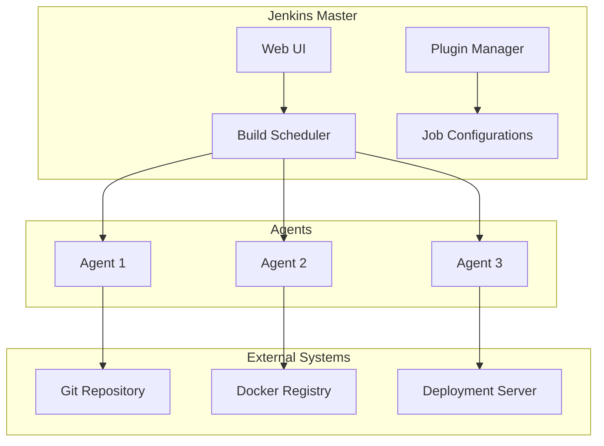
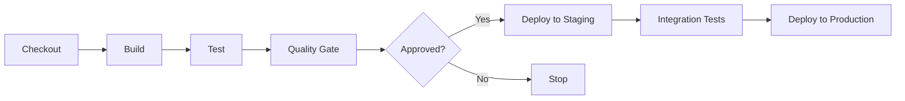
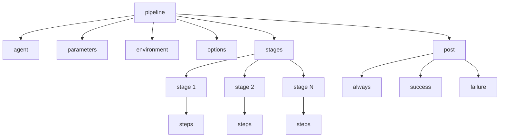

## Introduction

Jenkins is an open-source automation server used for building, testing, and deploying software. It's one of the most widely used CI/CD tools, with a rich ecosystem of plugins that extend its functionality for virtually any software development workflow.

Jenkins supports Pipeline as Code through Jenkinsfiles, enabling version-controlled CI/CD configurations. It integrates with virtually every tool in the software development lifecycle, from version control to deployment platforms. Understanding Jenkins is essential for DevOps engineers and release managers.

This guide covers Jenkins fundamentals through advanced concepts, preparing you for roles involving CI/CD automation and release management.

---

## Learning Roadmap

### Week 1: Jenkins Fundamentals
- Jenkins installation and configuration
- Web UI navigation
- Creating and configuring jobs
- Understanding Jenkins architecture
- Plugin management

### Week 2: Pipeline as Code
- Jenkinsfile syntax (declarative vs scripted)
- Stages, steps, and parallel execution
- Credentials management
- Environment variables
- Post actions and error handling

### Week 3: Distributed Builds
- Master/agent architecture
- Setting up build agents
- Agent labels and selectors
- Docker agents
- Cloud agents (Kubernetes)

### Week 4: Integration and Advanced Features
- Git integration and webhooks
- Integration with Docker and Kubernetes
- Build triggers and scheduling
- Artifact management
- Test reporting and coverage

### Week 5: Security and Administration
- Jenkins security configuration
- Role-Based Access Control (RBAC)
- Backup and recovery
- Performance tuning
- Monitoring Jenkins

### Week 6: Best Practices and Alternatives
- Pipeline best practices
- Jenkins vs other CI/CD tools
- Migration strategies
- Real-world implementation patterns

---

## Theory Notes

### Jenkins Architecture
- **Jenkins Master (Controller)**: Schedules builds, provides web UI, manages plugins
- **Jenkins Agent (Slave)**: Executes builds on remote machines
- **Plugin System**: Extends Jenkins functionality
- **Job/Project**: Configuration for a single automation task
- **Build**: Single execution of a job

### Pipeline Concepts
- **Declarative Pipeline**: Structured, easier to read/write (recommended)
- **Scripted Pipeline**: Groovy-based, more flexible but complex
- **Stage**: Major division of pipeline (Build, Test, Deploy)
- **Step**: Single task within a stage
- **Node**: Agent where pipeline executes

### Pipeline Syntax
```groovy
pipeline {
    agent any
    
    stages {
        stage('Build') {
            steps {
                sh 'make build'
            }
        }
        
        stage('Test') {
            steps {
                sh 'make test'
            }
        }
        
        stage('Deploy') {
            steps {
                sh 'make deploy'
            }
        }
    }
}
```

### Build Triggers
1. **Poll SCM**: Check for changes on schedule
2. **GitHub hook trigger**: Trigger on GitHub push
3. **Build periodically**: Schedule builds
4. **Upstream projects**: Trigger after upstream build
5. **Remote API**: Trigger via HTTP request

### Credentials Types
1. **Username/Password**: Basic authentication
2. **SSH Key**: SSH private key
3. **Secret Text**: Single secret value
4. **Secret File**: File containing secrets
5. **Certificate**: PKCS#12 certificate

---

## Key Concepts

### Declarative Pipeline
1. **agent**: Specifies where pipeline runs
2. **stages**: Contains stage blocks
3. **steps**: Contains executable steps
4. **post**: Actions after pipeline completion
5. **environment**: Environment variable definitions
6. **parameters**: Input parameters for builds
7. **options**: Pipeline-level options
8. **triggers**: Build trigger configurations

### Scripted Pipeline
1. **node**: Agent allocation
2. **stage**: Stage definition
3. **step**: Single task execution
4. **Groovy**: Full Groovy scripting capability
5. **Variables**: Dynamic variable assignment

### Jenkins Plugins
1. **Pipeline**: Core pipeline functionality
2. **Git**: Git integration
3. **Docker Pipeline**: Docker build support
4. **Kubernetes**: Kubernetes agent support
5. **Credentials**: Secure credential management
6. **Blue Ocean**: Modern pipeline visualization
7. **Pipeline Stage View**: Stage visualization

### Distributed Builds
1. **Master/Agent**: Traditional architecture
2. **Docker Agents**: Containerized build environments
3. **Kubernetes Agents**: Dynamic agent provisioning
4. **Cloud Agents**: AWS, Azure, GCP agent support

### Security
1. **Authentication**: Who can access Jenkins
2. **Authorization**: What users can do
3. **Credentials**: Secure secret management
4. **Agent Security**: Secure agent connections
5. **Script Security**: Protect against malicious scripts

---

## FAQ (20+ Q&A)

### Q1: What is the difference between declarative and scripted pipelines?
**A:** Declarative: Structured, easier to read/write, restricted Groovy syntax. Scripted: Full Groovy, more flexible, steeper learning curve. Declarative is recommended for most use cases.

### Q2: What is a Jenkinsfile?
**A:** Text file containing pipeline definition, committed to version control. Enables Pipeline as Code, version-controlled CI/CD configuration.

### Q3: What are Jenkins agents?
**A:** Agents (formerly slaves) are machines that execute builds. They offload work from master and provide build environments with specific tools.

### Q4: How do credentials work in Jenkins?
**A:** Credentials are stored encrypted and referenced by ID in pipelines. Jenkins handles decryption at runtime. Never hard-code secrets in Jenkinsfiles.

### Q5: What is the difference between agent any and agent none?
**A:** agent any: Pipeline can run on any available agent. agent none: Pipeline doesn't specify agent; each stage specifies its own agent.

### Q6: What are Jenkins plugins?
**A:** Extensions that add functionality to Jenkins. Over 1800 plugins available for tools, platforms, and integrations.

### Q7: How do you implement parallel execution in Jenkins?
**A:** Use parallel step in declarative pipeline or parallel() in scripted pipeline. Parallel stages run concurrently.

### Q8: What is Jenkins shared library?
**A:** Reusable pipeline code stored in a separate repository. Allows sharing common pipeline logic across multiple Jenkinsfiles.

### Q9: What are build parameters?
**A:** Input values that customize build execution. Defined in parameters block, passed as environment variables to builds.

### Q10: How do you handle test results in Jenkins?
**A:** Use post actions to publish test results. Plugins: JUnit, TestNG, Allure. Configure test result archiving in post section.

### Q11: What is Blue Ocean?
**A:** Modern Jenkins UI for pipeline visualization. Provides intuitive pipeline editor and visual representation of stages.

### Q12: How do you secure Jenkins?
**A:** Enable authentication, configure authorization (RBAC), use credentials plugin, restrict script execution, keep Jenkins updated.

### Q13: What is the difference between polling SCM and webhook?
**A:** Polling: Jenkins checks for changes periodically. Webhook: Server notifies Jenkins of changes immediately. Webhooks are more efficient.

### Q14: How do you manage Jenkins configuration as code?
**A:** Use Jenkins Configuration as Code (JCasC) plugin. Define all configuration in YAML file, version-controlled.

### Q15: What are Jenkins pipelines best practices?
**A:** Use declarative syntax, implement proper error handling, use shared libraries, scan Jenkinsfiles, minimize external script dependencies.

### Q16: How do you backup Jenkins?
**A:** Use Backup plugin or copy JENKINS_HOME directory. Include job configs, plugins, and credentials. Test restore regularly.

### Q17: What is Jenkins pipeline syntax validator?
**A:** Built-in tool to validate Jenkinsfile syntax. Access via Pipeline Syntax link in Jenkins UI.

### Q18: How do you implement approval gates in Jenkins?
**A:** Use input step in pipeline. Requires manual approval before proceeding. Configure with message, submitter, and timeout.

### Q19: What are Jenkins environment variables?
**A:** Variables available during build execution. Types: Global, Job, Stage, Pipeline-defined. Accessed via env.VARIABLE_NAME.

### Q20: How do you trigger downstream jobs?
**A:** Use build step in upstream job, or use Pipeline with build() step. Configure triggers or use Upstream/Downstream projects.

### Q21: What is Jenkins Codebeat?
**A:** Plugin for code quality analysis. Integrates with SonarQube, Checkstyle, PMD, and other tools.

### Q22: How do you migrate Jenkins jobs?
**A:** Use Job DSL plugin, Jenkins Configuration as Code, or export/import job configurations. Migrate to Pipeline as Code when possible.

---

## Hands-on Practice

### Lab 1: Basic Declarative Pipeline
```groovy
pipeline {
    agent any
    
    environment {
        APP_NAME = 'my-application'
        VERSION = sh(script: 'git describe --tags', returnStdout: true).trim()
    }
    
    stages {
        stage('Checkout') {
            steps {
                checkout scm
            }
        }
        
        stage('Build') {
            steps {
                sh 'mvn clean compile'
            }
        }
        
        stage('Unit Tests') {
            steps {
                sh 'mvn test'
            }
            post {
                always {
                    junit '**/target/surefire-reports/*.xml'
                }
            }
        }
        
        stage('Code Quality') {
            steps {
                sh 'mvn sonar:sonar'
            }
        }
        
        stage('Package') {
            steps {
                sh 'mvn package -DskipTests'
            }
        }
    }
    
    post {
        success {
            echo 'Build succeeded!'
            archiveArtifacts artifacts: 'target/*.jar', fingerprint: true
        }
        failure {
            echo 'Build failed!'
            mail to: 'team@example.com',
                 subject: "Build Failed: ${currentBuild.fullDisplayName}",
                 body: "Check: ${env.BUILD_URL}"
        }
    }
}
```

### Lab 2: Parallel Stages
```groovy
pipeline {
    agent any
    
    stages {
        stage('Build') {
            steps {
                sh 'mvn clean package'
            }
        }
        
        stage('Tests') {
            parallel {
                stage('Unit Tests') {
                    steps {
                        sh 'mvn test -Punit'
                    }
                }
                stage('Integration Tests') {
                    steps {
                        sh 'mvn verify -Pintegration'
                    }
                }
                stage('Security Scan') {
                    steps {
                        sh 'mvn dependency-check:check'
                    }
                }
            }
        }
        
        stage('Deploy to Staging') {
            steps {
                input message: 'Deploy to staging?'
                sh 'kubectl apply -f k8s/staging'
            }
        }
        
        stage('Deploy to Production') {
            steps {
                input message: 'Deploy to production?'
                sh 'kubectl apply -f k8s/production'
            }
        }
    }
}
```

### Lab 3: Credentials and Parameters
```groovy
pipeline {
    agent any
    
    parameters {
        choice(
            name: 'ENVIRONMENT',
            choices: ['dev', 'staging', 'production'],
            description: 'Target environment'
        )
        string(
            name: 'VERSION',
            defaultValue: 'latest',
            description: 'Version to deploy'
        )
        booleanParam(
            name: 'SKIP_TESTS',
            defaultValue: false,
            description: 'Skip tests'
        )
    }
    
    environment {
        DOCKER_CREDENTIALS = credentials('docker-hub')
        DATABASE_URL = credentials('database-url')
    }
    
    stages {
        stage('Build') {
            steps {
                script {
                    if (!params.SKIP_TESTS) {
                        sh 'mvn test'
                    }
                }
                sh 'mvn package'
            }
        }
        
        stage('Build Docker Image') {
            steps {
                script {
                    docker.withRegistry('', 'docker-hub-credentials') {
                        def image = docker.build("myapp:${params.VERSION}")
                        image.push()
                        image.push('latest')
                    }
                }
            }
        }
        
        stage('Deploy') {
            steps {
                sh "kubectl set image deployment/my-app my-app=myapp:${params.VERSION} --namespace=${params.ENVIRONMENT}"
            }
        }
    }
}
```

### Lab 4: Docker Pipeline
```groovy
pipeline {
    agent {
        docker {
            image 'maven:3.8-openjdk-11'
            args '-v $HOME/.m2:/root/.m2'
        }
    }
    
    stages {
        stage('Build') {
            steps {
                sh 'mvn clean package'
            }
        }
        
        stage('Docker Build') {
            steps {
                script {
                    docker.build("myapp:${env.BUILD_NUMBER}")
                }
            }
        }
        
        stage('Docker Push') {
            steps {
                script {
                    docker.withRegistry('https://registry.example.com', 'registry-credentials') {
                        docker.image("myapp:${env.BUILD_NUMBER}").push()
                    }
                }
            }
        }
    }
}
```

### Lab 5: Kubernetes Pipeline
```groovy
pipeline {
    agent {
        kubernetes {
            yaml '''
                apiVersion: v1
                kind: Pod
                spec:
                  containers:
                    - name: maven
                      image: maven:3.8-openjdk-11
                      command: ['cat']
                      tty: true
                    - name: kubectl
                      image: bitnami/kubectl
                      command: ['cat']
                      tty: true
            '''
        }
    }
    
    stages {
        stage('Build with Maven') {
            steps {
                container('maven') {
                    sh 'mvn clean package'
                }
            }
        }
        
        stage('Deploy to Kubernetes') {
            steps {
                container('kubectl') {
                    sh 'kubectl apply -f k8s/deployment.yaml'
                    sh 'kubectl rollout status deployment/my-app'
                }
            }
        }
    }
}
```

---

## FAANG Questions

### Amazon/Facebook Level
1. **Design a Jenkins pipeline for a microservices application with 20 services.**
   - Parallel builds for independent services
   - Shared libraries for common logic
   - Conditional deployment based on changes
   - Integration testing after deployment
   - Consider: Build time optimization, resource management

2. **How would you migrate Jenkins to a more modern CI/CD platform?**
   - Assess current pipeline complexity
   - Create equivalent pipelines in new platform
   - Gradual migration service by service
   - Maintain both platforms during transition
   - Consider: Feature parity, team training

3. **Design a secure Jenkins environment for enterprise use.**
   - Role-Based Access Control (RBAC)
   - Credentials management with Vault
   - Agent isolation and security
   - Audit logging and monitoring
   - Consider: Compliance requirements, secret rotation

### Google/Microsoft Level
4. **How would you optimize a slow Jenkins pipeline?**
   - Analyze pipeline stages for bottlenecks
   - Implement parallel execution
   - Use caching for dependencies
   - Optimize Docker builds with BuildKit
   - Consider: Resource allocation, agent selection

5. **Design a Jenkins high availability setup.**
   - Multiple Jenkins controllers
   - Shared storage for JENKINS_HOME
   - Load balancing
   - Agent fleet management
   - Consider: Failover, state replication

### Netflix/Apple Level
6. **How would you implement GitOps with Jenkins?**
   - Jenkins triggers on Git changes
   - Automated deployment to Kubernetes
   - Rollback on failure
   - Integration with ArgoCD or Flux
   - Consider: State management, drift detection

---

## Common Mistakes

1. **Storing secrets in Jenkinsfile** - Hard-coding credentials instead of using credentials plugin.

2. **Not using Pipeline as Code** - Configuring jobs through UI instead of Jenkinsfiles.

3. **Ignoring pipeline best practices** - Not implementing error handling, parallel execution, or proper logging.

4. **Over-relying on plugins** - Using too many plugins without evaluating necessity and maintenance.

5. **Not securing Jenkins** - Default admin credentials, no authentication, exposed API.

6. **Ignoring build artifact management** - Not archiving artifacts or using artifact repositories.

7. **No test reporting** - Not publishing test results or code coverage reports.

8. **Hard-coding environment-specific values** - Using parameters instead of environment-specific configuration.

9. **Not monitoring Jenkins** - No monitoring for build failures, queue length, or resource usage.

10. **Poor agent management** - Not using distributed builds or not isolating build environments.

---

## Best Practices

### Pipeline Design
- Use declarative syntax
- Implement proper error handling
- Use shared libraries for common logic
- Minimize external script dependencies
- Use meaningful stage names

### Security
- Use credentials plugin for secrets
- Implement RBAC
- Keep Jenkins and plugins updated
- Use agent isolation
- Enable audit logging

### Performance
- Use distributed builds
- Implement parallel execution
- Cache dependencies
- Use Docker agents for isolation
- Monitor and optimize build times

### Maintenance
- Regular backups
- Test backup restoration
- Monitor plugin updates
- Review and remove unused plugins
- Document pipeline procedures

---

## Cheat Sheet

### Jenkins Pipeline Syntax
```groovy
// Declarative Pipeline
pipeline {
    agent any
    
    parameters {
        string(name: 'PARAM', defaultValue: 'value')
        choice(name: 'CHOICE', choices: ['a', 'b'])
        booleanParam(name: 'BOOL', defaultValue: true)
    }
    
    environment {
        VAR = 'value'
        CRED = credentials('credential-id')
    }
    
    options {
        timeout(time: 30, unit: 'MINUTES')
        disableConcurrentBuilds()
    }
    
    stages {
        stage('Stage Name') {
            steps {
                sh 'command'
                echo 'message'
                input message: 'Proceed?'
            }
        }
        
        stage('Parallel') {
            parallel {
                stage('A') { steps { echo 'A' } }
                stage('B') { steps { echo 'B' } }
            }
        }
    }
    
    post {
        always { echo 'Always runs' }
        success { echo 'On success' }
        failure { echo 'On failure' }
        cleanup { echo 'Cleanup' }
    }
}

// Scripted Pipeline
node('agent-label') {
    stage('Build') {
        sh 'make build'
    }
    
    stage('Test') {
        sh 'make test'
    }
    
    stage('Deploy') {
        input 'Deploy?'
        sh 'make deploy'
    }
}
```

### Common Jenkins Commands
```bash
# Restart Jenkins
sudo systemctl restart jenkins

# Check Jenkins status
sudo systemctl status jenkins

# View Jenkins logs
tail -f /var/log/jenkins/jenkins.log

# Backup Jenkins
tar -czvf jenkins-backup.tar.gz /var/lib/jenkins

# Update Jenkins
sudo apt update && sudo apt upgrade jenkins
```

### Jenkins CLI Commands
```bash
# Build job
java -jar jenkins-cli.jar -s http://localhost:8080/ build JOB_NAME

# List jobs
java -jar jenkins-cli.jar -s http://localhost:8080/ list-jobs

# Get build status
java -jar jenkins-cli.jar -s http://localhost:8080/ console JOB_NAME BUILD_NUMBER

# Create job
java -jar jenkins-cli.jar -s http://localhost:8080/ create-job JOB_NAME < config.xml
```

---

## Flash Cards (20)

**Card 1**: What is Jenkins?
Open-source automation server for building, testing, and deploying software.

**Card 2**: What is Pipeline as Code?
Defining CI/CD pipelines in version-controlled Jenkinsfiles.

**Card 3**: What is the difference between declarative and scripted pipelines?
Declarative is structured and easier; scripted uses full Groovy and is more flexible.

**Card 4**: What is a Jenkins agent?
Remote machine that executes build tasks offloading work from master.

**Card 5**: What are Jenkins plugins?
Extensions that add functionality to Jenkins (1800+ available).

**Card 6**: What is a Jenkinsfile?
Text file containing pipeline definition, committed to version control.

**Card 7**: What are Jenkins credentials?
Securely stored authentication information referenced by ID in pipelines.

**Card 8**: What is Blue Ocean?
Modern Jenkins UI for visualizing and editing pipelines.

**Card 9**: What are build parameters?
Input values that customize build execution, passed as environment variables.

**Card 10**: What is Jenkins shared library?
Reusable pipeline code stored in separate repository for sharing across jobs.

**Card 11**: What is the difference between polling SCM and webhook?
Polling checks periodically; webhooks notify immediately of changes.

**Card 12**: What is Jenkins Configuration as Code (JCasC)?
Plugin for defining all Jenkins configuration in YAML files.

**Card 13**: What is the post section in declarative pipeline?
Actions executed after pipeline completion (always, success, failure).

**Card 14**: What are Jenkins environment variables?
Variables available during build execution (env.VARIABLE_NAME).

**Card 15**: What is the input step?
Requires manual approval before pipeline continues.

**Card 16**: What is Jenkinsfile scanner?
Validates Jenkinsfile syntax before committing.

**Card 17**: What are Docker agents?
Containerized build environments using Docker containers.

**Card 18**: What is Jenkins Role-Based Access Control?
Plugin for managing user permissions based on roles.

**Card 19**: What is Jenkins backup plugin?
Tool for backing up Jenkins configuration and data.

**Card 20**: What is the difference between Jenkins master and agent?
Master manages builds and UI; agents execute build tasks.

---

## Mind Map

```
Jenkins
├── Architecture
│   ├── Master/Controller
│   ├── Agents/Slaves
│   ├── Plugins
│   └── Web UI
├── Pipelines
│   ├── Declarative
│   ├── Scripted
│   ├── Jenkinsfile
│   └── Shared Libraries
├── Stages
│   ├── Build
│   ├── Test
│   ├── Deploy
│   └── Approval
├── Integration
│   ├── Git
│   ├── Docker
│   ├── Kubernetes
│   └── Cloud Providers
├── Security
│   ├── Authentication
│   ├── Authorization
│   ├── Credentials
│   └── Agent Security
└── Administration
    ├── Configuration
    ├── Monitoring
    ├── Backup
    └── Performance
```

---

## Mermaid Diagrams

### Jenkins Architecture


### Pipeline Flow


### Jenkins Declarative Pipeline Structure


---

## Code Examples

### Complete Enterprise Pipeline
```groovy
pipeline {
    agent {
        kubernetes {
            yaml '''
                apiVersion: v1
                kind: Pod
                spec:
                  containers:
                    - name: maven
                      image: maven:3.8-openjdk-11
                      command: ['cat']
                      tty: true
                      volumeMounts:
                        - name: maven-cache
                          mountPath: /root/.m2
                    - name: docker
                      image: docker:24-dind
                      securityContext:
                        privileged: true
                      volumeMounts:
                        - name: docker-socket
                          mountPath: /var/run/docker.sock
                  volumes:
                    - name: maven-cache
                      persistentVolumeClaim:
                        claimName: maven-cache-pvc
                    - name: docker-socket
                      hostPath:
                        path: /var/run/docker.sock
            '''
        }
    }
    
    parameters {
        choice(
            name: 'ENVIRONMENT',
            choices: ['dev', 'staging', 'production'],
            description: 'Target environment'
        )
        string(
            name: 'VERSION',
            defaultValue: 'latest',
            description: 'Version to deploy'
        )
    }
    
    environment {
        DOCKER_REGISTRY = 'registry.example.com'
        APP_NAME = 'my-app'
        CREDENTIALS_ID = 'docker-hub-credentials'
    }
    
    options {
        timeout(time: 60, unit: 'MINUTES')
        disableConcurrentBuilds()
        buildDiscarder(logRotator(numToKeepStr: '10'))
    }
    
    stages {
        stage('Checkout') {
            steps {
                checkout scm
                script {
                    env.GIT_COMMIT_MSG = sh(
                        script: 'git log -1 --pretty=%B',
                        returnStdout: true
                    ).trim()
                }
            }
        }
        
        stage('Build') {
            steps {
                container('maven') {
                    sh 'mvn clean compile'
                }
            }
        }
        
        stage('Unit Tests') {
            steps {
                container('maven') {
                    sh 'mvn test'
                }
            }
            post {
                always {
                    junit '**/target/surefire-reports/*.xml'
                    jacoco(execPattern: '**/target/jacoco.exec')
                }
            }
        }
        
        stage('Code Quality') {
            steps {
                container('maven') {
                    withSonarQubeEnv('SonarQube') {
                        sh 'mvn sonar:sonar'
                    }
                }
            }
        }
        
        stage('Quality Gate') {
            steps {
                timeout(time: 5, unit: 'MINUTES') {
                    waitForQualityGate abortPipeline: true
                }
            }
        }
        
        stage('Package') {
            steps {
                container('maven') {
                    sh 'mvn package -DskipTests'
                }
            }
        }
        
        stage('Build Docker Image') {
            steps {
                container('docker') {
                    script {
                        def imageTag = "${DOCKER_REGISTRY}/${APP_NAME}:${params.VERSION}"
                        docker.build(imageTag)
                        
                        withCredentials([usernamePassword(
                            credentialsId: CREDENTIALS_ID,
                            usernameVariable: 'DOCKER_USER',
                            passwordVariable: 'DOCKER_PASS'
                        )]) {
                            sh "docker login ${DOCKER_REGISTRY} -u ${DOCKER_USER} -p ${DOCKER_PASS}"
                            sh "docker push ${imageTag}"
                        }
                    }
                }
            }
        }
        
        stage('Deploy to Environment') {
            steps {
                script {
                    def namespace = params.ENVIRONMENT
                    
                    sh """
                        kubectl set image deployment/${APP_NAME} \
                            ${APP_NAME}=${DOCKER_REGISTRY}/${APP_NAME}:${params.VERSION} \
                            --namespace=${namespace}
                    """
                    
                    sh "kubectl rollout status deployment/${APP_NAME} --namespace=${namespace} --timeout=300s"
                }
            }
        }
        
        stage('Integration Tests') {
            steps {
                script {
                    if (params.ENVIRONMENT == 'staging') {
                        sh 'mvn verify -Pintegration-tests'
                    }
                }
            }
        }
        
        stage('Production Approval') {
            when {
                equals expected: 'production', actual: params.ENVIRONMENT
            }
            steps {
                input(
                    message: 'Deploy to production?',
                    submitter: 'admin,release-managers',
                    parameters: [
                        string(name: 'APPROVAL_NOTES', defaultValue: '', description: 'Approval notes')
                    ]
                )
            }
        }
    }
    
    post {
        always {
            cleanWs()
            script {
                if (currentBuild.result == 'FAILURE') {
                    emailext(
                        subject: "FAILED: ${env.JOB_NAME} #${env.BUILD_NUMBER}",
                        body: """
                            Build failed.
                            Job: ${env.JOB_NAME}
                            Build: ${env.BUILD_NUMBER}
                            URL: ${env.BUILD_URL}
                            Commit: ${env.GIT_COMMIT_MSG}
                        """,
                        to: 'team@example.com'
                    )
                }
            }
        }
    }
}
```

---

## Projects

### Project 1: CI/CD Pipeline for Web Application
Complete pipeline with:
- Multi-stage build and test
- Docker image building
- Kubernetes deployment
- Integration with monitoring
- Rollback procedures

### Project 2: Multi-Branch Pipeline
Implement branching strategy:
- Feature branch builds
- Pull request validation
- Main branch deployment
- Release branch management

### Project 3: Jenkins Infrastructure
Set up Jenkins infrastructure:
- Master/agent architecture
- Docker agent configuration
- Kubernetes agent integration
- Security hardening
- Monitoring and alerting

---

## Resources

### Official Documentation
- [Jenkins Documentation](https://www.jenkins.io/doc/)
- [Pipeline Syntax Reference](https://www.jenkins.io/doc/book/pipeline/syntax/)
- [Jenkins Plugin Index](https://plugins.jenkins.io/)
- [Jenkins Books](https://www.jenkins.io/book/)

### Learning Platforms
- Jenkins Official Tutorials
- CloudBees Jenkins Tutorials
- Plurish Jenkins Course
- Udemy Jenkins Courses

### Tools
- **Blue Ocean**: Modern pipeline UI
- **Pipeline Linter**: Validate Jenkinsfiles
- **Jenkins Configuration as Code**: YAML-based config
- **Jenkins CLI**: Command-line interface

---

## Checklist

- [ ] Install and configure Jenkins
- [ ] Understand Jenkins architecture
- [ ] Create declarative pipelines
- [ ] Implement scripted pipelines
- [ ] Use credentials securely
- [ ] Set up distributed builds
- [ ] Integrate with Git
- [ ] Implement Docker pipelines
- [ ] Configure Kubernetes agents
- [ ] Set up RBAC
- [ ] Implement pipeline best practices
- [ ] Monitor Jenkins health
- [ ] Backup and recovery procedures
- [ ] Prepare for interviews

---

## Mock Interviews

### Scenario 1: Jenkins Administrator
**Interviewer**: "A Jenkins build is taking 45 minutes. How do you optimize it?"

**Key Points to Cover**:
- Analyze pipeline stages for bottlenecks
- Implement parallel execution
- Use caching for dependencies
- Optimize Docker builds
- Consider faster agents

### Scenario 2: DevOps Engineer
**Interviewer**: "Design a Jenkins pipeline for a microservices architecture."

**Key Points to Cover**:
- Independent service builds
- Shared libraries for common logic
- Conditional deployment
- Integration testing
- Rollback strategy

### Scenario 3: Release Manager
**Interviewer**: "How would you implement approval gates in Jenkins?"

**Key Points to Cover**:
- Input step for manual approval
- Role-based submitter restrictions
- Timeout configuration
- Notification integration
- Audit trail

---

## Difficulty Rating

| Topic | Difficulty | Time to Learn |
|-------|------------|---------------|
| Jenkins Basics | ⭐⭐ | 1-2 weeks |
| Declarative Pipeline | ⭐⭐ | 1-2 weeks |
| Scripted Pipeline | ⭐⭐⭐ | 2-3 weeks |
| Plugin Management | ⭐⭐ | 1 week |
| Distributed Builds | ⭐⭐⭐ | 2-3 weeks |
| Security Configuration | ⭐⭐⭐ | 2-3 weeks |
| Advanced Pipelines | ⭐⭐⭐⭐ | 3-4 weeks |
| High Availability | ⭐⭐⭐⭐ | 3-4 weeks |

---

## Summary

Jenkins is a powerful automation server for CI/CD. Key areas for interviews include:

1. **Architecture**: Understanding master/agent model
2. **Pipeline as Code**: Declarative vs scripted pipelines
3. **Integration**: Git, Docker, Kubernetes, cloud providers
4. **Security**: Credentials, RBAC, agent isolation
5. **Performance**: Parallel execution, caching, optimization
6. **Best Practices**: Error handling, shared libraries, monitoring

Mastering Jenkins prepares you for roles in release management and DevOps automation.

