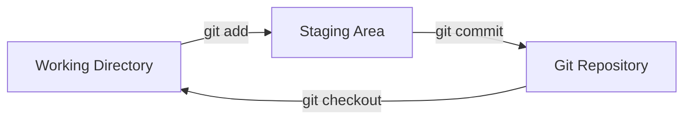
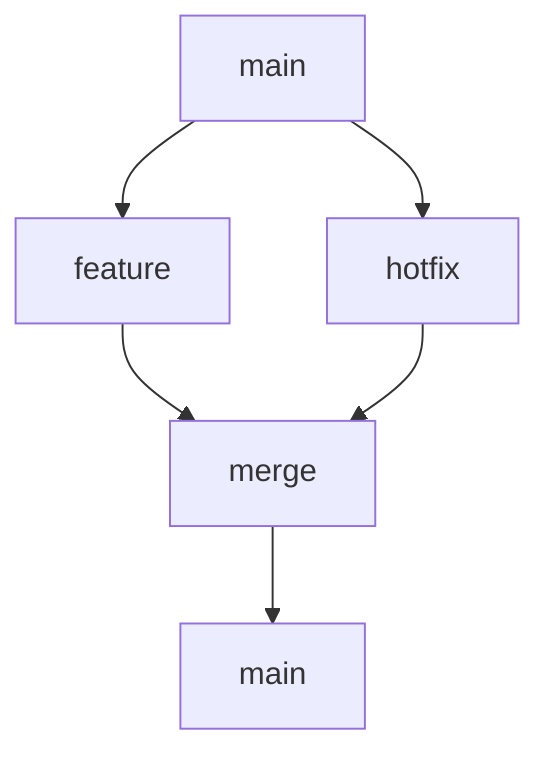
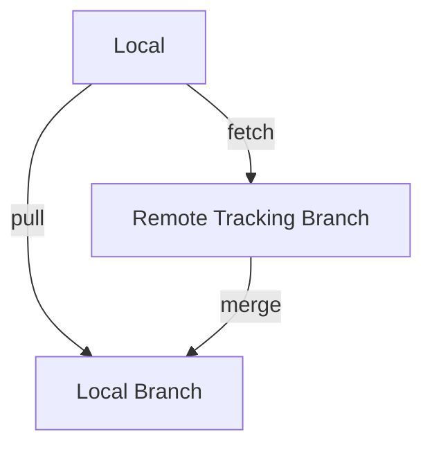
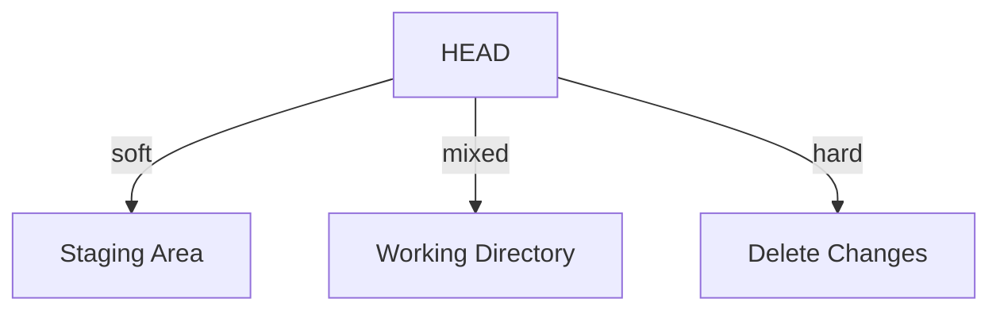

## Introduction

Git is a distributed version control system designed to handle everything from small to very large projects with speed and efficiency. Created by Linus Torvalds in 2005 for Linux kernel development, Git has become the industry standard for version control.

Git tracks changes in source code during software development, enabling multiple developers to collaborate efficiently. It provides features like branching, merging, stashing, and distributed history that make it indispensable for modern software development.

Understanding Git thoroughly is essential for any software developer, as version control is a fundamental skill tested in virtually every technical interview.

---

## Learning Roadmap

### Week 1: Git Fundamentals
- Git installation and configuration
- Basic commands (init, add, commit, status, log)
- Working directory, staging area, repository
- Undoing changes (checkout, restore, reset)
- Git aliases and configuration

### Week 2: Branching and Merging
- Branch creation and switching
- Merge vs rebase strategies
- Merge conflict resolution
- Branch deletion and cleanup
- Fast-forward vs three-way merge

### Week 3: Remote Operations
- Remote repositories (clone, fetch, pull, push)
- Tracking branches
- Fork and pull workflow
- Remote branch management
- Git tags

### Week 4: Advanced Features
- Stashing changes
- Cherry-picking commits
- Interactive rebase
- Git bisect for debugging
- Git blame and annotations

### Week 5: Git Internals
- Git objects (blob, tree, commit, tag)
- References and refs
- Git storage model
- Packfiles and garbage collection
- Git hooks

### Week 6: Advanced Topics
- Submodules and subtrees
- Worktrees
- Git hooks for automation
- Git workflow strategies
- Troubleshooting Git issues

---

## Theory Notes

### Three Areas of Git
1. **Working Directory**: Where you edit files
2. **Staging Area (Index)**: Files marked for next commit
3. **Git Repository**: Project history and metadata

### Git Object Model
- **Blob**: File content (no filename)
- **Tree**: Directory structure (filenames → blobs/trees)
- **Commit**: Snapshot with metadata (author, message, parents)
- **Tag**: Named reference to a commit

### Git References
- **HEAD**: Points to current branch or commit
- **Branch**: Points to latest commit in branch
- **Remote Branch**: Tracks remote repository state
- **Tag**: Named pointer to specific commit

### Merge Strategies
1. **Fast-Forward**: No divergence, pointer moves forward
2. **Three-Way Merge**: Creates merge commit when branches diverge
3. **Squash Merge**: Combines all commits into single commit
4. **Rebase**: Rewrites history to linearize commits

### Commit Hash
- SHA-1 hash of commit content
- Unique identifier for each commit
- Used in commands like cherry-pick, revert, reset

---

## Key Concepts

### Basic Commands
1. **git init**: Initialize new repository
2. **git add**: Stage changes for commit
3. **git commit**: Record staged changes
4. **git status**: Show working tree status
5. **git log**: Show commit history
6. **git diff**: Show changes between commits

### Branching
1. **git branch**: List, create, delete branches
2. **git checkout/switch**: Switch branches
3. **git merge**: Merge branches
4. **git rebase**: Reapply commits on new base
5. **git cherry-pick**: Apply specific commits

### Remote Operations
1. **git clone**: Copy remote repository
2. **git fetch**: Download remote changes
3. **git pull**: Fetch and merge changes
4. **git push**: Upload local changes
5. **git remote**: Manage remote connections

### Undoing Changes
1. **git restore**: Discard working directory changes
2. **git reset**: Move HEAD and optionally stage
3. **git revert**: Create commit that undoes changes
4. **git stash**: Temporarily store changes

### Inspection
1. **git log**: View commit history
2. **git show**: Show commit details
3. **git blame**: Show who changed each line
4. **git diff**: Compare versions
5. **git grep**: Search code

---

## FAQ (20+ Q&A)

### Q1: What is the difference between git pull and git fetch?
**A:** git fetch downloads remote changes without modifying working directory. git pull fetches and immediately merges into current branch. fetch is safer for review before merging.

### Q2: What is the difference between git merge and git rebase?
**A:** Merge creates a merge commit preserving history. Rebase rewrites history to create linear sequence. Merge preserves context; rebase creates cleaner history.

### Q3: What is a merge conflict?
**A:** Occurs when Git can't automatically merge changes from different branches. Requires manual resolution by editing files and choosing which changes to keep.

### Q4: What is git stash?
**A:** Temporarily stores modified tracked files to clean working directory. Useful for switching contexts. Stash can be applied or popped later.

### Q5: What is the difference between git reset and git revert?
**A:** reset moves HEAD and optionally modifies staging/working directory. revert creates new commit that undoes changes. revert is safer for shared branches.

### Q6: What are Git hooks?
**A:** Scripts that run automatically on Git events (pre-commit, commit-msg, post-commit). Used for code validation, commit message enforcement, and automation.

### Q7: What is git cherry-pick?
**A:** Applies a specific commit from one branch to another. Useful for hotfixes or applying specific changes without merging entire branch.

### Q8: What is the difference between git clone and git fork?
**A:** clone creates local copy of repository. fork creates server-side copy (GitHub/GitLab) under your account. Fork is for contributing to others' projects.

### Q9: What is interactive rebase?
**A:** git rebase -i allows editing, reordering, squashing, or removing commits. Powerful for cleaning up history before sharing.

### Q10: What is git bisect?
**A:** Binary search through commit history to find commit that introduced a bug. Start with good/bad commits; Git finds the introducing commit.

### Q11: What is the difference between local and remote branches?
**A:** Local branches exist on your machine. Remote branches track state of remote repository (origin/main). Local and remote can diverge until synchronized.

### Q12: What is HEAD in Git?
**A:** HEAD is pointer to current branch or commit. Detached HEAD means pointing to commit instead of branch. Most operations work relative to HEAD.

### Q13: What are Git tags?
**A:** Named references to specific commits. Lightweight tags are simple pointers. Annotated tags contain metadata (tagger, date, message). Used for releases.

### Q14: What is the difference between git add and git add -p?
**A:** git add stages entire file. git add -p (patch) allows staging specific hunks within a file for partial commits.

### Q15: What is git reflog?
**A:** Reference log tracking all changes to HEAD. Useful for recovering lost commits or branches. Shows where HEAD has been.

### Q16: What are Git submodules?
**A:** Git repositories nested within another repository. Useful for managing dependencies. Requires explicit init and update.

### Q17: What is the difference between git diff and git diff --staged?
**A:** git diff shows unstaged changes. git diff --staged shows changes between staging area and last commit.

### Q18: What is git clean?
**A:** Removes untracked files from working directory. Use -n for dry run, -f to force. Can delete untracked files and directories.

### Q19: What is the gitignore file?
**A:** Specifies files Git should ignore (build artifacts, dependencies, IDE files). Pattern matching for files and directories.

### Q20: What is git worktree?
**A:** Working directory associated with a single repository. Allows multiple working directories for different branches simultaneously.

### Q21: What is the difference between git checkout and git switch?
**A:** git checkout does multiple things (switch branches, restore files, create branches). git switch specifically for switching branches. git restore for files.

### Q22: What is git gc?
**A:** Garbage collection optimizing repository performance. Cleans unreachable objects, compresses packfiles. Runs automatically periodically.

---

## Hands-on Practice

### Lab 1: Basic Git Workflow
```bash
# Initialize repository
git init
git add .
git commit -m "Initial commit"

# Create branch
git branch feature-login
git switch feature-login

# Make changes
echo "Login feature" > login.html
git add login.html
git commit -m "Add login page"

# Switch back and merge
git switch main
git merge feature-login

# Delete branch
git branch -d feature-login
```

### Lab 2: Merge Conflict Resolution
```bash
# Create conflict
git switch main
echo "Main branch" > file.txt
git add . && git commit -m "Main change"

git switch -b feature
echo "Feature branch" > file.txt
git add . && git commit -m "Feature change"

git switch main
echo "Another main change" >> file.txt
git add . && git commit -m "Another main change"

# Merge will conflict
git merge feature

# Resolve conflict (edit file.txt)
# Then commit
git add file.txt
git commit -m "Resolve merge conflict"
```

### Lab 3: Stashing and Cherry-Pick
```bash
# Stash changes
git stash
git stash list
git stash pop

# Cherry-pick
git log --oneline  # Find commit hash
git cherry-pick abc1234

# Interactive rebase
git rebase -i HEAD~3  # Rebase last 3 commits
```

### Lab 4: Git Bisect
```bash
# Start bisect
git bisect start
git bisect bad          # Current commit is bad
git bisect good v1.0    # v1.0 was good

# Git tests middle commit
# Mark as good or bad
git bisect good  # or git bisect bad

# Continue until found
git bisect reset  # Return to normal state
```

### Lab 5: Advanced Operations
```bash
# Amend last commit
git commit --amend --no-edit

# Reset to specific commit
git reset --soft HEAD~1   # Keep changes staged
git reset --mixed HEAD~1  # Keep changes unstaged
git reset --hard HEAD~1   # Discard all changes

# Revert commit
git revert abc1234

# Interactive rebase
git rebase -i main
# pick, squash, fixup, edit, drop
```

---

## FAANG Questions

### Amazon/Facebook Level
1. **Explain Git's branching model and how you use it in your workflow.**
   - Feature branches for new work
   - Release branches for stabilization
   - Hotfix branches for urgent fixes
   - Merge vs rebase considerations
   - Branch naming conventions

2. **How do you handle merge conflicts in a large codebase?**
   - Prevention: Small, frequent commits
   - Resolution: Manual editing, understanding context
   - Tools: Merge tools, IDE integration
   - Testing after resolution

3. **Design a Git workflow for a team of 50 developers.**
   - Branch strategy (trunk-based or Git Flow)
   - Pull request process
   - Code review requirements
   - CI/CD integration
   - Release management

### Google/Microsoft Level
4. **Explain Git's internal data structure.**
   - Object model (blob, tree, commit, tag)
   - SHA-1 hashing
   - Packfiles for storage efficiency
   - Reference management

5. **How would you recover a deleted branch?**
   - Check reflog for last commit
   - Create new branch from commit
   - Alternative: git fsck for lost objects

### Netflix/Apple Level
6. **Design a Git strategy for a monorepo with multiple applications.**
   - Directory structure
   - CI/CD triggers based on changes
   - Shared libraries management
   - Release coordination

---

## Common Mistakes

1. **Committing secrets** - Storing API keys, passwords, or certificates in Git.

2. **Force pushing shared branches** - Rewriting history on branches others use.

3. **Large commits** - Making many unrelated changes in single commit.

4. **Poor commit messages** - Vague or non-descriptive commit messages.

5. **Ignoring .gitignore** - Not excluding build artifacts and dependencies.

6. **Merge conflicts from large PRs** - Not breaking work into smaller pieces.

7. **Not pulling before push** - Missing remote changes and causing conflicts.

8. **Using git add . blindly** - Staging unwanted files including secrets.

9. **Detached HEAD** - Checking out commit instead of branch, losing work.

10. **Not backing up** - Not pushing to remote or having backup strategy.

---

## Best Practices

### Commit Messages
- Use imperative mood ("Add feature" not "Added feature")
- Keep subject line under 72 characters
- Use body for detailed explanation
- Reference issue numbers

### Branching
- Use meaningful branch names (feature/, bugfix/, hotfix/)
- Keep branches short-lived
- Delete merged branches
- Use feature flags instead of long-lived branches

### Code Review
- Use pull/merge requests
- Review before merging
- Require approvals
- Run CI checks before merge

### Safety
- Never force push shared branches
- Use git stash for temporary changes
- Test after merge conflicts
- Keep history clean with rebase

---

## Cheat Sheet

### Essential Commands
```bash
# Setup
git config --global user.name "Name"
git config --global user.email "email@example.com"

# Initialize
git init                    # New repository
git clone url               # Clone remote

# Stage and Commit
git add file               # Stage file
git add .                  # Stage all
git commit -m "message"    # Commit

# Branch
git branch name            # Create branch
git switch name            # Switch branch
git switch -c name         # Create and switch
git branch -d name         # Delete branch

# Remote
git remote add origin url  # Add remote
git push origin branch     # Push
git pull origin branch     # Pull

# History
git log                    # Full history
git log --oneline          # Compact history
git log --graph            # Visual graph

# Undo
git restore file           # Discard changes
git restore --staged file  # Unstage
git commit --amend         # Amend commit
git revert commit          # Revert commit
git reset --hard commit    # Reset to commit
```

### Useful Aliases
```bash
git config --global alias.co checkout
git config --global alias.br branch
git config --global alias.ci commit
git config --global alias.st status
git config --global alias.lg "log --oneline --graph --all"
git config --global alias.last "log -1 HEAD"
git config --global alias.unstage "reset HEAD --"
```

### Git Log Formats
```bash
git log --oneline                  # Compact
git log --graph --all              # Visual
git log --stat                     # With changes
git log --author="John"            # By author
git log --since="2 weeks ago"      # By date
git log -5                         # Last 5 commits
git log --pretty=format:"%h - %an, %ar : %s"
```

### Git Diff Commands
```bash
git diff                          # Working vs staging
git diff --staged                 # Staging vs last commit
git diff branch1 branch2          # Between branches
git diff commit1 commit2          # Between commits
git diff --name-only              # File names only
git diff --stat                   # Statistics
```

---

## Flash Cards (20)

**Card 1**: What is Git?
Distributed version control system for tracking changes in source code.

**Card 2**: What is the staging area?
Intermediate area where changes are prepared before committing.

**Card 3**: What is the difference between git add and git commit?
git add stages changes; git commit records staged changes permanently.

**Card 4**: What is a branch?
Pointer to a series of commits, allowing parallel development.

**Card 5**: What is HEAD?
Pointer to current branch or commit in the repository.

**Card 6**: What is git merge?
Combining changes from different branches into current branch.

**Card 7**: What is git rebase?
Reapplying commits on top of another base tip for linear history.

**Card 8**: What is a merge conflict?
When Git cannot automatically merge changes from different branches.

**Card 9**: What is git stash?
Temporarily storing modified files for later use.

**Card 10**: What is git cherry-pick?
Applying a specific commit from one branch to another.

**Card 11**: What is the difference between git pull and git fetch?
fetch downloads changes; pull fetches and merges immediately.

**Card 12**: What is git reset?
Moving HEAD and optionally modifying staging and working directory.

**Card 13**: What is git revert?
Creating a new commit that undoes changes from a previous commit.

**Card 14**: What is .gitignore?
File specifying which files Git should ignore.

**Card 15**: What is git tag?
Named reference to a specific commit, often used for releases.

**Card 16**: What is git blame?
Showing who last modified each line of a file.

**Card 17**: What is git bisect?
Binary search through history to find commit that introduced bug.

**Card 18**: What is git reflog?
Reference log tracking all changes to HEAD.

**Card 19**: What is a Git object?
Fundamental data structure (blob, tree, commit, tag) in Git.

**Card 20**: What is git gc?
Garbage collection optimizing repository storage and performance.

---

## Mind Map

```
Git
├── Basic Commands
│   ├── init
│   ├── add
│   ├── commit
│   ├── status
│   └── log
├── Branching
│   ├── branch
│   ├── checkout/switch
│   ├── merge
│   ├── rebase
│   └── cherry-pick
├── Remote
│   ├── clone
│   ├── fetch
│   ├── pull
│   ├── push
│   └── remote
├── Undoing
│   ├── restore
│   ├── reset
│   ├── revert
│   └── stash
├── Inspection
│   ├── log
│   ├── diff
│   ├── show
│   ├── blame
│   └── bisect
└── Internals
    ├── Objects (blob, tree, commit)
    ├── References
    ├── Packfiles
    └── Hooks
```

---

## Mermaid Diagrams

### Git Three Areas


### Branching and Merging


### Git Fetch vs Pull


### Git Reset Modes


---

## Code Examples

### Git Hook - Pre-commit
```bash
#!/bin/bash
# .git/hooks/pre-commit

# Run linter
npm run lint
if [ $? -ne 0 ]; then
    echo "Linting failed. Please fix errors before committing."
    exit 1
fi

# Run tests
npm test
if [ $? -ne 0 ]; then
    echo "Tests failed. Please fix tests before committing."
    exit 1
fi

# Check for secrets
if git diff --cached --name-only | xargs grep -l "password\|secret\|api_key" 2>/dev/null; then
    echo "Potential secrets detected. Please review."
    exit 1
fi

exit 0
```

### Git Hook - Commit Message
```bash
#!/bin/bash
# .git/hooks/commit-msg

# Check commit message format
commit_msg=$(cat "$1")

# Check subject line length
subject=$(echo "$commit_msg" | head -n1)
if [ ${#subject} -gt 72 ]; then
    echo "Subject line too long (max 72 characters)"
    exit 1
fi

# Check for issue reference
if ! grep -qE "^(feat|fix|docs|style|refactor|test|chore)(\(.+\))?: .{1,72}" "$1"; then
    echo "Commit message must follow conventional commits format"
    echo "Example: feat(auth): add login functionality"
    exit 1
fi

exit 0
```

### Shell Script - Git Workflow
```bash
#!/bin/bash

# Git workflow helper script

case "$1" in
    feature)
        git switch main
        git pull origin main
        git switch -c "feature/$2"
        ;;
    
    finish)
        branch=$(git branch --show-current)
        git switch main
        git pull origin main
        git merge "$branch"
        git push origin main
        git switch "$branch"
        ;;
    
    pr)
        branch=$(git branch --show-current)
        git push origin "$branch"
        echo "Create pull request for $branch"
        ;;
    
    cleanup)
        git branch --merged main | grep -v main | xargs git branch -d
        git fetch --prune
        ;;
    
    *)
        echo "Usage: $0 {feature|finish|pr|cleanup} [branch-name]"
        ;;
esac
```

---

## Projects

### Project 1: Git Alias Collection
Create comprehensive Git aliases:
- Log aliases for different views
- Diff aliases for various comparisons
- Shortcut aliases for common operations
- Document and share with team

### Project 2: Git Hooks Automation
Implement Git hooks for:
- Pre-commit linting and testing
- Commit message validation
- Branch protection
- Automated deployment triggers

### Project 3: Git Workflow Documentation
Document team workflow:
- Branch naming conventions
- Pull request process
- Code review guidelines
- Release procedures

---

## Resources

### Official Documentation
- [Git Documentation](https://git-scm.com/doc)
- [Git Book](https://git-scm.com/book)
- [Git Reference](https://git-scm.com/docs)
- [Pro Git Book](https://git-scm.com/book/en/v2)

### Learning Platforms
- Git Immersion (interactive tutorial)
- Learn Git Branching (visual learning)
- Atlassian Git Tutorials
- GitHub Learning Lab

### Tools
- **Git GUI**: GitKraken, SourceTree, VS Code
- **Git Hooks**: Husky, pre-commit
- **Git Extensions**: Git LFS, Git Submodules

### Visual Learning
- [Learn Git Branching](https://learngitbranching.js.org/)
- [Visualizing Git](https://git-school.github.io/visualizing-git/)
- [Git Learning Game](https://ohshitgit.com/)

---

## Checklist

- [ ] Master basic Git commands
- [ ] Understand branching and merging
- [ ] Resolve merge conflicts
- [ ] Use Git stash effectively
- [ ] Perform interactive rebase
- [ ] Use git bisect for debugging
- [ ] Understand Git internals
- [ ] Set up Git hooks
- [ ] Use Git aliases
- [ ] Manage remote repositories
- [ ] Understand Git workflows
- [ ] Practice with Git challenges
- [ ] Prepare for interviews

---

## Mock Interviews

### Scenario 1: Developer
**Interviewer**: "Explain the difference between git merge and git rebase. When would you use each?"

**Key Points to Cover**:
- merge preserves history, creates merge commit
- rebase rewrites history, creates linear sequence
- Use merge for shared branches
- Use rebase for cleaning up local history
- Interactive rebase for commit editing

### Scenario 2: Tech Lead
**Interviewer**: "Design a Git branching strategy for a team of 20 developers."

**Key Points to Cover**:
- Feature branches for all work
- Pull request process
- Main branch protection
- Release branch strategy
- Hotfix procedures
- CI/CD integration

### Scenario 3: DevOps Engineer
**Interviewer**: "How would you recover from a Git mistake that deleted important work?"

**Key Points to Cover**:
- Check reflog for last known good state
- Create branch from specific commit
- Use git fsck for lost objects
- Restore from remote if available
- Prevention: Regular backups, proper workflows

---

## Difficulty Rating

| Topic | Difficulty | Time to Learn |
|-------|------------|---------------|
| Basic Commands | ⭐ | 1 week |
| Branching | ⭐⭐ | 1-2 weeks |
| Merging | ⭐⭐⭐ | 2-3 weeks |
| Rebasing | ⭐⭐⭐ | 2 weeks |
| Remote Operations | ⭐⭐ | 1-2 weeks |
| Stashing | ⭐ | 1 week |
| Cherry-pick | ⭐⭐ | 1 week |
| Interactive Rebase | ⭐⭐⭐ | 2 weeks |
| Git Internals | ⭐⭐⭐⭐ | 3-4 weeks |
| Git Hooks | ⭐⭐⭐ | 2 weeks |

---

## Summary

Git is essential for modern software development. Key areas for interviews include:

1. **Fundamentals**: Understanding working directory, staging area, repository
2. **Branching**: Creating, switching, and managing branches
3. **Merging**: Fast-forward vs three-way merge, conflict resolution
4. **Rebasing**: Linearizing history, interactive rebase
5. **Remote Operations**: Clone, fetch, pull, push, fork
6. **Undoing Changes**: Restore, reset, revert, stash
7. **Inspection**: Log, diff, blame, bisect
8. **Internals**: Object model, references, packfiles

Mastering Git prepares you for collaborative software development and version control management.

