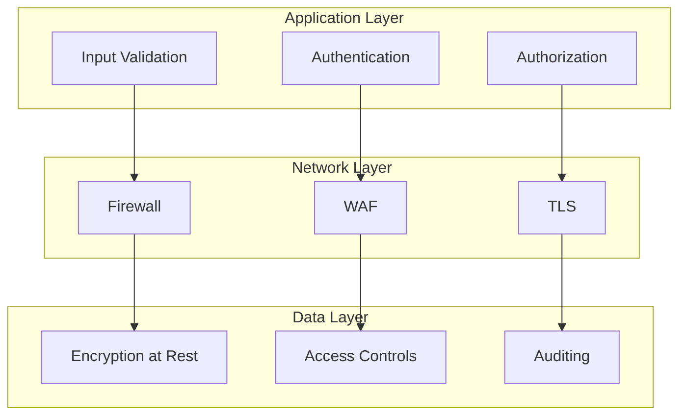
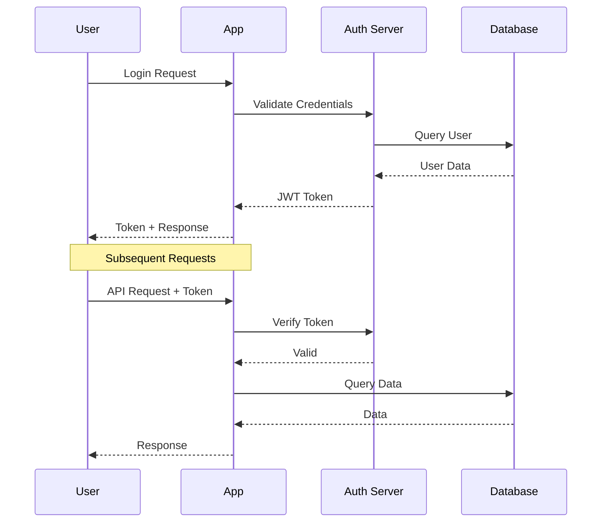
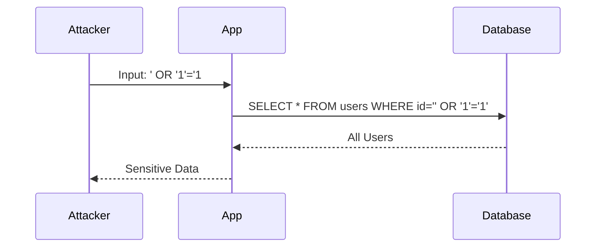

## Introduction

Application security encompasses the practices, tools, and processes used to protect software applications from threats and vulnerabilities. It involves identifying, fixing, and preventing security issues throughout the software development lifecycle.

Modern application security follows a "shift-left" approach, integrating security practices early in development rather than as an afterthought. This includes secure coding practices, automated security testing, and security architecture design.

Understanding application security is essential for developers, architects, and DevOps engineers to build and maintain secure systems.

---

## Learning Roadmap

### Week 1: Security Fundamentals
- Security principles (CIA triad)
- OWASP Top 10
- Authentication vs authorization
- Encryption basics
- Security headers

### Week 2: Web Application Security
- SQL injection
- Cross-site scripting (XSS)
- Cross-site request forgery (CSRF)
- Security misconfigurations
- Input validation

### Week 3: API and Service Security
- API security best practices
- OAuth 2.0 and OpenID Connect
- JWT tokens
- Rate limiting
- API gateways

### Week 4: Infrastructure Security
- Network security
- Container security
- Cloud security
- Secrets management
- Vulnerability scanning

### Week 5: DevSecOps
- Security in CI/CD
- SAST and DAST
- Dependency scanning
- Container scanning
- Infrastructure as code security

### Week 6: Compliance and Governance
- Security auditing
- Penetration testing basics
- Compliance frameworks (SOC 2, GDPR, HIPAA)
- Incident response
- Security culture

---

## Theory Notes

### OWASP Top 10 (2021)
1. **Broken Access Control**: Unauthorized access to resources
2. **Cryptographic Failures**: Weak or missing encryption
3. **Injection**: SQL, NoSQL, OS command injection
4. **Insecure Design**: Missing security architecture
5. **Security Misconfiguration**: Default or weak configurations
6. **Vulnerable Components**: Using known-vulnerable libraries
7. **Authentication Failures**: Weak authentication mechanisms
8. **Software and Data Integrity Failures**: Unsigned updates, insecure CI/CD
9. **Security Logging Failures**: Insufficient logging and monitoring
10. **Server-Side Request Forgery**: Forged requests from server

### CIA Triad
- **Confidentiality**: Protect data from unauthorized access
- **Integrity**: Ensure data accuracy and consistency
- **Availability**: Ensure systems are accessible when needed

### Security Principles
- **Defense in Depth**: Multiple layers of security
- **Least Privilege**: Minimum necessary permissions
- **Separation of Duties**: Divide critical tasks
- **Fail-Safe Defaults**: Deny by default
- **Economy of Mechanism**: Keep security simple
- **Complete Mediation**: Check every access
- **Open Design**: Security shouldn't depend on secrecy
- **Psychological Acceptability**: Security should be user-friendly

---

## Key Concepts

### Authentication
1. **Passwords**: Knowledge factor (what you know)
2. **MFA**: Multiple factors (password + token)
3. **Biometrics**: Inherence factor (what you are)
4. **Certificate-based**: X.509 certificates
5. **OAuth 2.0**: Delegated authorization

### Authorization
1. **RBAC**: Role-Based Access Control
2. **ABAC**: Attribute-Based Access Control
3. **ACL**: Access Control Lists
4. **OAuth Scopes**: Delegated permissions
5. **Policy Engines**: OPA, Cedar

### Encryption
1. **Symmetric**: Same key for encrypt/decrypt (AES)
2. **Asymmetric**: Public/private key pair (RSA)
3. **Hashing**: One-way transformation (SHA-256)
4. **HMAC**: Hash-based message authentication
5. **TLS**: Transport Layer Security

### Injection Attacks
1. **SQL Injection**: Malicious SQL code in queries
2. **NoSQL Injection**: Attacks on NoSQL databases
3. **Command Injection**: OS command execution
4. **LDAP Injection**: Directory service attacks
5. **XXE**: XML External Entity attacks

### Web Security
1. **XSS**: Cross-Site Scripting
2. **CSRF**: Cross-Site Request Forgery
3. **Clickjacking**: UI redressing attacks
4. **Session Fixation**: Session hijacking
5. **Security Headers**: Protection mechanisms

---

## FAQ (20+ Q&A)

### Q1: What is the difference between authentication and authorization?
**A:** Authentication verifies identity (who you are). Authorization determines permissions (what you can do). Authentication comes first, then authorization checks access.

### Q2: What is OWASP Top 10?
**A:** List of top 10 web application security risks published by Open Web Application Security Project. Updated regularly based on industry data.

### Q3: What is SQL injection?
**A:** Attack inserting malicious SQL code into queries through user input. Can read, modify, or delete data. Prevented by parameterized queries and input validation.

### Q4: What is XSS?
**A:** Cross-Site Scripting injects malicious scripts into web pages viewed by users. Types: Stored, Reflected, DOM-based. Prevented by output encoding and CSP.

### Q5: What is CSRF?
**A:** Cross-Site Request Forgery tricks users into performing actions on unintended sites. Prevented by CSRF tokens, SameSite cookies, and origin checks.

### Q6: What is the difference between encryption at rest and in transit?
**A:** At rest: Encrypting stored data (databases, files). In transit: Encrypting data moving between systems (TLS). Both are essential for data protection.

### Q7: What is OAuth 2.0?
**A:** Authorization framework allowing third-party applications limited access to user resources without exposing credentials. Uses access tokens for authentication.

### Q8: What is JWT?
**A:** JSON Web Token for securely transmitting information between parties. Contains header, payload, and signature. Used for stateless authentication.

### Q9: What is rate limiting?
**A:** Restricting number of requests a client can make. Prevents abuse, DoS attacks, and ensures fair usage. Implemented at API gateway or application level.

### Q10: What is SAST?
**A:** Static Application Security Testing analyzes source code for vulnerabilities without executing the program. Examples: SonarQube, Checkmarx, Fortify.

### Q11: What is DAST?
**A:** Dynamic Application Security Testing analyzes running application for vulnerabilities. Examples: OWASP ZAP, Burp Suite, Acunetix.

### Q12: What is dependency scanning?
**A:** Analyzing third-party libraries for known vulnerabilities. Examples: npm audit, Snyk, Dependabot. Important for supply chain security.

### Q13: What is secrets management?
**A:** Securely storing and managing sensitive data (API keys, passwords). Tools: HashiCorp Vault, AWS Secrets Manager, Azure Key Vault.

### Q14: What is security headers?
**A:** HTTP headers protecting against attacks. Examples: Content-Security-Policy, X-Frame-Options, Strict-Transport-Security.

### Q15: What is input validation?
**A:** Verifying user input meets expected format and constraints. Prevents injection attacks. Should be done server-side (client-side can be bypassed).

### Q16: What is least privilege?
**A:** Principle that users and systems should have minimum necessary permissions. Reduces attack surface and potential damage from breaches.

### Q17: What is defense in depth?
**A:** Multiple layers of security controls. If one layer fails, others provide protection. Includes network, application, and data security.

### Q18: What is penetration testing?
**A:** Authorized simulated attack to identify vulnerabilities. Types: Black box (no knowledge), White box (full knowledge), Gray box (partial knowledge).

### Q19: What is SOC 2?
**A:** Security framework for service organizations. Based on Trust Service Criteria: Security, Availability, Processing Integrity, Confidentiality, Privacy.

### Q20: What is GDPR?
**A:** European Union data protection regulation. Requires organizations to protect personal data, provide transparency, and give users control over their data.

### Q21: What is HIPAA?
**A:** US Health Insurance Portability and Accountability Act. Protects patient health information with security and privacy requirements.

### Q22: What is container security?
**A:** Protecting containers throughout lifecycle: image scanning, runtime security, network policies, and access controls.

---

## Hands-on Practice

### Lab 1: Input Validation
```javascript
// Express.js input validation
const express = require('express');
const { body, validationResult } = require('express-validator');

const app = express();

app.post('/user', [
  body('email').isEmail().normalizeEmail(),
  body('password').isLength({ min: 8 }).matches(/^(?=.*[a-z])(?=.*[A-Z])(?=.*\d)/),
  body('name').trim().escape()
], (req, res) => {
  const errors = validationResult(req);
  if (!errors.isEmpty()) {
    return res.status(400).json({ errors: errors.array() });
  }
  
  // Process valid input
  res.json({ message: 'User created' });
});
```

### Lab 2: SQL Injection Prevention
```javascript
// BAD - Vulnerable to SQL injection
const query = `SELECT * FROM users WHERE id = '${userId}'`;

// GOOD - Parameterized query
const query = 'SELECT * FROM users WHERE id = ?';
connection.query(query, [userId], (err, results) => {
  // Handle results
});

// GOOD - ORM (Sequelize)
const user = await User.findOne({ where: { id: userId } });
```

### Lab 3: Security Headers
```javascript
// Express.js security headers
const helmet = require('helmet');

app.use(helmet());

// Or manually
app.use((req, res, next) => {
  res.setHeader('Content-Security-Policy', "default-src 'self'");
  res.setHeader('X-Content-Type-Options', 'nosniff');
  res.setHeader('X-Frame-Options', 'DENY');
  res.setHeader('X-XSS-Protection', '1; mode=block');
  res.setHeader('Strict-Transport-Security', 'max-age=31536000; includeSubDomains');
  res.setHeader('Referrer-Policy', 'strict-origin-when-cross-origin');
  next();
});
```

### Lab 4: JWT Authentication
```javascript
const jwt = require('jsonwebtoken');

// Generate token
function generateToken(user) {
  return jwt.sign(
    { userId: user.id, email: user.email },
    process.env.JWT_SECRET,
    { expiresIn: '24h' }
  );
}

// Verify token middleware
function authenticateToken(req, res, next) {
  const authHeader = req.headers['authorization'];
  const token = authHeader && authHeader.split(' ')[1];
  
  if (!token) {
    return res.sendStatus(401);
  }
  
  jwt.verify(token, process.env.JWT_SECRET, (err, user) => {
    if (err) {
      return res.sendStatus(403);
    }
    req.user = user;
    next();
  });
}
```

### Lab 5: Rate Limiting
```javascript
const rateLimit = require('express-rate-limit');

// Basic rate limiter
const limiter = rateLimit({
  windowMs: 15 * 60 * 1000, // 15 minutes
  max: 100, // limit each IP to 100 requests per windowMs
  message: 'Too many requests',
  standardHeaders: true,
  legacyHeaders: false
});

app.use('/api/', limiter);

// Stricter limiter for login
const loginLimiter = rateLimit({
  windowMs: 15 * 60 * 1000,
  max: 5,
  message: 'Too many login attempts'
});

app.post('/login', loginLimiter, (req, res) => {
  // Login logic
});
```

---

## FAANG Questions

### Amazon/Facebook Level
1. **Design a secure authentication system.**
   - Password hashing (bcrypt/Argon2)
   - Multi-factor authentication
   - Session management
   - OAuth 2.0 integration
   - Rate limiting

2. **How would you prevent SQL injection in a web application?**
   - Parameterized queries
   - ORM usage
   - Input validation
   - Least privilege database accounts
   - WAF implementation

3. **Design an API security strategy.**
   - Authentication (OAuth 2.0, JWT)
   - Authorization (RBAC, scopes)
   - Rate limiting
   - Input validation
   - API gateway

### Google/Microsoft Level
4. **How would you implement secrets management?**
   - External secrets management (Vault)
   - Encryption at rest and in transit
   - Access control and auditing
   - Rotation policies
   - Avoid secrets in code

5. **Design a container security strategy.**
   - Image scanning
   - Minimal base images
   - Runtime security
   - Network policies
   - Access controls

### Netflix/Apple Level
6. **How would you implement a security-first development culture?**
   - Security training
   - Secure coding guidelines
   - Security champions program
   - Regular security reviews
   - Incident response drills

---

## Common Mistakes

1. **Storing passwords in plaintext** - Never store passwords without hashing.

2. **Using weak hashing algorithms** - MD5 and SHA-1 are insufficient; use bcrypt, Argon2.

3. **Not validating input** - Trusting user input without validation leads to injection attacks.

4. **Exposing sensitive data in logs** - Logging passwords, API keys, or personal data.

5. **Using default credentials** - Not changing default passwords for databases and services.

6. **Ignoring security updates** - Not patching known vulnerabilities in dependencies.

7. **Hard-coding secrets** - Storing API keys and passwords in source code.

8. **No HTTPS** - Transmitting data over unencrypted connections.

9. **Missing security headers** - Not implementing CSP, HSTS, and other protective headers.

10. **Insufficient logging** - Not logging security events for detection and forensics.

---

## Best Practices

### Authentication
- Use strong password hashing (bcrypt, Argon2)
- Implement multi-factor authentication
- Use secure session management
- Implement account lockout policies
- Support OAuth 2.0 for third-party auth

### Authorization
- Implement least privilege principle
- Use RBAC or ABAC
- Validate permissions server-side
- Audit access logs
- Implement proper error handling

### Data Protection
- Encrypt sensitive data at rest
- Use TLS for data in transit
- Implement proper key management
- Use data masking where appropriate
- Follow data retention policies

### Secure Development
- Input validation on all inputs
- Output encoding to prevent XSS
- Parameterized queries for databases
- Security headers implementation
- Regular security training

### DevSecOps
- Integrate security in CI/CD
- Automated security scanning
- Container security scanning
- Infrastructure as code security
- Regular penetration testing

---

## Cheat Sheet

### Security Headers
```
Content-Security-Policy: default-src 'self'
X-Content-Type-Options: nosniff
X-Frame-Options: DENY
X-XSS-Protection: 1; mode=block
Strict-Transport-Security: max-age=31536000; includeSubDomains
Referrer-Policy: strict-origin-when-cross-origin
Permissions-Policy: camera=(), microphone=()
```

### Password Hashing
```javascript
// bcrypt
const bcrypt = require('bcrypt');
const hash = await bcrypt.hash(password, 12);
const isValid = await bcrypt.compare(password, hash);

// Argon2
const argon2 = require('argon2');
const hash = await argon2.hash(password);
const isValid = await argon2.verify(hash, password);
```

### JWT Best Practices
```javascript
// Generate
const token = jwt.sign(
  { userId: user.id },
  process.env.JWT_SECRET,
  { expiresIn: '1h', algorithm: 'RS256' }
);

// Verify
jwt.verify(token, process.env.JWT_PUBLIC_KEY, { algorithms: ['RS256'] });
```

### SQL Injection Prevention
```sql
-- Parameterized query
SELECT * FROM users WHERE id = $1

-- Prepared statement
PREPARE stmt FROM 'SELECT * FROM users WHERE id = ?';
EXECUTE stmt USING @user_id;
```

---

## Flash Cards (20)

**Card 1**: What is the CIA triad?
Confidentiality, Integrity, Availability - core security principles.

**Card 2**: What is the difference between authentication and authorization?
Authentication verifies identity; authorization determines permissions.

**Card 3**: What is SQL injection?
Attack inserting malicious SQL code into queries through user input.

**Card 4**: What is XSS?
Cross-Site Scripting injects malicious scripts into web pages.

**Card 5**: What is CSRF?
Cross-Site Request Forgery tricks users into performing unintended actions.

**Card 6**: What is OWASP Top 10?
List of top 10 web application security risks.

**Card 7**: What is encryption at rest?
Encrypting stored data in databases and files.

**Card 8**: What is encryption in transit?
Encrypting data moving between systems using TLS.

**Card 9**: What is OAuth 2.0?
Authorization framework for third-party application access.

**Card 10**: What is JWT?
JSON Web Token for stateless authentication.

**Card 11**: What is rate limiting?
Restricting number of requests to prevent abuse.

**Card 12**: What is SAST?
Static Application Security Testing analyzing source code.

**Card 13**: What is DAST?
Dynamic Application Security Testing analyzing running applications.

**Card 14**: What is secrets management?
Securely storing and managing sensitive data like API keys.

**Card 15**: What is least privilege?
Principle of minimum necessary permissions.

**Card 16**: What is defense in depth?
Multiple layers of security controls.

**Card 17**: What is penetration testing?
Authorized simulated attack to identify vulnerabilities.

**Card 18**: What is input validation?
Verifying user input meets expected format and constraints.

**Card 19**: What are security headers?
HTTP headers protecting against web attacks.

**Card 20**: What is container security?
Protecting containers throughout their lifecycle.

---

## Mind Map

```
Application Security
├── OWASP Top 10
│   ├── Broken Access Control
│   ├── Cryptographic Failures
│   ├── Injection
│   └── Security Misconfiguration
├── Authentication
│   ├── Passwords
│   ├── MFA
│   ├── OAuth 2.0
│   └── JWT
├── Authorization
│   ├── RBAC
│   ├── ABAC
│   └── OAuth Scopes
├── Encryption
│   ├── Symmetric (AES)
│   ├── Asymmetric (RSA)
│   └── TLS
├── Web Security
│   ├── XSS
│   ├── CSRF
│   └── Security Headers
├── DevSecOps
│   ├── SAST
│   ├── DAST
│   └── Dependency Scanning
└── Compliance
    ├── SOC 2
    ├── GDPR
    └── HIPAA
```

---

## Mermaid Diagrams

### Security Layers


### Authentication Flow


### SQL Injection Attack


---

## Code Examples

### Secure Authentication Implementation
```javascript
const bcrypt = require('bcrypt');
const jwt = require('jsonwebtoken');
const rateLimit = require('express-rate-limit');

// Password hashing
async function hashPassword(password) {
  const saltRounds = 12;
  return await bcrypt.hash(password, saltRounds);
}

async function verifyPassword(password, hash) {
  return await bcrypt.compare(password, hash);
}

// JWT generation
function generateTokens(user) {
  const accessToken = jwt.sign(
    { userId: user.id, email: user.email },
    process.env.JWT_SECRET,
    { expiresIn: '15m' }
  );
  
  const refreshToken = jwt.sign(
    { userId: user.id },
    process.env.JWT_REFRESH_SECRET,
    { expiresIn: '7d' }
  );
  
  return { accessToken, refreshToken };
}

// Authentication middleware
function authenticate(req, res, next) {
  const authHeader = req.headers.authorization;
  const token = authHeader?.split(' ')[1];
  
  if (!token) {
    return res.status(401).json({ error: 'Authentication required' });
  }
  
  try {
    const decoded = jwt.verify(token, process.env.JWT_SECRET);
    req.user = decoded;
    next();
  } catch (error) {
    return res.status(403).json({ error: 'Invalid token' });
  }
}

// Authorization middleware
function authorize(...roles) {
  return (req, res, next) => {
    if (!roles.includes(req.user.role)) {
      return res.status(403).json({ error: 'Insufficient permissions' });
    }
    next();
  };
}

// Rate limiting
const loginLimiter = rateLimit({
  windowMs: 15 * 60 * 1000,
  max: 5,
  message: { error: 'Too many login attempts' }
});
```

### Input Validation with Joi
```javascript
const Joi = require('joi');

// Validation schemas
const userSchema = Joi.object({
  email: Joi.string().email().required(),
  password: Joi.string().min(8).pattern(/^(?=.*[a-z])(?=.*[A-Z])(?=.*\d)/).required(),
  name: Joi.string().min(2).max(50).required(),
  age: Joi.number().integer().min(18).max(120)
});

// Validation middleware
function validate(schema) {
  return (req, res, next) => {
    const { error } = schema.validate(req.body);
    if (error) {
      return res.status(400).json({ 
        error: error.details.map(d => d.message) 
      });
    }
    next();
  };
}

// Usage
app.post('/users', validate(userSchema), (req, res) => {
  // Process valid input
});
```

---

## Projects

### Project 1: Secure Authentication System
Implement complete authentication:
- Password hashing with bcrypt
- JWT token management
- Multi-factor authentication
- Rate limiting
- Session management

### Project 2: Security Audit Tool
Build security scanning tool:
- Dependency vulnerability scanning
- Security header checking
- SQL injection detection
- XSS vulnerability detection
- Report generation

### Project 3: API Security Gateway
Implement API security:
- Authentication and authorization
- Rate limiting
- Input validation
- Request/response logging
- Threat detection

---

## Resources

### Official Documentation
- [OWASP](https://owasp.org/)
- [OWASP Top 10](https://owasp.org/www-project-top-ten/)
- [NIST Cybersecurity Framework](https://www.nist.gov/cyberframework)

### Learning Platforms
- OWASP WebGoat (practice)
- PortSwigger Web Security Academy
- Hack The Box

### Tools
- **SAST**: SonarQube, Checkmarx, Fortify
- **DAST**: OWASP ZAP, Burp Suite
- **SCA**: Snyk, Dependabot, npm audit

---

## Checklist

- [ ] Understand OWASP Top 10
- [ ] Implement secure authentication
- [ ] Use parameterized queries
- [ ] Implement input validation
- [ ] Add security headers
- [ ] Use HTTPS everywhere
- [ ] Implement rate limiting
- [ ] Scan for vulnerabilities
- [ ] Manage secrets securely
- [ ] Conduct security audits

---

## Mock Interviews

### Scenario 1: Security Engineer
**Interviewer**: "How would you secure a web application against common attacks?"

**Key Points to Cover**:
- Input validation
- Output encoding
- Parameterized queries
- Security headers
- Authentication and authorization
- Rate limiting

### Scenario 2: Backend Developer
**Interviewer**: "Design a secure API authentication system."

**Key Points to Cover**:
- OAuth 2.0 implementation
- JWT token management
- Rate limiting
- Token refresh strategy
- Security best practices

### Scenario 3: DevOps Engineer
**Interviewer**: "How would you implement security in a CI/CD pipeline?"

**Key Points to Cover**:
- SAST and DAST integration
- Dependency scanning
- Container scanning
- Secret management
- Security gates

---

## Difficulty Rating

| Topic | Difficulty | Time to Learn |
|-------|------------|---------------|
| Security Basics | ⭐ | 1 week |
| OWASP Top 10 | ⭐⭐ | 1-2 weeks |
| Authentication | ⭐⭐⭐ | 2-3 weeks |
| Encryption | ⭐⭐⭐ | 2-3 weeks |
| Web Security | ⭐⭐⭐ | 2-3 weeks |
| API Security | ⭐⭐⭐ | 2-3 weeks |
| DevSecOps | ⭐⭐⭐⭐ | 3-4 weeks |
| Penetration Testing | ⭐⭐⭐⭐ | 4-6 weeks |

---

## Summary

Application security is essential for protecting systems and data. Key areas for interviews include:

1. **OWASP Top 10**: Understanding common vulnerabilities
2. **Authentication/Authorization**: Secure identity and access management
3. **Encryption**: Data protection at rest and in transit
4. **Web Security**: XSS, CSRF, injection prevention
5. **API Security**: OAuth, JWT, rate limiting
6. **DevSecOps**: Security in CI/CD pipeline
7. **Compliance**: SOC 2, GDPR, HIPAA requirements
8. **Best Practices**: Defense in depth, least privilege

Mastering security prepares you for roles focused on building and maintaining secure applications.

