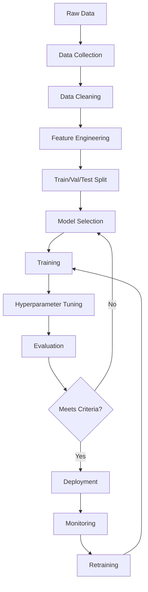
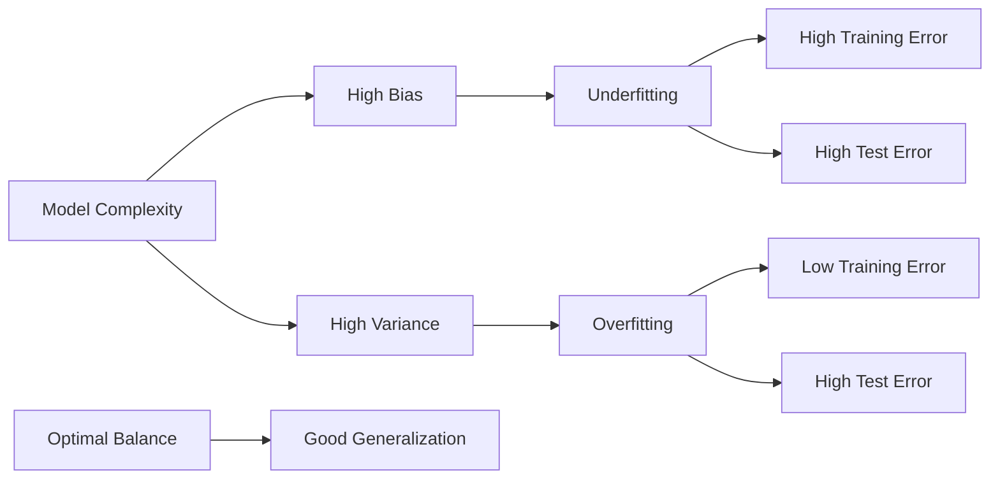
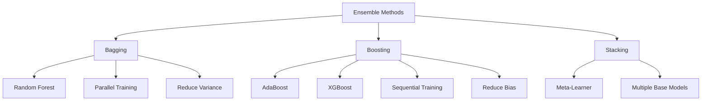
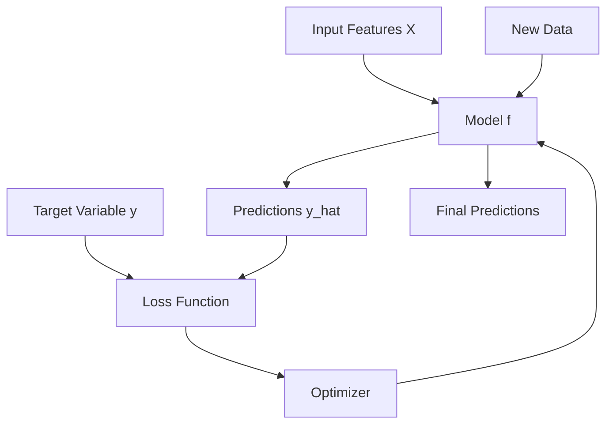

## Table of Contents
- [Introduction](#introduction)
- [Learning Roadmap](#learning-roadmap)
- [Theory Notes](#theory-notes)
- [Key Concepts](#key-concepts)
- [FAQ (20+ Q&A)](#faq-20-qa)
- [Hands-on Practice](#hands-on-practice)
- [FAANG Questions](#faang-questions)
- [Common Mistakes](#common-mistakes)
- [Best Practices](#best-practices)
- [Cheat Sheet](#cheat-sheet)
- [Flash Cards](#flash-cards-20)
- [Mind Map](#mind-map)
- [Mermaid Diagrams](#mermaid-diagrams)
- [Code Examples](#code-examples)
- [Projects](#projects)
- [Resources](#resources)
- [Checklist](#checklist)
- [Revision Plans](#revision-plans)
- [Mock Interviews](#mock-interviews)
- [Difficulty Rating](#difficulty-rating)
- [Summary](#summary)

---

## Introduction

Machine Learning (ML) is a subset of artificial intelligence that enables systems to learn and improve from data without being explicitly programmed. It focuses on developing algorithms that can access data, learn from it, and make predictions or decisions. ML is at the heart of modern data-driven applications, powering recommendation systems, fraud detection, autonomous vehicles, natural language processing, and countless other innovations.

This guide covers the essential machine learning concepts, algorithms, and techniques that are frequently asked in technical interviews at top tech companies. Whether you are preparing for a Data Scientist, ML Engineer, or AI Researcher role, mastering these topics is critical.

Machine learning can be broadly categorized into three types:
- **Supervised Learning**: The algorithm learns from labeled training data (input-output pairs) to predict outcomes for unseen data.
- **Unsupervised Learning**: The algorithm discovers hidden patterns or structures in unlabeled data.
- **Reinforcement Learning**: The algorithm learns by interacting with an environment and receiving rewards or penalties for its actions.

The field draws heavily from statistics, linear algebra, calculus, and computer science. A strong mathematical foundation combined with practical coding skills is essential for success in ML interviews.

---

## Learning Roadmap

### Phase 1: Foundations (Week 1-2)
- Linear Algebra (vectors, matrices, eigenvalues)
- Calculus (derivatives, gradients, chain rule)
- Probability and Statistics
- Python programming (NumPy, Pandas, Matplotlib)
- Exploratory Data Analysis (EDA)

### Phase 2: Core Algorithms (Week 3-5)
- Linear Regression and its variants
- Logistic Regression
- Support Vector Machines (SVM)
- Decision Trees
- Random Forests
- Gradient Boosting (XGBoost, LightGBM)
- K-Nearest Neighbors (KNN)

### Phase 3: Unsupervised Learning (Week 6-7)
- K-Means Clustering
- Hierarchical Clustering
- Principal Component Analysis (PCA)
- DBSCAN
- Association Rules

### Phase 4: Model Evaluation and Optimization (Week 8-9)
- Cross-validation techniques
- Bias-variance tradeoff
- Regularization (L1, L2)
- Hyperparameter tuning (Grid Search, Random Search, Bayesian)
- ROC curves, AUC, Precision, Recall, F1-score
- Confusion Matrix

### Phase 5: Feature Engineering and Advanced Topics (Week 10-12)
- Feature selection and extraction
- Handling missing data and outliers
- Encoding categorical variables
- Feature scaling and normalization
- Ensemble methods
- Model interpretability (SHAP, LIME)
- Time series basics

---

## Theory Notes

### Linear Regression
Linear regression models the relationship between a dependent variable and one or more independent variables by fitting a linear equation to observed data. The model is:

**y = w0 + w1*x1 + w2*x2 + ... + wn*xn + epsilon**

Where:
- y is the dependent variable (target)
- x1, x2, ..., xn are independent variables (features)
- w0 is the intercept (bias)
- w1, ..., wn are coefficients (weights)
- epsilon is the error term

The parameters are learned by minimizing the **Ordinary Least Squares (OLS)** cost function, which is the sum of squared residuals:

**J(w) = (1/2n) * sum((yi - yi_hat)^2)**

Key assumptions of linear regression:
1. **Linearity**: The relationship between X and Y is linear
2. **Independence**: Observations are independent
3. **Homoscedasticity**: Constant variance of residuals
4. **Normality**: Residuals are normally distributed
5. **No multicollinearity**: Features are not highly correlated with each other

### Logistic Regression
Despite its name, logistic regression is used for binary classification. It models the probability that an instance belongs to a particular class using the sigmoid function:

**P(y=1|x) = 1 / (1 + e^(-(w0 + w1*x1 + ... + wn*xn)))**

The sigmoid function maps any real number to a value between 0 and 1, which can be interpreted as a probability. The model is trained by maximizing the log-likelihood function using gradient descent.

**Decision boundary** is the line (or hyperplane) that separates the two classes. Points on one side are classified as class 0, and points on the other side as class 1.

### Support Vector Machines (SVM)
SVM finds the optimal hyperplane that maximizes the margin between two classes. The margin is the distance between the hyperplane and the nearest data points from each class (called support vectors).

**Key concepts:**
- **Hard margin**: Assumes data is perfectly separable
- **Soft margin**: Allows some misclassifications (controlled by parameter C)
- **Kernel trick**: Maps data to higher dimensions where it becomes linearly separable
  - Linear kernel: K(x, y) = x . y
  - Polynomial kernel: K(x, y) = (x . y + c)^d
  - RBF (Gaussian) kernel: K(x, y) = exp(-gamma * ||x - y||^2)

### Decision Trees
Decision trees recursively split the data based on feature values to create a tree-like model of decisions. Each internal node represents a test on a feature, each branch represents the outcome, and each leaf node represents a class label or numerical value.

**Splitting criteria:**
- **Classification**: Gini impurity, Information Gain (Entropy)
- **Regression**: Mean Squared Error, Mean Absolute Error

**Gini Impurity**: Gini = 1 - sum(pi^2) for all classes
**Entropy**: H = -sum(pi * log2(pi)) for all classes
**Information Gain**: IG = H(parent) - weighted_average(H(children))

### Random Forest
Random Forest is an ensemble method that constructs multiple decision trees during training and outputs the mode of the classes (classification) or mean prediction (regression) of individual trees.

**Key features:**
- Bagging (Bootstrap Aggregating) for row sampling
- Random feature selection at each split
- Reduces overfitting compared to individual decision trees
- Provides feature importance estimates

### Gradient Boosting
Gradient boosting builds trees sequentially, where each new tree corrects the errors of the previous ensemble. It fits the new tree to the negative gradient of the loss function.

**XGBoost**: Regularized gradient boosting with parallel tree construction, weighted quantile sketch for approximate splitting, and handling of sparse data.

**LightGBM**: Uses leaf-wise tree growth (instead of level-wise), gradient-based one-side sampling (GOSS), and exclusive feature bundling (EFB) for faster training.

**CatBoost**: Handles categorical features natively, uses ordered boosting to reduce prediction shift, and employs symmetric tree structures.

### K-Means Clustering
K-Means partitions n observations into k clusters where each observation belongs to the cluster with the nearest centroid.

**Algorithm:**
1. Initialize k centroids randomly
2. Assign each point to the nearest centroid
3. Recalculate centroids as the mean of assigned points
4. Repeat steps 2-3 until convergence

**Evaluation**: Silhouette Score, Elbow Method, Inertia (within-cluster sum of squares)

### Principal Component Analysis (PCA)
PCA is a dimensionality reduction technique that transforms data into a new coordinate system where the greatest variance lies along the first principal component, the second greatest variance along the second, and so on.

**Steps:**
1. Standardize the data
2. Compute the covariance matrix
3. Calculate eigenvalues and eigenvectors
4. Sort eigenvectors by decreasing eigenvalues
5. Select top k eigenvectors
6. Transform data onto the new k-dimensional subspace

---

## Key Concepts

### Bias-Variance Tradeoff
- **Bias**: Error from overly simplistic assumptions (underfitting)
- **Variance**: Error from sensitivity to training data fluctuations (overfitting)
- **Total Error** = Bias^2 + Variance + Irreducible Error

### Overfitting vs Underfitting
| Aspect | Underfitting | Overfitting |
|--------|-------------|-------------|
| Training accuracy | Low | High |
| Validation accuracy | Low | Low |
| Model complexity | Too simple | Too complex |
| Solution | Add features, reduce regularization | More data, regularization, pruning |

### Regularization
- **L1 (Lasso)**: Adds absolute value of coefficients as penalty. Encourages sparsity (feature selection).
- **L2 (Ridge)**: Adds squared magnitude of coefficients. Prevents any single feature from dominating.
- **Elastic Net**: Combines L1 and L2 penalties.

### Cross-Validation
- **k-Fold**: Split data into k folds, train on k-1, test on 1. Repeat k times.
- **Stratified k-Fold**: Preserves class distribution in each fold.
- **Leave-One-Out (LOO)**: k = n (number of samples). Computationally expensive.
- **Time Series Split**: Respects temporal ordering.

### Feature Engineering
- **Numerical**: Scaling (MinMax, Standard), Log transform, Polynomial features
- **Categorical**: One-hot encoding, Label encoding, Target encoding, Frequency encoding
- **Text**: TF-IDF, Bag of Words, Word embeddings
- **Temporal**: Day of week, Month, Season, Time since event

### Ensemble Methods
- **Bagging**: Parallel training on bootstrap samples (Random Forest)
- **Boosting**: Sequential training focusing on errors (AdaBoost, Gradient Boosting, XGBoost)
- **Stacking**: Combining predictions from multiple models using a meta-learner

---

## FAQ (20+ Q&A)

### Q1: What is the difference between supervised and unsupervised learning?
**A:** Supervised learning uses labeled data (input-output pairs) to learn a mapping function. Examples include classification and regression. Unsupervised learning works with unlabeled data to discover hidden patterns, such as clustering and dimensionality reduction.

### Q2: What is the curse of dimensionality?
**A:** As the number of features increases, the volume of the feature space grows exponentially. This causes data to become sparse, making it harder for algorithms to find patterns. Distance metrics become less meaningful, and the amount of data needed to generalize grows exponentially.

### Q3: How do you handle missing data?
**A:** Common approaches include:
- **Deletion**: Remove rows or columns with too many missing values
- **Imputation**: Mean/median/mode imputation, KNN imputation, iterative imputation
- **Indicator variable**: Create a binary flag for missingness
- **Algorithm-specific**: Some algorithms (XGBoost, LightGBM) handle missing values natively

### Q4: What is the difference between bagging and boosting?
**A:** Bagging trains models in parallel on different bootstrap samples and averages their predictions. It reduces variance. Boosting trains models sequentially, with each model correcting the previous one's errors. It reduces both bias and variance.

### Q5: When would you use L1 vs L2 regularization?
**A:** Use L1 (Lasso) when you want feature selection and a sparse model. Use L2 (Ridge) when you want to prevent any single feature from having too much influence but don't want to eliminate features. Use Elastic Net when you want both benefits.

### Q6: What is multicollinearity and why is it a problem?
**A:** Multicollinearity occurs when two or more features are highly correlated. It makes coefficient estimates unstable and difficult to interpret. Solutions include removing one of the correlated features, PCA, or using regularization.

### Q7: How do you evaluate a classification model?
**A:** Key metrics include:
- **Accuracy**: Correct predictions / Total predictions
- **Precision**: TP / (TP + FP) - How many predicted positives are actually positive
- **Recall**: TP / (TP + FN) - How many actual positives are correctly identified
- **F1-score**: Harmonic mean of precision and recall
- **AUC-ROC**: Area under the Receiver Operating Characteristic curve
- **Confusion Matrix**: Detailed breakdown of TP, TN, FP, FN

### Q8: What is the difference between type I and type II errors?
**A:** Type I error (False Positive) is rejecting a true null hypothesis. Type II error (False Negative) is failing to reject a false null hypothesis. In ML, Type I means predicting positive when it's actually negative; Type II means predicting negative when it's actually positive.

### Q9: What are the assumptions of linear regression?
**A:** Linearity, independence of errors, homoscedasticity (constant variance), normality of residuals, and no multicollinearity. Violating these assumptions can lead to biased or inefficient estimates.

### Q10: How does SVM handle non-linear data?
**A:** SVM uses the kernel trick to map data into a higher-dimensional space where it becomes linearly separable. Common kernels include polynomial, RBF (Gaussian), and sigmoid. The kernel computes dot products in the higher-dimensional space without explicitly performing the transformation.

### Q11: What is the elbow method in K-Means?
**A:** The elbow method plots the within-cluster sum of squares (inertia) against the number of clusters (k). The "elbow" point where the rate of decrease sharply changes indicates the optimal number of clusters.

### Q12: What is the difference between PCA and t-SNE?
**A:** PCA is a linear dimensionality reduction technique that preserves global structure. t-SNE is a non-linear technique that excels at preserving local structure for visualization. PCA is deterministic and scalable; t-SNE is stochastic and computationally expensive.

### Q13: How do you handle imbalanced datasets?
**A:** Techniques include:
- **Oversampling**: SMOTE, ADASYN (create synthetic minority samples)
- **Undersampling**: Random undersampling, Tomek links, NearMiss
- **Class weights**: Assign higher weights to minority class
- **Ensemble methods**: Balanced Random Forest, EasyEnsemble
- **Threshold adjustment**: Optimize decision threshold based on business needs

### Q14: What is XGBoost and why is it popular?
**A:** XGBoost (eXtreme Gradient Boosting) is an optimized gradient boosting library. It's popular because it's fast, handles missing values, includes built-in regularization, supports parallel processing, and consistently performs well on structured/tabular data competitions.

### Q15: What is feature importance and how do you calculate it?
**A:** Feature importance measures the contribution of each feature to the model's predictions. Methods include:
- **Mean Decrease in Impurity**: Sum of decreases in Gini/entropy across all trees
- **Permutation Importance**: Decrease in performance when a feature is randomly shuffled
- **SHAP values**: Shapley Additive explanations based on game theory

### Q16: What is the difference between generative and discriminative models?
**A:** Discriminative models learn the decision boundary between classes (e.g., logistic regression, SVM). Generative models learn the distribution of each class and use Bayes' theorem for classification (e.g., Naive Bayes, Gaussian Mixture Models).

### Q17: When would you choose a random forest over XGBoost?
**A:** Random forest is preferred when you need a quick baseline, want to reduce overfitting risk, need parallel training, or want simpler hyperparameter tuning. XGBoost is preferred when you need the best possible predictive performance and can invest time in hyperparameter tuning.

### Q18: What is cross-validation and why do we use it?
**A:** Cross-validation is a technique to evaluate model performance by splitting data into multiple train/test sets. It provides a more robust estimate of model performance than a single train/test split, helps detect overfitting, and makes better use of limited data.

### Q19: How do you select features for a model?
**A:** Feature selection methods include:
- **Filter methods**: Correlation, chi-square, mutual information
- **Wrapper methods**: Forward/backward selection, recursive feature elimination
- **Embedded methods**: L1 regularization, tree-based feature importance
- **Domain knowledge**: Understanding which features are likely relevant

### Q20: What is the difference between parametric and non-parametric models?
**A:** Parametric models assume a fixed number of parameters regardless of data size (e.g., linear regression, logistic regression). Non-parametric models have a flexible number of parameters that grow with data (e.g., KNN, decision trees, SVM with RBF kernel).

### Q21: How do you handle outliers in a dataset?
**A:** Detection methods include Z-score, IQR method, Isolation Forest, and DBSCAN. Handling options: remove if erroneous, cap/floor (winsorize), transform (log), use robust algorithms, or keep if they carry meaningful information.

### Q22: What is the ROC curve?
**A:** ROC (Receiver Operating Characteristic) curve plots True Positive Rate vs False Positive Rate at various classification thresholds. AUC (Area Under Curve) summarizes performance: 0.5 is random, 1.0 is perfect. It's threshold-independent and handles class imbalance better than accuracy.

---

## Hands-on Practice

### Practice Exercise 1: Linear Regression from Scratch
```python
import numpy as np

class LinearRegression:
    def __init__(self, learning_rate=0.01, n_iterations=1000):
        self.lr = learning_rate
        self.n_iter = n_iterations
        self.weights = None
        self.bias = None

    def fit(self, X, y):
        n_samples, n_features = X.shape
        self.weights = np.zeros(n_features)
        self.bias = 0

        for _ in range(self.n_iter):
            y_predicted = np.dot(X, self.weights) + self.bias
            dw = (1/n_samples) * np.dot(X.T, (y_predicted - y))
            db = (1/n_samples) * np.sum(y_predicted - y)
            self.weights -= self.lr * dw
            self.bias -= self.lr * db

    def predict(self, X):
        return np.dot(X, self.weights) + self.bias
```

### Practice Exercise 2: Logistic Regression from Scratch
```python
import numpy as np

class LogisticRegression:
    def __init__(self, learning_rate=0.01, n_iterations=1000):
        self.lr = learning_rate
        self.n_iter = n_iterations
        self.weights = None
        self.bias = None

    def sigmoid(self, z):
        return 1 / (1 + np.exp(-z))

    def fit(self, X, y):
        n_samples, n_features = X.shape
        self.weights = np.zeros(n_features)
        self.bias = 0

        for _ in range(self.n_iter):
            linear = np.dot(X, self.weights) + self.bias
            y_predicted = self.sigmoid(linear)
            dw = (1/n_samples) * np.dot(X.T, (y_predicted - y))
            db = (1/n_samples) * np.sum(y_predicted - y)
            self.weights -= self.lr * dw
            self.bias -= self.lr * db

    def predict(self, X, threshold=0.5):
        linear = np.dot(X, self.weights) + self.bias
        y_predicted = self.sigmoid(linear)
        return [1 if p >= threshold else 0 for p in y_predicted]
```

### Practice Exercise 3: K-Means from Scratch
```python
import numpy as np

class KMeans:
    def __init__(self, k=3, n_iterations=100):
        self.k = k
        self.n_iter = n_iterations
        self.centroids = None

    def fit(self, X):
        n_samples = X.shape[0]
        random_indices = np.random.choice(n_samples, self.k, replace=False)
        self.centroids = X[random_indices]

        for _ in range(self.n_iter):
            labels = self._assign_clusters(X)
            new_centroids = np.array([
                X[labels == i].mean(axis=0) if np.sum(labels == i) > 0
                else self.centroids[i] for i in range(self.k)
            ])
            if np.all(self.centroids == new_centroids):
                break
            self.centroids = new_centroids

    def _assign_clusters(self, X):
        distances = np.array([
            np.linalg.norm(X - c, axis=1) for c in self.centroids
        ])
        return np.argmin(distances, axis=0)
```

### Practice Exercise 4: Decision Tree Classifier
```python
import numpy as np
from collections import Counter

class Node:
    def __init__(self, feature=None, threshold=None, left=None,
                 right=None, value=None):
        self.feature = feature
        self.threshold = threshold
        self.left = left
        self.right = right
        self.value = value

class DecisionTree:
    def __init__(self, max_depth=10, min_samples_split=2):
        self.max_depth = max_depth
        self.min_samples_split = min_samples_split
        self.root = None

    def fit(self, X, y):
        self.root = self._grow_tree(X, y)

    def _gini(self, y):
        counts = np.bincount(y)
        probabilities = counts / len(y)
        return 1 - np.sum(probabilities ** 2)

    def _best_split(self, X, y):
        best_gini = float('inf')
        best_feature, best_threshold = None, None
        n_features = X.shape[1]

        for feature in range(n_features):
            thresholds = np.unique(X[:, feature])
            for threshold in thresholds:
                left_mask = X[:, feature] <= threshold
                right_mask = ~left_mask
                if left_mask.sum() == 0 or right_mask.sum() == 0:
                    continue
                gini_left = self._gini(y[left_mask])
                gini_right = self._gini(y[right_mask])
                weighted_gini = (
                    left_mask.sum() * gini_left +
                    right_mask.sum() * gini_right
                ) / len(y)
                if weighted_gini < best_gini:
                    best_gini = weighted_gini
                    best_feature = feature
                    best_threshold = threshold
        return best_feature, best_threshold

    def _grow_tree(self, X, y, depth=0):
        n_samples = len(y)
        n_classes = len(np.unique(y))

        if (depth >= self.max_depth or n_classes == 1 or
                n_samples < self.min_samples_split):
            leaf_value = Counter(y).most_common(1)[0][0]
            return Node(value=leaf_value)

        feature, threshold = self._best_split(X, y)
        if feature is None:
            leaf_value = Counter(y).most_common(1)[0][0]
            return Node(value=leaf_value)

        left_mask = X[:, feature] <= threshold
        left = self._grow_tree(X[left_mask], y[left_mask], depth + 1)
        right = self._grow_tree(X[~left_mask], y[~left_mask], depth + 1)
        return Node(feature, threshold, left, right)

    def predict(self, X):
        return np.array([self._traverse_tree(x, self.root) for x in X])

    def _traverse_tree(self, x, node):
        if node.value is not None:
            return node.value
        if x[node.feature] <= node.threshold:
            return self._traverse_tree(x, node.left)
        return self._traverse_tree(x, node.right)
```

---

## FAANG Questions

### Google
1. Design an ML pipeline for predicting user churn with 100M+ users. What features would you engineer? How would you handle class imbalance?
2. You built a model that achieves 99% accuracy on your test set, but the product team says it's performing poorly in production. What could be wrong?
3. Explain the bias-variance tradeoff. How would you diagnose whether your model is suffering from high bias or high variance?

### Meta (Facebook)
4. How would you design a recommendation system for Facebook News Feed? What ML algorithms would you use and why?
5. You need to predict whether a user will click on an ad given user features, ad features, and context features. Walk through your approach.
6. A/B test shows a new ML model has higher offline metrics but lower online engagement. Investigate possible causes.

### Amazon
7. Design a fraud detection system for Amazon transactions. How do you handle the extreme class imbalance (0.1% fraud)?
8. You have a product recommendation system. How would you evaluate it offline vs online? What metrics matter?
9. A model that predicts delivery times is showing good metrics but customers complain. What went wrong?

### Apple
10. How would you build a speech recognition system? What ML techniques would you employ?
11. Design a privacy-preserving ML system that can train on user data without accessing raw data.
12. Explain how you would build an on-device ML model for real-time object detection on an iPhone.

### Netflix
13. Design the Netflix recommendation engine. How do you balance exploration vs exploitation?
14. How would you build a model to predict which shows a user will watch next? What data would you use?
15. You notice that your recommendation model is creating filter bubbles. How would you address this?

### Microsoft
16. Design an ML system for Azure that can handle both batch and real-time predictions.
17. How would you build a model that explains its predictions to non-technical stakeholders?
18. A deployed model's performance degrades over time. What monitoring and retraining strategy would you implement?

---

## Common Mistakes

1. **Not splitting data before feature engineering** - Always split first to prevent data leakage
2. **Fitting scaler on entire dataset** - Fit on training set only, then transform both train and test
3. **Ignoring class imbalance** - Using accuracy as the sole metric for imbalanced problems
4. **Overfitting to validation set** - Repeatedly tuning hyperparameters on the same validation set
5. **Not handling missing values properly** - Imputing before splitting causes data leakage
6. **Using linear models without checking assumptions** - Always validate model assumptions
7. **Ignoring feature scaling** - SVM, KNN, and gradient-based methods require scaled features
8. **Not using cross-validation** - Single train/test split gives unreliable estimates
9. **Over-engineering features** - Start simple, add complexity only when needed
10. **Not setting a random seed** - Results become non-reproducible
11. **Ignoring domain knowledge** - Pure data-driven approaches miss important context
12. **Premature optimization** - Start with a baseline before trying complex models

---

## Best Practices

1. **Always establish a baseline** - Simple models (majority class, linear regression) as benchmarks
2. **Use reproducible experiments** - Fix random seeds, version data and code
3. **Track experiments** - Log parameters, metrics, and artifacts (MLflow, W&B)
4. **Start simple** - Linear/logistic regression before deep learning
5. **Understand your data** - EDA before modeling
6. **Validate assumptions** - Check model assumptions on your specific data
7. **Use stratified splits** - Preserve class distribution in train/val/test
8. **Apply cross-validation** - More robust performance estimates
9. **Monitor for data drift** - Data distributions change over time
10. **Document everything** - Model cards, data dictionaries, experiment logs
11. **Consider fairness** - Check for bias across protected groups
12. **Think about deployment** - Model size, latency, and scalability constraints

---

## Cheat Sheet

### Algorithm Selection Guide
| Problem Type | Data Size | Recommended Algorithm |
|-------------|-----------|----------------------|
| Classification (small) | < 10K | Logistic Regression, SVM |
| Classification (medium) | 10K-1M | Random Forest, XGBoost |
| Classification (large) | > 1M | LightGBM, Neural Networks |
| Regression (small) | < 10K | Linear Regression, Ridge |
| Regression (medium) | 10K-1M | Gradient Boosting, Random Forest |
| Regression (large) | > 1M | LightGBM, Neural Networks |
| Clustering (small) | < 10K | K-Means, Hierarchical |
| Clustering (large) | > 10K | K-Means, DBSCAN |
| Dimensionality Reduction | Any | PCA, t-SNE (visualization) |

### Key Formulas
- **MSE**: (1/n) * sum(yi - yi_hat)^2
- **RMSE**: sqrt(MSE)
- **MAE**: (1/n) * sum|yi - yi_hat|
- **R-squared**: 1 - (SS_res / SS_tot)
- **Precision**: TP / (TP + FP)
- **Recall**: TP / (TP + FN)
- **F1**: 2 * (Precision * Recall) / (Precision + Recall)
- **AUC**: Area under ROC curve
- **Gini**: 1 - sum(pi^2)
- **Entropy**: -sum(pi * log2(pi))
- **Silhouette Score**: (b - a) / max(a, b)

### Python Libraries Quick Reference
- **NumPy**: Numerical computing
- **Pandas**: Data manipulation
- **Matplotlib/Seaborn**: Visualization
- **Scikit-learn**: ML algorithms
- **XGBoost/LightGBM/CatBoost**: Gradient boosting
- **SciPy**: Scientific computing
- **Statsmodels**: Statistical models

---

## Flash Cards (20)

### Card 1
**Q:** What is overfitting?
**A:** When a model learns noise in training data instead of the underlying pattern, performing well on training data but poorly on unseen data.

### Card 2
**Q:** What is the bias-variance tradeoff?
**A:** Increasing model complexity reduces bias but increases variance. The goal is to find the optimal complexity that minimizes total error.

### Card 3
**Q:** What is L1 regularization?
**A:** Adds the sum of absolute values of coefficients to the loss function. It promotes sparsity by driving some coefficients to exactly zero (feature selection).

### Card 4
**Q:** What is the difference between bagging and boosting?
**A:** Bagging trains models in parallel on bootstrap samples (reduces variance). Boosting trains models sequentially, each correcting previous errors (reduces bias and variance).

### Card 5
**Q:** What is a confusion matrix?
**A:** A table showing TP, TN, FP, FN. Used to calculate precision, recall, accuracy, and F1-score for classification evaluation.

### Card 6
**Q:** What is the curse of dimensionality?
**A:** As features increase, data becomes sparse, distances lose meaning, and more data is needed for generalization. Can be mitigated by PCA or feature selection.

### Card 7
**Q:** What is cross-validation?
**A:** A technique to evaluate model performance by partitioning data into k subsets, training on k-1 and testing on 1, rotating k times.

### Card 8
**Q:** What is the kernel trick in SVM?
**A:** Implicitly maps data to higher dimensions where it's linearly separable, without explicitly computing the transformation. Saves computational cost.

### Card 9
**Q:** What is SMOTE?
**A:** Synthetic Minority Over-sampling Technique. Creates synthetic samples of the minority class by interpolating between existing minority samples.

### Card 10
**Q:** What is PCA?
**A:** Principal Component Analysis. A dimensionality reduction technique that finds orthogonal axes of maximum variance to project data onto fewer dimensions.

### Card 11
**Q:** What is the elbow method?
**A:** A technique for determining optimal k in K-Means by plotting inertia vs k and identifying the "elbow" where improvement slows.

### Card 12
**Q:** What is Gini impurity?
**A:** A measure of how often a randomly chosen element would be incorrectly classified. Gini = 1 - sum(pi^2). Used in decision tree splits.

### Card 13
**Q:** What is XGBoost?
**A:** An optimized gradient boosting library that uses regularized objectives, parallel computation, and handles missing values. State-of-the-art for tabular data.

### Card 14
**Q:** What is feature importance?
**A:** A score indicating how much each feature contributes to the model's predictions. Methods: mean decrease in impurity, permutation importance, SHAP values.

### Card 15
**Q:** What is data leakage?
**A:** When information from outside the training dataset is used to create the model. Causes inflated performance estimates. Common causes: improper splitting, feature engineering before split.

### Card 16
**Q:** What is the precision-recall tradeoff?
**A:** Increasing the classification threshold increases precision but decreases recall. Decreasing threshold increases recall but decreases precision. F1-score balances both.

### Card 17
**Q:** What is a Random Forest?
**A:** An ensemble of decision trees trained on bootstrap samples with random feature subsets. Reduces overfitting through bagging and feature randomness.

### Card 18
**Q:** What is gradient descent?
**A:** An optimization algorithm that iteratively adjusts parameters in the direction of steepest descent of the loss function. Variants: batch, stochastic, mini-batch.

### Card 19
**Q:** What is the AUC-ROC curve?
**A:** ROC plots TPR vs FPR at various thresholds. AUC summarizes it into a single number. AUC=0.5 is random; AUC=1.0 is perfect classification.

### Card 20
**Q:** What is stratified sampling?
**A:** A sampling technique that preserves the class distribution in each subset. Used in cross-validation to maintain representation of minority classes.

---

## Mind Map

```
Machine Learning
├── Supervised Learning
│   ├── Regression
│   │   ├── Linear Regression
│   │   ├── Ridge / Lasso / Elastic Net
│   │   ├── Polynomial Regression
│   │   └── Support Vector Regression
│   ├── Classification
│   │   ├── Logistic Regression
│   │   ├── SVM
│   │   ├── Decision Trees
│   │   ├── Random Forest
│   │   ├── Gradient Boosting
│   │   ├── Naive Bayes
│   │   └── KNN
│   └── Ensemble Methods
│       ├── Bagging
│       ├── Boosting
│       └── Stacking
├── Unsupervised Learning
│   ├── Clustering
│   │   ├── K-Means
│   │   ├── Hierarchical
│   │   ├── DBSCAN
│   │   └── Gaussian Mixture Models
│   ├── Dimensionality Reduction
│   │   ├── PCA
│   │   ├── t-SNE
│   │   └── UMAP
│   └── Association Rules
├── Model Evaluation
│   ├── Metrics
│   │   ├── Accuracy, Precision, Recall, F1
│   │   ├── ROC-AUC
│   │   ├── MSE, RMSE, MAE, R-squared
│   │   └── Silhouette Score
│   ├── Validation
│   │   ├── Train/Test Split
│   │   ├── K-Fold Cross-Validation
│   │   └── Stratified K-Fold
│   └── Bias-Variance Tradeoff
├── Feature Engineering
│   ├── Feature Selection
│   ├── Feature Extraction
│   ├── Handling Missing Data
│   ├── Encoding Categoricals
│   └── Feature Scaling
└── Optimization
    ├── Regularization (L1, L2)
    ├── Hyperparameter Tuning
    ├── Gradient Descent
    └── Early Stopping
```

---

## Mermaid Diagrams

### ML Pipeline


### Bias-Variance Tradeoff


### Ensemble Methods


### Supervised Learning Flow


---

## Code Examples

### Complete ML Pipeline with Scikit-learn
```python
import numpy as np
import pandas as pd
from sklearn.model_selection import train_test_split, cross_val_score
from sklearn.preprocessing import StandardScaler
from sklearn.linear_model import LogisticRegression
from sklearn.ensemble import RandomForestClassifier, GradientBoostingClassifier
from sklearn.svm import SVC
from sklearn.metrics import (classification_report, confusion_matrix,
                             roc_auc_score, roc_curve)
from sklearn.pipeline import Pipeline
import matplotlib.pyplot as plt

data = pd.read_csv('dataset.csv')
X = data.drop('target', axis=1)
y = data['target']

X_train, X_test, y_train, y_test = train_test_split(
    X, y, test_size=0.2, random_state=42, stratify=y
)

models = {
    'Logistic Regression': Pipeline([
        ('scaler', StandardScaler()),
        ('model', LogisticRegression(max_iter=1000))
    ]),
    'Random Forest': Pipeline([
        ('scaler', StandardScaler()),
        ('model', RandomForestClassifier(n_estimators=100, random_state=42))
    ]),
    'Gradient Boosting': Pipeline([
        ('scaler', StandardScaler()),
        ('model', GradientBoostingClassifier(n_estimators=100, random_state=42))
    ]),
    'SVM': Pipeline([
        ('scaler', StandardScaler()),
        ('model', SVC(kernel='rbf', probability=True, random_state=42))
    ])
}

results = {}
for name, pipeline in models.items():
    cv_scores = cross_val_score(pipeline, X_train, y_train, cv=5,
                                scoring='f1_weighted')
    pipeline.fit(X_train, y_train)
    y_pred = pipeline.predict(X_test)
    y_prob = pipeline.predict_proba(X_test)[:, 1]

    results[name] = {
        'cv_mean': cv_scores.mean(),
        'cv_std': cv_scores.std(),
        'test_roc_auc': roc_auc_score(y_test, y_prob)
    }
    print(f"\n{name}:")
    print(f"CV F1: {cv_scores.mean():.4f} (+/- {cv_scores.std():.4f})")
    print(classification_report(y_test, y_pred))
```

### Hyperparameter Tuning with GridSearchCV
```python
from sklearn.model_selection import GridSearchCV, RandomizedSearchCV
from sklearn.ensemble import RandomForestClassifier
from scipy.stats import randint, uniform

param_grid = {
    'n_estimators': randint(50, 500),
    'max_depth': [None, 10, 20, 30, 50],
    'min_samples_split': randint(2, 20),
    'min_samples_leaf': randint(1, 10),
    'max_features': ['sqrt', 'log2', None],
    'bootstrap': [True, False]
}

rf = RandomForestClassifier(random_state=42)
random_search = RandomizedSearchCV(
    rf, param_distributions=param_grid, n_iter=100,
    cv=5, scoring='f1_weighted', random_state=42, n_jobs=-1
)
random_search.fit(X_train, y_train)

print(f"Best parameters: {random_search.best_params_}")
print(f"Best CV score: {random_search.best_score_:.4f}")
print(f"Test score: {random_search.score(X_test, y_test):.4f}")
```

### Feature Importance Analysis
```python
import shap
from sklearn.ensemble import GradientBoostingClassifier

model = GradientBoostingClassifier(n_estimators=200, random_state=42)
model.fit(X_train, y_train)

feature_importance = pd.DataFrame({
    'feature': X_train.columns,
    'importance': model.feature_importances_
}).sort_values('importance', ascending=False)

print(feature_importance.head(10))

explainer = shap.TreeExplainer(model)
shap_values = explainer.shap_values(X_test)
shap.summary_plot(shap_values, X_test, feature_names=X_train.columns)
```

---

## Projects

### Project 1: Customer Churn Prediction
Build a complete pipeline that predicts customer churn using telecom data. Include EDA, feature engineering, multiple model comparison, hyperparameter tuning, and model interpretation with SHAP values.

### Project 2: Credit Card Fraud Detection
Handle extreme class imbalance (0.17% fraud) using SMOTE, class weights, and ensemble methods. Evaluate using precision-recall curves and AUC-ROC. Deploy as a real-time prediction API.

### Project 3: House Price Prediction
Regression project with extensive feature engineering. Compare linear models, tree-based models, and ensemble methods. Create a Kaggle submission-ready pipeline with proper validation strategy.

### Project 4: Customer Segmentation
Use K-Means and hierarchical clustering on e-commerce data. Apply PCA for visualization. Develop marketing strategies based on discovered segments.

### Project 5: A/B Test Analysis
Analyze an A/B test dataset to determine if a new feature significantly impacts user behavior. Apply statistical tests (t-test, chi-square), calculate confidence intervals, and determine sample size requirements.

---

## Resources

### Books
- **"Hands-On Machine Learning with Scikit-Learn, Keras, and TensorFlow"** by Aurelien Geron
- **"An Introduction to Statistical Learning"** by James, Witten, Hastie, Tibshirani
- **"The Elements of Statistical Learning"** by Hastie, Tibshirani, Friedman
- **"Pattern Recognition and Machine Learning"** by Christopher Bishop

### Online Courses
- Andrew Ng's Machine Learning Specialization (Coursera)
- Fast.ai Practical Deep Learning for Coders
- Google's Machine Learning Crash Course
- Stanford CS229 (YouTube)

### Practice Platforms
- Kaggle (competitions and datasets)
- UCI Machine Learning Repository
- Google ML Problem Playbook
- LeetCode ML section

### Python Libraries Documentation
- Scikit-learn: https://scikit-learn.org
- XGBoost: https://xgboost.readthedocs.io
- LightGBM: https://lightgbm.readthedocs.io

---

## Checklist

- [ ] Understand supervised vs unsupervised learning
- [ ] Master linear regression and its assumptions
- [ ] Master logistic regression and the sigmoid function
- [ ] Understand SVM and the kernel trick
- [ ] Know decision tree splitting criteria (Gini, Entropy)
- [ ] Understand Random Forest and bagging
- [ ] Master gradient boosting (XGBoost, LightGBM)
- [ ] Understand K-Means clustering
- [ ] Know PCA and dimensionality reduction
- [ ] Master cross-validation techniques
- [ ] Understand bias-variance tradeoff
- [ ] Know regularization (L1, L2, Elastic Net)
- [ ] Master evaluation metrics for classification and regression
- [ ] Understand feature engineering techniques
- [ ] Know how to handle imbalanced datasets
- [ ] Understand ensemble methods (bagging, boosting, stacking)
- [ ] Can implement key algorithms from scratch
- [ ] Can explain model interpretability techniques (SHAP, LIME)
- [ ] Can discuss real-world ML deployment considerations
- [ ] Can solve FAANG-level ML interview questions

---

## Revision Plans

### Weekly Plan (8 Weeks)
- **Week 1-2**: Linear/Logistic Regression, SVM, evaluation metrics
- **Week 3-4**: Decision Trees, Random Forest, Gradient Boosting
- **Week 5-6**: Unsupervised learning, feature engineering
- **Week 7-8**: Practice problems, mock interviews, FAANG questions

### Daily Plan (30 Minutes)
- **10 min**: Review flash cards
- **10 min**: Code one algorithm from scratch
- **10 min**: Solve one practice problem

### Monthly Plan
- Week 1: Theory deep dive
- Week 2: Coding implementations
- Week 3: Practice problems
- Week 4: Mock interviews and review

---

## Mock Interviews

### Round 1: Algorithm Knowledge
1. Explain the difference between L1 and L2 regularization.
2. How does XGBoost handle missing values?
3. Describe the steps of PCA.
4. When would you use Naive Bayes over Logistic Regression?

### Round 2: Practical Application
1. You have a dataset with 50% missing values. What do you do?
2. Your model has 99% accuracy but is useless. Why?
3. Design a recommendation system for an e-commerce platform.
4. How would you handle a dataset with 10,000 features?

### Round 3: System Design
1. Design an ML pipeline for real-time fraud detection.
2. How would you deploy an ML model serving 100K requests/second?
3. Design an experiment to measure the impact of a new ranking algorithm.
4. How would you monitor ML model performance in production?

---

## Difficulty Rating

| Topic | Difficulty | Interview Frequency |
|-------|-----------|-------------------|
| Linear Regression | Easy | High |
| Logistic Regression | Easy | High |
| SVM | Medium | Medium |
| Decision Trees | Easy | High |
| Random Forest | Medium | High |
| XGBoost/LightGBM | Medium | Very High |
| K-Means | Easy | Medium |
| PCA | Medium | Medium |
| Cross-Validation | Easy | Very High |
| Feature Engineering | Medium | Very High |
| Bias-Variance Tradeoff | Easy | Very High |
| Regularization | Medium | High |
| Imbalanced Data | Medium | High |
| SHAP/LIME | Medium | Medium |
| Ensemble Methods | Medium | High |

**Overall Difficulty: Medium to Hard**
**Preparation Time: 4-8 weeks for comprehensive coverage**

---

## Summary

Machine Learning interviews test both theoretical understanding and practical implementation skills. Focus on mastering the core algorithms (linear/logistic regression, tree-based methods, SVM, clustering), understanding evaluation methodology (cross-validation, metrics, bias-variance tradeoff), and developing the ability to design end-to-end ML pipelines.

Key success factors:
1. **Solid foundations**: Linear algebra, probability, statistics
2. **Algorithm mastery**: Know when to use what and why
3. **Practical skills**: Feature engineering, model evaluation, debugging
4. **System thinking**: End-to-end pipeline design and deployment
5. **Communication**: Explain your approach clearly

The best preparation is a combination of studying theory, implementing algorithms from scratch, working on projects, and practicing with real interview questions. Start with fundamentals, build complexity gradually, and always tie technical decisions back to business impact.

