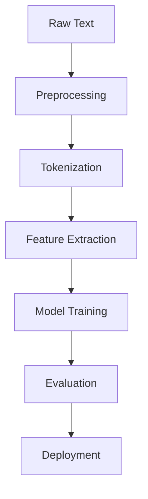
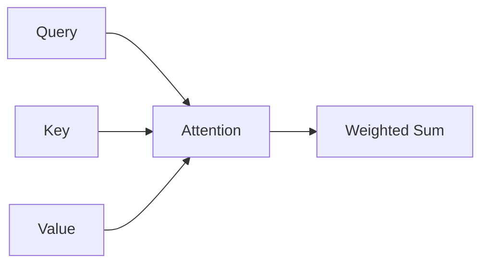
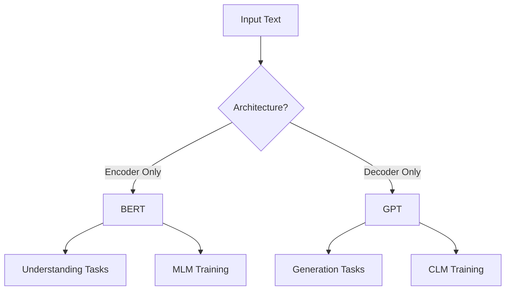

## Table of Contents
- [Introduction](#introduction)
- [Learning Roadmap](#learning-roadmap)
- [Theory Notes](#theory-notes)
- [Key Concepts](#key-concepts)
- [FAQ (30+ Q&A)](#faq-30-qa)
- [Hands-on Practice](#hands-on-practice)
- [FAANG Questions](#faang-questions)
- [Common Mistakes](#common-mistakes)
- [Best Practices](#best-practices)
- [Cheat Sheet](#cheat-sheet)
- [Flash Cards (30)](#flash-cards-30)
- [Mind Map](#mind-map)
- [Mermaid Diagrams](#mermaid-diagrams)
- [Code Examples](#code-examples)
- [Projects](#projects)
- [Resources](#resources)
- [Checklist](#checklist)
- [Revision Plans](#revision-plans)
- [Mock Interviews](#mock-interviews)
- [Difficulty Rating](#difficulty-rating)
- [Summary](#summary)

---

## Introduction

Natural Language Processing (NLP) is a branch of AI focused on enabling computers to understand, interpret, and generate human language. It bridges the gap between human communication and computer understanding. NLP powers search engines, translation services, chatbots, sentiment analysis, and most recently, large language models like GPT and BERT.

Modern NLP has evolved from rule-based systems through statistical methods to deep learning approaches. The transformer architecture has revolutionized the field, enabling models that can understand context, generate coherent text, and perform remarkably well across diverse tasks with minimal task-specific data.

Key application areas include:
- **Information Extraction**: Pulling structured data from unstructured text
- **Machine Translation**: Translating between languages automatically
- **Question Answering**: Building systems that answer questions in natural language
- **Text Summarization**: Condensing long documents into summaries
- **Sentiment Analysis**: Determining emotional tone of text
- **Dialogue Systems**: Building conversational agents and chatbots
- **Text Generation**: Creating coherent, contextually relevant text

---

## Learning Roadmap

### Phase 1: Text Preprocessing (Week 1-2)
- Tokenization (word, subword, character)
- Stemming and lemmatization
- Stop words removal
- Regular expressions for text cleaning

### Phase 2: Traditional Methods (Week 3-4)
- Bag of Words, TF-IDF
- N-grams
- Named Entity Recognition
- Sentiment analysis basics

### Phase 3: Word Embeddings (Week 5-6)
- Word2Vec (CBOW, Skip-gram)
- GloVe, FastText
- Embedding visualization

### Phase 4: Deep Learning for NLP (Week 7-8)
- RNNs, LSTMs, GRUs
- Seq2seq models
- Attention mechanism

### Phase 5: Transformers (Week 9-12)
- Transformer architecture
- BERT, GPT, T5
- Fine-tuning with Hugging Face
- Prompt engineering basics

---

## Theory Notes

### Text Preprocessing

**Tokenization** splits text into tokens. Word-level: "I love NLP" becomes ["I", "love", "NLP"]. Subword-level: "unhappiness" becomes ["un", "happiness"]. Character-level: "NLP" becomes ["N", "L", "P"].

**Stemming** uses rule-based heuristics to chop word endings. "running" becomes "run", "flies" becomes "fli". Fast but crude. Porter Stemmer and Snowball Stemmer are common algorithms.

**Lemmatization** uses vocabulary and morphological analysis to return dictionary root forms. "better" becomes "good", "flies" becomes "fly". More accurate but slower than stemming. Uses POS tagging for better results.

### Bag of Words and TF-IDF

**Bag of Words (BoW)** represents text as word frequency vectors, ignoring word order. Simple and interpretable but loses semantic information.

**TF-IDF** weights words by importance: TF(t,d) measures term frequency in a document, IDF(t) penalizes common terms across documents. TF-IDF = TF x IDF. Highlights domain-specific terms while downweighting common words.

### Word Embeddings

**Word2Vec** learns dense vectors capturing semantic relationships. CBOW predicts target from context; Skip-gram predicts context from target. The famous analogy: king - man + woman approximately equals queen.

**GloVe** factorizes the word co-occurrence matrix, combining global statistics with local context. **FastText** extends Word2Vec with subword information, handling rare and out-of-vocabulary words better.

### Transformer Architecture

The transformer uses self-attention to process sequences in parallel. For each token, attention(Q,K,V) = softmax(QK^T/sqrt(d_k)) x V computes weighted sums based on query-key compatibility. Multi-head attention runs multiple attention operations in parallel. Positional encoding injects sequence order information.

### Advanced Tokenization Methods

**Byte Pair Encoding (BPE)** starts with individual characters and iteratively merges the most frequent pairs. Used by GPT models. **WordPiece** is similar but uses a likelihood-based merge criterion. Used by BERT. **SentencePiece** is language-agnostic and works directly on raw text without pre-tokenization.

### Sequence Labeling

Sequence labeling assigns a label to each token in a sequence. Common tasks include POS tagging (noun, verb, adjective) and NER (person, organization, location). Models use BiLSTM-CRF architectures where the BiLSTM captures context and the CRF ensures valid label transitions.

### Language Model Pre-training

Modern NLP relies on pre-training on large text corpora. **Masked Language Modeling (MLB)** randomly masks tokens and predicts them (BERT). **Causal Language Modeling (CLM)** predicts the next token (GPT). **Seq2seq objectives** corrupt input and learn to reconstruct (T5, BART).

---

## Key Concepts

| Concept | Description |
|---------|-------------|
| N-grams | Sequences of N consecutive tokens capturing local context |
| Cosine Similarity | Measures angle between vectors, used for semantic similarity |
| Perplexity | How well a language model predicts text; lower is better |
| BLEU Score | Evaluates translation quality via n-gram overlap |
| Attention | Weighted sum of values based on query-key compatibility |
| Self-Attention | Attention within a single sequence |
| Masked Language Model | Predicts randomly masked tokens (BERT training objective) |
| Causal Language Model | Predicts next token from left context only (GPT training) |
| Subword Tokenization | Splitting words into meaningful subunits (BPE, WordPiece) |
| Contextual Embeddings | Word representations that change based on surrounding context |

---

## FAQ (30+ Q&A)

### Q1: What is the difference between stemming and lemmatization?
**A:** Stemming uses crude heuristics to chop endings (fast, may produce non-dictionary words). Lemmatization uses linguistic analysis to return valid dictionary forms (more accurate, slower).

### Q2: What is TF-IDF?
**A:** Term Frequency-Inverse Document Frequency. Measures word importance by combining how often a word appears in a document (TF) with how rare it is across all documents (IDF). Highlights domain-specific terms.

### Q3: Word2Vec vs GloVe?
**A:** Word2Vec uses local context windows (predicting from neighbors). GloVe factorizes the global co-occurrence matrix, combining local context with global statistics.

### Q4: Why is subword tokenization important?
**A:** Handles rare/OOV words by splitting into known subunits, reduces vocabulary size, and is standard in modern models (BERT uses WordPiece, GPT uses BPE).

### Q5: How do transformers handle word order?
**A:** Through positional encoding (sinusoidal or learned embeddings) added to input embeddings, since self-attention is permutation-invariant.

### Q6: BERT vs GPT?
**A:** BERT is encoder-only, trained with masked language modeling, excels at understanding tasks. GPT is decoder-only, trained with causal language modeling, excels at generation.

### Q7: What is transfer learning in NLP?
**A:** Using pre-trained models (BERT, GPT) as starting points for specific tasks. Fine-tuning adapts them with task-specific data, requiring less labeled data.

### Q8: What is sentiment analysis?
**A:** Determining emotional tone of text (positive/negative/neutral). Used for brand monitoring, customer feedback, social media analysis. Ranges from lexicon-based to transformer-based approaches.

### Q9: What is NER?
**A:** Named Entity Recognition identifies and classifies entities (people, organizations, locations, dates) in text. Modern approaches use BiLSTM-CRF or fine-tuned BERT.

### Q10: How do you handle out-of-vocabulary words?
**A:** Subword tokenization (BPE, WordPiece) breaks unknown words into known subunits. FastText uses subword embeddings. Character-level models handle any word but need longer sequences.

### Q11: What is the attention mechanism?
**A:** Computes weighted sums of values based on query-key compatibility. Self-attention lets each token attend to all others. Core of transformer architecture enabling parallel processing.

### Q12: Text classification approaches?
**A:** Traditional: Naive Bayes, SVM with TF-IDF. Deep learning: CNN for text, RNNs/LSTMs. Modern: Fine-tuned BERT/transformers.

### Q13: Extractive vs abstractive summarization?
**A:** Extractive selects important sentences from source. Abstractive generates new sentences. Extractive is more faithful; abstractive is more natural but may hallucinate.

### Q14: How is text generated?
**A:** Autoregressive models generate one token at a time, conditioning on all previous tokens. Temperature controls randomness; top-k and top-p sampling control diversity.

### Q15: Word-level vs character-level models?
**A:** Word-level needs fixed vocabulary. Character-level handles any word but needs longer sequences. Subword models offer the best balance.

### Q16: What is co-reference resolution?
**A:** Identifying expressions referring to the same entity. "Mary went to the store. She bought milk." resolves "She" to "Mary". Important for document understanding.

### Q17: Text augmentation techniques?
**A:** Synonym replacement, random insertion/deletion/swap, back-translation (translate and back), and contextual augmentation using language models.

### Q18: How to evaluate NLP models?
**A:** Classification: accuracy, F1, precision, recall. Generation: BLEU, ROUGE. Language modeling: perplexity. Understanding: GLUE/SuperGLUE benchmarks.

### Q19: Few-shot learning in NLP?
**A:** Performing tasks with very few examples. LLMs do this via in-context learning (examples in prompts). Prototypical networks generalize from few examples.

### Q20: Language modeling vs text classification?
**A:** Language modeling predicts next word (self-supervised). Text classification assigns labels (supervised). Language models are pre-trained generically, then fine-tuned.

### Q21: Semantic vs syntactic similarity?
**A:** Syntactic measures surface text resemblance. Semantic measures meaning similarity regardless of wording. Embeddings capture semantic similarity better.

### Q22: What is a language model?
**A:** A probability distribution over token sequences predicting next token probability. GPT is causal (left-to-right); BERT is masked (predicts masked tokens).

### Q23: What is cross-attention in transformers?
**A:** Attention where queries come from one sequence and keys/values from another. Used in encoder-decoder models (T5, BART) for tasks like translation and summarization.

### Q24: How does RoPE (Rotary Position Embedding) work?
**A:** Applies rotation matrices to query and key vectors based on position. Encodes relative position information naturally. Used in LLaMA, PaLM. Better than absolute positional encoding for long sequences.

### Q25: What is the difference between spaCy and NLTK?
**A:** spaCy is production-focused, fast, and opinionated with pre-trained pipelines. NLTK is educational, flexible, and includes many algorithms. Use spaCy for production, NLTK for learning and research.

### Q26: What is text normalization?
**A:** Standardizing text before processing: lowercasing, removing accents, expanding contractions, normalizing unicode, and handling special characters. Critical for consistent results across different text sources.

### Q27: What is the difference between tokenization and word segmentation?
**A:** Tokenization splits pre-tokenized text into tokens. Word segmentation identifies word boundaries in languages without explicit spaces (Chinese, Japanese, Thai). Different challenges for different languages.

### Q28: What are contextual embeddings?
**A:** Word representations that change based on surrounding context. "bank" near "river" has different embedding than "bank" near "money". BERT and GPT produce contextual embeddings.

### Q29: What is span extraction in NLP?
**A:** Identifying start and end positions of answer spans within text. Used in extractive QA (SQuAD). Models predict start/end probabilities for each token position.

### Q30: How do you handle imbalanced text datasets?
**A:** Oversampling minority classes, undersampling majority, class weights in loss, data augmentation (synonym replacement, back-translation), and using focal loss for hard examples.

---

## Hands-on Practice

### Text Preprocessing Pipeline
```python
import re
import nltk
from nltk.tokenize import word_tokenize
from nltk.stem import WordNetLemmatizer
from nltk.corpus import stopwords

class TextPreprocessor:
    def __init__(self):
        self.lemmatizer = WordNetLemmatizer()
        self.stop_words = set(stopwords.words('english'))

    def process(self, text):
        text = text.lower()
        text = re.sub(r'[^a-zA-Z\s]', '', text)
        tokens = word_tokenize(text)
        tokens = [t for t in tokens if t not in self.stop_words]
        tokens = [self.lemmatizer.lemmatize(t) for t in tokens]
        return tokens
```

### TF-IDF from Scratch
```python
import numpy as np
from collections import Counter

class TFIDFVectorizer:
    def __init__(self):
        self.vocabulary = {}
        self.idf = {}

    def fit(self, documents):
        doc_count = len(documents)
        word_doc_count = Counter()
        all_words = set()
        for doc in documents:
            words = set(doc.lower().split())
            for word in words:
                word_doc_count[word] += 1
                all_words.add(word)
        self.vocabulary = {w: i for i, w in enumerate(all_words)}
        self.idf = {w: np.log(doc_count / c) for w, c in word_doc_count.items()}
        return self

    def transform(self, documents):
        matrix = np.zeros((len(documents), len(self.vocabulary)))
        for i, doc in enumerate(documents):
            words = doc.lower().split()
            counts = Counter(words)
            total = len(words)
            for word, count in counts.items():
                if word in self.vocabulary:
                    matrix[i, self.vocabulary[word]] = (count / total) * self.idf.get(word, 0)
        return matrix
```

### Word2Vec Skip-gram from Scratch
```python
import numpy as np
from collections import Counter

class SimpleWord2Vec:
    def __init__(self, vocab_size, embedding_dim):
        self.W_in = np.random.randn(vocab_size, embedding_dim) * 0.01
        self.W_out = np.random.randn(embedding_dim, vocab_size) * 0.01

    def forward(self, center_idx):
        hidden = self.W_in[center_idx]
        scores = hidden @ self.W_out
        probs = np.exp(scores) / np.sum(np.exp(scores))
        return hidden, probs

    def backward(self, center_idx, target_idx, probs, lr=0.01):
        gradient_out = probs.copy()
        gradient_out[target_idx] -= 1
        grad_W_out = np.outer(self.W_in[center_idx], gradient_out)
        grad_hidden = self.W_out @ gradient_out
        self.W_out -= lr * grad_W_out
        self.W_in[center_idx] -= lr * grad_hidden

    def train_pair(self, center_idx, target_idx, lr=0.01):
        hidden, probs = self.forward(center_idx)
        self.backward(center_idx, target_idx, probs, lr)
        return -np.log(probs[target_idx] + 1e-8)
```

---

## FAANG Questions

1. **Google**: Design search autocomplete with personalization. How do you handle real-time suggestions?
2. **Meta**: Build a toxic content classifier handling sarcasm and context.
3. **Amazon**: Design a product review analysis system extracting aspects and sentiments.
4. **Apple**: Build an on-device NLP system for real-time text suggestions.
5. **Netflix**: Design a content recommendation system based on show descriptions.
6. **Google**: Build a multilingual sentiment analysis system across 50 languages.
7. **Meta**: Design a conversational AI for customer support with multi-turn dialogue.
8. **Amazon**: Build a system generating product descriptions from specifications.
9. **Apple**: Design a privacy-preserving NLP pipeline never sending raw text to servers.
10. **Netflix**: Build a subtitle generation system for multilingual content.
11. **Google**: Design an NLP system for detecting misinformation across languages.
12. **Meta**: Build a system that summarizes long documents while preserving key facts.

---

## Common Mistakes

1. Removing stop words for tasks where negation matters (sentiment analysis)
2. Using BoW when word order is important
3. Not normalizing text (case, punctuation)
4. Training embeddings from scratch instead of using pre-trained
5. Ignoring domain-specific tokenization needs
6. Not handling class imbalance in text classification
7. Using accuracy alone for imbalanced datasets
8. Not validating model outputs manually
9. Overfitting on small text datasets
10. Ignoring computational costs of large models

---

## Best Practices

1. Always preprocess text consistently across train/test
2. Use pre-trained embeddings or models when possible
3. Start with simple baselines (TF-IDF + Logistic Regression)
4. Consider domain-specific tokenization
5. Use stratified splits for text classification
6. Monitor for data leakage in text preprocessing
7. Evaluate with multiple metrics
8. Do error analysis on misclassified examples
9. Use data augmentation for small datasets
10. Document preprocessing steps for reproducibility

---

## Cheat Sheet

| Task | Traditional | Deep Learning |
|------|------------|---------------|
| Classification | BoW/TF-IDF + SVM/NB | BERT, CNN, LSTM |
| Sentiment | Lexicon, TF-IDF + LR | BERT, RoBERTa |
| NER | CRF | BiLSTM-CRF, BERT |
| Summarization | TextRank | BART, T5, GPT |
| Translation | Statistical MT | Transformer, mBART |
| QA | TF-IDF retrieval | BERT, GPT |
| Similarity | Cosine on TF-IDF | Sentence-BERT, SimCSE |
| Topic Modeling | LDA, NMF | BERTopic, Top2Vec |

**Key Libraries:** NLTK, spaCy, Hugging Face Transformers, Gensim, scikit-learn

---

## Flash Cards (30)

**Card 1:** Q: What is tokenization? A: Splitting text into tokens (words, subwords, or characters).

**Card 2:** Q: What is TF-IDF? A: Term Frequency-Inverse Document Frequency, weighting scheme measuring word importance.

**Card 3:** Q: What is Word2Vec? A: Neural network learning word embeddings via CBOW or Skip-gram.

**Card 4:** Q: What is attention? A: Weighted sum of values based on query-key similarity.

**Card 5:** Q: What is BERT? A: Bidirectional encoder transformer trained with masked language modeling.

**Card 6:** Q: What is GPT? A: Decoder-only transformer trained autoregressively for text generation.

**Card 7:** Q: What is BLEU score? A: Machine translation evaluation metric based on n-gram overlap.

**Card 8:** Q: What is perplexity? A: Measure of how well a language model predicts text; lower is better.

**Card 9:** Q: What is NER? A: Named Entity Recognition, identifying entities like people, organizations, locations.

**Card 10:** Q: Stemming vs lemmatization? A: Stemming is rule-based crude stemming; lemmatization uses linguistic analysis for dictionary forms.

**Card 11:** Q: What is cosine similarity? A: Cosine of angle between vectors, measuring semantic similarity.

**Card 12:** Q: What are n-grams? A: Sequences of N consecutive tokens capturing local context.

**Card 13:** Q: What is BPE? A: Byte Pair Encoding, subword tokenization merging frequent pairs.

**Card 14:** Q: What is GloVe? A: Global vectors embedding learned from word co-occurrence matrix factorization.

**Card 15:** Q: What is a seq2seq model? A: Encoder-decoder architecture for sequence-to-sequence tasks like translation.

**Card 16:** Q: What is beam search? A: Decoding strategy keeping top-k hypotheses at each step for better generation.

**Card 17:** Q: What is transfer learning in NLP? A: Using pre-trained models as starting points for specific tasks.

**Card 18:** Q: What is fine-tuning? A: Adapting pre-trained model weights to a specific downstream task.

**Card 19:** Q: What is ROUGE score? A: Summarization evaluation metric measuring n-gram recall against reference.

**Card 20:** Q: What is a language model? A: Probability distribution over token sequences predicting next token likelihood.

**Card 21:** Q: What is WordPiece? A: Subword tokenization algorithm used by BERT that splits based on likelihood.

**Card 22:** Q: What is cross-attention? A: Attention where queries come from decoder and keys/values from encoder.

**Card 23:** Q: What is contextual embedding? A: Word representation that changes based on surrounding context.

**Card 24:** Q: What is span extraction? A: Identifying start and end positions of answers within text.

**Card 25:** Q: What is back-translation? A: Translating text to another language and back for data augmentation.

**Card 26:** Q: What is a BiLSTM-CRF? A: Bidirectional LSTM with CRF layer for sequence labeling tasks like NER.

**Card 27:** Q: What is text normalization? A: Standardizing text (lowercasing, unicode normalization) for consistency.

**Card 28:** Q: What is sentence similarity? A: Measuring semantic equivalence between sentences using embeddings.

**Card 29:** Q: What is aspect-based sentiment analysis? A: Determining sentiment toward specific aspects or features in text.

**Card 30:** Q: What is a knowledge graph in NLP? A: Structured representation of entities and relationships for enhanced text understanding.

---

## Mind Map

```
NLP
├── Preprocessing
│   ├── Tokenization
│   ├── Stemming/Lemmatization
│   └── Stop Words
├── Traditional Methods
│   ├── Bag of Words
│   ├── TF-IDF
│   └── N-grams
├── Embeddings
│   ├── Word2Vec
│   ├── GloVe
│   └── FastText
├── Deep Learning
│   ├── RNN/LSTM/GRU
│   ├── CNN for Text
│   └── Seq2Seq
├── Transformers
│   ├── Self-Attention
│   ├── BERT
│   ├── GPT
│   └── T5
└── Applications
    ├── Classification
    ├── NER
    ├── Summarization
    ├── Translation
    └── QA
```

---

## Mermaid Diagrams

### NLP Pipeline


### Transformer Attention


### BERT vs GPT


---

## Code Examples

### Sentiment Analysis with Transformers
```python
from transformers import pipeline

classifier = pipeline("sentiment-analysis")
result = classifier("I love this movie! It was fantastic.")
print(result)
# Output: [{'label': 'POSITIVE', 'score': 0.9998}]
```

### Text Classification with BERT
```python
from transformers import BertTokenizer, BertForSequenceClassification
from transformers import Trainer, TrainingArguments

tokenizer = BertTokenizer.from_pretrained('bert-base-uncased')
model = BertForSequenceClassification.from_pretrained(
    'bert-base-uncased', num_labels=2
)

training_args = TrainingArguments(
    output_dir='./results',
    num_train_epochs=3,
    per_device_train_batch_size=16,
    learning_rate=2e-5,
)

trainer = Trainer(
    model=model,
    args=training_args,
    train_dataset=train_dataset,
    eval_dataset=eval_dataset,
)
trainer.train()
```

### Named Entity Recognition with spaCy
```python
import spacy

nlp = spacy.load("en_core_web_sm")
doc = nlp("Apple is looking at buying U.K. startup for $1 billion")

for ent in doc.ents:
    print(ent.text, ent.label_)
# Apple - ORG
# U.K. - GPE
# $1 billion - MONEY
```

### Text Summarization
```python
from transformers import pipeline

summarizer = pipeline("summarization", model="facebook/bart-large-cnn")
text = """Long document text goes here..."""
summary = summarizer(text, max_length=150, min_length=30)
print(summary[0]['summary_text'])
```

### Word Embedding Analogy
```python
import numpy as np
from gensim.models import KeyedVectors

model = KeyedVectors.load_word2vec_format('GoogleNews-vectors-negative300.bin', binary=True)
# king - man + woman ~= queen
result = model.most_similar(positive=['king', 'woman'], negative=['man'])
print(result[0])  # ('queen', 0.7118)
```

---

## Projects

1. **Sentiment Analyzer**: Build a movie review sentiment classifier using BERT
2. **NER System**: Create a named entity recognition system for news articles
3. **Text Summarizer**: Build both extractive and abstractive summarization systems
4. **Chatbot**: Implement a retrieval-based or generative chatbot
5. **Search Engine**: Build a document search system using TF-IDF and semantic search
6. **Toxicity Detector**: Build a content moderation system for toxic text
7. **Machine Translator**: Implement a sequence-to-sequence translation model

---

## Resources

- **Books**: "Speech and Language Processing" (Jurafsky), "NLP with Transformers" (Tunstall)
- **Courses**: Stanford CS224n, Hugging Face NLP Course
- **Libraries**: Hugging Face Transformers, spaCy, NLTK, Gensim
- **Datasets**: GLUE, SuperGLUE, SQuAD, IMDB, CoNLL-2003
- **Papers**: "Attention Is All You Need", BERT, GPT-2, T5
- **Benchmarks**: GLUE, SuperGLUE, SQuAD, SuperGLUE, HELM

---

## Checklist

- [ ] Text preprocessing (tokenization, stemming, lemmatization)
- [ ] Bag of Words and TF-IDF
- [ ] Word embeddings (Word2Vec, GloVe, FastText)
- [ ] RNNs, LSTMs, GRUs for text
- [ ] Transformer and self-attention
- [ ] BERT and GPT architectures
- [ ] Fine-tuning with Hugging Face
- [ ] Sentiment analysis
- [ ] NER
- [ ] Text classification
- [ ] Evaluation metrics (BLEU, ROUGE, perplexity)
- [ ] Subword tokenization (BPE, WordPiece)
- [ ] Sequence labeling (BiLSTM-CRF)
- [ ] Text generation strategies

---

## Revision Plans

### 2-Week Plan
- Week 1: Preprocessing, traditional methods, embeddings
- Week 2: Transformers, BERT/GPT, hands-on projects

### Daily (30 min)
- 10 min: Flash cards
- 10 min: Code practice
- 10 min: Read papers/tutorials

---

## Mock Interviews

1. Explain the attention mechanism step by step
2. How would you handle class imbalance in text classification?
3. Design a multilingual sentiment analysis system
4. What are the tradeoffs between BERT and GPT for a specific task?
5. How would you evaluate a text summarization system?
6. Design a real-time NER system for social media text
7. Explain how you would build a document similarity search engine

---

## Difficulty Rating

| Topic | Difficulty | Frequency |
|-------|-----------|-----------|
| Text Preprocessing | Easy | High |
| TF-IDF/BoW | Easy | High |
| Word Embeddings | Medium | Medium |
| RNNs/LSTMs | Medium | Medium |
| Transformers | Hard | Very High |
| BERT/GPT | Hard | Very High |
| Fine-tuning | Medium | High |
| NER/Sequence Labeling | Medium | Medium |
| Text Generation | Hard | High |

**Overall: Medium | Preparation: 4-6 weeks**

---

## Summary

NLP interviews test understanding of text processing fundamentals, traditional methods (TF-IDF, embeddings), and modern transformer-based approaches. Master text preprocessing, understand Word2Vec/GloVe, deeply know the transformer architecture, and be proficient with BERT and GPT. Practical experience with Hugging Face Transformers is essential. Start with TF-IDF baselines, progress to pre-trained models, and always connect technical decisions to the specific NLP task requirements.

---

## Deep Dive: Common NLP Tasks

### Text Classification
Assigning labels to text. Applications: spam detection, topic categorization, sentiment analysis. Evolution: Naive Bayes with BoW → SVM with TF-IDF → CNN for text → LSTM → Fine-tuned BERT. Key considerations: class imbalance, multi-label vs single-label, hierarchical classification.

### Named Entity Recognition (NER)
Identifying and classifying entities in text. BIO tagging scheme: B-PER, I-PER for person entities. Models: BiLSTM-CRF captures context and ensures valid tag transitions. Fine-tuned BERT achieves state-of-the-art. Domain-specific NER (medical, legal) requires domain-adapted models.

### Question Answering
Two main types: extractive (select answer span from text, SQuAD) and generative (generate answer, Natural Questions). Extractive models predict start/end positions. Generative models produce answers from scratch. RAG-based QA combines retrieval with generation for knowledge-intensive questions.

### Machine Translation
Sequence-to-sequence task converting text between languages. Historical: statistical phrase-based MT. Modern: Transformer-based (mBART, NLLB). Evaluation: BLEU, COMET, human evaluation. Challenges: low-resource languages, domain adaptation, maintaining meaning and fluency.

### Text Summarization
Condensing documents into shorter versions. Extractive: selecting important sentences (TextRank, BERTScore). Abstractive: generating new sentences (BART, T5, GPT). Evaluation: ROUGE-1, ROUGE-2, ROUGE-L. Challenges: maintaining factual accuracy, avoiding hallucination, handling long documents.

### Dialogue Systems
Conversational AI systems. Task-oriented: handle specific tasks (booking, customer support). Open-domain: general conversation. Components: natural language understanding, dialogue management, natural language generation. Modern: LLM-based chatbots with memory and tool use.

### Coreference Resolution
Identifying expressions referring to the same entity. "Mary went to the store. She bought milk." resolves "She" to "Mary". Important for document understanding. Models use mention detection and entity linking. Used as preprocessing for downstream tasks.

---

## Deep Dive: Evaluation Metrics

### Classification Metrics
| Metric | Formula | When to Use |
|--------|---------|-------------|
| Accuracy | (TP+TN)/(TP+TN+FP+FN) | Balanced classes |
| Precision | TP/(TP+FP) | Cost of false positive high |
| Recall | TP/(TP+FN) | Cost of false negative high |
| F1 Score | 2*P*R/(P+R) | Imbalanced classes |
| AUC-ROC | Area under ROC curve | Ranking quality |

### Generation Metrics
| Metric | Measures | Range |
|--------|----------|-------|
| BLEU | Precision of n-gram overlap | 0-1 (higher better) |
| ROUGE-1 | Recall of unigram overlap | 0-1 (higher better) |
| ROUGE-L | Longest common subsequence | 0-1 (higher better) |
| METEOR | Alignment with stemming/synonyms | 0-1 (higher better) |
| BERTScore | Semantic similarity via embeddings | -1 to 1 |

### Information Retrieval Metrics
| Metric | Description |
|--------|-------------|
| Precision@k | Proportion of top-k results that are relevant |
| Recall@k | Proportion of all relevant docs in top-k |
| MRR | Mean Reciprocal Rank of first relevant result |
| NDCG | Normalized Discounted Cumulative Gain |
| MAP | Mean Average Precision across queries |

---

## Deep Dive: NLP Libraries Comparison

### NLTK vs spaCy vs Hugging Face
| Feature | NLTK | spaCy | Hugging Face |
|---------|------|-------|--------------|
| Focus | Education/Research | Production | Transformers |
| Speed | Slow | Very Fast | Medium |
| Pre-trained Models | Few | Yes | Extensive |
| Tokenization | Word-level | Subword (BPE) | Multiple |
| Best For | Learning | Production NLP | Deep Learning |
| Community | Large | Large | Very Large |
| Pipeline | Manual | Automatic | Automatic |

### Gensim for Topic Modeling
```python
from gensim import corpora
from gensim.models import LdaModel

documents = ["doc1 text", "doc2 text", "doc3 text"]
tokenized = [doc.split() for doc in documents]
dictionary = corpora.Dictionary(tokenized)
corpus = [dictionary.doc2bow(doc) for doc in tokenized]

lda = LdaModel(corpus, num_topics=5, id2word=dictionary)
topics = lda.print_topics()
```

### Sentence Transformers for Similarity
```python
from sentence_transformers import SentenceTransformer, util

model = SentenceTransformer('all-MiniLM-L6-v2')
sentences = ["This is sentence A", "This is sentence B"]
embeddings = model.encode(sentences)
similarity = util.cos_sim(embeddings[0], embeddings[1])
print(f"Similarity: {similarity.item():.4f}")
```

---

## Interview Quick Reference Card

### Top 10 NLP Interview Questions and Answers
1. **Attention mechanism**: softmax(QK^T/sqrt(d_k)) * V, enables parallel sequence processing
2. **BERT vs GPT**: BERT=bidirectional encoder (understanding), GPT=autoregressive decoder (generation)
3. **Transfer learning**: Use pre-trained models as starting points, fine-tune on specific tasks
4. **Handling OOV words**: Subword tokenization (BPE, WordPiece), character-level models
5. **Text preprocessing**: Tokenization, normalization, stop word removal, lemmatization
6. **Word embeddings**: Dense vectors capturing semantic relationships between words
7. **Transformer advantages**: Parallel processing, captures long-range dependencies, scalable
8. **Evaluation metrics**: BLEU (translation), ROUGE (summarization), F1 (classification)
9. **Fine-tuning strategies**: Full fine-tuning, LoRA, prompt tuning, adapter layers
10. **Real-world challenges**: Domain adaptation, low-resource languages, bias, efficiency

### NLP Model Selection Guide
| Task | Best Traditional | Best Modern | Notes |
|------|-----------------|-------------|-------|
| Classification | TF-IDF + SVM | BERT, RoBERTa | Start with TF-IDF baseline |
| NER | CRF | BERT-CRF | Domain-specific training helps |
| Summarization | TextRank | BART, T5 | Abstractive for natural output |
| Translation | - | mBART, NLLB | Transformer-based dominant |
| QA | BM25 retrieval | BERT, GPT | RAG for knowledge-intensive |
| Similarity | TF-IDF cosine | Sentence-BERT | Embeddings capture semantics |
| Sentiment | VADER, TextBlob | DistilBERT | Lexicon for quick baseline |

### Key Formulas Reference
- **TF-IDF**: TF(t,d) * log(N/df(t))
- **Attention**: softmax(QK^T/sqrt(d_k)) * V
- **BLEU**: BP * exp(sum(w_n * log(p_n)))
- **Perplexity**: 2^(-1/N * sum(log2(p(w_i))))
- **Cosine Similarity**: (A·B)/(||A||*||B||)
- **Cross-Entropy Loss**: -sum(y * log(p(y)))

---

## NLP Model Architecture Reference

### Transformer Architecture Dimensions
| Model | d_model | Heads | Layers | FFN Dim | Vocab | Params |
|-------|---------|-------|--------|---------|-------|--------|
| BERT-base | 768 | 12 | 12 | 3072 | 30K | 110M |
| BERT-large | 1024 | 16 | 24 | 4096 | 30K | 340M |
| GPT-2 | 768 | 12 | 12 | 3072 | 50K | 117M |
| GPT-3 | 12288 | 96 | 96 | 49152 | 50K | 175B |
| T5-base | 512 | 8 | 6 | 2048 | 32K | 220M |
| BART-base | 768 | 12 | 6 | 3072 | 50K | 140M |
| LLaMA-7B | 4096 | 32 | 32 | 11008 | 32K | 6.7B |

### Pre-training Objectives Comparison
| Objective | Model | Description | Tasks |
|-----------|-------|-------------|-------|
| Masked LM (MLM) | BERT | Predict 15% masked tokens | Understanding |
| Causal LM (CLM) | GPT | Predict next token | Generation |
| Span Corruption | T5 | Corrupt spans, reconstruct | Seq2seq |
| Denoising | BART | Corrupt input, reconstruct | Summarization |
| Replaced Token | ELECTRA | Detect replaced tokens | Efficient pre-training |
| SimCSE | SimCSE | Contrastive sentence learning | Similarity |

### Common NLP Dataset Sizes
| Dataset | Size | Task | Train Samples |
|---------|------|------|---------------|
| GLUE | 3.5GB | Understanding | 3.5M |
| SQuAD 2.0 | 35MB | QA | 150K |
| CoNLL-2003 | 3MB | NER | 20K |
| IMDB | 80MB | Sentiment | 50K |
| WMT (En-De) | 5GB | Translation | 4.5M |
| CNN/DailyMail | 3GB | Summarization | 300K |
| SuperGLUE | 2GB | Understanding | 200K |

### NLP Preprocessing Best Practices by Task
| Task | Stop Words | Lemmatization | Lowercasing | Special Chars |
|------|-----------|---------------|-------------|---------------|
| Classification | Remove | Yes | Yes | Remove |
| Sentiment | Keep (negation) | Optional | Yes | Keep (!?) |
| NER | Keep | No | Case-sensitive | Keep |
| Summarization | Keep | No | No | Keep |
| QA | Keep | No | Case-sensitive | Keep |
| Translation | Keep | No | No | Keep |

### Hugging Face Model Hub Quick Reference
```python
# Loading models
from transformers import AutoModel, AutoTokenizer

# General loading
model = AutoModel.from_pretrained("bert-base-uncased")
tokenizer = AutoTokenizer.from_pretrained("bert-base-uncased")

# For specific tasks
from transformers import pipeline

# Zero-shot classification
 classifier = pipeline("zero-shot-classification", model="facebook/bart-large-mnli")

# Named entity recognition
ner = pipeline("ner", model="dbmdz/bert-large-cased-finetuned-conll03-english")

# Question answering
qa = pipeline("question-answering", model="deepset/roberta-base-squad2")

# Text generation
generator = pipeline("text-generation", model="gpt2")

# Summarization
summarizer = pipeline("summarization", model="facebook/bart-large-cnn")

# Translation
translator = pipeline("translation_en_to_fr", model="t5-base")
```

### Advanced NLP Techniques
| Technique | Description | When to Use |
|-----------|-------------|-------------|
| Curriculum Learning | Train on easy→hard examples | Small datasets |
| Mixup for Text | Interpolate embeddings | Regularization |
| Knowledge Distillation | Small model mimics large | Deployment |
| Adversarial Training | Train with perturbed inputs | Robustness |
| Multi-task Learning | Train on related tasks simultaneously | Limited data |
| Active Learning | Selectively label most informative samples | Labeling budget |
| Few-shot Learning | Learn from very few examples | Limited labels |
| Zero-shot Transfer | Apply pre-trained model to new task | No task-specific data |

### NLP Project Architecture Template
```
project/
├── data/
│   ├── raw/
│   ├── processed/
│   └── external/
├── src/
│   ├── preprocessing/
│   │   ├── tokenizer.py
│   │   └── cleaners.py
│   ├── models/
│   │   ├── base.py
│   │   └── bert_classifier.py
│   ├── training/
│   │   ├── trainer.py
│   │   └── config.py
│   └── evaluation/
│       ├── metrics.py
│       └── evaluator.py
├── notebooks/
├── configs/
├── tests/
├── requirements.txt
└── README.md
```

### Common NLP Interview Scenarios
| Scenario | Key Considerations | Approach |
|----------|-------------------|----------|
| Real-time sentiment | Low latency, high throughput | DistilBERT + batching |
| Multilingual support | Many languages, code-switching | mBERT, XLM-R |
| Domain-specific NER | Custom entity types | Fine-tune on domain data |
| Long document QA | Context window limits | Chunking + retrieval |
| Low-resource language | Limited training data | Cross-lingual transfer |
| Code generation | Syntax-aware | Code-specific tokenizer |
| Document clustering | Large-scale, efficient | Sentence embeddings + HDBSCAN |
