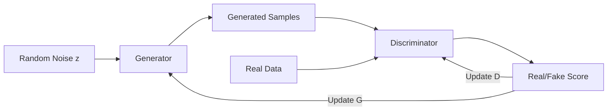
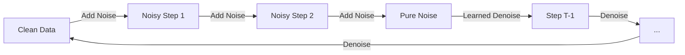
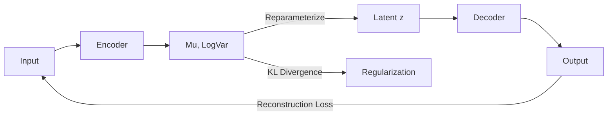
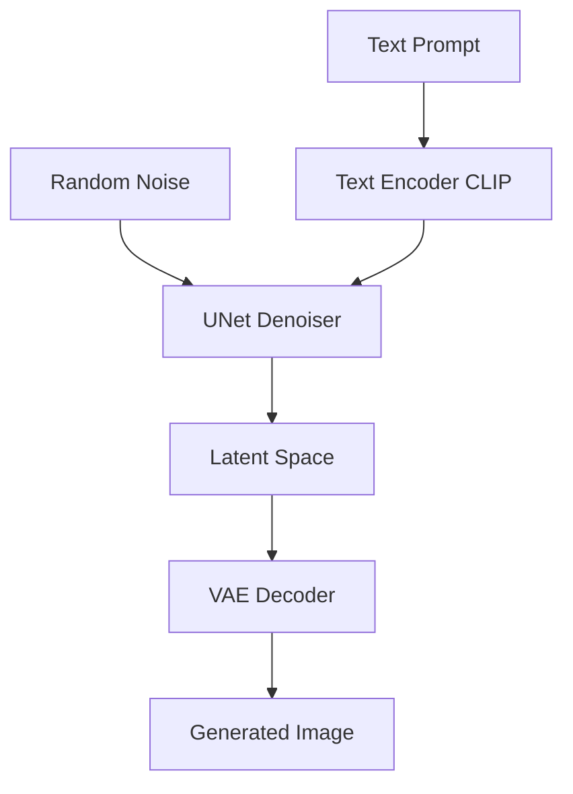

## Table of Contents
- [Introduction](#introduction)
- [Learning Roadmap](#learning-roadmap)
- [Theory Notes](#theory-notes)
- [Key Concepts](#key-concepts)
- [FAQ (30+ Q&A)](#faq-30-qa)
- [Hands-on Practice](#hands-on-practice)
- [FAANG Questions](#faang-questions)
- [Common Mistakes](#common-mistakes)
- [Best Practices](#best-practices)
- [Cheat Sheet](#cheat-sheet)
- [Flash Cards (30)](#flash-cards-30)
- [Mind Map](#mind-map)
- [Mermaid Diagrams](#mermaid-diagrams)
- [Code Examples](#code-examples)
- [Projects](#projects)
- [Resources](#resources)
- [Checklist](#checklist)
- [Revision Plans](#revision-plans)
- [Mock Interviews](#mock-interviews)
- [Difficulty Rating](#difficulty-rating)
- [Summary](#summary)

---

## Introduction

Generative AI encompasses machine learning models that can create new content, including text, images, audio, video, and code. Unlike discriminative models that learn decision boundaries, generative models learn the underlying data distribution to produce novel samples that resemble training data.

Key generative paradigms include:
- **VAEs (Variational Autoencoders)**: Learn latent representations for generation
- **GANs (Generative Adversarial Networks)**: Two networks competing to generate realistic data
- **Diffusion Models**: Gradually denoise random noise into coherent outputs
- **Transformer-based generation**: Autoregressive models like GPT and their variants
- **Flow-based models**: Learn invertible transformations for exact likelihood computation

Generative AI has exploded with applications like ChatGPT, DALL-E, Midjourney, and Stable Diffusion. Understanding these technologies is critical for modern AI roles, as they represent the cutting edge of what AI systems can accomplish.

---

## Learning Roadmap

### Phase 1: Foundations (Week 1-2)
- Probability distributions and sampling
- Maximum likelihood estimation
- Latent variable models
- KL divergence and ELBO
- Information theory basics

### Phase 2: VAEs and Flow Models (Week 3-4)
- Autoencoder architecture
- Variational inference
- Reparameterization trick
- VAE training and loss
- Normalizing flows
- Variational inference basics

### Phase 3: GANs (Week 5-7)
- GAN architecture and training
- Generator and discriminator
- Loss functions (vanilla, WGAN, LSGAN)
- Mode collapse and training instability
- Conditional GANs
- StyleGAN, ProGAN

### Phase 4: Diffusion Models (Week 8-9)
- Forward and reverse diffusion process
- DDPM (Denoising Diffusion Probabilistic Models)
- Noise scheduling
- Classifier-free guidance
- Stable Diffusion architecture
- Image-to-image and inpainting

### Phase 5: Transformer-based Generation (Week 10-12)
- Autoregressive generation
- GPT architecture
- BART, T5 for text generation
- Multimodal models (CLIP, DALL-E)
- Prompt engineering for generation
- RLHF (Reinforcement Learning from Human Feedback)

---

## Theory Notes

### VAE (Variational Autoencoder)
VAEs encode input into a latent distribution (mean and variance) rather than a fixed point. The reparameterization trick enables backpropagation through the sampling process.

**Loss** = Reconstruction Loss + KL Divergence
- Reconstruction loss ensures decoded output matches input
- KL divergence regularizes the latent space to be close to standard normal

The latent space is smooth and continuous, allowing interpolation between points to generate meaningful variations.

### GAN (Generative Adversarial Network)
Two networks play a minimax game:
- **Generator (G)**: Maps random noise z to synthetic data
- **Discriminator (D)**: Distinguishes real from generated data

**Objective**: min_G max_D E[log D(x)] + E[log(1 - D(G(z)))]

Training alternates between updating D to better classify real/fake and updating G to fool D. At equilibrium, G produces data indistinguishable from real data.

**Challenges**: Mode collapse (G produces limited variety), training instability, vanishing gradients when D is too strong.

**WGAN**: Uses Wasserstein distance instead of JS divergence. More stable training, meaningful loss metrics. Enforces Lipschitz constraint via weight clipping or gradient penalty.

### Diffusion Models
**Forward process**: Gradually adds Gaussian noise to data over T steps until it becomes pure noise.
q(x_t | x_{t-1}) = N(x_t; sqrt(1-beta_t) * x_{t-1}, beta_t * I)

**Reverse process**: Neural network learns to denoise step by step.
p_theta(x_{t-1} | x_t) = N(x_{t-1}; mu_theta(x_t, t), sigma_theta(x_t, t) * I)

Training optimizes a simplified objective: predict the noise added at each step. At inference, start from random noise and iteratively denoise.

**Classifier-free guidance**: Condition generation by combining conditional and unconditional predictions with a guidance scale.

### Transformer-based Generation
Autoregressive models factorize the probability of a sequence:
P(x1, x2, ..., xn) = P(x1) * P(x2|x1) * P(x3|x1,x2) * ... * P(xn|x1,...,xn-1)

GPT trains to predict the next token. At inference, sample token by token. Temperature controls randomness; top-k and top-p sampling control diversity.

### Prompt Engineering
Crafting effective inputs to guide generative models:
- **Zero-shot**: No examples, just the task description
- **Few-shot**: Include examples in the prompt
- **Chain-of-thought**: Step-by-step reasoning
- **System prompts**: Set behavior and constraints

### VQ-VAE (Vector Quantized VAE)
Discretizes the latent space into a finite set of codebook vectors. Produces sharper outputs than standard VAEs. Used in DALL-E and other high-quality generation systems. The discrete bottleneck forces the model to learn more structured representations.

### Score-Based Generative Models
Learn the gradient of the log probability density (score function). Use Langevin dynamics for sampling. Connected to diffusion models through the score matching framework. Provide a unified view of diffusion and score-based approaches.

---

## Key Concepts

| Concept | Description |
|---------|-------------|
| Latent Space | Compressed representation space where generation happens |
| Mode Collapse | Generator produces limited variety of outputs |
| KL Divergence | Measures difference between probability distributions |
| Reparameterization Trick | Enables backpropagation through random sampling |
| Classifier-Free Guidance | Balances conditional and unconditional generation |
| ELBO | Evidence Lower Bound, optimization objective for VAEs |
| DDPM | Denoising Diffusion Probabilistic Models |
| RLHF | Reinforcement Learning from Human Feedback |
| Temperature | Controls randomness in generation (lower = more deterministic) |
| Top-k/Top-p | Sampling strategies to control output diversity |
| Codebook | Discrete latent space entries in VQ-VAE |
| Langevin Dynamics | Sampling method using score function gradients |

---

## FAQ (30+ Q&A)

### Q1: What is the difference between VAE and GAN?
**A:** VAEs optimize a likelihood-based objective, producing smooth latent spaces good for interpolation. GANs use adversarial training, producing sharper outputs but with training instability and mode collapse risks. VAEs are more stable; GANs produce higher quality samples.

### Q2: What is mode collapse in GANs?
**A:** When the generator learns to produce only a few types of outputs that successfully fool the discriminator, ignoring the full diversity of training data. Solutions include minibatch discrimination, unrolled GANs, and WGAN.

### Q3: How do diffusion models work?
**A:** Forward process gradually adds noise to data. Reverse process learns to denoise. Training teaches the model to predict noise at each step. Generation starts from random noise and iteratively denoises to produce coherent output.

### Q4: What is RLHF?
**A:** Reinforcement Learning from Human Feedback. Uses human preferences to fine-tune language models. Trains a reward model on human comparisons, then optimizes the LM using PPO to maximize reward while staying close to the original model.

### Q5: What is classifier-free guidance?
**A:** A technique for conditional generation that combines conditional and unconditional predictions: output = unconditional + guidance_scale * (conditional - unconditional). Higher guidance scale = stronger adherence to condition but less diversity.

### Q6: What is a latent variable model?
**A:** Models that assume data is generated from underlying latent (hidden) variables. VAEs are latent variable models that learn the mapping between data and latent space, enabling generation by sampling from the latent distribution.

### Q7: What is the reparameterization trick?
**A:** Instead of sampling z ~ N(mu, sigma), compute z = mu + sigma * epsilon where epsilon ~ N(0,1). This makes sampling differentiable, enabling backpropagation through the latent space in VAEs.

### Q8: What are flow-based models?
**A:** Models that learn invertible transformations between data and a simple distribution (e.g., Gaussian). They allow exact likelihood computation and efficient sampling. Examples: RealNVP, Glow.

### Q9: What is temperature in text generation?
**A:** A parameter that scales logits before softmax. Lower temperature (e.g., 0.2) makes output more deterministic and focused. Higher temperature (e.g., 1.5) makes output more random and creative. Temperature=1 is standard sampling.

### Q10: What is top-k sampling?
**A:** Sampling only from the top k most probable tokens at each step. Limits the model to consider only the most likely continuations. Reduces probability of unlikely tokens but can miss valid alternatives.

### Q11: What is nucleus (top-p) sampling?
**A:** Sampling from the smallest set of tokens whose cumulative probability exceeds p. Dynamically adjusts the number of candidates based on the probability distribution. Often more natural than top-k.

### Q12: What is prompt engineering?
**A:** Crafting effective inputs to guide generative models toward desired outputs. Includes zero-shot, few-shot, chain-of-thought prompting, and system-level instructions. Critical skill for working with LLMs.

### Q13: What is fine-tuning for generation?
**A:** Adapting pre-trained generative models to specific tasks or domains. Can be full fine-tuning, parameter-efficient (LoRA, adapters), or instruction tuning. Aligns the model with specific output requirements.

### Q14: What is image inpainting?
**A:** Filling in missing or masked regions of an image. Diffusion models excel at this by conditioning on the known parts and generating plausible completions for masked regions.

### Q15: What is StyleGAN?
**A:** A GAN architecture that separates style from content using adaptive instance normalization (AdaIN). Produces high-quality, controllable face generation. Style mixing allows combining styles at different scales.

### Q16: What is CLIP?
**A:** Contrastive Language-Image Pre-training. Learns to match images and text descriptions in a shared embedding space. Enables zero-shot image classification and text-guided image generation.

### Q17: What is a diffusion model's noise schedule?
**A:** The progression of noise levels added during the forward process. Common schedules: linear, cosine, sigmoid. The schedule affects generation quality and speed. Cosine schedules often work better than linear.

### Q18: What is image-to-image translation?
**A:** Converting an image from one domain to another (e.g., sketch to photo, day to night). Approaches: paired (Pix2Pix), unpaired (CycleGAN), and diffusion-based methods.

### Q19: What is text-to-image generation?
**A:** Generating images from text descriptions. Models: DALL-E, Stable Diffusion, Midjourney. Use text encoders (CLIP) to condition image generation on text prompts.

### Q20: What is the difference between autoregressive and non-autoregressive generation?
**A:** Autoregressive generates tokens one at a time, conditioning on all previous tokens (GPT). Non-autoregressive generates all tokens simultaneously (some translation models). Autoregressive is higher quality but slower.

### Q21: What is knowledge distillation for generative models?
**A:** Training a smaller model to mimic a larger model's outputs. Reduces model size while preserving generation quality. Used for deploying large generative models efficiently.

### Q22: What are ethical considerations in generative AI?
**A:** Deepfakes, misinformation, copyright/training data issues, bias in generated content, environmental cost of training, and potential for misuse. Responsible deployment requires safeguards and transparency.

### Q23: What is CFG scale in Stable Diffusion?
**A:** Classifier-Free Guidance scale controls how strongly the generated image follows the text prompt. Higher values (7-15) follow prompt more closely but may reduce diversity. Lower values (1-3) produce more diverse but less prompt-aligned outputs.

### Q24: What is a latent diffusion model?
**A:** Diffusion model that operates in the latent space of an autoencoder rather than pixel space. More efficient for high-resolution images. Stable Diffusion uses this approach with a VAE encoder/decoder.

### Q25: What is progressive growing in GANs?
**A:** Training GANs by starting with low-resolution images and progressively adding layers for higher resolutions. Stabilizes training at high resolutions. Used in ProGAN and early StyleGAN versions.

### Q26: What is contrastive learning?
**A:** Learning representations by pulling positive pairs together and pushing negatives apart. Used in CLIP for vision-language alignment. Self-supervised approach that learns useful representations without labels.

### Q27: What is spectral normalization for GANs?
**A:** Normalizing weight matrices by their spectral norm to enforce Lipschitz continuity. Stabilizes GAN training by preventing discriminator from becoming too powerful. Simpler alternative to WGAN weight clipping.

### Q28: What is a variational lower bound?
**A:** Also called ELBO (Evidence Lower Bound). Lower bound on the log-likelihood of data. VAEs optimize ELBO = reconstruction term - KL divergence. Maximizing ELBO minimizes the gap to true likelihood.

### Q29: What is conditional generation?
**A:** Generating outputs conditioned on additional information (class labels, text, reference images). Conditional GANs, Stable Diffusion (text-conditioned), and class-conditional generation are common approaches.

### Q30: What is FID (Fréchet Inception Distance)?
**A:** Metric measuring quality and diversity of generated images. Computes distance between feature distributions of real and generated images. Lower FID = better quality and diversity. Most common GAN/diffusion evaluation metric.

---

## Hands-on Practice

### Simple VAE Implementation
```python
import torch
import torch.nn as nn

class VAE(nn.Module):
    def __init__(self, input_dim=784, hidden_dim=400, latent_dim=20):
        super().__init__()
        self.encoder = nn.Sequential(
            nn.Linear(input_dim, hidden_dim),
            nn.ReLU(),
        )
        self.mu_layer = nn.Linear(hidden_dim, latent_dim)
        self.logvar_layer = nn.Linear(hidden_dim, latent_dim)
        self.decoder = nn.Sequential(
            nn.Linear(latent_dim, hidden_dim),
            nn.ReLU(),
            nn.Linear(hidden_dim, input_dim),
            nn.Sigmoid(),
        )

    def encode(self, x):
        h = self.encoder(x)
        return self.mu_layer(h), self.logvar_layer(h)

    def reparameterize(self, mu, logvar):
        std = torch.exp(0.5 * logvar)
        eps = torch.randn_like(std)
        return mu + eps * std

    def decode(self, z):
        return self.decoder(z)

    def forward(self, x):
        mu, logvar = self.encode(x.view(-1, 784))
        z = self.reparameterize(mu, logvar)
        return self.decode(z), mu, logvar

def vae_loss(recon_x, x, mu, logvar):
    recon = nn.functional.binary_cross_entropy(
        recon_x, x.view(-1, 784), reduction='sum'
    )
    kl = -0.5 * torch.sum(1 + logvar - mu.pow(2) - logvar.exp())
    return recon + kl
```

### Simple GAN Implementation
```python
import torch
import torch.nn as nn

class Generator(nn.Module):
    def __init__(self, latent_dim=100, img_dim=784):
        super().__init__()
        self.net = nn.Sequential(
            nn.Linear(latent_dim, 256),
            nn.LeakyReLU(0.2),
            nn.Linear(256, 512),
            nn.LeakyReLU(0.2),
            nn.Linear(512, img_dim),
            nn.Tanh(),
        )

    def forward(self, z):
        return self.net(z)

class Discriminator(nn.Module):
    def __init__(self, img_dim=784):
        super().__init__()
        self.net = nn.Sequential(
            nn.Linear(img_dim, 512),
            nn.LeakyReLU(0.2),
            nn.Dropout(0.3),
            nn.Linear(512, 256),
            nn.LeakyReLU(0.2),
            nn.Dropout(0.3),
            nn.Linear(256, 1),
            nn.Sigmoid(),
        )

    def forward(self, x):
        return self.net(x)

def train_gan(generator, discriminator, dataloader, epochs=100):
    criterion = nn.BCELoss()
    opt_g = torch.optim.Adam(generator.parameters(), lr=2e-4, betas=(0.5, 0.999))
    opt_d = torch.optim.Adam(discriminator.parameters(), lr=2e-4, betas=(0.5, 0.999))

    for epoch in range(epochs):
        for real_imgs, _ in dataloader:
            batch_size = real_imgs.size(0)
            real = torch.ones(batch_size, 1)
            fake = torch.zeros(batch_size, 1)

            z = torch.randn(batch_size, 100)
            gen_imgs = generator(z)

            d_loss = criterion(discriminator(real_imgs), real) + \
                     criterion(discriminator(gen_imgs.detach()), fake)
            opt_d.zero_grad()
            d_loss.backward()
            opt_d.step()

            g_loss = criterion(discriminator(gen_imgs), real)
            opt_g.zero_grad()
            g_loss.backward()
            opt_g.step()
```

---

## FAANG Questions

1. **Google**: Design a text-to-image generation system. How do you ensure factual consistency between text and image?
2. **Meta**: Build a system that generates realistic training data for rare events. How do you evaluate quality?
3. **Amazon**: Design a generative AI system for product descriptions. How do you prevent hallucination?
4. **Apple**: Build an on-device image generation model. What optimizations would you use?
5. **Netflix**: Design a system generating personalized content summaries with different tones.
6. **Google**: How would you evaluate the quality and safety of generative models at scale?
7. **Meta**: Design a multi-modal generative model for text and images.
8. **Amazon**: Build a conversational AI that generates helpful and safe responses.
9. **Apple**: Design a privacy-preserving generative model for user data.
10. **Netflix**: Build a system that generates different styles of movie trailers.
11. **Google**: Design a generative model that can create synthetic medical training data.
12. **Meta**: Build a system detecting AI-generated content for content moderation.

---

## Common Mistakes

1. Not monitoring for mode collapse during GAN training
2. Using too high learning rates for diffusion models
3. Ignoring ethical implications of generated content
4. Not evaluating diversity alongside quality
5. Using inappropriate metrics (only FID without human evaluation)
6. Overfitting generative models on small datasets
7. Not considering inference speed for deployment
8. Ignoring bias in training data affecting generation
9. Not implementing content filtering for generated outputs
10. Using autoregressive models when latency is critical

---

## Best Practices

1. Monitor multiple quality metrics (FID, IS, human evaluation)
2. Start with established architectures before custom designs
3. Use guided/safe generation techniques
4. Evaluate both quality and diversity of outputs
5. Implement content filtering and safety measures
6. Consider computational costs vs quality tradeoffs
7. Use progressive growing for high-resolution generation
8. Leverage pre-trained models and fine-tune when possible
9. Log experiments and generated samples for comparison
10. Conduct human evaluation for subjective quality assessment

---

## Cheat Sheet

| Model Type | Strengths | Weaknesses |
|-----------|-----------|------------|
| VAE | Smooth latent space, stable training | Blurry outputs |
| GAN | Sharp, high-quality outputs | Training instability, mode collapse |
| Diffusion | High quality, stable training | Slow inference, compute-heavy |
| Autoregressive | Flexible, strong likelihood | Slow sequential generation |
| Flow | Exact likelihood, invertible | Limited architecture choices |

**Key Metrics:** FID (lower=better), IS (higher=better), LPIPS, human evaluation

---

## Flash Cards (30)

**Card 1:** Q: What is a generative model? A: Model that learns data distribution to generate new samples resembling training data.

**Card 2:** Q: What is mode collapse? A: GAN generator produces limited variety of outputs, failing to capture full data distribution.

**Card 3:** Q: What is KL divergence? A: Measures difference between two probability distributions; used in VAE loss.

**Card 4:** Q: What is the reparameterization trick? A: z = mu + sigma * epsilon, enabling backpropagation through sampling in VAEs.

**Card 5:** Q: What is DDPM? A: Denoising Diffusion Probabilistic Models, learning to reverse gradual noising process.

**Card 6:** Q: What is classifier-free guidance? A: Combines conditional and unconditional generation for stronger condition adherence.

**Card 7:** Q: What is temperature in generation? A: Scales logits before sampling; lower = more deterministic, higher = more random.

**Card 8:** Q: What is RLHF? A: Using human preference feedback to align language models via reinforcement learning.

**Card 9:** Q: What is ELBO? A: Evidence Lower Bound, the optimization objective for VAEs balancing reconstruction and regularization.

**Card 10:** Q: What is a latent space? A: Compressed representation space where generation happens by sampling and decoding.

**Card 11:** Q: What is StyleGAN? A: GAN separating style from content for controllable, high-quality face generation.

**Card 12:** Q: What is CLIP? A: Contrastive model matching images and text in shared embedding space for zero-shot tasks.

**Card 13:** Q: What is inpainting? A: Generating content for masked/missing image regions using conditional generation.

**Card 14:** Q: What is top-p sampling? A: Nucleus sampling choosing from smallest token set exceeding cumulative probability p.

**Card 15:** Q: What is autoregressive generation? A: Generating one token at a time conditioning on all previous tokens.

**Card 16:** Q: What is a noise schedule? A: Progression of noise levels in diffusion forward process affecting generation quality.

**Card 17:** Q: What is progressive growing? A: Training GANs by gradually increasing resolution for stability at high resolutions.

**Card 18:** Q: What is WGAN? A: Wasserstein GAN using Earth Mover distance for more stable GAN training.

**Card 19:** Q: What is few-shot prompting? A: Providing a few examples in the prompt to guide LLM generation.

**Card 20:** Q: What is chain-of-thought prompting? A: Asking models to show step-by-step reasoning before giving final answers.

**Card 21:** Q: What is VQ-VAE? A: Vector Quantized VAE using discrete codebook for sharper generation.

**Card 22:** Q: What is FID? A: Fréchet Inception Distance, measuring quality and diversity of generated images.

**Card 23:** Q: What is latent diffusion? A: Diffusion operating in autoencoder latent space for efficient high-res generation.

**Card 24:** Q: What is contrastive learning? A: Learning representations by contrasting positive and negative pairs.

**Card 25:** Q: What is spectral normalization? A: Weight normalization enforcing Lipschitz continuity for stable GAN training.

**Card 26:** Q: What is conditional generation? A: Generating outputs conditioned on additional inputs like text or class labels.

**Card 27:** Q: What is Langevin dynamics? A: Iterative sampling method using score function gradients for generation.

**Card 28:** Q: What is a discriminator? A: GAN component distinguishing real from generated data during training.

**Card 29:** Q: What is text-guided generation? A: Using text prompts to condition image generation via text encoders.

**Card 30:** Q: What is a generator? A: GAN component mapping random noise to synthetic data samples.

---

## Mind Map

```
Generative AI
├── VAEs
│   ├── Encoder/Decoder
│   ├── Latent Space
│   └── ELBO Loss
├── GANs
│   ├── Generator
│   ├── Discriminator
│   ├── WGAN, LSGAN
│   └── StyleGAN, ProGAN
├── Diffusion Models
│   ├── DDPM
│   ├── Noise Scheduling
│   ├── Classifier-Free Guidance
│   └── Stable Diffusion
├── Transformer Generation
│   ├── Autoregressive (GPT)
│   ├── BART, T5
│   └── Multimodal (CLIP)
├── Prompt Engineering
│   ├── Zero-shot
│   ├── Few-shot
│   └── Chain-of-Thought
└── Applications
    ├── Text Generation
    ├── Image Generation
    ├── Code Generation
    └── Audio/Video
```

---

## Mermaid Diagrams

### GAN Architecture


### Diffusion Process


### VAE Architecture


### Stable Diffusion Pipeline


---

## Code Examples

### Using Diffusers Library
```python
from diffusers import StableDiffusionPipeline
import torch

pipe = StableDiffusionPipeline.from_pretrained(
    "runwayml/stable-diffusion-v1-5",
    torch_dtype=torch.float16
).to("cuda")

image = pipe(
    "a photo of an astronaut riding a horse on mars",
    num_inference_steps=50,
    guidance_scale=7.5
).images[0]
image.save("astronaut.png")
```

### CLIP Zero-Shot Classification
```python
from transformers import CLIPProcessor, CLIPModel

model = CLIPModel.from_pretrained("openai/clip-vit-base-patch32")
processor = CLIPProcessor.from_pretrained("openai/clip-vit-base-patch32")

inputs = processor(
    text=["a photo of a cat", "a photo of a dog"],
    images=image,
    return_tensors="pt"
)
outputs = model(**inputs)
logits = outputs.logits_per_image
```

---

## Projects

1. **Face Generator**: Train StyleGAN on face dataset, explore latent space
2. **Text-to-Image**: Build or fine-tune Stable Diffusion for custom domain
3. **Image Inpainting**: Implement diffusion-based inpainting system
4. **Data Augmentation**: Use GANs to generate synthetic training data
5. **Chatbot with RLHF**: Fine-tune LLM with human preference data
6. **Music Generator**: Build an audio generation model
7. **Video Prediction**: Implement frame prediction using diffusion models

---

## Resources

- **Books**: "Generative Deep Learning" (Foster), "Diffusion Models" (Lillicrap)
- **Courses**: Stanford CS236 (Deep Generative Models)
- **Libraries**: Hugging Face Diffusers, PyTorch, StyleGAN2-ADA
- **Papers**: GAN (Goodfellow 2014), VAE (Kingma 2013), DDPM (Ho 2020)
- **Tools**: ComfyUI, Automatic1111, Midjourney

---

## Checklist

- [ ] VAE architecture and training
- [ ] GAN architecture and adversarial training
- [ ] Diffusion model forward/reverse process
- [ ] Autoregressive generation (GPT)
- [ ] RLHF concepts
- [ ] Prompt engineering techniques
- [ ] Evaluation metrics (FID, IS, human eval)
- [ ] Mode collapse and training stability
- [ ] Text-to-image models
- [ ] Ethical considerations in generative AI
- [ ] Practical implementation experience
- [ ] Classifier-free guidance
- [ ] Latent diffusion models
- [ ] Contrastive learning (CLIP)

---

## Revision Plans

### 2-Week Plan
- Week 1: VAEs, GANs, foundations
- Week 2: Diffusion models, transformer generation, applications

### Daily (30 min)
- 10 min: Flash cards
- 10 min: Code practice
- 10 min: Read papers/tutorials

---

## Mock Interviews

1. Explain how a GAN works and common training issues
2. How do diffusion models compare to GANs?
3. Design a text-to-image generation system
4. What is mode collapse and how do you prevent it?
5. How would you evaluate generative model quality?
6. Explain classifier-free guidance in diffusion models
7. Design a system for AI content detection

---

## Difficulty Rating

| Topic | Difficulty | Frequency |
|-------|-----------|-----------|
| VAE Basics | Medium | Medium |
| GAN Training | Hard | High |
| Diffusion Models | Hard | Very High |
| Text Generation | Medium | Very High |
| Evaluation | Medium | High |
| RLHF | Hard | High |
| Multimodal | Hard | High |
| Ethics | Medium | High |

**Overall: Hard | Preparation: 8-10 weeks**

---

## Summary

Generative AI interviews cover VAEs, GANs, diffusion models, and transformer-based generation. Understand the theoretical foundations (latent spaces, adversarial training, denoising), know practical tradeoffs between model types, and be aware of ethical considerations. The field is rapidly evolving, so staying current with latest developments (especially in diffusion models and LLM fine-tuning) is essential.

---

## Deep Dive: Model Comparison

### Generative Model Trade-offs
| Model | Training Stability | Sample Quality | Mode Coverage | Speed | Likelihood |
|-------|-------------------|----------------|---------------|-------|------------|
| VAE | High | Medium (blurry) | High | Fast | Approximate (ELBO) |
| GAN | Low | High (sharp) | Low (mode collapse) | Fast | Not available |
| Flow | High | High | High | Medium | Exact |
| Diffusion | High | Very High | High | Slow | Approximate |
| Autoregressive | High | High | High | Slow | Exact |

### Diffusion Model Architecture Components
- **UNet backbone**: Predicts noise at each timestep. Residual blocks, attention layers, time embeddings.
- **Noise scheduler**: Controls noise schedule (linear, cosine, sigmoid). Affects quality vs speed trade-off.
- **Text encoder**: CLIP text encoder for text conditioning. Cross-attention maps text features to image features.
- **VAE encoder/decoder**: Operates in latent space for efficiency. SD uses 4x spatial compression.
- **Classifier-free guidance**: Combines conditional and unconditional predictions. Guidance scale controls prompt adherence.

### Stable Diffusion Architecture
```
Text Prompt → CLIP Text Encoder → Text Embeddings
                                         ↓
Random Noise → VAE Encoder → Latent Space → UNet Denoiser (with cross-attention)
                                         ↓
Latent Code → VAE Decoder → Generated Image
```

Key components: SD 1.5 uses 860M params UNet, VAE with 84M params, CLIP ViT-L/14 text encoder. SDXL adds refiner model and dual text encoders. SD 3 uses DiT (Diffusion Transformer) architecture.

### GAN Training Techniques Deep Dive
| Technique | Problem Solved | How It Works |
|-----------|---------------|--------------|
| Spectral Norm | Training instability | Normalize weight matrices by spectral norm |
| WGAN-GP | Mode collapse | Wasserstein distance + gradient penalty |
| Progressive Growing | High-res instability | Gradually increase resolution during training |
| Style Mixing | Limited controllability | Mix styles at different layers |
| EMA | Training noise | Exponential moving average of generator weights |
| Minibatch Discrimination | Mode collapse | Let discriminator see batch-level statistics |

### Text-to-Image Prompt Engineering
| Technique | Example | Effect |
|-----------|---------|--------|
| Subject emphasis | "a [photo] of a cat" | Strengthen subject |
| Style reference | "in the style of Van Gogh" | Apply artistic style |
| Quality modifiers | "8k, highly detailed, professional" | Improve quality |
| Negative prompts | "ugly, blurry, low quality" | Exclude unwanted elements |
| Weighted terms | "(red:1.5) car" | Emphasize specific aspects |

### Evaluation Metrics Deep Dive
| Metric | What It Measures | How to Compute |
|--------|-----------------|----------------|
| FID | Quality + diversity | Distance between Inception features |
| IS | Quality | Inception score of generated images |
| LPIPS | Perceptual similarity | Deep feature distance between images |
| DINO | Semantic similarity | Self-supervised ViT features |
| CLIPScore | Text-image alignment | CLIP similarity between text and image |

---

## Generative Model Architecture Reference

### GAN Family Comparison
| Model | Year | Architecture | Key Innovation | Best For |
|-------|------|-------------|----------------|----------|
| GAN | 2014 | DCGAN | Adversarial training | Basic generation |
| WGAN | 2017 | WGAN-GP | Wasserstein distance | Stable training |
| StyleGAN | 2018 | Progressive | Style mixing | Face generation |
| StyleGAN2 | 2020 | Residual | Weight demodulation | High-quality faces |
| StyleGAN3 | 2021 | Alias-free | Anti-aliasing | Coherent motion |
| CycleGAN | 2017 | Dual GAN | Cycle consistency | Unpaired translation |
| Pix2Pix | 2017 | Conditional GAN | Paired translation | Image-to-image |
| ProGAN | 2017 | Progressive | Growing resolution | Diverse generation |

### VAE Architecture Comparison
| Model | Encoder | Decoder | Latent | Key Feature |
|-------|---------|---------|--------|-------------|
| VAE | MLP | MLP | Gaussian | Basic VAE |
| CVAE | Conv | Conv/Deconv | Gaussian | Conditional |
| β-VAE | Conv | Conv | Gaussian | Disentanglement |
| VQ-VAE | Conv | Conv | Discrete | Vector quantization |
| NVAE | ResNet | ResNet | Gaussian | Hierarchical |
| ViT-VAE | ViT | Conv | Gaussian | Transformer-based |

### Diffusion Model Variants
| Model | Year | Key Innovation | Speed | Quality |
|-------|------|----------------|-------|---------|
| DDPM | 2020 | Denoising score matching | Slow | Good |
| DDIM | 2020 | Non-Markovian sampling | Faster | Good |
| Score SDE | 2021 | Continuous-time formulation | Slow | Better |
| LDM | 2022 | Latent space diffusion | Much faster | Excellent |
| SD | 2022 | LDM + CLIP conditioning | Fast | Excellent |
| DALL-E 2 | 2022 | Prior + decoder | Fast | Excellent |
| Imagen | 2022 | Cascaded diffusion | Medium | Excellent |
| Consistency | 2023 | Consistency models | Very fast | Good |

### Training Loss Reference
| Model | Loss Function | Formula |
|-------|--------------|---------|
| GAN | Minimax | min_G max_D E[log(D(x))] + E[log(1-D(G(z)))] |
| WGAN | Wasserstein | E[D(x)] - E[D(G(z))] + λ * GP |
| VAE | ELBO | -E_q[log p(x|z)] + KL(q(z|x) \|\| p(z)) |
| DDPM | Denoising | E[||ε - ε_θ(√α_t x + √(1-α_t)ε, t)||²] |
| Flow | NLL | -log p(x) = -log p(z) - sum(log |det(dz/dx)|) |

### Model Selection Guide by Use Case
| Use Case | Best Model Type | Why |
|----------|----------------|-----|
| Text-to-Image | Diffusion (SD) | Highest quality, controllable |
| Image Editing | Inpainting/ControlNet | Precise control |
| Style Transfer | StyleGAN + AdaIN | Real-time, high quality |
| Data Augmentation | Conditional VAE/GAN | Preserves labels |
| Image Super-Resolution | ESRGAN/SRGAN | Perceptual quality |
| Anomaly Detection | VAE/Flow | Density estimation |
| Video Generation | Video diffusion | Temporal coherence |
| Audio Generation | VAE + WaveNet | Waveform quality |

### Common GenAI Interview Scenarios
| Scenario | Approach | Key Considerations |
|----------|----------|-------------------|
| Build a face generator | StyleGAN2/3 | Latent space, quality |
| Image super-resolution | ESRGAN + perceptual loss | Real-time, quality |
| Text-to-image | Stable Diffusion | Control, speed |
| Data augmentation | Conditional VAE/GAN | Label preservation |
| Style transfer | AdaIN + pre-trained encoder | Real-time |
| Anomaly detection | VAE reconstruction | Threshold tuning |
| Inpainting | ControlNet/SD Inpaint | Seamlessness |

---

## Generative AI Production Considerations

### Model Deployment Checklist
- [ ] Model quantized for target hardware
- [ ] Inference latency benchmarked
- [ ] Memory requirements documented
- [ ] Batch processing pipeline set up
- [ ] Error handling for failed generations
- [ ] Content safety filters implemented
- [ ] Cost per generation estimated
- [ ] A/B testing framework ready
- [ ] Monitoring for output quality
- [ ] Fallback strategy for high load

### Content Safety Implementation
| Risk | Mitigation | Implementation |
|------|-----------|----------------|
| NSFW content | NSFW classifier filter | Pre/post generation check |
| Bias | Bias detection, diverse training | Regular audits |
| Miswatermarking | Watermark detection, C2PA metadata | Provenance tracking |
| Deepfakes | Detection models, authentication | Verification pipeline |
| IP infringement | Style/character filters, training data audits | Legal review |
| Harmful content | Safety classifiers, human review | Content moderation |

### Cost Optimization for GenAI
| Strategy | Savings | Trade-off |
|----------|---------|-----------|
| Model distillation | 60-80% | Small quality drop |
| Quantization | 50-75% | Minimal quality drop |
| Caching common outputs | 30-60% | Only for repeated queries |
| Batch processing | 20-40% | Higher latency |
| Prompt optimization | 10-30% | Requires tuning |
| Use smaller models | 50-90% | Quality varies |

### Common GenAI Production Scenarios
| Scenario | Architecture | Key Considerations |
|----------|-------------|-------------------|
| Image generation API | Load balancer + GPU fleet | Autoscaling, queuing |
| Real-time editing | Streaming inference | Low latency, session mgmt |
| Batch processing | Job queue + worker pool | Cost, throughput |
| Multi-modal pipeline | Router + specialized models | Model selection |
| Content moderation | Pre + post generation filters | Latency, accuracy |

---

## Interview Quick Reference Card

### Top 10 Generative AI Interview Questions
1. **VAE loss**: Reconstruction loss + KL divergence (ELBO)
2. **GAN training**: Minimax game between generator and discriminator
3. **Mode collapse**: Generator produces limited variety, solutions: WGAN, minibatch discrimination
4. **Diffusion models**: Forward process adds noise, reverse process learns to denoise
5. **Classifier-free guidance**: output = uncond + scale * (cond - uncond)
6. **Reparameterization trick**: z = mu + sigma * epsilon for differentiable sampling
7. **FID metric**: Measures distance between real and generated image distributions
8. **StyleGAN**: Separates style from content via AdaIN, enables controllable generation
9. **CLIP**: Contrastive model matching images and text for zero-shot tasks
10. **RLHF**: Uses human preferences to align language models via reinforcement learning

### Model Selection Guide
| Task | Best Model | Why |
|------|-----------|-----|
| Face generation | StyleGAN2/3 | Controllable, high quality |
| Text-to-image | Stable Diffusion | Open-source, flexible |
| Data augmentation | GANs or Diffusion | Generate synthetic training data |
| Image editing | Diffusion (inpainting) | Context-aware completion |
| Text generation | GPT/LLaMA | Strong autoregressive models |
| Image super-resolution | Diffusion/ESRGAN | High quality upscaling |
| Audio generation | AudioLDM/VALL-E | Diffusion for audio |
| Video generation | Sora/Stable Video | Temporal diffusion models |

### Key Formulas Reference
- **VAE ELBO**: E[log p(x|z)] - KL(q(z|x) || p(z))
- **GAN loss**: min_G max_D E[log D(x)] + E[log(1-D(G(z)))]
- **WGAN loss**: E[D(G(z))] - E[D(x)] (critic, not discriminator)
- **Diffusion forward**: q(x_t|x_0) = N(x_t; sqrt(alpha_bar_t)*x_0, (1-alpha_bar_t)*I)
- **DDPM objective**: E[||epsilon - epsilon_theta(x_t, t)||^2]
- **CFG output**: epsilon_uncond + w * (epsilon_cond - epsilon_uncond)
- **FID**: ||mu_r - mu_g||^2 + Tr(Sigma_r + Sigma_g - 2*(Sigma_r * Sigma_g)^0.5)
