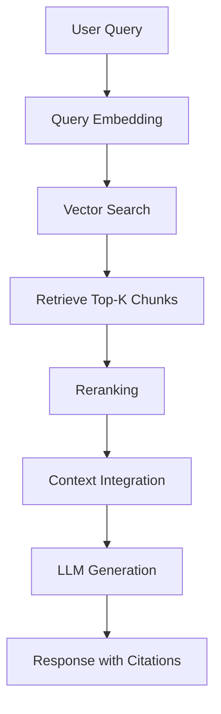
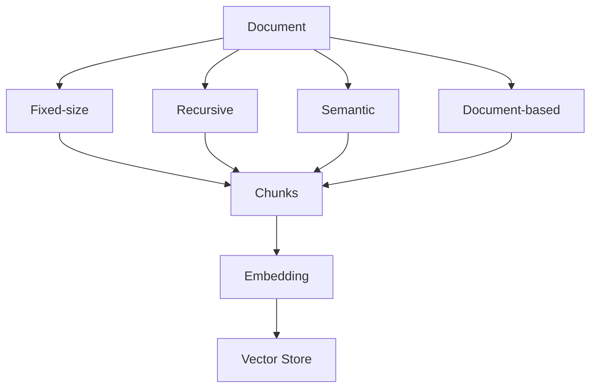
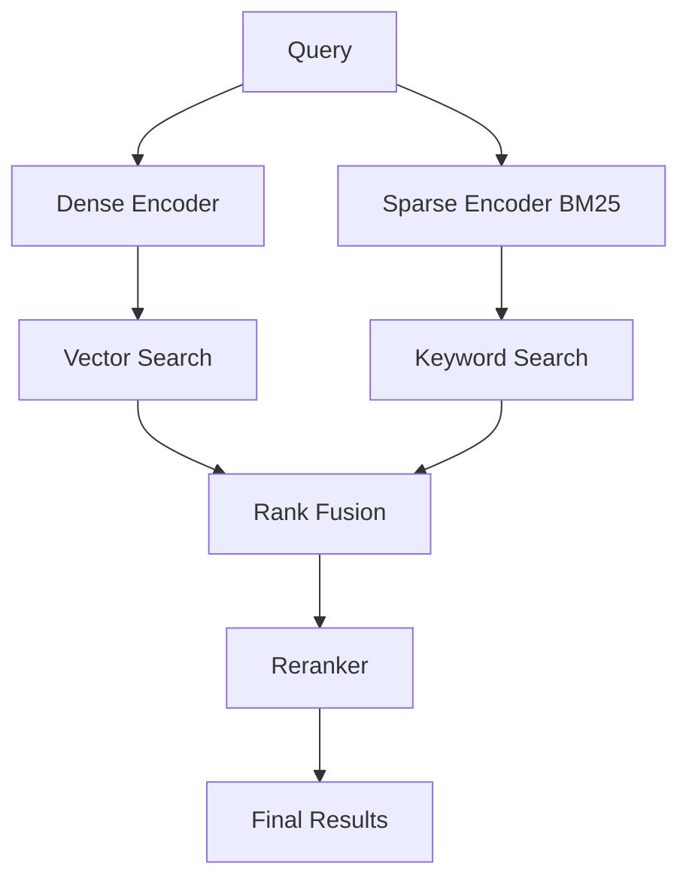
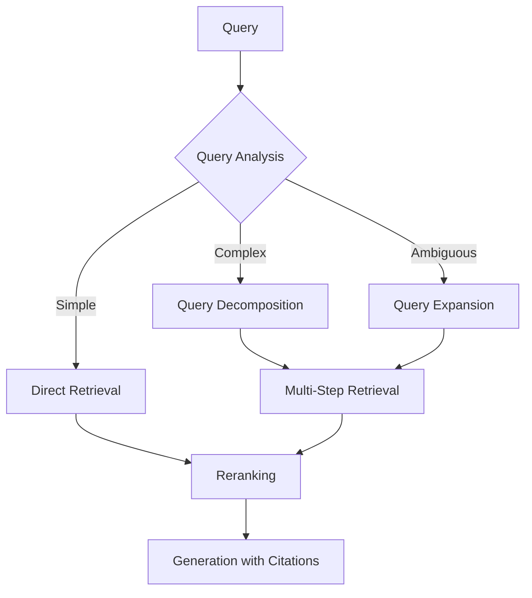

## Table of Contents
- [Introduction](#introduction)
- [Learning Roadmap](#learning-roadmap)
- [Theory Notes](#theory-notes)
- [Key Concepts](#key-concepts)
- [FAQ (30+ Q&A)](#faq-30-qa)
- [Hands-on Practice](#hands-on-practice)
- [FAANG Questions](#faang-questions)
- [Common Mistakes](#common-mistakes)
- [Best Practices](#best-practices)
- [Cheat Sheet](#cheat-sheet)
- [Flash Cards (30)](#flash-cards-30)
- [Mind Map](#mind-map)
- [Mermaid Diagrams](#mermaid-diagrams)
- [Code Examples](#code-examples)
- [Projects](#projects)
- [Resources](#resources)
- [Checklist](#checklist)
- [Revision Plans](#revision-plans)
- [Mock Interviews](#mock-interviews)
- [Difficulty Rating](#difficulty-rating)
- [Summary](#summary)

---

## Introduction

Retrieval Augmented Generation (RAG) combines information retrieval with text generation. Instead of relying solely on an LLM's parametric memory, RAG retrieves relevant documents from an external knowledge base and provides them as context for generation. This grounds LLM responses in verifiable data, reducing hallucination and enabling access to up-to-date or domain-specific information.

RAG has become the standard approach for building knowledge-grounded AI applications like enterprise search, customer support, document Q&A, and research assistants. It bridges the gap between LLM capabilities and real-world knowledge requirements.

Key advantages of RAG:
- **Reduced Hallucination**: Grounding responses in retrieved facts
- **Up-to-date Knowledge**: Access to information beyond training cutoff
- **Domain Specialization**: Custom knowledge bases for specific domains
- **Citations and Attribution**: Traceable source references
- **Cost Efficiency**: No need to fine-tune LLMs for every knowledge update
- **Data Privacy**: Knowledge bases can stay on-premise

---

## Learning Roadmap

### Phase 1: Foundations (Week 1-2)
- Information retrieval basics
- Text embedding models
- Vector similarity search
- Document processing and chunking

### Phase 2: Core RAG Architecture (Week 3-4)
- Indexing pipeline
- Retrieval strategies
- Query processing and expansion
- Context integration with LLMs

### Phase 3: Vector Databases (Week 5-6)
- ChromaDB, Pinecone, Weaviate
- FAISS, Milvus
- Index types (HNSW, IVF, PQ)
- Metadata filtering

### Phase 4: Advanced RAG (Week 7-8)
- Hybrid search (dense + sparse)
- Reranking strategies
- Query routing and decomposition
- Self-RAG and corrective RAG
- Graph RAG

### Phase 5: Production and Evaluation (Week 9-12)
- Chunking optimization
- Evaluation metrics
- Monitoring and observability
- Cost optimization
- Security and access control

---

## Theory Notes

### RAG Pipeline
1. **Ingestion**: Documents are chunked, embedded, and stored in a vector database
2. **Retrieval**: User query is embedded and similar chunks are retrieved
3. **Augmentation**: Retrieved chunks are injected into the LLM prompt
4. **Generation**: LLM generates response using retrieved context

### Document Chunking
How you split documents affects retrieval quality:
- **Fixed-size**: Simple but may split mid-sentence
- **Recursive character splitting**: Respects document structure
- **Semantic chunking**: Splits based on embedding similarity
- **Document-based**: Splits on headings, sections, paragraphs
- **Parent-child**: Small chunks for retrieval, larger context for generation

### Embedding Models
Dense embedding models encode text into fixed-size vectors capturing semantic meaning:
- OpenAI text-embedding-3-small/large
- Sentence-transformers (all-MiniLM-L6-v2, BGE, E5)
- Cohere embed
- Instructor embeddings

Key properties: similarity in embedding space corresponds to semantic similarity.

### Vector Similarity
- **Cosine Similarity**: Most common, measures angle between vectors
- **Euclidean Distance**: Measures straight-line distance
- **Dot Product**: Measures alignment (used with normalized vectors)

### Retrieval Strategies
- **Dense retrieval**: Embedding-based similarity search
- **Sparse retrieval**: BM25, TF-IDF (keyword matching)
- **Hybrid search**: Combines dense and sparse with weighted fusion
- **Multi-query**: Generate multiple query variations and merge results
- **Parent document retrieval**: Retrieve small chunks but return parent context

### Reranking
After initial retrieval, rerank results using a more powerful model:
- Cross-encoder reranking (more accurate but slower)
- ColBERT, Cohere Rerank
- Reciprocal Rank Fusion for combining multiple retrieval results

### Advanced RAG Patterns
- **Query rewriting**: Transform user query for better retrieval
- **Step-back prompting**: Generate broader query before specific one
- **Self-RAG**: Model decides when to retrieve and evaluates retrieval quality
- **Corrective RAG**: Validates retrieved content and corrects if needed
- **Graph RAG**: Uses knowledge graphs for structured retrieval
- **Agentic RAG**: Agent-driven multi-step retrieval and reasoning

### Index Types for Vector Search
- **Flat (Exact)**: Brute-force exact search. Slow but perfect accuracy.
- **IVF (Inverted File)**: Partitions vectors into clusters, searches nearest clusters. Good balance.
- **HNSW**: Hierarchical graph-based approximate nearest neighbor. Fast with good accuracy.
- **PQ (Product Quantization)**: Compresses vectors for memory efficiency. Lower accuracy.
- **IVF-PQ**: Combines IVF and PQ for large-scale, memory-efficient search.

### Chunking Strategies Deep Dive
- **Fixed-size chunking**: Simple token/character count splitting. Fast but crude.
- **Recursive splitting**: Respects natural delimiters (paragraphs, sentences). Better context.
- **Semantic chunking**: Uses embedding similarity to find natural break points. Best context preservation.
- **Sliding window with overlap**: Creates overlapping chunks to preserve boundary context.
- **Document-structure aware**: Uses markdown headers, HTML tags, or PDF structure.

---

## Key Concepts

| Concept | Description |
|---------|-------------|
| Chunking | Splitting documents into retrievable pieces |
| Embedding | Converting text to dense vector representations |
| Vector Database | Storage system for efficient similarity search |
| Hybrid Search | Combining dense (semantic) and sparse (keyword) retrieval |
| Reranking | Re-ordering retrieved results with a more powerful model |
| Self-RAG | Model decides when retrieval is needed |
| Context Window | Maximum tokens for LLM input including retrieved context |
| Chunk Overlap | Overlapping text between chunks to preserve context |
| Metadata | Additional information attached to chunks for filtering |
| Grounding | Connecting LLM outputs to retrieved factual sources |
| HNSW | Hierarchical Navigable Small World index for fast ANN search |
| Cross-Encoder | Reranking model scoring query-document pairs jointly |

---

## FAQ (30+ Q&A)

### Q1: What is RAG and why is it important?
**A:** RAG retrieves relevant documents from external sources before generating responses. It reduces hallucination, enables access to current information, provides citations, and avoids expensive fine-tuning. Essential for knowledge-grounded applications.

### Q2: How do you choose chunk size?
**A:** Depends on use case. Too small: loses context. Too large: dilutes relevance. Start with 256-512 tokens with 50-token overlap. Test different sizes. Consider embedding model context limits and LLM context window.

### Q3: Dense vs sparse retrieval?
**A:** Dense retrieval (embeddings) captures semantic meaning but may miss exact keywords. Sparse retrieval (BM25) excels at exact keyword matching. Hybrid search combines both for best results.

### Q4: What is reranking?
**A:** After initial retrieval, reranking uses a cross-encoder model to re-score each query-document pair more accurately. More computationally expensive but significantly improves relevance. Common: Cohere Rerank, cross-encoder models.

### Q5: What is the chunk overlap and why does it matter?
**A:** Overlap between adjacent chunks (e.g., 50 tokens) ensures important information at chunk boundaries isn't lost. Without overlap, a sentence split across chunks loses context. Too much overlap wastes storage.

### Q6: How do you evaluate RAG systems?
**A:** Retrieval metrics: precision@k, recall@k, MRR, NDCG. Generation metrics: faithfulness, relevance, answer correctness. End-to-end: RAGAS framework, human evaluation. Test with diverse query types.

### Q7: What is hybrid search?
**A:** Combining dense vector search with sparse keyword search (BM25). Uses reciprocal rank fusion or weighted scoring. Handles both semantic queries ("similar to X") and keyword queries ("exact terms").

### Q8: What metadata filtering is available?
**A:** Filter by document type, date, author, category, or any custom metadata. Enables targeted retrieval (e.g., only recent documents, only specific categories). Supported by most vector databases.

### Q9: How do you handle long documents?
**A:** Chunking strategies: section-based, semantic, sliding window. Hierarchical indexing: index summaries and details separately. Map-reduce: retrieve from multiple chunks and synthesize.

### Q10: What is Multi-Query RAG?
**A:** Generating multiple variations of the user query to improve retrieval coverage. Each variation may match different relevant documents. Results are merged and deduplicated before passing to LLM.

### Q11: What is Self-RAG?
**A:** Model that decides whether retrieval is needed for a given query. It can: skip retrieval for simple questions, retrieve when knowledge is needed, and reflect on whether retrieved content is relevant.

### Q12: What is Graph RAG?
**A:** Using knowledge graphs for structured retrieval. Documents are extracted into entities and relationships. Retrieval follows graph paths for multi-hop reasoning. Better for questions requiring relational reasoning.

### Q13: How do you handle query ambiguity?
**A:** Query expansion, HyDE (Hypothetical Document Embeddings), query decomposition into sub-questions, and conversational context integration. Clarification dialogue for truly ambiguous queries.

### Q14: What is the embedding dimension tradeoff?
**A:** Higher dimensions (1536, 3072) capture more nuance but use more storage and compute. Lower dimensions (384, 768) are faster but may lose subtle distinctions. Choose based on your accuracy vs latency requirements.

### Q15: How do you handle multi-modal RAG?
**A:** Embed text and images into shared or aligned vector spaces. Use multi-modal embedding models. For images, use CLIP or similar. Combine text and visual retrieval results.

### Q16: What is contextual compression?
**A:** After retrieving chunks, compress them by extracting only the relevant portions for the specific query. Reduces noise in the context and fits more relevant information in the context window.

### Q17: How do you handle conflicting information in retrieved documents?
**A:** Reranking can prioritize more reliable sources. Implement source credibility scoring. Ask LLM to acknowledge conflicts. Present multiple perspectives. Use recency as a factor.

### Q18: What is the role of prompt engineering in RAG?
**A:** Critical for instructing the LLM on how to use retrieved context. Include clear instructions to answer based on context, cite sources, and acknowledge uncertainty when context is insufficient.

### Q19: How do you monitor RAG systems in production?
**A:** Track retrieval quality (precision, recall), generation quality (faithfulness), latency, and user feedback. Log queries, retrieved documents, and responses. Monitor for distribution shifts.

### Q20: What is the difference between RAG and fine-tuning?
**A:** RAG retrieves external knowledge without modifying the model. Fine-tuning updates model weights with domain knowledge. RAG is better for frequently changing information; fine-tuning for consistent behavior and style.

### Q21: What is HyDE?
**A:** Hypothetical Document Embeddings. Generate a hypothetical answer to the query, embed it, and use that embedding for retrieval. Often retrieves better results because the hypothetical answer is closer to the actual answer in embedding space.

### Q22: What is reciprocal rank fusion (RRF)?
**A:** Method for combining rankings from multiple retrieval methods. Assigns ranks to results from each method, combines using formula: score = sum(1 / (k + rank)). Handles different retrieval methods without score normalization.

### Q23: What is parent-child chunk retrieval?
**A:** Index small chunks for precise retrieval but return the larger parent chunk as context. Balances retrieval precision with generation context quality. Small chunks match better; parent chunks provide fuller context.

### Q24: How do you handle real-time document updates?
**A:** Incremental indexing for new documents. Version control for document changes. Re-embedding changed documents. Some vector databases support real-time updates (Pinecone, Weaviate).

### Q25: What is the difference between dense and sparse embeddings?
**A:** Dense embeddings are continuous vector representations capturing semantic meaning. Sparse embeddings are high-dimensional with mostly zeros, capturing lexical/synsic features. Dense for semantic search, sparse for keyword matching.

### Q26: What is late interaction in retrieval?
**A:** ColBERT-style approach where query and document are encoded independently, then compared via token-level interactions. More efficient than cross-encoders, better quality than bi-encoders.

### Q27: How do you handle multi-turn RAG conversations?
**A:** Maintain conversation history. Use conversation context to clarify/expand queries. Combine current query with previous context for retrieval. Update retrieved context based on conversational flow.

### Q28: What is retrieval augmented fine-tuning (RAFT)?
**A:** Fine-tuning a model to better use retrieved context by training with both relevant and irrelevant documents, teaching the model to focus on useful information and ignore noise.

### Q29: How do you handle domain-specific terminology?
**A:** Domain-adapted embedding models. Custom tokenization for domain terms. Domain-specific chunking (e.g., code-aware splitting). Fine-tuned rerankers for domain relevance.

### Q30: What are the cost considerations for RAG at scale?
**A:** Embedding costs (API calls or self-hosted), vector database hosting, LLM inference for generation, reranking compute, storage for embeddings and chunks, and monitoring infrastructure.

---

## Hands-on Practice

### Basic RAG Pipeline
```python
from langchain.document_loaders import TextLoader
from langchain.text_splitter import RecursiveCharacterTextSplitter
from langchain.embeddings import OpenAIEmbeddings
from langchain.vectorstores import Chroma
from langchain.llms import OpenAI
from langchain.chains import RetrievalQA

loader = TextLoader("documents.txt")
documents = loader.load()

splitter = RecursiveCharacterTextSplitter(
    chunk_size=500, chunk_overlap=50
)
chunks = splitter.split_documents(documents)

embeddings = OpenAIEmbeddings()
vectorstore = Chroma.from_documents(chunks, embeddings)

qa_chain = RetrievalQA.from_chain_type(
    llm=OpenAI(temperature=0),
    retriever=vectorstore.as_retriever(
        search_kwargs={"k": 4}
    ),
    return_source_documents=True
)

result = qa_chain({"query": "What is RAG?"})
```

### Custom Chunking Strategy
```python
class SemanticChunker:
    def __init__(self, embedding_model, threshold=0.5):
        self.embedding_model = embedding_model
        self.threshold = threshold

    def chunk(self, text):
        sentences = text.split('. ')
        embeddings = self.embedding_model.embed(sentences)
        chunks = []
        current_chunk = [sentences[0]]

        for i in range(1, len(sentences)):
            similarity = cosine_similarity(
                embeddings[i-1], embeddings[i]
            )
            if similarity < self.threshold:
                chunks.append('. '.join(current_chunk) + '.')
                current_chunk = [sentences[i]]
            else:
                current_chunk.append(sentences[i])

        if current_chunk:
            chunks.append('. '.join(current_chunk) + '.')
        return chunks
```

---

## FAANG Questions

1. **Google**: Design a RAG system for searching 10M documents with sub-second latency. How do you optimize retrieval?
2. **Meta**: Build a multi-modal RAG system for images and text. How do you handle cross-modal retrieval?
3. **Amazon**: Design a RAG system for customer support handling 1M queries/day with 99.9% uptime.
4. **Apple**: Build an on-device RAG system with limited storage. How do you compress the knowledge base?
5. **Microsoft**: Design a RAG system for enterprise with access control and data privacy.
6. **Google**: How would you evaluate RAG quality at scale without human annotation?
7. **Meta**: Design a RAG system that handles contradictory information from different sources.
8. **Amazon**: Build a RAG system for a chatbot that maintains conversation context across turns.
9. **Google**: How would you optimize RAG for cost while maintaining quality?
10. **OpenAI**: Design a self-improving RAG system that learns from user feedback.
11. **Meta**: Design a RAG system for code documentation that understands code structure.
12. **Amazon**: Build a multi-tenant RAG platform with tenant isolation and customization.

---

## Common Mistakes

1. Chunking that splits important context across chunks
2. Using too small chunks losing necessary context
3. Not testing different embedding models
4. Ignoring metadata for filtering
5. Using only dense retrieval when keywords matter
6. Not implementing reranking for quality
7. Overstuffing the context window with too many chunks
8. Ignoring query processing/rewriting
9. Not evaluating retrieval quality separately from generation
10. Ignoring latency requirements in production
11. Not handling edge cases (empty retrieval, irrelevant results)
12. Using expensive LLMs when smaller models suffice

---

## Best Practices

1. Start with simple chunking, iterate based on evaluation
2. Use hybrid search (dense + sparse) for better coverage
3. Implement reranking for quality-critical applications
4. Test with diverse query types and edge cases
5. Monitor retrieval and generation quality separately
6. Use metadata filtering to narrow search scope
7. Implement fallback strategies when retrieval fails
8. Cache frequent queries for performance
9. Use evaluation frameworks (RAGAS, DeepEval)
10. Log everything for debugging and improvement
11. Consider user feedback loops for continuous improvement
12. Optimize chunk size for your specific domain and queries

---

## Cheat Sheet

### Chunking Strategies
| Strategy | Best For | Chunk Size |
|----------|----------|------------|
| Fixed-size | Simple documents | 256-512 tokens |
| Recursive | Structured documents | 500-1000 tokens |
| Semantic | Narrative text | Variable |
| Document-based | Well-structured docs | Per section |

### Embedding Models
| Model | Dimensions | Speed | Quality |
|-------|-----------|-------|---------|
| text-embedding-3-small | 1536 | Fast | Good |
| text-embedding-3-large | 3072 | Medium | Very Good |
| all-MiniLM-L6-v2 | 384 | Very Fast | Good |
| BGE-large | 1024 | Medium | Very Good |

### Vector Databases
| Database | Type | Best For |
|----------|------|----------|
| ChromaDB | Embedded | Prototyping |
| Pinecone | Managed | Production |
| Weaviate | Self-hosted/Managed | Complex queries |
| FAISS | Library | Local/high-performance |
| Milvus | Distributed | Large-scale |

### Retrieval Methods
| Method | Strengths | Weaknesses |
|--------|-----------|------------|
| Dense | Semantic understanding | Misses exact keywords |
| Sparse (BM25) | Exact keyword match | Misses semantics |
| Hybrid | Best of both | More complex |
| Multi-query | Better coverage | More compute |

---

## Flash Cards (30)

**Card 1:** Q: What is RAG? A: Retrieval Augmented Generation, combining document retrieval with LLM generation for grounded responses.

**Card 2:** Q: What is chunking? A: Splitting documents into smaller pieces for embedding and retrieval.

**Card 3:** Q: What is embedding? A: Converting text into dense vector representations capturing semantic meaning.

**Card 4:** Q: What is hybrid search? A: Combining dense vector search with sparse keyword search for better retrieval.

**Card 5:** Q: What is reranking? A: Re-ordering retrieved results using a more accurate cross-encoder model.

**Card 6:** Q: What is chunk overlap? A: Overlapping text between adjacent chunks to preserve boundary context.

**Card 7:** Q: What is Self-RAG? A: Model that decides when retrieval is needed and evaluates retrieval quality.

**Card 8:** Q: What is MRR? A: Mean Reciprocal Rank, measuring how high the first relevant result appears.

**Card 9:** Q: What is HyDE? A: Hypothetical Document Embeddings, generating a hypothetical answer for better query embedding.

**Card 10:** Q: What is Graph RAG? A: Using knowledge graphs for structured, multi-hop reasoning retrieval.

**Card 11:** Q: What is parent-child retrieval? A: Retrieving small chunks but returning larger parent context for generation.

**Card 12:** Q: What is metadata filtering? A: Using document metadata to narrow retrieval scope (date, category, etc.).

**Card 13:** Q: What is contextual compression? A: Extracting only relevant portions from retrieved chunks for the query.

**Card 14:** Q: What is multi-query RAG? A: Generating multiple query variations to improve retrieval coverage.

**Card 15:** Q: What is faithfulness? A: Whether generated response is supported by retrieved context.

**Card 16:** Q: What is RAGAS? A: RAG Assessment framework for automated evaluation of RAG systems.

**Card 17:** Q: What is vector database? A: Database optimized for storing and querying high-dimensional vectors.

**Card 18:** Q: What is HNSW? A: Hierarchical Navigable Small World, efficient approximate nearest neighbor algorithm.

**Card 19:** Q: What is reciprocal rank fusion? A: Combining rankings from multiple retrieval methods.

**Card 20:** Q: What is agentic RAG? A: Agent-driven multi-step retrieval with reasoning and tool use.

**Card 21:** Q: What is bi-encoder? A: Encoding query and document independently for fast embedding-based retrieval.

**Card 22:** Q: What is cross-encoder? A: Jointly encoding query-document pairs for accurate reranking.

**Card 23:** Q: What is late interaction? A: ColBERT-style approach encoding independently then comparing token-level.

**Card 24:** Q: What is query expansion? A: Adding related terms to improve retrieval recall.

**Card 25:** Q: What is step-back prompting? A: Generating broader query before specific one for better context.

**Card 26:** Q: What is raft? A: Retrieval Augmented Fine-Tuning, training models to better use retrieved context.

**Card 27:** Q: What is incremental indexing? A: Adding new documents to index without full rebuild.

**Card 28:** Q: What is NDCG? A: Normalized Discounted Cumulative Gain, measuring retrieval ranking quality.

**Card 29:** Q: What is precision@k? A: Proportion of top-k retrieved results that are relevant.

**Card 30:** Q: What is recall@k? A: Proportion of all relevant documents found in top-k results.

---

## Mind Map

```
RAG
├── Ingestion
│   ├── Document Loading
│   ├── Chunking
│   ├── Embedding
│   └── Vector Storage
├── Retrieval
│   ├── Dense Search
│   ├── Sparse Search
│   ├── Hybrid Search
│   └── Reranking
├── Generation
│   ├── Context Integration
│   ├── Prompt Engineering
│   └── Source Citation
├── Advanced Patterns
│   ├── Self-RAG
│   ├── Multi-Query
│   ├── Graph RAG
│   └── Agentic RAG
└── Production
    ├── Evaluation
    ├── Monitoring
    └── Optimization
```

---

## Mermaid Diagrams

### RAG Pipeline


### Chunking Strategies


### Hybrid Search Architecture


### Advanced RAG Patterns


---

## Code Examples

### Advanced RAG with Reranking
```python
from langchain.retrievers import ContextualCompressionRetriever
from langchain.retrievers.document_compressors import CohereRerank

compressor = CohereRerank(model="rerank-multilingual-v3.0", top_n=3)
retriever = vectorstore.as_retriever(search_kwargs={"k": 10})
compression_retriever = ContextualCompressionRetriever(
    base_compressor=compressor,
    base_retriever=retriever
)
```

### Multi-Query RAG
```python
from langchain.retrievers.multi_query import MultiQueryRetriever

multi_query_retriever = MultiQueryRetriever.from_llm(
    retriever=vectorstore.as_retriever(),
    llm=OpenAI(temperature=0)
)
```

### BM25 + Dense Hybrid Search
```python
from langchain.retrievers import EnsembleRetriever
from langchain_community.retrievers import BM25Retriever

bm25_retriever = BM25Retriever.from_documents(chunks)
bm25_retriever.k = 5

dense_retriever = vectorstore.as_retriever(search_kwargs={"k": 5})

ensemble_retriever = EnsembleRetriever(
    retrievers=[bm25_retriever, dense_retriever],
    weights=[0.4, 0.6]
)
```

### Self-RAG Style Implementation
```python
class SelfRAG:
    def __init__(self, llm, retriever, threshold=0.5):
        self.llm = llm
        self.retriever = retriever
        self.threshold = threshold

    def shouldRetrieve(self, query):
        prompt = f"Is external knowledge needed to answer: {query}? Yes/No"
        response = self.llm.generate(prompt)
        return "Yes" in response

    def isRelevant(self, query, context):
        prompt = f"Is this context relevant to the query?\nQuery: {query}\nContext: {context}\nRelevant: Yes/No"
        response = self.llm.generate(prompt)
        return "Yes" in response

    def answer(self, query):
        if not self.shouldRetrieve(query):
            return self.llm.generate(query)
        docs = self.retriever.retrieve(query)
        relevant_docs = [d for d in docs if self.isRelevant(query, d.page_content)]
        if not relevant_docs:
            return "I don't have relevant information to answer this question."
        context = "\n".join([d.page_content for d in relevant_docs])
        return self.llm.generate(f"Context: {context}\nQuestion: {query}")
```

---

## Projects

1. **Document Q&A**: Build RAG system for PDF/DOCX documents
2. **Enterprise Search**: RAG with access control and multiple data sources
3. **Customer Support Bot**: RAG-powered chatbot with conversation history
4. **Code Documentation**: RAG for searching and explaining codebases
5. **Research Assistant**: Multi-source RAG with citation tracking
6. **Knowledge Base**: Build a company knowledge base with RAG
7. **Multi-Modal RAG**: RAG system handling text and images together

---

## Resources

- **Papers**: "Retrieval-Augmented Generation for Knowledge-Intensive NLP Tasks" (Lewis 2020), Self-RAG, Corrective RAG
- **Libraries**: LangChain, LlamaIndex, Haystack
- **Vector DBs**: ChromaDB, Pinecone, Weaviate, Milvus, FAISS
- **Evaluation**: RAGAS, DeepEval, TruLens
- **Tools**: LlamaIndex, LangChain, Semantic Kernel

---

## Checklist

- [ ] RAG pipeline understanding
- [ ] Chunking strategies and tradeoffs
- [ ] Embedding models and selection
- [ ] Vector databases (ChromaDB, Pinecone, FAISS)
- [ ] Dense, sparse, and hybrid retrieval
- [ ] Reranking techniques
- [ ] Evaluation metrics (retrieval + generation)
- [ ] Advanced patterns (Self-RAG, Multi-Query)
- [ ] Production optimization
- [ ] Monitoring and observability
- [ ] Cost optimization strategies
- [ ] Index types (HNSW, IVF, PQ)
- [ ] Query processing and expansion
- [ ] Multi-modal RAG basics

---

## Revision Plans

### 2-Week Plan
- Week 1: Core RAG pipeline, chunking, embeddings, vector DBs
- Week 2: Advanced patterns, evaluation, production

### Daily (30 min)
- 10 min: Flash cards
- 10 min: Code practice
- 10 min: Read papers/tutorials

---

## Mock Interviews

1. Design a RAG system for 10M documents with sub-second latency
2. How would you handle contradictory information in retrieved documents?
3. Compare different chunking strategies and their tradeoffs
4. How do you evaluate RAG quality without human annotation?
5. Design a multi-modal RAG system
6. How would you optimize RAG for cost at scale?
7. Explain Self-RAG and when to use it

---

## Difficulty Rating

| Topic | Difficulty | Frequency |
|-------|-----------|-----------|
| Basic RAG Pipeline | Medium | Very High |
| Chunking | Easy-Medium | High |
| Embeddings | Medium | Very High |
| Vector Databases | Medium | High |
| Hybrid Search | Medium | High |
| Reranking | Medium | High |
| Advanced Patterns | Hard | Medium |
| Evaluation | Medium | High |
| Production Optimization | Hard | High |

**Overall: Medium | Preparation: 4-6 weeks**

---

## Summary

RAG is the dominant approach for building knowledge-grounded LLM applications. Master the pipeline (ingestion, retrieval, generation), understand chunking and embedding strategies, know vector databases, and implement advanced patterns (hybrid search, reranking, Self-RAG). Focus on evaluation and production readiness. The key skill is designing RAG architectures that balance retrieval quality, generation quality, latency, and cost.

---

## Deep Dive: Chunking Strategies Comparison

### Chunking Strategy Details
| Strategy | Process | Pros | Cons | Best For |
|----------|---------|------|------|----------|
| Fixed-size | Split every N tokens | Simple, fast | May split sentences | Quick prototyping |
| Recursive | Split on \n\n, \n, ., space | Respects structure | Still may split mid-sentence | General documents |
| Semantic | Split on embedding similarity | Best context preservation | Slower, needs embedding model | Narrative text |
| Document-aware | Split on headers/sections | Respects document structure | Requires structured docs | Technical docs |
| Parent-child | Small for retrieval, large for context | Best of both worlds | More complex setup | Production systems |

### Optimal Chunk Size by Use Case
| Use Case | Recommended Size | Overlap | Rationale |
|----------|-----------------|---------|-----------|
| Q&A | 256-512 tokens | 50 tokens | Balance context and precision |
| Summarization | 512-1024 tokens | 100 tokens | Need broader context |
| Code documentation | 128-256 tokens | 32 tokens | Code blocks are small |
| Legal documents | 512-1024 tokens | 100 tokens | Complex context needed |
| Chat messages | 64-128 tokens | 16 tokens | Short, focused retrieval |
| Research papers | 256-512 tokens | 50 tokens | Dense technical content |

### Embedding Model Selection
| Model | Dimensions | Speed | Quality | Context Length | Cost |
|-------|-----------|-------|---------|---------------|------|
| text-embedding-3-small | 1536 | Fast | Good | 8K tokens | $0.00002/1K |
| text-embedding-3-large | 3072 | Medium | Very Good | 8K tokens | $0.00013/1K |
| all-MiniLM-L6-v2 | 384 | Very Fast | Good | 512 tokens | Free |
| BGE-large-en | 1024 | Medium | Very Good | 512 tokens | Free |
| E5-large-v2 | 1024 | Medium | Very Good | 512 tokens | Free |
| Cohere embed-v3 | 1024 | Fast | Excellent | 512 tokens | $0.1/1M |
| Jina-embeddings-v2 | 768 | Fast | Good | 8K tokens | Free tier |

### Vector Database Comparison
| Database | Type | Performance | Scalability | Features | Best For |
|----------|------|-------------|-------------|----------|----------|
| ChromaDB | Embedded | Medium | Single node | Simple API | Prototyping |
| Pinecone | Managed | High | Auto-scale | Metadata filtering | Production SaaS |
| Weaviate | Self/Managed | High | Horizontal | GraphQL, hybrid | Complex queries |
| FAISS | Library | Very High | Single node | GPU acceleration | Research/local |
| Milvus | Distributed | Very High | Very High | sharding, GPU | Enterprise scale |
| Qdrant | Self/Managed | High | Horizontal | Filtering, quantization | Performance |
| pgvector | Extension | Medium | PostgreSQL scale | SQL integration | Existing PG users |

### Retrieval Method Deep Dive

#### BM25 Algorithm
```
score(D, Q) = sum IDF(q_i) * (f(q_i, D) * (k1 + 1)) / (f(q_i, D) + k1 * (1 - b + b * |D|/avgdl))
```
- f(q,D): term frequency of q in document D
- IDF(q): inverse document frequency
- k1: term frequency saturation (typically 1.5-2.0)
- b: length normalization (typically 0.75)

#### Dense Retrieval
Uses bi-encoder to encode query and document independently:
- Query encoder: q = encode(query) → dense vector
- Document encoder: d = encode(doc) → dense vector
- Score: cosine_similarity(q, d) or dot_product(q, d)
- Fast: documents pre-encoded, only query encoded at query time

#### Hybrid Search Fusion
Reciprocal Rank Fusion (RRF):
```
RRF_score(d) = sum(1 / (k + rank_i(d))) for each retrieval method i
```
k=60 is typical. Combines rankings without needing score normalization.

### RAG Evaluation Metrics
| Metric | Measures | Tool |
|--------|----------|------|
| Faithfulness | Response supported by context | RAGAS |
| Answer Relevance | Response answers the question | RAGAS |
| Context Precision | Retrieved context is relevant | RAGAS |
| Context Recall | All relevant context retrieved | RAGAS |
| Hallucination Rate | % of unsupported claims | Human eval |
| Citation Accuracy | Sources correctly referenced | Human eval |

### Advanced RAG Patterns Deep Dive

#### Self-RAG Process
1. Generate initial response without retrieval
2. Evaluate if retrieval is needed (relevance token)
3. If yes, retrieve and re-generate
4. Evaluate retrieved context relevance (ISREL token)
5. Evaluate response support by context (ISSUP token)
6. Self-reflect on overall response quality (ISUSE token)

#### Graph RAG Process
1. Extract entities and relationships from documents
2. Build knowledge graph with entity nodes and relationship edges
3. For queries, traverse graph paths to find relevant subgraphs
4. Use graph structure for multi-hop reasoning
5. Combine graph context with text context for generation

---

## RAG System Architecture Reference

### Vector Database Comparison
| Database | Speed | Scalability | Cost | Best For |
|----------|-------|-------------|------|----------|
| Pinecone | Very High | Managed | $$$ | Production, ease of use |
| Weaviate | High | Horizontal | $$ | Multi-modal, hybrid search |
| Qdrant | Very High | Horizontal | $ | High performance |
| Milvus | High | Very High | $ | Large scale |
| Chroma | Medium | Limited | Free | Prototyping |
| FAISS | Very High | Single-node | Free | Research, embedding search |
| pgvector | Medium | Vertical | $ | PostgreSQL integration |

### Chunking Strategy Deep Dive
| Strategy | Description | Best For | Drawbacks |
|----------|-------------|----------|-----------|
| Fixed-size | Split every N tokens | Simple documents | Splits mid-sentence |
| Recursive | Split by separators (paragraphs, sentences) | General purpose | May miss boundaries |
| Semantic | Split at semantic boundaries | High-quality retrieval | Computationally expensive |
| Document-based | Split by document structure (headers) | Structured documents | Requires document format |
| Parent-child | Small chunks for retrieval, parent for context | Complex documents | Indexing overhead |
| Agentic | LLM decides split points | Complex documents | High latency |

### Retrieval Quality Metrics
| Metric | Description | Target |
|--------|-------------|--------|
| Recall@k | Proportion of relevant docs in top-k | >0.9 |
| Precision@k | Proportion of retrieved docs that are relevant | >0.7 |
| MRR | Mean reciprocal rank of first relevant result | >0.8 |
| NDCG | Normalized discounted cumulative gain | >0.8 |
| Hit Rate | Whether at least one relevant doc is retrieved | >0.95 |
| Faithfulness | Whether answer is grounded in context | >0.9 |
| Relevance | Whether context is relevant to question | >0.8 |

### Embedding Model Comparison
| Model | Dimensions | Speed | Quality | Best For |
|-------|-----------|-------|---------|----------|
| OpenAI text-embedding-3-small | 1536 | Fast | Good | General use |
| OpenAI text-embedding-3-large | 3072 | Medium | Very Good | High accuracy |
| BGE-large | 1024 | Fast | Very Good | Open-source |
| E5-large | 1024 | Fast | Very Good | Cross-domain |
| Cohere embed-v3 | 1024 | Fast | Excellent | Multi-lingual |
| GTE-large | 1024 | Fast | Excellent | Technical content |
| Jina-embeddings-v2 | 768 | Fast | Very Good | Long documents |

### RAG Pipeline Decision Tree
```
Query arrives
├── Simple factual query?
│   ├── Yes → Direct retrieval (top 3-5 chunks)
│   └── No → Complex query?
│       ├── Multi-hop reasoning?
│       │   ├── Yes → Graph RAG or iterative retrieval
│       │   └── No → Need aggregation?
│       │       ├── Yes → Multi-source retrieval with reranking
│       │       └── No → Standard RAG with reranking
│       └── Domain-specific?
│           ├── Yes → Fine-tuned embeddings + domain chunking
│           └── No → General embeddings
└── Output quality check
    ├── Faithful → Return answer
    └── Not faithful → Rephrase or retrieve more context
```

### Common RAG Interview Scenarios
| Scenario | Approach | Key Considerations |
|----------|----------|-------------------|
| 10M+ documents | Hierarchical indexing, sharding | Scalability, latency |
| Multi-lingual | Multilingual embeddings, language detection | Cross-lingual retrieval |
| Real-time chat | Cache, pre-computed embeddings | <500ms response time |
| Legal/medical docs | High chunk overlap, citation tracking | Accuracy critical |
| Code documentation | AST-aware chunking, code embeddings | Syntax preservation |
| PDF with tables | Layout-aware parsing, table extraction | Structure preservation |
| Video content | Frame extraction, ASR, multimodal embeddings | Temporal alignment |

---

## Interview Quick Reference Card

### Top 10 RAG Interview Questions
1. **RAG pipeline**: Ingestion → Embedding → Retrieval → Augmentation → Generation
2. **Chunk size trade-off**: Small = precise retrieval but less context; Large = more context but diluted relevance
3. **Dense vs sparse**: Dense captures semantics, sparse captures exact keywords, hybrid is best
4. **Reranking**: Cross-encoder re-scores query-doc pairs for higher accuracy after initial retrieval
5. **Hybrid search**: Combines dense vector + BM25 with RRF for best of both worlds
6. **Metadata filtering**: Filter by date, category, source for targeted retrieval
7. **Self-RAG**: Model decides when retrieval is needed and evaluates quality
8. **Graph RAG**: Uses knowledge graphs for multi-hop reasoning queries
9. **Evaluation**: RAGAS framework for automated faithfulness/relevance metrics
10. **Cost optimization**: Right-size chunks, cache frequent queries, use smaller LLMs for simple queries

### RAG Architecture Decision Guide
| Requirement | Recommendation |
|-------------|---------------|
| Simple Q&A | Basic RAG with ChromaDB |
| Enterprise search | Hybrid search + reranking + access control |
| Multi-hop questions | Graph RAG or iterative retrieval |
| Code documentation | Code-aware chunking + syntax highlighting |
| Multi-modal | CLIP embeddings + text embeddings |
| Low latency | Pre-computed embeddings + FAISS + caching |
| High accuracy | Self-RAG + cross-encoder reranking |

### Key Formulas Reference
- **Cosine similarity**: cos(A, B) = A·B / (||A|| * ||B||)
- **BM25**: sum(IDF(q) * tf(q,d) * (k1+1) / (tf(q,d) + k1*(1-b+b*|d|/avgdl)))
- **RRF**: sum(1/(k + rank_i(d))) for each method
- **Precision@k**: relevant_in_top_k / k
- **Recall@k**: relevant_in_top_k / total_relevant
- **MRR**: 1/Q * sum(1/rank_i) where rank_i is first relevant result
- **NDCG**: DCG / IDCG where DCG = sum(rel_i / log2(i+1))
