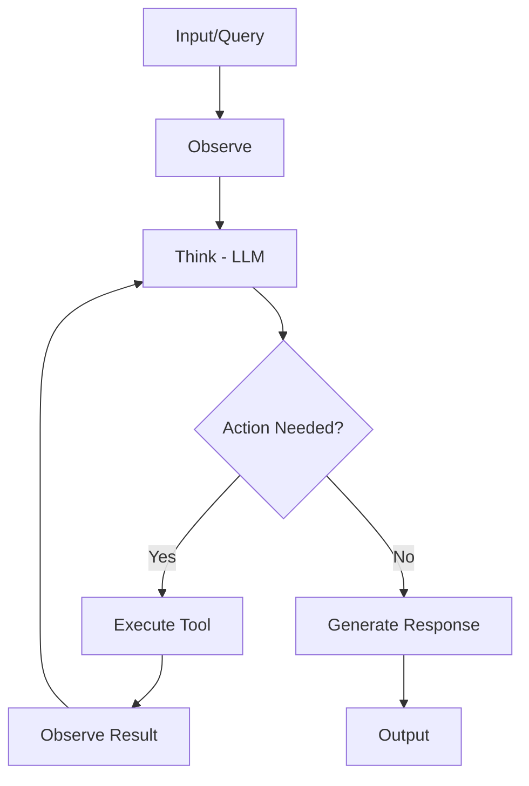
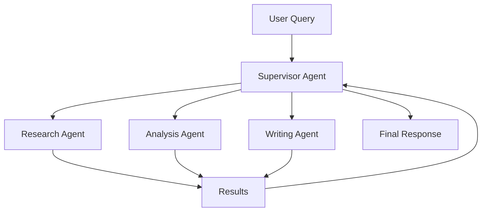
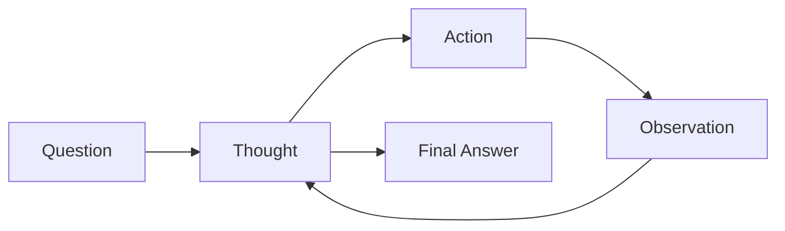
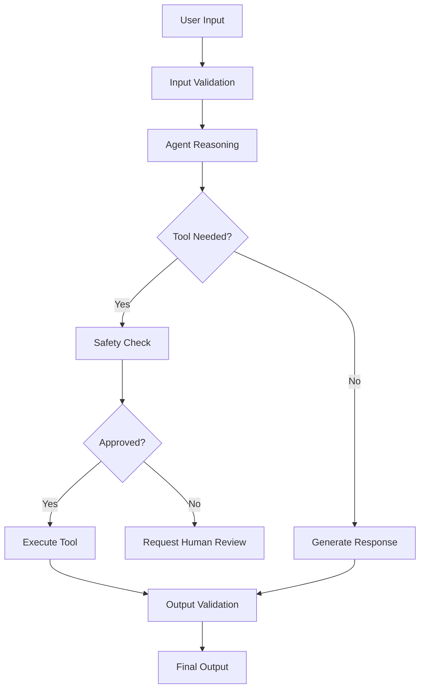

## Table of Contents
- [Introduction](#introduction)
- [Learning Roadmap](#learning-roadmap)
- [Theory Notes](#theory-notes)
- [Key Concepts](#key-concepts)
- [FAQ (30+ Q&A)](#faq-30-qa)
- [Hands-on Practice](#hands-on-practice)
- [FAANG Questions](#faang-questions)
- [Common Mistakes](#common-mistakes)
- [Best Practices](#best-practices)
- [Cheat Sheet](#cheat-sheet)
- [Flash Cards (30)](#flash-cards-30)
- [Mind Map](#mind-map)
- [Mermaid Diagrams](#mermaid-diagrams)
- [Code Examples](#code-examples)
- [Projects](#projects)
- [Resources](#resources)
- [Checklist](#checklist)
- [Revision Plans](#revision-plans)
- [Mock Interviews](#mock-interviews)
- [Difficulty Rating](#difficulty-rating)
- [Summary](#summary)

---

## Introduction

AI Agents are autonomous systems powered by LLMs that can reason, plan, use tools, and take actions to accomplish goals. Unlike simple chatbots that generate text, agents can interact with external systems, execute code, browse the web, manage files, and coordinate with other agents.

Agent architectures typically combine an LLM "brain" with tools, memory, and planning capabilities. They represent the frontier of LLM applications, enabling complex multi-step tasks that require decision-making, tool use, and adaptive behavior.

Key agent capabilities:
- **Reasoning**: Breaking down complex problems into steps
- **Tool Use**: Interacting with APIs, databases, and external services
- **Planning**: Creating and executing multi-step plans
- **Memory**: Maintaining context across interactions
- **Reflection**: Self-evaluating and improving outputs
- **Collaboration**: Working with other agents on complex tasks

---

## Learning Roadmap

### Phase 1: Agent Fundamentals (Week 1-2)
- Agent loop (Observe, Think, Act)
- Tool use and function calling
- ReAct framework
- Simple agent architectures

### Phase 2: Memory Systems (Week 3-4)
- Short-term memory (conversation history)
- Long-term memory (vector stores)
- Working memory (scratchpad)
- Memory retrieval and management

### Phase 3: Planning Strategies (Week 5-6)
- Task decomposition
- ReAct and plan-and-execute
- Reflection and self-critique
- Hierarchical planning

### Phase 4: Multi-Agent Systems (Week 7-8)
- Agent communication protocols
- Supervisor-worker patterns
- Debate and consensus
- Specialized agent roles

### Phase 5: Frameworks and Production (Week 9-12)
- LangChain agents
- AutoGPT / AgentGPT
- CrewAI
- Safety and guardrails
- Evaluation and monitoring
- Production deployment

---

## Theory Notes

### Agent Architecture
The core agent loop:
1. **Observe**: Receive input (user query, environment state)
2. **Think**: LLM reasons about what to do
3. **Act**: Execute tool or generate response
4. **Observe Result**: Process action outcome
5. **Repeat** until goal achieved

### Tool Use
Agents use tools (APIs, code executors, search engines) to interact with the world:
- **Function calling**: LLM generates structured tool invocations
- **API wrappers**: Connect to external services
- **Code execution**: Write and run code
- **File operations**: Read/write/manage files

### ReAct (Reasoning + Acting)
Combines reasoning traces with actions:
```
Thought: I need to find the population of France
Action: search("population of France 2024")
Observation: France has approximately 68 million people
Thought: I have the information
Action: respond("France has approximately 68 million people")
```

### Memory Systems
- **Short-term**: Current conversation context (context window)
- **Long-term**: Persistent storage (vector database)
- **Working**: Scratchpad for current task state
- **Episodic**: Past experiences for reference
- **Semantic**: Facts and knowledge

### Planning Strategies
- **Plan-and-execute**: Generate full plan first, then execute step by step
- **ReAct**: Interleave reasoning and acting
- **Reflection**: Evaluate and improve own outputs
- **Self-critique**: Identify and fix errors
- **Hierarchical**: Break into sub-tasks delegated to specialized agents

### Multi-Agent Patterns
- **Supervisor**: One agent coordinates others
- **Peer-to-peer**: Agents collaborate as equals
- **Debate**: Agents argue different perspectives
- **Specialization**: Each agent handles specific tasks
- **Sequential pipeline**: Agents process in order

### Frameworks
- **LangChain**: Comprehensive agent framework with tool integration
- **AutoGPT**: Fully autonomous agent with goals
- **CrewAI**: Multi-agent collaboration framework
- **Semantic Kernel**: Microsoft's agent framework
- **LangGraph**: Stateful agent graphs with cycles

### Agent Safety
- **Tool restrictions**: Limit available tools to necessary ones
- **Rate limiting**: Prevent excessive tool calls
- **Output validation**: Check for harmful or incorrect outputs
- **Human-in-the-loop**: Require approval for critical actions
- **Sandboxing**: Run code execution in isolated environments
- **Timeout mechanisms**: Prevent infinite loops

### Agent Evaluation
- **Task completion rate**: Percentage of tasks successfully completed
- **Step efficiency**: Number of steps taken vs optimal
- **Tool usage accuracy**: Correct tool selection and invocation
- **Reasoning quality**: Coherence and correctness of thought traces
- **Error recovery**: Ability to detect and recover from failures
- **Cost efficiency**: Token usage per task completion

---

## Key Concepts

| Concept | Description |
|---------|-------------|
| Agent Loop | Observe-Think-Act cycle |
| Tool Use | LLM calling external functions/APIs |
| Function Calling | Structured tool invocation format |
| Memory | Storing and retrieving past information |
| Planning | Decomposing goals into actionable steps |
| Reflection | Self-evaluation and improvement |
| Guardrails | Safety constraints on agent behavior |
| Orchestration | Managing multi-agent coordination |
| State Management | Tracking agent progress and context |
| Grounding | Connecting actions to verified information |
| Scratchpad | Working memory for intermediate reasoning |
| Human-in-the-loop | Requiring human approval for critical actions |

---

## FAQ (30+ Q&A)

### Q1: What is an AI agent?
**A:** An autonomous system that uses an LLM as its reasoning engine, combined with tools, memory, and planning capabilities. Agents can observe their environment, make decisions, take actions, and work toward goals.

### Q2: What is the agent loop?
**A:** The cycle of Observe (receive input), Think (reason about actions), Act (execute tools/generate response), and Observe Result. This loop continues until the task is complete or a stopping condition is met.

### Q3: What is function calling?
**A:** The LLM generating structured JSON to invoke external functions. The framework executes the function and returns results to the LLM. Enables agents to use tools like search, calculation, and API calls.

### Q4: What is ReAct?
**A:** Framework combining Reasoning (thought traces) and Acting (tool calls). The agent alternates between thinking about what to do and taking actions, creating an interpretable reasoning chain.

### Q5: How do agents manage memory?
**A:** Short-term memory uses conversation history within context window. Long-term memory uses vector stores for persistent information. Working memory tracks current task state. Memory retrieval brings relevant past information.

### Q6: What is the difference between an agent and a chain?
**A:** Chains follow predetermined steps. Agents dynamically decide what actions to take based on the situation. Agents are more flexible but harder to predict and debug.

### Q7: What is multi-agent collaboration?
**A:** Multiple specialized agents working together on complex tasks. Can use supervisor-worker patterns, peer-to-peer communication, or debate mechanisms. Enables handling complex tasks requiring diverse expertise.

### Q8: What are agent guardrails?
**A:** Safety constraints preventing agents from taking harmful actions. Include: tool restrictions, output validation, human-in-the-loop approval, rate limiting, and behavioral guidelines in system prompts.

### Q9: How do you evaluate agent performance?
**A:** Task completion rate, efficiency (steps taken), tool usage accuracy, reasoning quality, error recovery, and user satisfaction. Use benchmarks like AgentBench and task-specific evaluations.

### Q10: What is plan-and-execute?
**A:** Generating a complete plan before execution. Agent creates step-by-step plan, then executes each step, potentially re-planning if steps fail. More structured than ReAct but less adaptive.

### Q11: What is reflection in agents?
**A:** Agent evaluating its own outputs and reasoning, identifying errors or improvements, and refining its approach. Can be self-reflection or external critique. Improves quality over multiple iterations.

### Q12: How do you handle agent errors?
**A:** Error detection through output validation, retry mechanisms with modified approaches, fallback strategies, human escalation for critical failures, and learning from past errors.

### Q13: What is the tool selection problem?
**A:** Choosing the right tool for a given task. Solved by: describing tools in system prompts, using embedding similarity for tool retrieval, and training models for tool selection.

### Q14: How do you prevent agent loops?
**A:** Maximum step limits, repetition detection, progress tracking, timeout mechanisms, and forced stopping conditions. Critical for production reliability.

### Q15: What is hierarchical agent planning?
**A:** Breaking complex tasks into sub-tasks delegated to specialized agents. A coordinator agent manages the hierarchy. Enables specialization and parallel execution.

### Q16: How do agents handle uncertainty?
**A:** Requesting additional information, making probabilistic decisions, trying multiple approaches, asking for human guidance, and gracefully handling ambiguous situations.

### Q17: What is the difference between LangChain and AutoGPT?
**A:** LangChain provides flexible agent building blocks with tool integration. AutoGPT is a fully autonomous agent with goal-directed behavior. LangChain is more composable; AutoGPT is more out-of-the-box.

### Q18: How do you debug agent behavior?
**A:** Logging reasoning traces, tracking tool calls and results, visualizing agent state, using observability tools (LangSmith), and replaying agent sessions step by step.

### Q19: What is human-in-the-loop for agents?
**A:** Requiring human approval for critical actions. Balances autonomy with safety. Use for: high-stakes decisions, irreversible actions, and sensitive domains. Can be mandatory or optional.

### Q20: What are the main challenges with agents?
**A:** Reliability (agents can go off track), cost (many LLM calls), latency (multi-step processes), safety (unintended actions), and evaluation (hard to benchmark open-ended tasks).

### Q21: What is a tool schema?
**A:** Structured definition of a tool including its name, description, input parameters, and output format. Used by LLMs to understand when and how to use each tool. Critical for reliable function calling.

### Q22: What is state management in agents?
**A:** Tracking the agent's progress, context, and intermediate results across steps. Includes conversation history, task state, and working memory. Essential for multi-step reasoning.

### Q23: What is agent observability?
**A:** Monitoring and logging agent behavior: reasoning traces, tool calls, decisions, and outcomes. Enables debugging, performance optimization, and safety monitoring in production.

### Q24: What is retry logic in agents?
**A:** Automatically retrying failed tool calls or actions with modified parameters or alternative approaches. Implements exponential backoff and maximum retry limits for resilience.

### Q25: What is agent cost optimization?
**A:** Reducing token usage through efficient prompting, using smaller models for simple tasks, caching frequent operations, and limiting unnecessary reasoning steps.

### Q26: What is an agent orchestrator?
**A:** A system managing multiple agents, coordinating their work, handling inter-agent communication, and resolving conflicts. Can be a separate LLM or rule-based system.

### Q27: What is tool grounding?
**A:** Ensuring tool calls are based on actual model reasoning rather than hallucination. Validates that the agent correctly identifies when tools are needed and invokes them appropriately.

### Q28: What is a stopping condition?
**A:** Criteria for when the agent should stop executing. Can be: task completion, maximum steps reached, timeout, quality threshold met, or human intervention requested.

### Q29: What is agent memory retrieval?
**A:** Selectively retrieving relevant past information from long-term memory to augment current reasoning. Uses similarity search on vector stores. Balances context freshness with relevance.

### Q30: What is adaptive planning?
**A:** Modifying plans based on intermediate results and new information. Agent can: revise steps, add new tasks, skip unnecessary steps, or change approach entirely. Key for robustness.

---

## Hands-on Practice

### Simple ReAct Agent
```python
from langchain.agents import initialize_agent, Tool
from langchain.llms import OpenAI

def search(query):
    # Simplified search
    return f"Search results for: {query}"

def calculator(expression):
    return str(eval(expression))

tools = [
    Tool(name="Search", func=search, description="Search the web"),
    Tool(name="Calculator", func=calculator, description="Calculate math")
]

llm = OpenAI(temperature=0)
agent = initialize_agent(
    tools, llm, agent="react-docstore", verbose=True
)
agent.run("What is the population of France times 2?")
```

### Agent with Memory
```python
from langchain.memory import ConversationBufferWindowMemory

memory = ConversationBufferWindowMemory(
    memory_key="chat_history",
    return_messages=True,
    k=10
)

agent = initialize_agent(
    tools, llm,
    agent="conversational-react-description",
    memory=memory,
    verbose=True
)
```

### Custom Agent with Tool
```python
from langchain.agents import AgentExecutor, create_openai_tools_agent
from langchain_core.prompts import ChatPromptTemplate

prompt = ChatPromptTemplate.from_messages([
    ("system", "You are a helpful assistant. Use tools when needed."),
    ("human", "{input}"),
    ("placeholder", "{agent_scratchpad}"),
])

agent = create_openai_tools_agent(llm, tools, prompt)
executor = AgentExecutor(agent=agent, tools=tools, verbose=True)
result = executor.invoke({"input": "Research topic X"})
```

---

## FAANG Questions

1. **Google**: Design an AI agent that can manage a software development project. What tools would it need?
2. **Meta**: Build a multi-agent system for content moderation with text and image agents.
3. **Amazon**: Design a customer support agent that can handle returns, track orders, and escalate issues.
4. **Apple**: Build an on-device agent for personal productivity with privacy constraints.
5. **Microsoft**: Design an agent that automates data analysis workflows end-to-end.
6. **Google**: How would you evaluate and benchmark agent performance reliably?
7. **Meta**: Design a multi-agent debate system for fact-checking.
8. **Amazon**: Build an agent that can negotiate prices with multiple vendors.
9. **Anthropic**: How would you ensure an agent stays safe while remaining useful?
10. **Google**: Design an agent coordination system for disaster response scenarios.
11. **Meta**: Design an agent framework for automating research paper analysis.
12. **Amazon**: Build a multi-agent system for supply chain optimization.

---

## Common Mistakes

1. Not setting maximum step limits (agent loops forever)
2. Giving agents too many tools (confuses tool selection)
3. Not implementing error recovery
4. Ignoring cost implications of multi-step reasoning
5. Not logging agent reasoning traces
6. Skipping human-in-the-loop for critical actions
7. Not testing with adversarial inputs
8. Ignoring latency in multi-agent systems
9. Not implementing guardrails for tool use
10. Underestimating the complexity of production agents

---

## Best Practices

1. Start with simple agents, add complexity gradually
2. Limit available tools to those truly needed
3. Implement comprehensive logging and observability
4. Set step limits and timeout mechanisms
5. Use human-in-the-loop for critical decisions
6. Test extensively with diverse scenarios
7. Implement proper error handling and fallbacks
8. Monitor costs and optimize token usage
9. Design clear stopping conditions
10. Document agent capabilities and limitations
11. Implement safety guardrails from the start
12. Plan for graceful degradation

---

## Cheat Sheet

### Agent Patterns
| Pattern | Description | Best For |
|---------|-------------|----------|
| ReAct | Interleave reasoning and acting | General tasks |
| Plan-and-execute | Plan first, then execute | Structured tasks |
| Reflection | Self-evaluate and improve | Quality-critical |
| Multi-agent | Multiple specialized agents | Complex workflows |
| Hierarchical | Coordinator + workers | Large-scale tasks |

### Key Frameworks
| Framework | Strengths |
|-----------|-----------|
| LangChain | Flexible, rich tool ecosystem |
| AutoGPT | Fully autonomous |
| CrewAI | Multi-agent collaboration |
| Semantic Kernel | Enterprise integration |
| LlamaIndex | Data-focused agents |
| LangGraph | Stateful agent graphs |

### Agent Safety Checklist
| Safety Measure | Implementation |
|---------------|----------------|
| Step limits | Maximum iterations enforced |
| Tool restrictions | Whitelist of allowed tools |
| Output validation | Check for harmful content |
| Human approval | Critical action gating |
| Timeout | Maximum execution time |
| Rate limiting | Tool call frequency caps |

---

## Flash Cards (30)

**Card 1:** Q: What is an AI agent? A: Autonomous system using LLM reasoning with tools, memory, and planning to accomplish goals.

**Card 2:** Q: What is the agent loop? A: Observe-Think-Act cycle repeated until task completion.

**Card 3:** Q: What is function calling? A: LLM generating structured JSON to invoke external tools/APIs.

**Card 4:** Q: What is ReAct? A: Framework combining reasoning traces with action execution.

**Card 5:** Q: What is plan-and-execute? A: Generating complete plan before step-by-step execution.

**Card 6:** Q: What is agent memory? A: Systems for storing conversation history, long-term info, and working state.

**Card 7:** Q: What is tool selection? A: Choosing the right tool for a given task from available options.

**Card 8:** Q: What are agent guardrails? A: Safety constraints preventing harmful actions.

**Card 9:** Q: What is multi-agent collaboration? A: Multiple specialized agents working together on complex tasks.

**Card 10:** Q: What is reflection? A: Agent evaluating and improving its own outputs and reasoning.

**Card 11:** Q: What is human-in-the-loop? A: Requiring human approval for critical agent actions.

**Card 12:** Q: What is an agent scratchpad? A: Working memory for current task state and intermediate results.

**Card 13:** Q: How to prevent agent loops? A: Step limits, repetition detection, timeouts, and stopping conditions.

**Card 14:** Q: What is agent observability? A: Logging and monitoring reasoning traces, tool calls, and decisions.

**Card 15:** Q: What is error recovery in agents? A: Detecting failures and retrying with modified approaches.

**Card 16:** Q: What is the supervisor pattern? A: One coordinating agent managing specialized worker agents.

**Card 17:** Q: What is agent evaluation? A: Measuring task completion, efficiency, accuracy, and safety.

**Card 18:** Q: What is tool grounding? A: Ensuring tool calls are based on actual model reasoning, not hallucination.

**Card 19:** Q: What is state management? A: Tracking agent progress, context, and intermediate results.

**Card 20:** Q: What is the main agent challenge? A: Reliability, safety, cost, and evaluation of open-ended behavior.

**Card 21:** Q: What is a tool schema? A: Structured definition of tool name, description, parameters, and outputs.

**Card 22:** Q: What is adaptive planning? A: Modifying plans based on intermediate results and new information.

**Card 23:** Q: What is agent cost optimization? A: Reducing token usage through efficient prompting and caching.

**Card 24:** Q: What is agent orchestration? A: System managing multiple agents and coordinating their work.

**Card 25:** Q: What is a stopping condition? A: Criteria for when the agent should stop executing.

**Card 26:** Q: What is memory retrieval? A: Selectively fetching relevant past information from long-term memory.

**Card 27:** Q: What is exponential backoff? A: Retry strategy increasing delay between attempts for resilience.

**Card 28:** Q: What is agent benchmarking? A: Systematically measuring agent performance on standardized tasks.

**Card 29:** Q: What is LangGraph? A: Framework for building stateful agent graphs with cycles and conditional logic.

**Card 30:** Q: What is agent sandboxing? A: Running tool execution in isolated environments for safety.

---

## Mind Map

```
AI Agents
├── Core Loop
│   ├── Observe
│   ├── Think (LLM)
│   ├── Act (Tools)
│   └── Repeat
├── Components
│   ├── LLM Brain
│   ├── Tools/Functions
│   ├── Memory Systems
│   └── Planning
├── Patterns
│   ├── ReAct
│   ├── Plan-and-Execute
│   ├── Reflection
│   └── Multi-Agent
├── Frameworks
│   ├── LangChain
│   ├── AutoGPT
│   ├── CrewAI
│   └── Semantic Kernel
└── Production
    ├── Safety/Guardrails
    ├── Monitoring
    ├── Cost Control
    └── Evaluation
```

---

## Mermaid Diagrams

### Agent Loop


### Multi-Agent System


### ReAct Flow


### Agent Safety Architecture


---

## Code Examples

### CrewAI Multi-Agent
```python
from crewai import Agent, Task, Crew

researcher = Agent(
    role="Research Analyst",
    goal="Find comprehensive information",
    backstory="Expert at research",
    tools=[search_tool]
)

writer = Agent(
    role="Content Writer",
    goal="Write engaging content",
    backstory="Experienced writer",
    tools=[]
)

research_task = Task(
    description="Research AI agent architectures",
    agent=researcher
)

write_task = Task(
    description="Write a report based on research",
    agent=writer
)

crew = Crew(
    agents=[researcher, writer],
    tasks=[research_task, write_task],
    verbose=True
)

result = crew.kickoff()
```

### LangGraph Agent
```python
from langgraph.graph import StateGraph, END
from typing import TypedDict, Annotated

class AgentState(TypedDict):
    messages: list
    next_action: str

def agent_node(state):
    # LLM reasoning
    response = llm.invoke(state["messages"])
    return {"messages": state["messages"] + [response]}

def tool_node(state):
    # Execute tool based on last message
    tool_call = state["messages"][-1].tool_calls[0]
    result = execute_tool(tool_call)
    return {"messages": state["messages"] + [result]}

graph = StateGraph(AgentState)
graph.add_node("agent", agent_node)
graph.add_node("tools", tool_node)
graph.add_conditional_edges("agent", should_use_tool)
graph.add_edge("tools", "agent")
graph.set_entry_point("agent")
app = graph.compile()
```

### Agent with Custom Tool
```python
from langchain.tools import BaseTool
from pydantic import BaseModel, Field

class SearchInput(BaseModel):
    query: str = Field(description="Search query")

class SearchTool(BaseTool):
    name = "web_search"
    description = "Search the web for information"
    args_schema = SearchInput

    def _run(self, query: str) -> str:
        # Implement actual search
        return f"Results for: {query}"

    async def _arun(self, query: str) -> str:
        return self._run(query)
```

---

## Projects

1. **Research Agent**: Agent that researches topics using web search and summarization
2. **Code Assistant**: Agent that writes, tests, and debugs code
3. **Data Analysis Agent**: Agent that explores, analyzes, and visualizes data
4. **Multi-Agent Debate**: System where agents debate different perspectives
5. **Personal Assistant**: Agent managing calendar, email, and tasks
6. **Customer Support Agent**: Multi-turn agent with knowledge base integration
7. **Trading Agent**: Agent that analyzes markets and executes trades

---

## Resources

- **Frameworks**: LangChain, AutoGPT, CrewAI, Semantic Kernel
- **Papers**: ReAct, Toolformer, Generative Agents
- **Courses**: DeepLearning.AI "AI Agents in LangGraph"
- **Tools**: LangSmith (observability), Weights & Biases
- **Libraries**: LangGraph, LlamaIndex Agents, Haystack

---

## Checklist

- [ ] Agent loop (Observe-Think-Act)
- [ ] Tool use and function calling
- [ ] ReAct framework
- [ ] Memory systems (short/long/working)
- [ ] Planning strategies
- [ ] Multi-agent patterns
- [ ] Guardrails and safety
- [ ] Error handling
- [ ] Evaluation methods
- [ ] Framework proficiency
- [ ] Production deployment
- [ ] State management
- [ ] Cost optimization
- [ ] Observability and monitoring

---

## Revision Plans

### 2-Week Plan
- Week 1: Fundamentals, tools, memory, ReAct
- Week 2: Multi-agent, frameworks, production

### Daily (30 min)
- 10 min: Flash cards
- 10 min: Code practice
- 10 min: Read papers/tutorials

---

## Mock Interviews

1. Design an AI agent for automated code review
2. How would you prevent an agent from taking harmful actions?
3. Compare ReAct vs plan-and-execute agent architectures
4. Design a multi-agent system for research analysis
5. How would you evaluate agent performance at scale?
6. Design an agent with persistent memory across sessions
7. How would you optimize agent costs for production?

---

## Difficulty Rating

| Topic | Difficulty | Frequency |
|-------|-----------|-----------|
| Agent Loop | Easy | Very High |
| Tool Use | Medium | Very High |
| ReAct | Medium | High |
| Memory Systems | Medium | High |
| Multi-Agent | Hard | High |
| Safety/Guardrails | Hard | High |
| Evaluation | Hard | High |
| Production Deploy | Hard | Medium |

**Overall: Medium-Hard | Preparation: 6-8 weeks**

---

## Summary

AI Agents represent the evolution of LLMs from text generators to autonomous actors. Master the agent loop, tool use, memory systems, and planning strategies. Understand multi-agent coordination and safety considerations. The field is rapidly evolving, with new frameworks and patterns emerging constantly. Focus on building reliable, safe agents that can handle real-world complexity while remaining cost-effective.

---

## Deep Dive: Agent Architecture Comparison

### Agent Pattern Comparison
| Pattern | Complexity | Adaptability | Cost | Best For |
|---------|-----------|-------------|------|----------|
| ReAct | Low | High | Medium | General tasks |
| Plan-and-Execute | Medium | Medium | Medium | Structured tasks |
| Reflection | Medium | High | High | Quality-critical |
| LATS | High | Very High | Very High | Complex reasoning |
| Multi-Agent | High | Very High | Very High | Diverse expertise |

### Framework Comparison
| Framework | Language | Strengths | Weaknesses | Best For |
|-----------|---------|-----------|------------|----------|
| LangChain | Python/JS | Rich ecosystem, many tools | Complexity, abstraction overhead | Flexible agents |
| LangGraph | Python | Stateful graphs, cycles | Learning curve | Complex workflows |
| AutoGPT | Python | Fully autonomous | Unreliable, expensive | Prototyping |
| CrewAI | Python | Multi-agent, role-based | Newer, less mature | Team simulation |
| Semantic Kernel | C#/Python | Enterprise, Microsoft | Limited community | Enterprise apps |
| LlamaIndex Agents | Python | Data-focused, RAG-native | Less general | Data agents |

### Tool Use Deep Dive
| Tool Category | Examples | Use Case |
|--------------|---------|----------|
| Search | Web search, knowledge base | Information retrieval |
| Calculator | Math operations | Numerical reasoning |
| Code Executor | Python, sandbox | Computation, analysis |
| API Caller | REST/GraphQL APIs | External service integration |
| File Operations | Read, write, manage | Document processing |
| Database | SQL, NoSQL queries | Data access |
| Browser | Web scraping, navigation | Web interaction |
| Email | Send, read, draft | Communication |

### Memory System Architecture
| Memory Type | Storage | Access Pattern | Duration |
|-------------|---------|---------------|----------|
| Working Memory | Context window | Always visible | Current turn |
| Short-term | Conversation buffer | Sliding window | Session |
| Long-term | Vector database | Similarity search | Persistent |
| Episodic | Database + embeddings | Semantic retrieval | Permanent |
| Semantic | Knowledge graph | Structural queries | Permanent |

### Multi-Agent Communication Patterns
| Pattern | Description | Pros | Cons |
|---------|-------------|------|------|
| Supervisor | One agent coordinates others | Clear hierarchy | Single point of failure |
| Peer-to-peer | Agents communicate directly | Flexible | Can be chaotic |
| Debate | Agents argue different views | Thorough analysis | Expensive |
| Pipeline | Agents process sequentially | Simple flow | No parallelism |
| Blackboard | Shared state, agents contribute | Flexible collaboration | Coordination complexity |

### Agent Safety Framework
| Layer | Protection | Implementation |
|-------|-----------|----------------|
| Input | Validation | Sanitize user inputs, detect injection |
| Reasoning | Monitoring | Log thought traces, detect loops |
| Tool | Restrictions | Whitelist tools, rate limiting |
| Output | Validation | Check for harmful content, PII |
| Execution | Sandboxing | Isolated environments for code |
| Human | Oversight | Approval for critical actions |

### Agent Cost Optimization
| Strategy | Savings | Implementation |
|----------|---------|---------------|
| Model routing | 50-80% | Use small models for simple tasks |
| Caching | 30-60% | Cache frequent tool results |
| Batch processing | 20-40% | Process multiple queries together |
| Prompt optimization | 10-30% | Reduce token usage |
| Tool efficiency | 10-20% | Optimize tool implementations |

---

## Deep Dive: Production Considerations

### Agent Reliability Checklist
- [ ] Maximum step limits configured
- [ ] Timeout mechanisms in place
- [ ] Repetition detection active
- [ ] Error recovery strategies defined
- [ ] Fallback responses prepared
- [ ] Human escalation paths clear
- [ ] Logging comprehensive
- [ ] Cost limits enforced

### Agent Monitoring Metrics
| Metric | Target | Alert Threshold |
|--------|--------|-----------------|
| Task completion rate | >90% | <80% |
| Average steps per task | Varies | >2x baseline |
| Tool call success rate | >95% | <90% |
| Average response time | <30s | >60s |
| Cost per task | <$0.10 | >$0.50 |
| Error rate | <5% | >10% |
| User satisfaction | >4.0/5 | <3.5/5 |

### Agent Testing Strategy
| Test Type | What to Test | Method |
|-----------|-------------|--------|
| Unit | Individual tools | Mock tool inputs |
| Integration | Agent loop | End-to-end scenarios |
| Adversarial | Safety guardrails | Injection attempts |
| Performance | Latency, cost | Load testing |
| Regression | Known failure modes | Test suite |
| User acceptance | Real-world tasks | Beta testing |

### Agent Deployment Patterns
| Pattern | Use Case | Complexity |
|---------|----------|-----------|
| API endpoint | Single-agent serving | Low |
| WebSocket | Streaming responses | Medium |
| Batch processing | Offline tasks | Low |
| Event-driven | Reactive agents | Medium |
| Multi-service | Distributed agents | High |

---

## Interview Quick Reference Card

### Top 10 AI Agent Interview Questions
1. **Agent loop**: Observe-Think-Act cycle repeated until task completion
2. **Function calling**: LLM generates structured JSON to invoke external tools
3. **ReAct**: Combines reasoning traces with action execution for interpretable agents
4. **Memory management**: Short-term (context), long-term (vector DB), working (scratchpad)
5. **Multi-agent**: Specialized agents collaborating via supervisor or peer patterns
6. **Guardrails**: Tool restrictions, output validation, human-in-the-loop for safety
7. **Error recovery**: Retry with modified approaches, fallbacks, human escalation
8. **Cost optimization**: Model routing, caching, prompt optimization, batch processing
9. **Evaluation**: Task completion, efficiency, tool accuracy, reasoning quality
10. **Production reliability**: Step limits, timeouts, repetition detection, monitoring

### Agent Design Checklist
- [ ] Clear goal and stopping conditions
- [ ] Minimal, well-described tools
- [ ] Appropriate memory system
- [ ] Safety guardrails implemented
- [ ] Error handling and fallbacks
- [ ] Cost monitoring and limits
- [ ] Comprehensive logging
- [ ] Evaluation metrics defined

### Framework Selection Guide
| Need | Recommendation |
|------|---------------|
| Quick prototype | AutoGPT or LangChain |
| Production single agent | LangGraph |
| Multi-agent system | CrewAI |
| Enterprise integration | Semantic Kernel |
| Data-focused agent | LlamaIndex Agents |

### Key Agent Metrics
- **Task completion rate**: Successful tasks / Total tasks
- **Step efficiency**: Actual steps / Optimal steps
- **Tool accuracy**: Correct tool calls / Total tool calls
- **Token efficiency**: Useful tokens / Total tokens
- **Error recovery rate**: Recovered errors / Total errors
- **Cost per task**: Total cost / Completed tasks
