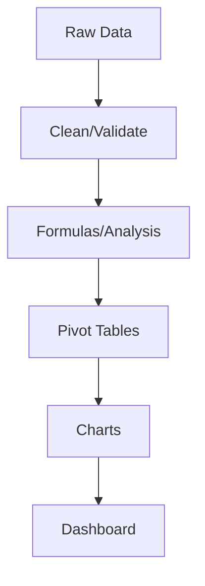
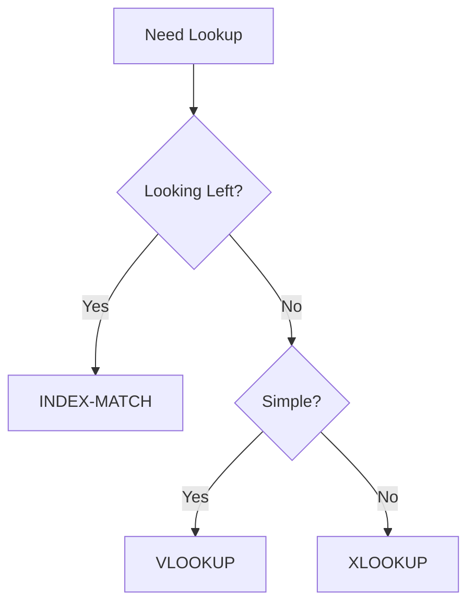
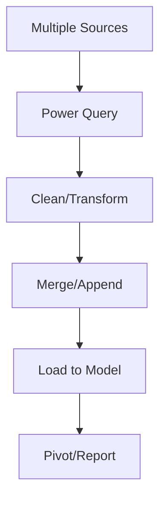

## Table of Contents
- [Introduction](#introduction)
- [Learning Roadmap](#learning-roadmap)
- [Theory Notes](#theory-notes)
- [Key Concepts](#key-concepts)
- [FAQ (35+ Q&A)](#faq-35-qa)
- [Hands-on Practice](#hands-on-practice)
- [FAANG Questions](#faang-questions)
- [Common Mistakes](#common-mistakes)
- [Best Practices](#best-practices)
- [Cheat Sheet](#cheat-sheet)
- [Flash Cards (30)](#flash-cards-30)
- [Mind Map](#mind-map)
- [Mermaid Diagrams](#mermaid-diagrams)
- [Code Examples](#code-examples)
- [Projects](#projects)
- [Resources](#resources)
- [Checklist](#checklist)
- [Revision Plans](#revision-plans)
- [Mock Interviews](#mock-interviews)
- [Difficulty Rating](#difficulty-rating)
- [Summary](#summary)

---

## Introduction

Microsoft Excel is the most widely used spreadsheet application in business. Proficiency in Excel is essential for data analysis, financial modeling, reporting, and countless business operations. Many interview processes include Excel tests to evaluate candidates' ability to work with data efficiently.

Excel skills range from basic cell operations to advanced formulas, pivot tables, macros, and data visualization. Mastering these skills demonstrates analytical capability and attention to detail that employers value.

Excel is not just a spreadsheet tool; it is a powerful data analysis platform. With features like Power Query, Power Pivot, and dynamic arrays, modern Excel can handle complex data transformations and analytics that previously required dedicated programming languages.

---

## Learning Roadmap

### Phase 1: Basics (Week 1)
- Navigation, formatting, cell references
- Basic formulas (SUM, AVERAGE, COUNT)
- Absolute vs relative references
- Data entry and validation

### Phase 2: Intermediate (Week 2-3)
- VLOOKUP, HLOOKUP, INDEX-MATCH
- SUMIFS, COUNTIFS, AVERAGEIFS
- Conditional formatting
- Sorting and filtering
- Data validation

### Phase 3: Advanced (Week 4-5)
- Pivot tables and pivot charts
- Array formulas
- IF, nested IF, IFS, SWITCH
- TEXT, DATE functions
- Named ranges

### Phase 4: Expert (Week 6-8)
- Power Query (data transformation)
- Power Pivot (data modeling)
- Macros/VBA basics
- Dashboard creation
- Advanced charting

### Phase 5: Specialized (Week 9-12)
- Financial functions (NPV, IRR, PMT)
- Statistical functions
- Solver and Goal Seek
- What-if analysis
- Advanced dashboards

---

## Theory Notes

### Lookup Functions
**VLOOKUP**: Looks up a value in the leftmost column and returns a value from a specified column. =VLOOKUP(lookup_value, table_array, col_index, [range_lookup])

**INDEX-MATCH**: More flexible than VLOOKUP. Can look up left and right. =INDEX(return_range, MATCH(lookup_value, lookup_range, 0))

**XLOOKUP** (newer): Combines VLOOKUP and INDEX-MATCH. =XLOOKUP(lookup_value, lookup_array, return_array)

### Conditional Functions
**SUMIFS**: Sums values meeting multiple criteria. =SUMIFS(sum_range, criteria_range1, criteria1, ...)
**COUNTIFS**: Counts cells meeting multiple criteria.
**AVERAGEIFS**: Averages values meeting multiple criteria.

### Pivot Tables
Dynamic summary tables that group, count, sum, and average data. Drag fields to rows, columns, values, and filters areas. Enable quick data exploration without complex formulas.

### Power Query
Data transformation tool for cleaning, reshaping, and combining data. Records transformation steps that can be replayed when data updates. Handles large datasets efficiently.

### Data Validation
Controls what users can enter in cells: drop-down lists, number ranges, date ranges, custom formulas. Ensures data quality and consistency.

### Dynamic Arrays
Excel 365's dynamic array functions spill results into multiple cells:
- **FILTER**: Filter ranges based on criteria
- **SORT**: Sort ranges by columns
- **UNIQUE**: Extract unique values
- **SEQUENCE**: Generate number sequences
- **RANDARRAY**: Generate random arrays

### Power Pivot and DAX
Power Pivot enables data modeling with millions of rows using DAX (Data Analysis Expressions):
- Create relationships between tables
- Write complex measures
- Handle time intelligence calculations
- Go beyond standard pivot table limitations

---

## Key Concepts

| Concept | Description |
|---------|-------------|
| Absolute Reference | $A$1 - cell reference that doesn't change when copied |
| Relative Reference | A1 - cell reference that adjusts when copied |
| VLOOKUP | Vertical lookup in leftmost column |
| INDEX-MATCH | Flexible lookup returning from any column |
| Pivot Table | Dynamic data summary and analysis tool |
| Power Query | ETL tool for data transformation |
| Conditional Formatting | Format cells based on rules |
| Data Validation | Restrict cell input to specific values |
| Named Range | Reference cells by meaningful names |
| Array Formula | Formula operating on arrays of values |
| Dynamic Array | Functions that spill results into multiple cells |
| Structured Reference | Table-based formula referencing |

---

## FAQ (35+ Q&A)

### Q1: What is the difference between VLOOKUP and INDEX-MATCH?
**A:** VLOOKUP searches the leftmost column and returns from a specified column number. INDEX-MATCH is more flexible: MATCH finds the row, INDEX returns from any column. INDEX-MATCH can look left, handles duplicate first columns, and is generally faster.

### Q2: What is the difference between absolute and relative references?
**A:** Relative (A1) changes when copied to other cells. Absolute ($A$1) stays fixed. Mixed ($A1 or A$1) locks either column or row. Use absolute for constants (tax rate, lookup tables).

### Q3: When would you use a pivot table?
**A:** Summarizing large datasets, creating cross-tabulations, analyzing trends by category, exploring data interactively, and creating summary reports without complex formulas.

### Q4: What is Power Query?
**A:** Excel's ETL (Extract, Transform, Load) tool for cleaning, reshaping, and combining data. Records transformation steps that replay on refresh. Handles CSV, databases, APIs, and web data.

### Q5: What does SUMIFS do?
**A:** Sums values meeting multiple criteria. Example: =SUMIFS(D:D, B:B, "Sales", C:C, ">1000") sums column D where B is "Sales" and C is greater than 1000.

### Q6: What is conditional formatting?
**A:** Automatically formats cells based on rules: color scales, data bars, icon sets, or custom formulas. Useful for highlighting trends, outliers, and status indicators.

### Q7: How do you handle large datasets in Excel?
**A:** Use Power Query for transformation, pivot tables for summarization, avoid volatile formulas (INDIRECT, OFFSET), use structured tables, and consider Power Pivot for data modeling.

### Q8: What is an array formula?
**A:** A formula that performs multiple calculations on one or more arrays. Enter with Ctrl+Shift+Enter (legacy) or use dynamic array functions (FILTER, SORT, UNIQUE) in Excel 365.

### Q9: What is the difference between COUNT, COUNTA, and COUNTBLANK?
**A:** COUNT counts numeric cells. COUNTA counts non-empty cells (any type). COUNTBLANK counts empty cells.

### Q10: What is XLOOKUP?
**A:** Modern replacement for VLOOKUP/HLOOKUP. =XLOOKUP(lookup, lookup_array, return_array, [if_not_found], [match_mode], [search_mode]). Supports bidirectional lookup, default values, and binary search.

### Q11: What is the IF function?
**A:** =IF(condition, value_if_true, value_if_false). Can be nested for multiple conditions. Newer alternatives: IFS, SWITCH for cleaner multi-condition logic.

### Q12: What is a named range?
**A:** A descriptive name for a cell or range of cells. Makes formulas readable (=Tax_Rate instead of $H$1). Created via Name Box or Formulas > Name Manager.

### Q13: What is data validation?
**A:** Restricts what can be entered in cells: drop-down lists, number ranges, date ranges, custom formulas. Prevents errors and ensures data consistency.

### Q14: What is Power Pivot?
**A:** Excel's data modeling tool for handling millions of rows, creating relationships between tables, and writing DAX formulas. Goes beyond standard pivot table limitations.

### Q15: What are volatile functions?
**A:** Functions that recalculate whenever any cell changes: NOW(), TODAY(), RAND(), INDIRECT(), OFFSET(). Use sparingly as they slow down workbooks.

### Q16: How do you remove duplicates?
**A:** Data tab > Remove Duplicates. Or use COUNTIF formula to flag duplicates. Advanced: use Power Query for repeatable deduplication.

### Q17: What is a slicer?
**A:** Visual filter for pivot tables and tables. Provides clickable buttons for quick filtering. More user-friendly than dropdown filters.

### Q18: What is CONCATENATE vs TEXTJOIN?
**A:** CONCATENATE joins text with optional delimiter. TEXTJOIN (newer) joins with delimiter and can ignore empty cells: =TEXTJOIN(", ", TRUE, A1:A10).

### Q19: What is the difference between a table and a range?
**A:** A table (Ctrl+T) has structured references, auto-expands, has total rows, and supports slicers. Regular ranges don't have these features. Always use tables.

### Q20: What is Goal Seek?
**A:** What-if analysis tool that finds the input value needed to achieve a desired result. Works backwards from output to find the required input.

### Q21: What is the IFERROR function?
**A:** =IFERROR(value, value_if_error). Returns alternative value if formula produces an error. Example: =IFERROR(VLOOKUP(...), "Not Found"). Prevents #N/A, #DIV/0!, etc.

### Q22: What is the difference between LEFT, RIGHT, and MID?
**A:** LEFT extracts characters from the start. RIGHT from the end. MID from the middle at a specified position. All take text and number of characters.

### Q23: What is the CONCATENATE operator?
**A:** The & operator joins text strings. Example: ="Hello " & A1 & " " & B1. More flexible than CONCAT function for inline use.

### Q24: What is the difference between SUMPRODUCT and SUMIFS?
**A:** SUMPRODUCT multiplies corresponding arrays and sums results. SUMIFS sums based on criteria. SUMPRODUCT is more flexible for complex calculations across arrays.

### Q25: What is Flash Fill?
**A:** Automatic data filling based on patterns (Ctrl+E). Excel detects patterns from examples and fills the rest. Useful for extracting names, formatting data, etc.

### Q26: What is the TEXT function?
**A:** =TEXT(value, format_text). Formats numbers as text with specific patterns. Example: =TEXT(TODAY(), "YYYY-MM-DD") or =TEXT(A1, "$#,##0.00").

### Q27: What is the OFFSET function?
**A:** Returns a reference offset from a starting cell. Volatile function. Example: =OFFSET(A1, 2, 1) returns value 2 rows down, 1 column right. Use with caution due to volatility.

### Q28: What is the INDIRECT function?
**A:** Converts text string to a cell reference. Volatile function. Example: =INDIRECT("Sheet2!A1") references Sheet2!A1 using a text string. Useful for dynamic references.

### Q29: What is the difference between MAX and LARGE?
**A:** MAX returns the largest value. LARGE returns the kth largest value. Example: =LARGE(A1:A10, 2) returns the second largest value.

### Q30: What is a macro?
**A:** Recorded sequence of actions that can be replayed. Created via Developer > Record Macro or written in VBA. Automates repetitive tasks.

### Q31: What is the difference between MATCH and VLOOKUP?
**A:** MATCH returns the position of a value in a range. VLOOKUP returns the value itself. MATCH is often used with INDEX to create flexible lookups.

### Q32: What is the NETWORKDAYS function?
**A:** Returns the number of working days between two dates, excluding weekends and optionally holidays. =NETWORKDAYS(start_date, end_date, [holidays]).

### Q33: What is the SUBTOTAL function?
**A:** Performs calculations on filtered data, ignoring hidden rows. Function_num determines operation (1=AVERAGE, 9=SUM, etc.). Useful with filtered data.

### Q34: What is the AGGREGATE function?
**A:** Enhanced SUBTOTAL with more functions and error handling. Can ignore errors, hidden rows, nested SUBTOTALs, and more. =AGGREGATE(function_num, options, range).

### Q35: What is the TRANSPOSE function?
**A:** Converts rows to columns or columns to rows. =TRANSPOSE(A1:C3). In Excel 365, spills automatically. In older versions, enter as array formula with Ctrl+Shift+Enter.

---

## Hands-on Practice

### VLOOKUP vs INDEX-MATCH
```excel
# VLOOKUP
=VLOOKUP(A2, Sheet2!A:D, 3, FALSE)

# INDEX-MATCH (more flexible)
=INDEX(Sheet2!C:C, MATCH(A2, Sheet2!A:A, 0))

# XLOOKUP (modern)
=XLOOKUP(A2, Sheet2!A:A, Sheet2!C:C, "Not Found")
```

### SUMIFS Examples
```excel
# Sum sales for Product A in January
=SUMIFS(D:D, B:B, "Product A", C:C, "Jan")

# Sum sales > 1000 for Sales team
=SUMIFS(D:D, B:B, "Sales", D:D, ">1000")

# Sum with wildcards
=SUMIFS(D:D, A:A, "*phone*")

# Sum across date range
=SUMIFS(D:D, A:A, ">="&DATE(2024,1,1), A:A, "<="&DATE(2024,1,31))
```

### Pivot Table Setup
1. Select data range
2. Insert > PivotTable
3. Drag fields:
   - Rows: Category
   - Columns: Month
   - Values: Revenue (Sum)
   - Filters: Region

### Dynamic Array Examples
```excel
# Filter sales > 1000
=FILTER(A2:D100, D2:D100 > 1000)

# Sort by revenue descending
=SORT(A2:D100, 4, -1)

# Unique values
=UNIQUE(A2:A100)

# Sequence of numbers
=SEQUENCE(10, 1, 1, 1)

# Random array
=RANDARRAY(5, 3, 1, 100, TRUE)
```

### Financial Functions
```excel
# Net Present Value
=NPV(rate, value1, value2, ...)

# Internal Rate of Return
=IRR(values, [guess])

# Payment calculation
=PMT(rate, nper, pv, [fv], [type])

# Present Value
=PV(rate, nper, pmt, [fv], [type])
```

---

## FAANG Questions

1. **Google**: Build a sales dashboard with pivot tables showing revenue by region, product, and month.
2. **Meta**: Analyze user engagement data using SUMIFS and pivot tables.
3. **Amazon**: Create a financial model calculating NPV and IRR for investment projects.
4. **Microsoft**: Design an Excel-based project tracker with conditional formatting for status.
5. **Google**: Build a dynamic report using INDEX-MATCH that handles lookups across multiple sheets.
6. **Meta**: Create a cohort analysis showing user retention by signup month using pivot tables.
7. **Amazon**: Build an inventory management system with data validation and conditional formatting.
8. **Microsoft**: Design a budget template using Power Query to import and transform bank data.
9. **Google**: Create an automated report using Excel macros that refreshes data and formats output.
10. **Meta**: Build a what-if analysis model for pricing strategy using Goal Seek and Data Tables.

---

## Common Mistakes

1. Using VLOOKUP when INDEX-MATCH or XLOOKUP is better
2. Not using absolute references for constants
3. Hardcoding values instead of cell references
4. Over-nesting IF functions (use IFS or SWITCH)
5. Not using tables (Ctrl+T) for structured data
6. Ignoring error handling (IFERROR, IFNA)
7. Using volatile functions unnecessarily
8. Not validating input data
9. Creating charts without proper labels
10. Not protecting important formulas/sheets
11. Using merged cells (causes formula issues)
12. Not using named ranges for clarity
13. Copying formulas instead of using structured references
14. Ignoring Excel's built-in error checking
15. Not saving in appropriate file format (.xlsx vs .xlsm)

---

## Best Practices

1. Always use tables for structured data
2. Use named ranges for readability
3. Handle errors with IFERROR/IFNA
4. Use conditional formatting for visual insights
5. Document assumptions and formulas
6. Avoid hardcoding in formulas
7. Use data validation for input control
8. Keep formulas simple and readable
9. Regular backup important workbooks
10. Learn keyboard shortcuts for efficiency
11. Use Power Query for data transformation
12. Avoid merged cells in data ranges
13. Separate input, calculation, and output areas
14. Use cell styles for consistent formatting
15. Protect cells with formulas

---

## Cheat Sheet

### Essential Shortcuts
| Shortcut | Action |
|----------|--------|
| Ctrl+T | Create table |
| Ctrl+; | Insert today's date |
| Ctrl+Shift+L | Toggle filters |
| Alt+= | AutoSum |
| F4 | Toggle absolute reference |
| Ctrl+` | Show formulas |
| Ctrl+D | Fill down |
| Ctrl+R | Fill right |
| Ctrl+Shift+Enter | Array formula |
| Ctrl+E | Flash Fill |
| F2 | Edit cell |
| Ctrl+Home | Go to cell A1 |
| Alt+Enter | New line in cell |
| Ctrl+Page Up/Down | Switch sheets |

### Formula Reference
| Function | Syntax | Use |
|----------|--------|-----|
| VLOOKUP | =VLOOKUP(val,range,col,FALSE) | Vertical lookup |
| INDEX-MATCH | =INDEX(col,MATCH(val,range,0)) | Flexible lookup |
| SUMIFS | =SUMIFS(sum,criteria_range,criteria) | Conditional sum |
| COUNTIFS | =COUNTIFS(range,criteria) | Conditional count |
| IF | =IF(cond,true,false) | Conditional logic |
| IFERROR | =IFERROR(formula,alternative) | Error handling |
| XLOOKUP | =XLOOKUP(val,lookup,return,missing) | Modern lookup |
| TEXTJOIN | =TEXTJOIN(delimiter,ignore_empty,range) | Join text |
| FILTER | =FILTER(range,condition) | Filter data |
| SORT | =SORT(range,col,order) | Sort data |

### Key Functions by Category
| Category | Functions |
|----------|-----------|
| Lookup | VLOOKUP, INDEX-MATCH, XLOOKUP, HLOOKUP |
| Conditional | SUMIFS, COUNTIFS, AVERAGEIFS, MAXIFS, MINIFS |
| Logical | IF, IFS, AND, OR, NOT, SWITCH |
| Text | LEFT, RIGHT, MID, LEN, TRIM, SUBSTITUTE, TEXT |
| Date | TODAY, NOW, YEAR, MONTH, DAY, DATE, DATEDIF |
| Math | SUM, PRODUCT, MOD, ROUND, ABS, SQRT |
| Statistical | AVERAGE, MEDIAN, MODE, STDEV, VAR, PERCENTILE |

---

## Flash Cards (30)

**Card 1:** Q: Absolute reference? A: $A$1 - doesn't change when copied. Use for constants.

**Card 2:** Q: VLOOKUP vs INDEX-MATCH? A: VLOOKUP is simpler but limited; INDEX-MATCH is more flexible and faster.

**Card 3:** Q: What is a pivot table? A: Dynamic summary tool grouping, counting, and summing data.

**Card 4:** Q: SUMIFS syntax? A: =SUMIFS(sum_range, criteria_range1, criteria1, ...)

**Card 5:** Q: What is Power Query? A: ETL tool for data transformation with repeatable steps.

**Card 6:** Q: Conditional formatting? A: Auto-format cells based on rules (colors, icons, data bars).

**Card 7:** Q: What is XLOOKUP? A: Modern lookup supporting bidirectional search and default values.

**Card 8:** Q: COUNT vs COUNTA? A: COUNT counts numbers; COUNTA counts non-empty cells.

**Card 9:** Q: What is data validation? A: Restricting cell input to specific values, ranges, or lists.

**Card 10:** Q: What is a named range? A: Descriptive name for cells making formulas readable.

**Card 11:** Q: What is IFERROR? A: Returns alternative value if formula produces an error.

**Card 12:** Q: What is a slicer? A: Visual filter for pivot tables with clickable buttons.

**Card 13:** Q: What is Power Pivot? A: Data modeling tool for millions of rows with DAX formulas.

**Card 14:** Q: What is Goal Seek? A: What-if analysis finding input needed for desired output.

**Card 15:** Q: What is TEXTJOIN? A: Joins text with delimiter, ignoring empty cells.

**Card 16:** Q: What is a volatile function? A: Recalculates on every change (NOW, RAND, INDIRECT).

**Card 17:** Q: What is a table (Ctrl+T)? A: Structured range with auto-expansion and total rows.

**Card 18:** Q: What is CONCATENATE? A: Joins text strings. Use & or TEXTJOIN instead.

**Card 19:** Q: What is IF vs IFS? A: IF handles one condition; IFS handles multiple without nesting.

**Card 20:** Q: What is Flash Fill? A: Auto-fills pattern based on examples (Ctrl+E).

**Card 21:** Q: What is FILTER function? A: Returns rows meeting criteria from a range.

**Card 22:** Q: What is SORT function? A: Sorts a range by specified column and order.

**Card 23:** Q: What is UNIQUE function? A: Extracts unique values from a range.

**Card 24:** Q: What is OFFSET function? A: Returns reference offset from starting cell (volatile).

**Card 25:** Q: What is SUBTOTAL function? A: Calculates on filtered data ignoring hidden rows.

**Card 26:** Q: What is AGGREGATE function? A: Enhanced SUBTOTAL with more functions and error handling.

**Card 27:** Q: What is TRANSPOSE? A: Converts rows to columns or columns to rows.

**Card 28:** Q: What is NETWORKDAYS? A: Returns working days between two dates.

**Card 29:** Q: What is SUMPRODUCT? A: Multiplies arrays element-wise and sums results.

**Card 30:** Q: What is a macro? A: Recorded sequence of actions for automating repetitive tasks.

---

## Mind Map

```
Excel
├── Formulas
│   ├── Lookup (VLOOKUP, INDEX-MATCH, XLOOKUP)
│   ├── Conditional (SUMIFS, COUNTIFS)
│   ├── Logic (IF, IFS, SWITCH)
│   ├── Text/Date
│   └── Dynamic Arrays (FILTER, SORT, UNIQUE)
├── Data Tools
│   ├── Pivot Tables
│   ├── Sorting/Filtering
│   ├── Data Validation
│   └── Conditional Formatting
├── Advanced
│   ├── Power Query
│   ├── Power Pivot
│   ├── Array Formulas
│   └── VBA/Macros
└── Visualization
    ├── Charts
    ├── Sparklines
    ├── Dashboards
    └── Slicers
```

---

## Mermaid Diagrams

### Excel Analysis Workflow


### Lookup Decision


### Data Preparation Flow


---

## Code Examples

### Advanced Power Query M Code

```m
let
    Source = Csv.Document(File.Contents("C:\data\sales.csv"), null, null, null, 1252, null, null, null, null, null, 65001, null, null, null, null, null, null, null, null),
    PromotedHeaders = Table.PromoteHeaders(Source, [PromoteAllScalars=true]),
    ChangedTypes = Table.TransformColumnTypes(PromotedHeaders, {{"Date", type date}, {"Revenue", type number}}),
    FilteredRows = Table.SelectRows(ChangedTypes, each [Revenue] > 1000),
    GroupedRows = Table.Group(FilteredRows, {"Region"}, {{"Total Revenue", each List.Sum([Revenue]), type number}})
in
    GroupedRows
```


### Complex Excel Formulas
```excel
# Nested INDEX-MATCH with multiple criteria
=INDEX(Sheet2!C:C, MATCH(1, (Sheet2!A:A=A2)*(Sheet2!B:B=B2), 0))

# Dynamic COUNTIFS with date range
=COUNTIFS(A:A, ">="&DATE(2024,1,1), A:A, "<="&DATE(2024,12,31))

# Weighted average
=SUMPRODUCT(A1:A10, B1:B10)/SUM(B1:B10)

# Text extraction pattern
=LEFT(A1, FIND("@", A1)-1)

# Running count
=COUNTIF($A$1:A1, A1)
```

### VBA Macro Example
```vba
Sub FormatReport()
    Dim ws As Worksheet
    Set ws = ActiveSheet

    ' Format headers
    With ws.Range("A1:F1")
        .Font.Bold = True
        .Interior.Color = RGB(0, 112, 192)
        .Font.Color = RGB(255, 255, 255)
    End With

    ' Auto-fit columns
    ws.Columns.AutoFit

    ' Add borders
    ws.UsedRange.Borders.LineStyle = xlContinuous
End Sub
```

---

## Projects

1. **Sales Dashboard**: Interactive report with pivot tables and charts
2. **Financial Model**: NPV, IRR, sensitivity analysis
3. **Project Tracker**: Conditional formatting, data validation
4. **Budget Template**: Power Query data import, automated calculations
5. **HR Analytics**: Cohort analysis, retention tracking
6. **Inventory Management**: VLOOKUP-based tracking system
7. **Survey Analysis**: Data validation, summary statistics, charts
8. **Financial Reporting**: Automated P&L with Power Query

---

## Resources

- **Courses**: Excel Skills for Business (Coursera), ExcelJet, Chandoo
- **Practice**: Excel challenges on LeetCode, HackerRank
- **Shortcuts**: keyboard shortcuts reference sheet
- **Templates**: Microsoft templates gallery
- **Books**: "Excel Bible" (Walkenbach), "Excel Power Pivot & Power Query" (Jelen)
- **Community**: MrExcel forums, Reddit r/excel
- **YouTube**: Leila Gharani, ExcelIsFun, Contexture

---

## Checklist

- [ ] Basic formulas and functions
- [ ] VLOOKUP, INDEX-MATCH, XLOOKUP
- [ ] SUMIFS, COUNTIFS, AVERAGEIFS
- [ ] Pivot tables and charts
- [ ] Conditional formatting
- [ ] Data validation
- [ ] Power Query basics
- [ ] Named ranges and tables
- [ ] Error handling (IFERROR)
- [ ] Dashboard creation
- [ ] Dynamic array functions
- [ ] Financial functions
- [ ] Macros/VBA basics
- [ ] Power Pivot basics
- [ ] Keyboard shortcuts proficiency

---

## Revision Plans

### Week 1: Basics
- Master cell references, basic formulas, formatting
- Learn 10 essential keyboard shortcuts daily
- Practice data entry and validation

### Week 2: Intermediate
- Lookup functions (VLOOKUP, INDEX-MATCH, XLOOKUP)
- Conditional functions (SUMIFS, COUNTIFS)
- Practice on real datasets

### Week 3: Advanced
- Pivot tables and pivot charts
- Array formulas and dynamic arrays
- Dashboard design

### Week 4: Expert
- Power Query for data transformation
- Power Pivot and DAX basics
- VBA macros for automation

### Final Week: Integration
- Build complete dashboard project
- Practice Excel test scenarios
- Review keyboard shortcuts

---

## Mock Interviews

### Round 1: Formula Questions
1. Write a VLOOKUP to find product price by product ID
2. Calculate total sales for Region A with revenue > $1000
3. Create a formula that extracts domain from email addresses

### Round 2: Pivot Table Exercise
1. Build a pivot table showing revenue by region and quarter
2. Create a calculated field for profit margin
3. Add slicers for interactive filtering

### Round 3: Dashboard Design
1. Design an executive dashboard with key business metrics
2. Create dynamic charts using form controls
3. Build a what-if analysis model

---

## Difficulty Rating

| Topic | Difficulty | Frequency |
|-------|-----------|-----------|
| Basic Formulas | Easy | Very High |
| VLOOKUP/INDEX-MATCH | Medium | Very High |
| SUMIFS/COUNTIFS | Medium | High |
| Pivot Tables | Medium | Very High |
| Conditional Formatting | Easy | Medium |
| Data Validation | Easy | Medium |
| Power Query | Medium-High | Growing |
| Power Pivot/DAX | Hard | Growing |
| VBA/Macros | Hard | Medium |
| Dashboard Design | Medium | High |

---

## Summary

Excel proficiency is tested in many business and analytics interviews. Master lookup functions, conditional aggregation, pivot tables, and data visualization. Practice building dashboards and solving real business problems. Speed and accuracy with keyboard shortcuts demonstrate expertise. Modern Excel with dynamic arrays, Power Query, and Power Pivot is increasingly important for advanced analytics roles.
