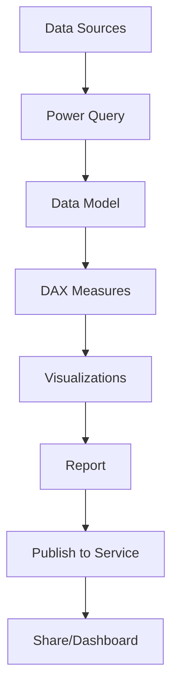
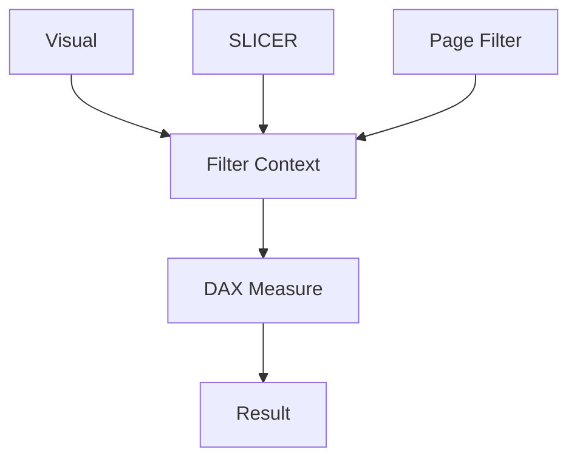
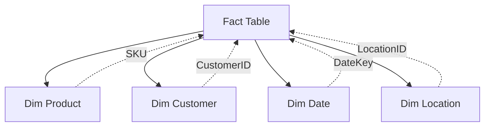

## Table of Contents
- [Introduction](#introduction)
- [Learning Roadmap](#learning-roadmap)
- [Theory Notes](#theory-notes)
- [Key Concepts](#key-concepts)
- [FAQ (35+ Q&A)](#faq-35-qa)
- [Hands-on Practice](#hands-on-practice)
- [FAANG Questions](#faang-questions)
- [Common Mistakes](#common-mistakes)
- [Best Practices](#best-practices)
- [Cheat Sheet](#cheat-sheet)
- [Flash Cards (30)](#flash-cards-30)
- [Mind Map](#mind-map)
- [Mermaid Diagrams](#mermaid-diagrams)
- [Code Examples](#code-examples)
- [Projects](#projects)
- [Resources](#resources)
- [Checklist](#checklist)
- [Revision Plans](#revision-plans)
- [Mock Interviews](#mock-interviews)
- [Difficulty Rating](#difficulty-rating)
- [Summary](#summary)

---

## Introduction

Power BI is Microsoft's business intelligence platform for creating interactive data visualizations and reports. It enables users to connect to diverse data sources, transform data, build data models, create reports, and share dashboards. Power BI is widely used across enterprises for data-driven decision making.

Power BI encompasses several components: Power BI Desktop (report authoring), Power BI Service (cloud sharing), Power BI Mobile (mobile access), and Power Query (data transformation). Proficiency in DAX (Data Analysis Expressions) for calculations is essential.

Power BI's integration with the Microsoft ecosystem (Excel, Azure, SQL Server) makes it a popular choice for organizations already using Microsoft products. Understanding both the self-service and enterprise capabilities of Power BI is crucial for interview success.

---

## Learning Roadmap

### Phase 1: Basics (Week 1-2)
- Power BI Desktop interface
- Connecting to data sources
- Data loading and transformation (Power Query)
- Basic visualizations

### Phase 2: Data Modeling (Week 3-4)
- Star schema design
- Relationships between tables
- Calculated columns
- Basic DAX (SUM, AVERAGE, CALCULATE)

### Phase 3: DAX Formulas (Week 5-7)
- Filter context
- Time intelligence functions
- Iterator functions (SUMX, AVERAGEX)
- Complex CALCULATE patterns
- Variables (VAR)

### Phase 4: Advanced (Week 8-10)
- Row-level security (RLS)
- Advanced DAX patterns
- Performance optimization
- Power BI Service features
- Data refresh strategies

### Phase 5: Production (Week 11-12)
- Dashboard design best practices
- Deployment pipelines
- Governance and security
- Paginated reports
- Integration with other tools

---

## Theory Notes

### Power BI Architecture
- **Power BI Desktop**: Create reports with data modeling and DAX
- **Power BI Service**: Publish, share, collaborate in cloud
- **Power BI Gateway**: Connect on-premises data to cloud
- **Power BI Mobile**: View reports on mobile devices
- **Power Query**: ETL (Extract, Transform, Load) tool

### Star Schema
Best practice data model design:
- **Fact table**: Contains measures and foreign keys (transactions, events)
- **Dimension tables**: Contain descriptive attributes (products, customers, dates)
- One-to-many relationships from dimensions to facts
- Minimizes redundancy and improves performance

### DAX (Data Analysis Expressions)
Formula language for calculations in Power BI:
- **Calculated columns**: Row-by-row calculations in tables
- **Measures**: Aggregate calculations evaluated in context
- **Tables**: Calculated tables from expressions

### Filter Context
The set of filters applied to a calculation at any time:
- Visual-level filters
- Page-level filters
- Report-level filters
- Slicer selections
- DAX filter modifications (CALCULATE)

### CALCULATE Function
Most powerful DAX function. Modifies filter context:
CALCULATE(expression, filter1, filter2, ...)
- Removes existing filters and applies new ones
- Enables complex conditional aggregations

### Time Intelligence
Functions for date-based calculations:
- TOTALYTD, TOTALQTD, TOTALMTD (year/quarter/month to date)
- SAMEPERIODLASTYEAR, DATEADD (period comparison)
- DATESINPERIOD (rolling windows)
- Requires a continuous date table

### Power Query (M Language)
Data transformation language:
- Connect to sources (Excel, SQL, API, Web)
- Clean and reshape data
- Merge and append queries
- Steps are recorded and replayable

### Row-Level Security (RLS)
Restricts data access based on user roles:
- Static RLS: hardcoded filter values
- Dynamic RLS: filter based on DAX expressions
- Tested in Power BI Desktop, configured in Service
- Essential for multi-tenant environments

---

## Key Concepts

| Concept | Description |
|---------|-------------|
| DAX | Formula language for calculations in Power BI |
| Star Schema | Data model with fact and dimension tables |
| Filter Context | Set of filters affecting a calculation |
| CALCULATE | Modifies filter context for complex calculations |
| Measure | Aggregate calculation evaluated dynamically |
| Calculated Column | Row-by-row calculation stored in table |
| Time Intelligence | Date-based calculations (YTD, comparisons) |
| RLS | Row-level security restricting data access |
| Power Query | ETL tool for data transformation |
| Gateway | Bridge between on-premises data and cloud |
| Composite Model | Combining Import and DirectQuery sources |
| Aggregation Table | Pre-aggregated data for performance |
| Calculation Group | Reusable DAX calculation patterns |
| Bookmarks | Saved report states for navigation |

---

## FAQ (35+ Q&A)

### Q1: What is the difference between a measure and a calculated column?
**A:** Measures are dynamic calculations evaluated at query time based on filter context. Calculated columns are computed row-by-row during data refresh and stored. Use measures for aggregations; columns for row-level calculations.

### Q2: What is filter context?
**A:** The set of filters affecting a DAX calculation: visual filters, page filters, report filters, slicer selections, and row/column context. CALCULATE can modify this context.

### Q3: What is a star schema?
**A:** Data model design with a central fact table (measures) surrounded by dimension tables (attributes). Best practice for Power BI: improves performance, simplifies DAX, and follows dimensional modeling principles.

### Q4: What is CALCULATE?
**A:** The most important DAX function. Evaluates an expression with modified filter context. Can add, remove, or replace filters. Example: CALCULATE(SUM(Sales[Amount]), Product[Category] = "Electronics")

### Q5: What is time intelligence in DAX?
**A:** Functions for date-based calculations: YTD, QTD, MTD, period comparisons, rolling averages. Requires a properly formatted date table with continuous dates.

### Q6: What is Power Query?
**A:** Excel/Power BI's ETL tool for connecting, cleaning, and transforming data. Records transformation steps that replay on refresh. Uses M language. Handles data prep before modeling.

### Q7: What is row-level security (RLS)?
**A:** Restricts data access based on user roles. Users see only data they're authorized for. Implemented in Power BI Desktop, configured in Power BI Service.

### Q8: How do you optimize Power BI performance?
**A:** Use star schema, minimize calculated columns, use SUMMARIZE instead of ADDCOLUMNS for aggregations, reduce cardinality, use import mode over DirectQuery where possible, and optimize DAX measures.

### Q9: What is the difference between Import, DirectQuery, and Live Connection?
**A:** Import: data stored in Power BI (fastest). DirectQuery: queries source in real-time (no storage limit). Live Connection: connects to existing model (Analysis Services). Choose based on data volume and refresh needs.

### Q10: What is a slicer?
**A:** Visual filter allowing users to select values to filter all visuals on a page. Supports single/multi-select, dropdowns, between dates, and various input types.

### Q11: What is the difference between SUM and SUMX?
**A:** SUM sums a column. SUMX iterates over a table row-by-row, evaluating an expression for each row, then sums results. Use SUMX for row-level calculations like quantity * price.

### Q12: How do you handle many-to-many relationships?
**A:** Avoid if possible. Use bridge tables, filter direction settings, or TREATAS function. Many-to-many can cause ambiguous results. Consider model redesign.

### Q13: What is a date table?
**A:** Continuous date range table used for time intelligence. Must have: unique dates, contiguous range, year/month/day columns. Required for TOTALYTD, DATEADD, etc.

### Q14: What is the difference between ALL and FILTER?
**A:** ALL removes filters from a column/table. FILTER returns a table with rows meeting criteria. ALL is faster; FILTER is more flexible. Both used within CALCULATE.

### Q15: What is a card visualization?
**A:** Displays a single KPI value with optional label. Shows key metrics prominently. Use for important numbers like total revenue, active users, or conversion rate.

### Q16: What is the difference between UNION and APPEND?
**A:** UNION combines tables vertically (same columns). APPEND in Power Query does the same. Both add rows from multiple tables into one.

### Q17: How do you create dynamic titles?
**A:** Create a measure returning the selected value: SelectedCategory = SELECTEDVALUE(DimCategory[Category], "All Categories"). Use this measure as the visual title with conditional formatting.

### Q18: What is a drillthrough?
**A:** Navigate from a summary visual to a detailed page filtered to the selected data point. Users right-click and select drillthrough to see detailed information.

### Q19: What is the difference between ALLSELECTED and ALL?
**A:** ALL removes all filters. ALLSELECTED removes filters from the visual but keeps slicer/outer filters. ALLSELECTED respects user selections outside the visual.

### Q20: What is a KPI visual?
**A:** Shows a value, goal, and trend. Displays whether you're meeting targets with color indicators. Useful for executive dashboards showing performance against goals.

### Q21: What is the DIVIDE function?
**A:** Safe division handling divide-by-zero errors. =DIVIDE(numerator, denominator, [alternate_result]). Returns alternate_result when denominator is zero instead of error.

### Q22: What is KEEPFILTERS?
**A:** DAX function that adds a filter to the existing context instead of replacing it. Used within CALCULATE. Prevents complete override of existing filters.

### Q23: What is the difference between RELATED and RELATEDTABLE?
**A:** RELATED fetches a value from a related table (many-to-one). RELATEDTABLE returns a table of related rows (one-to-many). Used in calculated columns and measures.

### Q24: What is a data refresh?
**A:** Updating the Power BI dataset from source data. Types: scheduled refresh, manual refresh, incremental refresh. Gateway required for on-premises sources.

### Q25: What is incremental refresh?
**A:** Refreshing only new or changed data instead of the entire dataset. Significantly reduces refresh time for large historical datasets. Configured in Power Query parameters.

### Q26: What is a deployment pipeline?
**A:** Tool for managing report lifecycle: Development > Test > Production. Enables version control, workspace management, and controlled deployment.

### Q27: What is the difference between a workspace and an app?
**A:** Workspace is where you develop and collaborate. App is the published, read-only version for end users. Apps provide curated navigation and branding.

### Q28: What is composite modeling?
**A:** Combining Import and DirectQuery tables in the same model. Allows mixing fast-imported dimension tables with real-time fact tables. Requires careful design.

### Q29: What is a calculation group?
**A:** Reusable pattern of DAX calculations. Reduces measure duplication. Example: create time intelligence calculation group for YoY, MoM, QoQ on any measure.

### Q30: What is the difference between EXISTS and CONTAINS?
**A:** EXISTS checks if a table contains rows matching criteria. CONTAINS checks if specific column values exist. Both used for filtering in DAX.

### Q31: What is field parameters?
**A:** Dynamic measure/dimension selection by users. Allows switching between different metrics or dimensions in a single visual without creating separate visuals.

### Q32: What is the TREATAS function?
**A:** Applies a table of values as a filter to another table. Useful for many-to-many relationships and cross-table filtering without physical relationships.

### Q33: What is the difference between SUMMARIZE and SUMMARIZECOLUMNS?
**A:** SUMMARIZE creates grouped summaries with optional expressions. SUMMARIZECOLUMNS is optimized for query performance. SUMMARIZECOLUMNS is preferred for new queries.

### Q34: What is a bookmark?
**A:** Saved state of a report page including filters, slicers, and visual states. Used for navigation, guided analytics, and creating interactive experiences.

### Q35: What is the difference between USERELATIONSHIP and CROSSFILTER?
**A:** USERELATIONSHIP activates an inactive relationship for a calculation. CROSSFILTER changes filter propagation direction. Both modify relationship behavior within CALCULATE.

---

## Hands-on Practice

### Basic DAX Measures
```dax
// Total Revenue
Total Revenue = SUM(Sales[Amount])

// Revenue Growth %
Revenue Growth =
VAR CurrentRevenue = [Total Revenue]
VAR PreviousRevenue = CALCULATE([Total Revenue], SAMEPERIODLASTYEAR('Date'[Date]))
RETURN DIVIDE(CurrentRevenue - PreviousRevenue, PreviousRevenue)

// YTD Revenue
YTD Revenue = TOTALYTD([Total Revenue], 'Date'[Date])

// Rolling 7-day average
Rolling 7D Avg =
AVERAGEX(
    DATESINPERIOD('Date'[Date], MAX('Date'[Date]), -7, DAY),
    [Total Revenue]
)
```

### Advanced CALCULATE
```dax
// Sales for Electronics category in 2024
Electronics 2024 Sales =
CALCULATE(
    [Total Sales],
    Product[Category] = "Electronics",
    'Date'[Year] = 2024
)

// Top N Products
Top N Sales =
VAR TopProducts =
    TOPN(5, ALL(Product[ProductName]), [Total Sales], DESC)
RETURN CALCULATE([Total Sales], KEEPFILTERS(TopProducts))

// Dynamic date comparison
Period Comparison =
VAR CurrentPeriod = [Total Sales]
VAR PreviousPeriod = CALCULATE(
    [Total Sales],
    DATEADD('Date'[Date], -1, MONTH)
)
RETURN CurrentPeriod - PreviousPeriod

// Percent of total
Percent of Total =
DIVIDE(
    [Total Sales],
    CALCULATE([Total Sales], ALLSELECTED(Product[Category]))
)
```

### Power Query Steps
```
1. Connect to source (SQL Database)
2. Select tables
3. Remove unnecessary columns
4. Change data types
5. Filter rows
6. Group by for aggregation
7. Merge with dimension tables
8. Close & Apply
```

---

## FAANG Questions

1. **Google**: Design a sales analytics dashboard showing revenue trends, top products, and regional performance.
2. **Microsoft**: How would you optimize a Power BI report with 10M+ rows loading slowly?
3. **Amazon**: Build a financial reporting model with YTD, QTD calculations and budget vs actual.
4. **Meta**: Design an HR analytics dashboard tracking headcount, attrition, and diversity metrics.
5. **Google**: How would you implement row-level security for a multi-tenant BI solution?
6. **Microsoft**: Create a dynamic report that allows users to compare any two time periods.
7. **Amazon**: Build an inventory management dashboard with stock levels and reorder alerts.
8. **Meta**: Design a marketing analytics dashboard tracking campaign performance and ROI.
9. **Google**: How would you handle slow DirectQuery performance on large datasets?
10. **Microsoft**: Build a self-service BI solution for non-technical business users.
11. **Amazon**: How would you design a Power BI solution for real-time operational monitoring?
12. **Meta**: Design a data model for a social media analytics platform.
13. **Google**: How would you implement dynamic RLS based on organizational hierarchy?
14. **Microsoft**: Create a dashboard that works across desktop, tablet, and mobile.
15. **Amazon**: How would you version control and deploy Power BI reports across environments?

---

## Common Mistakes

1. Using calculated columns instead of measures
2. Not using star schema design
3. Ignoring DAX performance optimization
4. Over-nesting DAX formulas without variables
5. Not setting up proper data refresh schedules
6. Ignoring RLS for sensitive data
7. Creating too many visuals on one page
8. Not using bookmarks for navigation
9. Ignoring mobile layout design
10. Not documenting data model and DAX logic
11. Using implicit measures instead of explicit measures
12. Not considering cardinality impact on performance
13. Ignoring relationships filter direction
14. Not testing reports with different user roles
15. Overcomplicating DAX when simpler approaches exist

---

## Best Practices

1. Always use star schema data model
2. Prefer measures over calculated columns
3. Use variables (VAR) for readability and performance
4. Document DAX measures with descriptions
5. Use meaningful names for tables and columns
6. Test with different user roles (RLS)
7. Optimize for performance (reduce cardinality)
8. Design for mobile viewing
9. Use consistent formatting and themes
10. Implement proper governance and access controls
11. Use aggregation tables for large datasets
12. Implement incremental refresh for large datasets
13. Use calculation groups to reduce measure duplication
14. Test with production-scale data
15. Monitor performance with DAX Studio

---

## Cheat Sheet

### DAX Quick Reference
| Function | Use |
|----------|-----|
| SUM, AVERAGE | Basic aggregation |
| CALCULATE | Modify filter context |
| FILTER | Return filtered table |
| ALL | Remove filters |
| SUMX | Row-by-row sum |
| DIVIDE | Safe division |
| TOTALYTD | Year-to-date |
| SAMEPERIODLASTYEAR | Year-over-year |
| RANKX | Rank items |
| SELECTEDVALUE | Get single selected value |
| RELATED | Fetch from related table |
| RELATEDTABLE | Get related rows table |
| TOPN | Return top N rows |
| VALUES | Distinct values including blanks |
| DISTINCT | Distinct values excluding blanks |

### Power BI Visuals Guide
| Visual | Best For |
|--------|----------|
| Bar/Column | Comparisons |
| Line | Trends over time |
| Pie/Donut | Composition |
| Map | Geographic data |
| Card | Single KPI |
| Table/Matrix | Detailed data |
| Slicer | Interactive filtering |
| Scatter | Correlation |
| Gauge | Progress to goal |
| Waterfall | Variance analysis |

### DAX Pattern Reference
| Pattern | Example |
|---------|---------|
| Running Total | SUMX(FILTER(ALL(Table), Table[Date]<=MAX(Table[Date])), Table[Value]) |
| Percent of Total | DIVIDE([Measure], CALCULATE([Measure], ALL(Table))) |
| YoY Growth | DIVIDE([Measure] - CALCULATE([Measure], SAMEPERIODLASTYEAR('Date'[Date])), CALCULATE([Measure], SAMEPERIODLASTYEAR('Date'[Date]))) |
| Rolling Average | AVERAGEX(DATESINPERIOD('Date'[Date], MAX('Date'[Date]), -N, DAY), [Measure]) |
| Dynamic Ranking | RANKX(ALL(Table[Column]), [Measure], , DESC, DENSE) |

---

## Flash Cards (30)

**Card 1:** Q: Measure vs calculated column? A: Measure is dynamic (query time); column is static (stored per row).

**Card 2:** Q: What is CALCULATE? A: Modifies filter context for complex conditional calculations.

**Card 3:** Q: What is star schema? A: Fact table surrounded by dimension tables for optimal modeling.

**Card 4:** Q: What is filter context? A: Set of filters affecting a DAX calculation at any time.

**Card 5:** Q: What is Power Query? A: ETL tool for connecting, cleaning, and transforming data.

**Card 6:** Q: What is RLS? A: Row-level security restricting data access by user role.

**Card 7:** Q: SUM vs SUMX? A: SUM aggregates column; SUMX iterates rows evaluating expressions.

**Card 8:** Q: What is time intelligence? A: DAX functions for YTD, QTD, period comparisons.

**Card 9:** Q: Import vs DirectQuery? A: Import stores data; DirectQuery queries source in real-time.

**Card 10:** Q: What is a date table? A: Continuous date range required for time intelligence functions.

**Card 11:** Q: What is ALL function? A: Removes all filters from a column or table.

**Card 12:** Q: What is a slicer? A: Interactive visual filter for selecting values.

**Card 13:** Q: What is drillthrough? A: Navigate from summary to detailed filtered page.

**Card 14:** Q: What is VAR in DAX? A: Variables improve readability and performance of calculations.

**Card 15:** Q: What is ALLSELECTED? A: Removes visual filters but keeps slicer/outer filters.

**Card 16:** Q: What is a card visual? A: Displays a single KPI value with optional label.

**Card 17:** Q: What is DIVIDE function? A: Safe division handling divide-by-zero errors.

**Card 18:** Q: What is KEEPFILTERS? A: Adds filter to existing context instead of replacing.

**Card 19:** Q: What is a Power BI gateway? A: Bridge connecting on-premises data to cloud service.

**Card 20:** Q: What is RANKX? A: Ranks items within a table based on an expression.

**Card 21:** Q: What is RELATED function? A: Fetches value from a related table (many-to-one).

**Card 22:** Q: What is incremental refresh? A: Refreshing only new/changed data for efficiency.

**Card 23:** Q: What is a deployment pipeline? A: Manages Dev > Test > Production lifecycle.

**Card 24:** Q: What is composite modeling? A: Combining Import and DirectQuery in same model.

**Card 25:** Q: What is a calculation group? A: Reusable DAX calculation patterns reducing duplication.

**Card 26:** Q: What is TREATAS? A: Applies table values as filter without physical relationship.

**Card 27:** Q: What are field parameters? A: Dynamic measure/dimension selection by users.

**Card 28:** Q: What is a bookmark? A: Saved report state for navigation and interactivity.

**Card 29:** Q: USERELATIONSHIP vs CROSSFILTER? A: USERELATIONSHIP activates inactive; CROSSFILTER changes direction.

**Card 30:** Q: What is SUMMARIZE vs SUMMARIZECOLUMNS? A: Both create grouped summaries; latter is query-optimized.

---

## Mind Map

```
Power BI
├── Data Preparation
│   ├── Power Query
│   ├── Data Sources
│   └── Transformations
├── Data Modeling
│   ├── Star Schema
│   ├── Relationships
│   └── Calculated Columns
├── DAX
│   ├── Measures
│   ├── CALCULATE
│   ├── Time Intelligence
│   └── Iterator Functions
├── Visualizations
│   ├── Charts
│   ├── Tables/Matrix
│   ├── Cards/KPIs
│   └── Slicers
└── Publishing
    ├── Power BI Service
    ├── RLS
    ├── Refresh
    └── Sharing
```

---

## Mermaid Diagrams

### Power BI Workflow


### DAX Calculation Context


### Data Model Design


---

## Code Examples

### Time Intelligence DAX Patterns
```dax
// Year-over-Year Growth
YoY Growth =
VAR CurrentYear = [Total Revenue]
VAR LastYear = CALCULATE([Total Revenue], SAMEPERIODLASTYEAR('Date'[Date]))
RETURN DIVIDE(CurrentYear - LastYear, LastYear)

// Month-to-Date
MTD Revenue = TOTALMTD([Total Revenue], 'Date'[Date])

// Rolling 30-day average
Rolling 30D Avg =
AVERAGEX(
    DATESINPERIOD('Date'[Date], MAX('Date'[Date]), -30, DAY),
    [Daily Revenue]
)

// Period-over-Period comparison
MoM Change =
VAR CurrentMonth = [Total Revenue]
VAR LastMonth = CALCULATE([Total Revenue], DATEADD('Date'[Date], -1, MONTH))
RETURN CurrentMonth - LastMonth
```

### Advanced DAX Patterns
```dax
// Dynamic Top N
Dynamic Top N =
VAR SelectedN = SELECTEDVALUE(Parameters[TopN Value], 5)
VAR TopItems =
    TOPN(SelectedN, ALL(Product[ProductName]), [Total Sales], DESC)
RETURN CALCULATE([Total Sales], KEEPFILTERS(TopItems))

// Percent of Parent
Percent of Parent =
VAR ParentValue = CALCULATE([Total Sales], ALLSELECTED(Product[Category]))
RETURN DIVIDE([Total Sales], ParentValue)

// Cumulative Total
Cumulative Total =
TOTALYTD([Total Revenue], 'Date'[Date])

// Dynamic Title
Selected Filter =
VAR SelectedCategory = SELECTEDVALUE(Product[Category], "All Categories")
VAR SelectedYear = SELECTEDVALUE('Date'[Year], "All Years")
RETURN SelectedCategory & " - " & SelectedYear
```

---

## Projects

1. **Sales Dashboard**: Revenue trends, product analysis, regional breakdown
2. **Financial Report**: P&L, YTD comparisons, budget tracking
3. **HR Analytics**: Headcount, attrition, diversity dashboards
4. **Marketing Performance**: Campaign ROI, channel analysis
5. **Executive Dashboard**: Key business metrics with drillthrough
6. **Inventory Management**: Stock levels, reorder alerts, supplier analysis
7. **Customer Analytics**: Segmentation, lifetime value, churn analysis
8. **Operational Monitoring**: Real-time KPIs and alerts

---

## Resources

- **Courses**: Microsoft Learn Power BI, Coursera Power BI Specialization
- **Books**: "The Definitive Guide to DAX" (Marco Russo), "Analyzing Data with Power BI" (Phillip Seamark)
- **DAX Reference**: daxpatterns.com, SQLBI.com
- **Practice**: Power BI challenges, community forums
- **YouTube**: Guy in a Cube, SQLBI, Pragmatic Works
- **Community**: Power BI Community forums, Reddit r/PowerBI
- **Certification**: Microsoft PL-300 (Power BI Data Analyst)

---

## Checklist

- [ ] Power BI Desktop proficiency
- [ ] Star schema data modeling
- [ ] DAX fundamentals (CALCULATE, FILTER, ALL)
- [ ] Time intelligence functions
- [ ] Power Query transformations
- [ ] Visualizations and formatting
- [ ] Row-level security
- [ ] Performance optimization
- [ ] Power BI Service publishing
- [ ] Dashboard design best practices
- [ ] Incremental refresh setup
- [ ] Deployment pipelines
- [ ] Composite modeling awareness
- [ ] Mobile layout design
- [ ] DAX optimization with DAX Studio

---

## Revision Plans

### Week 1: Basics
- Power BI Desktop interface
- Connect to data sources
- Basic visualizations
- Power Query basics

### Week 2-3: Data Modeling
- Star schema design
- Relationships
- Basic DAX (SUM, AVERAGE, CALCULATE)

### Week 4-5: DAX Mastery
- Filter context deep dive
- CALCULATE patterns
- Time intelligence
- Variables and iterator functions

### Week 6: Advanced
- RLS implementation
- Performance optimization
- Advanced visualizations

### Final Week: Integration
- Build end-to-end project
- Practice interview scenarios
- Review DAX patterns

---

## Mock Interviews

### Round 1: DAX Questions
1. Write a DAX measure for year-over-year growth percentage
2. Explain filter context and how CALCULATE modifies it
3. Create a measure for rolling 7-day average

### Round 2: Data Modeling
1. Design a star schema for e-commerce analytics
2. How would you handle a many-to-many relationship?
3. When would you use DirectQuery vs Import mode?

### Round 3: Dashboard Design
1. Design an executive dashboard for quarterly business review
2. How would you optimize a slow-loading report?
3. Implement RLS for a multi-department dashboard

---

## Difficulty Rating

| Topic | Difficulty | Frequency |
|-------|-----------|-----------|
| Basic Visuals | Easy | Very High |
| Data Modeling | Medium | Very High |
| Basic DAX | Medium | Very High |
| CALCULATE | Medium-High | High |
| Time Intelligence | Medium | High |
| Power Query | Medium | High |
| RLS | Medium | Medium |
| Performance Tuning | Hard | Medium |
| Advanced DAX | Hard | Medium |
| Deployment | Medium | Growing |

---

## Summary

Power BI interviews test data modeling, DAX proficiency, visualization design, and business understanding. Master star schema design, CALCULATE and filter context concepts, time intelligence, and Power Query transformations. Practice building end-to-end solutions and optimizing performance. DAX expertise is what separates intermediate from advanced Power BI developers. Understanding both self-service and enterprise capabilities demonstrates comprehensive Power BI knowledge.
