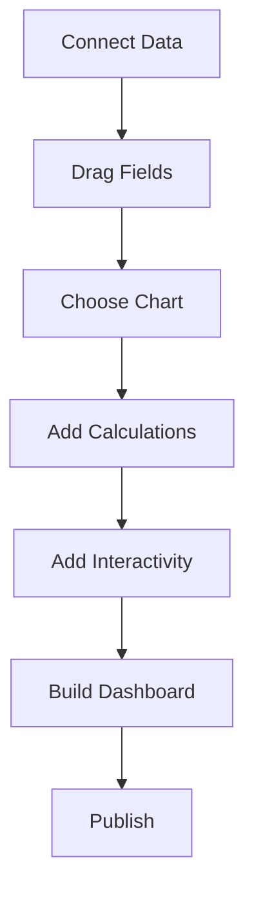
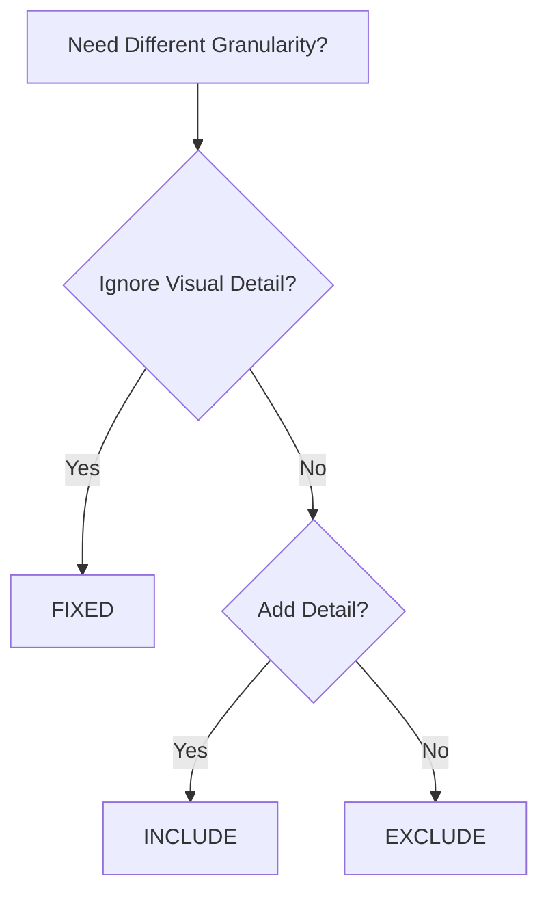
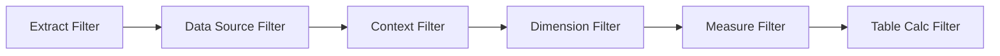

## Table of Contents
- [Introduction](#introduction)
- [Learning Roadmap](#learning-roadmap)
- [Theory Notes](#theory-notes)
- [Key Concepts](#key-concepts)
- [FAQ (35+ Q&A)](#faq-35-qa)
- [Hands-on Practice](#hands-on-practice)
- [FAANG Questions](#faang-questions)
- [Common Mistakes](#common-mistakes)
- [Best Practices](#best-practices)
- [Cheat Sheet](#cheat-sheet)
- [Flash Cards (30)](#flash-cards-30)
- [Mind Map](#mind-map)
- [Mermaid Diagrams](#mermaid-diagrams)
- [Code Examples](#code-examples)
- [Projects](#projects)
- [Resources](#resources)
- [Checklist](#checklist)
- [Revision Plans](#revision-plans)
- [Mock Interviews](#mock-interviews)
- [Difficulty Rating](#difficulty-rating)
- [Summary](#summary)

---

## Introduction

Tableau is a leading data visualization and business intelligence platform. It enables users to create interactive, shareable dashboards from various data sources. Tableau's drag-and-drop interface makes it accessible to business users while offering advanced analytical capabilities through calculated fields, LOD expressions, and table calculations.

Tableau Desktop is for creating visualizations, Tableau Server/Online for sharing and collaboration, and Tableau Prep for data preparation. Mastery of Tableau demonstrates strong data visualization and analytical skills valued across industries.

Tableau's philosophy centers on making data accessible and actionable through visual exploration. The platform empowers users to go from raw data to actionable insights quickly, making it a favorite among data analysts, business intelligence professionals, and executives alike.

---

## Learning Roadmap

### Phase 1: Basics (Week 1-2)
- Tableau interface and workspace
- Connecting to data sources
- Basic chart types (bar, line, scatter, map)
- Filters, marks, and shelves

### Phase 2: Intermediate (Week 3-4)
- Calculated fields
- Parameters
- Table calculations
- Dual-axis charts
- Combined axis charts

### Phase 3: Advanced (Week 5-7)
- LOD expressions (FIXED, INCLUDE, EXCLUDE)
- Advanced calculations
- Dashboard design
- Story points
- Mapping and geographic analysis

### Phase 4: Expert (Week 8-10)
- Performance optimization
- Tableau Server/Online
- Data preparation with Tableau Prep
- Advanced analytics
- Level of detail mastery

### Phase 5: Production (Week 11-12)
- Enterprise deployment
- Data governance
- Embedded analytics
- Advanced formatting
- Best practices for large datasets

---

## Theory Notes

### Tableau Interface
- **Data Pane**: Lists tables, fields, and hierarchies
- **Shelves**: Columns, Rows, Filters, Pages, Marks
- **Marks Card**: Controls color, size, shape, label, detail, tooltip
- **Show Me**: Quick chart type suggestions
- **Analytics Pane**: Reference lines, trend lines, forecasts

### Chart Types and When to Use
- **Bar chart**: Comparing categories
- **Line chart**: Trends over time
- **Scatter plot**: Relationships between two measures
- **Heat map**: Patterns in matrix data
- **Tree map**: Hierarchical proportions
- **Map**: Geographic data
- **Box plot**: Distribution and outliers
- **Histogram**: Frequency distribution

### Calculated Fields
Create new fields using formulas:
- Row-level calculations (per record)
- Aggregate calculations (SUM, AVG, etc.)
- Logic functions (IF, CASE)
- String functions (LEFT, RIGHT, SPLIT)
- Date functions (DATEPART, DATEDIFF)

### Table Calculations
Calculations performed on the marks in the visual:
- **Quick Table Calc**: Running total, percent of total, rank, moving average
- **Compute Using**: Table (across/down), Pane, Cell
- **Addressing vs Partitioning**: Which dimensions to compute over vs split by

### LOD Expressions (Level of Detail)
Override the visual's level of detail:
- **FIXED**: Fixed at specified dimension regardless of visual
  `{FIXED [Region] : SUM([Sales])}`
- **INCLUDE**: Include additional dimensions
  `{INCLUDE [Product] : AVG([Rating])}`
- **EXCLUDE**: Exclude dimensions from calculation
  `{EXCLUDE [Date] : SUM([Sales])}`

### Parameters
Dynamic values that users can change:
- Replace values in calculations
- Filter ranges
- Control reference lines
- Create what-if scenarios

### Dashboard Design
- Layout containers (horizontal/vertical)
- Actions (filter, highlight, URL, change parameter)
- Device designer (desktop, tablet, phone)
- Performance recording
- Formatting consistency

### Data Blending
Combining data from multiple sources in one worksheet:
- Primary and secondary data sources
- Secondary data aggregated to primary source's LOD
- Limitation: secondary source cannot be used in row-level calculations
- Use when joins are not possible or practical

---

## Key Concepts

| Concept | Description |
|---------|-------------|
| LOD Expression | Level of Detail expression overriding visual granularity |
| Table Calculation | Computation on marks in the visual |
| Measure | Quantitative numeric field |
| Dimension | Categorical field defining level of detail |
| Shelf | Area for placing fields (Columns, Rows, Filters) |
| Mark | Individual data point in a visualization |
| Extract | Local cached copy of data for performance |
| Data Blend | Combining data from multiple sources |
| Story Point | Sequential narrative with multiple visualizations |
| Action | Interactive behavior linking sheets/dashboards |
| Alias | Alternative name for dimension member |
| Hierarchy | Drill-down path for dimensions |
| Dual Axis | Two measures on same chart with separate axes |
| Bin | Grouping continuous values into discrete ranges |

---

## FAQ (35+ Q&A)

### Q1: What is the difference between FIXED, INCLUDE, and EXCLUDE LOD expressions?
**A:** FIXED computes at specified dimensions regardless of visual. INCLUDE adds dimensions to the calculation. EXCLUDE removes dimensions. FIXED is most common and fastest.

### Q2: What is the difference between a filter and a context filter?
**A:** Regular filters apply after data is loaded. Context filters create a temporary table first, and other filters apply on the result. Use context filters when you need other filters to work on a reduced dataset.

### Q3: What is the difference between extract and live connection?
**A:** Extract creates a local cached copy (faster, works offline, smaller dataset possible). Live queries the source directly (always current, no cache management). Use extracts for performance; live for real-time data.

### Q4: What is data blending?
**A:** Combining data from multiple data sources in one worksheet. One source is primary; others are secondary. Secondary data is aggregated to the primary source's level of detail. Limited compared to joins.

### Q5: What is the difference between a calculated field and a table calculation?
**A:** Calculated fields operate on underlying data rows. Table calculations operate on the marks in the visual. Table calculations depend on what's in the view.

### Q6: How do you handle large datasets in Tableau?
**A:** Use extracts with aggregation, apply filters early, limit quick filter options, avoid row-level calculations on large data, use data source filters, and optimize LOD expressions.

### Q7: What is the difference between a dimension and a measure?
**A:** Dimensions are categorical (product name, region). Measures are numeric (sales, quantity). Dimensions define the level of detail; measures provide the values. Blue fields are dimensions; green are measures.

### Q8: What is a parameter?
**A:** A dynamic value that users can change. Used to control calculations, filters, and reference lines. Enables what-if analysis and user-driven exploration.

### Q9: What are dashboard actions?
**A:** Interactive behaviors: Filter (clicking one sheet filters another), Highlight, URL (navigate to web), Change Parameter, Go to Sheet. Create dynamic, interconnected dashboards.

### Q10: What is the difference between discrete and continuous fields?
**A:** Discrete (blue) create headers and separate values. Continuous (green) create axes and ranges. Discrete dimensions; continuous measures. Can be changed by right-clicking the field.

### Q11: What is a dual-axis chart?
**A:** Two measures on the same chart using two separate axes. Useful for comparing different scales (e.g., revenue and margin%). Synchronize axes when scales are similar.

### Q12: What is performance recording?
**A:** Tableau feature that records query execution times. Identifies slow queries, visualizations, and calculations. Found in Help > Debugging > Start Performance Recording.

### Q13: How do you create a running total?
**A:** Quick Table Calculation > Running Total. Or formula: RUNNING_SUM(SUM([Sales])). Control compute using dimensions in the table calculation settings.

### Q14: What is a story point?
**A:** A sequence of visualizations that tell a narrative. Each point is a sheet or dashboard with annotations. Used for presentations and data storytelling.

### Q15: What is the difference between Row-Level and Aggregate calculated fields?
**A:** Row-level operates on individual records. Aggregate operates on grouped data (SUM, AVG). Row-level used within aggregates; aggregate used in most analysis.

### Q16: How do you create a waterfall chart?
**A:** Use running total table calculation with Gantt bars mark type. Show positive and negative changes as colored bars going up and down.

### Q17: What is the difference between Tableau and Power BI?
**A:** Tableau excels at visualization flexibility and advanced analytics. Power BI is better integrated with Microsoft ecosystem and offers better data modeling. Both are excellent; choice depends on existing tech stack.

### Q18: What is a bullet chart?
**A:** Bar chart comparing a measure against a target. Shows actual vs target with qualitative ranges (poor, average, good). Used for performance against goals.

### Q19: How do you handle null values in Tableau?
**A:** Filter them out, use IFNULL/ZN functions to replace, or handle in data source. ZN converts null to zero. IFNULL lets you specify replacement value.

### Q20: What is the difference between Show Me and manual chart creation?
**A:** Show Me suggests chart types based on selected fields. Manual gives full control. Show Me is faster for standard charts; manual needed for customizations.

### Q21: What is the difference between a quick filter and a context filter?
**A:** Quick filters are standard interactive filters. Context filters create a temporary table first, and other filters work on this reduced set. Context filters are processed first and improve performance for complex filters.

### Q22: What is data preparation in Tableau Prep?
**A:** Tableau Prep is a separate tool for cleaning, shaping, and combining data before analysis. Provides visual flow of transformation steps. Can schedule flows for automation.

### Q23: What is a highlight action?
**A:** Dashboard action that highlights related data across sheets when clicking on a data point. Unlike filter actions, it doesn't remove other data; it just emphasizes matching values.

### Q24: What is the AGG function?
**A:** Aggregate function wrapper in Tableau. Used when mixing aggregated and non-aggregated fields. Forces computation at a specific level of detail.

### Q25: What is the difference between COUNT and COUNTD?
**A:** COUNT counts all rows including duplicates. COUNTD counts distinct/unique values. COUNTD is more expensive computationally.

### Q26: What is a combined axis chart?
**A:** Two or more measures plotted on a single shared axis using different marks (e.g., bar and line). Different from dual-axis which has separate axes.

### Q27: What is a reference line?
**A:** Line added to a chart showing a constant, average, median, or percentile value. Useful for comparing values against targets or benchmarks. Added from Analytics pane.

### Q28: What is the Pages shelf?
**A:** Creates an animation or pagination of a visualization. Adds a slider or play button to step through values of a field. Useful for time-based animation.

### Q29: What is the difference between a filter and a set?
**A:** A filter shows/hides data. A set defines a custom subset for analysis (IN/OUT). Sets can be used in calculations, color, and size. Sets are more flexible for conditional grouping.

### Q30: What is the difference between a group and a set?
**A:** A group is a static category. A set is dynamic and can change based on conditions. Groups create permanent categories; sets create logical subsets for analysis.

### Q31: What is the MAX/MIN function?
**A:** Returns the maximum or minimum of values. Can compare two values or be used as aggregate. Example: MAX([Sales], [Target]) returns the larger of the two.

### Q32: What is the SIZE function?
**A:** Table calculation returning the number of marks in the partition. Used in table calculations to understand the current visualization's structure.

### Q33: What is the FIRST and LAST function?
**A:** Table calculations returning the offset of the current row from the first or last row in the partition. Useful for calculations comparing to start or end of data.

### Q34: What is a data source filter?
**A:** Filter applied at the data source level, before data is loaded into Tableau. More efficient than worksheet filters. Applied during extract creation or live connection.

### Q35: What is the difference between calculated fields and table calculations for ranking?
**A:** Calculated field ranking: RANK(SUM([Sales])) is computed on the underlying data. Table calculation ranking depends on what's in the view and changes as dimensions are added/removed.

---

## Hands-on Practice

### LOD Expression Examples
```sql
-- Total sales per region (regardless of view)
{FIXED [Region] : SUM([Sales])}

-- Average order size per customer
{INCLUDE [Customer_ID] : AVG([Sales])}

-- Total sales excluding date breakdown
{EXCLUDE [Date] : SUM([Sales])}

-- Percent of total sales per region
SUM([Sales]) / {FIXED : SUM([Sales])}

-- First order date per customer
{FIXED [Customer_ID] : MIN([Order Date])}

-- Rank within category
RANK(SUM([Sales]))  -- use as table calculation
```

### Table Calculation
```sql
-- Running total of sales
RUNNING_SUM(SUM([Sales]))

-- Percent of total
SUM([Sales]) / TOTAL(SUM([Sales]))

-- Rank by sales
RANK(SUM([Sales]))

-- Moving average (7-day)
WINDOW_AVG(SUM([Sales]), -6, 0)

-- Difference from previous
SUM([Sales]) - LOOKUP(SUM([Sales]), -1)
```

### Calculated Field Patterns
```sql
-- Year-over-year growth
(SUM([Sales]) - LOOKUP(SUM([Sales]), -1)) / ABS(LOOKUP(SUM([Sales]), -1))

-- Profit ratio
SUM([Profit]) / SUM([Sales])

-- Conditional measure
IF [Category] = "Electronics" THEN [Sales] * 0.9 ELSE [Sales] END

-- Days since last order
DATEDIFF('day', [Last Order Date], TODAY())

-- Customer segmentation
IF [Total Sales] > 10000 THEN "Premium"
ELSEIF [Total Sales] > 5000 THEN "Standard"
ELSE "Basic" END
```

---

## FAANG Questions

1. **Google**: Build a sales dashboard showing trends, regional breakdown, and product performance.
2. **Microsoft**: Design an executive dashboard with KPIs, drilldown, and what-if analysis.
3. **Amazon**: Create a supply chain dashboard tracking inventory levels and delivery performance.
4. **Meta**: Design a marketing analytics dashboard tracking campaign ROI across channels.
5. **Google**: How would you optimize a Tableau workbook with slow performance?
6. **Microsoft**: Build a financial reporting dashboard with YTD calculations and budget comparison.
7. **Amazon**: Design an HR analytics dashboard with headcount trends and attrition analysis.
8. **Tableau**: Create a customer segmentation visualization using LOD expressions.
9. **Google**: Build a geographic analysis dashboard with multiple map layers and drilldown.
10. **Microsoft**: Design an interactive story point presentation for quarterly business review.
11. **Amazon**: How would you handle blending data from SQL and Excel sources?
12. **Meta**: Design a real-time dashboard for social media metrics monitoring.
13. **Google**: Create a dashboard that works across desktop and mobile devices.
14. **Microsoft**: How would you implement row-level security in Tableau Server?
15. **Amazon**: Design an anomaly detection dashboard for operational metrics.

---

## Common Mistakes

1. Using table calculations when LOD expressions are needed
2. Not considering dashboard performance
3. Overloading dashboards with too many visuals
4. Ignoring mobile layout design
5. Not using extract for performance
6. Hardcoding values instead of using parameters
7. Inconsistent formatting across dashboards
8. Not testing with different screen sizes
9. Ignoring color accessibility
10. Not documenting calculations and data sources
11. Using too many quick filters
12. Not optimizing extract filters
13. Mixing aggregate and non-aggregate incorrectly
14. Ignoring data source performance
15. Not using hierarchies for drill-down

---

## Best Practices

1. Plan dashboard layout before building
2. Use consistent formatting and color schemes
3. Optimize for performance (extracts, filters)
4. Design for target audience (executives vs analysts)
5. Use parameters for dynamic analysis
6. Test interactivity thoroughly
7. Document calculations and data sources
8. Consider mobile viewing experience
9. Use story points for narratives
10. Build templates for consistency
11. Leverage LOD expressions appropriately
12. Validate data accuracy before publishing
13. Use data source filters for performance
14. Keep color palettes accessible
15. Limit quick filter options for performance

---

## Cheat Sheet

### LOD Expression Reference
| Type | Purpose | Example |
|------|---------|---------|
| FIXED | Fixed granularity | `{FIXED [Region] : SUM([Sales])}` |
| INCLUDE | Add detail | `{INCLUDE [Product] : AVG([Rating])}` |
| EXCLUDE | Remove detail | `{EXCLUDE [Date] : SUM([Sales])}` |

### Chart Selection Guide
| Data Type | Recommended Chart |
|-----------|------------------|
| Category comparison | Bar chart |
| Trend over time | Line chart |
| Part of whole | Pie/Donut |
| Distribution | Histogram/Box plot |
| Relationship | Scatter plot |
| Geographic | Map |
| Hierarchy | Tree map |
| Performance vs target | Bullet chart |
| Composition over time | Stacked area |
| Ranking | Horizontal bar |

### Key Functions
```
DATEPART('month', [Date])
DATEDIFF('day', [Start], [End])
IFNULL([Field], 0)
ZN(SUM([Sales]))
WINDOW_AVG(SUM([Sales]), -2, 0)
RANK(SUM([Sales]))
CONTAINS([Field], "text")
SPLIT([Field], ".", 1)
DATEDIFF('day', [Order Date], TODAY())
```

### Quick Table Calculations
| Calculation | Use |
|-------------|-----|
| Running Total | Cumulative sum |
| Percent of Total | Share of whole |
| Rank | Position in list |
| Moving Average | Smoothed trend |
| Difference | Change from prior |
| Percent Difference | Growth rate |

---

## Flash Cards (30)

**Card 1:** Q: What is an LOD expression? A: Level of Detail expression overriding the visual's granularity for calculations.

**Card 2:** Q: FIXED vs INCLUDE? A: FIXED ignores visual detail; INCLUDE adds dimensions to calculation.

**Card 3:** Q: What is a table calculation? A: Computation on marks in the visual (running total, percent of total).

**Card 4:** Q: What is data blending? A: Combining multiple data sources when joins aren't possible.

**Card 5:** Q: Extract vs live? A: Extract caches data (faster); live queries source directly (real-time).

**Card 6:** Q: What is a parameter? A: Dynamic user-controlled value replacing constants in calculations.

**Card 7:** Q: Discrete vs continuous? A: Discrete (blue) creates headers; continuous (green) creates axes.

**Card 8:** Q: What is a dual-axis chart? A: Two measures on same chart with separate axes.

**Card 9:** Q: What is Show Me? A: Auto-suggest chart types based on selected fields.

**Card 10:** Q: Context filter? A: Filter creating temporary table before other filters apply.

**Card 11:** Q: Dashboard action? A: Interactive behavior linking sheets (filter, highlight, URL).

**Card 12:** Q: Story point? A: Sequential narrative of visualizations for presentations.

**Card 13:** Q: Running total? A: RUNNING_SUM() or Quick Table Calculation > Running Total.

**Card 14:** Q: What is ZN? A: Converts null values to zero for calculations.

**Card 15:** Q: Performance recording? A: Tool identifying slow queries and visualizations.

**Card 16:** Q: What is a bullet chart? A: Bar comparing actual vs target with qualitative ranges.

**Card 17:** Q: What is a heat map? A: Matrix with color encoding values for pattern detection.

**Card 18:** Q: What is compute using? A: Settings controlling which dimensions table calculations use.

**Card 19:** Q: What is a tree map? A: Nested rectangles showing hierarchical proportions.

**Card 20:** Q: What is device designer? A: Tool for optimizing dashboards for different screen sizes.

**Card 21:** Q: What is a highlight action? A: Emphasizes related data across sheets without filtering.

**Card 22:** Q: COUNT vs COUNTD? A: COUNT counts all rows; COUNTD counts distinct values.

**Card 23:** Q: What is a set? A: Custom dynamic subset of data for conditional analysis.

**Card 24:** Q: What is a group? A: Static category for dimension members.

**Card 25:** Q: What is a reference line? A: Constant/average line added for comparison benchmarks.

**Card 26:** Q: What is the Pages shelf? A: Creates animation or pagination for visualization.

**Card 27:** Q: What is combined axis? A: Multiple measures on single shared axis with different marks.

**Card 28:** Q: What is a data source filter? A: Filter applied at data source level before loading.

**Card 29:** Q: What is RANK function? A: Table calculation returning position within partition.

**Card 30:** Q: What is LOOKUP function? A: Table calculation returning value from different row in partition.

---

## Mind Map

```
Tableau
├── Data
│   ├── Connections
│   ├── Joins/Blending
│   └── Extracts
├── Visualizations
│   ├── Chart Types
│   ├── Marks Card
│   └── Show Me
├── Calculations
│   ├── Calculated Fields
│   ├── Table Calculations
│   └── LOD Expressions
├── Interactivity
│   ├── Filters
│   ├── Parameters
│   └── Actions
├── Dashboards
│   ├── Layout
│   ├── Story Points
│   └── Mobile Design
└── Publishing
    ├── Server/Online
    ├── Performance
    └── Governance
```

---

## Mermaid Diagrams

### Tableau Workflow


### LOD Expression Decision


### Filter Order


---

## Code Examples

### Complex LOD Calculations
```sql
-- Percent of total sales by region
SUM([Sales]) / {FIXED : SUM([Sales])}

-- Sales vs region average
SUM([Sales]) - {FIXED [Region] : AVG({FIXED [Customer_ID] : SUM([Sales])})}

-- Running total within partition
RUNNING_SUM(SUM([Sales]))  -- table calc

-- Customer lifetime value
{FIXED [Customer_ID] : SUM([Sales])}

-- Days between first and last order
DATEDIFF('day',
    {FIXED [Customer_ID] : MIN([Order Date])},
    {FIXED [Customer_ID] : MAX([Order Date])}
)
```

### Advanced Table Calculations
```sql
-- Percent change from previous
(SUM([Sales]) - LOOKUP(SUM([Sales]), -1)) / ABS(LOOKUP(SUM([Sales]), -1))

-- Cumulative distribution
RUNNING_SUM(COUNT([Orders])) / TOTAL(COUNT([Orders]))

-- Moving difference
SUM([Sales]) - LOOKUP(SUM([Sales]), -1)

-- Index (row number in partition)
INDEX()

-- Window median
WINDOW_MEDIAN(SUM([Sales]), -6, 0)
```

### Dashboard Parameter Actions
```
Parameter Actions:
1. Create parameter: Target Category
2. Create action: Change parameter when clicking bar chart
3. Use parameter in calculation to filter/detail other sheets
4. Result: Clicking a category updates related visuals
```

---

## Projects

1. **Sales Dashboard**: Multi-sheet dashboard with drilldown and filtering
2. **Financial Report**: YTD calculations, budget vs actual, waterfall chart
3. **Geographic Analysis**: Multi-layer map with regional drilldown
4. **Executive Story**: Story point presentation for quarterly review
5. **HR Analytics**: Headcount, attrition, and diversity analysis
6. **Marketing Dashboard**: Campaign performance, ROI, channel comparison
7. **Customer Segmentation**: LOD-based segmentation visualization
8. **Operational Monitoring**: Real-time KPI dashboard with alerts

---

## Resources

- **Training**: Tableau Public Training, Coursera Data Visualization
- **Community**: Tableau Public, forums, user groups
- **Certification**: Tableau Desktop Specialist, Certified Associate
- **Practice**: Makeover Monday, Sports Viz Sunday
- **Books**: "The Big Book of Dashboards" (Wexler), "Communicating Data with Tableau" (Murray)
- **YouTube**: Tableau Tim, Andy Kriebel, Eva Murray
- **Community**: Tableau Community forums, Reddit r/tableau

---

## Checklist

- [ ] Tableau interface proficiency
- [ ] All basic chart types
- [ ] Calculated fields
- [ ] LOD expressions (FIXED, INCLUDE, EXCLUDE)
- [ ] Table calculations
- [ ] Parameters
- [ ] Dashboard design and actions
- [ ] Story points
- [ ] Performance optimization
- [ ] Publishing to Server/Online
- [ ] Data blending and joins
- [ ] Extract optimization
- [ ] Mobile layout design
- [ ] Color accessibility
- [ ] Documentation practices

---

## Revision Plans

### Week 1: Basics
- Interface and workspace
- Basic chart types
- Filters and marks
- Connect to data sources

### Week 2-3: Intermediate
- Calculated fields
- Table calculations
- Parameters
- Dual-axis charts

### Week 4-5: Advanced
- LOD expressions deep dive
- Dashboard design
- Actions and interactivity
- Performance optimization

### Week 6: Expert
- Story points
- Server/Online publishing
- Data preparation
- Advanced analytics

### Final Week: Integration
- Build portfolio project
- Practice interview scenarios
- Join Makeover Monday challenges

---

## Mock Interviews

### Round 1: Calculations
1. Write an LOD expression for percent of total sales by region
2. Create a table calculation for year-over-year growth
3. How would you calculate customer lifetime value?

### Round 2: Dashboard Design
1. Design a sales dashboard for a retail company
2. How would you handle performance with 10M+ rows?
3. Create a story point presentation for quarterly review

### Round 3: Strategy
1. When would you use LOD vs table calculations?
2. How would you implement drill-down from region to city?
3. Design a mobile-optimized dashboard

---

## Difficulty Rating

| Topic | Difficulty | Frequency |
|-------|-----------|-----------|
| Basic Charts | Easy | Very High |
| Filters | Easy-Medium | Very High |
| Calculated Fields | Medium | Very High |
| Table Calculations | Medium-High | High |
| LOD Expressions | Medium-High | High |
| Parameters | Medium | Medium |
| Dashboard Design | Medium | High |
| Performance | Hard | Medium |
| Server/Online | Medium | Medium |
| Data Blending | Medium | Medium |

---

## Summary

Tableau interviews test visualization skills, LOD expression mastery, dashboard design, and analytical thinking. Practice building interactive dashboards, mastering LOD expressions, and designing for different audiences. Tableau Public offers great practice opportunities. The ability to tell compelling stories with data distinguishes exceptional Tableau developers. Understanding both the technical and design aspects demonstrates comprehensive Tableau expertise.
