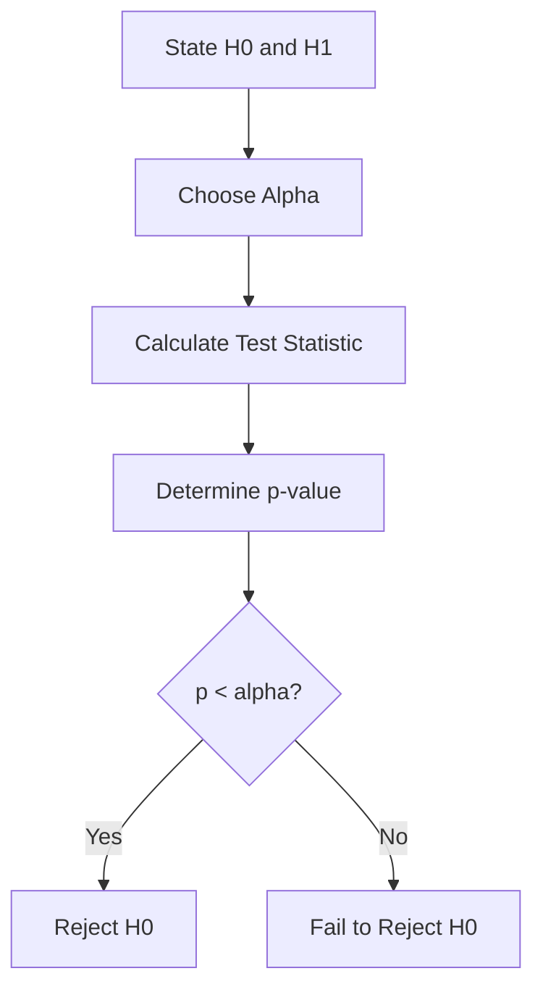
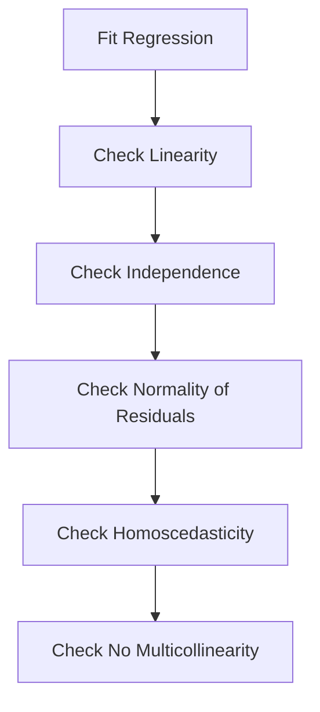

## Table of Contents
- [Introduction](#introduction)
- [Learning Roadmap](#learning-roadmap)
- [Theory Notes](#theory-notes)
- [Key Concepts](#key-concepts)
- [FAQ (35+ Q&A)](#faq-35-qa)
- [Hands-on Practice](#hands-on-practice)
- [FAANG Questions](#faang-questions)
- [Common Mistakes](#common-mistakes)
- [Best Practices](#best-practices)
- [Cheat Sheet](#cheat-sheet)
- [Flash Cards (30)](#flash-cards-30)
- [Mind Map](#mind-map)
- [Mermaid Diagrams](#mermaid-diagrams)
- [Code Examples](#code-examples)
- [Projects](#projects)
- [Resources](#resources)
- [Checklist](#checklist)
- [Revision Plans](#revision-plans)
- [Mock Interviews](#mock-interviews)
- [Difficulty Rating](#difficulty-rating)
- [Summary](#summary)

---

## Introduction

Statistics is the mathematical foundation of data science, machine learning, and analytics. It provides the tools for collecting, analyzing, interpreting, and presenting data. A strong statistics foundation enables you to make rigorous inferences, design experiments, validate results, and communicate findings with confidence.

Statistics interviews test both conceptual understanding and practical application. You need to know when to apply which test, interpret results correctly, and understand assumptions and limitations.

The field of statistics bridges theory and practice, providing the rigorous framework needed to make data-driven decisions. Whether you are running A/B tests, building predictive models, or analyzing experimental results, statistical thinking is essential for sound conclusions.

---

## Learning Roadmap

### Phase 1: Descriptive Statistics (Week 1-2)
- Central tendency (mean, median, mode)
- Dispersion (variance, standard deviation, IQR)
- Distribution shapes (skewness, kurtosis)
- Data visualization basics

### Phase 2: Probability (Week 3-4)
- Probability rules (addition, multiplication)
- Conditional probability, Bayes theorem
- Common distributions (normal, binomial, Poisson)
- Central Limit Theorem

### Phase 3: Inferential Statistics (Week 5-7)
- Confidence intervals
- Hypothesis testing (t-test, chi-square, ANOVA)
- p-values and significance
- Type I and Type II errors
- Power analysis

### Phase 4: Regression (Week 8-9)
- Simple linear regression
- Multiple regression
- Assumptions and diagnostics
- Logistic regression basics

### Phase 5: Advanced Topics (Week 10-12)
- Bayesian statistics
- Non-parametric tests
- Multiple comparisons
- Effect size and practical significance
- Experimental design

---

## Theory Notes

### Descriptive Statistics
Summarize and describe data features:
- **Mean**: Sum of values / count. Sensitive to outliers.
- **Median**: Middle value when sorted. Robust to outliers.
- **Mode**: Most frequent value.
- **Variance**: Average squared deviation from mean.
- **Standard Deviation**: Square root of variance. Same units as data.
- **IQR**: Q3 - Q1. Range of middle 50%. Robust to outliers.

### Probability Distributions

**Normal (Gaussian)**: Symmetric bell curve. Mean = median = mode. 68-95-99.7 rule. Foundation for many statistical tests.

**Binomial**: Number of successes in n independent trials. Parameters: n (trials), p (success probability). Mean = np, Var = np(1-p).

**Poisson**: Number of events in fixed interval. Parameter: lambda (rate). Mean = Var = lambda. Used for rare events.

**Exponential**: Time between Poisson events. Parameter: lambda. Memoryless property.

### Central Limit Theorem (CLT)
Sample means are approximately normally distributed regardless of population distribution, given sufficient sample size (n >= 30). This enables hypothesis testing and confidence intervals even for non-normal data.

### Hypothesis Testing Framework
1. State H0 (null) and H1 (alternative)
2. Choose significance level (alpha, typically 0.05)
3. Calculate test statistic
4. Determine p-value
5. Make decision: if p < alpha, reject H0

### Confidence Intervals
Range likely containing the true population parameter:
**CI = point estimate +/- critical value * standard error**

95% CI: If we repeated the study many times, 95% of intervals would contain the true parameter.

### Regression Analysis

**Simple Linear Regression**: Y = b0 + b1*X + e
- b1 = covariance(X,Y) / variance(X)
- b0 = mean(Y) - b1 * mean(X)
- R-squared = proportion of variance explained

**Assumptions**: Linearity, independence, homoscedasticity, normality of residuals, no multicollinearity.

**Multiple Regression**: Y = b0 + b1*X1 + b2*X2 + ... + bn*Xn + e

### Logistic Regression
For binary outcomes: log(p/(1-p)) = b0 + b1*X1 + ... + bn*Xn
- Sigmoid function maps to probability [0,1]
- Maximum likelihood estimation for parameters
- Odds ratio = exp(coefficient)

### Non-Parametric Tests
When parametric assumptions are violated:
- **Mann-Whitney U**: Compare 2 groups (non-parametric t-test)
- **Kruskal-Wallis**: Compare 3+ groups (non-parametric ANOVA)
- **Wilcoxon Signed-Rank**: Paired non-parametric test
- **Spearman Correlation**: Rank-based correlation
- **Chi-Square**: Test independence of categorical variables

### Experimental Design
- **Randomized Controlled Trial (RCT)**: Gold standard for causation
- **Randomization**: Eliminates systematic bias
- **Control groups**: Baseline for comparison
- **Blinding**: Prevents expectation effects (single/double blind)
- **Replication**: Repeating experiments for reliability

---

## Key Concepts

| Concept | Description |
|---------|-------------|
| p-value | Probability of observing results assuming H0 is true |
| Confidence Interval | Range likely containing true parameter |
| Effect Size | Magnitude of difference/relationship |
| Statistical Power | Probability of detecting true effect |
| Central Limit Theorem | Sample means are approximately normal |
| Bayes Theorem | P(A|B) = P(B|A)*P(A)/P(B) |
| Normal Distribution | Symmetric bell curve, 68-95-99.7 rule |
| Regression | Modeling relationship between variables |
| Type I Error | False positive (rejecting true H0) |
| Type II Error | False negative (failing to reject false H0) |
| Sampling Distribution | Distribution of a statistic over many samples |
| Standard Error | Standard deviation of sampling distribution |
| Degrees of Freedom | Number of independent values in calculation |
| Parametric Test | Assumes specific distribution (usually normal) |
| Non-Parametric Test | No distributional assumptions |

---

## FAQ (35+ Q&A)

### Q1: What is the difference between parameter and statistic?
**A:** A parameter describes a population (true mean). A statistic describes a sample (sample mean). We use statistics to estimate parameters.

### Q2: What is the Central Limit Theorem?
**A:** Sample means are approximately normally distributed regardless of population shape, given sufficient sample size (n >= 30). Enables hypothesis testing and confidence intervals for any distribution.

### Q3: When do you use a t-test vs z-test?
**A:** Z-test when population variance is known or n > 30. t-test when population variance is unknown and n < 30. t-distribution has heavier tails, accounting for additional uncertainty.

### Q4: What is the difference between Type I and Type II errors?
**A:** Type I (alpha): False positive - rejecting a true null hypothesis. Type II (beta): False negative - failing to reject a false null hypothesis. Trade-off controlled by alpha level and sample size.

### Q5: What is statistical power?
**A:** Probability of correctly rejecting a false null hypothesis (1 - beta). Higher power = better chance of detecting real effects. Typically want power >= 0.80. Increases with larger sample size, larger effect, and lower alpha.

### Q6: When do you use chi-square vs t-test?
**A:** Chi-square tests independence of categorical variables. t-test compares means of continuous variables. Chi-square for associations between categorical variables; t-test for comparing group means.

### Q7: What is ANOVA?
**A:** Analysis of Variance. Compares means across 3+ groups. Tests if any group mean differs from others. F-statistic = between-group variance / within-group variance. Follow-up tests (Tukey) identify which groups differ.

### Q8: What is a p-value?
**A:** Probability of observing results at least as extreme as obtained, assuming the null hypothesis is true. Small p-value (< 0.05) suggests observed effect is unlikely due to chance alone. Not the probability that H0 is true.

### Q9: What is the difference between correlation and causation?
**A:** Correlation measures association strength (-1 to 1). Causation means one variable causes changes in another. Confounding variables, reverse causation, and coincidence can create correlation without causation.

### Q10: What is R-squared?
**A:** Proportion of variance in dependent variable explained by independent variables. Range 0-1. Higher means more variance explained. Adjusted R-squared penalizes for additional variables.

### Q11: What is a confidence interval?
**A:** Range likely containing the true population parameter with specified confidence level. 95% CI means 95% of such intervals from repeated sampling would contain the true value. Wider CI = more uncertainty.

### Q12: What is Bayes theorem?
**A:** Updates prior probability with new evidence: P(A|B) = P(B|A) * P(A) / P(B). Combines prior belief with observed data to form posterior belief. Foundation of Bayesian statistics.

### Q13: What is the difference between parametric and non-parametric tests?
**A:** Parametric tests assume specific distribution (usually normal). Non-parametric tests make fewer assumptions. Use non-parametric when: data is ordinal, sample is small, or normality assumption is violated.

### Q14: What is heteroscedasticity?
**A:** Non-constant variance of residuals in regression. Violates OLS assumptions. Detected via residual plots. Solutions: weighted least squares, robust standard errors, data transformation.

### Q15: What is multicollinearity?
**A:** High correlation between independent variables in regression. Makes coefficient estimates unstable and hard to interpret. Detected via VIF (Variance Inflation Factor). Solutions: remove correlated variables, PCA.

### Q16: What is effect size?
**A:** Magnitude of difference or relationship independent of sample size. Cohen's d for means, r for correlation, odds ratio for logistic regression. Important because statistical significance does not imply practical significance.

### Q17: When is the median preferred over the mean?
**A:** When data is skewed, has outliers, or is ordinal. Median is robust to extreme values. Mean is preferred for symmetric, continuous data without outliers.

### Q18: What is a Bonferroni correction?
**A:** Adjusts alpha for multiple comparisons: adjusted alpha = original alpha / number of tests. Conservative but controls family-wise error rate. Alternatives: Holm-Bonferroni, Benjamini-Hochberg.

### Q19: What is simple vs multiple regression?
**A:** Simple: one independent variable predicting dependent. Multiple: two or more predictors. Multiple regression controls for confounding variables and can model more complex relationships.

### Q20: What is the difference between Bayesian and frequentist statistics?
**A:** Frequentist: probability as long-run frequency, fixed parameters, p-values. Bayesian: probability as belief, parameters have distributions, uses prior + data = posterior. Bayesian incorporates prior knowledge.

### Q21: What is a sampling distribution?
**A:** Distribution of a statistic (like the mean) calculated from many samples. Shows how the statistic varies from sample to sample. Foundation for understanding standard error and confidence intervals.

### Q22: What is standard error?
**A:** Standard deviation of the sampling distribution of a statistic. Measures precision of the estimate. SE = standard deviation / sqrt(n). Smaller SE = more precise estimate.

### Q23: What are degrees of freedom?
**A:** Number of independent values that can vary in a statistical calculation. For t-test: df = n - 1. Affects the critical values and p-values of tests.

### Q24: What is a one-tailed vs two-tailed test?
**A:** One-tailed tests for effect in one direction. Two-tailed tests for effect in either direction. Two-tailed is more conservative and more common. Always use two-tailed unless strong directional hypothesis.

### Q25: What is the Shapiro-Wilk test?
**A:** Tests whether data follows a normal distribution. Null hypothesis: data is normal. If p < 0.05, reject normality assumption. Use to check assumptions before parametric tests.

### Q26: What is bootstrapping?
**A:** Resampling technique estimating sampling distribution by repeatedly sampling with replacement from data. Used to estimate confidence intervals and standard errors without distributional assumptions.

### Q27: What is the difference between Pearson and Spearman correlation?
**A:** Pearson measures linear association between continuous variables. Spearman measures monotonic association based on ranks. Use Spearman for ordinal data or non-linear monotonic relationships.

### Q28: What is a residual?
**A:** Difference between observed and predicted values: e = y - y_hat. Analysis of residuals helps check regression assumptions (normality, homoscedasticity, linearity).

### Q29: What is leverage and influence?
**A:** Leverage: how far an observation's predictor values are from the mean. Influence: how much a coefficient changes when observation is removed. High leverage + large residual = influential point.

### Q30: What is cross-validation?
**A:** Technique assessing model generalization by splitting data into training and validation sets. K-fold cross-validation divides data into k parts, training on k-1 and testing on 1, rotating through all.

### Q31: What is overfitting?
**A:** Model fits training data too closely, including noise. Performs well on training but poorly on new data. Detected when training performance is much higher than test performance. Solutions: regularization, more data, simpler model.

### Q32: What is the Mann-Whitney U test?
**A:** Non-parametric alternative to independent t-test. Tests whether two groups come from the same distribution. Based on ranks rather than means. Use when normality assumption is violated.

### Q33: What is the Kruskal-Wallis test?
**A:** Non-parametric alternative to one-way ANOVA. Tests whether three or more groups come from the same distribution. Based on ranks. Follow-up with Dunn's test for pairwise comparisons.

### Q34: What is effect size vs statistical significance?
**A:** Statistical significance tells you if an effect is likely real (p < 0.05). Effect size tells you how large the effect is. A tiny effect can be statistically significant with large sample. Always report both.

### Q35: What is a power analysis?
**A:** Calculating required sample size to detect an effect of given size with given power. Inputs: effect size, alpha, desired power (typically 0.80). Used during experiment design to ensure adequate sample size.

---

## Hands-on Practice

### Hypothesis Testing in Python
```python
from scipy import stats
import numpy as np

# One-sample t-test
data = [23, 25, 28, 22, 27, 26, 24, 25, 29, 23]
t_stat, p_value = stats.ttest_1samp(data, popmean=25)

# Two-sample t-test
group_a = [23, 25, 28, 22, 27]
group_b = [30, 32, 29, 31, 33]
t_stat, p_value = stats.ttest_ind(group_a, group_b)

# Chi-square test
contingency = [[50, 30], [20, 40]]
chi2, p_value, dof, expected = stats.chi2_contingency(contingency)

# ANOVA
group1 = [23, 25, 28]
group2 = [30, 32, 29]
group3 = [35, 33, 37]
f_stat, p_value = stats.f_oneway(group1, group2, group3)
```

### Confidence Interval
```python
import numpy as np
from scipy import stats

data = np.random.normal(100, 15, 50)
mean = np.mean(data)
se = stats.sem(data)
ci_95 = stats.t.interval(0.95, len(data)-1, loc=mean, scale=se)

# Bootstrap confidence interval
def bootstrap_ci(data, n_bootstrap=10000, ci=0.95):
    boot_means = []
    for _ in range(n_bootstrap):
        sample = np.random.choice(data, size=len(data), replace=True)
        boot_means.append(np.mean(sample))
    lower = np.percentile(boot_means, (1-ci)/2 * 100)
    upper = np.percentile(boot_means, (1+ci)/2 * 100)
    return lower, upper
```

### Linear Regression
```python
from scipy import stats
import numpy as np

x = np.array([1, 2, 3, 4, 5, 6, 7, 8, 9, 10])
y = np.array([2, 4, 5, 4, 5, 7, 8, 9, 10, 11])

slope, intercept, r_value, p_value, std_err = stats.linregress(x, y)
print(f"R-squared: {r_value**2:.4f}")
print(f"p-value: {p_value:.4f}")
```

### Power Analysis
```python
from statsmodels.stats.power import TTestIndPower

analysis = TTestIndPower()
sample_size = analysis.solve_power(
    effect_size=0.5,
    alpha=0.05,
    power=0.80,
    ratio=1.0
)
print(f"Required sample size per group: {int(sample_size)}")
```

---

## FAANG Questions

1. **Google**: You run an A/B test and get p=0.03. What do you conclude? What else should you check?
2. **Meta**: Design an experiment to measure the impact of a new Facebook feature.
3. **Amazon**: How would you determine if a 5% increase in conversion is statistically significant?
4. **Netflix**: Explain when you would use a t-test vs chi-square test in practice.
5. **Google**: How do you handle multiple comparisons when testing many metrics?
6. **Meta**: What is the difference between statistical significance and practical significance?
7. **Amazon**: How do you calculate the required sample size for an A/B test?
8. **Netflix**: Explain regression analysis and when its assumptions are violated.
9. **Google**: You observe a correlation of 0.8 between two variables. What does this tell you?
10. **Meta**: Design an experiment for ranking algorithm changes with network effects.
11. **Amazon**: How would you analyze the results of a multi-variate experiment?
12. **Google**: A treatment group shows a 2% lift with p=0.04. Is this meaningful?
13. **Netflix**: How would you handle seasonality in time series analysis?
14. **Meta**: Design an experiment where randomization is not possible.
15. **Amazon**: Explain how you would use Bayesian methods for A/B testing.

---

## Common Mistakes

1. Confusing statistical and practical significance
2. Not checking assumptions before applying tests
3. Ignoring effect size (only reporting p-values)
4. Multiple comparisons without correction
5. Concluding causation from correlation
6. Not calculating confidence intervals
7. Using wrong test for data type
8. Ignoring sample size requirements
9. Cherry-picking statistically significant results
10. Not considering confounding variables
11. Misinterpreting p-values as probability H0 is true
12. Ignoring normality assumptions for t-tests
13. Not checking for outliers before analysis
14. Overfitting regression models
15. Not using randomization in experiments

---

## Best Practices

1. Always check assumptions before hypothesis testing
2. Report effect sizes and confidence intervals, not just p-values
3. Use appropriate statistical tests for data type
4. Correct for multiple comparisons
5. Design experiments with adequate power
6. Distinguish correlation from causation
7. Consider practical significance alongside statistical significance
8. Visualize data before running statistical tests
9. Document analysis decisions and assumptions
10. Use Bayesian methods when prior knowledge is available
11. Pre-register analysis plans when possible
12. Use appropriate sample sizes
13. Validate model assumptions with diagnostic plots
14. Report confidence intervals alongside point estimates
15. Consider both Type I and Type II errors

---

## Cheat Sheet

### Test Selection Guide
| Question Type | Test | Data |
|--------------|------|------|
| Compare 2 means | t-test | Continuous, 2 groups |
| Compare 3+ means | ANOVA | Continuous, 3+ groups |
| Test independence | Chi-square | Categorical |
| Correlation | Pearson/Spearman | Continuous/ordinal |
| Predict outcome | Regression | Continuous dependent |
| Non-normal data | Mann-Whitney/Kruskal | Ordinal/non-normal |

### Critical Values
| Confidence | Z-score | t (n=30) |
|-----------|---------|----------|
| 90% | 1.645 | 1.697 |
| 95% | 1.960 | 2.042 |
| 99% | 2.576 | 2.750 |

### Effect Size Benchmarks
| Measure | Small | Medium | Large |
|---------|-------|--------|-------|
| Cohen's d | 0.2 | 0.5 | 0.8 |
| r (correlation) | 0.1 | 0.3 | 0.5 |
| R-squared | 0.02 | 0.13 | 0.26 |

### Formulas Reference
| Metric | Formula |
|--------|---------|
| Mean | Sum(x) / n |
| Variance | Sum((x - mean)^2) / (n-1) |
| Std Dev | sqrt(Variance) |
| SE | Std Dev / sqrt(n) |
| CI | mean +/- z * SE |
| Cohen's d | (mean1 - mean2) / pooled_std |

---

## Flash Cards (30)

**Card 1:** Q: What is the CLT? A: Sample means are approximately normal regardless of population distribution.

**Card 2:** Q: p-value meaning? A: Probability of observed results assuming null hypothesis is true.

**Card 3:** Q: Type I vs Type II? A: Type I = false positive; Type II = false negative.

**Card 4:** Q: What is power? A: Probability of detecting true effect (1 - Type II error rate).

**Card 5:** Q: Mean vs median? A: Mean for symmetric data; median for skewed/outlier data.

**Card 6:** Q: What is R-squared? A: Proportion of variance in dependent variable explained by model.

**Card 7:** Q: When use t-test? A: Comparing means when population variance unknown and n < 30.

**Card 8:** Q: What is ANOVA? A: Analysis of variance comparing means across 3+ groups.

**Card 9:** Q: Correlation vs causation? A: Correlation is association; causation requires controlled experiments.

**Card 10:** Q: What is a confidence interval? A: Range likely containing true parameter with specified confidence.

**Card 11:** Q: What is Bayes theorem? A: P(A|B) = P(B|A)*P(A)/P(B), updating beliefs with evidence.

**Card 12:** Q: Standard deviation meaning? A: Average spread of data around the mean.

**Card 13:** Q: What is heteroscedasticity? A: Non-constant variance of residuals in regression.

**Card 14:** Q: What is multicollinearity? A: High correlation between independent variables in regression.

**Card 15:** Q: What is effect size? A: Magnitude of difference independent of sample size.

**Card 16:** Q: Bonferroni correction? A: Adjusting alpha for multiple comparisons (alpha/number of tests).

**Card 17:** Q: What is logistic regression? A: Regression for binary outcomes using sigmoid function.

**Card 18:** Q: What is IQR? A: Interquartile range (Q3-Q1), range of middle 50% of data.

**Card 19:** Q: What is skewness? A: Measure of distribution asymmetry.

**Card 20:** Q: What is normal distribution? A: Symmetric bell curve with 68-95-99.7 rule.

**Card 21:** Q: What is standard error? A: Standard deviation of sampling distribution, measures estimate precision.

**Card 22:** Q: What are degrees of freedom? A: Independent values that can vary in a calculation.

**Card 23:** Q: One-tailed vs two-tailed? A: One-tailed tests one direction; two-tailed tests both directions.

**Card 24:** Q: What is bootstrapping? A: Resampling with replacement to estimate sampling distribution.

**Card 25:** Q: Pearson vs Spearman? A: Pearson for linear continuous; Spearman for monotonic/rank-based.

**Card 26:** Q: What is a residual? A: Difference between observed and predicted values.

**Card 27:** Q: What is cross-validation? A: Assessing generalization by training/testing on data splits.

**Card 28:** Q: What is overfitting? A: Model fitting noise in training data, poor generalization.

**Card 29:** Q: Mann-Whitney U? A: Non-parametric alternative to independent t-test based on ranks.

**Card 30:** Q: What is power analysis? A: Calculating required sample size for desired power and effect size.

---

## Mind Map

```
Statistics
├── Descriptive
│   ├── Central Tendency
│   ├── Dispersion
│   └── Distribution
├── Probability
│   ├── Rules
│   ├── Distributions
│   └── CLT
├── Inferential
│   ├── Hypothesis Testing
│   ├── Confidence Intervals
│   └── p-values
├── Regression
│   ├── Linear
│   ├── Multiple
│   └── Logistic
└── Advanced
    ├── Bayesian
    ├── Non-parametric
    └── Experimental Design
```

---

## Mermaid Diagrams

### Hypothesis Testing Flow


### Regression Assumptions Check


---

## Code Examples

### Complete Statistical Analysis
```python
import numpy as np
from scipy import stats
import matplotlib.pyplot as plt

def comprehensive_analysis(data, alpha=0.05):
    results = {}

    # Descriptive statistics
    results['mean'] = np.mean(data)
    results['median'] = np.median(data)
    results['std'] = np.std(data, ddof=1)
    results['skewness'] = stats.skew(data)
    results['kurtosis'] = stats.kurtosis(data)

    # Normality tests
    stat_sw, p_sw = stats.shapiro(data)
    results['shapiro_p'] = p_sw

    # One-sample t-test
    t_stat, p_ttest = stats.ttest_1samp(data, popmean=0)
    results['t_test_p'] = p_ttest

    # Confidence interval
    se = stats.sem(data)
    ci = stats.t.interval(0.95, len(data)-1, loc=np.mean(data), scale=se)
    results['ci_95'] = ci

    return results
```

### A/B Test Framework
```python
from scipy import stats
import numpy as np

def ab_test(control, treatment, alpha=0.05):
    # Check assumptions
    _, p_norm_c = stats.shapiro(control)
    _, p_norm_t = stats.shapiro(treatment)

    # Choose test based on assumptions
    if p_norm_c > 0.05 and p_norm_t > 0.05:
        t_stat, p_value = stats.ttest_ind(control, treatment)
        test_used = "t-test"
    else:
        t_stat, p_value = stats.mannwhitneyu(control, treatment)
        test_used = "Mann-Whitney U"

    # Effect size (Cohen's d)
    pooled_std = np.sqrt((np.std(control)**2 + np.std(treatment)**2) / 2)
    cohens_d = (np.mean(treatment) - np.mean(control)) / pooled_std

    return {
        'test': test_used,
        'p_value': p_value,
        'significant': p_value < alpha,
        'cohens_d': cohens_d,
        'control_mean': np.mean(control),
        'treatment_mean': np.mean(treatment)
    }
```

---

## Projects

1. **A/B Test Analysis**: Design and analyze a controlled experiment
2. **Survey Analysis**: Apply descriptive and inferential statistics to survey data
3. **Regression Modeling**: Build predictive model with proper diagnostics
4. **Bayesian Analysis**: Apply Bayesian methods to real problem
5. **Power Analysis**: Calculate sample size requirements for experiments
6. **Survival Analysis**: Analyze time-to-event data
7. **Experimental Design**: Design multi-factor experiment with proper controls
8. **Time Series Analysis**: Decompose and forecast time-dependent data

---

## Resources

- **Books**: "Statistics" (Freedman), "All of Statistics" (Wasserman), "Practical Statistics for Data Scientists"
- **Courses**: MIT OCW Statistics, Khan Academy Statistics, Coursera Statistics with Python
- **Tools**: Python (scipy, statsmodels), R, SPSS, JASP
- **Practice**: Statistics questions on LeetCode, Khan Academy exercises
- **YouTube**: StatQuest, Khan Academy, 3Blue1Brown
- **Community**: Cross Validated (Stack Exchange), Reddit r/statistics

---

## Checklist

- [ ] Descriptive statistics
- [ ] Probability distributions
- [ ] Central Limit Theorem
- [ ] Hypothesis testing framework
- [ ] t-test, chi-square, ANOVA
- [ ] Confidence intervals
- [ ] Regression analysis
- [ ] Effect size and power
- [ ] Bayesian statistics basics
- [ ] Non-parametric tests
- [ ] Experimental design
- [ ] Correlation analysis
- [ ] Normality testing
- [ ] Model diagnostics
- [ ] Bootstrap methods

---

## Revision Plans

### Week 1-2: Foundations
- Descriptive statistics mastery
- Probability distributions
- CLT understanding

### Week 3-4: Core Testing
- Hypothesis testing framework
- t-tests, chi-square, ANOVA
- Confidence intervals

### Week 5-6: Regression
- Linear regression
- Model assumptions and diagnostics
- Logistic regression basics

### Week 7-8: Advanced
- Bayesian thinking
- Non-parametric tests
- Experimental design

### Final Week: Integration
- Practice interview questions
- Apply to real datasets
- Review formulas and test selection

---

## Mock Interviews

### Round 1: Concepts
1. Explain the difference between Type I and Type II errors with examples
2. When would you use a non-parametric test instead of a t-test?
3. What does a p-value of 0.03 actually mean?

### Round 2: Application
1. You have two groups with different means. Design an analysis plan
2. How would you determine sample size for an A/B test?
3. A regression shows R-squared of 0.85. Is this a good model?

### Round 3: Scenario
1. An experiment shows p=0.06. What do you recommend?
2. How would you analyze paired data (before/after measurements)?
3. Design an experiment for a feature with network effects

---

## Difficulty Rating

| Topic | Difficulty | Frequency |
|-------|-----------|-----------|
| Descriptive Stats | Easy | Very High |
| Hypothesis Testing | Medium | Very High |
| t-test | Medium | High |
| Chi-square | Medium | Medium |
| ANOVA | Medium-High | Medium |
| Regression | Medium-High | High |
| Confidence Intervals | Medium | High |
| Bayesian Methods | Hard | Growing |
| Non-parametric | Medium | Medium |
| Experimental Design | Medium-High | High |

---

## Summary

Statistics is the foundation of rigorous data analysis. Master descriptive statistics, probability, hypothesis testing, and regression. Understand when to apply which test and interpret results correctly. Always consider assumptions, effect sizes, and practical significance. Statistics knowledge separates rigorous analysts from those who just compute numbers. Build intuition for statistical concepts through practice with real data and experiments.
