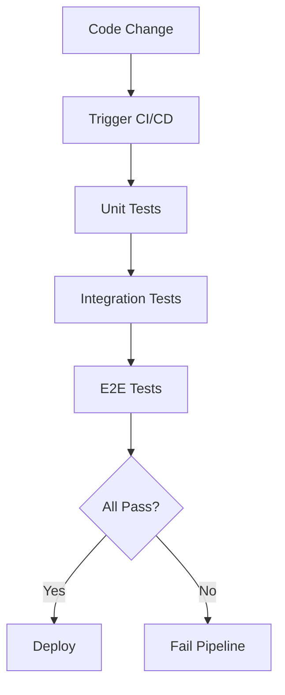
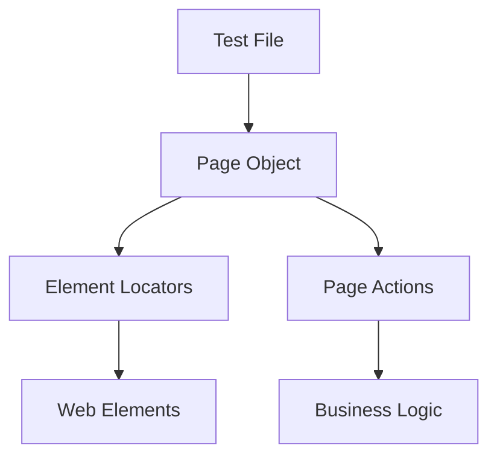

## Table of Contents
- [Introduction](#introduction)
- [Learning Roadmap](#learning-roadmap)
- [Theory Notes](#theory-notes)
- [Key Concepts](#key-concepts)
- [FAQ (35+ Q&A)](#faq-35-qa)
- [Hands-on Practice](#hands-on-practice)
- [FAANG Questions](#faang-questions)
- [Common Mistakes](#common-mistakes)
- [Best Practices](#best-practices)
- [Cheat Sheet](#cheat-sheet)
- [Flash Cards (30)](#flash-cards-30)
- [Mind Map](#mind-map)
- [Mermaid Diagrams](#mermaid-diagrams)
- [Code Examples](#code-examples)
- [Projects](#projects)
- [Resources](#resources)
- [Checklist](#checklist)
- [Revision Plans](#revision-plans)
- [Mock Interviews](#mock-interviews)
- [Difficulty Rating](#difficulty-rating)
- [Summary](#summary)

---

## Introduction

QA Automation involves using tools and frameworks to automate software testing processes. Automated tests execute faster, are more reliable than manual testing for repetitive tasks, and enable continuous integration and delivery. QA Automation Engineers bridge development and quality, ensuring software meets standards through programmatic testing.

Modern QA automation encompasses UI testing, API testing, performance testing, and integration with CI/CD pipelines. Tools like Selenium, Cypress, Playwright, and pytest are industry standards.

QA automation is not just about writing tests; it is about building a quality culture through tooling, frameworks, and processes that enable rapid, confident delivery of software. The best QA automation engineers understand both testing theory and software engineering principles.

---

## Learning Roadmap

### Phase 1: Foundations (Week 1-2)
- Testing fundamentals
- Programming basics (Python/JavaScript)
- Test case design
- Version control (Git)

### Phase 2: UI Automation (Week 3-5)
- Selenium WebDriver
- Cypress or Playwright
- Page Object Model
- Element locators and waits

### Phase 3: API Testing (Week 6-7)
- REST API concepts
- Postman/Newman
- API testing with pytest/requests
- Contract testing

### Phase 4: Framework Development (Week 8-10)
- Test framework architecture
- Data-driven testing
- Parallel execution
- Reporting and screenshots

### Phase 5: CI/CD Integration (Week 11-12)
- Jenkins/GitHub Actions integration
- Test execution in pipelines
- Docker for test environments
- Performance testing basics

---

## Theory Notes

### Test Automation Strategy
Decide what to automate:
- **Automate**: Repetitive tests, regression tests, data-driven tests, cross-browser tests
- **Do not automate**: Exploratory testing, usability testing, one-time tests, constantly changing UI

### Page Object Model (POM)
Design pattern separating page elements from test logic:
- Each page has a class with element locators and actions
- Tests use page objects instead of direct element interaction
- Changes to page structure only require updating page class
- Improves maintainability and readability

### Test Pyramid
- **Unit tests**: Fast, many, test individual functions (70%)
- **Integration tests**: Medium speed, test component interactions (20%)
- **E2E tests**: Slow, few, test complete user flows (10%)

### Locator Strategies
Best to worst reliability:
1. ID (unique, stable)
2. Name attribute
3. CSS selectors (fast, flexible)
4. XPath (powerful but brittle)
5. Link text
6. Class name (often not unique)

### Waits and Synchronization
- **Implicit wait**: Applies to all element lookups
- **Explicit wait**: Wait for specific condition (element visible, clickable)
- **Fluent wait**: Max wait time with polling interval
- Always use explicit waits over implicit waits

### API Testing Concepts
- **REST**: Stateless, uses HTTP methods (GET, POST, PUT, DELETE)
- **Status codes**: 200 OK, 201 Created, 400 Bad Request, 401 Unauthorized, 404 Not Found
- **Authentication**: API keys, OAuth, JWT tokens
- **Assertions**: Status code, response body, headers, response time

### CI/CD Integration
- Run tests on every commit/PR
- Parallel test execution
- Test reporting in PR comments
- Fail pipeline on test failures
- Docker containers for consistent environments

### Test Data Management
- Separate test data from test logic
- Use fixtures, factories, or data providers
- Generate data programmatically
- Clean up after tests
- Use dedicated test environments

---

## Key Concepts

| Concept | Description |
|---------|-------------|
| Page Object Model | Separating page elements from test logic |
| Test Pyramid | Unit > Integration > E2E test distribution |
| Explicit Wait | Waiting for specific condition before proceeding |
| Data-Driven Testing | Running same test with different data sets |
| Smoke Tests | Quick tests verifying basic functionality |
| Regression Tests | Ensuring new changes do not break existing features |
| Test Coverage | Percentage of code covered by tests |
| Parallel Execution | Running tests simultaneously for speed |
| Contract Testing | Verifying API contracts between services |
| Flaky Tests | Tests that pass/fail inconsistently |
| Test Runner | Framework executing tests and reporting results |
| Fixture | Setup/teardown state for test execution |

---

## FAQ (35+ Q&A)

### Q1: What is the Page Object Model?
**A:** Design pattern where each web page is represented as a class. Class contains element locators and actions. Tests interact with page objects, not elements directly. Improves maintainability when UI changes.

### Q2: What is the test pyramid?
**A:** Strategy recommending many unit tests (fast, cheap), fewer integration tests, and minimal E2E tests (slow, expensive). Ensures fast feedback and comprehensive coverage.

### Q3: What is the difference between Selenium, Cypress, and Playwright?
**A:** Selenium: cross-browser, supports multiple languages, older. Cypress: JavaScript-only, modern, easier setup, great debugging. Playwright: Microsoft, cross-browser, supports multiple languages, auto-wait.

### Q4: When should you not automate tests?
**A:** Exploratory testing, usability testing, tests that change frequently, one-time tests, complex business logic requiring human judgment, and very simple tests where manual is faster.

### Q5: What is a flaky test?
**A:** A test that sometimes passes and sometimes fails without code changes. Caused by timing issues, external dependencies, or non-deterministic behavior. Flaky tests reduce trust in automation.

### Q6: What is data-driven testing?
**A:** Running the same test with different input data from external sources (CSV, Excel, database). One test script, multiple data sets. Reduces code duplication and increases coverage.

### Q7: What is API testing?
**A:** Testing backend APIs directly without UI. Validates status codes, response bodies, headers, and performance. Faster and more stable than UI testing. Tools: Postman, pytest, REST Assured.

### Q8: What is contract testing?
**A:** Verifying that API provider and consumer agree on the interface (endpoints, request/response format). Ensures services can communicate without full integration testing.

### Q9: What are the advantages of test automation?
**A:** Faster execution, repeatability, reliability, parallel execution, early bug detection, CI/CD integration, and reduced manual effort for regression testing.

### Q10: What is a smoke test?
**A:** Quick test suite verifying basic critical functionality. Run after deployment to ensure system is working. If smoke tests fail, no further testing needed. Example: login, key pages load.

### Q11: What is cross-browser testing?
**A:** Testing application across different browsers (Chrome, Firefox, Safari, Edge) to ensure consistent behavior. Selenium supports this natively. Cloud services: BrowserStack, Sauce Labs.

### Q12: What is parallel test execution?
**A:** Running multiple tests simultaneously to reduce total execution time. Requires tests to be independent and not share state. Tools: pytest-xdist, Selenium Grid, Cypress parallel mode.

### Q13: How do you handle dynamic elements?
**A:** Use dynamic locators (partial match, regex), explicit waits for element state, CSS selectors with attributes, or XPath with contains(). Avoid brittle absolute XPaths.

### Q14: What is a test framework?
**A:** Structured set of guidelines, concepts, and tools for writing and executing tests. Includes test organization, assertions, reporting, and execution management. Examples: pytest, JUnit, TestNG.

### Q15: What is headless testing?
**A:** Running browser tests without GUI. Faster execution, suitable for CI/CD pipelines. Selenium and Playwright support headless mode. Cypress runs headless by default in CI.

### Q16: What is visual regression testing?
**A:** Comparing screenshots of UI before and after changes to detect visual differences. Tools: Percy, Applitools, BackstopJS. Catches CSS and layout issues that functional tests miss.

### Q17: How do you handle test data?
**A:** Separate test data from test logic. Use fixtures, factories, or data providers. Generate data programmatically. Clean up after tests. Use dedicated test environments.

### Q18: What is test coverage?
**A:** Percentage of code exercised by tests. Measured by line coverage, branch coverage, or function coverage. High coverage does not guarantee quality but low coverage indicates risk.

### Q19: What is the difference between mock, stub, and fake?
**A:** Mock: verifies interactions. Stub: returns predefined data. Fake: simplified working implementation. All isolate tests from external dependencies.

### Q20: What is BDD in test automation?
**A:** Behavior-Driven Development writing tests in natural language (Given/When/Then). Bridges business and technical teams. Tools: Cucumber, SpecFlow. Tests serve as living documentation.

### Q21: What is test isolation?
**A:** Each test runs independently without depending on other tests or shared state. Enables parallel execution and reliable results. Tests should set up their own data and clean up after.

### Q22: What is the difference between assertion libraries and test runners?
**A:** Test runners execute tests and manage lifecycle (pytest, Jest). Assertion libraries verify conditions (chai, assert). Test runners often include assertion libraries.

### Q23: What is parameterized testing?
**A:** Running the same test with different input values. Reduces code duplication. Example: pytest.mark.parametrize, JUnit @ParameterizedTest. Essential for data-driven testing.

### Q24: What is test tagging or labeling?
**A:** Categorizing tests for selective execution. Example: run only smoke tests, or only API tests. Enables running subsets of test suite. Supported by pytest, JUnit, Playwright.

### Q25: What is an end-to-end test?
**A:** Tests that validate the entire application flow from user perspective. Simulates real user scenarios. Slow and brittle but catch integration issues. Should be minimal per test pyramid.

### Q26: What is API mocking?
**A:** Simulating API responses for testing. Enables testing without real backend. Tools: WireMock, MockServer, MSW. Useful for frontend testing and isolated API testing.

### Q27: What is the difference between functional and non-functional testing?
**A:** Functional: does the software do what it should? (correctness). Non-functional: how well does it perform? (performance, security, usability). Both are needed for quality software.

### Q28: What is testability?
**A:** How easily software can be tested. Good testability means: clear interfaces, dependency injection, logging, configurable environments. Design for testability from the start.

### Q29: What is mutation testing?
**A:** Introducing small code changes (mutants) and checking if tests detect them. Measures test quality, not just coverage. High mutation score means tests effectively detect changes.

### Q30: What is the testing diamond?
**A:** Alternative to test pyramid emphasizing more integration tests and fewer unit tests. Suitable for microservices where integration testing provides more value than isolated unit tests.

### Q31: What is golden path testing?
**A:** Testing the most common successful user flow. Ensures core functionality works. Quick way to verify basic system health. Often implemented as smoke tests.

### Q32: What is negative testing?
**A:** Testing how system handles invalid inputs, error conditions, and edge cases. Ensures proper error messages, graceful degradation, and security. Complements positive testing.

### Q33: What is test environment management?
**A:** Managing environments (dev, staging, production) for testing. Includes data setup, configuration management, and environment isolation. Docker and Kubernetes help with environment consistency.

### Q34: What is accessibility testing?
**A:** Testing that software is usable by people with disabilities. Checks WCAG compliance, screen reader compatibility, keyboard navigation. Tools: axe, Lighthouse, NVDA.

### Q35: What is the role of QA in agile?
**A:** QA shifts left, participating from requirements through deployment. Focuses on preventing defects, not just finding them. Collaborates with developers, uses automation, and advocates for quality throughout the team.

---

## FAANG Questions

1. **Google**: Design a test automation framework for a web application with 500 pages.
2. **Microsoft**: How would you implement cross-browser testing at scale?
3. **Amazon**: Build an API testing strategy for a microservices architecture.
4. **Meta**: Design a test automation strategy for continuous deployment.
5. **Google**: How would you handle test data management across environments?
6. **Microsoft**: Design a visual regression testing system.
7. **Amazon**: How would you reduce test execution time from 2 hours to 15 minutes?
8. **Meta**: Build a flaky test detection and quarantine system.
9. **Google**: Design a testing strategy for a real-time collaborative application.
10. **Amazon**: How would you implement contract testing for microservices?

---

## Common Mistakes

1. Automating everything (including exploratory tests)
2. Not maintaining test code
3. Brittle element locators
4. Not using explicit waits
5. Tests depending on execution order
6. Ignoring test data management
7. Not integrating with CI/CD
8. Skipping test maintenance
9. Over-reliance on UI testing
10. Not handling test environment setup/teardown
11. Using absolute XPaths that break easily
12. Not handling async operations properly
13. Ignoring test parallelization opportunities
14. Not implementing proper reporting
15. Writing tests without meaningful assertions

---

## Best Practices

1. Follow test pyramid (many unit, fewer E2E)
2. Use Page Object Model for UI tests
3. Always use explicit waits
4. Keep tests independent and idempotent
5. Integrate with CI/CD pipeline
6. Use meaningful test names
7. Maintain test code like production code
8. Implement proper reporting
9. Regularly review and update tests
10. Use test data management strategies
11. Implement proper cleanup/teardown
12. Monitor and fix flaky tests
13. Use tag-based test selection
14. Implement screenshot/video on failure
15. Practice test-first development

---

## Cheat Sheet

### Locator Priority
| Priority | Locator | Example |
|----------|---------|---------|
| 1 | ID | driver.find_element(By.ID, "submit") |
| 2 | Name | driver.find_element(By.NAME, "email") |
| 3 | CSS | driver.find_element(By.CSS_SELECTOR, ".btn") |
| 4 | XPath | driver.find_element(By.XPATH, "//button") |
| 5 | Link | driver.find_element(By.LINK_TEXT, "Login") |

### Common HTTP Status Codes
| Code | Meaning |
|------|---------|
| 200 | OK |
| 201 | Created |
| 204 | No Content |
| 400 | Bad Request |
| 401 | Unauthorized |
| 403 | Forbidden |
| 404 | Not Found |
| 500 | Server Error |
| 502 | Bad Gateway |
| 503 | Service Unavailable |

### pytest Fixtures Reference
```python
@pytest.fixture
def setup():
    # Setup code
    yield
    # Teardown code

@pytest.fixture(params=[1, 2, 3])
def parametrized(request):
    return request.param

@pytest.mark.smoke
def test_example(setup):
    assert True
```

---

## Flash Cards (30)

**Card 1:** Q: Page Object Model? A: Separating page elements from test logic into reusable classes.

**Card 2:** Q: Test pyramid? A: Many unit tests, fewer integration, minimal E2E tests.

**Card 3:** Q: Explicit vs implicit wait? A: Explicit waits for specific condition; implicit waits for element lookup.

**Card 4:** Q: Flaky test? A: Test passing/failing inconsistently without code changes.

**Card 5:** Q: Selenium vs Cypress vs Playwright? A: Selenium=cross-browser; Cypress=JS modern; Playwright=Microsoft, auto-wait.

**Card 6:** Q: What is smoke testing? A: Quick tests verifying basic critical functionality.

**Card 7:** Q: Data-driven testing? A: Running same test with different data sets from external sources.

**Card 8:** Q: Contract testing? A: Verifying API contracts between provider and consumer.

**Card 9:** Q: Headless testing? A: Running browser tests without GUI for faster CI/CD execution.

**Card 10:** Q: Visual regression? A: Comparing screenshots to detect UI visual differences.

**Card 11:** Q: BDD? A: Writing tests in Given/When/Then natural language format.

**Card 12:** Q: Mock vs stub? A: Mock verifies interactions; stub returns predefined data.

**Card 13:** Q: Test coverage? A: Percentage of code exercised by tests.

**Card 14:** Q: Parallel execution? A: Running multiple tests simultaneously to reduce time.

**Card 15:** Q: What is CI/CD testing? A: Running tests automatically on every commit/deployment.

**Card 16:** Q: Locator reliability order? A: ID > Name > CSS > XPath > Link Text.

**Card 17:** Q: Test independence? A: Tests should not depend on execution order or shared state.

**Card 18:** Q: What is test fixture? A: Fixed state/data used as baseline for tests.

**Card 19:** Q: What is teardown? A: Cleanup operations after test execution.

**Card 20:** Q: Regression testing? A: Ensuring new changes do not break existing functionality.

**Card 21:** Q: What is parameterized testing? A: Running same test with different input values.

**Card 22:** Q: Test isolation? A: Each test runs independently without shared state.

**Card 23:** Q: What is golden path testing? A: Testing the most common successful user flow.

**Card 24:** Q: What is negative testing? A: Testing invalid inputs and error conditions.

**Card 25:** Q: What is API mocking? A: Simulating API responses for isolated testing.

**Card 26:** Q: What is mutation testing? A: Introducing code changes to test if tests detect them.

**Card 27:** Q: What is testability? A: How easily software can be tested (design for it).

**Card 28:** Q: What is accessibility testing? A: Testing software is usable by people with disabilities.

**Card 29:** Q: Test runner vs assertion library? A: Runner executes tests; assertion verifies conditions.

**Card 30:** Q: Testing diamond? A: Alternative to pyramid emphasizing more integration tests.

---

## Mind Map

```
QA Automation
├── Frameworks
│   ├── Selenium
│   ├── Cypress
│   ├── Playwright
│   └── pytest
├── Patterns
│   ├── Page Object Model
│   ├── Data-Driven
│   └── BDD
├── Testing Types
│   ├── UI / E2E
│   ├── API
│   ├── Visual Regression
│   └── Performance
├── CI/CD
│   ├── Jenkins
│   ├── GitHub Actions
│   └── Docker
└── Best Practices
    ├── Test Pyramid
    ├── Explicit Waits
    └── Flaky Test Management
```

---

## Mermaid Diagrams

### Test Execution Flow


### Page Object Model Structure


---

## Code Examples

### Page Object Model (Python/Selenium)
```python
from selenium.webdriver.common.by import By
from selenium.webdriver.support.ui import WebDriverWait
from selenium.webdriver.support import expected_conditions as EC

class LoginPage:
    def __init__(self, driver):
        self.driver = driver
        self.username_field = (By.ID, "username")
        self.password_field = (By.ID, "password")
        self.login_button = (By.ID, "login-btn")

    def login(self, username, password):
        WebDriverWait(self.driver, 10).until(
            EC.presence_of_element_located(self.username_field)
        ).send_keys(username)
        self.driver.find_element(*self.password_field).send_keys(password)
        self.driver.find_element(*self.login_button).click()

    def get_error_message(self):
        return self.driver.find_element(By.CLASS_NAME, "error").text
```

### API Testing (pytest)
```python
import requests

BASE_URL = "https://api.example.com"

def test_get_users():
    response = requests.get(f"{BASE_URL}/users")
    assert response.status_code == 200
    assert len(response.json()) > 0

def test_create_user():
    payload = {"name": "John", "email": "john@test.com"}
    response = requests.post(f"{BASE_URL}/users", json=payload)
    assert response.status_code == 201
    assert response.json()["name"] == "John"

def test_user_not_found():
    response = requests.get(f"{BASE_URL}/users/99999")
    assert response.status_code == 404
```

### Playwright Test
```python
from playwright.sync_api import test, expect

def test_login():
    page = browser.new_page()
    page.goto("https://example.com/login")
    page.fill("#username", "admin")
    page.fill("#password", "password123")
    page.click("#login-btn")
    expect(page).to_have_url("/dashboard")

def test_api_intercept():
    page = browser.new_page()
    page.route("**/api/users", lambda route: route.fulfill(
        status=200, body='[{"name": "John"}]'
    ))
    page.goto("https://example.com/users")
    expect(page.locator(".user-name")).to_have_text("John")
```

---

## Projects

1. **Test Framework**: Build complete Page Object Model framework
2. **API Test Suite**: Comprehensive REST API test coverage
3. **Visual Regression**: Implement screenshot comparison testing
4. **CI/CD Pipeline**: Integrate tests with GitHub Actions
5. **Flaky Test Detector**: Build system to identify and quarantine flaky tests
6. **Cross-Browser Testing**: Multi-browser test execution setup
7. **Performance Testing**: Load testing with Locust or k6
8. **Accessibility Testing**: WCAG compliance test suite

---

## Resources

- **Tools**: Selenium, Cypress, Playwright, pytest, Postman, REST Assured, JMeter
- **Courses**: Test Automation University, Udemy Selenium, Coursera Software Testing
- **Books**: "Clean Code" (Robert Martin), "The Art of Software Testing", "Lessons Learned in Software Testing", "Growing Object-Oriented Software, Guided by Tests"
- **Practice**: Practice sites (the-internet.herokuapp.com, automationpratice.com, saucedemo.com, practicesoftwaretesting.com, demo.playwright.dev)
- **YouTube**: TechWorld with Nana, Test Automation University, TestGuild with Joe Colantonio
- **Community**: r/QualityAssurance, Ministry of Testing, Software Testing Help
- **Certifications**: ISTQB Certified Tester, AWS Certified Developer (for CI/CD)
- **Frameworks**: Selenium Grid, Docker Selenium, Allure Reports, Extent Reports
- **API Tools**: Postman, Insomnia, Swagger, Newman (CLI runner for Postman)

---

## Testing Anti-Patterns to Avoid

### Common Anti-Patterns
- **Test roulette**: Flaky tests that pass/fail randomly
- **Snowflake tests**: Tests that depend on specific environment state
- **Chain tests**: Tests that must run in specific order
- **God test**: Single test doing too many things
- **Assertion-less tests**: Tests without meaningful assertions
- **Over-mocking**: Mocking everything instead of testing real behavior
- **Manual test data**: Hardcoded test data in test scripts
- **Copy-paste tests**: Duplicated test logic across files
- **Ignoring failures**: Skipping or suppressing test failures
- **Testing implementation details**: Testing internal code instead of behavior

### How to Avoid Them
- Write isolated, independent tests
- Use meaningful test names that describe behavior
- Implement proper setup and teardown
- Use data-driven approaches for variations
- Regularly review and refactor test code
- Monitor and fix flaky tests immediately
- Maintain test code with same standards as production code

---

## Checklist

- [ ] Test automation strategy
- [ ] Page Object Model
- [ ] Selenium/Cypress/Playwright proficiency
- [ ] Explicit waits and synchronization
- [ ] API testing
- [ ] Data-driven testing
- [ ] CI/CD integration
- [ ] Test reporting
- [ ] Flaky test management
- [ ] Framework development
- [ ] Test data management
- [ ] Visual regression testing
- [ ] Accessibility testing basics
- [ ] Performance testing awareness
- [ ] Test tagging and selection

---

## Revision Plans

### Week 1-2: Foundations
- Testing fundamentals
- Python/JavaScript for automation
- Git basics

### Week 3-5: UI Automation
- Selenium/Cypress/Playwright mastery
- Page Object Model
- Waits and synchronization

### Week 6-7: API Testing
- REST concepts
- API testing with pytest/requests
- Contract testing

### Week 8-10: Framework
- Framework architecture
- Data-driven testing
- Reporting and parallel execution

### Final Week: CI/CD
- GitHub Actions integration
- Docker for test environments
- Build portfolio project

---

## Mock Interviews

### Round 1: Testing Concepts
1. Explain the test pyramid and why it matters
2. What is the difference between a mock and a stub?
3. How do you handle flaky tests?

### Round 2: Code Exercise
1. Write a Page Object for a login page
2. Create an API test for a CRUD endpoint
3. Design a test data management strategy

### Round 3: Strategy
1. How would you reduce test execution time from 2 hours to 15 minutes?
2. Design a test automation strategy for a microservices architecture
3. How would you implement visual regression testing?

---

## Difficulty Rating

| Topic | Difficulty | Frequency |
|-------|-----------|-----------|
| Basic Selenium | Medium | Very High |
| Page Object Model | Medium | Very High |
| Explicit Waits | Medium | High |
| API Testing | Medium | High |
| Cypress/Playwright | Medium | Growing |
| CI/CD Integration | Medium | High |
| Data-Driven Testing | Medium | Medium |
| Visual Regression | Medium-High | Growing |
| Contract Testing | Medium-High | Growing |
| Framework Design | Hard | Medium |

---

## Summary

QA Automation interviews test framework design, tool proficiency, testing strategy, and CI/CD integration. Master Page Object Model, understand the test pyramid, be proficient with at least one automation framework, and know API testing. The ability to design maintainable, reliable test suites that integrate with CI/CD pipelines is what distinguishes strong QA Automation Engineers. Understanding both the technical and strategic aspects of testing demonstrates comprehensive expertise.

---

## Key Takeaways

1. Page Object Model is the standard for maintainable UI tests
2. Follow the test pyramid: many unit, fewer integration, minimal E2E
3. Always use explicit waits over implicit waits
4. API testing is faster and more stable than UI testing
5. Flaky tests erode trust and must be addressed immediately
6. Test data management is critical for reliable test execution
7. CI/CD integration enables continuous quality feedback
8. Parallel execution significantly reduces test suite runtime
9. Contract testing prevents integration issues in microservices
10. Test code deserves the same quality standards as production code
