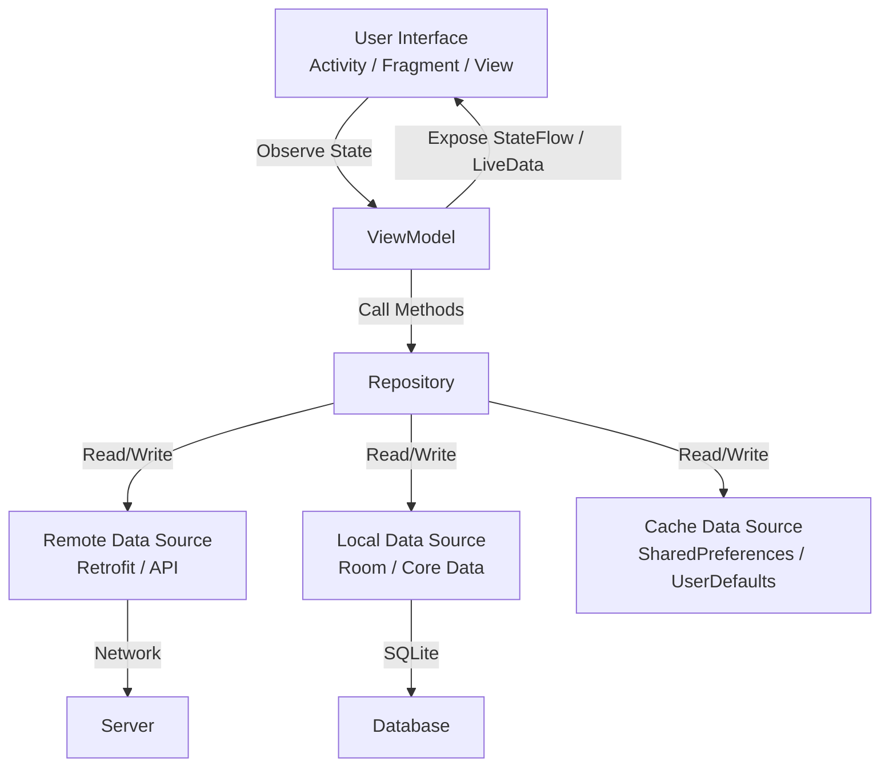
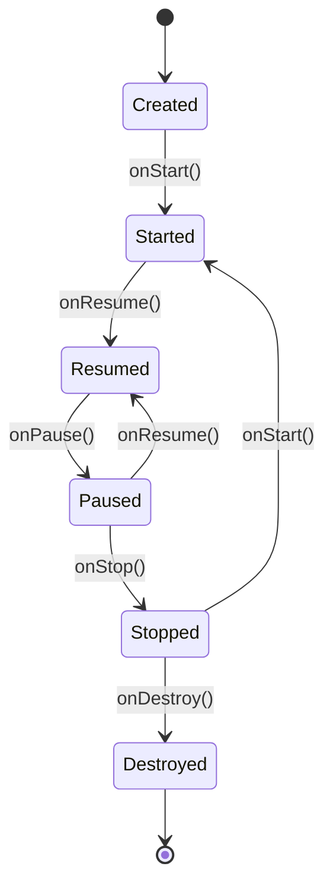
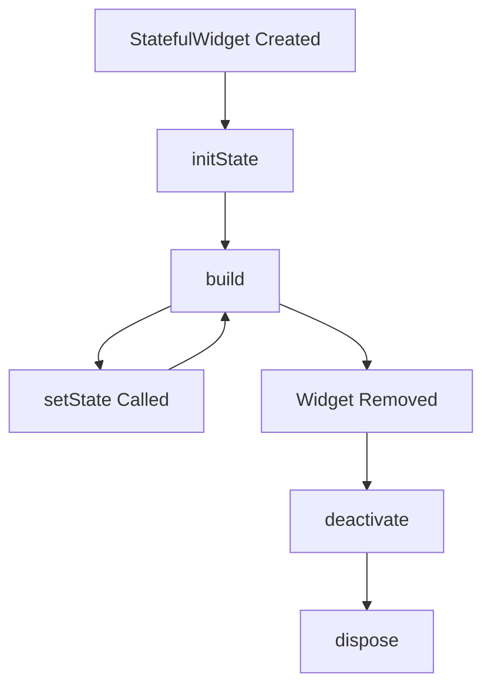
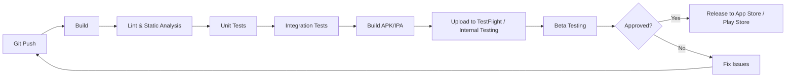
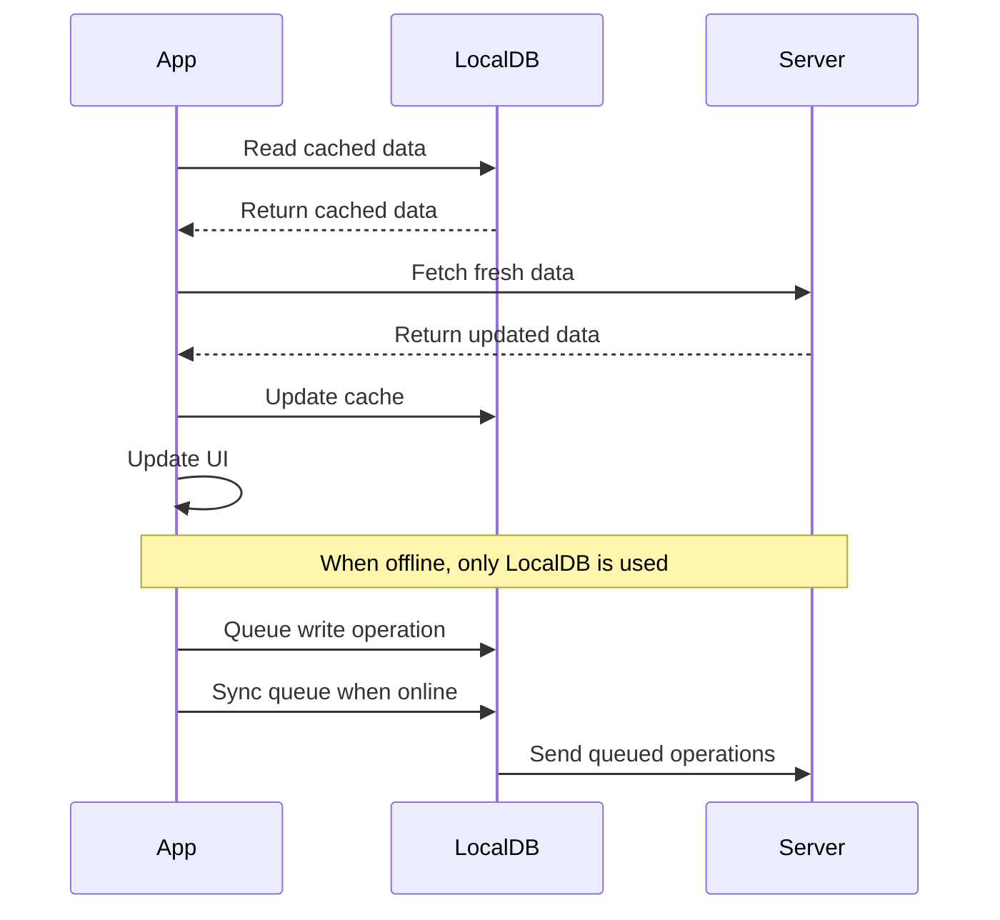

## Introduction

Mobile development is the process of creating software applications that run on mobile devices such as smartphones and tablets. With over 6.8 billion smartphone users worldwide, mobile development is one of the most in-demand skills in the tech industry. This guide covers Android development (Kotlin/Java), iOS development (Swift), and cross-platform frameworks (Flutter, React Native), along with mobile architecture patterns, networking, and storage.

Mobile engineers must understand platform-specific APIs, UI/UX conventions, performance constraints (battery, memory, network), and the unique challenges of developing for devices with varying screen sizes, hardware capabilities, and operating system versions. Whether you are preparing for a role at a startup building an MVP or at a FAANG company scaling to millions of users, this guide equips you with the knowledge you need.

---

## Learning Roadmap

### Phase 1: Foundations (Weeks 1-4)
- Choose a platform (Android, iOS, or Cross-Platform)
- Learn the programming language (Kotlin, Swift, or Dart)
- Understand basic UI components and layouts
- Build simple "Hello World" apps
- Learn about development environments (Android Studio, Xcode, VS Code)

### Phase 2: Core Concepts (Weeks 5-8)
- Activity/Fragment lifecycle (Android) / ViewController lifecycle (iOS)
- Navigation patterns and deep linking
- Data persistence (SharedPreferences, Core Data, SQLite)
- Networking with REST APIs
- JSON parsing and serialization
- Basic error handling and debugging

### Phase 3: Architecture & Patterns (Weeks 9-12)
- MVVM / MVI architecture patterns
- Dependency injection
- Reactive programming (Kotlin Coroutines + Flow / Combine / Streams)
- Unit testing and integration testing
- CI/CD for mobile apps

### Phase 4: Advanced Topics (Weeks 13-16)
- Push notifications (FCM / APNs)
- Background processing and work scheduling
- Offline-first architecture and sync strategies
- Performance profiling and optimization
- App security (encryption, certificate pinning, biometrics)

### Phase 5: Cross-Platform & Professional (Weeks 17-20)
- Flutter or React Native deep dive
- Platform channels and native modules
- App store optimization (ASO)
- Analytics and crash reporting
- Accessibility and internationalization

---

## Theory Notes

### Android Development

#### Kotlin vs Java for Android
Kotlin is Google's preferred language for Android development since 2019. Kotlin offers null safety, extension functions, coroutines for async programming, data classes, sealed classes, and concise syntax. Java is still supported but new projects should use Kotlin.

#### Activity Lifecycle
```
onCreate() -> onStart() -> onResume() -> [Running] -> onPause() -> onStop() -> onDestroy()
```
- `onCreate()`: Initialize UI, bind data, set up observers
- `onStart()`: Activity becomes visible
- `onResume()`: Activity is in the foreground, interactive
- `onPause()`: Activity partially obscured or losing focus
- `onStop()`: Activity no longer visible
- `onDestroy()`: Activity is being destroyed

#### Fragment Lifecycle
Fragments have a superset of the Activity lifecycle with additional callbacks:
- `onAttach()`: Fragment attached to activity
- `onCreateView()`: Create the fragment's view hierarchy
- `onViewCreated()`: View created, safe to interact with views
- `onDestroyView()`: View hierarchy is being removed
- `onDetach()`: Fragment is detached from activity

#### Jetpack Compose
Jetpack Compose is Android's modern declarative UI toolkit. Instead of XML layouts, you write composable functions annotated with `@Composable`. Key concepts:
- **Recomposition**: When state changes, only affected composables recompose
- **State hoisting**: Move state up to make composables stateless and reusable
- **Material Design 3**: Built-in theming and component library
- **Side effects**: `LaunchedEffect`, `rememberCoroutineScope`, `DisposableEffect`

```kotlin
@Composable
fun Greeting(name: String) {
    var expanded by remember { mutableStateOf(false) }
    Column(modifier = Modifier.padding(16.dp)) {
        Text(text = "Hello $name!", style = MaterialTheme.typography.headlineMedium)
        Button(onClick = { expanded = !expanded }) {
            Text(if (expanded) "Show Less" else "Show More")
        }
        if (expanded) {
            Text("This is expanded content with more details about $name.")
        }
    }
}
```

### iOS Development

#### Swift Basics
Swift is a modern, type-safe language with features like optionals, protocols, extensions, generics, and value types. Key differences from Objective-C:
- **Optionals** handle nil values safely (`var name: String?`)
- **Protocols** provide interfaces with default implementations
- **Structs** are value types (vs classes which are reference types)
- **Pattern matching** with switch statements

#### UIKit vs SwiftUI
- **UIKit**: Mature, imperative, storyboards or programmatic, wide API access
- **SwiftUI**: Declarative, less code, real-time preview, requires iOS 13+
- Most production apps use a mix of both during migration

#### View Lifecycle (UIViewController)
```
loadView() -> viewDidLoad() -> viewWillAppear() -> viewDidAppear() -> viewWillDisappear() -> viewDidDisappear() -> deinit
```

### Cross-Platform Development

#### Flutter
Flutter uses Dart language and its own rendering engine (Skia). Key advantages:
- Single codebase for iOS, Android, Web, Desktop
- Hot reload for rapid development
- Rich widget library with Material and Cupertino themes
- Platform channels for native code access

#### React Native
React Native uses JavaScript/TypeScript with React paradigm. Key features:
- JavaScript ecosystem and libraries
- Bridge architecture (new architecture uses Fabric/TurboModules)
- Large community and third-party packages
- Code sharing with React web apps

---

## Key Concepts

### Mobile Architecture Patterns

#### MVVM (Model-View-ViewModel)
```
View (Activity/Fragment) <--> ViewModel <--> Repository <--> Data Sources
```
- **View**: Observes ViewModel, renders UI
- **ViewModel**: Holds UI state, handles user actions, survives configuration changes
- **Repository**: Single source of truth, coordinates data from multiple sources

#### MVI (Model-View-Intent)
```
User Intent --> Reducer --> State --> View --> User Intent
```
- Unidirectional data flow
- Single source of truth for UI state
- Predictable state transitions
- Easier to test and debug

#### Clean Architecture
```
Presentation Layer --> Domain Layer --> Data Layer
     (UI)           (Use Cases)      (Repositories, APIs, DB)
```

### Mobile Networking
- **REST APIs** with Retrofit (Android) or URLSession (iOS)
- **GraphQL** with Apollo Client
- **WebSocket** for real-time data
- **HTTP/2** multiplexing for performance
- **Certificate pinning** for security
- **Retry logic** with exponential backoff
- **Request/response caching** with OkHttp/URLSession

### Offline Storage
- **Key-Value**: SharedPreferences (Android) / UserDefaults (iOS)
- **SQLite**: Direct database access
- **Room**: Android's abstraction over SQLite with compile-time verification
- **Core Data**: iOS's object graph and persistence framework
- **Realm**: Cross-platform mobile database
- **DataStore**: Modern replacement for SharedPreferences with async API

### Push Notifications
- **FCM (Firebase Cloud Messaging)** for Android
- **APNs (Apple Push Notification service)** for iOS
- **Notification channels** (Android) for user control
- **Rich notifications** with images and actions
- **Background data sync** triggered by notifications

### Performance Considerations
- **App size**: Minimize APK/IPA size (ProGuard, R8, app thinning)
- **Startup time**: Lazy loading, deferred initialization
- **Memory**: Avoid leaks, use profiling tools (LeakCanary, Instruments)
- **Battery**: Minimize background work, use WorkManager/BackgroundTasks
- **Network**: Compress payloads, cache responses, batch requests
- **Rendering**: 60fps target, avoid overdraw, use hardware layers

---

## FAQ (20+ Q&A)

### Q1: What is the difference between a ViewGroup and a View in Android?
**A:** A `View` is a basic UI element (button, text field, image). A `ViewGroup` is a special View that can contain other Views and ViewGroups (LinearLayout, RelativeLayout, FrameLayout). ViewGroups define the layout structure and positioning of child views.

### Q2: What is the difference between `launchMode` singleTop and singleTask?
**A:** `singleTop` reuses an existing instance if it is already at the top of the back stack (onNewIntent is called). `singleTask` creates a new task or reuses an existing task, and clears all activities above the reused instance. `singleTop` is for activities like search; `singleTask` is for app entry points.

### Q3: What is State Hoisting in Jetpack Compose?
**A:** State hoisting is the pattern of moving state from a composable to its caller. A composable receives state as a parameter and emits events upward. This makes composables stateless, reusable, and easier to test. The pattern is: state goes down, events go up.

### Q4: What is the difference between `viewModelScope` and `lifecycleScope` in Android?
**A:** `viewModelScope` is tied to the ViewModel's lifecycle and is cancelled when the ViewModel is cleared. `lifecycleScope` is tied to the Activity/Fragment lifecycle. Use `viewModelScope` for data fetching and business logic; use `lifecycleScope` for UI-specific coroutines.

### Q5: How does React Native's bridge architecture work?
**A:** The bridge is an asynchronous message queue that communicates between JavaScript and native code. JS runs on a background thread, native UI runs on the main thread. Messages are serialized as JSON. The new architecture (Fabric) uses JSI for synchronous communication, eliminating the serialization overhead.

### Q6: What is the difference between Flutter's hot reload and hot restart?
**A:** Hot reload injects updated source code into the running Dart VM without losing state. It preserves app state and updates the UI in under a second. Hot restart destroys the app state and re-runs `main()`. Hot reload is for UI changes; hot restart is for logic changes.

### Q7: What is certificate pinning and why is it important?
**A:** Certificate pinning is the practice of associating a host with its expected certificate or public key. It prevents man-in-the-middle attacks even if a certificate authority is compromised. Implement it using Network Security Config (Android) or URLSession delegate (iOS).

### Q8: What is WorkManager in Android?
**A:** WorkManager is a Jetpack library for deferrable, guaranteed background work. It handles backward compatibility, battery optimization, and constraints (network availability, charging state). It uses JobScheduler on API 23+ and AlarmManager + BroadcastReceiver on older versions.

### Q9: What are SwiftUI property wrappers?
**A:** Property wrappers in SwiftUI manage state and data flow: `@State` (local mutable state), `@Binding` (two-way reference to parent state), `@ObservedObject` (ObservableObject observation), `@StateObject` (owned ObservableObject), `@EnvironmentObject` (injected ObservableObject), `@Environment` (system/environment values).

### Q10: What is the difference between `remember` and `rememberSaveable` in Compose?
**A:** `remember` stores state across recompositions but not across configuration changes or process death. `rememberSaveable` persists state through configuration changes by saving to a Bundle. Use `rememberSaveable` for user input that should survive rotation.

### Q11: How do you handle deep linking in Flutter?
**A:** Use the `go_router` package or `uni_links` package. Define route patterns in your router. On Android, configure intent filters in AndroidManifest.xml. On iOS, configure Associated Domains in entitlements. Handle incoming links in your app's initialization code and navigate accordingly.

### Q12: What is the observer pattern in mobile development?
**A:** The observer pattern defines a one-to-many dependency where when one object (subject) changes state, all dependents (observers) are notified. In Android, this is implemented with LiveData, Flow, or RxJava. In iOS, with Combine, NotificationCenter, or KVO. It enables reactive UI updates.

### Q13: What is ProGuard/R8 in Android?
**A:** ProGuard (now replaced by R8) is a code shrinker, optimizer, and obfuscator for Android. It removes unused code, renames classes/methods to shorten names (obfuscation), and optimizes bytecode. This reduces APK size and makes reverse engineering harder.

### Q14: What is the difference between async/await and callbacks in Swift?
**A:** Async/await (Swift 5.5+) provides a more readable way to write asynchronous code. Instead of nested callbacks (callback hell), you write sequential-looking code. Functions are marked `async` and called with `await`. Error handling uses try/catch instead of completion handler error parameters.

### Q15: What are platform channels in Flutter?
**A:** Platform channels allow Flutter (Dart) code to communicate with native platform code (Kotlin/Java for Android, Swift/ObjC for iOS). They use asynchronous message passing. Use cases include accessing platform-specific APIs, native UI components, and device features not available through Flutter plugins.

### Q16: What is the difference between `dispatch` and `async` in iOS?
**A:** `DispatchQueue.main.async` executes code on the main thread asynchronously. `DispatchQueue.global().async` executes on a background thread. Always use main thread for UI updates. Use background threads for heavy computation, network calls, and file I/O.

### Q17: How does garbage collection work in Android's ART runtime?
**A:** ART uses a concurrent, generational garbage collector. It has a young generation (short-lived objects) and old generation (long-lived objects). Most collections happen in the young generation and are very fast. The collector runs concurrently with app execution, minimizing pause times.

### Q18: What is the difference between `StateFlow` and `SharedFlow` in Kotlin?
**A:** `StateFlow` always has a value (like LiveData), emits only when value changes, and is conflation-based. `SharedFlow` can have no subscribers, supports replay and buffer, and emits every emission. Use `StateFlow` for UI state; use `SharedFlow` for one-time events.

### Q19: What is app thinning in iOS?
**A:** App thinning is Apple's process of optimizing app downloads. It includes Slicing (downloading only needed device resources like images for specific screen density), Bitcode (optimizing binary for specific device architecture), and On-Demand Resources (downloading content only when needed).

### Q20: What is the difference between a foreground service and a background service in Android?
**A:** A foreground service shows a persistent notification and is given higher priority by the OS (less likely to be killed). It can run for extended periods. Background services run without user awareness but are heavily restricted in Android 8.0+ (can be killed after minutes). Use WorkManager for most background tasks.

### Q21: What are trailing closures in Swift?
**A:** Trailing closure syntax allows you to pass a closure as the last argument of a function by placing it after the parentheses. If the closure is the only argument, you can omit the parentheses entirely. This makes code more readable, especially with completion handlers.

### Q22: How does offline-first architecture work in mobile apps?
**A:** Offline-first apps store data locally and sync with the server when connectivity is available. Patterns include: cache-then-network (show cached data immediately, update when fresh data arrives), write-behind (write to local DB first, sync to server asynchronously), and conflict resolution (last-write-wins, operational transforms).

---

## Hands-on Practice

### Practice Projects (Difficulty: Easy → Hard)

#### 1. Todo App (Easy)
- CRUD operations for tasks
- Local storage with Room/Core Data
- Basic UI with list and detail screens
- **Skills**: Basic UI, data persistence, navigation

#### 2. Weather App (Medium)
- REST API integration with weather service
- Current weather and 7-day forecast
- Location-based weather
- Offline caching of last weather data
- **Skills**: Networking, JSON parsing, location services, caching

#### 3. Chat Application (Medium-Hard)
- Real-time messaging with WebSocket/Firebase
- User authentication
- Message history and pagination
- Push notifications for new messages
- **Skills**: Real-time data, authentication, push notifications, infinite scrolling

#### 4. E-Commerce App (Hard)
- Product catalog with search and filters
- Shopping cart with persistent state
- Payment integration (Stripe/PayPal)
- Order tracking and history
- User reviews and ratings
- **Skills**: Complex state management, payment APIs, multi-screen navigation, deep linking

#### 5. Social Media App (Expert)
- User profiles with photo uploads
- Feed with infinite scrolling and pagination
- Image/video processing and compression
- Real-time notifications
- Content moderation
- **Skills**: Media handling, performance optimization, real-time systems, scalability

### Code Snippets

#### Retrofit Setup (Android/Kotlin)
```kotlin
// API Service Interface
interface ApiService {
    @GET("users/{id}")
    suspend fun getUser(@Path("id") userId: String): Response<User>

    @POST("users")
    suspend fun createUser(@Body user: CreateUserRequest): Response<User>

    @GET("posts")
    suspend fun getPosts(
        @Query("page") page: Int,
        @Query("limit") limit: Int
    ): Response<List<Post>>
}

// Retrofit Instance
object RetrofitClient {
    private const val BASE_URL = "https://api.example.com/"

    val instance: ApiService by lazy {
        val loggingInterceptor = HttpLoggingInterceptor().apply {
            level = HttpLoggingInterceptor.Level.BODY
        }

        val client = OkHttpClient.Builder()
            .addInterceptor(loggingInterceptor)
            .addInterceptor(AuthInterceptor())
            .connectTimeout(30, TimeUnit.SECONDS)
            .readTimeout(30, TimeUnit.SECONDS)
            .build()

        Retrofit.Builder()
            .baseUrl(BASE_URL)
            .client(client)
            .addConverterFactory(GsonConverterFactory.create())
            .build()
            .create(ApiService::class.java)
    }
}

// ViewModel
class UserViewModel(private val repository: UserRepository) : ViewModel() {
    private val _userState = MutableStateFlow<UiState<User>>(UiState.Loading)
    val userState: StateFlow<UiState<User>> = _userState.asStateFlow()

    fun loadUser(userId: String) {
        viewModelScope.launch {
            _userState.value = UiState.Loading
            try {
                val user = repository.getUser(userId)
                _userState.value = UiState.Success(user)
            } catch (e: Exception) {
                _userState.value = UiState.Error(e.message ?: "Unknown error")
            }
        }
    }
}
```

#### SwiftUI Network Layer (iOS/Swift)
```swift
// Network Manager
class NetworkManager {
    static let shared = NetworkManager()
    private let session = URLSession.shared

    func fetch<T: Decodable>(endpoint: String) async throws -> T {
        guard let url = URL(string: "https://api.example.com/\(endpoint)") else {
            throw NetworkError.invalidURL
        }

        var request = URLRequest(url: url)
        request.httpMethod = "GET"
        request.setValue("application/json", forHTTPHeaderField: "Content-Type")

        let (data, response) = try await session.data(for: request)

        guard let httpResponse = response as? HTTPURLResponse,
              (200...299).contains(httpResponse.statusCode) else {
            throw NetworkError.serverError
        }

        return try JSONDecoder().decode(T.self, from: data)
    }
}

// ViewModel
@MainActor
class UserViewModel: ObservableObject {
    @Published var user: User?
    @Published var isLoading = false
    @Published var errorMessage: String?

    func loadUser(id: String) async {
        isLoading = true
        errorMessage = nil
        do {
            user = try await NetworkManager.shared.fetch(endpoint: "users/\(id)")
        } catch {
            errorMessage = error.localizedDescription
        }
        isLoading = false
    }
}

// View
struct UserView: View {
    @StateObject private var viewModel = UserViewModel()

    var body: some View {
        Group {
            if viewModel.isLoading {
                ProgressView("Loading...")
            } else if let user = viewModel.user {
                VStack(alignment: .leading) {
                    Text(user.name).font(.title)
                    Text(user.email).font(.subheadline).foregroundColor(.secondary)
                }
            } else if let error = viewModel.errorMessage {
                Text(error).foregroundColor(.red)
            }
        }
        .task { await viewModel.loadUser(id: "123") }
    }
}
```

#### Flutter State Management (Dart)
```dart
// Model
class Todo {
  final String id;
  final String title;
  final bool completed;

  Todo({required this.id, required this.title, this.completed = false});

  factory Todo.fromJson(Map<String, dynamic> json) {
    return Todo(
      id: json['id'],
      title: json['title'],
      completed: json['completed'],
    );
  }
}

// Repository
class TodoRepository {
  final Dio _dio = Dio(BaseOptions(baseUrl: 'https://api.example.com'));

  Future<List<Todo>> getTodos() async {
    final response = await _dio.get('/todos');
    return (response.data as List).map((json) => Todo.fromJson(json)).toList();
  }

  Future<Todo> createTodo(String title) async {
    final response = await _dio.post('/todos', data: {'title': title});
    return Todo.fromJson(response.data);
  }
}

// State Management with Riverpod
final todoRepositoryProvider = Provider<TodoRepository>((ref) {
  return TodoRepository();
});

final todosProvider = StateNotifierProvider<TodosNotifier, AsyncValue<List<Todo>>>((ref) {
  return TodosNotifier(ref.read(todoRepositoryProvider));
});

class TodosNotifier extends StateNotifier<AsyncValue<List<Todo>>> {
  final TodoRepository _repository;

  TodosNotifier(this._repository) : super(const AsyncValue.loading()) {
    loadTodos();
  }

  Future<void> loadTodos() async {
    state = const AsyncValue.loading();
    try {
      final todos = await _repository.getTodos();
      state = AsyncValue.data(todos);
    } catch (e, st) {
      state = AsyncValue.error(e, st);
    }
  }

  Future<void> addTodo(String title) async {
    try {
      final todo = await _repository.createTodo(title);
      state = AsyncValue.data([...state.value ?? [], todo]);
    } catch (e, st) {
      state = AsyncValue.error(e, st);
    }
  }
}

// UI
class TodoListScreen extends ConsumerWidget {
  @override
  Widget build(BuildContext context, WidgetRef ref) {
    final todos = ref.watch(todosProvider);
    return Scaffold(
      appBar: AppBar(title: const Text('Todos')),
      body: todos.when(
        loading: () => const CircularProgressIndicator(),
        error: (e, _) => Text('Error: $e'),
        data: (todos) => ListView.builder(
          itemCount: todos.length,
          itemBuilder: (_, i) => ListTile(
            title: Text(todos[i].title),
            trailing: Icon(todos[i].completed ? Icons.check : Icons.circle_outline),
          ),
        ),
      ),
      floatingActionButton: FloatingActionButton(
        onPressed: () => _showAddDialog(context, ref),
        child: const Icon(Icons.add),
      ),
    );
  }
}
```

---

## FAANG Questions

### Google
1. Design a ride-sharing app (like Uber) for mobile. How would you handle real-time location tracking, offline maps, and battery optimization?
2. How would you implement a photo-sharing feature with efficient image compression, progressive loading, and cache management?
3. Design a collaborative editing feature for Google Docs on mobile. How would you handle conflict resolution and offline editing?

### Meta
4. Design Instagram Stories for mobile. How would you handle video playback, transitions, and memory management?
5. How would you implement Facebook Marketplace with geolocation-based search, image caching, and real-time messaging?
6. Design a feature that allows users to create and share short videos (like Reels). How would you handle video capture, editing, and upload?

### Amazon
7. Design the Amazon mobile app's product detail page. How would you handle reviews, recommendations, and offline wishlists?
8. How would you implement a checkout flow that handles network interruptions, payment failures, and order confirmation?
9. Design Amazon's push notification system for deals and order updates. How would you handle user preferences and delivery optimization?

### Apple
10. Design a health monitoring app that collects data from multiple sensors (heart rate, step count, sleep). How would you handle data privacy and HealthKit integration?
11. How would you implement a seamless handoff between iPhone and Apple Watch for a fitness tracking app?
12. Design an iMessage feature. How would you handle end-to-end encryption, media sharing, and read receipts?

### Microsoft
13. Design Microsoft Teams' mobile experience. How would you handle video calls, screen sharing, and notification management?
14. How would you implement OneDrive's offline file sync with conflict resolution?
15. Design the Microsoft 365 mobile app's document editing experience. How would you handle collaboration and formatting?

### Netflix
16. Design Netflix's mobile video player. How would you handle adaptive bitrate streaming, offline downloads, and DRM?
17. How would you implement a personalized content feed with A/B testing and recommendation algorithms?
18. Design Netflix's download feature for offline viewing. How would you manage storage, expiration, and DRM?

### Uber
19. Design Uber's real-time map experience. How would you handle map rendering, ETA calculation, and driver location updates?
20. How would you implement Uber Pool's matching algorithm and route optimization on mobile?

---

## Common Mistakes

### Android Mistakes
1. **Not using View Binding/Data Binding**: Direct `findViewById()` calls are error-prone and less efficient
2. **Memory leaks in Activities**: Holding references to Activity context in long-lived objects
3. **Blocking the main thread**: Network calls or heavy computation on UI thread causes ANR
4. **Not handling configuration changes**: Losing state on rotation without proper ViewModel usage
5. **Ignoring battery optimization**: Excessive background work drains battery and gets your app killed
6. **Hardcoding strings and dimensions**: Makes localization and screen adaptation difficult
7. **Not using ProGuard/R8**: Larger APK size and easier reverse engineering

### iOS Mistakes
1. **Force unwrapping optionals**: Causes crashes when values are nil
2. **Retain cycles with closures**: Using `self` without `[weak self]` in closures
3. **Not using Auto Layout properly**: UI breaks on different screen sizes
4. **Ignoring memory management**: Not using Instruments to detect leaks
5. **Main thread blocking**: Long operations on main thread cause unresponsive UI
6. **Not handling different screen sizes**: iPhone SE vs iPhone 15 Pro Max
7. **Hardcoded values**: Magic numbers and strings scattered throughout code

### Flutter Mistakes
1. **Not using const constructors**: Missed performance optimization opportunities
2. **Excessive rebuilds**: Not using keys or proper state management
3. **Ignoring platform differences**: iOS and Android have different UX expectations
4. **Not handling app lifecycle**: Missing `WidgetsBindingObserver` for app state changes
5. **Over-reliance on setState**: For complex state, use proper state management

### Cross-Platform Mistakes
1. **Treating cross-platform as native**: Each platform has unique UX patterns
2. **Not testing on real devices**: Emulators miss performance and hardware issues
3. **Ignoring platform-specific design guidelines**: Material Design for Android, Human Interface Guidelines for iOS
4. **Not planning for offline**: Mobile networks are unreliable
5. **Poor error handling**: Network failures, permission denials, and crashes need graceful handling

---

## Best Practices

### Architecture
- Use MVVM or MVI for clean separation of concerns
- Implement Repository pattern for data abstraction
- Use dependency injection (Hilt/Dagger for Android, Swinject for iOS)
- Keep View/Activity/Fragment thin — move logic to ViewModel/Presenter
- Use Clean Architecture layers for complex apps

### Performance
- Profile regularly with platform tools (Android Profiler, Instruments)
- Lazy load content and images
- Use image compression and appropriate formats (WebP for Android, HEIC for iOS)
- Implement pagination for lists
- Cache network responses with appropriate TTL
- Minimize overdraw and layout depth
- Use diffing algorithms for RecyclerView/UICollectionView

### Security
- Never store sensitive data in plaintext
- Use Keychain (iOS) and EncryptedSharedPreferences (Android) for secrets
- Implement certificate pinning for API calls
- Validate all user input on client and server
- Use biometric authentication where appropriate
- Keep dependencies updated for security patches
- Implement proper session management with token refresh

### Testing
- Write unit tests for ViewModels, repositories, and business logic
- Write UI tests for critical user flows
- Use test doubles (mocks, fakes) for external dependencies
- Test on multiple device sizes and OS versions
- Automate tests in CI/CD pipeline
- Test edge cases: no network, slow network, permission denied

### Code Quality
- Follow platform coding conventions (Kotlin Style Guide, Swift Style Guide)
- Use linting tools (ktlint, SwiftLint)
- Code review every PR
- Write self-documenting code with meaningful names
- Keep functions small and focused
- Use sealed classes/enums for state representation

---

## Cheat Sheet

### Android Quick Reference
```
Activity Lifecycle:      onCreate → onStart → onResume → onPause → onStop → onDestroy
Fragment Lifecycle:      onAttach → onCreate → onCreateView → onViewCreated → onDestroyView → onDetach
ViewModel:               Survives config changes, cleared when Activity/Fragment finishes
LiveData:                Lifecycle-aware observable, auto-stops when Activity is stopped
WorkManager:             Deferrable, guaranteed background work
Room:                    SQLite abstraction with compile-time verification
Navigation Component:    Handles fragment transactions, deep linking, animations
Compose:                 Declarative UI toolkit, state-driven recomposition
Hilt:                    Dependency injection built on Dagger
Paging 3:                Pagination library for loading data in chunks
```

### iOS Quick Reference
```
ViewController:          loadView → viewDidLoad → viewWillAppear → viewDidAppear → viewWillDisappear → viewDidDisappear
SwiftUI Lifecycle:       @main App → Scene → WindowGroup → View
Combine:                 Publisher → Operator → Subscriber
Core Data:               NSManagedObject → NSManagedObjectContext → NSPersistentContainer
UserDefaults:            Small key-value storage (avoid large data)
Keychain:                Secure storage for secrets
URLSession:              Networking with async/await support
SwiftUI State:           @State, @Binding, @ObservedObject, @StateObject, @EnvironmentObject
CloudKit:                Apple's cloud database service
WidgetKit:                Home screen and lock screen widgets
```

### Flutter Quick Reference
```
State Management:        setState, Provider, Riverpod, BLoC, GetX
Navigation:              Navigator 1.0 (push/pop) or Navigator 2.0 / go_router
Networking:              http, dio, retrofit packages
Storage:                 shared_preferences, flutter_secure_storage, sqflite
Platform Channels:       MethodChannel, EventChannel, BasicMessageChannel
Lifecycle:               WidgetsBindingObserver (didChangeAppLifecycleState)
Animations:              AnimatedContainer, AnimationController, Tween
Testing:                 widget_test, integration_test, mockito
```

---

## Flash Cards (20)

### Card 1
**Q:** What is the purpose of `ViewModel` in Android Architecture Components?
**A:** ViewModel stores and manages UI-related data in a lifecycle-conscious way. It survives configuration changes (like screen rotation) and is cleared when the Activity/Fragment is permanently destroyed.

### Card 2
**Q:** What is the difference between `let`, `guard let`, and `if let` in Swift?
**A:** `let` unwraps and executes a block. `if let` conditionally unwraps. `guard let` unwraps and requires the value to continue execution (exits scope otherwise). Use `guard` for early returns and preconditions.

### Card 3
**Q:** What is `Scaffold` in Jetpack Compose?
**A:** `Scaffold` provides a standard Material Design layout structure with slots for top bar, bottom bar, FAB, drawer, and snackbar. It handles the visual layout so you can focus on content.

### Card 4
**Q:** What is `AsyncImage` in SwiftUI?
**A:** `AsyncImage` loads and displays images asynchronously from a URL. It supports placeholder, error views, and phases (empty, loading, success, failure). Available from iOS 15+.

### Card 5
**Q:** What is the difference between `setState()` and `Riverpod` in Flutter?
**A:** `setState()` is for simple, local state within a single widget. Riverpod is a global state management solution that supports dependency injection, code generation, and complex state with providers.

### Card 6
**Q:** What is a `RecyclerView` in Android?
**A:** RecyclerView efficiently displays large scrollable lists by recycling views that scroll off-screen. It requires a LayoutManager, Adapter, and ViewHolder pattern. Supports Grid, Linear, and Staggered layouts.

### Card 7
**Q:** What is `@main` in SwiftUI?
**A:** `@main` marks the entry point of a SwiftUI application. It designates the struct conforming to `App` protocol that provides the app's scene and window group.

### Card 8
**Q:** What is `InheritedWidget` in Flutter?
**A:** `InheritedWidget` allows descendant widgets to efficiently access data from ancestor widgets without passing it through constructors. It's the basis for Provider and other state management solutions.

### Card 9
**Q:** What is `ProGuard` used for in Android?
**A:** ProGuard (now R8) shrinks, optimizes, and obfuscates code. It removes unused classes/methods, renames identifiers, and optimizes bytecode. This reduces APK size and makes reverse engineering harder.

### Card 10
**Q:** What is the difference between `ObservableObject` and `@Published` in SwiftUI?
**A:** `ObservableObject` is a protocol for reference types that can be observed. `@Published` is a property wrapper that publishes changes to properties, triggering view updates when used with `@ObservedObject` or `@StateObject`.

### Card 11
**Q:** What is `DevTools` in Flutter?
**A:** Flutter DevTools is a suite of performance and debugging tools including a widget inspector, memory profiler, network viewer, logging, and CPU profiler. It runs in a browser and connects to a running app.

### Card 12
**Q:** What is the purpose of `onNewIntent()` in Android?
**A:** `onNewIntent()` is called when an Activity with `singleTop`, `singleTask`, or `singleInstance` launch mode receives a new intent instead of creating a new instance. Use it to handle new data or navigation.

### Card 13
**Q:** What is `AppStorage` in SwiftUI?
**A:** `AppStorage` is a property wrapper that reads and writes to `UserDefaults` automatically. Changes to the stored value trigger view updates. Ideal for user preferences and settings.

### Card 14
**Q:** What is the `CustomPainter` class in Flutter?
**A:** `CustomPainter` lets you draw custom graphics on a Canvas. Override `paint()` to draw shapes, paths, gradients, and text. Use with `CustomPaint` widget. Call `repaint` to trigger redraws.

### Card 15
**Q:** What are `Compose Panels` in Android Studio?
**A:** Compose Preview Panels let you preview Compose UI components directly in the IDE without running the app. You can see how composables look on different screen sizes and configurations.

### Card 16
**Q:** What is `Combine` in iOS?
**A:** Combine is Apple's reactive framework for handling asynchronous events. It uses publishers, operators, and subscribers to process values over time. Similar to RxJava/RxSwift but built into the platform.

### Card 17
**Q:** What is `Isolate` in Dart/Flutter?
**A:** Isolates are independent execution threads that don't share memory. Use them for CPU-intensive tasks to avoid blocking the UI thread. Communication between isolates uses message passing.

### Card 18
**Q:** What is `ConstraintLayout` in Android?
**A:** ConstraintLayout positions views using constraints relative to other views, the parent, or guidelines. It flattens view hierarchies for better performance and supports chains, barriers, and groups.

### Card 19
**Q:** What is `Core Data` in iOS?
**A:** Core Data is Apple's framework for managing object graphs and persistence. It provides an object-relational mapping (ORM) layer, change tracking, undo/redo, and data validation with SQLite as the default store.

### Card 20
**Q:** What is `Platform Channel` communication overhead in Flutter?
**A:** Platform channels use asynchronous message passing between Dart and native code. There's overhead from serialization/deserialization and cross-thread communication. Minimize by batching messages and reducing frequency of calls.

---

## Mind Map

```
Mobile Development
├── Android
│   ├── Language: Kotlin (preferred), Java
│   ├── UI: XML Layouts, Jetpack Compose
│   ├── Architecture: MVVM, MVI, Clean Architecture
│   ├── Libraries
│   │   ├── Jetpack (Room, WorkManager, Navigation, LiveData)
│   │   ├── Hilt (DI)
│   │   ├── Coroutines + Flow
│   │   ├── Retrofit + OkHttp
│   │   └── Glide/Coil (Image Loading)
│   ├── Testing
│   │   ├── JUnit + Mockito
│   │   ├── Espresso (UI)
│   │   └── Compose Testing
│   └── Tools
│       ├── Android Studio
│       ├── Android Profiler
│       └── LeakCanary
├── iOS
│   ├── Language: Swift (primary), Objective-C (legacy)
│   ├── UI: UIKit (storyboard/programmatic), SwiftUI
│   ├── Architecture: MVVM, MVC, VIPER
│   ├── Frameworks
│   │   ├── Combine (reactive)
│   │   ├── Core Data (persistence)
│   │   ├── CloudKit (cloud storage)
│   │   ├── HealthKit / MapKit / ARKit
│   │   └── URLSessions (networking)
│   ├── Testing
│   │   ├── XCTest
│   │   ├── XCUITest (UI)
│   │   └── Swift Testing
│   └── Tools
│       ├── Xcode
│       ├── Instruments
│       └── SwiftUI Previews
├── Flutter
│   ├── Language: Dart
│   ├── UI: Widget tree, Material/Cupertino
│   ├── State Management
│   │   ├── Provider / Riverpod
│   │   ├── BLoC / Cubit
│   │   └── GetX
│   ├── Packages: pub.dev ecosystem
│   ├── Platform Channels
│   └── Tools: VS Code, Android Studio, DevTools
├── React Native
│   ├── Language: JavaScript / TypeScript
│   ├── UI: React components
│   ├── State Management
│   │   ├── Redux / Zustand
│   │   ├── Context API
│   │   └── MobX
│   ├── Native Modules
│   ├── New Architecture: Fabric + TurboModules
│   └── Tools: Metro, Flipper
└── Cross-Cutting Concerns
    ├── Push Notifications
    ├── Deep Linking
    ├── Offline Support
    ├── Performance
    ├── Security
    ├── Accessibility
    └── Analytics
```

---

## Mermaid Diagrams

### Mobile App Architecture (MVVM)


### Android Activity Lifecycle


### Flutter Widget Lifecycle


### Mobile CI/CD Pipeline


### Offline-First Data Flow


---

## Code Examples

### Android - Complete ViewModel with Repository
```kotlin
// Data Models
data class Article(
    val id: String,
    val title: String,
    val content: String,
    val publishedAt: Long
)

// Sealed class for UI state
sealed class UiState<out T> {
    object Loading : UiState<Nothing>()
    data class Success<T>(val data: T) : UiState<T>()
    data class Error(val message: String) : UiState<Nothing>()
}

// Repository
class ArticleRepository(
    private val api: ArticleApi,
    private val dao: ArticleDao
) {
    fun getArticles(): Flow<List<Article>> = flow {
        // Emit cached data first
        val cached = dao.getAll().map { it.toDomain() }
        emit(cached)

        // Fetch from network
        try {
            val remote = api.getArticles()
            dao.insertAll(remote.map { it.toEntity() })
            emit(remote)
        } catch (e: Exception) {
            // Cache is already emitted
        }
    }
}

// ViewModel
class ArticleViewModel(
    private val repository: ArticleRepository
) : ViewModel() {

    private val _articles = MutableStateFlow<UiState<List<Article>>>(UiState.Loading)
    val articles: StateFlow<UiState<List<Article>>> = _articles.asStateFlow()

    init {
        loadArticles()
    }

    private fun loadArticles() {
        viewModelScope.launch {
            repository.getArticles()
                .catch { e ->
                    _articles.value = UiState.Error(e.message ?: "Failed to load")
                }
                .collect { articles ->
                    _articles.value = UiState.Success(articles)
                }
        }
    }
}
```

### iOS - Complete Network Layer with Error Handling
```swift
// Network Errors
enum NetworkError: Error, LocalizedError {
    case invalidURL
    case noData
    case decodingFailed(Error)
    case serverError(Int)
    case unauthorized
    case notFound
    case rateLimited

    var errorDescription: String? {
        switch self {
        case .invalidURL: return "Invalid URL"
        case .noData: return "No data received"
        case .decodingFailed(let error): return "Decoding failed: \(error.localizedDescription)"
        case .serverError(let code): return "Server error: \(code)"
        case .unauthorized: return "Unauthorized access"
        case .notFound: return "Resource not found"
        case .rateLimited: return "Rate limited, try again later"
        }
    }
}

// API Client
actor APIClient {
    static let shared = APIClient()
    private let session: URLSession
    private let decoder: JSONDecoder
    private var baseURL: String

    init(baseURL: String = "https://api.example.com") {
        self.baseURL = baseURL
        let config = URLSessionConfiguration.default
        config.requestCachePolicy = .reloadRevalidatingCacheData
        self.session = URLSession(configuration: config)
        self.decoder = JSONDecoder()
        self.decoder.keyDecodingStrategy = .convertFromSnakeCase
        self.decoder.dateDecodingStrategy = .iso8601
    }

    func request<T: Decodable>(_ endpoint: String, method: String = "GET", body: Encodable? = nil) async throws -> T {
        guard let url = URL(string: "\(baseURL)/\(endpoint)") else {
            throw NetworkError.invalidURL
        }

        var request = URLRequest(url: url)
        request.httpMethod = method
        request.setValue("application/json", forHTTPHeaderField: "Content-Type")

        if let body = body {
            let encoder = JSONEncoder()
            encoder.keyEncodingStrategy = .convertToSnakeCase
            request.httpBody = try encoder.encode(body)
        }

        let (data, response) = try await session.data(for: request)

        guard let httpResponse = response as? HTTPURLResponse else {
            throw NetworkError.serverError(0)
        }

        switch httpResponse.statusCode {
        case 200...299:
            do {
                return try decoder.decode(T.self, from: data)
            } catch {
                throw NetworkError.decodingFailed(error)
            }
        case 401: throw NetworkError.unauthorized
        case 404: throw NetworkError.notFound
        case 429: throw NetworkError.rateLimited
        default: throw NetworkError.serverError(httpResponse.statusCode)
        }
    }
}

// Usage
struct User: Codable {
    let id: String
    let name: String
    let email: String
}

func fetchUser() async {
    do {
        let user: User = try await APIClient.shared.request("users/123")
        print("User: \(user.name)")
    } catch {
        print("Error: \(error.localizedDescription)")
    }
}
```

---

## Projects

### Project 1: Personal Finance Tracker
**Difficulty**: Medium | **Duration**: 2-3 weeks
- Income and expense tracking
- Category-based transactions
- Monthly reports with charts
- Budget limits and alerts
- **Tech**: Room/Core Data, MVVM, Charts library

### Project 2: Fitness Tracking App
**Difficulty**: Medium-Hard | **Duration**: 3-4 weeks
- Step counter and activity tracking
- Workout logging with timer
- Progress photos and measurements
- Goal setting and achievements
- **Tech**: HealthKit/Google Fit, Background services, Notifications

### Project 3: Recipe App with AR
**Difficulty**: Hard | **Duration**: 4-6 weeks
- Recipe browsing with search and filters
- AR visualization of dishes on table
- Step-by-step cooking mode
- Shopping list generation
- **Tech**: ARKit/ARCore, Camera, Realm/Room

### Project 4: Real-time Collaborative Notes
**Difficulty**: Expert | **Duration**: 6-8 weeks
- Real-time sync across devices
- Rich text editing
- Shared workspaces
- Version history
- **Tech**: WebSocket, CRDT, End-to-end encryption

---

## Resources

### Official Documentation
- [Android Developers](https://developer.android.com)
- [Apple Developer](https://developer.apple.com)
- [Flutter Documentation](https://flutter.dev/docs)
- [React Native Documentation](https://reactnative.dev/docs/getting-started)

### Books
- *Android Programming: The Big Nerd Ranch Guide*
- *Kotlin in Action*
- *Swift Programming: The Big Nerd Ranch Guide*
- *Flutter in Action*
- *Effective Java* by Joshua Bloch

### Online Courses
- [Android Kotlin Fundamentals (Google)](https://developer.android.com/courses)
- [Develop in Swift (Apple)](https://developer.apple.com/tutorials/)
- [Flutter Crash Course](https://fluttercrashcourse.com)
- [Udemy - The Complete Flutter Development Bootcamp](https://udemy.com)

### Tools
- [Android Studio](https://developer.android.com/studio)
- [Xcode](https://developer.apple.com/xcode/)
- [VS Code](https://code.visualstudio.com) with Flutter/Dart extensions
- [Figma](https://figma.com) for UI design
- [Charles Proxy](https://charlesproxy.com) for network debugging

---

## Checklist

### Before Your Mobile Interview
- [ ] Understand MVVM/MVI and can explain architecture decisions
- [ ] Know Activity/ViewController lifecycle thoroughly
- [ ] Can implement REST API calls with error handling
- [ ] Understand offline-first architecture patterns
- [ ] Can explain push notification flow (FCM/APNs)
- [ ] Know performance optimization techniques
- [ ] Understand security best practices
- [ ] Can write unit and UI tests
- [ ] Familiar with CI/CD for mobile apps
- [ ] Can discuss app store submission process
- [ ] Know when to use cross-platform vs native
- [ ] Understand responsive/adaptive design
- [ ] Can explain state management patterns
- [ ] Familiar with debugging tools and techniques
- [ ] Can discuss accessibility in mobile apps

---

## Revision Plans

### 1-Week Crash Course
| Day | Topic | Practice |
|-----|-------|----------|
| Mon | Android/iOS Architecture + MVVM | Draw architecture diagram, build simple app |
| Tue | Networking + Data Persistence | Implement API calls with Retrofit/URLSession |
| Wed | UI Components + Navigation | Build multi-screen app with navigation |
| Thu | State Management + Reactive Programming | Use ViewModel + LiveData/Combine |
| Fri | Testing + CI/CD | Write unit tests, set up basic CI |
| Sat | Performance + Security | Profile an app, implement security measures |
| Sun | Review + Mock Interview | Practice explaining concepts aloud |

### 2-Week Deep Dive
**Week 1**: Android/iOS fundamentals, architecture patterns, networking, local storage
**Week 2**: Cross-platform frameworks, advanced topics, mock interviews, project review

---

## Mock Interviews

### Round 1: Technical Mobile Knowledge
1. Walk me through the Android Activity lifecycle. What happens during configuration changes?
2. Explain MVVM. How does it differ from MVC? When would you choose one over the other?
3. How do you handle network errors in a mobile app? Design a retry mechanism.
4. What is the difference between SharedPreferences and Room database?

### Round 2: System Design
5. Design a food delivery app like DoorDash for mobile. Focus on order tracking, offline support, and real-time updates.
6. How would you implement a chat feature that works offline? Consider message ordering, read receipts, and media sharing.

### Round 3: Coding
7. Implement a debounced search in Kotlin/Swift that queries an API and displays results.
8. Write a function that downloads images in parallel, caches them, and loads them into a list view efficiently.

---

## Difficulty Rating

| Topic | Difficulty | Interview Frequency |
|-------|-----------|-------------------|
| Activity/View Lifecycle | ★★☆☆☆ | Very High |
| MVVM Architecture | ★★★☆☆ | Very High |
| REST API Integration | ★★★☆☆ | Very High |
| Jetpack Compose / SwiftUI | ★★★☆☆ | High |
| State Management | ★★★★☆ | High |
| Testing (Unit + UI) | ★★★☆☆ | High |
| Push Notifications | ★★★☆☆ | Medium |
| Offline-First Architecture | ★★★★☆ | Medium |
| Performance Optimization | ★★★★★ | Medium |
| Cross-Platform (Flutter/RN) | ★★★★☆ | High |
| App Security | ★★★★☆ | Medium |
| CI/CD for Mobile | ★★★☆☆ | Medium |
| Deep Linking | ★★★☆☆ | Medium |
| Platform Channels (Flutter) | ★★★☆☆ | Low-Medium |
| App Store Optimization | ★★☆☆☆ | Low |

---

## Summary

Mobile development requires platform-specific knowledge combined with universal software engineering principles. Key takeaways:

1. **Master one platform first** — deep knowledge of either Android or iOS is more valuable than shallow knowledge of both
2. **Architecture matters** — MVVM/MVI with clean separation of concerns is the industry standard
3. **Offline-first thinking** — mobile networks are unreliable; design for offline from the start
4. **Performance is critical** — users expect smooth 60fps UIs, fast startup, and low battery usage
5. **Security is non-negotiable** — encrypt sensitive data, use certificate pinning, validate inputs
6. **Test thoroughly** — unit tests for logic, UI tests for critical flows, test on real devices
7. **Cross-platform has trade-offs** — Flutter/RN save time but may sacrifice performance and platform-native feel
8. **Stay current** — mobile platforms evolve rapidly; Jetpack Compose, SwiftUI, and Flutter are the future
9. **User experience drives everything** — technical excellence means nothing if the UX is poor
10. **Practice system design** — be able to design mobile-specific features like push notifications, sync, and offline support
