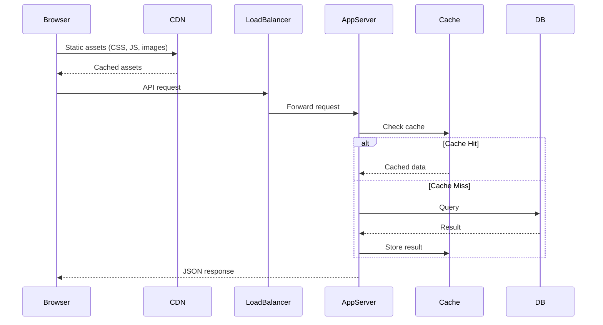
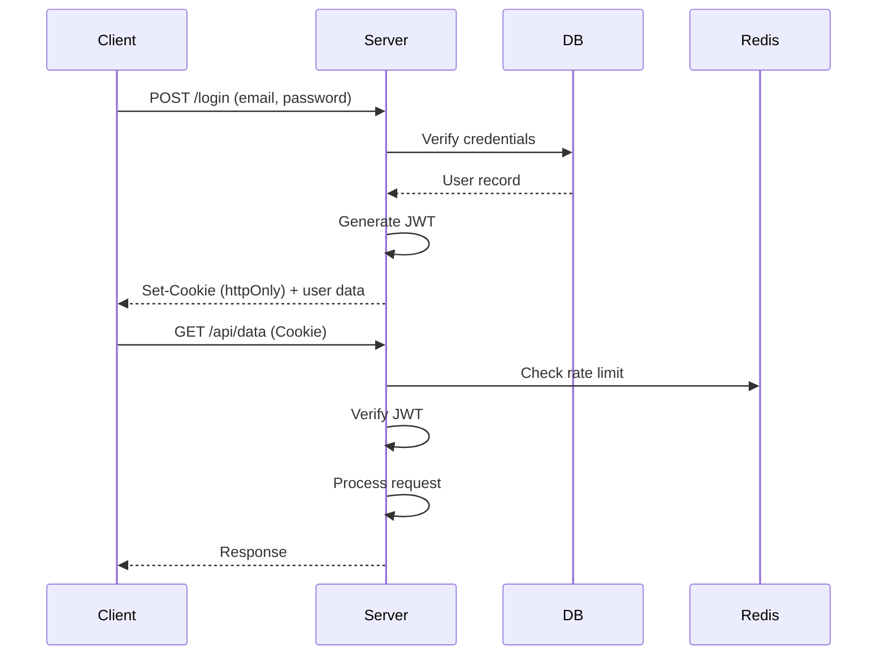
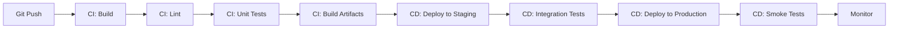

## Introduction

Full-stack development encompasses the entire web application stack — from the user interface to the server, database, and deployment infrastructure. Full-stack engineers bridge frontend and backend, understanding how each layer interacts to deliver complete products. This requires versatility across multiple technologies, architectural thinking, and the ability to make informed trade-off decisions.

This guide covers full-stack architecture, API design, database selection, deployment strategies, DevOps basics, security considerations, performance optimization, full-stack project ideas, and common full-stack interview questions. A strong full-stack engineer can build an entire application from concept to deployment while making sound technical decisions at every layer.

---

## Learning Roadmap

### Phase 1: Frontend Foundations (Weeks 1-6)
- HTML5, CSS3, JavaScript fundamentals
- React or Vue.js fundamentals
- State management and routing
- Responsive design and CSS layout
- Basic testing

### Phase 2: Backend Foundations (Weeks 7-12)
- Node.js/Express or Python/Django
- RESTful API design
- Database design and SQL
- Authentication and authorization
- File storage and upload

### Phase 3: Integration (Weeks 13-16)
- Full-stack project (frontend + backend + database)
- Authentication flow end-to-end
- Deployment to cloud platforms
- CI/CD pipeline setup
- Error handling and logging

### Phase 4: Advanced (Weeks 17-24)
- System design for full-stack apps
- Microservices architecture
- DevOps and containerization
- Performance optimization
- Security hardening
- Real-time features (WebSockets)

---

## Theory Notes

### Full-Stack Architecture

#### Traditional Monolith
```
Client (Browser)
    ↓ HTTP
Web Server (Nginx/Apache)
    ↓
Application Server (Node.js/Python/Java)
    ↓
Database (PostgreSQL/MySQL)
```

#### Modern Full-Stack
```
Client (React SPA / Next.js)
    ↓ HTTPS
CDN (CloudFront/Cloudflare)
    ↓
API Gateway / Load Balancer
    ↓
Application Server(s)
    ↓                    ↓
Database              Cache
(PostgreSQL)          (Redis)
    ↓
Message Queue (RabbitMQ/Kafka)
    ↓
Worker Services
```

#### Next.js Full-Stack Architecture
```
Next.js App
├── Pages (SSR/SSG/ISR)
├── API Routes (Serverless Functions)
├── Server Components
├── Client Components
└── Middleware

Database → Prisma/Drizzle ORM → PostgreSQL
Cache → Redis
Auth → NextAuth.js / Clerk
Storage → S3 / Cloudinary
```

### Database Selection Guide

| Scenario | Recommended DB |
|----------|---------------|
| Relational data, ACID | PostgreSQL |
| Simple key-value | Redis |
| Document-oriented | MongoDB |
| Time-series data | TimescaleDB / InfluxDB |
| Graph relationships | Neo4j |
| Search | Elasticsearch |
| Serverless | DynamoDB / PlanetScale |
| SQLite for mobile/embedded | SQLite |

### API Design Patterns

#### RESTful API
```
Resources:
  /api/v1/users
  /api/v1/posts
  /api/v1/posts/:id/comments

Methods:
  GET    /api/v1/users         → List users
  POST   /api/v1/users         → Create user
  GET    /api/v1/users/:id     → Get user
  PUT    /api/v1/users/:id     → Update user
  DELETE /api/v1/users/:id     → Delete user
```

#### GraphQL
```graphql
type Query {
  user(id: ID!): User
  posts(limit: Int, offset: Int): [Post!]!
}

type Mutation {
  createPost(input: CreatePostInput!): Post!
}

type Subscription {
  postCreated: Post!
}
```

### Authentication Flow
```
1. User submits credentials (email + password)
2. Server validates credentials against database
3. Server generates JWT (access token + refresh token)
4. Client stores tokens (httpOnly cookie or secure storage)
5. Client sends JWT in Authorization header
6. Server validates JWT on each request
7. When access token expires, client uses refresh token
8. Server issues new access token
```

### Deployment Pipeline
```
Code Push → CI Build → Tests → Lint → Build → Deploy to Staging → Smoke Tests → Deploy to Production
```

---

## Key Concepts

### Server-Side Rendering (SSR) vs Client-Side Rendering (CSR)

| Aspect | CSR | SSR |
|--------|-----|-----|
| Initial Load | Slow (downloads JS, then renders) | Fast (sends rendered HTML) |
| SEO | Poor without additional setup | Excellent |
| Interactivity | After JS loads | After hydration |
| Server Cost | Low (static files) | Higher (per-request rendering) |
| Caching | CDN cacheable | Complex caching needed |
| Best For | SPAs, dashboards | Content-heavy, SEO-critical |

### Server Components vs Client Components (Next.js 13+)
```jsx
// Server Component (default in Next.js 13+)
// Runs only on the server, can directly access DB
async function BlogList() {
  const posts = await db.post.findMany(); // Direct DB access
  return (
    <ul>
      {posts.map(post => (
        <li key={post.id}>{post.title}</li>
      ))}
    </ul>
  );
}

// Client Component (interactive)
'use client';
function CommentForm() {
  const [text, setText] = useState('');
  return (
    <form onSubmit={(e) => { e.preventDefault(); submitComment(text); }}>
      <textarea value={text} onChange={(e) => setText(e.target.value)} />
      <button type="submit">Submit</button>
    </form>
  );
}
```

### Caching Strategies
- **Browser Cache**: HTTP headers (Cache-Control, ETag)
- **CDN Cache**: Edge caching for static assets and API responses
- **Application Cache**: In-memory caching (Node.js process)
- **Database Cache**: Query result caching
- **Redis Cache**: Distributed caching layer

### Error Handling Architecture
```
Frontend:
  try/catch → Error Boundaries → Global Error Handler → Error Reporting (Sentry)

Backend:
  Route Handler → Middleware Error Handler → Logger → Error Response

Database:
  Transaction Rollback → Retry Logic → Circuit Breaker
```

---

## FAQ (20+ Q&A)

### Q1: What is the difference between a full-stack engineer and a frontend/backend specialist?
**A:** Full-stack engineers work across the entire stack (frontend, backend, database, deployment). Specialists focus deeply on one area. Full-stack engineers are generalists who can build complete features; specialists provide deep expertise in their domain.

### Q2: What is the MERN stack?
**A:** MERN = MongoDB (database), Express.js (backend framework), React (frontend), Node.js (runtime). It uses JavaScript/TypeScript across the entire stack, simplifying development and enabling code sharing.

### Q3: What is the JAMstack?
**A:** JAMstack = JavaScript (client-side), APIs (serverless), Markup (pre-built HTML). It's an architecture where pages are pre-rendered and served from CDN, with dynamic functionality via APIs. Examples: Next.js, Gatsby, Netlify.

### Q4: What is serverless architecture?
**A:** Serverless lets you run code without managing servers. The cloud provider handles scaling, patching, and availability. You pay per execution. Examples: AWS Lambda, Vercel Functions, Cloudflare Workers. Great for APIs, webhooks, and event processing.

### Q5: What is the difference between SSR and SSG?
**A:** SSR (Server-Side Rendering) renders HTML on every request. SSG (Static Site Generation) generates HTML at build time. SSG is faster but less dynamic. ISR (Incremental Static Regeneration) combines both: static with periodic updates.

### Q6: How do you handle authentication in a full-stack app?
**A:** Use JWT tokens or session-based auth. Store tokens in httpOnly cookies (most secure) or memory. Implement refresh token rotation. Use middleware to protect routes. Consider OAuth 2.0 for third-party auth.

### Q7: What is the N+1 problem and how do you solve it?
**A:** N+1 occurs when you fetch a list and then make individual queries for related data. Solve with: SQL JOINs, eager loading (ORM), DataLoader pattern (GraphQL), or batch queries.

### Q8: What is optimistic UI?
**A:** Optimistic UI updates the interface immediately before the server responds. If the server request fails, the UI is rolled back. This makes the app feel faster. Implement with state management and error handling.

### Q9: How do you handle real-time features?
**A:** Use WebSockets for bidirectional communication, Server-Sent Events (SSE) for server-to-client updates, or polling (less efficient). Libraries: Socket.io, Pusher, Ably. For Next.js: Pusher + SWR with revalidation.

### Q10: What is a monorepo?
**A:** A monorepo stores multiple projects in a single repository. Benefits: shared code, atomic changes across projects, consistent tooling. Tools: Turborepo, Nx, Lerna. Trade-off: larger repo size and more complex CI/CD.

### Q11: How do you manage environment variables?
**A:** Use `.env` files for local development (never commit to git). Use platform environment variables for production (Vercel, Railway, AWS). Use `.env.example` to document required variables. Validate on app startup.

### Q12: What is API versioning and why is it important?
**A:** API versioning allows you to make breaking changes without breaking existing clients. Common approaches: URL versioning (/v1/), header versioning, query parameter versioning. URL versioning is most common.

### Q13: What is database migration?
**A:** Database migrations are version-controlled schema changes. They let you apply and rollback schema changes consistently across environments. Tools: Prisma Migrate, Alembic (Python), Flyway, Knex.js.

### Q14: How do you handle file uploads?
**A:** For small files: base64 encode in API request. For large files: presigned URLs (S3), multipart upload, or direct-to-storage upload with metadata in your API. Always validate file types and sizes.

### Q15: What is the difference between horizontal and vertical scaling?
**A:** Vertical scaling (scale up) adds more CPU/RAM to one server. Horizontal scaling (scale out) adds more servers. Vertical is simpler but has limits. Horizontal is more complex but scales further.

### Q16: How do you implement search functionality?
**A:** Simple: SQL LIKE queries or database full-text search. Medium: Algolia/Meilisearch. Complex: Elasticsearch. Consider: fuzzy matching, typo tolerance, faceted search, and relevance ranking.

### Q17: What is rate limiting and how do you implement it?
**A:** Rate limiting restricts the number of requests a client can make. Implement with: Redis (token bucket), middleware (express-rate-limit), or API gateway. Always return appropriate 429 status code.

### Q18: What is CORS and how do you handle it?
**A:** CORS restricts cross-origin requests. Backend must send `Access-Control-Allow-Origin` header. Configure in Express with cors middleware. For development, proxy API requests through the frontend dev server.

### Q19: How do you handle errors in a full-stack app?
**A:** Frontend: Error boundaries, try/catch, toast notifications. Backend: Error handling middleware, structured logging, error codes. Database: Transaction rollback, retry logic. Monitoring: Sentry, Datadog.

### Q20: What is the strangler fig pattern?
**A:** The strangler fig pattern incrementally replaces parts of a monolith with new services. New features are built as services; old features are gradually migrated. The monolith "strangles" itself until fully replaced.

### Q21: What is feature flagging?
**A:** Feature flags let you toggle features without deploying. Use for A/B testing, gradual rollouts, and dark launches. Tools: LaunchDarkly, Flagsmith, or custom implementation. Store flags in config or database.

---

## Hands-on Practice

### Practice Projects

#### 1. Blog Platform (Easy-Medium)
- User registration and login
- Create, edit, delete posts
- Comments on posts
- Responsive design
- **Tech**: Next.js, PostgreSQL, Prisma, NextAuth.js

#### 2. Task Management App (Medium)
- Project and task CRUD
- Drag-and-drop task board
- User invitations and roles
- Notifications
- **Tech**: React, Node.js, MongoDB, Socket.io

#### 3. E-commerce Platform (Medium-Hard)
- Product catalog with search/filter
- Shopping cart and checkout
- Payment processing (Stripe)
- Order management
- Admin dashboard
- **Tech**: Next.js, PostgreSQL, Stripe, S3

#### 4. Social Media Platform (Hard)
- User profiles and feeds
- Post creation with media
- Real-time messaging
- Notifications
- Follow/unfollow system
- **Tech**: Next.js, PostgreSQL, Redis, WebSockets, S3

### Code Snippets

#### Full-Stack Next.js API Route
```typescript
// app/api/posts/route.ts
import { NextResponse } from 'next/server';
import { getServerSession } from 'next-auth';
import { prisma } from '@/lib/prisma';
import { z } from 'zod';

const PostSchema = z.object({
  title: z.string().min(1).max(200),
  content: z.string().min(1),
  published: z.boolean().default(false),
});

export async function GET(request: Request) {
  const { searchParams } = new URL(request.url);
  const page = parseInt(searchParams.get('page') || '1');
  const limit = parseInt(searchParams.get('limit') || '10');

  const [posts, total] = await Promise.all([
    prisma.post.findMany({
      where: { published: true },
      include: { author: { select: { id: true, name: true } } },
      skip: (page - 1) * limit,
      take: limit,
      orderBy: { createdAt: 'desc' },
    }),
    prisma.post.count({ where: { published: true } }),
  ]);

  return NextResponse.json({
    data: posts,
    pagination: {
      page,
      limit,
      total,
      pages: Math.ceil(total / limit),
    },
  });
}

export async function POST(request: Request) {
  const session = await getServerSession();
  if (!session) {
    return NextResponse.json({ error: 'Unauthorized' }, { status: 401 });
  }

  const body = await request.json();
  const parsed = PostSchema.safeParse(body);

  if (!parsed.success) {
    return NextResponse.json(
      { error: parsed.error.issues },
      { status: 422 }
    );
  }

  const post = await prisma.post.create({
    data: {
      ...parsed.data,
      authorId: session.user.id,
    },
  });

  return NextResponse.json(post, { status: 201 });
}
```

#### Full-Stack Error Handling Middleware
```typescript
// lib/error-handler.ts
class AppError extends Error {
  constructor(
    message: string,
    public statusCode: number,
    public code: string,
    public isOperational = true
  ) {
    super(message);
  }
}

// Backend error handler
function errorHandler(err, req, res, next) {
  if (err.isOperational) {
    return res.status(err.statusCode).json({
      error: {
        code: err.code,
        message: err.message,
      },
    });
  }

  console.error('Unexpected error:', err);
  res.status(500).json({
    error: {
      code: 'INTERNAL_ERROR',
      message: 'An unexpected error occurred',
    },
  });
}

// Frontend error boundary
class ErrorBoundary extends React.Component {
  state = { error: null };

  static getDerivedStateFromError(error) {
    return { error };
  }

  componentDidCatch(error, errorInfo) {
    reportError(error, errorInfo);
  }

  render() {
    if (this.state.error) {
      return <ErrorFallback error={this.state.error} />;
    }
    return this.props.children;
  }
}
```

---

## FAANG Questions

### Google
1. Design a full-stack URL shortener. Cover the API, database, caching layer, analytics, and deployment architecture.
2. How would you build a collaborative document editor? Consider real-time sync, conflict resolution, offline support, and scaling.

### Meta
3. Design Facebook's news feed. Cover the API, ranking algorithm, fan-out on write vs read, and real-time updates.
4. Build a real-time chat application. Consider message ordering, delivery guarantees, and notification handling.

### Amazon
5. Design an e-commerce platform. Cover product catalog, search, cart, checkout, payment, and order management.
6. How would you design a microservices-based system for a large e-commerce site? Consider service boundaries, data ownership, and communication.

### Apple
7. Design iCloud Notes. Cover sync across devices, offline support, rich text, and sharing.
8. Build a photo management app. Cover upload, processing, storage, search, and sharing.

### Microsoft
9. Design Microsoft Teams. Cover messaging, video calls, file sharing, and notifications.
10. How would you build a Kanban board with real-time updates across multiple users?

### Netflix
11. Design Netflix's content management system. Cover video upload, processing, encoding, and CDN delivery.
12. Build a recommendation UI. Cover personalization, A/B testing, and performance.

---

## Common Mistakes

1. **Not separating concerns**: Mixing business logic with route handlers
2. **Ignoring security**: No input validation, SQL injection, XSS vulnerabilities
3. **No error handling**: Crashes without proper error responses
4. **Missing loading/error states**: Users don't know what's happening
5. **Not testing**: No unit, integration, or E2E tests
6. **Hardcoding values**: Magic numbers, hardcoded URLs, no config management
7. **No caching strategy**: Everything hits the database directly
8. **Ignoring performance**: No pagination, no optimization, no monitoring
9. **No deployment pipeline**: Manual deployments are error-prone
10. **Not monitoring**: No logging, metrics, or alerting in production
11. **Over-engineering**: Building microservices when a monolith would suffice
12. **Neglecting documentation**: API and code should be self-documenting

---

## Best Practices

### Architecture
- Start with a monolith, extract services when needed
- Use a layered architecture (Controller → Service → Repository)
- Separate business logic from HTTP concerns
- Design for failure (circuit breakers, retries, fallbacks)
- Use dependency injection for testability

### Database
- Design schema before writing code (migrations)
- Use ORMs for CRUD; raw SQL for complex queries
- Add indexes for frequently queried columns
- Use connection pooling
- Implement soft deletes for data recovery

### API
- Use consistent naming conventions
- Version your APIs
- Implement pagination for list endpoints
- Return meaningful error messages
- Document with OpenAPI/Swagger

### Frontend
- Use component libraries for consistency
- Implement loading and error states
- Optimize images (WebP, lazy loading)
- Code-split routes
- Test user flows, not implementation

### DevOps
- Use CI/CD for automated deployments
- Containerize applications (Docker)
- Use infrastructure as code (Terraform)
- Monitor with logging, metrics, and tracing
- Implement blue-green or canary deployments

---

## Cheat Sheet

### Full-Stack Tech Stack Options
```
Option 1 (JavaScript):
  Frontend: React/Next.js
  Backend: Node.js/Express
  Database: PostgreSQL + Redis
  ORM: Prisma/Drizzle
  Auth: NextAuth.js/Clerk
  Deploy: Vercel/Railway

Option 2 (Python):
  Frontend: React/Vue
  Backend: Django/FastAPI
  Database: PostgreSQL
  ORM: SQLAlchemy
  Auth: Django Auth/Custom JWT
  Deploy: Render/Fly.io

Option 3 (TypeScript Full):
  Frontend: Next.js
  Backend: Next.js API Routes
  Database: PlanetScale/Supabase
  ORM: Prisma
  Auth: NextAuth.js
  Deploy: Vercel
```

### HTTP Status Codes
```
200 OK | 201 Created | 204 No Content
301 Moved | 304 Not Modified
400 Bad Request | 401 Unauthorized | 403 Forbidden
404 Not Found | 409 Conflict | 422 Validation
429 Rate Limited | 500 Server Error
```

### Authentication Quick Reference
```
JWT Flow:
  Login → Server validates → Issues JWT → Client stores → Sends in header → Server validates

Token Storage:
  httpOnly cookie (most secure) > localStorage (XSS vulnerable) > memory (lost on refresh)

Refresh Flow:
  Access token expires → Client sends refresh token → Server validates → Issues new access token
```

---

## Flash Cards (20)

### Card 1
**Q:** What is the difference between SQL and NoSQL databases?
**A:** SQL = relational, fixed schema, ACID, JOINs. NoSQL = non-relational, flexible schema, horizontal scaling. SQL for complex queries and transactions; NoSQL for flexibility and scale.

### Card 2
**Q:** What is server-side rendering (SSR)?
**A:** SSR renders the page on the server and sends complete HTML to the browser. Benefits: faster initial load, better SEO, works without JavaScript. Used by Next.js, Nuxt.js, Angular Universal.

### Card 3
**Q:** What is the purpose of middleware in Express.js?
**A:** Middleware functions have access to request, response, and next function. They can execute code, modify request/response, end the request cycle, or call next middleware. Used for auth, logging, validation.

### Card 4
**Q:** What is a RESTful API?
**A:** REST uses HTTP methods (GET, POST, PUT, DELETE) on resources identified by URLs. Key principles: statelessness, uniform interface, resource-based, layered system.

### Card 5
**Q:** What is CORS?
**A:** CORS (Cross-Origin Resource Sharing) restricts cross-origin HTTP requests. The server must send Access-Control-Allow-Origin headers to permit requests from other origins.

### Card 6
**Q:** What is database indexing?
**A:** An index is a data structure that speeds up queries by allowing fast lookups. Use indexes on columns in WHERE, JOIN, and ORDER BY. Trade-off: indexes speed reads but slow writes.

### Card 7
**Q:** What is the purpose of Docker?
**A:** Docker containers package applications with their dependencies for consistent deployment. Benefits: reproducible builds, isolated environments, easy scaling, works across platforms.

### Card 8
**Q:** What is a reverse proxy?
**A:** A reverse proxy sits between clients and servers, forwarding requests to appropriate backends. Benefits: SSL termination, load balancing, caching, rate limiting, security.

### Card 9
**Q:** What is connection pooling?
**A:** Connection pooling maintains reusable database connections. Creating connections is expensive. Pooling reduces overhead and limits concurrent connections to the database.

### Card 10
**Q:** What is the difference between authentication and authorization?
**A:** Authentication confirms identity (who you are). Authorization determines permissions (what you can do). Authentication before authorization.

### Card 11
**Q:** What is a health check endpoint?
**A:** A health check reports service status. Liveness = is the service running? Readiness = can it handle requests? Used by load balancers and orchestrators for routing decisions.

### Card 12
**Q:** What is optimistic concurrency control?
**A:** Optimistic concurrency assumes conflicts are rare. Reads don't lock data. On write, check if data changed since read. If changed, reject or merge. Used for high-concurrency, low-conflict scenarios.

### Card 13
**Q:** What is a CDN?
**A:** A Content Delivery Network caches static assets at edge locations worldwide. Benefits: lower latency, reduced server load, better reliability. Examples: CloudFront, Cloudflare, Fastly.

### Card 14
**Q:** What is pagination?
**A:** Pagination splits large result sets into pages. Two types: offset-based (page numbers, simpler) and cursor-based (pointers, more efficient for large datasets).

### Card 15
**Q:** What is a monorepo?
**A:** A monorepo stores multiple projects in one repository. Benefits: shared code, atomic changes, consistent tooling. Tools: Turborepo, Nx, Lerna. Trade-off: larger repo, complex CI/CD.

### Card 16
**Q:** What is the difference between horizontal and vertical scaling?
**A:** Vertical = add more resources to one server. Horizontal = add more servers. Vertical is simpler; horizontal is more scalable but adds complexity.

### Card 17
**Q:** What is CI/CD?
**A:** CI (Continuous Integration) automatically builds and tests code on every commit. CD (Continuous Deployment/Delivery) automatically deploys passing builds. Together they reduce deployment risk.

### Card 18
**Q:** What is rate limiting?
**A:** Rate limiting restricts the number of requests per client in a time period. Prevents abuse and protects backend. Return 429 Too Many Requests status code.

### Card 19
**Q:** What is a message queue?
**A:** A message queue enables async communication between services. Producers publish messages; consumers process them. Benefits: decoupling, load leveling, fault tolerance.

### Card 20
**Q:** What is the strangler fig pattern?
**A:** The strangler fig pattern incrementally replaces a monolith with new services. New features built as services; old features gradually migrated. The monolith "strangles" itself over time.

---

## Mind Map

```
Full-Stack Development
├── Frontend
│   ├── Frameworks (React, Vue, Angular)
│   ├── State Management
│   ├── Styling (CSS, Tailwind, CSS-in-JS)
│   ├── Testing (Jest, RTL, Cypress)
│   └── Performance (Code Splitting, Lazy Loading)
├── Backend
│   ├── Frameworks (Express, Django, FastAPI)
│   ├── API Design (REST, GraphQL)
│   ├── Authentication (JWT, OAuth, Sessions)
│   ├── Error Handling
│   └── Testing (Unit, Integration)
├── Database
│   ├── SQL (PostgreSQL, MySQL)
│   ├── NoSQL (MongoDB, Redis)
│   ├── ORMs (Prisma, SQLAlchemy)
│   └── Caching (Redis, CDN)
├── DevOps
│   ├── CI/CD (GitHub Actions, GitLab CI)
│   ├── Containerization (Docker)
│   ├── Orchestration (Kubernetes)
│   ├── IaC (Terraform, Pulumi)
│   └── Monitoring (Grafana, Datadog)
├── Architecture
│   ├── Monolith
│   ├── Microservices
│   ├── Serverless
│   └── Event-Driven
├── Security
│   ├── HTTPS
│   ├── CORS
│   ├── Input Validation
│   ├── SQL Injection Prevention
│   └── XSS Prevention
└── Performance
    ├── Caching
    ├── CDN
    ├── Database Optimization
    ├── Lazy Loading
    └── Monitoring
```

---

## Mermaid Diagrams

### Full-Stack Request Flow


### Authentication Flow


### Deployment Pipeline


---

## Code Examples

### Complete Full-Stack Task Manager

#### Database Schema (Prisma)
```prisma
// schema.prisma
model User {
  id        String   @id @default(cuid())
  email     String   @unique
  name      String
  password  String
  tasks     Task[]
  createdAt DateTime @default(now())
}

model Task {
  id          String   @id @default(cuid())
  title       String
  description String?
  status      String   @default("TODO")
  priority    String   @default("MEDIUM")
  dueDate     DateTime?
  assigneeId  String
  assignee    User     @relation(fields: [assigneeId], references: [id])
  createdAt   DateTime @default(now())
  updatedAt   DateTime @updatedAt

  @@index([assigneeId, status])
}
```

#### API Routes
```typescript
// app/api/tasks/route.ts
import { NextResponse } from 'next/server';
import { prisma } from '@/lib/prisma';

export async function GET(request: Request) {
  const { searchParams } = new URL(request.url);
  const status = searchParams.get('status');
  const assigneeId = searchParams.get('assigneeId');

  const tasks = await prisma.task.findMany({
    where: {
      ...(status && { status }),
      ...(assigneeId && { assigneeId }),
    },
    include: { assignee: { select: { id: true, name: true, email: true } } },
    orderBy: { updatedAt: 'desc' },
  });

  return NextResponse.json(tasks);
}

export async function POST(request: Request) {
  const body = await request.json();
  const task = await prisma.task.create({
    data: {
      title: body.title,
      description: body.description,
      status: body.status || 'TODO',
      priority: body.priority || 'MEDIUM',
      dueDate: body.dueDate ? new Date(body.dueDate) : null,
      assigneeId: body.assigneeId,
    },
    include: { assignee: true },
  });

  return NextResponse.json(task, { status: 201 });
}

export async function PATCH(request: Request) {
  const { id, ...updates } = await request.json();
  const task = await prisma.task.update({
    where: { id },
    data: updates,
    include: { assignee: true },
  });

  return NextResponse.json(task);
}

export async function DELETE(request: Request) {
  const { id } = await request.json();
  await prisma.task.delete({ where: { id } });
  return NextResponse.json({ success: true });
}
```

#### React Frontend Component
```tsx
'use client';
import { useState, useEffect } from 'react';

interface Task {
  id: string;
  title: string;
  description?: string;
  status: string;
  priority: string;
  assignee: { id: string; name: string; email: string };
}

export default function TaskBoard() {
  const [tasks, setTasks] = useState<Task[]>([]);
  const [filter, setFilter] = useState('ALL');

  useEffect(() => {
    fetchTasks();
  }, []);

  async function fetchTasks() {
    const res = await fetch('/api/tasks');
    const data = await res.json();
    setTasks(data);
  }

  async function updateTaskStatus(id: string, status: string) {
    await fetch('/api/tasks', {
      method: 'PATCH',
      headers: { 'Content-Type': 'application/json' },
      body: JSON.stringify({ id, status }),
    });
    setTasks(tasks.map(t => t.id === id ? { ...t, status } : t));
  }

  const columns = ['TODO', 'IN_PROGRESS', 'DONE'];
  const filteredTasks = filter === 'ALL' ? tasks : tasks.filter(t => t.status === filter);

  return (
    <div className="task-board">
      {columns.map(col => (
        <div key={col} className="column">
          <h2>{col.replace('_', ' ')}</h2>
          {filteredTasks.filter(t => t.status === col).map(task => (
            <div key={task.id} className="task-card">
              <h3>{task.title}</h3>
              <p>{task.assignee.name}</p>
              <span className={`priority ${task.priority.toLowerCase()}`}>
                {task.priority}
              </span>
            </div>
          ))}
        </div>
      ))}
    </div>
  );
}
```

---

## Projects

### Project 1: Personal Blog (Easy-Medium)
- Static generation for posts
- Admin dashboard for editing
- Comments system
- **Tech**: Next.js, MDX, PostgreSQL

### Project 2: Chat Application (Medium)
- Real-time messaging
- User authentication
- File sharing
- Read receipts
- **Tech**: Next.js, Socket.io, Redis, PostgreSQL

### Project 3: E-commerce Platform (Hard)
- Product catalog with search
- Cart and checkout
- Payment processing
- Order management
- Admin panel
- **Tech**: Next.js, Stripe, S3, PostgreSQL

### Project 4: Project Management Tool (Expert)
- Kanban boards
- Real-time collaboration
- Time tracking
- Reports and analytics
- **Tech**: Next.js, WebSockets, PostgreSQL, Redis

---

## Resources

### Documentation
- [Next.js Docs](https://nextjs.org/docs)
- [Prisma Docs](https://prisma.io/docs)
- [Vercel Docs](https://vercel.com/docs)
- [PostgreSQL Docs](https://postgresql.org/docs)

### Books
- *Full-Stack React, TypeScript, and Node* by David Choi
- *The Road to Next* by Robin Wieruch
- *Designing Data-Intensive Applications* by Martin Kleppmann

### Practice
- [FullStackOpen](https://fullstackopen.com)
- [Build a SaaS App](https://shipfa.st)
- [Egghead.io Full-Stack Courses](https://egghead.io)

---

## Checklist

### Before Your Full-Stack Interview
- [ ] Can design and implement a REST API from scratch
- [ ] Understand database schema design and normalization
- [ ] Know authentication flow (JWT, OAuth) end-to-end
- [ ] Can build both frontend and backend components
- [ ] Understand deployment and CI/CD
- [ ] Can discuss trade-offs between architectural decisions
- [ ] Familiar with Docker and basic DevOps
- [ ] Know caching strategies and when to use them
- [ ] Can implement error handling across the stack
- [ ] Understand security best practices
- [ ] Can discuss system design for full-stack apps
- [ ] Familiar with testing strategies (unit, integration, E2E)
- [ ] Can explain database indexing and optimization
- [ ] Know when to use SQL vs NoSQL
- [ ] Can discuss performance optimization

---

## Difficulty Rating

| Topic | Difficulty | Interview Frequency |
|-------|-----------|-------------------|
| REST API Design | ★★☆☆☆ | Very High |
| Database Schema | ★★★☆☆ | Very High |
| Authentication | ★★★☆☆ | Very High |
| CRUD Implementation | ★★☆☆☆ | Very High |
| Error Handling | ★★★☆☆ | High |
| Deployment | ★★★☆☆ | High |
| Caching | ★★★☆☆ | High |
| System Design | ★★★★☆ | High |
| Microservices | ★★★★★ | Medium |
| CI/CD | ★★★☆☆ | Medium |
| Docker | ★★★☆☆ | Medium |
| Real-time Features | ★★★★☆ | Medium |
| Performance | ★★★★☆ | Medium |

---

## Summary

Full-stack development requires breadth across the entire web stack and depth in key areas. Key takeaways:

1. **End-to-end thinking** — understand how frontend, backend, and database interact
2. **API design is communication** — well-designed APIs make frontend development easier
3. **Database design drives architecture** — schema decisions have long-lasting impact
4. **Security is a full-stack concern** — validate on client AND server, hash passwords, use HTTPS
5. **Start simple, iterate** — monolith first, extract when needed
6. **Test across the stack** — unit tests for logic, integration for APIs, E2E for user flows
7. **Deploy with confidence** — CI/CD, staging environments, monitoring
8. **Performance matters at every layer** — caching, optimization, and profiling
9. **Stay versatile** — technologies change; principles endure
10. **Build real projects** — the best learning comes from building complete applications
