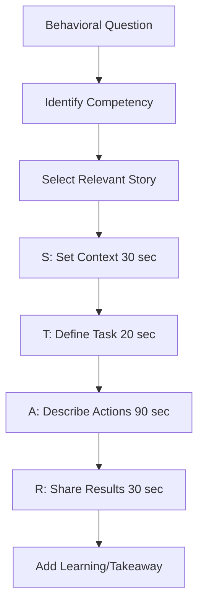
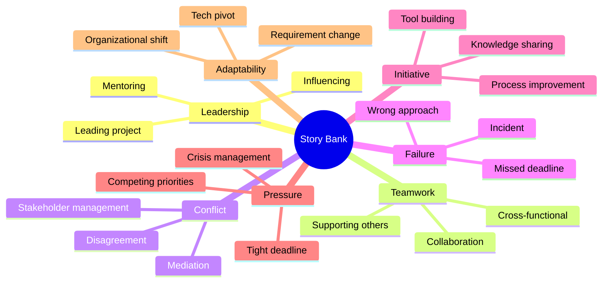
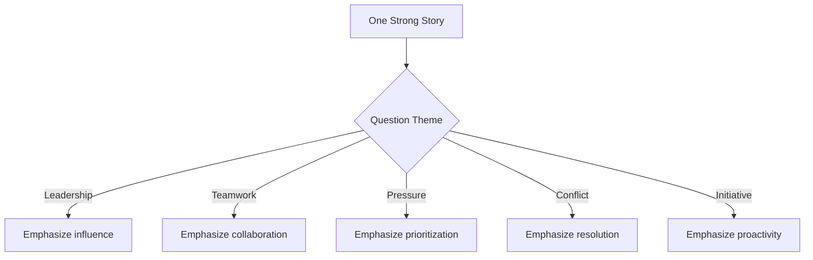

## Introduction

The STAR method is the gold standard framework for answering behavioral interview questions. It provides a structured way to communicate your experiences through specific, compelling stories. STAR stands for Situation, Task, Action, and Result — ensuring your answers are clear, concise, and impactful.

Mastering the STAR method transforms vague, rambling answers into focused narratives that demonstrate your competencies. This guide covers the framework in depth, building your story bank, tailoring stories to questions, common mistakes, practice exercises, example stories, and advanced storytelling techniques.

---

## Learning Roadmap

### Phase 1: Understanding (Days 1-2)
- Learn the STAR framework components
- Study examples of strong STAR responses
- Identify the competencies companies evaluate
- Begin reflecting on your career experiences

### Phase 2: Story Development (Days 3-5)
- Write 15 STAR stories covering different themes
- Ensure each story has quantifiable results
- Practice telling stories in 2-3 minutes
- Map stories to common behavioral questions

### Phase 3: Advanced Practice (Days 6-8)
- Practice adapting stories to different questions
- Work on delivery and naturalness
- Conduct mock interviews
- Record yourself and review

---

## Theory Notes

### The STAR Framework

#### S — Situation (Set the Stage)
- Brief context: where, when, what was happening
- Keep it short — 2-3 sentences maximum
- Provide enough context for the story to make sense
- Avoid excessive background information

**Good**: "At my previous company, our payment processing API was experiencing 5-second response times during peak hours, causing a 15% cart abandonment rate."

**Bad**: "Let me tell you about my company. We were founded in 2015 and had grown to about 200 employees. We had multiple products, and the one I was working on was the e-commerce platform, which was built using Node.js and PostgreSQL..."

#### T — Task (Define Your Responsibility)
- What was your specific role or challenge?
- What was expected of you?
- What constraints did you face?

**Good**: "I was responsible for diagnosing and fixing the performance issue, with a target of reducing response times to under 500ms within 2 weeks."

**Bad**: "The team needed to figure out what was going on with the API."

#### A — Action (Describe What YOU Did)
This is the most critical section — it's where the interviewer assesses YOUR abilities:
- Use "I" statements, not "we"
- Describe your specific steps in order
- Explain your reasoning and decision-making
- Show the skills you applied
- Include obstacles you overcame
- This should be the longest part of your answer (45-60%)

**Good**: "I started by profiling the API endpoints and identified that 80% of the time was spent on database queries. Using EXPLAIN ANALYZE, I found several N+1 queries. I rewrote them as efficient JOINs, added composite indexes for frequently queried columns, and implemented Redis caching for the top 10 endpoints. When the caching layer introduced stale data issues, I implemented TTL-based invalidation."

**Bad**: "We looked into it and fixed some database stuff and added caching."

#### R — Result (Share the Outcome)
- Quantifiable metrics (%, $, time, users)
- What you learned
- Long-term impact
- How it benefited the team or organization

**Good**: "Response times dropped from 5 seconds to 180ms — a 96% improvement. Cart abandonment decreased by 12%, translating to $300K in recovered annual revenue. The optimization patterns I documented became a reference for the engineering team."

**Bad**: "It got faster and the team was happy."

### Building Your Story Bank

Create a document with 15 stories organized by theme:

```
Theme: Leadership (3 stories)
Theme: Teamwork (3 stories)
Theme: Conflict Resolution (2 stories)
Theme: Failure/Learning (2 stories)
Theme: Initiative (2 stories)
Theme: Working Under Pressure (2 stories)
Theme: Adaptability (1 story)
```

Each story should be 2-3 minutes when told aloud.

### Adapting Stories to Questions

One well-crafted story can answer 3-5 different questions:

**Story**: You led a cross-functional project with tight deadlines.

- **Leadership**: Emphasize your influence and decision-making
- **Teamwork**: Emphasize collaboration across teams
- **Pressure**: Emphasize prioritization and delivery under deadline
- **Conflict**: If there was disagreement, emphasize resolution
- **Initiative**: If you started the project, emphasize proactivity

---

## Key Concepts

### Quantifying Results

Metrics make your stories memorable and credible:

| Category | Examples |
|----------|---------|
| **Revenue** | "Increased revenue by 15%", "Saved $200K annually" |
| **Performance** | "Reduced latency from 2s to 200ms", "99.9% uptime" |
| **Efficiency** | "Cut deployment time from 2 hours to 15 minutes" |
| **Quality** | "Reduced production bugs by 60%", "95% test coverage" |
| **Scale** | "Handled 10x traffic during launch", "1M daily active users" |
| **Users** | "Improved retention by 25%", "Onboarded 500 enterprise clients" |
| **Time** | "Saved 20 hours per week", "Reduced onboarding time by 50%" |

### Common Story Themes

#### Leadership
- Mentoring a junior developer who was struggling
- Proposing a technical initiative and getting buy-in
- Leading a project through a crisis
- Influencing a decision without formal authority
- Building consensus among stakeholders

#### Teamwork
- Collaborating with a difficult colleague
- Working across departments on a cross-functional project
- Supporting a teammate during their personal challenge
- Sharing knowledge and elevating the team
- Taking on extra work to help the team meet a deadline

#### Conflict Resolution
- Disagreeing with a manager's technical decision
- Mediating between two team members
- Navigating competing priorities from different stakeholders
- Handling a client's unreasonable demands
- Resolving a misunderstanding with a colleague

#### Failure
- A deployment that caused an outage
- Missing a deadline due to underestimation
- A technical decision that didn't work out
- A miscommunication that caused a problem
- Not speaking up when you should have

#### Initiative
- Identifying a problem no one else noticed
- Building a tool to automate a manual process
- Proposing a new technology or approach
- Creating documentation that became company-wide
- Organizing knowledge-sharing sessions

---

## FAQ (20+ Q&A)

### Q1: How long should each STAR component take?
**A:** Situation: 15-20%, Task: 10-15%, Action: 45-55%, Result: 15-20%. For a 2-3 minute answer: Situation (~30 sec), Task (~20 sec), Action (~90 sec), Result (~30 sec).

### Q2: What if I don't have a professional example?
**A:** You can use volunteer work, academic projects, personal projects, or community involvement. What matters is the behavior and lesson, not the professional context.

### Q3: Can I use stories from early in my career?
**A:** Yes, especially if they demonstrate fundamental skills. However, recent stories (last 2-3 years) are generally more relevant and impressive. Mix early and recent stories.

### Q4: How do I know which story to use for which question?
**A:** Read the question carefully and identify the competency being assessed. Map it to your most relevant story. Have 2-3 stories for each major competency so you have options.

### Q5: What if the interviewer asks follow-up questions?
**A:** Be prepared to dive deeper into any part of your story. Think about alternative approaches you considered, what you'd do differently, and what you learned beyond the obvious.

### Q6: Should I memorize my stories?
**A:** Know your stories well enough to tell them naturally, but don't memorize word-for-word. Memorized stories sound robotic. Know the key points and let the delivery be conversational.

### Q7: How do I handle a question I'm completely unprepared for?
**A:** Take a moment to think. Say "That's a great question — let me think about the closest example I have." Then use your most versatile story and adapt it to the question.

### Q8: Can one story answer multiple questions?
**A:** Absolutely. One strong story about leading a difficult project can answer questions about leadership, teamwork, pressure, and conflict — depending on which aspect you emphasize.

### Q9: What if I made a mistake in the story?
**A:** That's often the most powerful type of story! It shows self-awareness, accountability, and growth. Focus on what you learned and how you've changed your approach since.

### Q10: How do I make stories feel natural, not rehearsed?
**A:** Practice until the key points are second nature, but let the delivery be conversational. Use natural transitions. Make eye contact. Pause when appropriate. Tell it like you're sharing with a friend.

### Q11: What if my result wasn't impressive?
**A:** Focus on what you learned and the process. Even small wins can be impressive if you show structured thinking and growth. "I saved the team 5 hours per week" is still valuable.

### Q12: How many stories should I prepare?
**A:** 15 stories covering all major competencies. This gives you enough variety to answer any behavioral question. Each story should be adaptable to 2-4 different questions.

### Q13: Should I use exact numbers or estimates?
**A:** Exact numbers are best when you have them. If you can only estimate, that's fine — be transparent. "Approximately 30%" or "roughly $100K" is better than no metric at all.

### Q14: What if the interviewer doesn't use behavioral questions?
**A:** Even if they don't explicitly ask behavioral questions, you can weave STAR stories into your answers to any question. Specific examples are always more compelling than general statements.

### Q15: How do I handle "Tell me about a time you had to..."?
**A:** This is a direct STAR question. Briefly set the situation, define your task, describe your actions in detail, and share the quantifiable result. Keep it under 3 minutes.

### Q16: What if my story involves confidential information?
**A:** You can generalize without revealing specifics. "At a Fortune 500 company..." instead of naming the company. Describe the challenge and your actions without revealing trade secrets.

### Q17: How do I practice telling stories?
**A:** Record yourself, practice with a friend, use mock interview platforms, and review your answers. Time each story. Focus on clarity, conciseness, and natural delivery.

### Q18: Can I use a team achievement as my story?
**A:** Yes, but focus on YOUR contribution. Describe what the team achieved, then specify what YOU did. "The team reduced bugs by 60%, and I personally led the initiative by..."

### Q19: What makes a story compelling?
**A:** Specificity, conflict, resolution, quantifiable results, and genuine emotion. The best stories have a moment of tension or challenge that you overcame through your actions.

### Q20: How do I handle a question about a very old experience?
**A:** If it's your best example, use it but acknowledge the timeframe. "Early in my career, I learned an important lesson..." shows growth and self-awareness.

---

## Hands-on Practice

### Practice Exercise 1: Story Development

Write a complete STAR story for this prompt:

**Prompt**: Tell me about a time you had to make a quick decision under pressure.

**Template**:
```
SITUATION:
_______________________________________________

TASK:
_______________________________________________

ACTION:
1. First, I...
2. Then, I...
3. When [obstacle], I...
4. I also...
_______________________________________________

RESULT:
_______________________________________________
```

### Practice Exercise 2: Story Adaptation

Take one of your stories and adapt it to answer these three questions:
1. Tell me about a time you showed leadership
2. Describe a situation where you had to influence others
3. Give me an example of when you went above and beyond

### Practice Exercise 3: Timed Practice

Time yourself telling each story. If it's over 3 minutes, cut context and focus on Action and Result. If it's under 2 minutes, add more detail to the Action portion.

### Practice Exercise 4: Follow-Up Resilience

Have a friend ask follow-up questions about your stories:
- "What would you have done differently?"
- "How did others react?"
- "What would you do now?"
- "What was the most difficult part?"

---

## FAANG Behavioral Questions

### Google
1. Tell me about a time you had to make a decision with incomplete information.
2. Describe a time you had to influence without authority.
3. How do you handle ambiguity?
4. Tell me about a time you improved a process that was "good enough."

### Meta
5. Move fast — tell me about a time you balanced speed with quality.
6. Describe a time you had to pivot quickly.
7. Tell me about a time you took a bold approach.

### Amazon (Leadership Principles)
8. Tell me about a time you prioritized customer needs. (Customer Obsession)
9. Describe when you made a decision based on data, not opinion. (Insist on Highest Standards)
10. Tell me about a time you simplified something complex. (Invent and Simplify)
11. Describe a time you delivered results despite constraints. (Deliver Results)

### Apple
12. Tell me about a time you paid extreme attention to detail.
13. Describe a time you pushed for a higher quality standard.
14. How do you handle working under secrecy constraints?

### Microsoft
15. Tell me about a time you helped a colleague succeed.
16. Describe a time you had to make a trade-off.
17. How do you stay current with technology trends?

---

## Common Mistakes

1. **Too much context**: Spending 60% of the time on Situation/Task
2. **Using "we"**: Hiding your individual contribution
3. **No metrics**: Missing quantifiable results
4. **Rambling**: Going over 4 minutes
5. **Negative tone**: Blaming others or speaking poorly of former companies
6. **Over-rehearsing**: Sounding robotic or memorized
7. **Wrong story**: Using a story that doesn't answer the question
8. **No learning**: Missing what you gained from the experience
9. **Hypothetical**: Speaking in generalities instead of specific examples
10. **Missing the "why"**: Not explaining your reasoning

---

## Best Practices

### Story Development
- Choose stories with clear, positive outcomes
- Include conflict or challenge (makes stories compelling)
- Quantify results wherever possible
- Show a range of competencies across stories
- Include stories from different roles and companies

### Delivery Tips
- Speak at a moderate pace (not too fast)
- Use natural language and transitions
- Maintain eye contact
- Show enthusiasm for your work
- Pause briefly before answering to gather thoughts
- End stories with a clear conclusion

### Follow-Up Preparation
- Be ready to dive deeper into any part of your story
- Have alternative approaches ready
- Be prepared to discuss what you'd do differently
- Know the lessons you learned

---

## Cheat Sheet

### STAR Method Template
```
SITUATION (20-30 sec):
"In my role at [Company], [brief context of what was happening]"

TASK (15-20 sec):
"I was responsible for [specific challenge or goal]"

ACTION (60-90 sec):
"First, I [step 1]. Then, I [step 2]. 
When [obstacle], I [how I handled it].
I used [skill/tool] to [specific action].
Finally, I [final step]."

RESULT (20-30 sec):
"As a result, [quantifiable outcome]. 
This led to [broader impact]. 
I learned [lesson or growth]"
```

### Story Bank Checklist
```
□ Leadership (3 stories)
□ Teamwork (3 stories)
□ Conflict Resolution (2 stories)
□ Failure/Learning (2 stories)
□ Initiative (2 stories)
□ Working Under Pressure (2 stories)
□ Adaptability (1 story)
Total: 15 stories
Each story: 2-3 minutes
Each story: quantifiable results
Each story: adaptable to 3+ questions
```

### Question-Story Mapping
```
"Tell me about a time when..."
  → Direct behavioral → Use most relevant STAR story

"Give me an example of..."
  → Specific instance → Use most relevant STAR story

"How do you handle..."
  → Approach + example → Describe philosophy, then STAR story

"What would you do if..."
  → Hypothetical → Describe approach based on past experience

"Describe a situation where..."
  → Context-driven → Use most relevant STAR story
```

---

## Flash Cards (20)

### Card 1
**Q:** What does STAR stand for?
**A:** Situation (context), Task (your responsibility), Action (what YOU did), Result (outcome with metrics). The framework structures behavioral interview responses.

### Card 2
**Q:** Which STAR component should take the most time?
**A:** Action — it should be 45-55% of your answer. This is where you describe YOUR specific steps, reasoning, and skills. It's what the interviewer is most interested in.

### Card 3
**Q:** How long should a STAR response be?
**A:** 2-3 minutes total. Situation (~30 sec), Task (~20 sec), Action (~90 sec), Result (~30 sec). If over 4 minutes, you're providing too much context.

### Card 4
**Q:** Why is using "I" instead of "we" important?
**A:** The interviewer is assessing YOU, not your team. Use "I" to describe YOUR contributions. Acknowledge the team but always follow with what YOU specifically did.

### Card 5
**Q:** What makes a STAR story compelling?
**A:** Specificity, conflict/challenge, quantifiable results, and genuine emotion. The best stories have a moment of tension that you overcame through your actions.

### Card 6
**Q:** How many STAR stories should you prepare?
**A:** 15 stories covering leadership, teamwork, conflict, failure, initiative, pressure, and adaptability. Each story should answer 3-4 different questions.

### Card 7
**Q:** What should you do if the interviewer asks a follow-up question?
**A:** Be prepared to dive deeper into any part of your story. Think about alternative approaches, what you'd do differently, and additional lessons learned.

### Card 8
**Q:** How do you handle a question you're completely unprepared for?
**A:** Take a moment to think. "That's a great question — let me think about the closest example I have." Then adapt your most versatile story.

### Card 9
**Q:** Can you use the same story for different questions?
**A:** Yes, one strong story can answer 3-5 different questions. Just emphasize different aspects: leadership, teamwork, pressure, etc.

### Card 10
**Q:** What if your story doesn't have a perfect outcome?
**A:** That's often the most powerful type! Show accountability, learning, and growth. "I learned X and have applied it to Y since then."

### Card 11
**Q:** How do you quantify results when you don't have exact numbers?
**A:** Use estimates with transparency: "approximately," "roughly," "about." Qualitative results work too: "adopted team-wide," "reduced complaints significantly."

### Card 12
**Q:** What's the most common STAR method mistake?
**A:** Spending too much time on Situation/Task and not enough on Action. The interviewer wants to know what YOU did, not what was happening around you.

### Card 13
**Q:** Should you memorize your STAR stories?
**A:** Know the key points well enough to tell them naturally, but don't memorize word-for-word. Memorized stories sound robotic. Let delivery be conversational.

### Card 14
**Q:** How do you practice STAR stories?
**A:** Record yourself, time each story (under 3 min), practice with a friend, review for filler words, and ensure each story has quantifiable results.

### Card 15
**Q:** Can you use personal experiences for STAR stories?
**A:** Professional experiences are preferred, but volunteer, academic, or personal projects are acceptable. The behavior and lesson matter more than the context.

### Card 16
**Q:** How do you handle "Tell me about yourself" with STAR?
**A:** Use a modified structure: Past (relevant background) → Present (current role and achievements) → Future (why this opportunity). Keep it under 90 seconds.

### Card 17
**Q:** What should you avoid in the Result section?
**A:** Avoid vague outcomes ("it went well"), blaming others, or claiming credit for team achievements. Focus on specific, quantifiable results that YOU contributed to.

### Card 18
**Q:** How do you make STAR stories feel natural?
**A:** Practice until key points are second nature. Use natural transitions. Make eye contact. Pause when appropriate. Tell it like you're sharing with a friend, not reciting.

### Card 19
**Q:** What if the interviewer interrupts your story?
**A:** Stop and listen. They may be redirecting you or asking for more detail on a specific part. Be flexible and follow their lead.

### Card 20
**Q:** How do you end a STAR story effectively?
**A:** End with the result and a brief lesson or takeaway. "This experience taught me the importance of X, and I've applied it to Y since then."

---

## Mind Map

```
STAR Method
├── S — Situation
│   ├── Brief context (2-3 sentences)
│   ├── Where, when, what
│   └── Set the stage
├── T — Task
│   ├── Your specific responsibility
│   ├── The challenge or goal
│   └── Constraints
├── A — Action
│   ├── YOUR specific steps (use "I")
│   ├── Reasoning and decisions
│   ├── Skills applied
│   ├── Obstacles overcome
│   └── Most important section
├── R — Result
│   ├── Quantifiable outcomes
│   ├── Broader impact
│   └── Lessons learned
├── Story Bank
│   ├── 15 stories total
│   ├── Themes: Leadership, Teamwork, Conflict, Failure, Initiative, Pressure
│   ├── Each story: 2-3 minutes
│   ├── Each story: quantifiable results
│   └── Each story: adaptable to 3+ questions
├── Delivery
│   ├── Moderate pace
│   ├── Natural language
│   ├── Eye contact
│   ├── Enthusiasm
│   └── Clear conclusion
└── Practice
    ├── Record yourself
    ├── Mock interviews
    ├── Timed practice
    └── Follow-up preparation
```

---

## Mermaid Diagrams

### STAR Method Response Flow


### Story Bank Coverage


### Story Adaptation Flow


---

## Code Examples

### Story Bank Template

```markdown
# My STAR Story Bank

## Story 1: Performance Optimization
**S**: Payment API had 5-second response times, causing 15% cart abandonment.
**T**: I was responsible for fixing it within 2 weeks.
**A**: Profiled endpoints, found N+1 queries, rewrote as JOINs, added indexes,
    implemented Redis caching, handled stale data with TTL invalidation.
**R**: Response time: 5s → 180ms (96% improvement). Cart abandonment: -12%.
    Revenue impact: $300K annually. Patterns became team reference.

## Story 2: Conflict Resolution
**S**: Two engineers disagreed on database approach for new feature.
**T**: As tech lead, I needed to facilitate a decision.
**A**: Created comparison matrix, structured meeting, asked probing questions,
    identified common ground, proposed hybrid approach.
**R**: Both agreed. Feature launched on time. Decision framework became
    template for future architecture discussions.

## Story 3: Failure and Learning
**S**: I deployed code causing 30-min outage affecting 10K users.
**T**: I needed to own the incident and prevent recurrence.
**A**: Immediate rollback, stakeholder communication, post-mortem leadership,
    implemented chaos engineering practices.
**R**: Zero similar outages in 18 months. 40 new test cases. Reliability
    improvement program launched org-wide.

## Story 4: Initiative
**S**: Deployment process took 2 hours, was error-prone.
**T**: I noticed it was blocking team velocity.
**A**: Researched CI/CD, proposed pipeline, got buy-in, implemented
    GitHub Actions with automated testing.
**R**: Deployment: 2 hours → 15 minutes. Error rate: -90%. Became model
    for other teams.

## Story 5: Leadership Without Authority
**S**: Team lacked coding standards, causing inconsistent code.
**T**: I wanted to establish practices without formal authority.
**A**: Created guidelines document, gathered feedback, organized code
    review sessions, set up automated linting.
**R**: Code review time: -30%. Onboarding: 2 weeks → 1 week. Guidelines
    adopted org-wide.
```

### Practice Tracker (Markdown)

```markdown
# STAR Practice Tracker

| # | Story | Theme | Time | Results? | Questions It Answers | Status |
|---|-------|-------|------|----------|---------------------|--------|
| 1 | Payment optimization | Leadership | 2:30 | Yes ($300K) | Leadership, Initiative, Pressure | ✓ |
| 2 | Database disagreement | Conflict | 2:45 | Yes (on time) | Conflict, Teamwork | ✓ |
| 3 | Production outage | Failure | 2:15 | Yes (zero recurrences) | Failure, Accountability | ✓ |
| 4 | CI/CD pipeline | Initiative | 2:20 | Yes (15 min deploy) | Initiative, Innovation | ✓ |
| 5 | Coding standards | Leadership | 2:10 | Yes (org-wide adoption) | Leadership, Teamwork | ✓ |

**Total stories: 15**
**Practice sessions: 8**
**Mock interviews: 3**
```

---

## Projects

### Project 1: Story Bank Development
- Write 15 complete STAR stories
- Include quantifiable results in each
- Map each story to 3+ potential questions
- Practice telling each in 2-3 minutes
- **Skills**: Self-reflection, narrative building

### Project 2: Mock Interview Series
- Conduct 5+ mock behavioral interviews
- Get feedback from different interviewers
- Record and review yourself
- Refine stories based on feedback
- **Skills**: Communication, delivery, confidence

### Project 3: Company-Specific Preparation
- Research each target company's values
- Map stories to company-specific competencies
- Prepare answers for company-specific questions
- Practice company-specific behavioral rounds
- **Skills**: Research, tailoring, strategic preparation

---

## Resources

### Books
- *Cracking the Coding Interview* by Gayle McDowell (behavioral section)
- *The STAR Interview* by Misha Yurchenko
- *Tell Me About Yourself* by Holley Murchison

### Online
- [interviewing.io](https://interviewing.io) — Mock interviews
- [Big Interview](https://biginterview.com) — STAR practice
- [Pramp](https://pramp.com) — Free peer interviews

---

## Checklist

### STAR Method Mastery
- [ ] Understand each STAR component and its purpose
- [ ] Written 15 stories covering all key themes
- [ ] Each story has quantifiable results
- [ ] Each story is 2-3 minutes when told aloud
- [ ] Each story can answer 3+ different questions
- [ ] Practiced delivery until natural
- [ ] Conducted 3+ mock interviews
- [ ] Recorded and reviewed myself
- [ ] Prepared for follow-up questions
- [ ] Can adapt stories to company-specific questions

---

## Difficulty Rating

| Topic | Difficulty | Interview Frequency |
|-------|-----------|-------------------|
| STAR Framework | ★☆☆☆☆ | Very High |
| Story Development | ★★☆☆☆ | Very High |
| Quantifying Results | ★★☆☆☆ | High |
| Story Adaptation | ★★★☆☆ | High |
| Delivery/Naturalness | ★★★☆☆ | High |
| Follow-Up Handling | ★★★☆☆ | Medium |
| Company-Specific | ★★★☆☆ | High |

---

## Summary

The STAR method is the most effective way to answer behavioral interview questions. Key takeaways:

1. **Structure is essential** — S-T-A-R ensures clear, concise responses
2. **Action is the most important part** — it's where you show YOUR abilities
3. **Use "I" not "we"** — the interviewer is assessing you
4. **Quantify results** — numbers make stories memorable and credible
5. **Prepare 15 stories** — they cover all competencies
6. **Practice until natural** — not memorized, but second nature
7. **Adapt to the question** — emphasize different aspects of the same story
8. **Show learning** — growth from experiences matters
9. **Keep it concise** — 2-3 minutes per story
10. **Be authentic** — genuine stories resonate more than perfect ones
